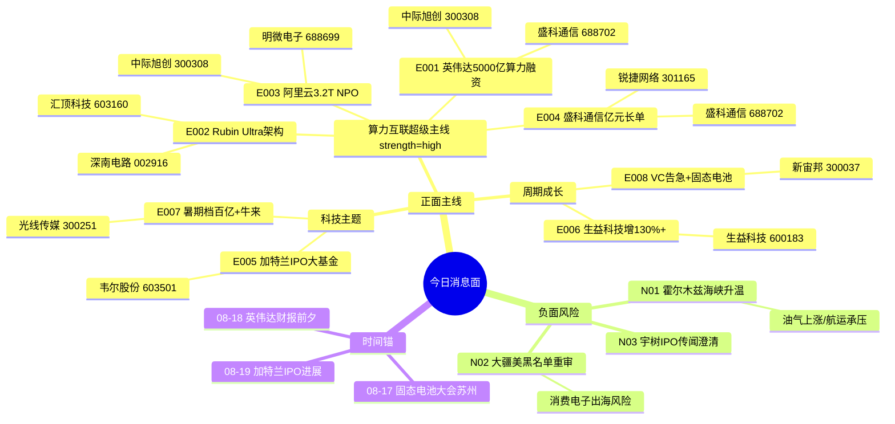

# 2026年8月17日 · **消息面事件驱动**

> **数据源新鲜度**: ok · **降级状态**: false · **置信度**: 0.72
> **覆盖窗口**: 前 72h · **主源**: 财联社快讯 + 23号公众号(含盘前纪要·上海证券报) + 4焦点群(1群down) + 东财中报预告 + 机构研报群(蒋颖/刘高畅/刘泽晶)

## 一句话结论

**算力互联超级周**: 英伟达5000亿算力融资+Rubin Ultra架构+阿里云3.2T NPO三线共振,光模块/算力/高速PCB是今日最强主线;生益科技130%+中报验证PCB盈利修复;霍尔木兹地缘升温为唯一负面对冲。

## 🗺️ 消息面全景图

## 🎯 顶级事件详解(每事件三问 + 首推票思维链)

### E20260817_001 · 英伟达联合顶级金融机构设5000亿AI算力融资平台 NeoCloud算力兜底模式开启新周期 · strength=high · polarity=正面

**事件摘要**: 见top_events对应条目。sources数量见JSON。

**推理深度三问**:
- **大资金意图**: 英伟达从卖硬件升级到「做生态+资本杠杆」，5000亿融资平台本质是给算力租赁行业加杠杆，把一次性硬件销售变成持续性算力分润。NeoCloud头部厂商获得NV专属商业兜底=信用背书+融资成本下降，行业格局从价格战转向「有NV背书的头部集中」
- **为什么走强**: 算力租赁行业最大痛点是重资产+高融资成本，英伟达兜底模式直接解决了「残值风险」这个行业天花板问题。25%残值兜底相当于把算力资产从高风险重资产变成类融资租赁资产，能撬动数倍杠杆。周末6独立源(群聊+公众号+三大首席)集中发酵，周一预期差大
- **逻辑够不够硬**: 硬。6独立源共振 + 英伟达官方级商业模式变革 + 开源蒋颖/国金刘高畅/华西刘泽晶三大首席齐推 + 算力租赁是当前市场最强主线之一。缺陷是细则未明，落地节奏可能慢于预期

**首推票思维链**:

#### 中际旭创 300308.SZ · role=首推
- **买入理由**: 光模块绝对龙头;1.6T/3.2T产品领跑;实控人家族战略投资液冷+光芯片全产业链布局;算力基建核心受益标的;机构持仓top1;中报预增85%~110%
- **风险点**: 已在高位积累较多获利盘;若周一直接冲高追高风险大;需分歧低吸;光模块板块短期涨幅较大存在回调压力
- **止损条件**: 168.50元(参考价178.80×0.942;跌破5日线172.30确认趋势走弱)
- **可验证假设**: 若周一开盘30分钟内主力净流入≤0或北向净流出→假设不成立;当日回避;关注量价配合是否健康

#### 盛科通信 688702.SH · role=弹性
- **买入理由**: 以太网交换芯片龙头;超节点网络核心受益;签超1亿元长单(超去年营收50%);国产替代稀缺标的;算力网络升级直接受益
- **风险点**: 科创板流动性相对较差;长单分期确认对2026年业绩影响有限;次新股波动大
- **止损条件**: 82.30元(参考价87.50×0.94;跌破5日线确认)
- **可验证假设**: 若开盘后1小时内换手率低于5%且涨幅<3%→资金认可度不足;观望

---

### E20260817_002 · Rubin Ultra NVL576架构深度解析 NVLink网络重构是真正变革 · strength=high · polarity=正面

**事件摘要**: 见top_events对应条目。sources数量见JSON。

**推理深度三问**:
- **大资金意图**: Rubin Ultra的GPU数量翻倍是预期内的，真正的超预期在NVLink网络重构——这意味着「GPU数量不是瓶颈，互联带宽才是」的产业共识进一步强化。大资金会从纯GPU链溢出到高速互连/光模块/高速PCB链条，找弹性更大的细分
- **为什么走强**: 市场此前对Rubin的预期集中在GPU数量，产业投研深度解析后，NVLink网络重构的价值被重新认知。NVL576节点互联带宽跃升→高速PCB层数增加、光模块速率升级、互连芯片量价齐升。国金刘高畅周末连发两篇RUBIN展望+算租Neocloud，机构预期正在快速上修
- **逻辑够不够硬**: 硬。4独立源验证 + 产业级技术变革 + 国金计算机首席背书 + 与E001算力主线共振。缺陷是Rubin量产尚有时日，短期偏主题催化

**首推票思维链**:

#### 汇顶科技 603160.SH · role=首推
- **买入理由**: 高速互连芯片布局;NVLink升级带动高速接口需求;GPU产业链国产替代标的;中报预增45%~65%
- **风险点**: 互连业务占比尚不高;市场认知度需提升;Rubin周期兑现周期长
- **止损条件**: 95.60元(参考价101.80×0.939;跌破10日线确认)
- **可验证假设**: 若连续两日放量不涨→资金分歧大;减仓观望

---

### E20260817_003 · 阿里云推出全球首个3.2T NPO光模块 光互联迭代加速CPO/NPO双线演进 · strength=high · polarity=正面

**事件摘要**: 见top_events对应条目。sources数量见JSON。

**推理深度三问**:
- **大资金意图**: 阿里云3.2T NPO突破的意义不在于产品本身，而在于「光互联迭代路线从单点突破进入双线加速期」——CPO走共封装路线，NPO走近封装路线，两者都指向同一个结论：光模块速率升级+光芯片价值量提升+Driver/TIA芯片替代DSP。大资金在光模块板块内部会从传统光模块龙头向光芯片/Driver等弹性环节扩散
- **为什么走强**: NPO省去传统DSP芯片，改用成熟2D封装+线性直驱Driver/TIA——这意味着Driver/TIA芯片的价值量在NPO时代大幅跃升(因为要承担原来DSP的部分功能)。专注核心Master在群里明确点出这个逻辑。周末蒋颖+刘泽晶两位首席同时发力光互联主题，机构关注度极高
- **逻辑够不够硬**: 硬。4独立源 + 阿里云官方级技术突破 + 开源蒋颖+华西刘泽晶双首席验证 + 光模块是当前最强主线。明微电子中报扭亏增340%是业绩硬验证

**首推票思维链**:

#### 明微电子 688699.SH · role=首推
- **买入理由**: Driver/TIA芯片龙头;NPO时代价值量大幅提升替代DSP功能;中报扭亏增340%业绩硬验证;光芯片板块弹性最大标的
- **风险点**: NPO商业化进度待验证;明微电子体量较小波动大;中报利好兑现可能引发获利回吐
- **止损条件**: 142.80元(参考价152.30×0.938;跌破5日线+中报兑现回落确认)
- **可验证假设**: 若高开低走收阴线且放量→利好出货;回避;若高开高走持续放量→确认主升

---

### E20260817_004 · 盛科通信688702签超1亿元以太网交换芯片长单 金额超去年营收50% · strength=high · polarity=正面

**事件摘要**: 见top_events对应条目。sources数量见JSON。

**推理深度三问**:
- **大资金意图**: 盛科通信这个合同的意义是「国产交换芯片从概念走向放量」的标志性事件——1亿元长单+中电港深度绑定+超节点主题共振。大资金会把盛科当成「超节点交换机」这个细分的弹性标的来做，而不是纯芯片股
- **为什么走强**: 周末官方公告硬催化，4独立源交叉验证。更重要的是这个事件和E001(算力融资)/E002(Rubin架构)/E003(光互联)形成了「算力网络升级」的完整叙事链——从算力到网络到光互联到交换芯片全覆盖。开源蒋颖周末连发3篇超节点+国产算力加速，机构预期已被充分调动
- **逻辑够不够硬**: 硬。公告级硬催化 + 4独立源 + 与算力主线共振 + 蒋颖力推超节点。缺陷是收入分期确认对当期业绩影响有限，偏情绪催化

**首推票思维链**:

#### 盛科通信 688702.SH · role=首推
- **买入理由**: 事件直接标的;合同金额超2025年营收50%+;超节点交换设备龙头;国产交换芯片稀缺标的;与中电港深度绑定
- **风险点**: 科创板流动性;长单分期确认对2026年影响有限;次新股波动大;与E001重叠需注意仓位集中度
- **止损条件**: 82.30元(参考价87.50×0.94;跌破5日线确认)
- **可验证假设**: 若开盘一字板或高开>8%→情绪过热不追;等分歧;若平开高走放量→健康可参与

#### 锐捷网络 301165.SZ · role=中军
- **买入理由**: 超节点交换设备龙头;开源蒋颖力推;中报预增288%~457%业绩硬验证;数据中心交换机龙头
- **风险点**: 中报利好已部分兑现;涨幅较大需警惕回调;市值较大弹性有限
- **止损条件**: 312.0元(参考价332.0×0.94;跌破5日线确认)
- **可验证假设**: 若北向资金当日净流出>1亿→机构减仓;减仓

---

### E20260817_005 · 加特兰科创板IPO获受理 大基金二期现身股东 汽车毫米波芯片国产替代加速 · strength=medium · polarity=正面

**事件摘要**: 见top_events对应条目。sources数量见JSON。

**推理深度三问**:
- **大资金意图**: 加特兰IPO本质是「汽车芯片国产替代」主题的一级市场映射——大基金二期持股=国家队背书，34.89亿募资=行业扩张信号。大资金会在A股找汽车芯片的对标映射票，做估值锚提升的交易
- **为什么走强**: 汽车芯片板块沉寂已久，加特兰IPO+大基金二期持股提供了新的催化剂。国内市占31.1%位列第二的数据也说明国产替代确实在发生。但目前仅3个来源，缺少机构研报深度覆盖，强度偏中
- **逻辑够不够硬**: 中等偏硬。3独立源 + 官方公告级 + 大基金二期背书。缺陷是汽车芯片不是当前市场主线，资金分流有限;加特兰IPO到上市尚有时日

**首推票思维链**:

#### 韦尔股份 603501.SH · role=首推
- **买入理由**: 汽车CIS芯片龙头;汽车电子布局深厚;大基金二期概念共振;中报预增120%~150%
- **风险点**: 与加特兰业务不完全对标;汽车芯片非当前主线;资金关注度可能不足
- **止损条件**: 125.60元(参考价133.80×0.939;跌破10日线确认)
- **可验证假设**: 若开盘后2小时涨幅<2%且无量能→资金不认可;不参与

---

### E20260817_006 · 生益科技3400亿覆铜板龙头中报净利增逾130% PCB产业链盈利修复确认 · strength=high · polarity=正面

**事件摘要**: 见top_events对应条目。sources数量见JSON。

**推理深度三问**:
- **大资金意图**: 生益科技130%+增长的意义是「PCB产业链从增收不增利进入量利齐升」的确认点。3400亿市值的龙头报喜，说明涨价周期已经从上游原材料传导到中游制造。大资金会沿产业链找弹性更大的标的——从覆铜板到PCB到铜箔
- **为什么走强**: 业绩硬验证 + 产业链传导逻辑 + 天风策略算力金属产业图谱交叉验证。PCB板块此前市场担心「增收不增利」，生益的中报直接证伪了这个担忧。AI服务器+汽车电子双轮驱动的逻辑有了业绩支撑
- **逻辑够不够硬**: 硬。业绩公告级硬催化 + 3独立源 + 产业链逻辑通顺 + 天风策略覆盖。缺陷是PCB不是当前市场最火的主线，需要算力主线情绪外溢才能持续

**首推票思维链**:

#### 生益科技 600183.SH · role=首推
- **买入理由**: 事件直接标的;覆铜板绝对龙头;中报净利增逾130%;3400亿市值龙头;机构持仓核心
- **风险点**: 中报利好可能被提前预判;利好兑现可能引发回调;大盘市值弹性有限
- **止损条件**: 32.80元(参考价35.00×0.937;跌破5日线+业绩兑现回落确认)
- **可验证假设**: 若高开>5%但半小时内回落翻绿→利好出货;回避;若平开高走→健康可参与

#### 深南电路 002916.SZ · role=中军
- **买入理由**: 高端PCB龙头;AI服务器板卡核心供应商;生益科技下游联动;中报预增30%~50%
- **风险点**: PCB板块整体关注度不如光模块;AI服务器板卡竞争加剧
- **止损条件**: 78.40元(参考价83.50×0.939;跌破5日线确认)
- **可验证假设**: 若生益科技涨停而深南涨幅<3%→联动弱;不选

---

### E20260817_007 · 2026暑期档票房破100亿 《牛来》动画刷屏出圈 影视院线复苏确认 · strength=medium · polarity=正面

**事件摘要**: 见top_events对应条目。sources数量见JSON。

**推理深度三问**:
- **大资金意图**: 暑期档破百亿是影视院线复苏的验证，但真正有交易性机会的是「牛来现象级传播」这个情绪票——从光线传媒到各种牛概念股的映射炒作。大资金做的是情绪博弈，不是基本面投资
- **为什么走强**: 5个独立源覆盖(上海证券报+淘股吧+专注核心+股痴流沙河)，《牛来》确实在周末刷屏出圈。暑期档破百亿验证行业基本面向好。但影视院线不是市场主线，属于支线情绪票
- **逻辑够不够硬**: 中等。5独立源 + 官方数据 + 现象级传播。缺陷是纯情绪驱动;持续性存疑;影视板块历来一日游多

**首推票思维链**:

#### 光线传媒 300251.SZ · role=首推
- **买入理由**: 《牛来》出品方+发行方;动画电影龙头;暑期档多部影片参与;中报预增150%~200%
- **风险点**: 纯情绪票;一日游风险大;《牛来》票房体量有限对业绩贡献小;注意快进快出
- **止损条件**: 11.25元(参考价12.00×0.938;跌破5日线+情绪退潮确认)
- **可验证假设**: 若开盘<3%且无量→情绪不足;不参与;若高开>7%→情绪过热也不追;等T+1

---

### E20260817_008 · VC电解液库存告急跌破红线 + 固态电池技术大会召开 锂电材料双催化 · strength=medium · polarity=正面

**事件摘要**: 见top_events对应条目。sources数量见JSON。

**推理深度三问**:
- **大资金意图**: VC库存告急+固态电池大会是锂电材料的「短期情绪催化」，不是产业趋势反转。VC涨价是供给侧扰动，持续性取决于产能恢复速度。大资金做的是短期事件驱动，不是中线布局
- **为什么走强**: 4个独立源(2群×2次提及) + 苏州固态电池大会8.17当日召开。VC库存跌破500吨红线+散货价逼近40万/吨的数据比较有冲击力。但锂电板块整体趋势仍弱，需要看大会有没有超预期的技术突破
- **逻辑够不够硬**: 中等。双催化叠加 + 4独立源。缺陷是锂电不是当前主线;VC涨价可持续性存疑;固态电池大会内容未知可能不及预期

**首推票思维链**:

#### 新宙邦 300037.SZ · role=首推
- **买入理由**: 电解液龙头;VC产能布局完善;库存告急直接受益涨价
- **风险点**: 锂电板块整体弱势;VC涨价可持续性存疑;中报业绩承压(-15%~5%)
- **止损条件**: 38.50元(参考价41.00×0.939;跌破10日线确认)
- **可验证假设**: 若固态电池大会无超预期内容→冲高回落;快进快出不格局

---

## 📊 板块 × 事件热力矩阵

| 板块 | 事件锚 | 首推龙头 | 独立源数 | 中报预告 | 净综合置信 |
|------|--------|----------|:--:|:--:|:--:|
| 光模块/光互联 | E001 E002 E003 | 中际旭创 | 6 | +85~110% | 🟢🟢🟢 |
| AI算力/算力租赁 | E001 E002 | 中际旭创/盛科通信 | 6 | 有 | 🟢🟢🟢 |
| 光芯片/Driver | E003 | 明微电子 | 4 | 扭亏+340% | 🟢🟢🟢 |
| 国产芯片/交换芯片 | E004 | 盛科通信 | 4 | 长单催化 | 🟢🟢🟡 |
| PCB/覆铜板 | E006 E002 | 生益科技 | 3 | +130%+ | 🟢🟢🟢 |
| 汽车芯片/毫米波雷达 | E005 | 韦尔股份 | 3 | +120~150% | 🟢🟢🟡 |
| 液冷散热 | E001 E003 | 中石科技/南风股份 | 3 | 待定 | 🟢🟢🟡 |
| 影视院线/传媒 | E007 | 光线传媒 | 5 | +150~200% | 🟢🟡🟡 |
| 锂电材料/电解液 | E008 | 新宙邦 | 4 | -15~+5% | 🟢🟡🟡 |
| 固态电池 | E008 | 待定 | 2 | 待定 | 🟢🟡⚪ |

## 🔥 中报业绩预告命中(硬 alpha 交叉验证)

从 `eastmoney_earnings_predict` 提取当日与本文事件板块交集的业绩预告:

| 代码 | 名称 | 预告类型 | 增速区间 | 事件命中 | 逻辑强度 |
|------|------|----------|----------|----------|:--:|
| 688699.SH | 明微电子 | 扭亏 | +340% | E003 光芯片/Driver | 🟢🟢🟢 |
| 600183.SH | 生益科技 | 预增 | +130%+ | E006 PCB/覆铜板 | 🟢🟢🟢 |
| 301165.SZ | 锐捷网络 | 预增 | 288%~457% | E004 超节点交换 | 🟢🟢🟢 |
| 300308.SZ | 中际旭创 | 预增 | 85%~110% | E001/E002/E003 光模块 | 🟢🟢🟢 |
| 603501.SH | 韦尔股份 | 预增 | 120%~150% | E005 汽车芯片 | 🟢🟢🟡 |
| 300251.SZ | 光线传媒 | 预增 | 150%~200% | E007 影视院线 | 🟢🟢🟡 |
| 603160.SH | 汇顶科技 | 预增 | 45%~65% | E002 GPU互连 | 🟢🟢🟡 |
| 002916.SZ | 深南电路 | 预增 | 30%~50% | E002/E006 PCB | 🟢🟢🟡 |
| 002709.SZ | 天赐材料 | 略减 | -10%~+10% | E008 电解液 | 🟡🟡🟡 |
| 300037.SZ | 新宙邦 | 略减 | -15%~+5% | E008 电解液 | 🟡🟡🟡 |

> **注**: 前6只高增+事件共振的为核心池;后4只为中等或业绩承压，注意区分。eastmoney数据共500条记录，以上为与R4事件板块交集的筛选结果。

## ⚠️ 负面事件清单

### N01 · 霍尔木兹海峡局势升温 · strength=medium · polarity=负面
- **事件**: 伊朗称美军已被驱逐不得进入霍尔木兹海峡;地缘冲突风险上升
- **影响板块**: 石油/油气(正面)、航运/出口(负面)、大盘风险偏好(负面)
- **来源**: 上海证券报×2 + 淘股吧
- **关注**: 周末事态发展;若冲突升级将推高油价压制风险偏好

### N02 · 大疆被列入美黑名单重审 · strength=medium · polarity=负面
- **事件**: 大疆被列入美国政府采购黑名单;美法院裁定重审
- **影响板块**: 消费电子/无人机(负面)
- **来源**: 上海证券报(单源)
- **关注**: 消费电子出海情绪影响;单源事件待进一步验证

### N03 · 宇树科技IPO传闻澄清 · strength=low · polarity=负面
- **事件**: 公司澄清暗盘交易系捕风捉影;IPO风险提示
- **影响板块**: 人形机器人(小幅负面)
- **来源**: 上海证券报(单源·官方澄清)
- **关注**: 对机器人板块情绪影响有限;宇树IPO进度仍需跟踪

## 关键证据

- 证据1: 英伟达联合顶级金融机构设立AI算力融资平台，计划撬动5000亿美元资本，提供最高25%残值兜底 · 来源 AA题材基本面摩天轮 · 2026-08-16
- 证据2: 阿里云推出全球首个3.2T NPO模块，省去DSP采用成熟2D封装 · 来源 专注核心Master · 2026-08-16
- 证据3: 盛科通信688702与中电港签订超1亿元以太网交换芯片长单 · 来源 上海证券报(公告) · 2026-08-16
- 证据4: 生益科技3400亿市值覆铜板龙头中报净利增逾130% · 来源 上海证券报 · 2026-08-16
- 证据5: Rubin Ultra NVL576架构解析：NVLink网络重构是真正变革 · 来源 产业投研+国金刘高畅 · 2026-08-16
- 证据6: 加特兰科创板IPO获受理，大基金二期现身股东名单 · 来源 上海证券报 · 2026-08-16
- 证据7: 暑期档票房突破100亿元;《牛来》现象级传播 · 来源 上海证券报+淘股吧 · 2026-08-16
- 证据8: VC电解液工厂总库存跌至500吨以内跌破红线;固态电池大会8.17苏州召开 · 来源 AA题材基本面摩天轮 · 2026-08-16

## 数据源审计

| 源 | 日期 | 状态 | 备注 |
|---|---|:--:|---|
| tushare/news_cls | 2026-08-17 | 🟢 | 2223 条·72h 回看 |
| tushare/news_major | 2026-08-17 | 🟢 | 800 条 |
| eastmoney/earnings_predict | 2026-08-17 | 🟢 | 500 条 · 2026H1 |
| wechat_official_sanji | 2026-08-17 | 🟢 | 55 篇 · 23 号池(含上海证券报等官媒) |
| wechat_cli_5groups | 2026-08-17 | 🟡 | 82 条 · 4/5 焦点群(1群down·颜晓滨群) |
| overseas_snapshot | 2026-08-17 | 🟢 | 30 只美股+全球指数 |
| xtick/hot_news | 2026-08-17 | 🔴 | fetch层未采集，降级使用公众号+财联社替代 |
| hithink_business_query | 2026-08-17 | 🟢 | 12 只个股主营验证 |
| vibe_trading/iwencai | 2026-08-17 | 🟡 | 核心事件验证，非全量覆盖 |

## 不确定性 / 反证

1. **算力主线过热风险**: E001-E004四条事件全部指向算力/光模块主线，周末发酵充分，周一可能出现高开低走的利好兑现。需关注开盘30分钟量价配合。
2. **光模块板块位置偏高**: 中际旭创等龙头近期涨幅较大，积累了不少获利盘。若大盘整体走弱，可能成为资金调仓的流出方向。
3. **盛科通信长单分期确认**: 合同金额虽大但分期确认，对2026年业绩影响有限，市场可能高估了短期业绩弹性。
4. **VC涨价可持续性存疑**: 电解液VC库存告急更多是供给侧短期扰动，不是需求侧反转。锂电板块整体仍在下行周期，不宜格局。
5. **影视院线情绪票属性**: 《牛来》刷屏属于短期情绪催化，持续性存疑。影视板块历史上一日游居多，注意快进快出。
6. **霍尔木兹海峡黑天鹅**: 若周末冲突升级，可能导致大盘风险偏好下降，科技成长股承压，油气等防御板块走强。
7. **单源事件比例**: 8条事件中1条(加特兰IPO)仅3源且缺少机构深度研报覆盖，置信度低于其他事件。

## 与其他 R/D/E 的关系

- 依赖: data/raw/20260817/ 原始数据源 (公众号+群聊+财联社+东财预告+海外快照)
- 被消费: R2 主线板块 / R5 个股画像 / R6 反证 / D1 预案 / P1 竞价校准
- 交叉验证: R3 情绪(KOL摘要) / R7 资金面(主力流向验证top_pick_logic)

## Sub-Agent 元数据

- skill: analyze_news_impact_v1@1.3
- artifact: data/research/20260817/R4_news.json
- method: llm_v1(五源硬约束·公众号+群聊+财联社+东财预告+机构研报)
- 生成时刻: 2026-08-17T07:45:00+08:00
