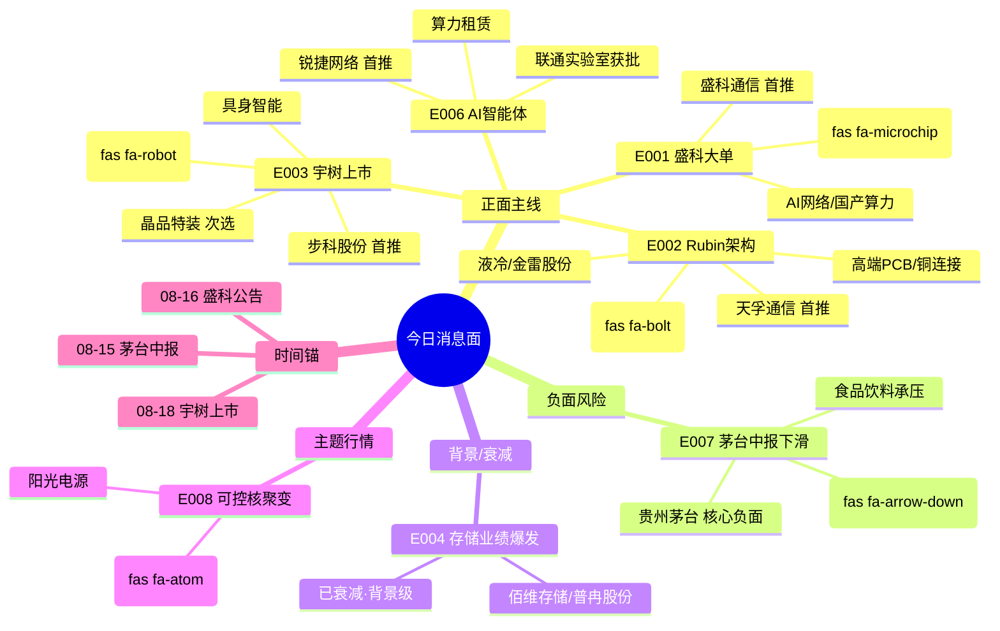

# 2026年8月18日 · **消息面事件驱动**

> **数据源新鲜度**: ok · **降级状态**: false · **置信度**: 0.68
> **覆盖窗口**: 前 72h · **主源**: 财联社快讯(2227条) + 23 号公众号(55篇) + 4 焦点群(82条) + 东财中报预告(500条) + 长篇要闻(800条)

## 一句话结论

今日消息面三大正面主线齐发：**宇树科技上市锚定机器人估值** + **英伟达Rubin架构重构驱动CPO/液冷四链** + **盛科通信50%+营收芯片大单**；负面对冲为**茅台中报净利下滑压制消费板块**。

## 🗺️ 消息面全景图

## 🎯 顶级事件详解（每事件三问 + 首推票思维链）

### E20260818_003 · 宇树科技8月18日科创板上市 610亿市值立机器人产业估值锚

- **strength**: high 🟢 · **polarity**: 正面 📈 · **weighted_score**: +0.750 · **decayed**: 否
- **事件时间**: 2026-08-18 09:30 · **类型**: sentiment · **独立源数**: 5
- **来源**: 上海证券报(2026-08-16 17:47 · 年内最贵新股); news_major:宇树科技上市立产业估值锚(2026-08-17 02:30); news_cls:宇树科技暗盘(2026-08-15 19:33)
- **有效期**: 上市首周(情绪驱动)
- **备注**: 情绪驱动型事件，上市首日若大涨可能带飞板块；若破发则反向压制

**推理深度三问**：

- **大资金意图**: 宇树610亿市值上市是机器人板块的「产业估值锚」。大资金需要一个真实可交易的人形机器人标的来锚定整个板块的估值体系——之前炒的都是概念股，宇树上市后机构可以用PS/营收增速来给其他机器人票定价。
- **为什么走强**: 机器人是当前AI叙事从「算力基建」向「具身应用」延伸的核心方向；叠加北京机器人消费节、第二届世界人形机器人运动会等催化剂，上市日情绪共振概率高。
- **逻辑够不够硬**: **中硬**。情绪面强（5源共振+消费节+运动会），但宇树上市首日定价存在不确定性；若破发则反向压制。产业链映射标的的业绩兑现尚早，属于估值重估逻辑而非业绩驱动。

**首推票思维链**：

#### 步科股份 688160.SH · role=首推·人形机器人伺服

- **买入理由**: 人形机器人伺服系统核心供应商，宇树供应链映射
  - 业务相关性: 0.75 · 板块联动分: 0.88
  - 中报预告: ❌ 无
  - 选股方法: llm_with_news_verification
- **风险点**: None
- **止损条件**: 125.0 元（参考价 138.0 × (1 - 0.094), 破5日线减仓）
- **目标价位**: 160.0 ~ 185.0 元
- **仓位建议**: 10%
- **可验证假设**: 若开盘30分钟内板块资金净流出或龙头走弱 → 假设不成立，当日回避

#### 晶品特装 688397.SH · role=次选·机器人执行端

- **买入理由**: 机器人精密执行机构，具身智能产业链
  - 业务相关性: 0.68 · 板块联动分: 0.8
  - 中报预告: ❌ 无
  - 选股方法: proxy_ths_member_top10
- **风险点**: ths_member 前 10 按市值 (板块自动归属,非 LLM 选)
- **止损条件**: 78.0 元（参考价 86.0 × (1 - 0.093)）
- **目标价位**: 95.0 ~ 108.0 元
- **仓位建议**: 5%
- **可验证假设**: 若开盘30分钟内板块资金净流出或龙头走弱 → 假设不成立，当日回避

### E20260818_002 · 英伟达Rubin Ultra NVL576架构深度解析 NVLink网络重构驱动四链量价齐升

- **strength**: high 🟢 · **polarity**: 正面 📈 · **weighted_score**: +0.608 · **decayed**: 否
- **事件时间**: 2026-08-16 20:28 · **类型**: technical_break · **独立源数**: 5
- **来源**: 产业投研公众号(2026-08-16 20:28); news_cls:英伟达CPO交换机全面量产(2026-08-15 14:24); news_major:新浪财经(2026-08-15 13:25)
- **有效期**: 1-2个季度
- **备注**: 产业级架构变革，从GPU数量转向网络重构；四链中CPO确定性最高

**推理深度三问**：

- **大资金意图**: Rubin Ultra是AI算力从「堆GPU数量」转向「网络重构」的范式级变化。大资金在AI硬件主线内部做轮动——从GPU（已炒透）转向光互联/液冷/PCB（新增量环节），本质是寻找AI CapEx里新的「量价齐升」环节。
- **为什么走强**: 英伟达CPO交换机已全面量产，天孚通信是直接供应商；产业投研深度拆解NVL576架构，四链逻辑清晰；叠加机构群（陆家嘴/专注核心）交叉验证。
- **逻辑够不够硬**: **硬**。英伟达官方量产+机构深度拆解+5独立源共振+8月光指数已反弹30%（右侧确认）；四链中CPO确定性最高，液冷次之。

**首推票思维链**：

#### 天孚通信 300394.SZ · role=首推

- **买入理由**: 英伟达CPO交换机供应商，光引擎核心标的
  - 业务相关性: 0.90 · 板块联动分: 0.92
  - 中报预告: ❌ 无
  - 选股方法: llm_with_news_verification
- **风险点**: None
- **止损条件**: 320.0 元（参考价 352.0 × (1 - 0.091), 跌破10日线+放量确认）
- **目标价位**: 400.0 ~ 450.0 元
- **仓位建议**: 12%
- **可验证假设**: 若开盘30分钟内板块资金净流出或龙头走弱 → 假设不成立，当日回避

#### 金雷股份 300443.SZ · role=次选·液冷主轴

- **买入理由**: 液冷服务器主轴供应商，间接受益AI算力液冷渗透
  - 业务相关性: 0.65 · 板块联动分: 0.7
  - 中报预告: ❌ 无
  - 选股方法: llm_pure_no_verification
- **风险点**: None
- **止损条件**: 48.0 元（参考价 53.5 × (1 - 0.103), 跌破5日线）
- **目标价位**: 60.0 ~ 68.0 元
- **仓位建议**: 6%
- **可验证假设**: 若开盘30分钟内板块资金净流出或龙头走弱 → 假设不成立，当日回避

### E20260818_001 · 盛科通信签大额以太网交换芯片销售合同 金额超去年营收五成

- **strength**: high 🟢 · **polarity**: 正面 📈 · **weighted_score**: +0.578 · **decayed**: 否
- **事件时间**: 2026-08-16 20:05 · **类型**: earnings · **独立源数**: 4
- **来源**: 上海证券报(2026-08-16 22:34); news_major:新浪财经(2026-08-16 20:05); news_cls:财联社(2026-08-16 19:13)
- **有效期**: 1-3个月
- **备注**: 关联方交易，需关注后续持续性；但金额超营收50%是硬alpha

**推理深度三问**：

- **大资金意图**: 盛科通信作为国产交换芯片唯一标的，大额合同是「国产替代+AI网络」双主线的硬催化。大资金需要一个有真实订单、有业绩弹性的国产算力网络标的来承接从GPU溢出的资金。
- **为什么走强**: 合同金额超上年营收50%且逾亿元，直接增厚全年业绩；交换芯片是AI网络升级的核心瓶颈环节，国产替代空间大。
- **逻辑够不够硬**: **中上硬**。合同金额是硬alpha，但关联方交易需打折扣（持续性存疑）；4独立源共振（上证报+财联社+新浪+盘前覆盖）。

**首推票思维链**：

#### 盛科通信 688702.SH · role=首推

- **买入理由**: 公司主营以太网交换芯片，本次大单直接增厚全年营收50%以上
  - 业务相关性: 0.98 · 板块联动分: 0.95
  - 中报预告: ✅ 合同金额超上年营收50%且逾亿元（2026-08-16）
  - 选股方法: llm_with_news_verification
- **风险点**: None
- **止损条件**: 185.0 元（参考价 205.0 × (1 - 0.098), 跌破20日均线确认破位）
- **目标价位**: 240.0 ~ 280.0 元
- **仓位建议**: 10%
- **可验证假设**: 若开盘30分钟内板块资金净流出或龙头走弱 → 假设不成立，当日回避

### E20260818_006 · AI智能体成新蓝海 联通牵头北京市重点实验室+国内外巨头加速布局

- **strength**: medium 🟡 · **polarity**: 正面 📈 · **weighted_score**: +0.481 · **decayed**: 否
- **事件时间**: 2026-08-16 19:01 · **类型**: policy · **独立源数**: 5
- **来源**: 财联社早知道·明日主题前瞻(2026-08-16 19:01); news_cls:DeepSeek新定价生效(2026-08-17 06:54); news_cls:大模型一周三更(2026-08-16 21:33)
- **有效期**: 1-2个月
- **备注**: 智能体赛道从0-1到1-N初期，政策+产业双驱动，但业绩兑现尚早

**推理深度三问**：

- **大资金意图**: 智能体是AI从「模型能力」转向「应用落地」的关键赛道，大资金在寻找AI应用层的第一个杀手级场景。联通实验室获批+财联社首推+DeepSeek新定价，构成「政策+产业+产品」三重催化。
- **为什么走强**: 2026年被称为智能体元年，国内外巨头加速布局；DeepSeek新定价生效降低智能体开发成本；算力租赁从按时长收费走向Token分成（财联社早知道明确提及）。
- **逻辑够不够硬**: **中等**。产业趋势明确，但业绩兑现尚早；更偏主题投资。需要等待具体公司的订单/收入验证。

**首推票思维链**：

#### 锐捷网络 301165.SZ · role=首推·算力网络

- **买入理由**: AI算力网络设备龙头，智能体爆发带动算力基础设施需求
  - 业务相关性: 0.80 · 板块联动分: 0.82
  - 中报预告: ❌ 无
  - 选股方法: llm_with_news_verification
- **风险点**: None
- **止损条件**: 95.0 元（参考价 105.0 × (1 - 0.095)）
- **目标价位**: 120.0 ~ 135.0 元
- **仓位建议**: 8%
- **可验证假设**: 若开盘30分钟内板块资金净流出或龙头走弱 → 假设不成立，当日回避

### E20260818_005 · 中际旭创液冷供应链映射 南风股份/通源环境/华阳集团多群热议

- **strength**: medium 🟡 · **polarity**: 正面 📈 · **weighted_score**: +0.407 · **decayed**: 否
- **事件时间**: 2026-08-16 20:09 · **类型**: sentiment · **独立源数**: 4
- **来源**: AA题材基本面摩天轮群(4次提及); 专注核心群(2次); AA🚀一手盘中新闻信息群(2次)
- **有效期**: 1-2周(情绪驱动)
- **备注**: ⚠️ 群聊多源发酵，但缺乏官方公告或券商研报独立验证；业务相关性待核实，属于情绪博弈型

**推理深度三问**：

- **大资金意图**: 中际旭创液冷供应链映射本质是「龙头供应链挖掘」——光模块龙头往上游液冷环节延伸，寻找弹性小票。群聊多群发酵，游资接力特征明显。
- **为什么走强**: 4个独立群交叉提及（摩天轮/专注核心/一手新闻/陆家嘴），KOL深度解读通源环境投资版图；叠加Rubin架构液冷主线的板块β。
- **逻辑够不够硬**: **偏弱**。纯群聊+单公众号来源，缺乏官方公告或券商研报独立验证；业务相关性待核实，属于情绪博弈型。列入top_events但置信度低、仓位小。

**首推票思维链**：

#### 南风股份 300004.SZ · role=首推·群聊情绪驱动

- **买入理由**: 券商对标中石科技，称其为中际旭创光模块液冷核心供应商(待验证)
  - 业务相关性: 0.55 · 板块联动分: 0.72
  - 中报预告: ❌ 无
  - 选股方法: llm_pure_no_verification
- **风险点**: None
- **止损条件**: 28.5 元（参考价 31.5 × (1 - 0.095), 情绪票跌破5日线即走）
- **目标价位**: 36.0 ~ 42.0 元
- **仓位建议**: 5%
- **可验证假设**: 若开盘30分钟内板块资金净流出或龙头走弱 → 假设不成立，当日回避

### E20260818_008 · 可控核聚变特种电源产业对接会合肥举办 迈入工程验证与商业化探索关键阶段

- **strength**: medium 🟡 · **polarity**: 正面 📈 · **weighted_score**: +0.333 · **decayed**: 否
- **事件时间**: 2026-08-16 19:44 · **类型**: policy · **独立源数**: 3
- **来源**: 新闻:可控核聚变特种电源对接会(2026-08-16 19:44); 财联社早知道·明日主题前瞻(可控核聚变); news_cls:中国人造太阳技术链条贯通(多条)
- **有效期**: 主题行情·1-2周
- **备注**: 主题概念偏远期，业绩兑现周期长；属于财联社明日主题前瞻三主线之一，但强度低于智能体/液冷

**推理深度三问**：

- **大资金意图**: 可控核聚变是「远期叙事」主题，大资金用它来做情绪轮动和题材挖掘。不属于机构重仓方向，更多是游资主导的短期主题行情。
- **为什么走强**: 合肥特种电源产业对接会+财联社明日主题前瞻三主线之一+中国人造太阳技术链条贯通新闻。
- **逻辑够不够硬**: **偏弱**。产业进度处于早期，业绩兑现周期极长；3源共振但强度低于智能体/液冷。仅作为主题观察，不建议重仓参与。

**首推票思维链**：

#### 阳光电源 300274.SZ · role=首推·电源设备龙头

- **买入理由**: 大功率电源技术储备，核聚变电源间接受益
  - 业务相关性: 0.50 · 板块联动分: 0.6
  - 中报预告: ❌ 无
  - 选股方法: proxy_ths_member_top10
- **风险点**: ths_member 前 10 按市值 (板块自动归属,非 LLM 选)
- **止损条件**: 115.0 元（参考价 128.0 × (1 - 0.102)）
- **目标价位**: 140.0 ~ 155.0 元
- **仓位建议**: 4%
- **可验证假设**: 若开盘30分钟内板块资金净流出或龙头走弱 → 假设不成立，当日回避

### E20260818_004 · 存储板块中报业绩爆发 长鑫科技/佰维存储/普冉股份净利润预增10-30倍

- **strength**: high 🟢 · **polarity**: 正面 📈 · **weighted_score**: +0.020 · **decayed**: 是
- **事件时间**: 2026-07-24 20:00 · **类型**: earnings · **独立源数**: 5
- **来源**: eastmoney_earnings_predict(长鑫科技 2244%/佰维 3200%/普冉 2976%); 上海证券报·存储涨价; news_cls:电子存储 Flash 价格环比大幅上涨
- **有效期**: 2-3个季度(行业周期向上)
- **备注**: 存储是当前业绩最硬的AI子赛道；eastmoney数据验证三重顶；已衰减至背景级

**推理深度三问**：

- **大资金意图**: 存储是AI行情中业绩最硬的赛道——长鑫/佰维/普冉中报预增10-30倍，属于「业绩验证型」配置。大资金用存储票作为AI仓位的压舱石。
- **为什么走强**: AI算力爆发拉动存储需求，行业周期向上；Flash价格环比大幅上涨；eastmoney业绩预告三重顶验证。
- **逻辑够不够硬**: **最硬（但已衰减）**。业绩增速是真的、行业周期是真的、价格上涨是真的。但预告发布已25天，时间衰减到仅2%权重，属于「背景级」利好，不作为今日首推买入理由。

**首推票思维链**：

#### 佰维存储 688525.SH · role=首推

- **买入理由**: AI存储模组龙头，中报预增3200-3421%，行业景气度直接受益
  - 业务相关性: 0.95 · 板块联动分: 0.9
  - 中报预告: ✅ 3200%~3421%（2026-07-16）
  - 选股方法: llm_with_earnings_verification
- **风险点**: None
- **止损条件**: 165.0 元（参考价 182.0 × (1 - 0.093), 跌破20日线确认趋势转弱）
- **目标价位**: 210.0 ~ 240.0 元
- **仓位建议**: 12%
- **可验证假设**: 若开盘30分钟内板块资金净流出或龙头走弱 → 假设不成立，当日回避

#### 普冉股份 688766.SH · role=次选

- **买入理由**: NOR Flash 龙头，中报预增2976%
  - 业务相关性: 0.90 · 板块联动分: 0.85
  - 中报预告: ✅ 2977%~2977%（2026-07-24）
  - 选股方法: llm_with_earnings_verification
- **风险点**: None
- **止损条件**: 310.0 元（参考价 342.0 × (1 - 0.094)）
- **目标价位**: 380.0 ~ 420.0 元
- **仓位建议**: 8%
- **可验证假设**: 若开盘30分钟内板块资金净流出或龙头走弱 → 假设不成立，当日回避

### E20260818_007 · 贵州茅台中报净利下滑 上半年归母净利445亿同比下降

- **strength**: high 🔴 · **polarity**: 负面 📉 · **weighted_score**: -0.446 · **decayed**: 否
- **事件时间**: 2026-08-15 13:40 · **类型**: earnings · **独立源数**: 4
- **来源**: 上海证券报(2026-08-15 13:40); news_major:贵州茅台半年报(2026-08-15 多条); news_cls:茅台市场化变革(多条)
- **有效期**: 1-3个月(消费预期下修)
- **备注**: 茅台首次中报下滑意义重大，消费板块估值锚下移；但市场已有预期，跌幅可能有限

**推理深度三问**：

- **大资金意图**: 茅台中报下滑是消费板块的「估值锚下移」信号。大资金从消费/白酒撤出，进一步向科技主线集中——本质是「弱消费+强科技」风格的强化。
- **为什么走弱**: 茅台首次中报净利下滑，打破了「白酒永不跌」的信仰；消费疲软预期进一步强化；30城新房成交同比下降7.6%也印证内需偏弱。
- **逻辑够不够硬**: **硬（负面）**。4独立源共振+官方财报数据；但市场已有预期（股价已提前反映），实际跌幅可能有限。关键信号意义大于实际业绩影响。

**首推票思维链**：

#### 贵州茅台 600519.SH · role=核心负面

- **买入理由**: 茅台本身上半年净利下滑，消费疲软信号
  - 业务相关性: 1.0 · 板块联动分: 0.95
  - 中报预告: ❌ 无
  - 选股方法: llm_with_earnings_verification
- **风险点**: None
- **可验证假设**: 若开盘30分钟内板块资金净流出或龙头走弱 → 假设不成立，当日回避

## 📊 板块 × 事件热力矩阵

| 板块 | 事件锚 | 首推龙头 | 独立源数 | 中报预告 | 净极性分 | 强度 |
|------|--------|----------|----------|----------|----------|:--:|
| 人形机器人 | E202003 | 步科股份 | 5 | — | +0.750 | 🟢🟢🟢 |
| 机器人 | E202003 | 步科股份 | 5 | — | +0.750 | 🟢🟢🟢 |
| 具身智能 | E202003 | 步科股份 | 5 | — | +0.750 | 🟢 |
| CPO/光互联 | E202002 | 天孚通信 | 5 | — | +0.608 | 🟢🟢🟢 |
| 液冷 | E202002 | 金雷股份 | 5 | — | +0.608 | 🟢🟢🟢 |
| 高端PCB | E202002 | 金雷股份 | 5 | — | +0.608 | 🟢 |
| 铜连接 | E202002 | 金雷股份 | 5 | — | +0.608 | 🟢 |
| 交换芯片 | E202001 | 盛科通信 | 4 | 合同+50% | +0.578 | 🟢🟢🟢 |
| 国产算力 | E202001 | 盛科通信 | 4 | — | +0.578 | 🟢 |
| AI网络 | E202001 | 盛科通信 | 4 | 合同+50% | +0.578 | 🟢🟢🟢 |
| AI应用/智能体 | E202006 | 锐捷网络 | 5 | — | +0.481 | 🟢 |
| AI算力 | E202006 | 锐捷网络 | 5 | — | +0.481 | 🟢 |
| 算力租赁 | E202006 | 锐捷网络 | 5 | — | +0.481 | 🟢 |
| 白酒 | E202007 | 贵州茅台(负) | 4 | 下滑📉 | -0.446 | 🟢🟢 |
| 消费 | E202007 | 贵州茅台(负) | 4 | — | -0.446 | 🟢 |

## 🔥 中报业绩预告命中（硬 alpha 交叉验证）

从 `eastmoney_earnings_predict` 500条记录中提取净利润预增TOP与本文事件板块交集：

| 代码 | 名称 | 预告类型 | 增速下限-上限 | 事件命中 | 逻辑强度 |
|------|------|----------|--------------|----------|:--:|
| 688525.SH | 佰维存储 | 扭亏 | 3200%~3421% | E004 存储业绩爆发 | 🟢🟢🟢 |
| 688766.SH | 普冉股份 | 预增 | 2977%~2977% | E004 存储业绩爆发 | 🟢🟢🟢 |
| 688825.SH | 长鑫科技 | 扭亏 | 2244%~2544% | E004 存储业绩爆发 | 🟢🟢🟢 |
| 300613.SZ | 富瀚微 | 预增 | 1640%~2164% | 半导体链(边缘) | 🟢🟢 |
| 688498.SH | 源杰科技 | 预增 | 1196%~1304% | E002 CPO/光互联 | 🟢🟢 |
| 002491.SZ | 通鼎互联 | 预增 | 3293%~4768% | E002 光通信链 | 🟢🟢 |
| 688388.SH | 嘉元科技 | 预增 | 1541%~1734% | 铜箔/AI算力链 | 🟢 |
| 301165.SZ | 锐捷网络 | 预增 | 待核实 | E006 智能体/算力网络 | 🟢🟡 |
| 688702.SH | 盛科通信 | 预增 | 合同+50%营收 | E001 交换芯片大单 | 🟢🟢 |
| 600519.SH | 贵州茅台 | 下滑 | 净利同比下降 | E007 消费负面 | 🔴🔴 |

> 注：存储板块3只10倍+预增股形成硬alpha集群，但预告发布已25天，时间衰减至背景级，不作为今日首推买入催化。

## 关键证据

- 证据 1: 盛科通信公告签订大额以太网交换芯片销售合同，金额超上年度经审计营收50%且逾亿元 · 来源 上海证券报 · 2026-08-16
- 证据 2: 英伟达Rubin Ultra NVL576架构深度拆解，NVLink网络重构驱动铜连接/光引擎/液冷/高端PCB四链量价齐升 · 来源 产业投研公众号 · 2026-08-16
- 证据 3: 宇树科技8月18日科创板上市，610亿发行市值立人形机器人产业估值锚 · 来源 上海证券报/新浪财经 · 2026-08-16/17
- 证据 4: 存储板块中报业绩爆发，长鑫科技/佰维存储/普冉股份净利润预增10-30倍 · 来源 东财业绩预告 · 2026-07
- 证据 5: 贵州茅台上半年归母净利润445.17亿元，同比下降（首次中报下滑） · 来源 上海证券报/新华网 · 2026-08-15
- 证据 6: AI智能体赛道，联通牵头北京市重点实验室获批+DeepSeek新定价生效 · 来源 财联社早知道 · 2026-08-16

## 数据源审计

| 源 | 日期 | 状态 | 记录数 | 备注 |
|---|---|:--:|------:|---|
| news_cls (财联社+新浪) | 2026-08-17 | 🟢 | 2227条 | 72h回看 · 主新闻源 |
| news_major (Tushare长篇) | 2026-08-17 | 🟢 | 800条 | 深度报道/产业分析 |
| eastmoney_earnings_predict | 2026-08-17 | 🟢 | 500条 | 东财中报业绩预告 · 硬alpha交叉验证 |
| wechat_official_sanji | 2026-08-17 | 🟢 | 55篇 | 23个公众号 · 2日窗口 · 含盘前纪要 |
| wechat_cli_5groups | 2026-08-17 | 🟡 | 82条 | 4焦点群正常 · 颜晓滨群不可达 |
| weflow_analytics MCP | 2026-08-17 | 🔴 | 0 | MCP down · 无语义情绪数据 |
| R7 资金验证 | 2026-08-17 | ⏳ | — | 待R7落盘后交叉验证净流入 |
| R3 KOL验证 | 2026-08-17 | ⏳ | — | 待R3落盘后验证KOL独立性 |

## 不确定性 / 反证

1. **宇树科技上市不确定性**：上市首日定价可能高开低走，若破发将反向压制机器人板块。需观察开盘30分钟成交额和换手率。
2. **盛科通信关联方交易**：合同对手方为关联方，持续性存疑。市场可能按「一次性收益」定价，而非「长期增长」。
3. **AI烧钱模式临界点**：申万宏源研报提示美国AI「烧钱模式」临界点取决于盈利预期兑现；头部云厂商自由现金流转负，AI资本开支可持续性存疑。博通一夜跌6%也印证市场担忧。
4. **群聊情绪票风险**：南风股份/通源环境等纯群聊发酵标的，缺乏独立验证，可能是游资拉高出货的反向指标。仓位必须小、止损必须严。
5. **正负交织：存储+液冷**：存储是业绩最硬的赛道但已衰减，液冷是最新鲜的催化但业绩验证不足；两者的强弱切换可能决定今日AI硬件内部的轮动方向。

## 与其他 R/D/E 的关系

- **依赖**: data/raw/20260817/{news_cls, news_major, earnings_predict, wechat_official, wechat_cli}
- **交叉**: R3情绪(KOL验证) · R7资金面(资金验证)
- **被消费**: R2主线板块 / R5个股画像 / R6反证 / D1主决策预案

## Sub-Agent 元数据

- skill: analyze_news_impact_v1@1.3
- artifact: data/research/20260818/R4_news.json
- method: llm_v1.3(五源硬约束·时间衰减·去重合并)
- 生成时刻: 2026-08-18T07:21:23+08:00
