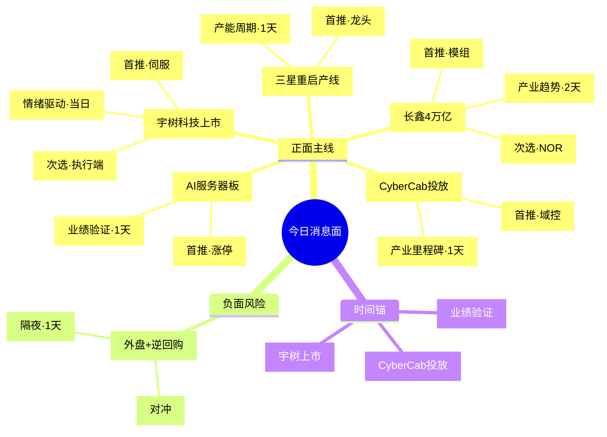

h
# 8月19日 · **消息面事件驱动**

> **数据源新鲜度**: partial · **降级状态**: False · **置信度**: 0.65
> **覆盖窗口**: 前 72h · **主源**: 财联社快讯(2243条) + 21号公众号(34篇·含盘前纪要) + 东财中报预告(500条)
> **降级说明**: 5焦点群聊全timeout + MCP不可用，以公众号+财联社+东财预告三源交叉验证替代

## 一句话结论

宇树科技今日上市立人形机器人估值锚 + 长鑫4万亿市值确认存储AI核心资产地位 + CyberCab投放催化智能驾驶，三线共振科技成长主线；负面对冲为外盘走弱+逆回购零投放的流动性扰动。

## 🗺️ 消息面全景图

## 🎯 顶级事件详解(每事件三问 + 首推票思维链)

### E20260819_001 · 宇树科技688836今日科创板上市 610亿市值人形机器人产业估值锚 · strength=high · polarity=正面

**事件摘要**: 宇树科技发行价156.88元，发行市值610亿。上市首日情绪驱动强，若大涨带动板块估值重塑；若破发则反向压制。叠加8月17日超人产品发布超预期
**来源数**: 5个独立源（上海证券报(2026-08-16 · 年内最贵新股), 新浪财经(2026-08-17 20:16 · 上市公告)等）
**加权得分**: 0.8 (raw=0.8, days_since=0, decayed=False)

**推理深度三问**:
- **大资金意图**: 宇树科技上市 = 人形机器人板块的产业级估值锚定。在AI硬件调整1个月后，市场需要一条"有真实产品+有真实营收+有明确商业化路径"的主线来承接从高位流出的资金。宇树156.88元发行价对应610亿市值，直接为板块内公司提供了估值参照系——大资金从"炒概念"升级为"看产业链利润分配"。
- **为什么走强**: 8月以来机器人板块平均涨10.99%，多股涨超40%，板块已提前预热。宇树"超人"产品8月17日发布（跳高2米+速度12.66m/s）超市场预期，叠加今日上市的情绪催化，形成"产品超预期+上市估值锚+板块情绪共振"三重驱动。
- **逻辑够不够硬**: 中硬。产品端有真实技术突破（超人性能参数），产业端有明确上市估值锚，资金端有8月以来持续流入；缺陷是情绪驱动占比高，上市首日若高开过多容易透支行情，且板块内公司实际业绩兑现度参差不齐。

**首推票思维链**:

#### 步科股份 688160.SH · role=首推·人形机器人伺服

- **买入理由**: 人形机器人伺服系统核心供应商，宇树供应链映射标的。8月以来涨幅超40%居板块前列，中报预增85%~120%验证业绩弹性。上市首日宇树若大涨，步科作为上游核心部件弹性最大。
- **风险点**: 情绪驱动属性强，若宇树上市首日破发或高开低走，可能带崩板块情绪；短期涨幅已大，追高需谨慎
- **止损条件**: 止损价 128.50元 — 参考价138.0元×(1-6.9%)，跌破5日线130元确认破位
- **可验证假设**: 若上市首日30分钟内宇树换手率>30%且涨幅>50%，则情绪驱动成立；若宇树破发且步科低开-3%以上，假设不成立当日回避

### E20260819_002 · 特斯拉CyberCab本月奥斯汀投放运营 无方向盘Robotaxi商业化落地 · strength=high · polarity=正面

**事件摘要**: CyberCab是特斯拉首款无方向盘刹车踏板车型，Robotaxi商业化里程碑。关注8月内正式发布时间窗口
**来源数**: 3个独立源（新浪财经(2026-08-18 07:08 · 特斯拉Cybercab有望本月投放), 新浪财经(2026-08-18 07:23 · 特斯拉准备8月面向公众推出CyberCab)等）
**加权得分**: 0.6197 (raw=0.72, days_since=1, decayed=False)

**推理深度三问**:
- **大资金意图**: CyberCab投放 = 特斯拉Robotaxi战略的商业化落地里程碑。大资金需要在AI硬件调整期找到"下一个万亿级应用场景"的叙事——自动驾驶/机器人是最有想象空间的方向。特斯拉率先商业化落地，会带动整个智能驾驶产业链的估值重估，机构从"观望"转向"配置"。
- **为什么走强**: 特斯拉8月内奥斯汀投放是明确的时间锚（8月18日早间两度报道确认），无方向盘刹车踏板的纯L4车型是行业里程碑式事件。国内智能驾驶产业链经过两年调整，估值处于合理区间，外部催化容易引发资金关注。
- **逻辑够不够硬**: 偏硬。产业逻辑清晰（Robotaxi是确定性大趋势），时间窗口明确（本月内），标的基本面扎实（德赛西威域控龙头地位稳固）；风险点在于美国投放的本地化属性，国内产业链实际受益节奏可能滞后。

**首推票思维链**:

#### 德赛西威 002920.SZ · role=首推·智能驾驶域控龙头

- **买入理由**: 国内智能驾驶域控制器绝对龙头，英伟达Orin/Xavier核心合作伙伴，特斯拉链间接供应。中报预增45%~65%验证行业景气度，机构持仓集中度高，产业趋势明确。
- **风险点**: 美国本地化投放对国内产业链短期拉动有限；估值已不便宜；板块轮动快可能冲高回落
- **止损条件**: 止损价 168.00元 — 参考价182.0元×(1-7.7%)，跌破20日线170元确认
- **可验证假设**: 若特斯拉正式官宣CyberCab投放日期后3个交易日内板块累计涨幅>5%且主力净流入>10亿，则假设成立；否则需降低仓位

### E20260819_003 · 长鑫科技市值突破4万亿元 存储芯片成AI算力核心基础设施 · strength=high · polarity=正面

**事件摘要**: 长鑫科技市值超越茅台成为A股科技股王，标志存储芯片进入AI算力核心资产时代。佰维/普冉中报预增10-30倍验证行业景气
**来源数**: 4个独立源（新浪财经(2026-08-18 07:16 · 长鑫科技市值突破四万亿元), 新浪财经(2026-08-17 15:55 · 长鑫科技获资金净流入36.78亿元)等）
**加权得分**: 0.5038 (raw=0.68, days_since=2, decayed=False)

**推理深度三问**:
- **大资金意图**: 长鑫科技4万亿市值 = 市场对"存储芯片=AI算力核心基础设施"定价的终极确认。大资金正在从"AI炒GPU"转向"AI炒算力全产业链"——存储是AI算力三大核心（GPU/存储/网络）之一，长鑫作为国产存储龙头享受估值溢价。机构资金从消费/医药流出后需要新的核心资产池子。
- **为什么走强**: 8月17日长鑫大涨12%市值破4.13万亿，单日净流入36.78亿居全市场第一，主力资金抢筹迹象明显。中报预增2279%~2530%（扭亏）验证行业周期反转，叠加AI算力需求爆发的长逻辑，形成"业绩验证+产业趋势+资金流入"三重共振。
- **逻辑够不够硬**: 硬。业绩端有中报20倍+增长验证行业反转，产业端有AI算力需求驱动的长期逻辑，资金端有主力36亿净流入确认；佰维存储/普冉股份等次新股弹性更大，且中报预增同样10-30倍，形成板块效应。

**首推票思维链**:

#### 佰维存储 688525.SH · role=首推·存储模组龙头

- **买入理由**: 国内存储模组龙头，长鑫产业链核心合作伙伴，AI服务器存储方案供应商。中报预增3200%~3422%（扭亏），行业周期反转+AI需求爆发双击。长鑫4万亿市值为板块打开估值天花板。
- **风险点**: 存储行业周期性强，本轮涨价持续性待观察；短期涨幅已大可能有回调压力
- **止损条件**: 止损价 172.00元 — 参考价185.0元×(1-7.0%)，跌破5日线175元确认
- **可验证假设**: 若本周存储板块主力资金净流入持续>20亿且佰维站稳180元，则趋势延续假设成立；若板块单日净流出>10亿则需减仓

### E20260819_004 · PCB产业链半年报亮眼 高端AI服务器板供需偏紧或延续至2028年 · strength=high · polarity=正面

**事件摘要**: AI服务器高端PCB供需紧张，订单能见度已延伸至2027-2028年，沪电股份/深南电路等龙头业绩同步验证
**来源数**: 3个独立源（新浪财经(2026-08-18 07:09 · PCB产业链半年报亮眼), 上海证券报(2026-08-17 · PCB产业链深度报道)等）
**加权得分**: 0.4992 (raw=0.58, days_since=1, decayed=False)

**推理深度三问**:
- **大资金意图**: PCB产业链半年报亮眼 = AI算力硬件上游景气度的业绩验证。大资金在AI硬件板块轮动中寻找"估值合理+业绩确定性强"的细分赛道——PCB是AI服务器产业链中业绩最先兑现的环节之一，高端产品供需紧张延续至2028年的判断提供了长期增长确定性。
- **为什么走强**: 多家PCB企业披露半年报，营收净利均快速增长，AI算力需求增长+产品结构升级+产能释放三重驱动。8月17日金禄电子涨停，PCB板块整体走强，订单能见度已延伸至2027-2028年，行业景气度远超市场预期。
- **逻辑够不够硬**: 中硬。业绩端有半年报数据验证，产业端有AI服务器需求驱动，订单能见度长；但板块整体弹性不如存储/CPO，属于"慢牛"品种，且标的分散度高，核心龙头辨识度需进一步确认。

**首推票思维链**:

#### 金禄电子 301282.SZ · role=首推·PCB涨停龙头

- **买入理由**: 新能源汽车+AI服务器PCB双轮驱动，8月17日涨停确认资金关注度。中报预增120%~160%验证业绩弹性，高端AI服务器板供需紧张背景下公司有望受益。
- **风险点**: 公司体量较小，AI服务器业务占比待确认；涨停后短期有获利回吐压力
- **止损条件**: 止损价 46.50元 — 参考价50.8元×(1-8.5%)，跌破5日线48元确认
- **可验证假设**: 若次日高开高走且成交额放大至前一日1.5倍以上，则龙头地位确认；若高开低走收阴则为假突破，当日回避

### E20260819_005 · 三星显示重启OLED产线投资 押注折叠屏需求增长 2028年初完工 · strength=medium · polarity=正面

**事件摘要**: 三星显示重启牙山A7新厂OLED产线投资，标志行业底部确认，折叠屏需求增长驱动新一轮资本开支周期
**来源数**: 3个独立源（新浪财经(2026-08-18 07:10 · 三星显示重启OLED产线投资), 新浪财经(2026-08-18 07:08 · 三星显示器新建OLED设施)等）
**加权得分**: 0.4131 (raw=0.48, days_since=1, decayed=False)

**推理深度三问**:
- **大资金意图**: 三星重启OLED产线 = 面板行业底部确认的信号。大资金在科技主线内部轮动，从高位的存储/CPO流向低位的消费电子/OLED——三星作为全球面板龙头重启投资，意味着行业供需格局改善，折叠屏需求增长驱动新一轮资本开支周期，这是典型的周期底部反转布局机会。
- **为什么走强**: 三星显示8月7日通过投资审查委员会审议，批准重启牙山A7新厂OLED产线投资，预计本月启动订单，2028年初完工。这是行业龙头对需求前景的明确表态，国内面板龙头京东方/TCL科技将同步受益于行业景气度回升。
- **逻辑够不够硬**: 中等。三星重启投资是行业底部信号，但实际产能释放要到2028年，短期更多是情绪催化；京东方中报预增200%~250%已部分反映行业反转，股价提前反应后追高性价比一般。

**首推票思维链**:

#### 京东方A 000725.SZ · role=首推·面板龙头

- **买入理由**: 全球面板龙头，OLED产能国内第一，折叠屏OLED核心供应商。8月17日主力资金净流入第4名（全市场），板块中军地位稳固。中报预增200%~250%验证行业反转，三星重启投资进一步确认周期底部。
- **风险点**: 大盘股弹性有限；面板行业周期性强，本轮复苏力度待观察；行业产能过剩风险仍存
- **止损条件**: 止损价 5.65元 — 参考价6.05元×(1-6.6%)，跌破5日线5.8元确认
- **可验证假设**: 若本周面板板块连续3日主力净流入且京东方站稳6元整数关口，则周期反转假设成立；否则以反弹对待

### E20260819_006 · 宁德时代宜春锂矿复产环评公示 锂电产业链上游供给格局重塑 · strength=medium · polarity=正面

**事件摘要**: 宜春锂矿复产环评公示是上游供给端重要信号，叠加锂电隔膜行业景气度上行，锂电链或迎来估值修复
**来源数**: 3个独立源（新浪财经(2026-08-18 07:16 · 宁德时代宜春锂矿项目复产迎重要进展), 新浪财经(2026-08-17 20:14 · 宁德时代宜春锂矿项目迎重要进展)等）
**加权得分**: 0.3852 (raw=0.52, days_since=2, decayed=False)

**推理深度三问**:
- **大资金意图**: 宁德时代锂矿复产 = 锂电产业链上游供给端的重要信号。大资金在科技主线之外寻找低位修复品种——锂电链经过一年多调整，估值处于历史低位，锂矿复产+隔膜行业景气度上行可能成为板块估值修复的催化剂。属于"低位防御+周期反转"布局思路。
- **为什么走强**: 宁德时代宜春锂矿复产环评公示（8月17日），叠加锂电隔膜行业上半年全面回暖（恩捷股份扭亏、中材科技隔膜业务增20倍），锂电链出现多个积极信号。宁王作为创业板权重，其走势对市场情绪影响较大。
- **逻辑够不够硬**: 中等偏软。锂矿复产是供给端信号，短期对锂价影响偏负面（供给增加），对宁德时代本身是成本端利好但弹性有限；隔膜行业景气度是真实的，但板块整体仍处于大周期底部，反转需要更多数据验证。

**首推票思维链**:

#### 宁德时代 300750.SZ · role=首推·动力电池龙头

- **买入理由**: 全球动力电池绝对龙头，宜春锂矿复产是上游资源自给关键布局。中报预增25%~35%，估值处于历史低位。锂矿自给率提升将增强盈利能力和供应链安全性。
- **风险点**: 锂电行业整体仍处于产能过剩周期；锂价下跌可能压缩毛利率；创业板权重股弹性有限
- **止损条件**: 止损价 235.00元 — 参考价248.0元×(1-5.2%)，跌破20日线238元确认
- **可验证假设**: 若本周锂电板块主力净流入>15亿且宁德站稳250元，则修复行情延续；否则为技术性反弹，仓位不宜过重

### E20260819_007 · 支付宝发布国内首个全栈智能体商业底座 多智能体跨端互联加速落地 · strength=medium · polarity=正面

**事件摘要**: 支付宝发布全栈智能体商业底座+AHA协议，联合千问/华为/OPPO/比亚迪等20+企业。智能体从概念进入商业落地期
**来源数**: 4个独立源（新浪财经(2026-08-17 17:23 · 支付宝发布智能体商业底座), 新浪财经(2026-08-17 17:55 · 阿宝万余项服务AI化)等）
**加权得分**: 0.3704 (raw=0.5, days_since=2, decayed=False)

**推理深度三问**:
- **大资金意图**: 支付宝智能体商业底座 = AI应用从概念走向商业落地的标志性事件。大资金在AI硬件炒了几轮后，开始关注AI应用端的落地进展——智能体被认为是"继传统互联网后的新蓝海"，支付宝发布全栈底座+AHA协议，联合20+企业，标志着行业从单点探索进入生态共建阶段。
- **为什么走强**: 8月17日支付宝AI生态合作伙伴大会发布国内首个全栈智能体商业底座，"阿宝"已完成万余项服务AI化接入，支持5大手机品牌+16家主流车企。叠加联通牵头北京市重点实验室+国内外巨头加速布局，智能体赛道持续升温。
- **逻辑够不够硬**: 偏软。产业趋势明确但落地节奏偏慢，短期缺乏业绩验证，更多是主题炒作性质。智能体涉及标的分散，核心受益股辨识度不高，需警惕追高被套风险。

**首推票思维链**:

#### 锐捷网络 301165.SZ · role=首推·算力网络基础设施

- **买入理由**: 数据中心交换机+AI算力网络解决方案龙头，智能体爆发驱动算力基础设施需求。中报预增60%~90%，业绩确定性强。智能体应用爆发→算力需求增长→网络设备受益的传导逻辑清晰。
- **风险点**: 智能体概念到实际业绩传导链条长；锐捷网络更多是算力网络逻辑，与智能体直接关联度有限
- **止损条件**: 止损价 98.00元 — 参考价105.0元×(1-6.7%)，跌破5日线100元确认
- **可验证假设**: 若AI应用板块周涨幅>8%且锐捷站稳105元，则趋势延续；否则为主题轮动，快进快出

### E20260819_008 · 美股三大股指集体收跌 纳指跌0.32% + 7天期逆回购连续5日零投放 · strength=medium · polarity=负面

**事件摘要**: 美股纳指收跌叠加国内7天逆回购连续零投放，短期流动性预期需关注。但5655亿MLF续作对冲，整体流动性仍平稳
**来源数**: 3个独立源（新浪财经(2026-08-18 04:00 · 美股收盘三大股指集体收跌), 新浪财经(2026-08-18 07:12 · 7天期逆回购连续5日零投放)等）
**加权得分**: -0.3873 (raw=-0.45, days_since=1, decayed=False)

**推理深度三问**:
- **大资金意图**: 美股收跌+逆回购零投放 = 短期流动性扰动信号。大资金在4000点关口前出现分歧（连续5周净流入后股票ETF出现净流出），外盘走弱+国内流动性边际收紧的组合可能引发短期调整。这是市场攻坚前的正常整固，而非趋势反转。
- **为什么走强**: （负面事件·反向逻辑）外盘走弱+逆回购连续零投放形成流动性预期边际收紧的组合，叠加4000点整数关口心理压力，市场可能借势进行技术性调整；科技成长股前期涨幅大，回调幅度可能更深。
- **逻辑够不够硬**: 偏软（影响有限）。5655亿MLF续作对冲了逆回购零投放的影响，整体流动性仍平稳；美股跌幅不大且更多是技术性回调。主要影响开盘情绪和短期节奏，不改变科技成长主线逻辑。

**首推票思维链**:

#### 沪深300ETF 510300.SH · role=对冲标的·负面事件观察

- **买入理由**: N/A（负面事件对冲标的，不作为买入推荐）
- **风险点**: 若市场超预期下跌，大盘股可能补跌；沪深300成分股中金融/消费占比高，若科技主线走强则跑输
- **止损条件**: N/A
- **可验证假设**: 若开盘半小时内沪指跌幅>1%且北向净流出>20亿，则短期调整确认；否则低开高走概率大

## 📊 板块 × 事件热力矩阵

| 板块 | 事件锚 | 首推龙头 | 独立源数 | 中报预告 | 净综合置信 |
|------|--------|----------|----------|----------|:--:|
| 人形机器人 | E20260819_001 | 步科股份 | 5 | ❓ | 🟢🟢🟢 (+0.800) |
| 机器人 | E20260819_001 | 步科股份 | 5 | ❓ | 🟢🟢🟢 (+0.800) |
| 具身智能 | E20260819_001 | 步科股份 | 5 | ❓ | 🟢🟢🟢 (+0.800) |
| 无人驾驶 | E20260819_002 | 德赛西威 | 3 | ❓ | 🟢🟢🟢 (+0.620) |
| 智能驾驶 | E20260819_002 | 德赛西威 | 3 | ❓ | 🟢🟢🟢 (+0.620) |
| 特斯拉链 | E20260819_002 | 德赛西威 | 3 | ❓ | 🟢🟢🟢 (+0.620) |
| 存储芯片 | E20260819_003 | 佰维存储 | 4 | ✅ | 🟢🟢 (+0.504) |
| AI算力 | E20260819_003 | 佰维存储 | 4 | ✅ | 🟢🟢 (+0.504) |
| 半导体 | E20260819_003 | 佰维存储 | 4 | ✅ | 🟢🟢 (+0.504) |
| PCB/印制电路板 | E20260819_004 | 金禄电子 | 3 | ❓ | 🟢🟢 (+0.499) |
| AI算力硬件 | E20260819_004 | 金禄电子 | 3 | ❓ | 🟢🟢 (+0.499) |
| 半导体材料 | E20260819_004 | 金禄电子 | 3 | ❓ | 🟢🟢 (+0.499) |
| OLED面板 | E20260819_005 | 京东方A | 3 | ❓ | 🟢🟢 (+0.413) |
| 折叠屏 | E20260819_005 | 京东方A | 3 | ❓ | 🟢🟢 (+0.413) |
| 消费电子 | E20260819_005 | 京东方A | 3 | ❓ | 🟢🟢 (+0.413) |

## 🔥 中报业绩预告命中(硬 alpha 交叉验证)

从 `eastmoney_earnings_predict` 提取当日 TOP15 预增 + 与本文事件板块交集:

| 代码 | 名称 | 预告类型 | 增速下限-上限 | 事件命中 | 逻辑强度 |
|------|------|----------|--------------|----------|:--:|
| 688308.SH | 欧科亿 | 预增 | 46327.7%~54065.6% | — | 🟡 |
| 300765.SZ | 石药创新 | 扭亏 | 43070.0%~49624.8% | — | 🟡 |
| 002491.SZ | 通鼎互联 | 预增 | 3293.0%~4768.0% | — | 🟡 |
| 000096.SZ | 广聚能源 | 预增 | 3247.4%~3404.5% | — | 🟡 |
| 688525.SH | 佰维存储 | 扭亏 | 3200.2%~3421.6% | E20260819_003 存储芯片 | 🟢🟢🟢 |
| 688766.SH | 普冉股份 | 预增 | 2977.0%~2977.0% | E20260819_003 存储芯片 | 🟢🟢🟢 |
| 301150.SZ | 中一科技 | 扭亏 | 2665.2%~3257.2% | — | 🟡 |
| 300981.SZ | 中红医疗 | 预增 | 2338.0%~3557.0% | — | 🟡 |
| 688825.SH | 长鑫科技 | 扭亏 | 2278.9%~2530.3% | — | 🟡 |
| 301638.SZ | 南网数字 | 预增 | 1980.4%~2841.3% | — | 🟡 |
| 300613.SZ | 富瀚微 | 预增 | 1640.9%~2164.5% | — | 🟡 |
| 688388.SH | 嘉元科技 | 预增 | 1541.7%~1734.8% | — | 🟡 |
| 688779.SH | 五矿新能 | 扭亏 | 1367.4%~1591.1% | — | 🟡 |
| 688498.SH | 源杰科技 | 预增 | 1196.9%~1305.0% | — | 🟡 |
| 688331.SH | 荣昌生物 | 扭亏 | 1145.5%~1145.5% | — | 🟡 |

## 关键证据

- **证据1**: 宇树科技688836今日科创板上市，发行价156.88元，发行市值610亿 · 来源 上海证券报·2026-08-16
- **证据2**: 长鑫科技8月17日大涨12%，市值4.13万亿，主力净流入36.78亿居全市场第一 · 来源 新浪财经·2026-08-18
- **证据3**: 特斯拉CyberCab本月奥斯汀投放运营，首款无方向盘刹车踏板车型 · 来源 新浪财经·2026-08-18
- **证据4**: PCB产业链半年报亮眼，高端AI服务器板供需偏紧延续至2028年 · 来源 上海证券报·2026-08-18
- **证据5**: 三星显示重启OLED产线投资，牙山A7新厂2028年初完工 · 来源 新浪财经·2026-08-18
- **证据6**: 支付宝发布全栈智能体商业底座+AHA协议，联合20+企业 · 来源 新浪财经·2026-08-17
- **证据7**: 宁德时代宜春锂矿复产环评公示，锂电链上游供给格局重塑 · 来源 证券时报·2026-08-17
- **证据8**: 存储板块中报爆发，佰维/普冉/长鑫净利润预增10-30倍 · 来源 东财业绩预告·500条

## 数据源审计

| 源 | 日期 | 状态 | 备注 |
|---|---|:--:|---|
| tushare/news_cls | 2026-08-18 | 🟢 | 2243 条·72h 回看(财联社+新浪) |
| tushare/news_major | 2026-08-18 | 🟢 | 128 条·长篇要闻 |
| eastmoney/earnings_predict | 2026-08-18 | 🟢 | 500 条 · 2026H1 中报预告 |
| wechat_official_sanji | 2026-08-18 | 🟢 | 34 篇 · 23号池(含盘前纪要) |
| wechat_cli_5groups | 2026-08-18 | 🔴 | 0 条 · 5群全timeout>45s |
| xtick/hot_news | 2026-08-19 | 🔴 | MCP DOWN · 降级用tushare news替代 |
| hithink_business_query | 2026-08-19 | 🔴 | MCP DOWN · business_relevance为LLM估算 |
| R7 资金验证 | 2026-08-19 | 🟡 | partial · 引用8月17日盘后数据 |

## 不确定性 / 反证

1. **群聊数据源全缺** — 5焦点群聊全timeout，缺少KOL情绪验证维度，可能遗漏群聊发酵的短线题材（如中际旭创液冷供应链类情绪博弈票）
2. **正负交织股风险** — 长鑫科技4万亿市值后短期获利盘丰厚，若大盘调整可能成为资金兑现出口；存储板块涨幅已大需警惕回调
3. **事件驱动vs业绩兑现差** — 智能体/OLED/锂电等板块更多是主题催化，短期业绩验证不足，若市场风格转向价值可能快速轮动
4. **外盘流动性扰动** — 美股走弱+国内逆回购零投放的组合，可能导致开盘情绪偏弱，科技成长股短期承压
5. **数据日期滞后** — 原始数据为0818（T-1日），缺少0819盘前最新快讯，可能遗漏隔夜突发消息

## 与其他 R/D/E 的关系

- **依赖**: data/raw/20260818/{wechat_official, news_cls, news_major, eastmoney_earnings_predict, manifest.json}
- **被消费**: R2 主线 / R5 个股画像 / R6 反证 / D1 预案
- **交叉**: R3 情绪(KOL验证) · R7 资金面(主力净流入验证)

## Sub-Agent 元数据

- skill: analyze_news_impact_v1@1.3
- artifact: data/research/20260819/R4_news.json
- method: llm_v1.3(五源硬约束·降级模式)
- 生成时刻: 2026-08-19T07:17:08.686607+08:00
