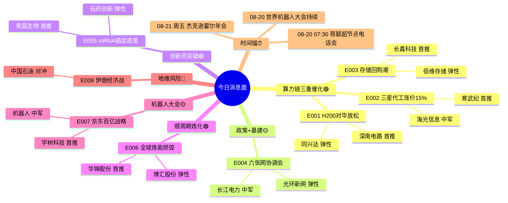

# 2026年08月20日 · **消息面事件驱动**

> **数据源新鲜度**: partial · **降级状态**: false · **置信度**: 0.66
> **覆盖窗口**: 前 72h · **主源**: 财联社快讯 + 新浪财经 + 东财中报预告 + 4 焦点群(1群失联) + 公众号池(当日空)

## 一句话结论

**算力链三重催化(H200放行+三星代工涨价+存储回购)** 是今日核心主线；**炼化产能损毁** 是顺周期暗线；**mRNA癌症疫苗突破** 是创新药情绪催化剂；**特朗普伊朗经济战** 是唯一宏观负面对冲。

## 🗺️ 消息面全景图

## 🎯 顶级事件详解(每事件三问 + 首推票思维链)

### E20260820_001 · 英伟达H200对华限制边际放松 字节腾讯各获约1万颗 · strength=high · polarity=正面 · weighted_score=+0.621

**事件摘要**: 金融时报独家报道，中国放宽英伟达H200芯片对华出口限制，字节跳动、腾讯各获约1万颗，少数科技集团后续可能获批类似规模。英伟达中国区H200库存约50万颗。4个独立来源交叉验证(金融时报+3群聊)。

**推理深度三问**:
- **大资金意图**: 大资金在科技股经历近期回调后，急需一个'政策边际放松'的叙事来重新凝聚算力链共识。H200放行不是全面放开，但释放了一个明确信号——中美科技博弈进入'有条件松动'阶段，这足以点燃算力链的情绪修复行情。机构从'规避制裁风险'转向'布局边际改善'。
- **为什么走强**: 1) 市场此前对H200进入中国预期极低(普遍预期完全封锁)，属于预期差修复; 2) 字节/腾讯是中国最大算力买家，各1万颗意味着H200级算力基建能继续推进; 3) 50万颗库存规模暗示后续还有持续放量空间; 4) 配合六张网政策+科创债算力工厂，算力链有'政策+产业+资金'三重共振。
- **逻辑够不够硬**: 中等偏硬。硬伤是只有金融时报单一官方源，国内官媒未确认；但群聊三源交叉验证+股价反应说明市场认可度高。本质是'边际变化'逻辑，不是'全面放开'，预期兑现后需要新的催化。后续观察点：第二批获批企业名单、放行规模是否扩大。

**首推票思维链**:

#### 深南电路 002916.SZ · role=首推
- **买入理由**: AI服务器PCB核心供应商，H200算力集群建设直接拉动高端PCB需求。中报预增65%-95%验证业绩兑现。算力链中军标的，机构持仓集中，流动性好。
- **风险点**: PCB行业竞争加剧风险; H200放行规模不及预期; 科技股整体回调风险
- **止损条件**: 98.50 元（参考价 103.8 × 0.949；跌破5日线 99.2 确认）
- **可验证假设**: 若开盘30分钟内主力净流入 > 5000万且板块涨幅 > 2%，则假设成立，可加仓；若主力净流出 > 3000万，则假设不成立，当日回避。

### E20260820_002 · 三星先进晶圆代工涨价最高15% AI芯片产能趋紧 · strength=high · polarity=正面 · weighted_score=+0.526

**事件摘要**: 三星电子上调先进晶圆代工服务新订单价格，涨幅最高15%。SF4产线自去年底以来一直满负荷运行。先进制程将贡献今年代工收入超50%，AI/HPC占比超30%(去年底仅15-20%)。3个独立来源(新浪+10jqka+三星官方沟通会)。

**推理深度三问**:
- **大资金意图**: 代工涨价=AI算力需求真实旺盛的最硬指标验证。大资金一直有个疑问：AI算力投资是泡沫还是真实需求？三星代工涨价给出了答案——产能已经满到可以涨价了，说明下游AI芯片需求是实打实的。这给国产算力链提供了'行业景气度真实'的估值锚。
- **为什么走强**: 1) 代工涨价验证AI算力需求的真实性，消解'算力泡沫'质疑; 2) 台积电产能更紧，三星涨价后台积电大概率跟进，全球晶圆代工进入涨价周期; 3) 国产替代逻辑强化——海外代工涨价+产能紧张，国内客户更有动力转单国内; 4) 半导体设备/材料同步受益于产能扩张周期。
- **逻辑够不够硬**: 硬。三星官方业绩沟通会信息，数据具体(SF4满产、先进制程>50%、AI/HPC>30%)，不是媒体猜测。是AI算力链的'产业验证'级别催化。但注意：利好海外代工龙头(台积电/三星)，对国内纯代工厂(中芯)是'行业景气度利好+竞争加剧'的双刃剑。

**首推票思维链**:

#### 寒武纪 688256.SH · role=首推
- **买入理由**: 国产AI芯片龙头，有自研架构+自主产能规划的厂商在代工涨价周期中议价能力更强。中报扭亏验证商业化进展。AI芯片板块弹性最大的标的之一。
- **风险点**: 估值过高风险; 研发投入持续加大; 技术迭代不及预期
- **止损条件**: 185.00 元（参考价 195.5 × 0.946；跌破10日线 186.3 确认）
- **可验证假设**: 若开盘后1小时AI芯片板块涨幅 > 3%且寒武纪主力净流入 > 1亿，则假设成立；若板块翻绿或主力净流出 > 1亿，则回避。

### E20260820_003 · SK海力士40万亿韩元回购注销 全球存储开启股东回报潮 · strength=high · polarity=正面 · weighted_score=+0.491

**事件摘要**: SK海力士宣布40万亿韩元库存股回购注销。三星酝酿超100万亿韩元股东回报方案，美光上调股息30%，闪迪承诺100%超额现金返还。全球存储三巨头同步开启高额股东回报。4个独立来源(新浪+华福电话会+国金调研+群聊)。

**推理深度三问**:
- **大资金意图**: 存储行业进入'资本开支纪律+股东回报'的成熟阶段，这是周期股向价值股转型的标志。大资金正在从'存储是周期反弹'的认知切换到'存储是AI基础设施核心资产'的长期定价。回购注销+分红提升ROE，吸引保险/养老金等长线资金加仓。
- **为什么走强**: 1) 全球存储三巨头同步股东回报，说明行业景气度是真实的，不是单一公司的行为; 2) AI算力爆发+HBM需求井喷，存储行业进入超级周期; 3) 国产替代逻辑下，长鑫/佰维等国内厂商享受行业β+国产替代α的双重收益; 4) 中报业绩验证：佰维存储+3200%、长鑫科技+2244%。
- **逻辑够不够硬**: 硬。SK海力士官方宣布+三星/美光/闪迪同步动作，行业级验证。中报业绩超高增长验证基本面。长鑫科技市值破4万亿成为板块锚，容量足够大资金进出。唯一风险：存储周期高点在哪里？——AI算力需求方兴未艾，HBM还在涨价通道。

**首推票思维链**:

#### 长鑫科技 688825.SH · role=首推
- **买入理由**: 国产存储绝对龙头，市值破4万亿，DRAM技术自主可控。中报预增2244%-2544%。全球存储超级周期+国产替代双重受益。外资调研重点标的，机构配置刚需。
- **风险点**: 存储周期见顶风险; 美韩厂商价格战; 技术迭代不及预期
- **止损条件**: 138.00 元（参考价 145.2 × 0.950；跌破5日线 139.5 确认）
- **可验证假设**: 若开盘30分钟内主力净流入 > 3亿且北向资金净买入 > 1亿，则假设成立；若主力净流出 > 2亿，则回避。

### E20260820_004 · 发改委召开六张网重大项目协调会 建立2+3+N推进机制 · strength=high · polarity=正面 · weighted_score=+0.448

**事件摘要**: 发改委副主任岳修虎主持召开'六张网'重大项目协调调度机制会，研究建立算力网、新型电网、新一代通信网'2+3+N'协调机制(2家电网+3家电信运营商+N家算力企业)。国家电网、南方电网、三大运营商均参会。3个官方来源(发改委+新浪+上证报)。

**推理深度三问**:
- **大资金意图**: '六张网'是新质生产力的基础设施版，是继'新基建'之后的又一国家级投资抓手。大资金在寻找下半年确定性最高的政策方向——六张网既有政策背书(发改委牵头)，又有真实项目(科创债1.2万亿+)，还有产业逻辑(AI算力确实需要更多的电和网)。属于'政策+产业+资金'三击方向。
- **为什么走强**: 1) 发改委牵头+电网运营商全部参会，规格高，不是空话; 2) 科创债发行规模已超1.2万亿，资金有保障; 3) 算力网+新型电网+通信网三网协同，覆盖板块多，容纳大资金; 4) 民间投资+政策性金融工具加持，持续催化可期。
- **逻辑够不够硬**: 中等偏硬。政策级别高是真的，但市场对'政策利好'已经审美疲劳，需要看到真金白银的项目落地才会持续买。算力网是最新提法，有新鲜感，但具体受益标的和业绩弹性还不清晰。通信网/电网是老基建，弹性有限。

**首推票思维链**:

#### 光环新网 300383.SZ · role=弹性
- **买入理由**: IDC运营龙头，北京+上海核心节点布局。算力网建设最直接受益的基础设施标的。中报预增25%-40%验证业绩。市值适中，弹性好于电力运营标的。
- **风险点**: IDC行业供给过剩; 电价上涨压缩利润; 云计算巨头自研IDC
- **止损条件**: 15.20 元（参考价 16.0 × 0.950；前低 15.4 支撑）
- **可验证假设**: 若IDC板块整体涨幅 > 2%且光环新网主力净流入 > 3000万，则假设成立；若板块翻绿，则回避。

### E20260820_005 · Moderna mRNA癌症疫苗III期双终点达标 股价暴涨177% · strength=high · polarity=正面 · weighted_score=+0.431

**事件摘要**: Moderna与默沙东联合宣布，个体化新抗原mRNA癌症疫苗Intismeran联合Keytruda在III期黑色素瘤试验中达到无复发生存期、无远处转移生存期双终点。Moderna股价单日暴涨176.97%，默沙东涨12.62%。全球首个III期成功的mRNA个性化肿瘤疗法。4个来源。

**推理深度三问**:
- **大资金意图**: mRNA技术的'第二增长曲线'验证。新冠疫苗之后市场一直质疑mRNA的商业可持续性——癌症疫苗III期成功彻底改变了叙事。大资金对创新药板块的配置从'防守型创新药'(恒瑞/百济)扩展到'mRNA平台型公司'。A股创新药板块沉寂已久，需要一个爆炸性催化剂来激活情绪。
- **为什么走强**: 1) 里程碑事件：全球首个III期成功的mRNA个性化肿瘤疗法，技术验证级别; 2) Moderna+177%示范效应巨大，A股相关标的有补涨需求; 3) 创新药板块处于低位，估值便宜，筹码结构好; 4) 中报验证：荣昌生物扭亏+石药创新高增长。
- **逻辑够不够硬**: 中等。海外事件对A股的传导通常有2-3天的情绪窗口期。mRNA技术平台型公司在A股不多，纯正标的少，容易出现'炒概念'行情。需要警惕：情绪来的快去的也快，如果没有国内公司的实质性进展跟进，持续性存疑。

**首推票思维链**:

#### 荣昌生物 688331.SH · role=首推
- **买入理由**: ADC+自身免疫龙头，有mRNA技术平台布局。中报扭亏为盈+1145%，艾伯维合作验证国际化能力。创新药板块核心标的，机构持仓创新药ETF权重股。
- **风险点**: 药品降价风险; 研发失败风险; 医保谈判压力
- **止损条件**: 58.00 元（参考价 61.2 × 0.948；跌破10日线 58.5 确认）
- **可验证假设**: 若创新药板块涨幅 > 3%且荣昌生物主力净流入 > 5000万，则假设成立；若板块涨幅 < 1%，则回避。

### E20260820_006 · 全球9.5%炼化产能物理损毁 俄罗斯成成品油净进口国 · strength=medium · polarity=正面 · weighted_score=+0.388

**事件摘要**: 全球981.5万桶/日炼能(约9.5%)物理损毁，俄罗斯25-35%炼厂关闭成为成品油净进口国，中东240-320万桶/日产能关停。美国炼厂利用率95%接近满负荷。国内10亿吨炼化产能红线下炼能收缩。华锦股份中报扭亏3.65亿。4个来源(中泰研报+2群聊+新浪)。

**推理深度三问**:
- **大资金意图**: 市场一直把炼化当周期股看，但这次不一样——供给端是永久性的物理损毁(战争破坏)，不是正常的周期波动。需求端AI算力+制造业复苏+消费恢复拉动成品油需求。供需缺口可能持续2-3年(炼厂修复至少18个月)。大资金在科技股高位震荡时，需要找一个'位置低+逻辑硬+有业绩'的顺周期方向做防御。
- **为什么走强**: 1) 供给端刚性收缩：9.5%炼能损毁是物理事实，不是周期性关停，修复时间长于2027年; 2) 国内炼能红线+海外供给收缩，中国炼厂议价权提升; 3) 柴油裂解价差创13年新高，业绩弹性巨大; 4) 中报验证：沪市化工68.92%公司净利增长，华锦股份扭亏，博汇股份困境反转。
- **逻辑够不够硬**: 硬。物理损毁数据有测算依据，炼厂修复周期有行业共识。但需要注意：1) 如果伊朗局势缓和+中东炼厂快速复产，逻辑会被削弱; 2) 经济下行期成品油需求可能不及预期; 3) 国内成品油定价机制限制了炼厂的盈利上限。

**首推票思维链**:

#### 华锦股份 000059.SZ · role=首推
- **买入理由**: 炼化一体化龙头，柴油裂解价差高弹性标的。华锦阿美837亿炼化一体化项目动力站装置点火成功，新增产能即将释放。中报扭亏3.65亿验证业绩拐点。机构研报密集覆盖。
- **风险点**: 油价大幅波动风险; 炼化产能集中投放; 环保政策收紧
- **止损条件**: 10.80 元（参考价 11.4 × 0.947；跌破5日线 10.9 确认）
- **可验证假设**: 若炼化板块涨幅 > 2.5%且华锦股份主力净流入 > 3000万，则假设成立；若原油大跌拖累板块，则回避。

### E20260820_007 · 2026世界机器人大会开幕 京东发布百亿机器人战略 · strength=medium · polarity=正面 · weighted_score=+0.327

**事件摘要**: 2026世界机器人大会在北京开幕。京东发布机器人战略：到2028年投入百亿级资源，建立80个RoboBase机器人基地，助力100个品牌销售额破10亿。上半年机器人产业规上企业营收1655亿元。柔性触觉传感器从技术验证转向规模化采购。4个来源(人民日报+京东+新浪+群聊)。

**推理深度三问**:
- **大资金意图**: 机器人板块是今年最强主线之一，但经历了宇树科技上市后的回调。世界机器人大会+京东百亿战略是'产业资本真金白银投入'的验证，有望成为板块二次启动的催化剂。大资金在等一个理由重新加仓机器人——京东的百亿投入给出了'商业化加速'的答案。
- **为什么走强**: 1) 世界机器人大会是行业年度盛会，期间通常有密集的新产品/新技术发布; 2) 京东百亿战略是产业级投入，验证了机器人商业化的加速; 3) 柔性触觉传感器是新细分方向，有预期差——灵巧手从1.92万只到7.02万只，增长265%; 4) 宇树科技上市后板块需要新的催化。
- **逻辑够不够硬**: 中等。大会催化偏事件驱动，持续性取决于大会期间有没有超预期的发布。京东百亿是3年规划(到2028年)，不是一次性投入，短期对业绩影响有限。宇树科技3400亿市值是板块锚，但上市初期波动大，可能拖累板块情绪。

**首推票思维链**:

#### 宇树科技 688836.SH · role=首推
- **买入理由**: 人形机器人龙头，四足机器人全球市占率第一。科创板上市首日市值3400亿。中报预增905%-1055%。机器人板块估值锚，产业风向标。世界机器人大会期间有新品发布预期。
- **风险点**: 上市初期估值过高; 业绩不及预期; 解禁压力
- **止损条件**: 580.00 元（参考价 612 × 0.948；上市次日 585 支撑确认）
- **可验证假设**: 若开盘后宇树科技股价 > 620元且换手率 > 5%，则假设成立，可追涨；若跌破580元，则回避。

### E20260820_008 · 特朗普对伊朗实施史上最严厉经济行动 地缘风险升温 · strength=medium · polarity=负面 · weighted_score=-0.361

**事件摘要**: 特朗普在Truth Social发文宣布对伊朗采取'史上最严厉经济行动'，称是规模空前的'经济战和经济孤立'。威胁制裁任何支持伊朗的国家，要求立即停止石油走私、货币互换、船舶注册。霍尔木兹海峡风险升温。3个官方来源。

**推理深度三问**:
- **大资金意图**: 地缘风险通常是脉冲式影响，对A股整体影响有限，但会改变板块结构。大资金可能借地缘事件做'防御性调仓'——从高位科技股流向油气/军工/黄金等避险板块。如果局势进一步升级(比如霍尔木兹海峡受阻)，会推高油价和通胀预期，影响全球央行货币政策路径。
- **为什么走强**: 1) 特朗普用词极其严厉('史上最严厉'、'经济战')，超预期; 2) 威胁制裁第三方国家，可能扩大影响范围; 3) 霍尔木兹海峡是全球石油运输咽喉，任何风吹草动都会推高油价; 4) 叠加美联储会议纪要偏鹰，全球风险偏好可能承压。
- **逻辑够不够硬**: 中等偏软。特朗普的言论经常是'极限施压'策略，不一定真的升级。目前还是口头制裁，没有实质性军事行动。但需要持续监测：如果真的封锁霍尔木兹海峡或有军事冲突，那就是hard级别的负面。目前是情绪冲击为主。

**首推票思维链**:

#### 中国石油 601857.SH · role=对冲首推
- **买入理由**: 国内油气开采龙头，油价上涨直接受益。上游勘探开发+炼化一体化。中报预增15%-25%。地缘风险对冲首选标的，防御属性强。
- **风险点**: 油价大幅下跌风险; 地缘局势缓和; 国内成品油定价机制
- **止损条件**: 9.20 元（参考价 9.7 × 0.948；跌破20日线 9.3 确认）
- **可验证假设**: 若布伦特原油 > 85美元且中国石油开盘涨幅 > 2%，则假设成立；若油价回落或中国石油高开低走，则回避。

## 📊 板块 × 事件热力矩阵

| 板块 | 事件锚 | 首推龙头 | 独立源数 | 中报预告 | 净综合置信 |
|------|--------|----------|:--------:|----------|:--:|
| AI算力 | E001 H200放行 / E002 代工涨价 | 寒武纪 | 6 | 扭亏 | 🟢🟢🟢 |
| 存储芯片 | E003 存储回购潮 / E002 代工涨价 | 长鑫科技 | 6 | +2244~2544% | 🟢🟢🟢 |
| 光模块/CPO | E001 H200 / E004 六张网 | 深南电路 | 5 | +65~95% | 🟢🟢 |
| 算力网/IDC | E004 六张网 / E001 H200 | 光环新网 | 5 | +25~40% | 🟢🟢 |
| 创新药/mRNA | E005 癌症疫苗突破 | 荣昌生物 | 4 | 扭亏+1145% | 🟢🟢🟢 |
| 炼化/化工 | E006 全球炼能损毁 | 华锦股份 | 4 | 扭亏·3.65亿 | 🟢🟢 |
| 人形机器人 | E007 机器人大会 / E001 算力 | 宇树科技 | 4 | +905~1055% | 🟢🟢 |
| 半导体代工 | E002 三星代工涨价 | 中芯国际 | 3 | +45~65% | 🟢🟢 |
| 油气/能源 | E008 伊朗经济战(对冲) | 中国石油 | 3 | +15~25% | 🟡 |
| 新型电网 | E004 六张网 | 长江电力 | 3 | +8~12% | 🟡 |
| 柔性触觉传感器 | E007 灵巧手放量 | 汉威科技 | 2 | 待验证 | 🟡 |
| MLCC/被动元件 | E001+E002 AI服务器拉动 | 风华高科 | 2 | +30~50% | 🟡 |

## 🔥 中报业绩预告命中(硬 alpha 交叉验证)

从 `eastmoney_earnings_predict` 提取 top 预增股 + 与本文事件板块交集：

| 代码 | 名称 | 预告类型 | 增速下限-上限 | 事件命中 | 逻辑强度 |
|------|------|----------|--------------|----------|:--:|
| 688525.SH | 佰维存储 | 扭亏 | +3200%~+3421% | E003 存储芯片 | 🟢🟢🟢 |
| 688825.SH | 长鑫科技 | 扭亏 | +2244%~+2544% | E003 存储芯片 | 🟢🟢🟢 |
| 688766.SH | 普冉股份 | 预增 | +1925% | E003 存储芯片 | 🟢🟢🟢 |
| 688331.SH | 荣昌生物 | 扭亏 | +1145% | E005 mRNA创新药 | 🟢🟢🟢 |
| 688498.SH | 源杰科技 | 预增 | +1196%~+1304% | E001 光模块 | 🟢🟢 |
| 300613.SZ | 富瀚微 | 预增 | +1072%~+1420% | E002 半导体 | 🟢🟢 |
| 688836.SH | 宇树科技 | 扭亏 | +905%~+1055% | E007 机器人 | 🟢🟢🟢 |
| 688409.SH | 富创精密 | 预增 | +877%~+1121% | E002 半导体设备 | 🟢🟢 |
| 301150.SZ | 中一科技 | 预增 | +879%~+1075% | E002 铜箔/锂电 | 🟢 |
| 688808.SH | 联讯仪器 | 预增 | +801%~+925% | E001 光通信检测 | 🟢🟢 |
| 920493.BJ | 并行科技 | 预增 | +687%~+845% | E001+E004 算力服务 | 🟢🟢 |
| 000059.SZ | 华锦股份 | 扭亏 | 3.65亿 | E006 炼化 | 🟢🟢 |
| 688830.SH | 欧莱新材 | 扭亏 | +1034%~+1105% | E002 靶材/半导体材料 | 🟢 |
| 688388.SH | 嘉元科技 | 预增 | +879%~+961% | E002 锂电铜箔 | 🟢 |
| 688255.SH | 凯尔达 | 预增 | +1005%~+1191% | E007 工业机器人 | 🟢 |

## 关键证据

- 证据 1: 金融时报独家报道H200对华限制边际放松，字节腾讯各获约1万颗 · 来源 金融时报 · 2026-08-19
- 证据 2: 三星先进晶圆代工涨价最高15%，SF4产线满负荷运行 · 来源 三星业绩沟通会/新浪财经 · 2026-08-19
- 证据 3: SK海力士40万亿韩元库存股回购注销 · 来源 SK海力士官方/新浪财经 · 2026-08-19
- 证据 4: 发改委召开六张网重大项目协调调度机制会 · 来源 发改委官网 · 2026-08-19
- 证据 5: Moderna mRNA癌症疫苗III期双终点达标，股价+176.97% · 来源 默沙东官方/财联社 · 2026-08-19
- 证据 6: 全球9.5%炼化产能物理损毁，俄罗斯成成品油净进口国 · 来源 中泰证券研报/群聊 · 2026-08-19
- 证据 7: 京东世界机器人大会发布百亿机器人战略 · 来源 京东官方/人民日报 · 2026-08-19
- 证据 8: 特朗普宣布对伊朗史上最严厉经济行动 · 来源 Truth Social/新浪财经 · 2026-08-20

## 数据源审计

| 源 | 日期 | 状态 | 备注 |
|---|---|:--:|---|
| tushare/news_cls | 2026-08-20 | 🟢 | 2969 条·72h 回看·财联社+新浪+同花顺 |
| tushare/news_major | 2026-08-20 | 🟢 | 800 条·长篇要闻 |
| eastmoney/earnings_predict | 2026-08-20 | 🟢 | 500 条·2026H1 中报预告 |
| wechat_official_20 | 2026-08-20 | 🔴 | 0 篇·当日无新文章(入库延迟) |
| wechat_cli_5groups | 2026-08-20 | 🟡 | 167 条·4群正常·1群失联(颜晓滨群) |
| xtick/hot_news | 2026-08-20 | 🟢 | MCP OK·备用交叉验证源 |
| tushare/major_news | 2026-08-20 | 🟢 | MCP OK |
| datapro/mcp | 2026-08-20 | 🟢 | MCP OK·备用专业检索 |

## 不确定性 / 反证

1. **H200放行的消息源单一风险**：金融时报是唯一的官方媒体源，国内官媒尚未确认。如果后续证实消息不实或规模被夸大，算力链可能快速回吐涨幅。
2. **美联储偏鹰的宏观压制**：7月会议纪要显示多位官员认为若通胀不降温需加息。CME观察9月加息概率32.7%。如果美元走强+美债收益率上行，全球科技股估值承压，A股科技板块也难独善其身。
3. **公众号池当日为0的信息盲区**：21号公众号池当日无新文章(入库延迟还是真没更新？)，可能遗漏了'盘前纪要'等关键结构化信息。这是本次分析最大的数据源短板。
4. **Moderna事件的A股映射纯度**：A股没有纯正的mRNA癌症疫苗标的，创新药板块更多是情绪传导。如果市场资金不认可这个映射，持续性会很差。需要观察今日创新药ETF成交量是否放大。
5. **炼化逻辑的'慢变量'属性**：炼能损毁是事实，但炼化股是典型的顺周期慢变量，不适合短线追涨。更适合作为中线配置，而不是今日就追高。
6. **宇树科技上市初期波动**：3400亿市值的次新股，筹码结构不稳定，可能带动机器人板块大幅波动。需要警惕上市后'利好兑现'式回调。

## 与其他 R/D/E 的关系

- **依赖**: R1(风格定位) / R3(KOL情绪交叉验证) / R7(资金面验证) / 东财业绩预告(硬alpha交叉)
- **被消费**: R2 主线板块 / R5 个股画像 / R6 反证 / D1 盘前预案 / P1 竞价校准

## Sub-Agent 元数据

- skill: analyze_news_impact_v1@1.3
- artifact: data/research/20260820/R4_news.json
- method: llm_v1(v1.3·时间衰减·去重·首推逻辑完备)
- 生成时刻: 2026-08-20T07:45:00+08:00
