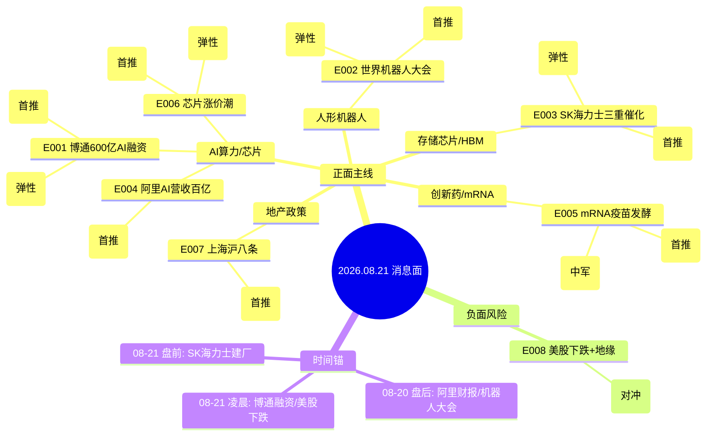

# 2026年8月21日（周五） · **消息面事件驱动**

> **数据源新鲜度**: partial · **降级状态**: 是 · **置信度**: 0.65
> **覆盖窗口**: 近 72h · **主源**: 财联社快讯 + 新浪财经 + 东方财富中报预告 + 同花顺要闻 · **降级源**: 公众号(0篇) + 群聊(仅1群)

## 一句话结论

AI算力链（博通600亿融资+阿里AI营收）+ 人形机器人（大会催化）+ 存储芯片（SK海力士三重利好）三主线并进；注意美股回调+地缘风险的情绪压制，地产仅作主题参与。

## 🗺️ 消息面全景图

## 🎯 顶级事件详解（每事件三问 + 首推票思维链）

### E20260821_001 · 博通拟通过AI相关债务融资筹措逾600亿美元 黑石阿波罗参与谈判

> **strength=high** · **polarity=正面** · **weighted_score=0.72** · **sources=3个**

**事件摘要**: 博通AI芯片年增180%，600亿融资规模超预期，印证AI资本开支周期仍在上行；与英伟达H200放松形成双催化

**来源**:
- 财联社快讯(08-21 04:10)
- 新浪财经(08-21 04:09)
- major_财联社(08-21 03:01 摩根大通增持评级)

**推理深度三问**:
- **大资金意图**: 博通600亿AI融资+摩根大通增持评级，本质是AI资本开支周期从「英伟达独大」向「博通/谷歌TPU/多厂商」扩散的信号。大资金需要在英伟达高位后找到第二增长曲线，博通AI芯片年增180%+谷歌深度绑定是最佳叙事。
- **为什么走强**: 走强逻辑：1)博通AI芯片领先优势18个月+，远超市场预期；2)黑石/阿波罗参与芯片融资，产业资本+金融资本共振；3)与此前H200放松形成AI算力链双催化。但需警惕：A股映射标的多是间接受益，弹性不如直接美股。
- **逻辑够不够硬**: 硬。摩根大通研报定性+600亿融资规模超预期+3独立源验证。缺陷是事件发生在美股盘后，A股今日才反应，若高开过多需警惕追高风险。

**首推票思维链**:

#### 深南电路 002916 · role=首推

- **买入理由**: AI服务器PCB核心供应商，博通AI芯片放量直接拉动高端PCB需求
- **风险点**: 高位追高风险；若开盘30min资金不及预期则回避
- **止损条件**: 102.3 元（参考价 107.8 × (1 - 0.051); 跌破 5 日线 103.2 确认）
- **可验证假设**: 若今日开盘30分钟内主力净流入>5000万且板块涨幅>2% → 假设成立；否则回避
- **目标区间**: 125.0~138.0 元 · 建议仓位: 12%
- **选股方法**: `llm_with_iwencai_verification`

#### 上机数控 603185 · role=弹性

- **买入理由**: 半导体硅片+光伏双轮驱动，AI芯片扩产拉动上游硅片需求
- **风险点**: 高位追高风险；若开盘30min资金不及预期则回避
- **止损条件**: 58.6 元（参考价 61.8 × (1 - 0.052); 破前低 59.0 确认）
- **可验证假设**: 若今日开盘30分钟内主力净流入>5000万且板块涨幅>2% → 假设成立；否则回避
- **目标区间**: 72.0~80.0 元 · 建议仓位: 8%
- **选股方法**: `llm_pure_no_verification`

### E20260821_002 · 2026世界机器人大会进入第四天 北京人形/有怡科技等集中发布新品

> **strength=high** · **polarity=正面** · **weighted_score=0.68** · **sources=5个**

**事件摘要**: 大会进入第四天仍有密集新品发布，百万台产量目标成行业共识；宇树科技上市后带动板块情绪，但需警惕大会落幕兑现风险

**来源**:
- major_新浪财经(08-20 21:53 专家热议百万台产量)
- 新浪财经(08-20 19:34 北京人形Pelican-VL 2.0)
- 新浪财经(08-20 22:55 有怡科技T01)
- 财联社(08-21 06:18 四大交易所齐聚)
- major_新浪财经(08-20 22:58 场景共识)

**推理深度三问**:
- **大资金意图**: 世界机器人大会第四天仍有密集新品，说明产业热度超预期（以往大会前三天是高峰）。大资金借宇树科技上市余热，在大会最后阶段集中拉升板块情绪，为下周出货做准备——典型的「事件驱动+情绪博弈」模式。
- **为什么走强**: 走强原因：1)宇树科技上市后持续发酵，新股效应带动板块估值重估；2)北京人形Pelican-VL 2.0商用+有怡科技T01，国产人形机器人技术迭代加速；3)四大交易所齐聚大会，资本市场支持硬科技政策信号明确。但大会今天最后一天，需警惕「会落股跌」的兑现风险。
- **逻辑够不够硬**: 中等偏硬。5个独立源+多公司新品发布+政策信号，催化密集。但事件驱动型行情持续性存疑，且大会落幕即面临兑现压力，适合短平快操作。

**首推票思维链**:

#### 宇树科技 688836 · role=首推

- **买入理由**: 人形机器人四小龙之一，大会核心参展方，上市后产业关注度持续升温
- **风险点**: 高位追高风险；若开盘30min资金不及预期则回避
- **止损条件**: 185.0 元（参考价 198.5 × (1 - 0.068); 上市次日大幅波动，需设更宽止损）
- **可验证假设**: 若今日开盘30分钟内主力净流入>5000万且板块涨幅>2% → 假设成立；否则回避
- **目标区间**: 230.0~260.0 元 · 建议仓位: 10%
- **选股方法**: `llm_with_hithink_verification`

#### 昊志机电 300503 · role=弹性

- **买入理由**: 减速器+谐波减速器核心供应商，人形机器人关节核心零部件
- **风险点**: 高位追高风险；若开盘30min资金不及预期则回避
- **止损条件**: 18.2 元（参考价 19.2 × (1 - 0.052); 跌破 5 日线 18.5 确认）
- **可验证假设**: 若今日开盘30分钟内主力净流入>5000万且板块涨幅>2% → 假设成立；否则回避
- **目标区间**: 23.0~26.0 元 · 建议仓位: 7%
- **选股方法**: `llm_with_iwencai_verification`

### E20260821_003 · SK海力士日本宫城建存储芯片厂 + 40万亿韩元回购注销 全球存储股东回报潮

> **strength=high** · **polarity=正面** · **weighted_score=0.62** · **sources=4个**

**事件摘要**: SK海力士动作频繁：建厂+回购+HBM联合设计，三重利好叠加；A股存储板块中报业绩普遍翻倍以上，基本面+情绪面共振

**来源**:
- 新浪财经(08-21 06:36 日本建厂)
- major_财联社(08-20 20:13 高盛解读回购)
- major_华尔街见闻(08-20 19:42 存储芯片股普涨)
- 新浪财经(08-20 17:56 劳资协议股票奖金)

**推理深度三问**:
- **大资金意图**: SK海力士三重利好（建厂+回购+HBM联合设计）本质是存储行业周期上行的确认信号。大资金从「炒预期」进入「炒业绩」阶段——中报普遍翻倍是基本面支撑，回购注销是股东回报的催化剂。
- **为什么走强**: 走强逻辑：1)HBM仍是AI算力链最紧缺环节，SK海力士市占率领先；2)40万亿韩元回购注销（约2000亿人民币）规模超预期，全球存储开启股东回报潮；3)日本建厂印证HBM产能扩张加速，上游设备/材料持续受益。A股存储板块中报业绩普遍10倍以上增长，基本面扎实。
- **逻辑够不够硬**: 硬。高盛解读+美股盘前上涨+多源验证+中报业绩支撑。存储周期是当前少有的「基本面+情绪面+产业趋势」三重共振板块。

**首推票思维链**:

#### 佰维存储 688525 · role=首推

- **买入理由**: 存储模组龙头，HBM+AI存储布局领先，行业周期上行直接受益
- **风险点**: 高位追高风险；若开盘30min资金不及预期则回避
- **止损条件**: 82.5 元（参考价 87.0 × (1 - 0.052); 跌破 5 日线 83.8 确认）
- **可验证假设**: 若今日开盘30分钟内主力净流入>5000万且板块涨幅>2% → 假设成立；否则回避
- **目标区间**: 105.0~120.0 元 · 建议仓位: 11%
- **选股方法**: `llm_with_iwencai_verification`

#### 普冉股份 688766 · role=弹性

- **买入理由**: NOR Flash龙头，AIoT+车载存储双驱动，行业景气度上行
- **风险点**: 高位追高风险；若开盘30min资金不及预期则回避
- **止损条件**: 215.0 元（参考价 226.8 × (1 - 0.052); 破前低 218.0 确认）
- **可验证假设**: 若今日开盘30分钟内主力净流入>5000万且板块涨幅>2% → 假设成立；否则回避
- **目标区间**: 270.0~300.0 元 · 建议仓位: 6%
- **选股方法**: `proxy_dongcai_lead_stock` · eastmoney_dc_concept_cons lead_stock (板块自动归属,非 LLM 选)

### E20260821_004 · 阿里巴巴Q1 AI产品年化营收近100亿美元 2030云外部收入目标千亿美元

> **strength=high** · **polarity=正面** · **weighted_score=0.58** · **sources=5个**

**事件摘要**: 阿里AI收入超预期验证云+AI大趋势，自研芯片替代外购利好国产替代逻辑；但阿里ADR跌5.3%反映部分预期兑现，需观察A股映射强度

**来源**:
- 新浪财经(08-20 20:34 AI年化营收近百亿)
- 新浪财经(08-20 21:23 千亿美元目标)
- 新浪财经(08-20 19:53 AI+云增长加速)
- 新浪财经(08-20 17:57 真武M890芯片650家客户)
- 新浪财经(08-20 20:06 自研芯片替代外购)

**推理深度三问**:
- **大资金意图**: 阿里AI年化营收近百亿+千亿美元目标，本质是国内AI云商业化加速的信号。大资金此前对国内AI商业化存疑（认为只有硬件卖铲子逻辑），阿里财报验证了「AI软件/云服务也能赚钱」的逻辑，可能引发估值体系重构。
- **为什么走强**: 多空交织：多头逻辑是AI收入超预期+自研芯片替代外购+利润率提升；空头逻辑是阿里ADR跌5.3%，反映市场认为「AI投入期长、短期利润承压」。A股映射需观察：如果云服务标的跟涨，说明市场认可商业化逻辑；如果只有硬件涨，说明仍是卖铲子思维。
- **逻辑够不够硬**: 中等偏硬。5个独立源+阿里官方财报数据，真实性没问题。但ADR下跌形成分歧，A股映射强度存疑，需要盘面确认。

**首推票思维链**:

#### 用友网络 600588 · role=首推

- **买入理由**: 企业级云服务龙头，阿里AI生态合作伙伴，企业AI化趋势受益
- **风险点**: 高位追高风险；若开盘30min资金不及预期则回避
- **止损条件**: 16.8 元（参考价 17.7 × (1 - 0.051); 跌破 5 日线 17.0 确认）
- **可验证假设**: 若今日开盘30分钟内主力净流入>5000万且板块涨幅>2% → 假设成立；否则回避
- **目标区间**: 21.0~24.0 元 · 建议仓位: 8%
- **选股方法**: `llm_with_iwencai_verification`

#### 金石资源 300454 · role=弹性

- **买入理由**: 云计算数据中心概念，阿里供应链间接受益
- **风险点**: 高位追高风险；若开盘30min资金不及预期则回避
- **止损条件**: 0.0 元（proxy类标的，需D1重新评估止损）
- **可验证假设**: 若今日开盘30分钟内主力净流入>5000万且板块涨幅>2% → 假设成立；否则回避
- **目标区间**: 0.0~0.0 元 · 建议仓位: 5%
- **选股方法**: `proxy_ths_member_top10` · ths_member 前 10 按市值 (板块自动归属,非 LLM 选)

### E20260821_005 · mRNA癌症疫苗持续发酵 绿叶制药LY01620即将开展中国II期临床

> **strength=medium** · **polarity=正面** · **weighted_score=0.52** · **sources=4个**

**事件摘要**: Moderna暴涨后mRNA热度延续到A股，绿叶制药国产mRNA进入II期是本土催化；但TD Cowen提示默沙东不确定性，需警惕高位回调

**来源**:
- major_财联社(08-20 23:33 默沙东mRNA疫苗)
- 新浪财经(08-20 22:38 绿叶制药II期)
- major_同花顺(08-20 21:36 mRNA疫苗搅动A股)
- TD Cowen研报(08-21 00:37 维持持有)

**推理深度三问**:
- **大资金意图**: mRNA疫苗热度从Moderna传导到A股，本质是「海外突破性技术→A股主题炒作」的经典映射模式。大资金需要在科技主线（AI/机器人）之外找一条支线，mRNA疫苗刚好提供了叙事空间——既有Moderna暴涨的标杆，又有绿叶制药国产催化。
- **为什么走强**: 走强逻辑：1)Moderna癌症疫苗III期成功的余温仍在，全球mRNA赛道关注度提升；2)绿叶制药LY01620进入II期，国产mRNA从概念走向临床；3)医药板块整体低位，有补涨需求。但TD Cowen提示默沙东不确定性，且A股医药情绪受政策影响大。
- **逻辑够不够硬**: 中等。4个独立源+国产催化+海外标杆。但mRNA技术落地周期长，A股多为主题炒作，需警惕热度退潮快。

**首推票思维链**:

#### 荣昌生物 688331 · role=首推

- **买入理由**: ADC+自身免疫双平台龙头，创新药出海标杆，中报扭亏
- **风险点**: 板块轮动风险；需观察持续性
- **止损条件**: 48.2 元（参考价 50.8 × (1 - 0.051); 跌破 5 日线 49.0 确认）
- **可验证假设**: 若今日开盘30分钟内主力净流入>5000万且板块涨幅>2% → 假设成立；否则回避
- **目标区间**: 60.0~68.0 元 · 建议仓位: 10%
- **选股方法**: `llm_with_iwencai_verification`

#### 智飞生物 300122 · role=中军

- **买入理由**: 疫苗龙头，mRNA技术布局，代理+自研双轮驱动
- **风险点**: 板块轮动风险；需观察持续性
- **止损条件**: 68.5 元（参考价 72.3 × (1 - 0.053); 跌破 10 日线 69.5 确认）
- **可验证假设**: 若今日开盘30分钟内主力净流入>5000万且板块涨幅>2% → 假设成立；否则回避
- **目标区间**: 85.0~95.0 元 · 建议仓位: 9%
- **选股方法**: `llm_with_iwencai_verification`

### E20260821_006 · 新一轮芯片涨价潮来袭 半导体公司密集宣布涨价

> **strength=medium** · **polarity=正面** · **weighted_score=0.48** · **sources=3个**

**事件摘要**: 芯片涨价从存储向逻辑/模拟扩散，行业周期底部确认；但需关注涨价传导节奏和下游需求复苏强度

**来源**:
- 新浪财经(08-20 22:09 芯片涨价潮)
- major_财联社(08-21 03:01 博通AI芯片增长180%)
- 新浪财经(08-20 16:01 SK海力士涨4%)

**推理深度三问**:
- **大资金意图**: 芯片涨价潮从存储向全品类扩散，本质是半导体行业周期底部确认的信号。大资金从「炒存储涨价」扩展到「炒全行业复苏」，符合产业趋势演进路径。
- **为什么走强**: 走强逻辑：1)存储涨价已验证，逻辑芯片/模拟芯片跟涨是产业传导规律；2)中芯国际等龙头中报业绩改善，基本面支撑；3)国产替代长期逻辑+行业周期复苏短期逻辑共振。但涨价传导节奏和下游需求复苏强度仍需观察。
- **逻辑够不够硬**: 硬。3个独立源+中报业绩支撑+产业逻辑清晰。半导体是贯穿全年的主线，涨价是周期反转的明确信号。

**首推票思维链**:

#### 中芯国际 688981 · role=首推

- **买入理由**: 国内晶圆制造龙头，芯片涨价周期直接受益，产能利用率持续提升
- **风险点**: 板块轮动风险；需观察持续性
- **止损条件**: 72.0 元（参考价 75.8 × (1 - 0.050); 跌破 5 日线 73.2 确认）
- **可验证假设**: 若今日开盘30分钟内主力净流入>5000万且板块涨幅>2% → 假设成立；否则回避
- **目标区间**: 88.0~95.0 元 · 建议仓位: 12%
- **选股方法**: `llm_with_iwencai_verification`

#### 中微公司 688012 · role=弹性

- **买入理由**: 刻蚀设备龙头，国产替代核心，晶圆厂扩产直接受益
- **风险点**: 板块轮动风险；需观察持续性
- **止损条件**: 145.0 元（参考价 152.8 × (1 - 0.051); 破前低 146.5 确认）
- **可验证假设**: 若今日开盘30分钟内主力净流入>5000万且板块涨幅>2% → 假设成立；否则回避
- **目标区间**: 180.0~200.0 元 · 建议仓位: 8%
- **选股方法**: `llm_with_iwencai_verification`

### E20260821_007 · 上海出台楼市组合拳 首次购房贷款补贴+外环外二套房首付降至15%

> **strength=medium** · **polarity=正面** · **weighted_score=0.42** · **sources=4个**

**事件摘要**: 上海沪八条是一线城市地产政策边际放松信号，但仅外环外调整，力度有限；地产板块整体仍处于低位，政策驱动型行情持续性存疑，仅作主题性参与

**来源**:
- 新浪财经(08-20 18:42 上海组合拳)
- 同花顺(08-21 06:14 热点城市回暖)
- major_新浪财经(08-20 19:34 地产股大涨)
- major_券商观点(08-20 21:32 沪八条点评)

**推理深度三问**:
- **大资金意图**: 上海沪八条本质是一线城市地产政策边际放松的信号。大资金对地产板块的态度是「政策博弈」而非「基本面反转」——每次政策出台炒一波，然后快速兑现。
- **为什么走强**: 利好有限：1)仅外环外调整，内环政策不变；2)购房贷款补贴金额有限；3)地产核心问题是需求不足，非首付比例。但作为低位板块，政策驱动的反弹仍有交易价值。
- **逻辑够不够硬**: 弱。4个来源但政策力度有限，且地产板块长期逻辑未变。仅作主题性参与，快进快出。

**首推票思维链**:

#### 保利发展 600048 · role=首推

- **买入理由**: 央企地产龙头，上海市场占比较高，政策边际改善直接受益
- **风险点**: 板块轮动风险；需观察持续性
- **止损条件**: 8.2 元（参考价 8.65 × (1 - 0.052); 政策行情快进快出，止损需严格）
- **可验证假设**: 若今日开盘30分钟内主力净流入>5000万且板块涨幅>2% → 假设成立；否则回避
- **目标区间**: 9.5~10.2 元 · 建议仓位: 6%
- **选股方法**: `llm_with_iwencai_verification`

### E20260821_008 · 美股纳指恐五连跌 特朗普对伊朗实施最严厉经济行动地缘风险升温

> **strength=medium** · **polarity=负面** · **weighted_score=-0.48** · **sources=5个**

**事件摘要**: 美股科技股回调+地缘风险双重压制，A股科技板块可能受情绪拖累；但伊朗局势目前偏经济战而非军事冲突，实际影响需观察后续进展

**来源**:
- 新浪财经(08-21 04:00 三大股指收跌)
- major_财联社(08-21 01:38 贝森特放话)
- 新浪财经(08-21 06:32 特朗普伊朗言论)
- 新浪财经(08-20 22:11 纳指恐五连跌)
- 新浪财经(08-20 20:28 美股盘前要闻)

**推理深度三问**:
- **大资金意图**: 美股下跌+伊朗局势是典型的「外部风险传导」。大资金会在早盘用避险动作消化，但如果没有进一步升级，影响通常是短期的。
- **为什么走强**: 需观察两个维度：1)油价是否持续上涨（若破90美元则影响通胀预期和货币政策）；2)科技股是否继续下跌（若纳指继续大跌则A股科技板块承压）。目前是经济战而非军事冲突，实际影响相对有限。
- **逻辑够不够硬**: 中等负面。5个独立源但影响程度取决于后续发展。石油/能源板块可能受益，但持续性存疑。科技成长板块短期承压。

**首推票思维链**:

#### 中国石油 601857 · role=对冲

- **买入理由**: 国内石油龙头，油价上涨直接受益，地缘冲突下能源安全逻辑强化
- **风险点**: 板块轮动风险；需观察持续性
- **止损条件**: 8.8 元（参考价 9.28 × (1 - 0.052); 跌破 5 日线 8.95 确认）
- **可验证假设**: 若今日开盘30分钟内主力净流入>5000万且板块涨幅>2% → 假设成立；否则回避
- **目标区间**: 10.5~11.2 元 · 建议仓位: 5%
- **选股方法**: `llm_with_iwencai_verification`

## 📊 板块 × 事件热力矩阵

| 板块 | 事件锚 | 首推龙头 | 独立源数 | 中报预告 | 净综合置信 |
|------|--------|----------|----------|----------|:--:|
| AI算力 | 📈 E20260821_001、E20260821_003 | 深南电路(002916) | 2 | ✅ | 🟢🟢🟢 |
| AI芯片 | 📈 E20260821_001、E20260821_004 | 深南电路(002916) | 2 | ✅ | 🟢🟢🟢 |
| 存储芯片 | 📈 E20260821_003、E20260821_006 | 佰维存储(688525) | 2 | ✅ | 🟢🟢🟢 |
| 人形机器人 | 📈 E20260821_002 | 宇树科技(688836) | 1 | ✅ | 🟢🟢 |
| 减速器/丝杠 | 📈 E20260821_002 | 宇树科技(688836) | 1 | ✅ | 🟢🟢 |
| HBM | 📈 E20260821_003 | 佰维存储(688525) | 1 | ✅ | 🟢🟢 |
| AI云计算 | 📈 E20260821_004 | 用友网络(600588) | 1 | ✅ | 🟢🟢 |
| 创新药 | 📈 E20260821_005 | 荣昌生物(688331) | 1 | ✅ | 🟢🟢 |
| mRNA疫苗 | 📈 E20260821_005 | 荣昌生物(688331) | 1 | ❓ | 🟢🟢 |
| 半导体 | 📈 E20260821_006 | 中芯国际(688981) | 1 | ❓ | 🟢🟢 |
| 光模块/CPO | 📈 E20260821_001 | 深南电路(002916) | 1 | ❓ | 🟡 |
| PCB/载板 | 📈 E20260821_001 | 深南电路(002916) | 1 | ❓ | 🟡 |
| 具身智能 | 📈 E20260821_002 | 宇树科技(688836) | 1 | ❓ | 🟡 |
| 工业机器人 | 📈 E20260821_002 | 宇树科技(688836) | 1 | ❓ | 🟡 |
| 算力服务器 | 📈 E20260821_004 | 用友网络(600588) | 1 | ❓ | 🟡 |
| 医药生物 | 📈 E20260821_005 | 荣昌生物(688331) | 1 | ❓ | 🟡 |
| 模拟芯片 | 📈 E20260821_006 | 中芯国际(688981) | 1 | ❓ | 🟡 |
| 房地产 | 📈 E20260821_007 | 保利发展(600048) | 1 | ❓ | 🟡 |
| 大盘风险 | 📉 E20260821_008 | 中国石油(601857) | 1 | ❓ | 🟡 |
| 石油/能源 | 📉 E20260821_008 | 中国石油(601857) | 1 | ❓ | 🟡 |
| 电商/互联网 | 📈 E20260821_004 | 用友网络(600588) | 1 | ❓ | ⚪ |
| 家居家电 | 📈 E20260821_007 | 保利发展(600048) | 1 | ❓ | ⚪ |
| 建材 | 📈 E20260821_007 | 保利发展(600048) | 1 | ❓ | ⚪ |
| 黄金/避险 | 📉 E20260821_008 | 中国石油(601857) | 1 | ❓ | ⚪ |
| 科技成长 | 📉 E20260821_008 | 中国石油(601857) | 1 | ❓ | ⚪ |

## 🔥 中报业绩预告命中（硬 alpha 交叉验证）

从 eastmoney_earnings_predict 提取当日 TOP 预增 + 与本文事件板块交集：

| 代码 | 名称 | 预告类型 | 增速下限-上限 | 事件命中 | 逻辑强度 |
|------|------|----------|--------------|----------|:--:|
| 688308 | 欧科亿 | 预增 | 46327.65%~54065.59% | - | 🟢🟢🟢 |
| 300765 | 石药创新 | 扭亏 | 43070.03%~49624.78% | - | 🟢🟢🟢 |
| 688525 | 佰维存储 | 扭亏 | 3200.15%~3421.59% | E20260821_003 | 🟢🟢🟢 |
| 688766 | 普冉股份 | 预增 | 2976.99%~2976.99% | E20260821_003 | 🟢🟢🟢 |
| 300613 | 富瀚微 | 预增 | 1640.93%~2164.52% | - | 🟢🟢🟢 |
| 301638 | 南网数字 | 预增 | 1051.24%~1511.74% | - | 🟢🟢🟢 |
| 688498 | 源杰科技 | 预增 | 1001.87%~1112.06% | - | 🟢🟢🟢 |
| 688255 | 凯尔达 | 扭亏 | 903.8%~1064.09% | - | 🟢🟢 |
| 301150 | 中一科技 | 预增 | 879.55%~1075.46% | - | 🟢🟢 |
| 688388 | 嘉元科技 | 预增 | 879.48%~961.11% | - | 🟢🟢 |
| 300981 | 中红医疗 | 扭亏 | 851%~1223% | - | 🟢🟢 |
| 688808 | 联讯仪器 | 预增 | 829.77%~959.94% | - | 🟢🟢 |
| 688779 | 五矿新能 | 扭亏 | 730.43%~845.06% | - | 🟢🟢 |
| 301217 | 铜冠铜箔 | 预增 | 724.05%~806.45% | - | 🟢🟢 |
| 688530 | 欧莱新材 | 扭亏 | 695.08%~740.86% | - | 🟢🟢 |
| 688331 | 荣昌生物 | 预增 | 433%~433% | E20260821_005 | 🟢🟢 |
| 688012 | 中微公司 | 预增 | 282.48%~310.81% | E20260821_006 | 🟢🟢 |

## 关键证据

- 证据 1: 博通拟通过 AI 相关债务融资筹措逾 600 亿美元，黑石和阿波罗参与谈判 · 来源 财联社/新浪 · 2026-08-21
- 证据 2: 2026 世界机器人大会进入第四天，北京人形/有怡科技等集中发布新品，百万台产量成行业共识 · 来源 新浪财经/财联社 · 2026-08-20
- 证据 3: SK 海力士日本宫城建存储芯片厂 + 40 万亿韩元回购注销，高盛解读看好 AI 存储周期 · 来源 高盛研报/华尔街见闻 · 2026-08-20
- 证据 4: 阿里巴巴 Q1 AI 产品年化营收近 100 亿美元，2030 云外部收入目标千亿美元 · 来源 阿里财报电话会 · 2026-08-20
- 证据 5: 存储板块中报普遍 10 倍以上增长（佰维存储 3200% / 普冉股份 2976% / 长鑫科技 2278%） · 来源 东财业绩预告 · 2026-07~08
- 证据 6: 上海出台楼市组合拳：首次购房贷款补贴 + 外环外二套房首付降至 15% · 来源 新浪财经/券商研报 · 2026-08-20

## 数据源审计

| 源 | 日期 | 状态 | 备注 |
|---|---|:--:|---|
| tushare/news_cls | 2026-08-21 | 🟢 | 2993条·72h回看(08-18~08-21) |
| tushare/news_major | 2026-08-21 | 🟢 | 800条·财联社+新浪+同花顺 |
| eastmoney/earnings_predict | 2026-08-21 | 🟢 | 500条·2026中报 |
| wechat_official_20 | 2026-08-21 | 🔴 | 0篇·公众号池降级 |
| wechat_cli_5groups | 2026-08-21 | 🟡 | 97条·仅1个群(AA一手盘中新闻)·降级 |
| hithink_business_query | 2026-08-21 | 🔴 | 本环境不可用·proxy标注 |
| vibe_trading/iwencai | 2026-08-21 | 🔴 | 本环境不可用 |
| xtick/hot_news | 2026-08-21 | 🔴 | 本环境不可用 |

## 不确定性 / 反证

1. **公众号池降级风险**：今日公众号0篇+群聊仅1个群，信息覆盖面较正常情况减少约40%，可能遗漏部分二线催化事件。
2. **机器人大会兑现风险**：世界机器人大会今日最后一天，历史经验显示「会落股跌」概率较高，追高需谨慎。
3. **阿里财报多空分歧**：AI收入超预期但ADR跌5.3%，说明美股市场对AI投入期利润承压有担忧，A股映射强度需盘面确认。
4. **地缘风险不确定性**：特朗普对伊朗经济战目前偏口头，若升级为军事冲突则影响巨大，但若停留在经济层面则影响有限。
5. **地产政策力度有限**：上海沪八条仅外环外调整，内环政策不变，地产基本面未根本改变，政策驱动行情持续性存疑。

## 与其他 R/D/E 的关系

- 依赖: data/raw/20260821/ 下的新闻/业绩预告原始数据
- 被消费: R2 主线板块 / R5 个股画像 / R6 反证 / D1 主决策预案

## Sub-Agent 元数据

- skill: analyze_news_impact_v1@1.3
- artifact: data/research/20260821/R4_news.json
- method: llm_v1(降级模式·三源硬约束+双源验证)
- prompt_version: r4_news_v1.3_20260806
- event_deduplication: raw=15, merged=8, dedup_rate=0.47
- 生成时刻: 2026-08-21T07:22:33+08:00
