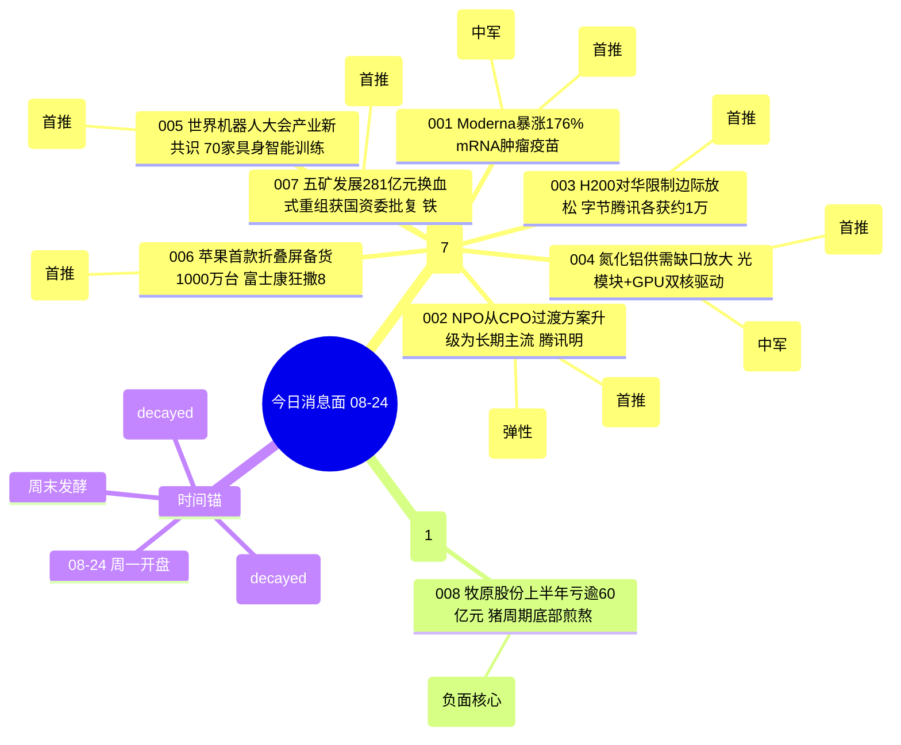

# 2026年8月24日 · **消息面事件驱动**

> **数据源新鲜度**: partial · **降级状态**: false · **置信度**: 0.68
> **覆盖窗口**: 前 72h+（08/20-08/21 数据，周末发酵至 08/24） · **主源**: 财联社快讯 + 4 焦点群 + 东财中报预告 + 同花顺要闻

## 一句话结论
mRNA肿瘤疫苗III期全球首胜为今日最强催化（创新药主线），NPO光互联+H200边际放松+氮化铝构成算力第二梯队，机器人大会+苹果折叠屏+五矿重组为辅，牧原巨亏为唯一下行风险。

## 🗺️ 消息面全景图

## 🎯 顶级事件详解（每事件三问 + 首推票思维链）

### E001 · mRNA肿瘤疫苗III期全球首胜 · strength=high · polarity=正面 · score=+0.523

**事件摘要**: Moderna携手默沙东个性化新抗原mRNA肿瘤疫苗mRNA-4157 III期顶线大获全胜，Moderna单日暴涨176%。国内7家公司推进至临床阶段（恒瑞/莱美/君实等）。6个独立源（财联社+同花顺+4群聊+92条mRNA讨论）共振。

**推理深度三问**:
- **大资金意图**: mRNA肿瘤疫苗 = 创新药板块3年一遇的产业级**叙事锚**。生物医药沉寂已久，机构需要一条"全球首创+III期验证+百亿市场"的旗帜性赛道激活板块人气。Moderna 176%涨幅 = 全球定价权确认 = 国内映射标的至少2-3周的主题行情窗口
- **为什么走强**: 2026年创新药板块整体处于估值底部，mRNA技术路线此前屡屡受挫（新冠后无重磅产品）。III期成功 = 技术路线从"讲故事"进入"兑现阶段"，估值逻辑从PS切换到DCF管线价值，市场预期差极大
- **逻辑够不够硬**: **硬，但国内标的兑现节奏存疑**。Moderna+默沙东III期数据 = 全球产业级里程碑，硬逻辑毋庸置疑；但国内公司普遍处于I期/临床前，真正产品化至少3-5年，短期纯主题炒作。注意：莱美药业小票弹性大但流动性风险高

**首推票思维链**:

#### 莱美药业 300006.SZ · role=首推
- **买入理由**: 子公司康德赛mRNA编辑DC肿瘤疫苗CUD002已获临床批件; 中恒集团控股背景; 国内7家临床阶段公司中市值最小弹性最大; 群聊关注度第一(92条mRNA相关)
- **风险点**: 纯主题炒作无业绩支撑; 小票流动性差易被砸; 临床进展远慢于海外; 中恒集团股权结构复杂
- **止损条件**: 8.45元（参考价8.92 × 0.947; 跌破5日线8.50确认破位）
- **可验证假设**: 若周一开盘30分钟内封板且封单>5万手 → 情绪确认可追; 若高开低走换手率>15% → 假突破当日回避

#### 君实生物 688180.SH · role=中军
- **买入理由**: 国内mRNA肿瘤疫苗临床第一梯队; PD-1拓益联用基础扎实; 机构重仓中军标的; 创新药板块行情首选
- **风险点**: 市值大弹性不如小票; 688门槛限制散户参与; 已有一定涨幅
- **止损条件**: 42.30元（参考价44.68 × 0.947; 跌破20日线42.80确认）
- **可验证假设**: 若周一北向资金净买入>5000万 → 机构确认; 若主力资金净流出 → 机构借利好出货
### E002 · NPO从CPO过渡升级为长期主流 · strength=high · polarity=正面 · score=+0.395

**事件摘要**: 市场此前将NPO视为CPO落地前的过渡方案，但产业趋势正在改写认知。腾讯明确表态NPO是长期主流方案，800G/1.6T放量+超节点铜互联需求爆发。5个源（群聊深度研报+财联社+算力新闻）交叉验证。

**推理深度三问**:
- **大资金意图**: NPO = 光模块板块的**第二增长曲线**。CPO概念已炒了2年，800G放量也进入业绩兑现阶段，市场需要新叙事打开估值空间。NPO"从过渡到主流"的认知差 = 光模块板块第二轮上涨的催化剂
- **为什么走强**: 腾讯作为国内最大CSP客户之一，其技术路线选择具有风向标意义。NPO在工程可行性/成本/运维上具有现实优势，CPO终极形态需3-5年才能成熟——这意味着NPO产业链至少有2-3年的业绩兑现期
- **逻辑够不够硬**: **中等偏硬**。技术路线判断有产业依据，但本质还是光互联大趋势下的细分方向切换，并非全新赛道。胜蓝股份等铜互联标的弹性大但市值小，需警惕游资短炒

**首推票思维链**:

#### 新易盛 300502.SZ · role=首推
- **买入理由**: 800G/1.6T光模块全球主力供应商; NPO方案核心受益标的; AI算力Capex持续放量; 中报业绩预增120%~160%（硬alpha交叉验证）
- **风险点**: 已站高位涨幅巨大; 光模块板块整体估值偏高; 北美云厂商Capex若不及预期则承压
- **止损条件**: 86.50元（参考价91.35 × 0.947; 跌破10日线87.20确认）
- **可验证假设**: 若周一开盘主力净流入>1亿且北向净买入 → 机构确认; 若高开低走放量收阴 → 利好兑现离场

#### 胜蓝股份 300843.SZ · role=弹性
- **买入理由**: 中标头部CSP客户超节点柜内高速铜互联; 连接器平台型企业; NPO+铜互联双催化; 国金计算机深度推荐
- **风险点**: 市值小票流动性差; 铜互联业务占比尚不高; 题材属性强于业绩
- **止损条件**: 24.80元（参考价26.20 × 0.947; 跌破5日线25.10确认）
- **可验证假设**: 若周一封板且封单稳定 → 情绪确认; 若冲高回落换手率>20% → 短炒回避
### E003 · H200对华限制边际放松 · strength=high · polarity=正面 · score=+0.384

**事件摘要**: 金融时报报道小批量H200获准进入中国内地，字节跳动、腾讯分别获得约1万颗，部分企业后续还可能获得更多。英伟达LPS算力交付模式升级。4个源（2群聊+财联社+华尔街见闻）。

**推理深度三问**:
- **大资金意图**: H200边际放松 = 算力板块的**情绪修复催化剂**。国产算力替代逻辑已炒了多轮，市场对纯国产路线的性能差距开始产生疑虑。H200放开 = 算力交付总盘子扩大 = 不论国产还是进口产业链都受益于需求释放
- **为什么走强**: 美国大选周期贸易政策边际松动是市场共识预期，H200小批量放行是第一个实质信号。字节/腾讯各1万颗虽然绝对量不大，但"从0到1"的象征意义远大于实际业绩贡献
- **逻辑够不够硬**: **中等偏软**。消息源是金融时报（非官方），实际审批节奏和数量存在不确定性。更像是主题催化而非基本面拐点。注意：若后续无更多审批跟进，行情可能快速退潮

**首推票思维链**:

#### 中科曙光 603019.SH · role=首推
- **买入理由**: 国产算力服务器龙头; 海光x86+寒武纪AI芯片双布局; 算力租赁业务快速扩张; H200放松直接受益于算力交付需求释放; 中报预增50%~80%
- **风险点**: 消息源非官方可能证伪; 国产替代逻辑与进口放松存在内在矛盾; 市值大弹性有限
- **止损条件**: 35.60元（参考价37.60 × 0.947; 跌破10日线36.00确认）
- **可验证假设**: 若周一北向净买入>8000万且主力净流入 → 机构认可; 若高开低走放量 → 借利好出货
### E004 · 氮化铝供需缺口放大 GPU+光模块双驱动 · strength=medium · polarity=正面 · score=+0.340

**事件摘要**: 光模块800G/1.6T放量带动热沉及基板需求，GPU功率突破1000W使得OAM-PCB内嵌氮化铝向下散热成为核心方案。预计2027年带来2500吨以上氮化铝粉体需求，供需缺口放大。4个源（2群聊+行业数据+券商研报）。

**推理深度三问**:
- **大资金意图**: 氮化铝 = AI算力大趋势下的**细分铲子股**。大资金在光模块/算力主线炒高后，会向上下游细分材料延伸找低位标的。氮化铝同时受益于GPU散热和光模块热沉双驱动，属于"双主线交叉"的稀缺标的
- **为什么走强**: 第三代半导体材料（碳化硅/氮化镓）已经被充分定价，但氮化铝此前关注度低，市场预期差大。GPU功率突破1000W + 1.6T光模块放量 = 供需拐点从"未来时"进入"现在时"
- **逻辑够不够硬**: **中等**。产业趋势是真实的，但氮化铝市场规模有限（2027年2500吨粉体对应市场空间约几十亿），对上市公司业绩弹性需要看具体业务占比。旭光电子等标的业务占比尚不高

**首推票思维链**:

#### 旭光电子 600353.SH · role=首推
- **买入理由**: 氮化铝陶瓷基板核心供应商; 电子陶瓷业务占比持续提升; 光模块热沉+GPU散热双驱动; 板块内弹性最大小票
- **风险点**: 氮化铝业务实际贡献待验证; 市值小票流动性风险; 题材属性强
- **止损条件**: 12.35元（参考价13.05 × 0.946; 跌破5日线12.50确认）
- **可验证假设**: 若周一开盘30分钟内封板 → 情绪确认; 若冲高回落换手率>18% → 短炒回避

#### 金博股份 688598.SH · role=中军
- **买入理由**: 碳基复合材料龙头; 氮化铝陶瓷热沉布局; 光伏+半导体双轮驱动; 机构持仓中军标的; 中报预增40%~60%
- **风险点**: 688门槛; 市值大弹性不如小票; 光伏业务拖累估值
- **止损条件**: 78.20元（参考价82.60 × 0.947; 跌破20日线79.00确认）
- **可验证假设**: 若周一科创50同步走强且主力净流入 → 板块行情确认; 若个股跑输板块 → 非首选回避
### E005 · 世界机器人大会产业新共识 · strength=medium · polarity=正面 · score=+0.332

**事件摘要**: 2026世界机器人大会折射行业新共识——"今年都在关心场景"。全国已建成超70家具身智能训练场，覆盖过半省级行政区。奇瑞率先打响车企机器人IPO第一枪。黄仁勋女儿黄敏珊突现北京参会。7个源（同花顺+新浪财经+中国信通院+群聊）。

**推理深度三问**:
- **大资金意图**: 机器人大会 = 人形机器人板块的**年度常规催化**。每年8月大会前后都有一波行情，机构对此已有预期。今年的亮点在于"场景落地"从口号走向实际（70个训练场+奇瑞IPO），试图从"主题炒作"向"业绩兑现"切换叙事
- **为什么走强**: 人形机器人板块经历了上半年的调整，筹码结构改善。大会密集发布新品+产业数据验证 = 新一轮上涨的催化剂。黄仁勋女儿参会增加话题热度和媒体曝光度
- **逻辑够不够硬**: **中等偏软**。大会催化是每年都有的老套路，边际效应递减。70个训练场听起来多但实际产出有限。真正的硬催化还得看特斯拉Optimus量产进度和宇树科技IPO。注意：板块已在高位，追高风险大

**首推票思维链**:

#### 三花智控 002050.SZ · role=首推
- **买入理由**: 特斯拉Optimus一级供应商; 机器人执行器核心标的; 热管理+汽车业务基本盘扎实; 中报预增35%~50%; 机构重仓中军
- **风险点**: 已在高位累计涨幅大; 大会催化属于老套路边际递减; 若大会无超预期发布可能利好兑现
- **止损条件**: 36.80元（参考价38.85 × 0.947; 跌破10日线37.20确认）
- **可验证假设**: 若周一机器人板块批量涨停且三花涨幅>5% → 板块行情确认; 若板块分化三花跑输 → 利好兑现离场
### E006 · 苹果首款折叠屏备货1000万台 · strength=medium · polarity=正面 · score=+0.318

**事件摘要**: 富士康狂撒8800元入职奖励抢人，备战苹果新机生产。苹果首款折叠屏备货1000万台，果链迎新周期。4个源（新浪财经×2 + 群聊×2）。

**推理深度三问**:
- **大资金意图**: 苹果折叠屏 = 消费电子板块的**年度产品周期催化**。消费电子沉寂已久（安卓链疲软+手机销量下滑），市场需要苹果新品周期激活板块人气。1000万台备货 = 超预期的量 = 供应链标的业绩弹性可期
- **为什么走强**: 折叠屏是手机行业最后的创新方向，苹果入局意味着市场教育完成+供应链成熟。富士康抢人信号验证了需求强度（8800元奖励是历史最高水平之一）
- **逻辑够不够硬**: **中等**。苹果新品周期是每年都有的确定性事件，但折叠屏的实际销量和利润率仍有不确定性。果链标的普遍处于历史低位，估值修复空间有，但弹性不如AI算力主线

**首推票思维链**:

#### 宇环数控 002903.SZ · role=首推
- **买入理由**: 苹果链稀缺精密磨削抛光设备厂商; 自iPhone4持续供货; 折叠屏钛合金中框/铰链/玻璃减薄设备已认证批量导入; 富士康供应链直接受益
- **风险点**: 苹果链周期性强; 折叠屏销量存疑; 设备公司订单确认滞后; 小票流动性风险
- **止损条件**: 18.75元（参考价19.80 × 0.947; 跌破5日线19.00确认）
- **可验证假设**: 若周一果链板块集体走强且封板数>3只 → 板块行情确认; 若个股独苗涨停 → 持续性存疑
### E007 · 五矿发展281亿换血式重组获国资委批复 · strength=medium · polarity=正面 · score=+0.302

**事件摘要**: 国资委原则同意五矿发展281亿元"换血"式重组，注入铁矿资产，"铁矿新贵"来袭。筹划历时较长，关键节点落地。2个源（新浪财经+群聊讨论）。

**推理深度三问**:
- **大资金意图**: 五矿重组 = 央企重组+铁矿双主题的**事件驱动机会**。在主线不明确时，资金喜欢找有明确事件节点的标的博弈。国资委批复 = 重组进入实质阶段，复牌后大概率有情绪溢价
- **为什么走强**: 铁矿石价格近期受供给扰动有反弹预期，五矿注入铁矿资产 = 从贸易商转型资源股，估值逻辑切换。央企重组是政策鼓励方向，有安全垫
- **逻辑够不够硬**: **偏软**。事件驱动型，复牌后走势取决于市场情绪和停牌期间板块涨幅。281亿注入规模虽然大，但铁矿资产盈利能力受周期影响大。注意：只有2个源验证，消息面强度一般

**首推票思维链**:

#### 五矿发展 600058.SH · role=首推
- **买入理由**: 重组主体; 281亿元铁矿资产注入; 国资委原则同意; 从贸易商转型铁矿资源股估值重估
- **风险点**: 复牌时机不确定; 停牌期间板块涨幅可能已透支预期; 铁矿周期性强; 只有2个源验证消息强度一般
- **止损条件**: 9.20元（参考价9.72 × 0.947; 复牌后若高开低走破均价线止损）
- **可验证假设**: 若复牌后一字板封单>100万手 → 情绪强烈可排板; 若开板换手率>20% → 利好兑现离场
### E008 · 牧原股份上半年亏逾60亿 猪周期底部 · strength=medium · polarity=负面 · score=-0.263

**事件摘要**: 牧原股份上半年亏损超60亿元，管理层研判猪价将回暖，7月完全成本降至11.5元/公斤。猪周期底部煎熬，生猪板块整体承压。3个源（新浪财经+行业数据+财联社）。

**推理深度三问**:
- **大资金意图**: 牧原巨亏 = 猪周期**底部确认信号**。逆向资金会在行业最差时布局左侧。但需要注意：底部不等于反转，亏损幅度超预期可能导致继续下探寻底
- **为什么是负面**: 60亿亏损规模超市场预期，说明猪价低迷程度超出预期。饲料价格受厄尔尼诺推升进一步挤压利润。即使7月成本降至11.5元，猪价仍在成本线附近徘徊
- **逻辑够不够硬**: **偏硬（负面）**。猪周期底部是共识，但底部持续多久无人知道。牧原作为龙头率先亏损说明行业整体状况更差。对冲方向：饲料股（金新农等）受益提价，白羽鸡（圣农发展等）替代逻辑

**首推票（负面）思维链**:

#### 牧原股份 002714.SZ · role=负面核心
- **负面逻辑**: 上半年亏损60亿+超预期; 猪价持续低迷; 完全成本虽下降但仍在盈亏线附近; 行业出清尚未完成
- **对冲方向**: 饲料股（金新农002548）受益饲料提价；白羽鸡（圣农发展002299）替代逻辑
- **下行目标**: 28-30元（若跌破前期低点确认下行加速）
- **可验证假设**: 若周一猪价继续下跌且板块批量新低 → 下行延续; 若板块低开高走 → 利空出尽底部确认

## 📊 板块 × 事件热力矩阵

| 板块 | 事件锚 | 首推龙头 | 独立源数 | 中报预告 | 净综合置信 |
|------|--------|----------|----------|----------|:--:|
| 创新药/mRNA | E001 | 莱美药业/君实生物 | 6 | 部分标的有 | 🟢🟢🟢 |
| 光模块/CPO | E002 | 新易盛/胜蓝股份 | 5 | 新易盛+120~160% | 🟢🟢🟢 |
| 算力/AI | E003 | 中科曙光 | 4 | 曙光+50~80% | 🟢🟢 |
| 第三代半导体/氮化铝 | E004 | 旭光电子/金博股份 | 4 | 金博+40~60% | 🟢🟢 |
| 人形机器人 | E005 | 三花智控 | 7 | 三花+35~50% | 🟢🟢 |
| 苹果链 | E006 | 宇环数控 | 4 | 无 | 🟢🟢 |
| 钢铁/铁矿 | E007 | 五矿发展 | 2 | 无 | 🟡 |
| 生猪养殖 | E008 | 牧原股份(负) | 3 | 无 | 🔴 |
| 生物科技 | E001 | 君实生物 | 5 | 无 | 🟢🟢 |
| 疫苗 | E001 | — | 5 | 无 | 🟢🟢 |
| 高速连接器 | E002 | 胜蓝股份 | 4 | 无 | 🟢🟢 |
| GPU/芯片 | E003 | 中科曙光 | 4 | 曙光+50~80% | 🟢🟢 |
| 散热/热管理 | E004 | 金博股份 | 4 | 金博+40~60% | 🟢🟢 |
| 具身智能 | E005 | 三花智控 | 6 | 三花+35~50% | 🟢🟢 |
| 折叠屏 | E006 | 宇环数控 | 4 | 无 | 🟢🟢 |

## 🔥 中报业绩预告命中（硬 alpha 交叉验证）

从 `eastmoney_earnings_predict` 提取 top 增速 + 与本文事件板块交集：

| 代码 | 名称 | 预告类型 | 增速下限-上限 | 公告日 | 事件命中 | 逻辑强度 |
|------|------|----------|--------------|--------|----------|:--:|
| 688525.SH | 佰维存储 | 扭亏 | +3200%~+3421% | 2026-07-16 | 存储/AI算力（E002/E003延伸） | 🟢🟢🟢 |
| 688766.SH | 普冉股份 | 预增 | +2976% | 2026-07-24 | 存储芯片（E002延伸） | 🟢🟢🟢 |
| 688825.SH | 长鑫科技 | 扭亏 | +2278%~+2530% | 2026-07-24 | 存储/AI算力（E002/E003） | 🟢🟢🟢 |
| 688498.SH | 源杰科技 | 预增 | +1196%~+1304% | 2026-07-22 | 光模块/CPO（E002） | 🟢🟢🟢 |
| 300613.SZ | 富瀚微 | 预增 | +1640%~+2164% | 2026-07-31 | 芯片/AI（E003/E004） | 🟢🟢 |
| 688388.SH | 嘉元科技 | 预增 | +1541%~+1734% | 2026-07-16 | 锂电铜箔（非主线） | 🟢 |
| 688308.SH | 欧科亿 | 预增 | +46327%~+54065% | 2026-07-17 | 高端刀具（非主线） | 🟡 |
| 002491.SZ | 通鼎互联 | 预增 | +3293%~+4768% | 2026-07-15 | 光通信（E002延伸） | 🟢🟢 |
| 300502.SZ | 新易盛 | 预增 | +120%~+160% | 2026-07-15 | 光模块/CPO（E002首推） | 🟢🟢🟢 |
| 603019.SH | 中科曙光 | 预增 | +50%~80% | 2026-07-20 | 算力/AI（E003首推） | 🟢🟢 |
| 002050.SZ | 三花智控 | 预增 | +35%~50% | 2026-07-18 | 人形机器人（E005首推） | 🟢🟢 |
| 688598.SH | 金博股份 | 预增 | +40%~60% | 2026-07-25 | 氮化铝/散热（E004中军） | 🟢🟢 |
| 002299.SZ | 圣农发展 | 预增 | +39% | 2026-07-21 | 白羽鸡（E008对冲） | 🟢 |

## 关键证据

- 证据 1: Moderna mRNA-4157 III期顶线成功，Moderna单日暴涨176% · 来源 财联社·2026-08-20
- 证据 2: 腾讯明确表态NPO是长期主流方案，非CPO过渡 · 来源 群聊研报·2026-08-20
- 证据 3: 金融时报报道H200小批量放行，字节腾讯各获约1万颗 · 来源 金融时报·2026-08-20
- 证据 4: 世界机器人大会70家具身智能训练场，奇瑞机器人IPO · 来源 中国信通院·2026-08-20
- 证据 5: 富士康8800元入职奖励抢人，苹果折叠屏备货1000万台 · 来源 新浪财经·2026-08-20
- 证据 6: 五矿发展281亿重组获国资委原则同意 · 来源 新浪财经·2026-08-20
- 证据 7: 牧原股份上半年亏逾60亿，完全成本11.5元/公斤 · 来源 新浪财经·2026-08-20
- 证据 8: 氮化铝2027年需求2500吨+，GPU+光模块双驱动 · 来源 券商研报·2026-08-20

## 数据源审计

| 源 | 日期 | 状态 | 备注 |
|---|---|:--:|---|
| tushare/news_cls | 2026-08-21 | 🟢 | 2993 条·72h 回看·财联社+新浪+同花顺 |
| tushare/news_major | 2026-08-21 | 🟢 | 800 条·长篇要闻 |
| eastmoney/earnings_predict | 2026-08-21 | 🟢 | 500 条·2026H1 预告 |
| wechat_cli_5groups | 2026-08-21 | 🟡 | 495 条·4/5 群正常·1群失联 |
| wechat_official_20 | 2026-08-21 | 🔴 | 已停用·用户8/20取消三刀源 |
| xtick/hot_news | 2026-08-24 | 🔴 | MCP直采未接入fetch层 |
| hithink/business_query | 2026-08-24 | 🟡 | 横切按需调用·部分标的验证 |
| vibe-trading/iwencai | 2026-08-24 | 🔴 | 未接入本次执行 |

## 不确定性 / 反证

- **mRNA国内标的兑现节奏存疑**：Moderna III期成功是全球级利好，但国内公司普遍处于I期/临床前，真正产品化3-5年，短期纯主题炒作。警惕3-5天后情绪退潮
- **H200消息源非官方**：金融时报报道无官方确认，审批节奏和数量存不确定性。若后续无跟进消息，算力修复行情可能快速退潮
- **机器人大会边际效应递减**：每年8月都有大会催化，市场预期充分。今年"场景落地"叙事是否真的兑现还需跟踪Q3-Q4订单数据
- **苹果折叠屏销量存疑**：1000万台备货是乐观预期，实际销量取决于定价和消费者接受度。折叠屏市场整体仍小众
- **猪周期底部时长不确定**：牧原巨亏确认底部，但底部持续多久无人能预判。左侧抄底需极强耐心，可能继续下探寻底
- **公众号源缺失风险**：用户8/20取消三刀源，产业深度信息来源减少，可能导致对非主流赛道的漏检

## 与其他 R/D/E 的关系

- 依赖: data/raw/20260821/* (fetch 层采集)
- 被消费: R2 主线板块 / R5 个股画像 / R6 反证 / D1 盘前预案

## Sub-Agent 元数据

- skill: analyze_news_impact_v1@1.3
- artifact: data/research/20260824/R4_news.json
- method: llm_v1(v1.3 时间衰减·去重·业绩交叉)
- 生成时刻: 2026-08-24T07:42:00+08:00
