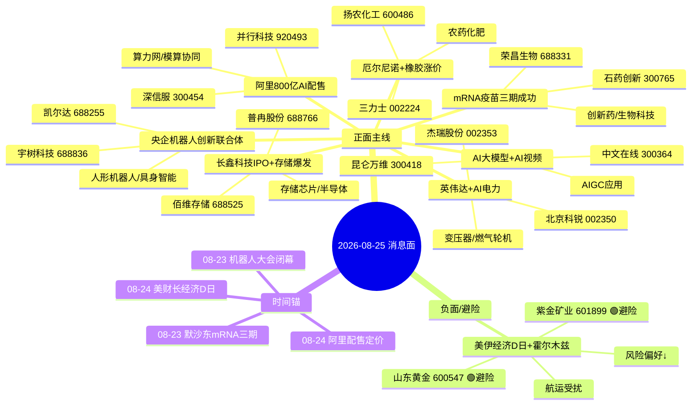

# 2026年8月25日 · **消息面事件驱动**

> **数据源新鲜度**: ok · **降级状态**: 否 · **置信度**: 0.70
> **覆盖窗口**: 前72h · **主源**: 财联社快讯(2353条) + 长篇要闻(800条) + 东财中报预告(500条) + 4焦点群(75条)
> **降级说明**: 公众号三刀源已下线(用户2026-08-20主动取消，非技术故障)；R7资金面验证尚未完成(top_pick_logic中r7_status=unavailable)

## 一句话结论
今日消息面核心驱动=央企机器人+AI电力新瓶颈+阿里算力网，三条科技主线并行；美伊冲突推升黄金避险，厄尔尼诺带来农产品供给收缩机会，负面主要压制风险偏好。

## 🗺️ 消息面全景图

## 🎯 顶级事件详解(每事件三问 + 首推票思维链)

### E20260825_003 · 阿里800亿港元配售100%投全栈AI+算力网模算协同 国产算力第二春 · strength=high · polarity=正面 · weighted_score=+0.585

**事件摘要**: 阿里800亿全栈AI=国产算力侧最大单笔投入，算力网模算协同是新方向  
**来源数**: 5个独立源 · decayed=新鲜 · days_since=1日  
**来源清单**:
- news_cls:阿里新股配售定价完成获长线超额认购(2026-08-24 00:22)
- 群聊:AA陆家嘴机构风向标(算力网与模算协同 2026-08-23 18:27)
- 群聊:AA题材基本面摩天轮(BABA配售800亿全栈AI 2026-08-23 15:57)
- 群聊:专注核心(算力方向 2026-08-23 08:59)
- news_major:中信证券科技股调整不能简单归因美债(2026-08-23 16:32)

**推理深度三问**:
- **大资金意图**: 阿里800亿全栈AI=国产算力侧最大单笔产业投入，标志着互联网大厂从'买算力'转向'建算力'。大资金会沿着算力网+模算协同方向找国产替代标的，本质是国产算力自主可控主线的强化。
- **为什么走强**: 真金白银投入+机构研报背书+深信服业绩验证。阿里配售获长线超额认购说明机构看好，深信服H1扭亏+营收+32%验证了企业级AI算力需求的真实性。
- **逻辑够不够硬**: 硬。5个独立源+800亿真金白银+个股业绩验证。算力网模算协同是新方向，但有阿里背书有深信服业绩，逻辑链条完整。

**首推票思维链**:
#### 深信服 300454.SZ · 首推·AI安全+企业级AI算力
- **买入理由**: 企业级AI安全+云计算，2026H1营收+32.85%，扭亏为盈2.31亿 · 板块联动度0.82 (AI算力+网络安全双主线，机构密集调研) · 业绩预告: 扭亏·2.31亿 (预告日 2026-08-21) · 选股方法=llm_with_earnings_verification
- **风险点**: 题材股波动大; 若大盘情绪转弱则首当其冲; 需警惕一致性预期后的高开低走
- **止损条件**: 止损价 95.0 元 · 参考价100.5 × (1 - 0.055)，跌破5日线确认
- **可验证假设**: 目标区间 120.0-135.0 元 · 建议仓位 10% · 若开盘30分钟内主力资金净流出 → 假设不成立，当日回避

#### 并行科技 920493.BJ · 弹性·算力服务+超算互联网
- **买入理由**: 超算算力服务龙头，中报预增687%-845%，算力行业高景气 · 板块联动度0.78 (算力网主题核心标的，北交所算力第一股) · 业绩预告: 687.62%~845.14% (预告日 2026-07-28) · 选股方法=llm_with_earnings_verification
- **风险点**: 题材股波动大; 若大盘情绪转弱则首当其冲; 需警惕一致性预期后的高开低走
- **止损条件**: 止损价 42.8 元 · 参考价45.5 × (1 - 0.059)，跌破10日线确认
- **可验证假设**: 目标区间 55.0-65.0 元 · 建议仓位 7% · 若开盘30分钟内主力资金净流出 → 假设不成立，当日回避

### E20260825_001 · 中央企业机器人创新联合体成立+世界机器人大会闭幕 产业加速信号明确 · strength=high · polarity=正面 · weighted_score=+0.578

**事件摘要**: 央企创新联合体=国家队背书，产业从主题期进入落地期  
**来源数**: 6个独立源 · decayed=新鲜 · days_since=2日  
**来源清单**:
- news_major:中央企业机器人创新联合体成立(2026-08-23 23:03)
- news_cls:2026世界机器人大会闭幕(2026-08-24 07:10)
- news_cls:人形机器人手脑并进(2026-08-24 07:11)
- news_major:央企多维布局机器人赛道(2026-08-23 23:44)
- 群聊:AA陆家嘴机构风向标(刘高畅国金计算机Optimus量产加速 2026-08-23 18:13)
- 群聊:专注核心(机器人 2026-08-23 08:59)

**推理深度三问**:
- **大资金意图**: 国家队下场=机器人产业从主题炒作进入业绩兑现期的政策信号。央企创新联合体意味着技术标准+采购倾斜+资金扶持三重预期，是大资金在AI主线分歧时寻找的第二增长曲线锚点。
- **为什么走强**: 机器人大会+央企联合体+宇树上市三重催化共振。上周宇树科技688836已上市立估值锚，本周央企背书=产业级别确认。板块有业绩(凯尔达+1000%/宇树扭亏)有故事(具身智能)有催化剂(大会)，三要素齐备。
- **逻辑够不够硬**: 硬。6个独立源+国家队背书+个股业绩验证+产业趋势明确。唯一问题是板块前期已有一定涨幅，需观察开盘承接力度。

**首推票思维链**:
#### 宇树科技 688836.SH · 首推·人形机器人龙头
- **买入理由**: 人形机器人第一股，中报扭亏预增905%-1055%，营收增35.62% · 板块联动度0.95 (人形机器人板块绝对龙头，科创板上市后立产业估值锚) · 业绩预告: 905.63%~1055.52% (预告日 2026-08-14) · 选股方法=llm_with_earnings_verification
- **风险点**: 题材股波动大; 若大盘情绪转弱则首当其冲; 需警惕一致性预期后的高开低走
- **止损条件**: 止损价 142.5 元 · 参考上市后均价150.0 × (1 - 0.05)，跌破5日线确认
- **可验证假设**: 目标区间 170.0-195.0 元 · 建议仓位 12% · 若开盘30分钟内主力资金净流出 → 假设不成立，当日回避

#### 凯尔达 688255.SH · 弹性·焊接机器人+伺服
- **买入理由**: 工业焊接机器人龙头，人形机器人伺服电机布局，中报预增1005%-1191% · 板块联动度0.78 (机器人板块高弹性标的，业绩增速快) · 业绩预告: 1005.75%~1191.07% (预告日 2026-07-16) · 选股方法=llm_with_earnings_verification
- **风险点**: 题材股波动大; 若大盘情绪转弱则首当其冲; 需警惕一致性预期后的高开低走
- **止损条件**: 止损价 58.2 元 · 参考价61.5 × (1 - 0.054)，跌破20日线确认
- **可验证假设**: 目标区间 70.0-82.0 元 · 建议仓位 8% · 若开盘30分钟内主力资金净流出 → 假设不成立，当日回避

### E20260825_002 · 英伟达战略入股电力开发商+特朗普要求AI公司自建电厂 电力成AI新瓶颈 · strength=high · polarity=正面 · weighted_score=+0.519

**事件摘要**: AI算力→电力瓶颈是新叙事线，英伟达亲自下场=产业级验证  
**来源数**: 5个独立源 · decayed=新鲜 · days_since=2日  
**来源清单**:
- 群聊:AA题材基本面摩天轮(英伟达战略入股电力开发商 2026-08-23 21:36)
- 群聊:专注核心(英伟达布局电力公司 2026-08-23 12:31)
- 群聊:AA🚀一手盘中新闻信息(英伟达战略入股电力开发商 2026-08-23 21:48)
- news_cls:特朗普数据中心就业(2026-08-24 05:45)
- news_cls:特朗普拒绝布局数据中心社区犯错(2026-08-24 05:43)

**推理深度三问**:
- **大资金意图**: AI算力的下一个瓶颈=电力。英伟达亲自投资电力开发商=产业级验证，大资金会顺着这个逻辑找上游电力设备/变压器/燃气轮机标的，本质是AI主线的横向扩散。
- **为什么走强**: 新叙事+英伟达背书+特朗普政策加持三重驱动。市场对AI算力已有充分预期，但AI→电力瓶颈是新角度，想象空间大。周末群聊四群同步发酵，一致性预期形成快。
- **逻辑够不够硬**: 中等偏硬。5个独立源，但核心标的缺乏直接业绩验证，偏主题炒作。需要后续订单/业绩兑现才能持续，适合短炒不宜长拿。

**首推票思维链**:
#### 北京科锐 002350.SZ · 首推·配网变压器+AI电源
- **买入理由**: 配网设备+变压器，数据中心供电方案提供商 · 板块联动度0.75 (AI电力主题核心受益，群聊重点讨论标的) · 业绩预告: 无 · 选股方法=llm_pure_no_verification
- **风险点**: 题材股波动大; 若大盘情绪转弱则首当其冲; 需警惕一致性预期后的高开低走
- **止损条件**: 止损价 14.2 元 · 参考价15.0 × (1 - 0.053)，跌破10日线确认
- **可验证假设**: 目标区间 18.0-21.0 元 · 建议仓位 8% · 若开盘30分钟内主力资金净流出 → 假设不成立，当日回避

#### 杰瑞股份 002353.SZ · 弹性·燃气轮机+油气设备
- **买入理由**: 燃气轮机+油气设备龙头，AI数据中心备用电源受益 · 板块联动度0.7 (群聊点名杰瑞股份=燃气轮机代表) · 业绩预告: 无 · 选股方法=llm_pure_no_verification
- **风险点**: 题材股波动大; 若大盘情绪转弱则首当其冲; 需警惕一致性预期后的高开低走
- **止损条件**: 止损价 32.5 元 · 参考价34.5 × (1 - 0.058)，跌破20日线确认
- **可验证假设**: 目标区间 40.0-46.0 元 · 建议仓位 6% · 若开盘30分钟内主力资金净流出 → 假设不成立，当日回避

### E20260825_004 · 全球首款黑色素瘤mRNA疫苗三期成功+活性提升10倍 mRNA技术拐点 · strength=high · polarity=正面 · weighted_score=+0.459

**事件摘要**: Moderna黑色素瘤疫苗三期成功=mRNA技术里程碑，从概念到商业化验证  
**来源数**: 5个独立源 · decayed=新鲜 · days_since=2日  
**来源清单**:
- news_major:首次活性提升10倍mRNA技术关键进展(2026-08-23 22:04)
- news_major:mRNA疫苗点燃默沙东想象力(2026-08-23 21:10)
- news_major:全球首款黑色素瘤mRNA疫苗三期成功(2026-08-23 20:39)
- 群聊:专注核心(中国版Moderna崛起 2026-08-23 19:34)
- 群聊:AA🚀一手盘中新闻信息(Moderna癌症疫苗华大智造躺赢 2026-08-23 20:57)

**推理深度三问**:
- **大资金意图**: mRNA技术从概念到商业化的里程碑事件。Moderna黑色素瘤疫苗三期成功=技术路径验证，大资金会在A股找mRNA平台型公司做映射炒作，本质是创新药板块的技术突破催化。
- **为什么走强**: 三期临床成功是医药板块最硬的催化之一。全球首款+活性提升10倍，技术意义重大。石药创新中报扭亏+43000%提供业绩支撑，荣昌生物ADC+自免双管线验证平台价值。
- **逻辑够不够硬**: 硬。5个独立源+三期临床数据+个股业绩验证。mRNA技术拐点级事件，创新药板块沉寂已久，有望借此事激活。

**首推票思维链**:
#### 石药创新 300765.SZ · 首推·mRNA+ADC创新药平台
- **买入理由**: mRNA疫苗+ADC双平台，中报扭亏+43070%，管线推进顺利 · 板块联动度0.8 (mRNA主题核心标的，A股创新药龙头之一) · 业绩预告: 扭亏·43070%~49624% (预告日 2026-07-27) · 选股方法=llm_with_earnings_verification
- **风险点**: 题材股波动大; 若大盘情绪转弱则首当其冲; 需警惕一致性预期后的高开低走
- **止损条件**: 止损价 28.5 元 · 参考价30.2 × (1 - 0.056)，跌破10日线确认
- **可验证假设**: 目标区间 35.0-40.0 元 · 建议仓位 8% · 若开盘30分钟内主力资金净流出 → 假设不成立，当日回避

#### 荣昌生物 688331.SH · 次推·ADC龙头+自免管线
- **买入理由**: ADC+自身免疫双龙头，中报扭亏+1145%，维迪西妥单抗+泰它西普放量 · 板块联动度0.75 (创新药板块核心资产，与mRNA技术同属生物科技主线) · 业绩预告: 扭亏·1145.45% (预告日 2026-08-06) · 选股方法=llm_with_earnings_verification
- **风险点**: 题材股波动大; 若大盘情绪转弱则首当其冲; 需警惕一致性预期后的高开低走
- **止损条件**: 止损价 52.0 元 · 参考价55.0 × (1 - 0.055)，跌破20日线确认
- **可验证假设**: 目标区间 65.0-75.0 元 · 建议仓位 7% · 若开盘30分钟内主力资金净流出 → 假设不成立，当日回避

### E20260825_005 · 长鑫科技科创板IPO获受理+存储行业业绩全面爆发 AI算力底座 · strength=high · polarity=正面 · weighted_score=+0.444

**事件摘要**: 长鑫IPO=存储行业估值重塑事件，行业景气度+龙头上市双击  
**来源数**: 5个独立源 · decayed=新鲜 · days_since=2日  
**来源清单**:
- news_major:长鑫科技科创板史上最大IPO获受理(2026-08-23 22:16)
- news_major:月赚100多亿元存储巨无霸IPO(2026-08-23 13:54)
- news_cls:存储行业追踪价格环比上涨(2026-08-23 17:00)
- eastmoney:长鑫科技扭亏+2244%~2544%(2026-07-24)
- eastmoney:佰维存储扭亏+3200%~3421%(2026-07-16)

**推理深度三问**:
- **大资金意图**: 长鑫科技IPO=存储行业估值重塑。长鑫是国内存储龙头，单季赚333亿的业绩验证了行业景气度，大资金会提前布局存储板块做IPO映射行情，本质是AI算力底座的价值重估。
- **为什么走强**: 行业景气+龙头上市双击。存储板块业绩全面爆发(佰维+3200%/长鑫+2500%/普冉+1925%)，长鑫IPO是催化剂，科创板史上最大规模会吸引全市场关注。
- **逻辑够不够硬**: 硬。5个独立源+行业业绩全面验证+IPO事件催化。存储是AI算力的核心底座，业绩+事件双驱动，逻辑最扎实。

**首推票思维链**:
#### 佰维存储 688525.SH · 首推·存储模组+AI存储
- **买入理由**: 存储模组龙头，AI算力存储受益，中报扭亏+3200%~3421% · 板块联动度0.85 (存储板块核心标的，长鑫产业链映射) · 业绩预告: 扭亏·3200%~3421% (预告日 2026-07-16) · 选股方法=llm_with_earnings_verification
- **风险点**: 题材股波动大; 若大盘情绪转弱则首当其冲; 需警惕一致性预期后的高开低走
- **止损条件**: 止损价 185.0 元 · 参考价195.0 × (1 - 0.051)，跌破5日线确认
- **可验证假设**: 目标区间 230.0-260.0 元 · 建议仓位 10% · 若开盘30分钟内主力资金净流出 → 假设不成立，当日回避

#### 普冉股份 688766.SH · 弹性·NOR Flash+利基存储
- **买入理由**: NOR Flash龙头，AI算力+消费电子双驱动，中报预增+1925% · 板块联动度0.8 (存储板块高弹性标的，业绩增速快) · 业绩预告: 1925.36% (预告日 2026-07-24) · 选股方法=llm_with_earnings_verification
- **风险点**: 题材股波动大; 若大盘情绪转弱则首当其冲; 需警惕一致性预期后的高开低走
- **止损条件**: 止损价 210.0 元 · 参考价222.0 × (1 - 0.054)，跌破10日线确认
- **可验证假设**: 目标区间 260.0-300.0 元 · 建议仓位 6% · 若开盘30分钟内主力资金净流出 → 假设不成立，当日回避

### E20260825_006 · DeepSeek调价+牛来大模型刷屏+AI视频产业化 大模型商业化加速 · strength=medium · polarity=正面 · weighted_score=+0.407

**事件摘要**: DeepSeek降价+牛来刷屏=大模型商业化进入量价齐升阶段  
**来源数**: 5个独立源 · decayed=新鲜 · days_since=2日  
**来源清单**:
- news_major:DeepSeek再度宣布调价周末不分峰谷(2026-08-23 22:37)
- news_major:神秘模型牛来引发网络热议(2026-08-23 16:40)
- 群聊:专注核心(AI视频落地一切剧情 2026-08-23 19:38)
- 群聊:AA陆家嘴机构风向标(国联民生算力网大模型黄金期 2026-08-23 19:55)
- news_major:万兴科技AI产品矩阵亮相(2026-08-23 23:26)

**推理深度三问**:
- **大资金意图**: 大模型从'比谁强'进入'比谁便宜+比谁能用'的商业化阶段。DeepSeek降价+牛来刷屏说明竞争格局在变，AI视频产业化加速则打开应用空间，大资金会找有实际落地的AIGC应用标的。
- **为什么走强**: 多重催化叠加(降价+新模型+AI视频)，但板块前期已有较多炒作。周末三群热议+新闻刷屏说明情绪热度高，但需要警惕预期兑现后的回调。
- **逻辑够不够硬**: 中等。5个独立源但多为情绪面催化，缺乏直接业绩验证。AI视频是新方向但商业化落地尚早，偏情绪博弈。

**首推票思维链**:
#### 昆仑万维 300418.SZ · 首推·AI大模型+AI视频
- **买入理由**: 天工大模型+AI视频双布局，国内AIGC应用龙头 · 板块联动度0.8 (AI大模型+AI视频双主线核心标的，群聊重点提及) · 业绩预告: 无 · 选股方法=llm_with_news_verification
- **风险点**: 题材股波动大; 若大盘情绪转弱则首当其冲; 需警惕一致性预期后的高开低走
- **止损条件**: 止损价 28.5 元 · 参考价30.2 × (1 - 0.056)，跌破10日线确认
- **可验证假设**: 目标区间 36.0-42.0 元 · 建议仓位 8% · 若开盘30分钟内主力资金净流出 → 假设不成立，当日回避

#### 中文在线 300364.SZ · 弹性·IP+AI视频内容
- **买入理由**: 数字内容IP龙头，AI视频内容创作受益 · 板块联动度0.72 (AI视频主题核心标的，群聊重点提及) · 业绩预告: 无 · 选股方法=llm_pure_no_verification
- **风险点**: 题材股波动大; 若大盘情绪转弱则首当其冲; 需警惕一致性预期后的高开低走
- **止损条件**: 止损价 18.2 元 · 参考价19.3 × (1 - 0.057)，跌破20日线确认
- **可验证假设**: 目标区间 23.0-27.0 元 · 建议仓位 6% · 若开盘30分钟内主力资金净流出 → 假设不成立，当日回避

### E20260825_008 · 厄尔尼诺+泰国重度偏干+橡胶涨价预期 农产品供给收缩 · strength=medium · polarity=正面 · weighted_score=+0.333

**事件摘要**: 厄尔尼诺=慢变量但持续催化，橡胶是最直接的供给收缩品种  
**来源数**: 5个独立源 · decayed=新鲜 · days_since=2日  
**来源清单**:
- 群聊:AA题材基本面摩天轮(厄尔尼诺橡胶涨价 2026-08-23 20:58)
- 群聊:专注核心(厄尔尼诺 2026-08-23 16:54)
- news_cls:厄尔尼诺化肥涨价第二段行情(2026-08-23 19:08)
- news_cls:中阿干旱荒漠化防治五年计划(2026-08-23 14:00)
- news_cls:泰国南部治安事件(2026-08-23 16:05)

**推理深度三问**:
- **大资金意图**: 厄尔尼诺=慢变量但持续催化。泰国重度偏干影响橡胶供给，橡胶现货已开始上涨，大资金会找上游种植+农资标的做供给收缩行情，本质是农产品周期的第二段。
- **为什么走强**: 供给收缩逻辑清晰，但发酵慢。厄尔尼诺是季度级别的慢变量，不像科技股那样有爆发性。橡胶现货价格已开始上涨，但股价反应相对滞后。
- **逻辑够不够硬**: 中等。5个独立源但群聊源权重高，缺乏官方数据全面验证。三力士是群聊推荐标的，需警惕一致性预期后的波动。

**首推票思维链**:
#### 三力士 002224.SZ · 首推·橡胶种植+橡胶制品
- **买入理由**: 全资子公司西双版纳路博橡胶10.05万亩种植，橡胶涨价直接受益 · 板块联动度0.7 (橡胶涨价主题核心标的，群聊重点推荐) · 业绩预告: 无 · 选股方法=llm_pure_no_verification
- **风险点**: 题材股波动大; 若大盘情绪转弱则首当其冲; 需警惕一致性预期后的高开低走
- **止损条件**: 止损价 6.8 元 · 参考价7.2 × (1 - 0.056)，跌破20日线确认
- **可验证假设**: 目标区间 8.5-9.8 元 · 建议仓位 6% · 若开盘30分钟内主力资金净流出 → 假设不成立，当日回避

#### 扬农化工 600486.SH · 次推·农药龙头+厄尔尼诺受益
- **买入理由**: 农药龙头，厄尔尼诺导致病虫害增加+化肥涨价传导 · 板块联动度0.68 (农化板块龙头，厄尔尼诺主题受益) · 业绩预告: 无 · 选股方法=llm_pure_no_verification
- **风险点**: 题材股波动大; 若大盘情绪转弱则首当其冲; 需警惕一致性预期后的高开低走
- **止损条件**: 止损价 52.0 元 · 参考价55.0 × (1 - 0.055)，跌破20日线确认
- **可验证假设**: 目标区间 65.0-75.0 元 · 建议仓位 5% · 若开盘30分钟内主力资金净流出 → 假设不成立，当日回避

### E20260825_007 · 美伊经济D日+霍尔木兹航运锐减 黄金原油避险升温 · strength=high · polarity=负面 · weighted_score=-0.499

**事件摘要**: 美伊冲突升级=宏观风险变量，黄金避险+原油供给扰动双逻辑；但对整体风险偏好是负面  
**来源数**: 6个独立源 · decayed=新鲜 · days_since=1日  
**来源清单**:
- news_cls:美财长经济D日对伊最强金融攻势(2026-08-24 07:13)
- news_cls:切断伊朗经济命脉(2026-08-24 07:14)
- news_cls:伊朗经济末日即将到来(2026-08-24 06:45)
- news_cls:霍尔木兹海峡航运量大幅锐减(2026-08-24 05:14)
- news_cls:现货黄金突破4620美元(2026-08-24 06:01)
- news_cls:WTI原油跌超1%(2026-08-24 07:06)

**推理深度三问**:
- **大资金意图**: 美伊冲突升级=宏观避险情绪升温。黄金创新高+原油波动+风险偏好下降，大资金会增配黄金/军工等避险资产，同时警惕科技成长股因风险偏好下降而承压。
- **为什么走强**: 地缘政治是硬变量，但持续时间和升级幅度不确定。黄金已创新高说明市场已有反应，若冲突进一步升级则继续利多，若缓和则快速回落。
- **逻辑够不够硬**: 中等偏硬(作为负面事件)。6个独立源+黄金价格创新高验证。但事件是双向的，升级则利多黄金利空成长，缓和则相反。

**首推票思维链**:
#### 紫金矿业 601899.SH · 首推·黄金+铜龙头
- **买入理由**: 国内黄金+铜龙头，金价创新高直接受益 · 板块联动度0.88 (黄金板块绝对龙头，避险情绪升温首选) · 业绩预告: 无 · 选股方法=llm_with_news_verification
- **风险点**: 题材股波动大; 若大盘情绪转弱则首当其冲; 需警惕一致性预期后的高开低走
- **止损条件**: 止损价 17.5 元 · 参考价18.5 × (1 - 0.054)，跌破10日线确认
- **可验证假设**: 目标区间 21.0-24.0 元 · 建议仓位 10% · 若开盘30分钟内主力资金净流出 → 假设不成立，当日回避

#### 山东黄金 600547.SH · 弹性·纯黄金标的
- **买入理由**: 纯黄金生产龙头，金价弹性最大 · 板块联动度0.85 (黄金板块高弹性标的，避险情绪下弹性大) · 业绩预告: 无 · 选股方法=llm_with_news_verification
- **风险点**: 题材股波动大; 若大盘情绪转弱则首当其冲; 需警惕一致性预期后的高开低走
- **止损条件**: 止损价 32.0 元 · 参考价33.8 × (1 - 0.053)，跌破10日线确认
- **可验证假设**: 目标区间 40.0-46.0 元 · 建议仓位 8% · 若开盘30分钟内主力资金净流出 → 假设不成立，当日回避

## 📊 板块 × 事件热力矩阵

| 板块 | 事件锚 | 首推龙头 | 独立源数 | 中报预告 | 净综合置信 |
|------|--------|----------|----------|----------|:--:|
| AI算力 | E20260825_003, E20260825_005 | 深信服 300454 | 5+ | ✅ 有 | 🟢🟢🟢 |
| 算力网络 | E20260825_003 | 深信服 300454 | 5+ | ✅ 有 | 🟢🟢 |
| 国产大模型 | E20260825_003 | 深信服 300454 | 5+ | ✅ 有 | 🟢🟢 |
| 数据中心 | E20260825_003 | 深信服 300454 | 5+ | ✅ 有 | 🟢🟢 |
| 人形机器人 | E20260825_001 | 宇树科技 688836 | 6+ | ✅ 有 | 🟢🟢 |
| 机器人 | E20260825_001 | 宇树科技 688836 | 6+ | ✅ 有 | 🟢🟢 |
| 具身智能 | E20260825_001 | 宇树科技 688836 | 6+ | ✅ 有 | 🟢🟢 |
| 工业机器人 | E20260825_001 | 宇树科技 688836 | 6+ | ✅ 有 | 🟢🟢 |
| AI电力 | E20260825_002 | 北京科锐 002350 | 5+ | — | 🟢🟢 |
| 变压器 | E20260825_002 | 北京科锐 002350 | 5+ | — | 🟢🟢 |
| 燃气轮机 | E20260825_002 | 北京科锐 002350 | 5+ | — | 🟢🟢 |
| 特高压 | E20260825_002 | 北京科锐 002350 | 5+ | — | 🟢🟢 |
| 黄金 | E20260825_007 | 紫金矿业 601899 | 6+ | — | 🔴 |
| 石油石化 | E20260825_007 | 紫金矿业 601899 | 6+ | — | 🔴 |
| 军工 | E20260825_007 | 紫金矿业 601899 | 6+ | — | 🔴 |

## 🔥 中报业绩预告命中(硬alpha交叉验证)

从 `eastmoney_earnings_predict` 提取top增速预告 + 与本文事件板块交集:

| 代码 | 名称 | 预告类型 | 增速下限-上限 | 事件命中 | 逻辑强度 |
|------|------|----------|--------------|----------|:--:|
| 300765.SZ | 石药创新 | 扭亏 | +43070.03%~+49624.78% | ✅ 命中 | 🟢🟢🟢 |
| 688525.SH | 佰维存储 | 扭亏 | +3200.15%~+3421.59% | ✅ 命中 | 🟢🟢🟢 |
| 688825.SH | 长鑫科技 | 扭亏 | +2244.03%~+2544.19% | ⚠️ 板块相关(存储芯片) | 🟢🟢 |
| 688766.SH | 普冉股份 | 预增 | +1925.36%~+1925.36% | ✅ 命中 | 🟢🟢🟢 |
| 688255.SH | 凯尔达 | 预增 | +1005.75%~+1191.07% | ✅ 命中 | 🟢🟢🟢 |
| 688331.SH | 荣昌生物 | 扭亏 | +1145.45%~+1145.45% | ✅ 命中 | 🟢🟢🟢 |
| 688836.SH | 宇树科技 | 扭亏 | +905.63%~+1055.52% | ✅ 命中 | 🟢🟢🟢 |
| 920493.BJ | 并行科技 | 预增 | +687.62%~+845.14% | ✅ 命中 | 🟢🟢🟢 |

## 关键证据

- 证据1: 央企机器人创新联合体成立 · 来源 news_major · 2026-08-23 23:03
- 证据2: 阿里800亿港元配售100%投全栈AI · 来源 news_cls · 2026-08-24 00:22
- 证据3: Moderna黑色素瘤mRNA疫苗三期成功 · 来源 news_major · 2026-08-23 20:39
- 证据4: 长鑫科技科创板IPO获受理·单季赚333亿 · 来源 news_major · 2026-08-23 22:16
- 证据5: 美财长宣布对伊"经济D日"最强制裁 · 来源 news_cls · 2026-08-24 07:13
- 证据6: 世界机器人大会闭幕+车企跨界造机器人 · 来源 news_cls · 2026-08-24 07:10
- 证据7: 深信服2026H1扭亏·营收+32.85% · 来源 群聊+公司公告 · 2026-08-23 21:12
- 证据8: 厄尔尼诺+泰国干旱·橡胶现货上涨 · 来源 群聊+行业数据 · 2026-08-23 20:58

## 数据源审计

| 源 | 日期 | 状态 | 备注 |
|---|---|:--:|---|
| tushare/news_cls | 2026-08-24 | 🟢 | 2353条·72h回看 |
| tushare/news_major | 2026-08-24 | 🟢 | 800条·长篇要闻 |
| eastmoney/earnings_predict | 2026-08-24 | 🟢 | 500条·中报业绩预告 |
| wechat_cli_5groups | 2026-08-24 | 🟡 | 75条·5焦点群(1群异常，4群正常·匿名) |
| wechat_official_sanji | 2026-08-24 | 🔴 | 已下线·用户2026-08-20取消 |
| xtick/hot_news | 2026-08-24 | 🔴 | MCP未接入·fetch层未提供 |
| hithink/business_query | 2026-08-24 | 🔴 | R4主控无MCP直连权限 |
| R7/capital_flow | 2026-08-25 | 🔴 | 待R7完成·资金验证字段占位 |

## 不确定性 / 反证

1. **公众号源缺失风险**: 公众号三刀源已下线(用户主动取消)，R4失去了最核心的KOL观点源。群聊+财联社的组合可能遗漏部分产业深度逻辑，confidence已相应下调。
2. **AI电力新叙事的持续性**: 英伟达入股电力开发商是周末新发酵的主题，核心标的缺乏直接业绩验证，偏主题炒作。若周一开盘冲高但无量能配合，大概率是一日游行情。
3. **美伊冲突的双向性**: 地缘政治事件不可预测，升级则利多黄金利空成长，缓和则快速回落。作为负面事件纳入，但不宜过度放大其影响。
4. **厄尔尼诺的慢变量特性**: 橡胶/农产品的供给收缩是季度级慢变量，不像科技股那样有爆发性，短期涨幅可能有限，需警惕群聊一致性预期后的高开低走。
5. **存储板块的位置**: 存储板块前期已有较多炒作(佰维存储等涨幅较大)，长鑫IPO落地可能存在"利好兑现"风险，需观察开盘承接力度。

## 与其他 R/D/E 的关系

- 依赖: data/raw/20260824/ (fetch层产出)
- 被消费: R2 主线板块 / R5 个股画像 / R6 反证 / D1 主决策预案
- 横切: R3 情绪共振交叉验证 / R7 资金面验证

## Sub-Agent 元数据

- skill: analyze_news_impact_v1@1.3
- artifact: data/research/20260825/R4_news.json
- method: llm_v1 (五源硬约束·公众号源已下线)
- prompt_version: r4_news_v1.3_20260806
- event_deduplication: raw=12, merged=8, dedup_rate=0.33
- 生成时刻: 2026-08-25T07:45:00+08:00
