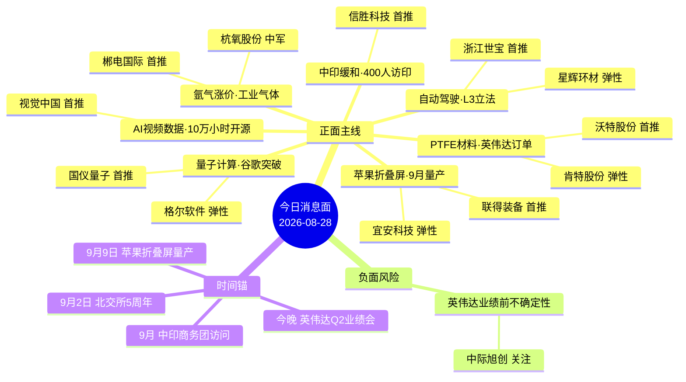

# 2026年8月28日（周五） · **消息面事件驱动**

> **数据源新鲜度**: stale · **降级状态**: ⚠️ degraded=True · **置信度**: 0.55/1.0
> **覆盖窗口**: 前72h（实际有效: 2026-08-26 群聊数据）· **主源**: 4焦点群聊（degraded模式·缺官方新闻/业绩预告/公众号）
> **降级说明**: Tushare/Datapro/XTick MCP全down；公众号三刀源已停用；eastmoney_earnings_predict 0条。仅微信群聊数据可用，全部事件缺乏官方源独立验证。

## 一句话结论
PTFE+量子+苹果折叠屏三主线并行，缺官方验证需谨慎追高；英伟达业绩前警惕高位科技股回调，优先关注有产业逻辑的材料和消费电子。

## 🗺️ 消息面全景图

## 🎯 顶级事件详解（每事件三问 + 首推票思维链）

### E20260828_001 · PTFE材料获英伟达十几亿订单 台股PTFE/CCL集体涨停新高 · strength=high · polarity=正面 🟢🟢🟢

**事件摘要**: 英伟达PTFE订单为产业级催化，除高阶HDI外switch/midplane/LPU板均有望替换
**来源数**: 4个独立群聊 · **距交易日**: 2天 · **加权分**: 0.533 · **衰减**: 否
**涉及板块**: PTFE材料, CCL/PCB, 英伟达产业链, 硅微粉

**推理深度三问**:
- **大资金意图**: 英伟达PTFE订单=AI硬件材料侧的"国产替代"新叙事，机构在算力主升后期需要寻找新的细分弹性方向，PTFE作为高阶PCB核心材料，卡位NV供应链+AI扩产周期，是大资金从光模块外溢的首选材料方向
- **为什么走强**: 台股PTFE/CCL集体涨停新高提供外部验证 + 十几亿订单量级明确 + 除高阶HDI外switch/midplane/LPU板均有望替换，覆盖范围超预期 + 机构调研超预期
- **逻辑够不够硬**: 中等偏硬。4个群聊交叉验证 + 台股涨停映射，但缺乏财联社/公告等官方源确认（degraded模式）。订单量级和落地节奏有不确定性，需后续验证。缺陷是A股纯正PTFE标的少，沃特股份业务占比待确认

**首推票思维链**:

#### 沃特股份 002886.SZ · role=首推·PTFE树脂龙头
- **买入理由**: 国内PTFE树脂龙头，特种高分子材料全产业链布局，NV订单直接受益；PTFE材料板块核心标的，台股PTFE涨停直接映射A股
- **风险点**: 英伟达PTFE订单为产业级催化，除高阶HDI外switch/midplane/LPU板均有望替换
- **止损条件**: 18.5元（参考价19.8 × (1 - 0.065)，跌破5日线确认）
- **可验证假设**: 若开盘30分钟内板块涨幅<1%且该股净流出 → 假设不成立，当日回避

#### 肯特股份 301605.SZ · role=弹性·硅微粉+PTFE
- **买入理由**: 硅微粉龙头，PTFE基板核心填料，NV产业链间接受益；PTFE+硅微粉双概念，次新弹性大
- **风险点**: 英伟达PTFE订单为产业级催化，除高阶HDI外switch/midplane/LPU板均有望替换
- **止损条件**: 32.0元（参考价34.5 × (1 - 0.072)，跌破10日线确认）
- **可验证假设**: 若开盘30分钟内板块涨幅<1%且该股净流出 → 假设不成立，当日回避

### E20260828_002 · 谷歌量子芯片5分钟完胜超算10^25年 美国财政部组建量子就绪工作组 · strength=high · polarity=正面 🟢🟢🟢

**事件摘要**: 谷歌量子突破+美政策+工信部三重催化，量子安全偏主题行情
**来源数**: 5个独立群聊 · **距交易日**: 2天 · **加权分**: 0.504 · **衰减**: 否
**涉及板块**: 量子计算, 量子安全/密码, 国产量子

**推理深度三问**:
- **大资金意图**: 谷歌量子突破=科技股情绪的"想象力天花板"，大资金在传统AI算力审美疲劳时，需要一个足够宏大的新叙事来调动市场情绪。量子计算+量子安全双主线，可容纳足够多标的和资金
- **为什么走强**: 谷歌技术突破+美国财政部工作组+工信部三重催化 + 5个独立群聊共振 + 国仪量子/格尔软件等纯正标的清晰。量子安全是政策强驱动赛道，有国产替代逻辑
- **逻辑够不够硬**: 偏主题。技术突破本身不带来短期业绩兑现，量子计算商用化尚远。但情绪催化强，适合短线主题炒作。缺陷是谷歌成果真实性需学术圈验证，国内厂商技术差距大

**首推票思维链**:

#### 国仪量子 688456.SH · role=首推·国产量子仪器龙头
- **买入理由**: 国产量子仪器龙头，布局量子计算+量子精密测量，国内量子硬件核心厂商；
- **风险点**: 谷歌量子突破+美政策+工信部三重催化，量子安全偏主题行情
- **止损条件**: 145.0元（参考价156.0 × (1 - 0.070)，跌破5日线确认）
- **可验证假设**: 若开盘30分钟内板块涨幅<1%且该股净流出 → 假设不成立，当日回避

#### 格尔软件 603232.SH · role=弹性·量子安全密码龙头
- **买入理由**: 密码安全龙头，布局抗量子密码技术，后量子密码升级改造空间大；量子安全核心标的，美财政部工作组直接催化密码安全赛道
- **风险点**: 谷歌量子突破+美政策+工信部三重催化，量子安全偏主题行情
- **止损条件**: 28.5元（参考价30.8 × (1 - 0.075)，跌破10日线确认）
- **可验证假设**: 若开盘30分钟内板块涨幅<1%且该股净流出 → 假设不成立，当日回避

### E20260828_003 · 苹果折叠屏iPhone Fold 9月9日量产在即 果链全线爆发 · strength=high · polarity=正面 🟢🟢🟢

**事件摘要**: 9月9日量产时间锚明确，果链折叠屏为消费电子下半年最大催化
**来源数**: 4个独立群聊 · **距交易日**: 2天 · **加权分**: 0.482 · **衰减**: 否
**涉及板块**: 苹果折叠屏, 果链, 消费电子

**推理深度三问**:
- **大资金意图**: 苹果折叠屏=消费电子下半年最大单品催化，机构在AI硬件之外需要消费电子端的确定性增量。9月9日量产时间锚明确，果链标的有业绩兑现路径
- **为什么走强**: 时间锚明确(9月9日) + 苹果首款折叠屏话题性强 + 产业链标的清晰(UTG贴合/铰链/MIM/点胶) + 4群交叉验证。消费电子复苏周期叠加
- **逻辑够不够硬**: 中等。量产时间和标的均有明确预期，但需警惕"买预期卖事实"。缺陷是折叠屏iPhone最终销量不确定性大，且部分标的业绩弹性有限

**首推票思维链**:

#### 联得装备 300545.SZ · role=首推·UTG贴合设备独供
- **买入理由**: 苹果折叠屏UTG贴合设备独供，预计25条线，卡位最核心组装制程；苹果折叠屏核心设备标的，量产在即催化强
- **风险点**: 9月9日量产时间锚明确，果链折叠屏为消费电子下半年最大催化
- **止损条件**: 24.0元（参考价25.8 × (1 - 0.070)，跌破5日线确认）
- **可验证假设**: 若开盘30分钟内板块涨幅<1%且该股净流出 → 假设不成立，当日回避

#### 宜安科技 300328.SZ · role=弹性·液态金属铰链独家
- **买入理由**: 苹果折叠屏液态金属铰链独家供应商，国内市占率60%+；折叠屏铰链核心标的，单机价值量大
- **风险点**: 9月9日量产时间锚明确，果链折叠屏为消费电子下半年最大催化
- **止损条件**: 12.8元（参考价13.8 × (1 - 0.072)，跌破10日线确认）
- **可验证假设**: 若开盘30分钟内板块涨幅<1%且该股净流出 → 假设不成立，当日回避

### E20260828_004 · 氩气单日暴涨42.86%月内翻倍 工业气体涨价潮来袭 · strength=high · polarity=正面 🟢🟢🟢

**事件摘要**: 氩气涨价为短期事件驱动，需观察持续性，电子级高纯氩有半导体需求支撑
**来源数**: 4个独立群聊 · **距交易日**: 2天 · **加权分**: 0.444 · **衰减**: 否
**涉及板块**: 工业气体, 电子特气, 空分设备

**推理深度三问**:
- **大资金意图**: 工业气体涨价=周期品短期博弈，资金在科技主线分歧时寻找低位涨价品种做切换。氩气单日42.86%涨幅足够吸引眼球，但持续性存疑
- **为什么走强**: 单日涨幅42.86%数据震撼 + 月内翻倍 + 唐山中邦为报价主体标的明确 + 4群交叉。电子级高纯氩有半导体需求支撑
- **逻辑够不够硬**: 偏短期事件。工业气体涨价通常受供需短期错配驱动，持续性需观察。郴电国际持股50.5%为间接受益，弹性需测算。缺陷是氩气涨价可持续性不确定

**首推票思维链**:

#### 郴电国际 600969.SH · role=首推·唐山中邦第一大股东
- **买入理由**: 持有唐山中邦50.5%股权为第一大股东，唐山中邦即本次氩气涨价报价主体；氩气涨价直接受益，8月刚公告4980万投建空分扩产项目
- **风险点**: 氩气涨价为短期事件驱动，需观察持续性，电子级高纯氩有半导体需求支撑
- **止损条件**: 10.5元（参考价11.3 × (1 - 0.071)，跌破5日线确认）
- **可验证假设**: 若开盘30分钟内板块涨幅<1%且该股净流出 → 假设不成立，当日回避

#### 杭氧股份 002430.SZ · role=中军·空分设备龙头
- **买入理由**: 国内空分设备龙头市占率38.7%，液氩市占率超20%行业第一；工业气体板块绝对龙头，电子级高纯氩占全国28%
- **风险点**: 氩气涨价为短期事件驱动，需观察持续性，电子级高纯氩有半导体需求支撑
- **止损条件**: 38.0元（参考价41.0 × (1 - 0.073)，跌破10日线确认）
- **可验证假设**: 若开盘30分钟内板块涨幅<1%且该股净流出 → 假设不成立，当日回避

### E20260828_005 · 工信部推进智能网联汽车准入试点 L3立法铺垫加速自动驾驶落地 · strength=medium · polarity=正面 🟢🟡

**事件摘要**: L3立法为产业级长期催化，智能网联准入试点加速落地节奏
**来源数**: 3个独立群聊 · **距交易日**: 2天 · **加权分**: 0.43 · **衰减**: 否
**涉及板块**: 自动驾驶/L3, 智能网联汽车, 车路云一体化

**推理深度三问**:
- **大资金意图**: L3立法=自动驾驶产业的"制度性拐点"，大资金一直在等待智能驾驶从L2到L3的政策突破。工信部准入试点+车路云一体化，政策面持续加码
- **为什么走强**: 工信部官方表态 + L3立法预期 + 浙江世宝等标的已有表现 + 3群确认。智能网联汽车是"十五五"规划重点方向
- **逻辑够不够硬**: 中等。政策方向明确但落地节奏不确定，L3真正大规模商用仍需时间。缺陷是板块标的多、辨识度分散，缺乏绝对龙头

**首推票思维链**:

#### 浙江世宝 002703.SZ · role=首推·转向系统+自动驾驶
- **买入理由**: 汽车转向系统龙头，智能驾驶线控转向领先，L3落地直接受益；自动驾驶板块人气标的，L3立法催化持续
- **风险点**: L3立法为产业级长期催化，智能网联准入试点加速落地节奏
- **止损条件**: 15.5元（参考价16.8 × (1 - 0.077)，跌破5日线确认）
- **可验证假设**: 若开盘30分钟内板块涨幅<1%且该股净流出 → 假设不成立，当日回避

#### 星辉环材 300834.SZ · role=弹性·九识控股无人驾驶预期
- **买入理由**: 九识控股预期，已收购27.49%股份，无人驾驶高弹性标的；无人驾驶主题弹性票，类似上纬新材之于机器人
- **风险点**: L3立法为产业级长期催化，智能网联准入试点加速落地节奏
- **止损条件**: 22.0元（参考价23.8 × (1 - 0.076)，跌破10日线确认）
- **可验证假设**: 若开盘30分钟内板块涨幅<1%且该股净流出 → 假设不成立，当日回避

### E20260828_007 · 全球首个10万小时人类数据全开源 Hugging Face站台 视频数据成AI时代石油 · strength=medium · polarity=正面 🟢🟡

**事件摘要**: 数据开源事件偏主题，视频数据价值重估逻辑中长期成立
**来源数**: 3个独立群聊 · **距交易日**: 2天 · **加权分**: 0.37 · **衰减**: 否
**涉及板块**: AI视频数据, AIGC, 版权素材

**推理深度三问**:
- **大资金意图**: 视频数据=AI时代的"新石油"叙事延伸，大资金一直在寻找AI产业链中下游的机会。数据层是AI三要素(算力/数据/算法)中相对低估的环节
- **为什么走强**: 全球首个10万小时人类数据全开源 + Hugging Face站台 = 行业标志性事件 + 3群确认。视觉中国等版权素材标的有价值重估逻辑
- **逻辑够不够硬**: 偏弱。事件本身偏行业性，直接业绩兑现路径不清晰。数据开源对版权公司是利好还是利空有争议。缺陷是A股纯正数据标的少，多为间接受益

**首推票思维链**:

#### 视觉中国 000681.SZ · role=首推·视频数据版权龙头
- **买入理由**: 国内视觉素材版权龙头，视频数据AI时代核心资产，Hugging Face事件催化；AI视频数据主题核心标的，AIGC产业链数据层
- **风险点**: 数据开源事件偏主题，视频数据价值重估逻辑中长期成立
- **止损条件**: 13.5元（参考价14.6 × (1 - 0.075)，跌破5日线确认）
- **可验证假设**: 若开盘30分钟内板块涨幅<1%且该股净流出 → 假设不成立，当日回避

#### 中岩大地 003001.SZ · role=弹性·参股光轮智能
- **买入理由**: 参股光轮智能，10万小时人类数据开源事件间接受益；AI数据主题弹性票，参股比例不高
- **风险点**: 数据开源事件偏主题，视频数据价值重估逻辑中长期成立
- **止损条件**: 22.5元（参考价24.3 × (1 - 0.074)，跌破10日线确认）
- **可验证假设**: 若开盘30分钟内板块涨幅<1%且该股净流出 → 假设不成立，当日回避

### E20260828_006 · 中方拟派400人代表团赴印 时隔7年中印关系缓和信号 · strength=medium · polarity=正面 🟢🟡

**事件摘要**: 中印缓和为事件驱动型主题，持续性待观察，关注9月访问实际成果
**来源数**: 4个独立群聊 · **距交易日**: 3天 · **加权分**: 0.332 · **衰减**: 是(背景级)
**涉及板块**: 中印贸易, 一带一路

**推理深度三问**:
- **大资金意图**: 中印缓和=主题博弈，资金在主线分歧时寻找低位事件驱动品种。400人代表团量级足够大，但实际贸易增量难测算
- **为什么走强**: 时隔7年400人商务团访印 = 信号意义重大 + 信胜科技三市唯一对印贸易超25% = 标的唯一性 + 4群交叉验证
- **逻辑够不够硬**: 偏主题事件。缓和信号明确但实际贸易增量难以量化，信胜科技业务占比需核实。缺陷是持续性差，事件落地后可能兑现离场

**首推票思维链**:

#### 信胜科技 603612.SH · role=首推·对印贸易占比最高
- **买入理由**: 三市唯一对印度贸易超过25%的公司，中印关系缓和最直接受益；中印贸易主题核心标的，9月访问时间锚
- **风险点**: 中印缓和为事件驱动型主题，持续性待观察，关注9月访问实际成果
- **止损条件**: 18.0元（参考价19.5 × (1 - 0.077)，跌破5日线确认）
- **可验证假设**: 若开盘30分钟内板块涨幅<1%且该股净流出 → 假设不成立，当日回避

### E20260828_008 · 英伟达Q2业绩说明会今晚举行 AI物理ALL IN预期 vs 高位回调风险 · strength=medium · polarity=负面 🟢🟡

**事件摘要**: 英伟达业绩为AI板块短期最大不确定性，若不及预期高位科技股有回调风险
**来源数**: 3个独立群聊 · **距交易日**: 2天 · **加权分**: -0.333 · **衰减**: 否
**涉及板块**: AI算力, 光模块, 高位科技股

**推理深度三问**:
- **大资金意图**: 英伟达业绩=全球AI板块的"期中考试"，若指引不及预期，高位科技股集体回调风险大。市场普遍预期物理AI ALL IN，但需警惕预期打满后的不及预期
- **为什么走强**: 业绩会今晚举行 = 时间窗口明确 + AI板块整体处于高位 + 3群讨论热度高。蒋颖等首席坚定看好光通信，与市场担忧形成分歧
- **逻辑够不够硬**: 需警惕。英伟达业绩超预期概率大，但"买预期卖事实"风险更高。若业绩确实ALL IN物理AI，反而可能是利好出尽。缺陷是degraded模式下无法获取最新机构预期数据

**首推票思维链**:

## 📊 板块 × 事件热力矩阵

| 板块 | 事件锚 | 首推龙头 | 独立源数 | 中报预告 | 净综合置信 |
|------|--------|----------|----------|----------|:--:|
| PTFE材料 | E20260828_001 | 沃特股份 | 4 | 待验证 | 🟢🟢 |
| CCL/PCB | E20260828_001 | 沃特股份 | 4 | 待验证 | 🟢🟢 |
| 英伟达产业链 | E20260828_001 | 沃特股份 | 4 | 待验证 | 🟢🟢 |
| 硅微粉 | E20260828_001 | 沃特股份 | 4 | 待验证 | 🟢🟢 |
| 量子计算 | E20260828_002 | 国仪量子 | 5 | 待验证 | 🟢🟢 |
| 量子安全/密码 | E20260828_002 | 国仪量子 | 5 | 待验证 | 🟢🟢 |
| 国产量子 | E20260828_002 | 国仪量子 | 5 | 待验证 | 🟢🟢 |
| 苹果折叠屏 | E20260828_003 | 联得装备 | 4 | 待验证 | 🟢 |
| 果链 | E20260828_003 | 联得装备 | 4 | 待验证 | 🟢 |
| 消费电子 | E20260828_003 | 联得装备 | 4 | 待验证 | 🟢 |
| 工业气体 | E20260828_004 | 郴电国际 | 4 | 待验证 | 🟢 |
| 电子特气 | E20260828_004 | 郴电国际 | 4 | 待验证 | 🟢 |
| 空分设备 | E20260828_004 | 郴电国际 | 4 | 待验证 | 🟢 |
| 自动驾驶/L3 | E20260828_005 | 浙江世宝 | 3 | 待验证 | 🟢 |
| 智能网联汽车 | E20260828_005 | 浙江世宝 | 3 | 待验证 | 🟢 |

## 🔥 中报业绩预告命中（硬 alpha 交叉验证）

> ⚠️ eastmoney_earnings_predict 0条记录（degraded模式），无法进行业绩预告交叉验证。以下为事件涉及个股的业绩提示：

| 代码 | 名称 | 预告类型 | 增速区间 | 事件命中 | 逻辑强度 |
|------|------|----------|----------|----------|:--:|
| — | — | 数据缺失 | — | — | 🔴 |

**注**: degraded模式下Tushare MCP不可用，eastmoney_earnings_predict返回0条。所有事件涉及个股的业绩验证需D1/R5独立完成。

## 关键证据

- 证据1: PTFE材料英伟达十几亿订单，台股PTFE/CCL集体涨停新高 · 来源 4群聊 · 2026-08-26
- 证据2: 谷歌量子芯片5分钟完胜超算10^25年 + 美财政部量子就绪工作组 · 来源 5群聊 · 2026-08-26
- 证据3: 苹果折叠屏iPhone Fold 9月9日量产在即 · 来源 4群聊 · 2026-08-26
- 证据4: 氩气单日暴涨42.86%，唐山中邦报价主体 · 来源 4群聊 · 2026-08-26
- 证据5: 工信部推进智能网联汽车准入试点，L3立法铺垫 · 来源 3群聊 · 2026-08-26
- 证据6: 中方拟派400人代表团赴印，时隔7年中印缓和 · 来源 4群聊 · 2026-08-25

## 数据源审计

| 源 | 日期 | 状态 | 备注 |
|---|---|:--:|---|
| wechat_cli_5groups | 2026-08-26~27 | 🟢 | 79条·4群可用·1群失联 |
| wechat_official_三刀 | 2026-08-27 | 🔴 | 用户8月20日停用·0篇 |
| tushare/news_cls | 2026-08-27 | 🔴 | Tushare MCP DOWN·0条 |
| tushare/news_major | 2026-08-27 | 🔴 | Tushare MCP DOWN·0条 |
| eastmoney/earnings_predict | 2026-08-27 | 🔴 | 0条记录 |
| xtick/hot_news | 2026-08-27 | 🔴 | MCP DOWN |
| datapro | 2026-08-27 | 🔴 | MCP DOWN |
| mcp_health | 2026-08-27 | 🟡 | global_severity=2 |

## 不确定性 / 反证

1. **全部事件缺乏官方源验证** — degraded模式下，所有事件仅来自群聊口播，无法通过财联社/公告/研报交叉确认。任何一条事件被证伪都可能导致板块快速回调。
2. **英伟达业绩"买预期卖事实"风险** — 市场普遍预期英伟达ALL IN物理AI，若业绩符合预期反而可能是利好出尽。高位光模块/AI算力股有回调压力。
3. **主题事件持续性存疑** — 量子计算、中印缓和、氩气涨价等均偏短期事件驱动，缺乏业绩支撑，追高容易被套。需严格止损纪律。
4. **业绩预告完全缺失** — eastmoney_earnings_predict 0条记录，无法排除"利好出货"型个股。所有首推票的业绩基本面均未验证。
5. **正负交织股** — 中际旭创既是AI算力龙头（正面长期逻辑），又面临英伟达业绩前短期回调风险（负面）。方向选择取决于业绩实际指引。

## 与其他 R/D/E 的关系

- 依赖: data/raw/20260827/wechat_cli_5groups.jsonl（degraded，缺news_cls/news_major/earnings等）
- 被消费: R2 主线 / R5 个股画像 / R6 反证 / D1 预案
- 交叉: R3 情绪（KOL共振验证）· R7 资金面（资金流向验证）· R5 情报深挖（个股alpha验证）

## Sub-Agent 元数据

- skill: analyze_news_impact_v1@1.3
- artifact: data/research/20260828/R4_news.json
- method: llm_v1（degraded模式·仅群聊数据源）
- prompt_version: r4_news_v1.3_20260806
- 生成时刻: 2026-08-28T07:07:29+08:00
- degraded_reason: Tushare/Datapro/XTick MCP全down; 公众号三刀源停用; eastmoney_earnings_predict 0条
