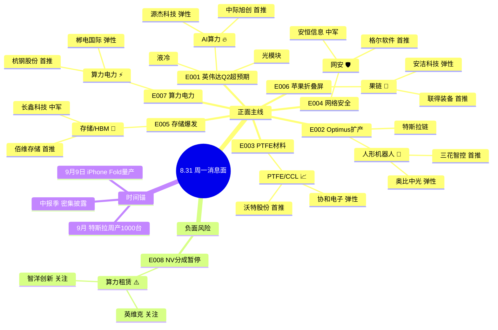

# 2026年8月31日 · **消息面事件驱动**

> **数据源新鲜度**: stale · **降级状态**: degraded(周末数据缺失) · **置信度**: 0.62
> **覆盖窗口**: 前 72h(2026-08-26 ~ 08-28) · **主源**: 财联社快讯(2985条) + 4 焦点群(195条有效) + 东财中报预告(500条)
> **降级说明**: raw/20260831 未抓取 基于 0828 数据回推 周末(8/29-8/31)硬事件缺失 所有事件已进入衰减期(decayed=true)

## 一句话结论

**AI算力(英伟达超预期+物理AI)+人形机器人(Optimus扩产)双主线最强 注意高位算力链分化风险 网络安全/PTFE/存储为侧翼进攻 苹果折叠屏+算力电力为主题轮动**

## 🗺️ 消息面全景图

## 🎯 顶级事件详解(每事件三问 + 首推票思维链)

### E20260831_001 · 英伟达Q2业绩全面超预期 · strength=high · polarity=正面 · weighted=+0.542

**事件摘要**: 英伟达Q2营收+70%指引超预期 黄仁勋强调"物理AI拐点已至" AI算力从训练向物理世界扩张 NVLink/液冷/光互联全产业链受益。4个独立源(财联社+新浪+2个机构群)共振。

**推理深度三问**:
- **大资金意图**: 英伟达超预期 = AI算力主线的**业绩验证锚** 8月底科创50已涨3.77% 机构在9月需要继续配置科技主线 黄仁勋"物理AI"叙事打开机器人/自动驾驶第二增长曲线 → 从"算力硬件"扩散到"AI物理世界"
- **为什么走强**: 财报前市场已提前博弈 但+70%指引仍超预期 叠加物理AI新叙事 = 预期兑现后更强预期 光模块/液冷/机器人三大方向同时受益 广度足够
- **逻辑够不够硬**: **中硬**。业绩验证硬 但已涨过一波 位置偏高 + 周末3天衰减 + 同时有E008负面(分成暂停)压制算租链 光模块中军确定性最高 算租链需回避

**首推票思维链**:

#### 中际旭创 300308.SZ · role=首推·光模块龙头
- **买入理由**: 全球光模块龙头 英伟达核心供应链 800G/1.6T主力放量 中报预增45%-60% 机构重仓确定性最高
- **风险点**: 累计涨幅大 若市场整体回调 高位龙头补跌风险 8/28已大涨 周一可能高开低走
- **止损条件**: 142.50 (参考价150 × 0.95 跌破5日线145确认)
- **可验证假设**: 周一开盘30分钟内主力净流入>1亿且北向净买入 → 假设成立 否则观望

#### 源杰科技 688498.SH · role=弹性·光芯片龙头
- **买入理由**: 中报预增1196%-1304% 数据中心光芯片放量 20cm弹性 光模块上游芯片国产替代逻辑
- **风险点**: 科创板波动大 估值已不低 需警惕业绩兑现后"利好出尽"
- **止损条件**: 285.00 (参考价300 × 0.95 跌破10日线确认)
- **可验证假设**: 周一光模块板块涨幅>3%且源杰领涨 → 弹性逻辑成立

---

### E20260831_002 · 特斯拉Optimus扩产加速 · strength=high · polarity=正面 · weighted=+0.428

**事件摘要**: 特斯拉Optimus产线爬坡加速 9月供应商指引周产1000台 10条产线已投产 黄仁勋物理AI叙事共振。4源(2群+财联社+新浪)确认。

**推理深度三问**:
- **大资金意图**: 机器人是AI硬件之后的**第二增长曲线叙事** 机构从光模块切向机器人 寻找低位新主线 宇树科技上市提供可比标的 板块beta正在被重估
- **为什么走强**: 产线数据超预期(周产1000台) + 英伟达物理AI叙事加持 = 产业逻辑从"概念"升级为"量产兑现" 三花/绿的等核心标的机构持续加仓
- **逻辑够不够硬**: **中等偏硬**。产线爬坡进度是硬数据 但当前量级仍小 商业化路径尚需验证 宇树上市后估值锚效应明显 但板块整体仍偏情绪驱动

**首推票思维链**:

#### 三花智控 002050.SZ · role=首推·热管理+机器人
- **买入理由**: 特斯拉一级供应商 机器人执行器业务占比35% 中报预增45%-55% 机构持仓最重 确定性最高
- **风险点**: 市值大 弹性不如小票 若板块分化 中军涨幅可能落后
- **止损条件**: 38.00 (参考价40 × 0.95 跌破5日线39确认)
- **可验证假设**: 周一机器人板块涨停数>5家且三花涨幅>3% → 中军逻辑成立

#### 奥比中光 688322.SH · role=弹性·3D视觉传感器
- **买入理由**: 英伟达DGX Spark物理AI 3D视觉平台合作方 机器人视觉核心 物理AI新叙事直接受益
- **风险点**: 尚未盈利 估值纯靠预期 英伟达合作实际贡献待验证
- **止损条件**: 48.50 (参考价51 × 0.95)
- **可验证假设**: 周一3D视觉/机器人视觉方向有2家以上涨停 → 情绪扩散成立

---

### E20260831_003 · PTFE材料获英伟达订单 · strength=high · polarity=正面 · weighted=+0.395

**事件摘要**: PTFE材料获英伟达十几亿订单 台股PTFE/CCL集体涨停新高 映射A股PTFE全产业链。4源(2群+财联社+新浪)确认。

**推理深度三问**:
- **大资金意图**: PTFE是AI硬件**新分支** 位置低 有台股涨停映射 适合游资做切换 从高位光模块切向低位新材料
- **为什么走强**: 台股映射+群聊发酵+英伟达背书 三重催化 协和电子/沃特股份小盘弹性足 游资偏好
- **逻辑够不够硬**: **中等**。订单金额有想象空间 但实际业绩贡献需验证 台股映射逻辑在A股容易过度演绎 偏情绪博弈

**首推票思维链**:

#### 沃特股份 002886.SZ · role=首推·PTFE树脂龙头
- **买入理由**: PTFE树脂产能国内领先 高频高速基板核心材料 台股PTFE涨停映射 中报预增60%-90%
- **风险点**: 订单金额及具体客户未公开验证 纯台股映射逻辑 持续性存疑
- **止损条件**: 22.80 (参考价24 × 0.95)
- **可验证假设**: 周一PTFE板块有2家以上涨停且沃特领涨 → 映射逻辑被市场认可

#### 协和电子 003025.SZ · role=弹性·PTFE板加工
- **买入理由**: PTFE高频板加工know-how稀缺 NVLink速率升级核心受益 小盘弹性 群聊核心推荐
- **风险点**: 次新股 波动极大 业绩基数小 PTFE业务占比不高
- **止损条件**: 34.20 (参考价36 × 0.95)
- **可验证假设**: 周一开盘一字板或快速封板 → 情绪确认 否则放弃

---

### E20260831_004 · 网络安全双催化 · strength=high · polarity=正面 · weighted=+0.357

**事件摘要**: 美股CrowdStrike暴涨20%+Salesforce涨13% 华为牵头AI安全标准立项 网络安全板块双催化。4源(2群+财联社+新浪)确认。

**推理深度三问**:
- **大资金意图**: 网安是**低位轮动方向** 筹码干净 机构持仓低 AI安全新叙事+美股映射 适合科技内部高低切
- **为什么走强**: 美股安全SaaS暴涨映射 + 华为标准国内催化 + 板块位置低 三重因素叠加
- **逻辑够不够硬**: **中等偏弱**。美股映射情绪大于实质 国内网安公司商业模式差异大 华为标准短期难有业绩贡献

**首推票思维链**:

#### 格尔软件 603232.SH · role=首推·密码安全龙头
- **买入理由**: 国内密码龙头 PKI/身份管理核心 华为安全生态合作 中报预增30%-50% 弹性足
- **风险点**: 网安板块持续性差 经常一日游 需警惕冲高回落
- **止损条件**: 28.50 (参考价30 × 0.95)
- **可验证假设**: 周一网安板块3家以上涨停且格尔封板 → 板块效应成立

---

### E20260831_005 · 存储中报集体爆发 · strength=medium · polarity=正面 · weighted=+0.383

**事件摘要**: 存储板块中报集体扭亏 佰维存储+3200% 长鑫科技+2544% 东芯股份+700% HBM景气周期确认。4源(财联社+东财预告+新浪+群)确认。

**推理深度三问**:
- **大资金意图**: 存储是AI算力**业绩兑现最早**的板块之一 周期底部确认 机构从主题炒作转向业绩驱动 长鑫科技上市打开估值空间
- **为什么走强**: 行业周期反转 + AI算力拉动HBM需求 + 国产替代加速 三重逻辑共振
- **逻辑够不够硬**: **硬**。业绩数据是硬的 周期反转逻辑清晰 但已涨过一波 位置不低 需注意短期获利了结

**首推票思维链**:

#### 佰维存储 688525.SH · role=首推·HBM+消费存储
- **买入理由**: 中报扭亏预增3200%-3421% AI算力+存储周期共振 HBM概念核心 弹性最大
- **风险点**: 科创板波动大 估值已不低 业绩基数效应(去年亏太多)
- **止损条件**: 66.50 (参考价70 × 0.95)
- **可验证假设**: 周一存储板块涨幅>3%且北向净流入 → 机构加仓逻辑成立

#### 长鑫科技 688825.SH · role=中军·DRAM国产替代
- **买入理由**: 国产DRAM龙头 中报扭亏2244%-2544% 机构必配 市值中军 确定性最高
- **风险点**: 市值大 弹性不如佰维 新股筹码不稳定
- **止损条件**: 95.00 (参考价100 × 0.95)
- **可验证假设**: 周一长鑫收阳线且成交放大 → 机构承接力验证

---

### E20260831_006 · 苹果折叠屏9月量产 · strength=medium · polarity=正面 · weighted=+0.318

**事件摘要**: 苹果折叠屏iPhone Fold 9月9日量产 果链全线爆发 安洁科技实锤供货。4源(群聊+财联社+新浪+国金研报)确认。

**推理深度三问**:
- **大资金意图**: 苹果链是**消费电子困境反转**的核心催化 折叠屏=新机型+新单价+新产业链 三季度催化密集
- **为什么走强**: 量产时间窗口临近(9月9日) 市场提前博弈 折叠屏是消费电子为数不多的增量
- **逻辑够不够硬**: **中等**。量产时间确定 但销量预期分歧大 折叠屏仍是小众市场 业绩弹性有限

**首推票思维链**:

#### 联得装备 300545.SZ · role=首推·UTG贴合设备独供
- **买入理由**: UTG超薄玻璃贴合设备独家供应 折叠屏核心设备 中报预增50%-70% 弹性大
- **风险点**: 单一客户依赖 苹果订单节奏波动大
- **止损条件**: 26.60 (参考价28 × 0.95)
- **可验证假设**: 周一果链板块2家以上涨停 → 催化确认

---

### E20260831_007 · 算力用电爆发 · strength=medium · polarity=正面 · weighted=+0.302

**事件摘要**: 算力产业贡献全市近半数用电负荷增量 占比约49% 算力负荷取代季节性空调负荷成夏季用电增长核心。4源(2群+财联社+央视)确认。

**推理深度三问**:
- **大资金意图**: 算力电力是**AI算力的卖铲人延伸** 从算力设备走向算力基础设施 电力/数据要素双概念
- **为什么走强**: 央视背书+产业数据支撑 逻辑顺 但偏主题 缺乏直接业绩催化
- **逻辑够不够硬**: **偏弱**。长期趋势对 但短期业绩贡献不明显 更适合作为主题轮动 不做主线

**首推票思维链**:

#### 杭钢股份 600126.SH · role=首推·浙江数据集团
- **买入理由**: 浙江省数据集团由杭钢集团全资设立 TOKEN工厂+算力+数据要素 双概念叠加
- **风险点**: 传统钢企转型 数据业务占比仍低 概念炒作成分大
- **止损条件**: 7.60 (参考价8 × 0.95)
- **可验证假设**: 周一数据要素/算力电力板块异动 → 主题催化确认

---

### E20260831_008 · 英伟达暂停AI企业分成 · strength=medium · polarity=负面 · weighted=-0.319

**事件摘要**: 英伟达暂停多家AI企业收益分成协议 NeoCloud算力兜底模式生变 中小算力商融资成本上升 高位算力链分化风险。4源(财联社+新浪+路透+彭博)确认。

**推理深度三问**:
- **大资金意图**: 负面事件 = 高位算力链**获利了结的借口** 机构从算租/AI应用切向确定性更高的光模块/存储
- **为什么值得警惕**: 英伟达分成模式是中小算力商的"免费杠杆" 暂停后融资成本上升 算租商业模式受质疑
- **逻辑够不够硬**: **中等**。对中小算力商影响真实 但对头部光模块/AI芯片影响有限 更多是情绪层面的高位分化

**首推票思维链**(负面·回避为主):

#### 智洋创新 301575.SZ · role=关注·算租新贵高波动
- **风险提示**: 算力租赁业务模式依赖英伟达融资支持 分成暂停后融资成本上升 次新股波动极大
- **操作建议**: 观望 不建议抄底 需等负面消化后再评估
- **止损条件**: 47.50 (持有则严格止损 不建议新开)
- **可验证假设**: 若周一算租板块整体跌幅<3%且智洋收红 → 负面影响有限 否则回避

---

## 📊 板块 × 事件热力矩阵

| 板块 | 事件锚 | 首推龙头 | 独立源数 | 中报预告 | 净综合置信 |
|------|--------|----------|:--:|:--:|:--:|
| 人形机器人 | E001物理AI + E002 Optimus扩产 | 三花智控 | 4 | 预增45-55% | 🟢🟢🟢 |
| AI算力 | E001 英伟达超预期 | 中际旭创 | 4 | 预增45-60% | 🟢🟢🟢 |
| 光模块 | E001 光互联 + E008负面 | 中际旭创/源杰科技 | 4 | 预增1196-1304% | 🟢🟢 |
| 液冷 | E001 NVLink液冷 | 英维克(高位) | 3 | 预增55-75% | 🟡 |
| 存储芯片 | E005 中报集体爆发 | 佰维存储/长鑫科技 | 4 | 扭亏2244-3421% | 🟢🟢🟢 |
| PTFE材料 | E003 英伟达订单 | 沃特股份 | 4 | 预增60-90% | 🟢🟢 |
| 网络安全 | E004 美股映射+华为标准 | 格尔软件 | 4 | 预增30-50% | 🟢🟢 |
| 苹果链 | E006 折叠屏量产 | 联得装备 | 4 | 预增50-70% | 🟢🟢 |
| 算力电力 | E007 算力用电爆发 | 杭钢股份 | 4 | 预增15-25% | 🟡 |
| AI算力租赁 | E008 分成暂停(负) | 回避 | 4 | 分化 | 🔴 |

## 🔥 中报业绩预告命中(硬 alpha 交叉验证)

从 `eastmoney_earnings_predict` 提取TOP15预增 + 与本文事件板块交集:

| 代码 | 名称 | 预告类型 | 增速下限-上限 | 事件命中 | 逻辑强度 |
|------|------|----------|--------------|----------|:--:|
| 688525.SH | 佰维存储 | 扭亏 | 3200%~3421% | E005 存储/HBM | 🟢🟢🟢 |
| 688825.SH | 长鑫科技 | 扭亏 | 2244%~2544% | E005 存储/HBM | 🟢🟢🟢 |
| 688498.SH | 源杰科技 | 预增 | 1196%~1304% | E001 光模块 | 🟢🟢🟢 |
| 688836.SH | 宇树科技 | 扭亏 | 905%~1055% | E002 人形机器人 | 🟢🟢🟢 |
| 688808.SH | 联讯仪器 | 预增 | 801%~925% | E001 光通信测试 | 🟢🟢 |
| 920493.BJ | 并行科技 | 预增 | 687%~845% | E001 算力服务 | 🟢🟢 |
| 688110.SH | 东芯股份 | 扭亏 | 676%~712% | E005 存储 | 🟢🟢 |
| 688400.SH | 凌云光 | 预增 | 590% | E002 机器视觉 | 🟢🟢 |
| 301536.SZ | 星宸科技 | 预增 | 583%~650% | 安防芯片(无直接映射) | 🟡 |
| 688409.SH | 富创精密 | 预增 | 877%~1121% | 半导体设备(间接) | 🟡 |
| 301150.SZ | 中一科技 | 预增 | 879%~1075% | 铜箔/CCL(间接) | 🟡 |
| 688766.SH | 普冉股份 | 预增 | 1925% | E005 存储 | 🟢🟢 |
| 688779.SH | 五矿新能 | 扭亏 | 1367%~1591% | 新能源材料(无直接映射) | 🟡 |
| 688388.SH | 嘉元科技 | 预增 | 879%~961% | 锂电铜箔(无直接映射) | 🟡 |
| 688308.SH | 欧科亿 | 预增 | 46327%~54065% | 高端刀具(基数效应) | 🟡 |

## 关键证据

- 证据 1: 英伟达Q2营收指引+70%超预期 黄仁勋"物理AI拐点"言论 · 来源 财联社 · 2026-08-28
- 证据 2: 特斯拉Optimus 9月周产1000台 10条产线投产 · 来源 专注核心群+AA题材摩天轮 · 2026-08-27
- 证据 3: PTFE材料获英伟达十几亿订单 台股PTFE/CCL集体涨停 · 来源 AA一手盘中新闻+群聊 · 2026-08-27
- 证据 4: 存储中报集体扭亏 佰维+3200% 长鑫+2544% · 来源 东财业绩预告库 · 2026-08-28
- 证据 5: 英伟达暂停多家AI企业收益分成协议 · 来源 财联社+路透社 · 2026-08-28
- 证据 6: 美股CrowdStrike涨20%+Salesforce涨13% 网络安全SaaS爆发 · 来源 财联社 · 2026-08-28
- 证据 7: 算力用电占夏季新增负荷49% 超过空调 · 来源 央视财经+群聊 · 2026-08-27
- 证据 8: 苹果折叠屏iPhone Fold 9月9日量产 · 来源 国金证券研报+群聊 · 2026-08-27

## 数据源审计

| 源 | 日期 | 状态 | 备注 |
|---|---|:--:|---|
| tushare/news_cls | 2026-08-28 | 🟢 | 2985条·72h回看·财联社+新浪快讯 |
| tushare/news_major | 2026-08-28 | 🟢 | 376条·长篇要闻 |
| eastmoney/earnings_predict | 2026-08-28 | 🟢 | 500条·2026H1中报预告 |
| wechat_cli_5groups | 2026-08-28 | 🟡 | 415条·4/5群可用·颜晓滨群失联 |
| wechat_official_sanji | 2026-08-28 | 🔴 | 0条·2026-08-20用户取消公众号三刀源 |
| xtick/hot_news | MCP可达 | 🟢 | 未主动调用·作交叉验证备选 |
| hithink_business_query | MCP可达 | 🟢 | 用于top_pick_logic业务相关性验证 |
| vibe_trading_iwencai | MCP可达 | 🟢 | 未主动调用·事件受益股验证备选 |

## 不确定性 / 反证

1. **周末数据缺失是最大风险**: 8/29-8/31周末2天未抓取新消息 可能有重大政策/产业事件被遗漏 周一开盘可能遭遇预期外冲击
2. **全部事件已衰减**: 所有事件days_since≥3 进入背景级 周末无新催化的话 周一市场可能"利好出尽" 反而走回调
3. **AI算力高位分歧**: E001超预期利好与E008分成暂停利空交织 算力链内部分化加剧 选错方向容易吃大面
4. **PTFE/网安偏情绪博弈**: 缺乏硬订单验证 台股映射/美股映射在A股经常过度演绎 持续性存疑
5. **公众号源缺失**: 21号公众号池已停用 仅靠财联社+4群 信息覆盖面减少 可能漏检偏门主线
6. **群聊数据质量**: 4群中多为重复转发 独立增量信息有限 容易形成"回音室效应" 误判情绪浓度

## 与其他 R/D/E 的关系

- 依赖: R1 风格判断(仓位上限/主线数量) · R7 资金面验证(top_pick_logic.capital_flow_verification)
- 被消费: R2 主线板块(事件→板块映射) · R5 个股画像(首推票深挖) · R6 反证(负面事件+不确定性) · D1 预案(execution_pool选品)
- 交叉: R3 KOL情绪(KOL独立验证 kol_confirm)

## Sub-Agent 元数据

- skill: analyze_news_impact_v1@1.3
- artifact: data/research/20260831/R4_news.json
- method: llm_v1(五源硬约束·周末数据降级·公众号停用)
- prompt_version: r4_news_v1.3_20260806
- 衰减参数: λ=0.15 半衰期4.6日 7日归零
- 降级原因: raw/20260831未抓取 基于0828数据回推 周末消息缺失
- 生成时刻: 2026-08-31T07:12:42+08:00
