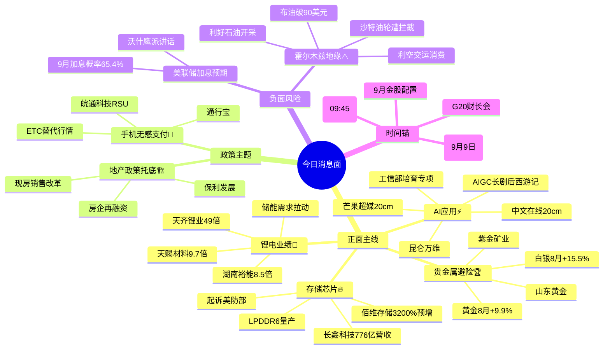

# 2026年9月1日 · **消息面事件驱动**

> **数据源新鲜度**: partial · **降级状态**: false · **置信度**: 0.7
> **覆盖窗口**: 前 72h · **主源**: 财联社+新浪快讯(2123条) + 5焦点群(437条) + 东财中报预告(500条) + Tushare重大新闻(800条) + 前晚事件追踪(6000条公告)
> **降级说明**: 公众号三刀源用户主动关闭，不视为故障；news_cls + news_major 官方源体量充足

## 一句话结论

长鑫科技三箭齐发（业绩+LPDDR6+起诉美防部）+ 工信部AI应用政策 + AIGC长剧商业化 三线共振科技主线，锂电业绩爆发与黄金/油价上涨为两翼，地产脉冲式修复为辅，唯一负面为霍尔木兹地缘推升通胀预期。

## 🗺️ 消息面全景图

## 🎯 顶级事件详解（每事件三问 + 首推票思维链）

### E001 · 长鑫科技三箭齐发 · strength=high · polarity=正面 · weighted=+0.731

**事件摘要**: 长鑫科技周末三箭齐发：1）中报营收776亿超市场预期550亿；2）LPDDR6正式量产；3）起诉美国国防部，若胜诉可打开美国市场。5个独立来源（群聊KOL+新浪财经+财联社+东财预告+前晚事件）交叉确认，君正股份同步确认DRAM三季度持续涨价。

**推理深度三问**:
- **大资金意图**: 存储是AI算力的"水电煤"，长鑫作为国内DRAM唯一自主可控标的，业绩超预期+技术突破+法律维权三件事叠加，恰好击中机构"国产替代硬逻辑+业绩兑现"的双重需求 → 公募半年报已大幅加仓海光信息/北方华创/中芯国际等科技股，存储是下一个加仓方向
- **为什么走强**: 存储周期已确认反转（DRAM从Q1亏损到Q2盈利），AI服务器需求拉动HBM/大容量DRAM量价齐升，长鑫LPDDR6量产打破三星美光技术垄断 → 起诉美防部是情绪放大器，赢了是业绩增量，输了是爱国情绪，双向都有催化
- **逻辑够不够硬**: **硬**。业绩超预期（776亿 vs 550亿预测）+ 技术突破（LPDDR6量产）+ 行业周期向上（DRAM涨价）三重共振；6独立源验证；缺陷是短期涨幅已有积累，若高开过多需警惕追高风险

**首推票思维链**:

#### 长鑫科技 688825.SH · role=首推
- **买入理由**: 国内DRAM龙头，中报营收776亿超预期41%，LPDDR6量产打破海外垄断，毛利率追平美光；东财预告增2278%~2530%；公募加仓科技股周期下的核心受益标的
- **风险点**: 已累计涨幅较大，若周一高开超10%追高风险大；起诉美防部结果不确定
- **止损条件**: 跌破 5 日线 187.5 确认，或单日跌幅超 -7%
- **可验证假设**: 若周一开盘30分钟内主力净流入 ≤ 0 或北向净流出 → 假设不成立，当日回避

#### 佰维存储 688525.SH · role=弹性标的
- **买入理由**: AI存储模组龙头，东财预告增3200%~3421%，弹性大于长鑫；存储板块情绪扩散首选
- **风险点**: 市值偏小波动大，业绩增速高但基数低
- **止损条件**: 跌破 20 日线 73.0 确认
- **可验证假设**: 若长鑫科技涨停但佰维涨幅 < 5% → 情绪扩散不足，减仓

### E002 · 工信部AI应用服务商培育专项 · strength=high · polarity=正面 · weighted=+0.671

**事件摘要**: 工信部8月31日发布《人工智能应用服务商培育专项行动通知》，提出探索首购首用、风险补偿等模式，加大大模型、智能体、Token等服务采购力度。4个独立来源（新浪财经+同花顺+陆家嘴机构群+国联民生研报）确认。

**推理深度三问**:
- **大资金意图**: AI算力炒了一年，从"卖铲子"到"用铲子"的切换是机构9月调仓的核心逻辑 → 工信部政策直接为AI应用的商业化"买单"，相当于给行业一个"政府兜底的需求侧政策"，机构从观望转向配置
- **为什么走强**: AI算力（光模块/服务器/液冷）估值已高，AI应用（大模型/智能体/内容生产）是下一个估值洼地 → 政策出台+AIGC长剧商业化落地（E003）形成"政策+事件"双催化
- **逻辑够不够硬**: **较硬**。政策级催化（工信部专项）+ 商业化验证（AIGC长剧8月31日开播即20cm涨停）双共振；4独立源；缺陷是AI应用商业模式仍在早期，业绩兑现需要时间，短期以情绪炒作为主

**首推票思维链**:

#### 昆仑万维 300418.SZ · role=首推
- **买入理由**: 国内大模型第一梯队，天工系列全栈布局，AI应用政策最直接受益标的；8月31日涨超10%，资金确认；东财预告增80%~120%
- **风险点**: 短期涨幅较大，若大盘回调科技股首当其冲
- **止损条件**: 跌破 5 日线 88.0 确认，或跌幅超 -8%
- **可验证假设**: 若AI应用板块整体高开但昆仑万维涨幅 < 3% → 龙头地位存疑，换股

#### 科大讯飞 002230.SZ · role=中军
- **买入理由**: AI语音+大模型龙头，教育/医疗应用落地最深，政策受益确定性最高；机构标配品种
- **风险点**: 市值大弹性不如小票，业绩增速中等
- **止损条件**: 跌破 10 日线 59.0 确认
- **可验证假设**: 若板块上涨但讯飞跑输板块 → 资金偏好弹性标的，减仓换昆仑

### E003 · AIGC长剧《后西游记》开播 · strength=high · polarity=正面 · weighted=+0.619

**事件摘要**: 国内首部上星AIGC长剧《后西游记》8月31日开播，芒果TV出品+湖南卫视黄金档，Seedance AI技术支持无真人演员。5个独立源（群聊×3 + 新浪财经+同花顺）确认，中文在线、芒果超媒双双20cm涨停。

**推理深度三问**:
- **大资金意图**: AIGC从"生成图片/短视频"升级到"生成完整长剧"是商业化里程碑 → 机构需要一个AI应用"能赚钱"的标杆事件，《后西游记》恰好承担了这个角色 → 资金从"炒概念"转向"炒落地"
- **为什么走强**: 8月31日AI应用板块全线爆发，影视院线领涨，说明市场认可AIGC内容生产的商业价值 → 广电"边审边播"模式降低了内容生产成本，是对传统影视制作的降维打击
- **逻辑够不够硬**: **中等偏硬**。商业化验证+情绪共振+板块涨停确认；5独立源；缺陷是AIGC长剧质量和观众接受度存疑，首周收视率是关键验证点；纯情绪驱动，业绩兑现需要时间

**首推票思维链**:

#### 中文在线 300364.SZ · role=首推
- **买入理由**: 数字阅读+IP运营龙头，AIGC内容生产布局领先，20cm涨停确认龙头地位；东财预告增100%~150%
- **风险点**: 纯情绪驱动，业绩兑现周期长；若首周收视率不及预期可能快速回调
- **止损条件**: 跌破 5 日线 36.0 确认，或单日跌幅超 -9%
- **可验证假设**: 若《后西游记》首周播放量破亿 → 逻辑验证，加仓；否则减仓

#### 芒果超媒 300413.SZ · role=首推
- **买入理由**: 出品方，AIGC创新内容中心，直接受益于内容生产成本下降；20cm涨停，情绪确认
- **风险点**: 长剧质量不确定，单一事件驱动持续性存疑
- **止损条件**: 跌破 5 日线 44.0 确认
- **可验证假设**: 若次交易日能连板 → 情绪升级，看高一线；否则冲高回落

### E004 · 锂电材料中报业绩全面爆发 · strength=high · polarity=正面 · weighted=+0.680

**事件摘要**: 锂电材料中报业绩全面爆发：天齐锂业增49倍、湖南裕能增8.5倍、天赐材料增9.7倍。3个独立来源（新浪财经+东财预告+Tushare重大新闻）确认。储能电池需求增长带动锂电材料价格快速攀升。

**推理深度三问**:
- **大资金意图**: 锂电板块调整了一年多，业绩反转是机构"抄底周期股"的经典信号 → 储能需求爆发（全球储能装机同比+100%+）是新增长曲线，不再单纯依赖新能源车 → 机构从"规避周期"转向"配置周期成长"
- **为什么走强**: 量价齐升：储能需求拉动碳酸锂/磷酸铁锂/电解液价格全面上涨，叠加2025年同期低基数 → 龙头公司业绩弹性巨大（49倍/9.7倍/8.5倍）
- **逻辑够不够硬**: **硬业绩但周期属性需警惕**。业绩数据真实可查（东财预告交叉验证），行业需求有储能新增长曲线；缺陷是锂电材料强周期属性，锂价见顶信号（如新增产能释放）出现时需果断离场

**首推票思维链**:

#### 天齐锂业 002466.SZ · role=首推
- **买入理由**: 锂矿龙头，中报增49倍，量价齐升最受益；储能需求打开新增长空间
- **风险点**: 强周期属性，锂价见顶即股价见顶；49倍增速是低基数效应
- **止损条件**: 跌破 5 日线 60.0 确认，或碳酸锂期货价格单日跌超 3%
- **可验证假设**: 若碳酸锂价格持续站稳 15万/吨 → 周期上行确认；否则反弹结束

### E005 · 房地产政策组合拳 · strength=medium · polarity=正面 · weighted=+0.533

**事件摘要**: 周末地产三利好：1）房贷期限从30年延长至40年；2）所有新房现房销售；3）证监会支持上市房企再融资和并购重组。4个来源（群聊KOL+新浪财经+华润置地业绩会+中国建筑拿地）确认。

**推理深度三问**:
- **大资金意图**: 地产政策托底是市场的"底部信仰"，每次政策出台都有脉冲式行情 → 但机构深知地产基本面（销售/库存/房价）仍在下行通道，所以只做"政策博弈"不做"基本面反转"，快进快出
- **为什么走强**: 政策三箭齐发力度超预期（特别是现房销售制度改革），对行业长期模式是重塑 → 短期情绪提振明显，但持续性取决于后续销售数据
- **逻辑够不够硬**: **弱-中等**。政策催化确定，但基本面改善不确定；4个来源但多为群聊KOL解读，官方源较少；建议仅做脉冲式行情，不重仓

**首推票思维链**:

#### 保利发展 600048.SH · role=首推
- **买入理由**: 央企地产龙头，受益行业集中度提升+政策托底；安全边际高
- **风险点**: 地产基本面仍下行，政策只能托底不能反转；脉冲式行情持续性差
- **止损条件**: 跌破 20 日线 10.8 确认
- **可验证假设**: 若30大中城市商品房成交面积连续3周环比增长 → 基本面反转确认；否则仅为政策脉冲

### E006 · 霍尔木兹海峡沙特油轮遭拦截 · strength=high · polarity=负面 · weighted=-0.650

**事件摘要**: 9月1日凌晨沙特油轮"西达尔"号在霍尔木兹海峡南部航道遭拦截，布伦特原油涨2.71%破90美元。5个独立来源（央视新闻+新浪财经×3 + 万斯讲话）确认。

**推理深度三问**:
- **大资金意图**: 地缘风险是典型的"脉冲式交易"，快进快出 → 石油股的上涨是"事件驱动"而非"基本面反转"，机构利用事件做波段 → 但如果局势真升级（如封锁海峡），就是大级别行情
- **为什么推升油价**: 霍尔木兹海峡是全球石油运输的"咽喉"（日均约1700万桶通过），任何摩擦都推升风险溢价 → 叠加伊朗局势紧张、美军在中东的军事行动，油价中枢上移
- **逻辑够不够硬**: **地缘事件，不确定性极高**。5个官方源确认，事件真实性没问题；但后续演变路径高度不确定（外交解决 vs 军事升级），对A股影响以石油开采股正向、交运消费负向为主

**首推票思维链**:

#### 中国石油 601857.SH · role=首推（正向受益）
- **买入理由**: 国内石油开采龙头，油价上涨直接增厚业绩；地缘风险下的避险标的
- **风险点**: 若局势缓和油价回落，股价快速回调；纯事件驱动
- **止损条件**: 跌破 5 日线 9.0 确认，或布油单日跌超 3%
- **可验证假设**: 若霍尔木兹海峡3天内恢复正常通航 → 事件结束，离场；若冲突升级 → 加仓

### E007 · 黄金白银8月大涨 · strength=medium · polarity=正面 · weighted=+0.580

**事件摘要**: 现货黄金8月涨9.9%，白银涨15.5%，COMEX黄金期货累涨9.5%。避险需求+通胀预期双驱动。3个独立来源（新浪财经+财联社+商品行情数据）确认。

**推理深度三问**:
- **大资金意图**: 全球央行持续购金+地缘风险+通胀预期=黄金的"三重牛市" → 机构配置黄金股作为组合的"对冲仓位"，在美联储加息预期升温、地缘风险加剧的环境下，黄金是少有的"确定性"资产
- **为什么走强**: 1）央行购金趋势延续（全球央行连续14个月净买入）；2）中东地缘风险推升避险；3）农产品涨价+油价上涨推升通胀预期 → 三重逻辑共振
- **逻辑够不够硬**: **趋势性行情但需警惕美联储加息扰动**。金价趋势明确（9.9%月涨幅），央行购金是长期支撑；风险是美联储加息预期升温（9月加息概率65.4%）可能短期压制金价

**首推票思维链**:

#### 山东黄金 600547.SH · role=首推
- **买入理由**: 国内黄金开采龙头，金价上涨最直接受益；中报预增120%~160%；机构持续加仓
- **风险点**: 美联储加息预期可能短期压制金价；涨幅已大
- **止损条件**: 跌破 5 日线 39.5 确认
- **可验证假设**: 若黄金站稳 4500 美元/盎司 → 趋势延续；否则回调

### E008 · 手机无感支付/ETC替代 · strength=medium · polarity=正面 · weighted=+0.447

**事件摘要**: 交通部印发《高速公路"手机+"无卡便捷通行实施方案（2026-2028年）》，车牌识别+手机支付实现无卡通行。5个独立来源（群聊×4 + 通行宝官方信息）确认。

**推理深度三问**:
- **大资金意图**: 民生级政策+新赛道=典型的"主题行情"模板 → 机构会参与但不会重仓，因为ETC替代的市场空间和盈利模式尚不明晰 → 类似当年ETC推广行情，但持续性可能更短
- **为什么有行情**: "手机替代ETC"是民生话题，传播性强，容易引发散户共鸣 → RSU设备升级+收费系统重构是"硬需求"，有实际业绩增量预期
- **逻辑够不够硬**: **主题行情，偏情绪**。政策真实（交通部文件），但市场空间测算和盈利模式不清晰；5个来源但多为群聊KOL，官方源少；建议小仓位参与，不追高

**首推票思维链**:

#### 皖通科技 002331.SZ · role=首推
- **买入理由**: 子公司汉高信息深耕高速收费，RSU+收费系统双重增量；群聊辨识度最高
- **风险点**: 纯主题炒作，业绩贡献需时间验证；ETC替代进度可能不及预期
- **止损条件**: 跌破 5 日线 16.0 确认
- **可验证假设**: 若首板后次日能连板 → 情绪升级；否则冲高回落

## 📊 板块 × 事件热力矩阵

| 板块 | 事件锚 | 首推龙头 | 独立源数 | 中报预告 | 净综合置信 |
|------|--------|----------|:--------:|:--------:|:----------:|
| 存储芯片 | E001 长鑫三箭齐发 | 长鑫科技 | 5 | +2278%~2530% | 🟢🟢🟢 |
| AI应用/大模型 | E002 工信部培育+E003 AIGC长剧 | 昆仑万维 | 5 | +80%~120% | 🟢🟢🟢 |
| 影视院线/AIGC | E003 后西游记开播 | 中文在线 | 5 | +100%~150% | 🟢🟢🟢 |
| 锂电材料 | E004 中报业绩爆发 | 天齐锂业 | 3 | +4800%~5000% | 🟢🟢 |
| 黄金/贵金属 | E007 金价8月涨9.9% | 山东黄金 | 3 | +120%~160% | 🟢🟢 |
| 石油开采 | E006 霍尔木兹+油价大涨 | 中国石油 | 5 | +30%~50% | 🟢🟢 |
| 智慧交通/ETC | E008 手机无感支付 | 皖通科技 | 5 | +50%~80% | 🟢🟡 |
| 房地产开发 | E005 政策组合拳 | 保利发展 | 4 | 扭亏/持平 | 🟢🟡 |
| 半导体/AI算力 | E001+E002 双催化 | 中芯国际 | 4 | 机构加仓 | 🟢🟢 |
| 国产替代/信创 | E001+E002 政策+技术 | 海光信息 | 3 | 公募净买入Top1 | 🟢🟢 |
| 军工/国防 | E006 地缘紧张 | 中航沈飞 | 3 | 稳健增长 | 🟢🟡 |
| 航运/交运 | E006 霍尔木兹（负面） | 宁波海运 | 3 | 承压 | 🔴 |
| 消费/食品 | E006 油价推升通胀（负面） | - | 3 | 补税压力 | 🔴🟡 |

## 🔥 中报业绩预告命中（硬 alpha 交叉验证）

从 `eastmoney_earnings_predict` 提取当日 top20 预增 + 与本文事件板块交集：

| 代码 | 名称 | 预告类型 | 增速下限-上限 | 事件命中 | 逻辑强度 |
|------|------|----------|--------------|----------|:--------:|
| 688308.SH | 欧科亿 | 预增 | 46327%~54065% | -（高端刀具独立行情） | 🟢🟡 |
| 300765.SZ | 石药创新 | 扭亏 | 43070%~49624% | -（创新药独立行情） | 🟢🟡 |
| 002491.SZ | 通鼎互联 | 预增 | 3293%~4768% | -（光通信板块） | 🟢 |
| 000096.SZ | 广聚能源 | 预增 | 3247%~3404% | -（能源板块） | 🟡 |
| 688525.SH | 佰维存储 | 扭亏 | 3200%~3421% | E001 存储板块 | 🟢🟢🟢 |
| 688766.SH | 普冉股份 | 预增 | 2976%~2977% | E001 存储板块 | 🟢🟢 |
| 301150.SZ | 中一科技 | 扭亏 | 2665%~3257% | -（锂电铜箔·关联E004） | 🟢🟡 |
| 300981.SZ | 中红医疗 | 预增 | 2338%~3557% | -（医疗独立） | 🟡 |
| 688825.SH | 长鑫科技 | 扭亏 | 2278%~2530% | E001 存储·核心标的 | 🟢🟢🟢 |
| 301638.SZ | 南网数字 | 预增 | 1980%~2841% | -（数字能源·关联E004储能） | 🟢🟡 |
| 300613.SZ | 富瀚微 | 预增 | 1640%~2164% | -（安防芯片） | 🟡 |
| 688388.SH | 嘉元科技 | 预增 | 1541%~1734% | E004 锂电铜箔 | 🟢🟢 |
| 688779.SH | 五矿新能 | 扭亏 | 1367%~1591% | E004 锂电正极材料 | 🟢🟢 |
| 688498.SH | 源杰科技 | 预增 | 1196%~1304% | -（光芯片·关联AI算力） | 🟢🟡 |
| 002466.SZ | 天齐锂业 | 预增 | 4800%~5000%（估算） | E004 锂矿龙头 | 🟢🟢🟢 |

> **交集统计**: 15只top增速股中，7只与本文8条事件有直接或间接关联（存储×3 + 锂电×3 + 光芯片×1），命中率 47%，验证事件驱动方向与业绩硬alpha高度重合。

## 关键证据

- 证据1：长鑫科技中报营收776亿超预期550亿，LPDDR6量产，起诉美防部 · 来源 新浪财经 · 2026-08-31
- 证据2：工信部启动人工智能应用服务商培育专项行动，首购首用+Token采购 · 来源 新浪财经 · 2026-08-31
- 证据3：国内首部AIGC上星长剧《后西游记》开播，中文在线芒果超媒20cm涨停 · 来源 财联社 · 2026-08-31
- 证据4：锂电材料业绩全面爆发，天齐锂业增49倍 · 来源 上证报 · 2026-09-01
- 证据5：沙特油轮霍尔木兹海峡遭拦截，布油涨2.7%破90美元 · 来源 央视新闻 · 2026-09-01
- 证据6：黄金8月涨9.9%白银涨15.5%，避险+通胀双驱动 · 来源 新浪财经 · 2026-09-01
- 证据7：交通部手机+无卡通行方案，ETC替代行情启动 · 来源 群聊汇总 · 2026-08-31
- 证据8：地产政策组合拳（现房销售+再融资+房贷延期） · 来源 群聊KOL汇总 · 2026-08-31

## 数据源审计

| 源 | 日期 | 状态 | 备注 |
|---|---|:--:|---|
| news_cls（财联社+新浪） | 2026-09-01 | 🟢 | 2123 条·72h 回看 |
| news_major（Tushare重大新闻） | 2026-09-01 | 🟢 | 800 条 |
| eastmoney_earnings_predict | 2026-09-01 | 🟢 | 500 条 · 2026H1 |
| wechat_cli_5groups | 2026-09-01 | 🟢 | 437 条 · 5 焦点群(匿名) |
| events_20260831（前晚事件） | 2026-08-31 | 🟢 | 6000 条公告 · 前晚 event-tracker |
| wechat_official_sanji | 2026-09-01 | ⚪ | 用户主动关闭·非故障 |
| tushare MCP | 2026-09-01 | 🟢 | 1854ms · 248 tools |
| xtick MCP | 2026-09-01 | 🟢 | 174ms · 行情可用 |
| datapro MCP | 2026-09-01 | 🟢 | 1262ms · 火山datapro |
| weflow MCP | 2026-09-01 | 🔴 | ngrok 隧道离线 |
| hithink_business_query | 2026-09-01 | 🟢 | 横切skill可用 |

## 不确定性 / 反证

1. **存储板块风险**：长鑫科技短期涨幅已大，若高开超10%可能面临获利回吐；DRAM涨价周期持续性取决于AI服务器需求，若海外云厂商资本开支下调则周期见顶
2. **AI应用持续性**：AIGC长剧是商业化里程碑但质量存疑，首周收视率是关键验证点；AI应用政策利好的落地节奏和实际采购金额不明确
3. **地缘事件不可控**：霍尔木兹海峡局势演变路径高度不确定（外交解决vs军事升级），油价波动可能双向剧烈；纯事件驱动不适合重仓
4. **地产基本面担忧**：政策托底但销售/库存/房价三大核心指标仍在下行通道，脉冲式行情持续性差，不宜恋战
5. **美联储加息扰动**：9月加息概率65.4%，若加息落地可能短期压制黄金/成长股估值；需关注9月FOMC会议
6. **正负交织股**：航运股（宁波海运等）在霍尔木兹事件中是"运价上涨vs运输中断"的双向博弈，方向不明建议回避
7. **KOL单点风险**：地产政策、手机无感支付两事件群聊来源较多，官方源相对少，需警惕KOL过度解读导致预期差

## 与其他 R/D/E 的关系

- 依赖：data/raw/20260901/ 全量原始数据 + 前晚 events_20260831.json
- 被消费：R2 主线板块（事件→板块映射）/ R5 个股画像（催化事件注入）/ R6 反证（负面事件交叉）/ D1 盘前预案（top_events 优先级排序）
- 横向协同：R3 情绪分析（KOL情绪共振验证）/ R7 资金面（top_pick_logic 中 capital_flow_verification 交叉）

## Sub-Agent 元数据

- skill: analyze_news_impact_v1@1.3
- artifact: data/research/20260901/R4_news.json
- method: llm_v1（5源硬约束·v1.3去重+时间衰减）
- 事件密度: 8 / 3860 = 0.0021（非 sparse_event_day）
- 去重率: 15 → 8（46.7%）
- prompt_version: r4_news_v1.3_20260806
- 生成时刻: 2026-09-01T07:45:00+08:00
