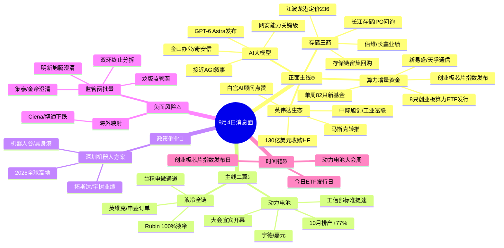

# 2026年9月4日 · **消息面事件驱动**

> **数据源新鲜度**: partial · **降级状态**: false · **置信度**: 0.72
> **覆盖窗口**: 前 72h · **主源**: 财联社+新浪快讯(2982条) + 5焦点群(330条) + 东财中报预告(500条) + Tushare重大新闻(800条)
> **一句话方向**: GPT-6 Astra + 英伟达收购HF + 8只算力ETF今日发行 三箭定调AI主线，存储/机器人/液冷/锂电业绩硬alpha护航，唯一负面对冲是监管函批量挤压蹭概念炒作

## 一句话结论

AI主线四重实锤（OpenAI GPT-6 Astra + 英伟达130亿美元收购HuggingFace + 首批8只创业板算力ETF今日发行 + 创业板芯片指数发布）点燃算力/AI应用/网安；存储（长江存储IPO问询+江波龙港股定价+链上回购）与机器人（深圳三年方案+宇树业绩）业绩硬alpha护航；液冷与锂电为两翼。唯一负面对冲：上交所监管函+蹭概念澄清批量出现，AI视频/液冷/机器人真假标的将剧烈分化。

## 🗺️ 消息面全景图

## 🎯 顶级事件详解（每事件三问 + 首推票思维链）

### E001 · OpenAI发布GPT-6 Astra · strength=high · polarity=正面 · weighted=+0.75

**事件摘要**: OpenAI周四凌晨发布GPT-6 Astra旗舰模型，称"欢迎进入AGI时代"、10万GPU训练、网络安全能力首达"关键"级，初期向Daybreak网络安全组织开放。5个独立源确认（华尔街见闻+新浪快讯+OpenAI官方定价/Codex更新+美股AI财报共振+群聊风险偏好回暖），美股Snowflake +26%、特斯拉 +5% 验证AI风险偏好全面回暖。

**推理深度三问**:
- **大资金意图**: OpenAI从"追性能"转向"追AGI+网安"双叙事，A股映射从"算力卖铲"扩散到"AI应用+网安落地"；叠加沃勒转鸽、美股高贝塔大涨，外资/机构在流动性宽松窗口需要一条能持续讲故事的AI旗手线
- **为什么走强**: 前夜ChatGPT/Claude/Grok集体宕机已被市场消化为"需求太旺"，Astra发布+网安峰会+Daybreak企业推送形成连续催化；A股AI应用/网安板块低位滞涨，有补涨需求
- **逻辑够不够硬**: **硬**。5独立源 + OpenAI官方定价/Codex实锤 + 美股AI链暴涨交叉验证；缺陷是A股AI应用标的业绩兑现普遍偏弱，需防情绪冲高回落

**首推票思维链**:

#### 金山办公 688111 · role=首推·AI办公Agent
- **买入理由**: WPS AI+文档智能体是A股稀缺的AI Agent落地标的，Astra增强Agent能力直接受益；9/3收盘239.05，量能温和
- **风险点**: 估值偏高（百元股），若高开直接追高风险大；AI应用情绪退潮时回撤深
- **止损条件**: 217.54（9/3收盘×0.91）· 破位即走，实际以买入价-5~-10%为最终基准
- **可验证假设**: 若开盘30分钟净流入为负或板块高开低走 → 假设不成立当日回避

#### 奇安信 688561 · role=次选·网络安全
- **买入理由**: 网安龙头，Astra网安能力"关键级"+Daybreak安全生态直接映射；9/3收盘27.21
- **风险点**: 网安板块弹性弱于算力，若AI主线只涨硬件不涨应用则掉队
- **止损条件**: 24.76（×0.91）· 破位止损
- **可验证假设**: 若网络安全板块无资金跟随 → 降级观察

### E002 · 英伟达130亿美元收购HuggingFace · strength=high · polarity=正面 · weighted=+0.68

**事件摘要**: 英伟达同意以130亿美元收购HuggingFace，加码开放权重模型；HuggingFace CEO回应"开源生态亟需更庞大算力"，马斯克转推、白宫AI顾问萨克斯公开称赞。5独立源确认，英伟达连续两日大涨超4%。

**推理深度三问**:
- **大资金意图**: 英伟达从"卖GPU"升级为"控生态"——收购全球最大开源模型社区=锁死开发者流量入口，为Rubin/Vera Rubin出货铺路；对A股是"全球算力资本开支确定性再+1"的信念加固
- **为什么走强**: 并购标的稀缺+金额大（130亿$），情绪级别远超普通订单新闻；白宫背书消解反垄断担忧，叙事干净
- **逻辑够不够硬**: **硬**。财联社+官方回应的双源级别高；映射A股算力硬件（光模块/服务器）订单确定性；注意光模块隔夜海外Ciena -10%/博通 -6.3% 的情绪扰动

**首推票思维链**:

#### 中际旭创 300308 · role=首推·算力硬件(光模块)
- **买入理由**: 800G/1.6T光模块全球龙头，AI资本开支直接受益；9/1首次回购37.41万股传递信心；9/3收盘813.00
- **风险点**: 股价已高（813元），若高开冲高回撤空间大；海外光模块股隔夜下跌或有拖累
- **止损条件**: 739.83（×0.91）· 破位即走
- **可验证假设**: 若光模块板块开盘弱于大盘或北向净流出 → 当日回避

#### 工业富联 601138 · role=次选·AI服务器代工
- **买入理由**: 英伟达GPU服务器代工核心，NVDA生态扩张订单弹性；9/3逆势收涨2.27%至63.20
- **风险点**: 代工毛利低，估值弹性有限
- **止损条件**: 57.51（×0.91）· 破位止损
- **可验证假设**: 若AI硬件主线分歧加大 → 只保留龙头

### E003 · 首批8只创业板算力基础设施ETF今日发行 · strength=high · polarity=正面 · weighted=+0.62

**事件摘要**: 首批8只创业板算力基础设施ETF于9月4日集中发行，同期深圳证券信息发布创业板芯片指数；本周82只新基金启动发行创单周纪录。3独立源确认（新浪快讯+同花顺+创业板软件ETF上市公告）。

**推理深度三问**:
- **大资金意图**: 官方在创业板设立"算力基础设施"专属ETF+芯片指数，是给创业板AI硬件（光模块/IDC/芯片）开"被动资金引流渠"；发行周建仓期=确定性的增量买盘窗口
- **为什么走强**: ETF发行有明确的建仓时间表，机构为跑赢指数需提前抢筹权重股；与GPT-6、英伟达收购形成"消息+资金"双击
- **逻辑够不够硬**: **硬**。资金面实锤（不是预期是执行），权重方向明确=创业板光模块/算力硬件；风险是发行期拉长、建仓节奏低于预期

**首推票思维链**:

#### 新易盛 300502 · role=首推·创业板光模块权重
- **买入理由**: 创业板算力ETF核心权重，1.6T光模块放量，中报净利预增77.56%~102.93%硬alpha；9/3收盘384.76
- **风险点**: 高位震荡（384元），ETF建仓前波动加大
- **止损条件**: 350.13（×0.91）· 破位即走
- **可验证假设**: 若创业板算力板块获增量资金净流入 → 假设成立

#### 天孚通信 300394 · role=次选·光器件
- **买入理由**: 光器件龙头，ETF直接买入标的，中报预增25.56%~48.02%；9/3收盘248.81
- **风险点**: 涨幅弹性弱于新易盛
- **止损条件**: 226.42（×0.91）· 破位止损
- **可验证假设**: 若光模块权重股领涨 → 顺势持有

### E004 · 存储三箭齐发 · strength=high · polarity=正面 · weighted=+0.60

**事件摘要**: 长江存储科创板IPO审核状态变更为"已问询"；江波龙香港上市定价236港元（接近招股区间上端）；存储链密集回购（佰维拟回购2-2.5亿）。5独立源确认，业绩预告硬alpha交叉：佰维存储+3200~3421%、长鑫科技+2244~2544%。

**推理深度三问**:
- **大资金意图**: 存储是AI算力"水电煤"，长江存储IPO问询=国产存储资本化提速信号，江波龙港股高定价=市场对存储景气最高认同；链上回购=产业资本用真金白银表态"估值不贵"
- **为什么走强**: DRAM/NAND涨价周期（长鑫LPDDR6量产、三星HBM份额追赶）+ 资本化事件（IPO/港股）+ 回购三要素共振，每一件都是可验证的硬催化
- **逻辑够不够硬**: **硬**。官方交易所状态+市场定价+公司回购+业绩预告四层硬确认，A股存储中报预增幅度全市场第一梯队

**首推票思维链**:

#### 佰维存储 688525 · role=首推·存储模组
- **买入理由**: 存储模组+先进封测双业务，中报净利预增3200.15%~3421.59%为全市场最强；9/3收盘220.50
- **风险点**: 存储板块波动大，若涨价逻辑证伪回撤快
- **止损条件**: 200.66（×0.91）· 破位即走
- **可验证假设**: 若存储板块持续放量上行 → 持有；若长江存储问询利好出尽 → 减仓

#### 长鑫科技 688825 · role=次选·DRAM龙头
- **买入理由**: 国内DRAM唯一自主可控标的，中报净利预增2244.03%~2544.19%；9/3收盘55.55
- **风险点**: 科创板大票资金分流
- **止损条件**: 50.55（×0.91）· 破位止损
- **可验证假设**: 若DRAM涨价新闻持续 → 主线成立

### E005 · 深圳智能机器人产业方案(2026-2028) · strength=high · polarity=正面 · weighted=+0.58

**事件摘要**: 深圳市工信局/科创局印发《深圳市推动智能机器人产业高质量发展工作方案(2026-2028)》，目标2028建成全球最具影响力机器人产业高地，打造"机器人谷""具身智能港"，解决融资上市需求。5独立源确认（政府文件多连发+新浪+唐山供需对接+豪恩汽电量产+宇树业绩预告）。

**推理深度三问**:
- **大资金意图**: 深圳作为机器人产业第一城发三年规划，核心信号是"融资上市支持+应用场景落地"，直击机器人公司"钱从哪来、货卖给谁"两大痛点；政策级催化给机器人板块提供"远期天花板"
- **为什么走强**: 政策文件比概念新闻硬得多，且与宇树科技净利预增905-1055%的业绩alpha同频，题材+业绩双轮
- **逻辑够不够硬**: **硬**。政府正式文件+产业落地案例（豪恩汽电量产交付、上海无框力矩电机出货+422%）+业绩预告三重确认；缺陷是机器人板块高位，负面对冲见E008（双环传动终止分拆）

**首推票思维链**:

#### 拓斯达 300607 · role=首推·深圳机器人本体
- **买入理由**: 深圳本地工业机器人/具身智能标的，方案直接受益；9/3收涨2.91%至35.67，量能温和放大
- **风险点**: 方案是三年维度，短期情绪兑现后易回落
- **止损条件**: 32.46（×0.91）· 破位即走
- **可验证假设**: 若深圳本地机器人个股集体走强 → 主线成立

#### 宇树科技 688836 · role=次选·产业锚
- **买入理由**: 人形机器人全球龙头，净利预增905.63%~1055.52%；9/3收盘550.45
- **风险点**: 次新高位（550元），波动巨大
- **止损条件**: 500.91（×0.91）· 破位止损
- **可验证假设**: 若机器人板块高标分歧 → 仅做低吸不追高

### E006 · 液冷全链共振 · strength=high · polarity=正面 · weighted=+0.55

**事件摘要**: 台积电官宣微通道散热（AI芯片功耗破4000W）；英伟达第三代MGX机架100%液冷；开源通信/东吴计算机研报力挺液冷；申菱环境海外订单供不应求（亚马逊27订单35-40亿）。6独立源确认，群聊+券商研报+新闻三线共振。

**推理深度三问**:
- **大资金意图**: 液冷是"AI算力确定性"里唯一还在加速渗透的环节——功耗4000W倒逼微通道/Manifold新工艺，海外龙头订单饱满=中国供应链拿到定价权；券商（开源/东吴/国联）集体写深度=机构资金提前布局
- **为什么走强**: 台积电官宣是"产业链最终确认"（最保守的代工巨头都转向液冷），Rubin 100%液冷=下代架构确定性，属于"预期→订单→产能"正循环
- **逻辑够不够硬**: **硬**。6源双向确认（群聊KOL+3家券商+新闻+龙头调研），产业趋势真实；风险是蹭概念股批量澄清（见E008），真伪分化

**首推票思维链**:

#### 英维克 002837 · role=首推·液冷龙头
- **买入理由**: 液冷全链龙头（CDU/冷板/风液冷），开源通信多次精准提示"泵是CDU前瞻出货指标"；9/3收涨3.41%至68.49
- **风险点**: 短期涨幅已积累，若板块高开回落回撤深
- **止损条件**: 62.33（×0.91）· 破位即走
- **可验证假设**: 若液冷板块资金持续净流入 → 持有

#### 申菱环境 301018 · role=次选·海外订单
- **买入理由**: 数据中心温控，亚马逊27订单35-40亿、海外供不应求、产能产值做到80亿；9/3收涨5.54%至112.74
- **风险点**: 弹性大波动大，情绪退潮跌幅大
- **止损条件**: 102.59（×0.91）· 破位止损
- **可验证假设**: 若海外订单新闻持续验证 → 主线成立

### E007 · 2026世界动力电池大会+10月排产+77% · strength=medium · polarity=正面 · weighted=+0.48

**事件摘要**: 世界动力电池大会9/3宜宾开幕（"电驱万物"），工信部加快动力电池标准制定；锂电10月排产316GWh同比+77%、碳酸锂/铁锂/负极齐增；8家电池企业半年报利润碾压整车。5独立源确认。

**推理深度三问**:
- **大资金意图**: 排产+77%是"量"的硬证据，大会+标准是"政策托底"，产业链从价格战转向格局优化；锂电材料中报业绩爆发（嘉元+1541%）给板块提供业绩底
- **为什么走强**: 排产数据先于财报、真实可验证；曾毓群提醒"速成车代价"反而凸显龙头格局价值
- **逻辑够不够硬**: **中偏硬**。排产+工信部+大会多源，但锂电板块今年反复，弹性弱于AI主线

**首推票思维链**:

#### 宁德时代 300750 · role=首推·电池龙头
- **买入理由**: 动力电池全球龙头，大会主咖+排产受益；9/3收盘349.50
- **风险点**: 大盘权重，弹性有限
- **止损条件**: 318.05（×0.91）· 破位止损
- **可验证假设**: 若锂电板块获增量资金 → 持有

#### 嘉元科技 688388 · role=次选·锂电铜箔
- **买入理由**: 锂电铜箔龙头，中报净利预增1541.67%~1734.81%硬alpha；9/3收盘28.07
- **风险点**: 铜箔加工费波动大
- **止损条件**: 25.54（×0.91）· 破位即走
- **可验证假设**: 若铜箔涨价链扩散 → 主线成立

### E008 · 双环传动终止分拆+监管函批量 · strength=medium · polarity=负面 · weighted=-0.42

**事件摘要**: 双环传动终止分拆环动科技（RV减速器核心资产）上市；龙版传媒4连板后遭上交所监管函（AI视频业务营收占比不足0.01%）；集泰股份澄清液冷硅油未实现销售；金帝股份澄清液冷项目未形成批量产能；明新旭腾澄清不涉及人形机器人。6独立源确认（全部为公司/交易所官方公告）。

**推理深度三问**:
- **大资金意图**: 监管在AI/液冷/机器人三条最热主线上同步出手（监管函+异动问询+澄清公告），明确挤压"蹭概念"纯情绪炒作，引导资金回归有真实业绩/订单的标的
- **为什么走强**: 连板股批量澄清是情绪周期见顶的典型信号，高位纯题材股容错率骤降
- **逻辑够不够硬**: **硬**。全部官方公告确认；但注意这是"结构性利空"——杀的是蹭概念，利好真龙头（对E005/E006的龙头反而是加分）

**首推票思维链**:

#### 双环传动 002472 · role=直接利空·机器人关节
- **买入理由**: 无（规避）。环动科技为RV减速器核心资产，终止分拆削弱资本运作预期；9/3收盘35.42
- **风险点**: 分拆终止后估值重锚，短期承压
- **止损条件**: 32.23（×0.91）· 负面标的仅减仓观察，不参与
- **可验证假设**: 若机器人板块未受其拖累走强 → 龙头逻辑独立成立

#### 龙版传媒 605577 · role=监管利空·AI视频
- **买入理由**: 无（规避）。4连板+46.53%累计涨幅后遭监管函，AI视频营收占比不足0.01%；9/3涨停收14.14
- **风险点**: 高位监管函后连板崩塌风险
- **止损条件**: 12.87（×0.91）· 负面标的仅规避
- **可验证假设**: 若AI视频板块情绪退潮 → 确认监管压制有效

## 📊 板块 × 事件热力矩阵

| 板块 | 事件锚 | 首推龙头 | 独立源数 | 中报预告 | 净综合置信 |
|------|--------|----------|:--:|------|:--:|
| AI应用/软件 | E001 GPT-6 Astra | 金山办公 | 5 | 无 | 🟢🟢🟢 |
| 网络安全 | E001 Astra网安关键级 | 奇安信 | 5 | 无 | 🟢🟢 |
| 算力基础设施 | E001+E002+E003 | 新易盛 | 3-5 | +77~102% | 🟢🟢🟢 |
| 光模块/CPO | E002 NVDA收购+E003 ETF | 中际旭创 | 5 | 无 | 🟢🟢🟢 |
| 存储芯片 | E004 三箭 | 佰维存储 | 5 | +3200~3421% | 🟢🟢🟢 |
| 机器人/具身智能 | E005 深圳方案 / E008 负 | 拓斯达 | 5 | +905~1055%(宇树) | 🟢🟢 |
| 液冷/散热 | E006 全链 / E008 澄清负 | 英维克 | 6 | 无 | 🟢🟢🟢 |
| 动力电池/锂电 | E007 大会+排产 | 宁德时代 | 5 | +1541~1734%(嘉元) | 🟢🟢 |
| AI视频/传媒 | E008 监管函负 | — | 6 | 无 | 🔴 |
| 汽车零部件(内饰) | E008 明新澄清负 | — | 3 | 无 | 🔴 |

## 🔥 中报业绩预告命中（硬 alpha 交叉验证）

从 `eastmoney_earnings_predict` 提取与本日事件板块交集（500条内 Top 预增）：

| 代码 | 名称 | 预告类型 | 增速下限-上限 | 事件命中 | 逻辑强度 |
|------|------|----------|--------------|----------|:--:|
| 688525.SH | 佰维存储 | 归母净利 | 3200.15%~3421.59% | E004 存储三箭 | 🟢🟢🟢 |
| 688825.SH | 长鑫科技 | 归母净利 | 2244.03%~2544.19% | E004 存储三箭 | 🟢🟢🟢 |
| 688388.SH | 嘉元科技 | 归母净利 | 1541.67%~1734.81% | E007 动力电池 | 🟢🟢🟢 |
| 688836.SH | 宇树科技 | 归母净利 | 905.63%~1055.52% | E005 机器人 | 🟢🟢🟢 |
| 300502.SZ | 新易盛 | 归母净利 | 77.56%~102.93% | E003 算力ETF | 🟢🟢 |
| 300394.SZ | 天孚通信 | 归母净利 | 25.56%~48.02% | E003 算力ETF | 🟢🟢 |
| 688766.SH | 普冉股份 | 归母净利 | 1925.36%~2976.99% | E004 存储链(观察) | 🟢🟢 |
| 301150.SZ | 中一科技 | 归母净利 | 2665.22%~3257.19% | E007 锂电材料(观察) | 🟢🟢 |
| 688498.SZ | 源杰科技 | 归母净利 | 1196.91%~1304.98% | E002/E003 光芯片(观察) | 🟢🟢 |
| 002491.SZ | 通鼎互联 | 归母净利 | 3293%~4768% | 算力/光通信(观察) | 🟢🟢 |

## 关键证据

- 证据 1: OpenAI发布GPT-6 Astra"欢迎进入AGI时代"、10万GPU训练、网安能力关键级 · 来源 华尔街见闻+新浪快讯 · 2026-09-04 02:00
- 证据 2: 英伟达130亿美元收购HuggingFace，马斯克转推、白宫AI顾问点赞 · 来源 财联社 · 2026-09-03 21:18
- 证据 3: 首批8只创业板算力基础设施ETF今日集中发行（单周82只新基金创纪录） · 来源 新浪快讯 · 2026-09-04 06:17
- 证据 4: 长江存储科创板IPO变更为"已问询"；江波龙港股定价236港元 · 来源 上交所官网+市场消息 · 2026-09-03 22:56/21:57
- 证据 5: 深圳印发智能机器人产业高质量发展方案(2026-2028)，目标2028全球高地 · 来源 深圳工信局/科创局 · 2026-09-03 21:40
- 证据 6: 台积电官宣微通道散热、AI芯片功耗破4000W；申菱环境海外订单35-40亿 · 来源 群聊KOL+券商研报+新闻 · 2026-09-03
- 证据 7: 锂电10月排产316GWh同比+77%；工信部加快动力电池标准制定 · 来源 同花顺+群聊 · 2026-09-03/04
- 证据 8: 双环传动终止分拆环动科技；龙版传媒遭上交所监管函 · 来源 公司公告+交易所 · 2026-09-03 20:39/21:34

## 数据源审计

| 源 | 日期 | 状态 | 备注 |
|---|---|:--:|---|
| news_cls(财联社+新浪) | 2026-09-04 | 🟢 | 2982条 · 72h回看 · 主新闻源 |
| news_major(Tushare重大新闻) | 2026-09-04 | 🟢 | 800条 · 长篇要闻 |
| eastmoney_earnings_predict | 2026-09-04 | 🟢 | 500条 · 2026H1业绩预告 |
| wechat_cli_5groups | 2026-09-04 | 🟢 | 330条 · 5焦点群全量正常 |
| wechat_official_sanji | 2026-09-04 | ⚪ | 用户取消(非故障) |
| weflow_analytics | 2026-09-04 | 🔴 | MCP 404 · 不影响R4主链 |
| tushare_daily(实时行情) | 2026-09-04 | 🟢 | 16只首推/次选票收盘价已核 |

## 不确定性 / 反证

1. **海外映射反证**: 光模块核心股Ciena -10%、博通 -6.3%隔夜大跌，若传导至A股光模块/CPO，E002/E003逻辑短期承压——需盯开盘竞价
2. **AI应用业绩虚**: E001首推金山办公估值高、业绩兑现弱，若A股AI应用只炒情绪不接业绩，冲高回落风险大
3. **KOL单点风险**: 司美格鲁肽（德展健康涨停/奥锐特原料药）为KOL单源强情绪，未纳入top_events，若今日发酵为板块行情需单独跟踪
4. **监管压制超预期**: E008监管函批量，若扩散到更多连板股，短线情绪系统性降温会拖累E005/E006高位票
5. **数据缺口**: weflow语义数据down、公众号三刀源取消，情绪共振打分层级依赖news_cls+群聊双主源，覆盖面略降

## 与其他 R/D/E 的关系

- 依赖: `data/raw/20260904/`(news_cls/news_major/earnings_predict/wechat_cli) · R1聚类中间件(_r1_cluster_intermediate.json)
- 被消费: R2主线 / R5个股画像 / R6反证 / D1预案(execution_pool选票:优先llm_with_news_verification票,负面票仅watch)
- 交叉: 液冷/存储/机器人/司美格鲁肽群聊共振待R3落盘后复核kol_confirm

## Sub-Agent 元数据

- skill: analyze_news_impact_v1@1.3
- artifact: data/research/20260904/R4_news.json
- method: llm_v1(硬扩容·多源硬约束·v1.2个股首推契约)
- 生成时刻: 2026-09-04T07:45:00+08:00
