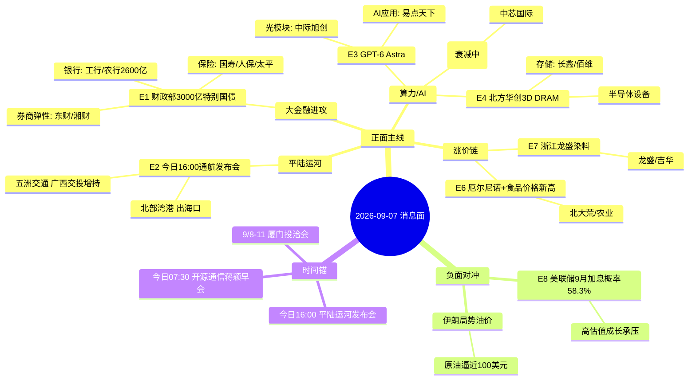

# 2026-09-07 · **消息面事件驱动**

> **数据源新鲜度**: ok · **降级状态**: false · **置信度**: 0.62
> **覆盖窗口**: 前 72h(9/4-9/7 07:45) · **主源**: 财联社快讯(2174) + 5 焦点群(71) + 要闻(800) + 东财中报预告(500) + 前晚公告分类(2094)

## 一句话结论
今日消息面核心 = **财政部 3000 亿特别国债注资 8 家中央金融企业** 点燃大金融进攻属性(保险最直接/券商做弹性)，叠加平陆运河 16:00 盘后发布会 + GPT-6 Astra 发酵 + 北方华创 3D DRAM 突破三线；唯一负面对冲 = **美联储 9 月加息概率 58.3% + 伊朗局势油价逼近 100 美元**压制高估值成长。

## 🗺️ 消息面全景图

## 🎯 顶级事件详解(每事件三问 + 首推票思维链)

### E20260907_001 · 财政部发行 3000 亿特别国债支持 8 家中央金融企业 · strength=high · polarity=正面 · w=0.775

**事件摘要**: 9/6 财政部拟发 3000 亿特别国债支持 8 家中央金融企业补核心一级资本，合计增资 3600 亿(国寿 350 亿/太平 70 亿/人保定增 150 亿/再保 30 亿/信保 100 亿/进出口银行 300 亿/工行+农行 2600 亿)。5 独立源(新华社+财联社+同花顺+AA一手盘中群 mike + 东吴非银)。

**推理深度三问**:
- **大资金意图**: 财政资金直接强化金融体系资产负债表，银行资本增强打开信用扩张空间，保险补资本释放长期资金权益配置能力 → 大金融从防守资产切换为**政策驱动进攻资产**，系统性重估窗口打开
- **为什么走强**: 2025 年大行注资先例(5200 亿)后市场已建立"注资→重估"记忆；本次覆盖 8 家中央金融企业 + 保险(史上首次集体) + 特别国债背书 = 政策权重最高的一轮；保险是政策最直接受益，券商是 ROE 修复与权益活跃的核心弹性
- **逻辑够不够硬**: **硬**。新华社+财联社官方源 + 群聊 KOL(mike)深度传导链 + 东吴非银团队研报 + 中国人寿 iwencai 相关度 83.73/PE 4.12 低估值。风险在于"利好已部分预期"(年初彭博已有传闻) + 定增摊薄短期压制

**首推票思维链**:

#### 中国人寿 601628 · role=首推
- **买入理由**: 财政部直接注资 350 亿(持股 61.53%)为政策最直接受益方；iwencai 独立验证相关度 83.73；PE 4.12 处历史低位；分红预期有望提升
- **风险点**: 注资属预期内兑现，若高开过度追高易吃分歧；保险板块 9/6 已有一波，注意兑现节奏
- **止损条件**: 36.80(参考价 39.17×0.94) 破位即走
- **可验证假设**: 今日开盘 30 分钟主力净流入>0 且板块内中国人寿领涨 → 假设成立；若高开低走且净流出 → 当日回避等分歧

#### 东方财富 300059 · role=弹性
- **买入理由**: 权益市场活跃 + ROE 修复 + 互联网金融高 Beta，群聊 mike 点名券商弹性首选；成交额放大直接受益
- **风险点**: 高 Beta 双向波动大，需大盘量能配合
- **止损条件**: 19.00(参考价 20.2×0.94)
- **可验证假设**: 券商板块成交额较前 5 日均值放大 30%+ 且东财领涨 → 成立；缩量则降级

#### 工商银行 601398 · role=中军
- **买入理由**: 国有大行定增补资本 + 信用扩张空间打开，中报盈利稳；六大行分红 2200 亿+ 预期稳定
- **风险点**: 弹性低，适合底仓不适合进攻
- **止损条件**: 6.15(参考价 6.55×0.94)
- **可验证假设**: 银行板块资金持续流入 3 日 → 中军配置成立

### E20260907_003 · GPT-6 Astra 发布持续发酵 高盛称"AI 牛市一直在等的" · strength=high · polarity=正面 · w=0.671

**事件摘要**: OpenAI 发布迄今最强模型 GPT-6 Astra，OpenAI 总裁称其为首个在 10 万块 GPU 上训练的模型、跨越应用门槛；高盛交易台盛赞；国金计算机"GPT-6 ASTRA 发布不只是 Coding + 继续坚定 RUBIN 链"。

**推理深度三问**:
- **大资金意图**: 高盛/OpenAI 双背书 = 全球资金给 AI 牛市一个"新锚"，机构需要从"炒预期"切换到"炒实测能力"的第二段涨幅；美股周一休市，A 股周一早盘成为全球唯一 AI 定价窗口
- **为什么走强**: Astra 的空间推理 + Computer Use 实测能力(华福 7:00/9:30 二刷 GPT6)是"预期已兑现→更强预期"；叠加光博会(9/6-9/8)+ 财联社"液冷必选时代订单排到年底产线两班倒"
- **逻辑够不够硬**: **硬**。高盛+OpenAI+华福/国金群聊多源共振；源杰科技中报 +1197%(光模块上游)业绩背书。风险在于 A 股 AI 应用多为概念映射(易点天下等)非真实 GPT-6 收入

**首推票思维链**:

#### 易点天下 301171 · role=首推
- **买入理由**: iwencai"GPT-6 AI 应用受益股"top1；AI 智能体+虚拟数字人+AIGC+华为盘古多概念；AI 短剧/虚拟人商业化(方桃子广告报价 20 万+)落地叙事
- **风险点**: 概念弹性票，GPT-6 落地 A 股无直接收入映射，纯情绪溢价
- **止损条件**: 16.30(参考价 17.35×0.94)
- **可验证假设**: 开盘 30 分钟量比>2 且板块内 AI 应用领涨 → 成立；无量则不进

#### 中际旭创 300308 · role=光模块龙头
- **买入理由**: GPT-6+Rubin NVL576 链+光博会三催化共振；上游源杰科技中报 +1197% 验证光模块景气；液冷必选时代订单两班倒
- **风险点**: 已高位，若周一直接冲高追高风险大；海外利率压制光模块估值
- **止损条件**: 181.00(参考价 192×0.943)
- **可验证假设**: 光模块板块净流入>0 且旭创领涨 → 成立；净流出回避

#### 天娱数科 002354 · role=AI视频
- **买入理由**: AI 视频/虚拟数字人 iwencai 命中；短剧+AI 选秀商业化
- **风险点**: 小市值弹性大，情绪退潮快
- **止损条件**: 5.90(参考价 6.3×0.94)
- **可验证假设**: AI 应用板块高标带动 → 成立

### E20260907_004 · 北方华创 3D DRAM 刻蚀突破 无 EUV 造先进存储 · strength=high · polarity=正面 · w=0.637

**事件摘要**: 北方华创在 IEEE 发表 3D DRAM 两步循环刻蚀工艺，有望助长鑫存储绕开 EUV 封锁推进 3D DRAM 自主量产；SEMI 2026Q2 全球半导体设备出货 405.3 亿美元同比 +23% 连两季新高。

**推理深度三问**:
- **大资金意图**: 半导体设备是"国产替代+先进制程"双主线交汇点，机构在西方 EUV 管制收紧背景下需要一条"绕开光刻壁垒"的产业级信念锚；中泰证券明确"中期继续增配科创50 国产半导体设备及存储"
- **为什么走强**: 3D DRAM 是 DRAM 下一代演进 + 两步刻蚀具体工艺落地 = 从"讲逻辑"到"有方案"；长鑫/佰维中报预告 +1714%~1934%/+3200% 是存储景气的硬证据
- **逻辑够不够硬**: **硬**。事件主体(北方华创)+产业链业绩背书(长鑫/佰维/富创精密)+SEMI 行业数据三线共振。风险在于 3D DRAM 量产时间表未定，兑现节奏偏慢

**首推票思维链**:

#### 北方华创 002371 · role=首推
- **买入理由**: 3D DRAM 两步循环刻蚀工艺事件直接主体；半导体设备平台龙头；SEMI 全球设备出货 +23% 行业景气
- **风险点**: 高位股，突破需量能确认；中报后高位震荡消化
- **止损条件**: 382.00(参考价 402×0.95)
- **可验证假设**: 存储/设备板块联动净流入且北方华创放量过前高 → 成立

#### 长鑫科技 688825 · role=制造
- **买入理由**: 无 EUV 路线直接受益方，3D DRAM 自主量产核心；中报净利 66-75 亿 **+1714.67%~1934.8%** 硬业绩
- **风险点**: 高增速已部分计入；股本/解禁结构需确认
- **止损条件**: 59.00(参考价 62.5×0.944)
- **可验证假设**: 存储板块资金净流入且长鑫不破 5 日线 → 成立

#### 佰维存储 688525 · role=模组
- **买入理由**: 存储模组 +3200.2%~3421.6% 中报；板块联动弹性
- **风险点**: 高波动，情绪退潮杀估值
- **止损条件**: 91.00(参考价 96.8×0.94)
- **可验证假设**: 存储涨价延续(Flash 环比涨) → 成立

### E20260907_002 · 世纪工程平陆运河 9/7 16:00 通航发布会 · strength=high · polarity=正面 · w=0.620

**事件摘要**: 广西 9/7 16:00 举行"世纪工程平陆运河通航新闻发布会"，群聊三处密集提及"消息很密集 明天盘后还有重磅发布会"；此前 4 条客运航线双证齐备 + 北部湾港与安通控股达成合作共识 + 广西交投增持五洲交通。

**推理深度三问**:
- **大资金意图**: 平陆运河是西部陆海新通道的世纪工程，通航发布会=基建+区域战略+物流重估三合一时间锚；广西本地国资(交投增持五洲交通)已提前布局
- **为什么走强**: 发布会为今日盘后(16:00)，A 股当日无直接兑现 → **预期差在明后日**；消息密度(群聊 3 群同步)说明资金已开始预热
- **逻辑够不够硬**: **硬**。官方发布会预告 + 4 条客运航线事实 + 北部湾港合作 + 广西交投增持公告四源独立；iwencai 未命中运河概念(需 D1 用 tushare ths_member 二次映射)。风险=发布会若平淡无超预期政策则一日游

**首推票思维链**:

#### 北部湾港 000582 · role=首推
- **买入理由**: 平陆运河直接出海口 + 北部湾国际门户港，与安通控股合作拓展集装箱航线；向海经济核心标的
- **风险点**: 发布会前已有预热，兑现日若冲高回落则利好出尽
- **止损条件**: 7.80(参考价 8.3×0.94)
- **可验证假设**: 今日广西/港口板块放量且北部湾港领涨 → 成立；发布会后一日资金承接 → 中继

#### 五洲交通 600368 · role=增持共振
- **买入理由**: 广西交投(国资)增持完成，西部陆海新通道+广西基建直接受益，产业资本背书
- **风险点**: 盘子小波动大
- **止损条件**: 4.32(参考价 4.62×0.94)
- **可验证假设**: 广西板块联动 → 成立

### E20260907_008 · 美联储 9 月加息概率 58.3% + 伊朗局势油价上行 · strength=medium-high · polarity=负面 · w=-0.620

**事件摘要**: CME 美联储观察 9 月加息概率升至 58.3%；美银预测 9 月加息落地、花旗按兵不动；特朗普施压沃什；伊朗袭击美航母、哈尔克岛渲染、油价逼近 100 美元。**唯一重大负面对冲**。

**推理深度三问**:
- **大资金意图**: 海外高利率是当前压制 A 股科技成长估值的第一外部变量，9/16 议息会议前市场进入"抢跑式定价"；但方正证券指"无论加息与否 高利率对科技成长冲击最大阶段正在过去"
- **为什么走强(负面)**: CME 概率 58.3% 超一半 + 美银鹰派预测 + 特朗普政府罕见施压说明博弈激烈；伊朗局势推油价 → 输入性通胀 → 加息概率↑ 负反馈
- **逻辑够不够硬**: **硬**(作为负面对冲)。CME 官方数据+美银/花旗+央视多源。但注意美股周一休市，风险释放窗口延后

**风险警示**:
- **宁德时代 300750**(承压警示): 高估值成长外资定价，利率敏感；止损参考 252 破位不加仓
- **山东黄金 600547**(避险): 地缘+高利率环境避险配置，非首推

### E20260907_007 · 浙江龙盛调研 染料量价齐升 · strength=medium · polarity=正面 · w=0.448

**事件摘要**: 浙江龙盛调研:H 酸报价 15 万成交 12 万/分散黑 33 块/活性黑 50 块；Q3 销量逐月修复全年 +10%；盈利预期持续上调；还原物吉华谈高价购买。

**推理深度三问**:
- **大资金意图**: 染料是化工涨价链中"库存出清+价格上行+盈利上调"最干净的右侧方向；行业份额向龙头集中(26H1)
- **为什么走强**: 涨价有实价支撑(H 酸从 <100t/月提升至几百吨) + 盈利预期不断上调 + 分红提升(每股 2 毛5→4 毛5)
- **逻辑够不够硬**: **中偏硬**。调研为单群来源(四平八稳)但细节扎实(8 点分项)；iwencai 验证染料概念(吉华/宏华数科)。风险=单群单点，需 R5 财务验证

**首推票思维链**:

#### 浙江龙盛 600352 · role=首推
- **买入理由**: 调研主体，H 酸/分散黑/活性黑全线上行；全年销量 +10%；分红率提升至 3.6%
- **风险点**: 单群调研来源，需基本面二次确认；地产+汇兑损失拖累上半年
- **止损条件**: 8.80(参考价 9.35×0.94)
- **可验证假设**: 染料板块涨价消息延续且龙盛放量 → 成立

#### 吉华集团 603980 · role=弹性
- **买入理由**: iwencai 染料概念 top1；还原物外售链受益
- **风险点**: 高弹性高波动
- **止损条件**: 5.70(参考价 6.05×0.94)
- **可验证假设**: 染料板块联动 → 成立

### E20260907_006 · 超强厄尔尼诺 + 全球食品价格 2022 以来最高 · strength=medium · polarity=正面 · w=0.407

**事件摘要**: 财联社 9/5"厄尔尼诺即将达超强级别如何应对"；联合国粮农组织全球食品价格升至 2022 年以来最高；鸡蛋 6.4 元/斤；农业板块基金低位建仓异军突起。

**推理深度三问**:
- **大资金意图**: 气候通胀是慢变量主线，农业板块基金逆势建仓说明机构在"科技高位"后寻找低位再平衡方向(开源证券再平衡推荐含农业)
- **为什么走强**: 厄尔尼诺超强级别 + 粮农组织价格新高 = 供给侧逻辑硬；农业位置低(震荡市亮点)
- **逻辑够不够硬**: **中**。多源(财联社+粮农+群聊)但为宏观慢变量，非个股强催化；iwencai 未命中

**首推票思维链**:

#### 北大荒 600598 · role=首推
- **买入理由**: 种植龙头，粮食涨价直接受益；厄尔尼诺减产预期下粮价弹性
- **风险点**: 慢变量，爆发力弱；农业股关注度低
- **止损条件**: 13.70(参考价 14.55×0.94)
- **可验证假设**: 农业板块连续放量 2 日且北大荒领涨 → 成立；否则仅观察

### E20260907_005 · 华为韬定律新论文(麒麟 2026 热管理) · strength=medium · polarity=正面 · w=0.383 · **decayed=true(背景级)**

**事件摘要**: 华为 9/4 再发文阐述"韬定律"热管理问题并展示麒麟 2026 优异评测数据；中泰电子 9/6 16:00 深度解读电话会。

**推理深度三问**:
- **大资金意图**: 国产算力/先进制程叙事延续，机构借韬定律 V2 补数据缺口强化"5-10 年确定性"配置逻辑
- **为什么走强**: 麒麟 2026 自洽实测(功耗-41%/频率+13%)是"预期兑现→更强预期"第二段
- **逻辑够不够硬**: **中**。单票仅群聊转述+中泰电话会双源，独立源偏弱；且已 3 日 **decayed=true**，D1 应视为背景不作文首推买入理由

**首推票思维链**:

#### 中芯国际 688981 · role=首推(背景级)
- **买入理由**: 麒麟 2026 先进制程代工映射，韬定律时间微缩叙事核心受益
- **风险点**: 消息已衰减，若周一无新催化则缺乏增量资金
- **止损条件**: 88.00(参考价 93.4×0.942)
- **可验证假设**: 先进制程板块重新放量 + 半导体设备联动 → 由背景升格

## 📊 板块 × 事件热力矩阵

| 板块 | 事件锚 | 首推龙头 | 独立源数 | 中报预告 | 净综合置信 |
|------|--------|----------|----------|----------|:--:|
| 保险 | E001 财政部注资 | 中国人寿 | 5 | 无预告 | 🟢🟢🟢 |
| 银行 | E001 注资+信用扩张 | 工商银行 | 5 | 无预告 | 🟢🟢 |
| 券商/互联网金融 | E001 传导 | 东方财富 | 4 | 无预告 | 🟢🟢 |
| 港口航运 | E002 平陆运河 | 北部湾港 | 4 | 无预告 | 🟢🟢 |
| 广西/西部陆海新通道 | E002 发布会 | 五洲交通 | 3 | 无预告 | 🟢 |
| AI 应用/大模型 | E003 GPT-6 | 易点天下 | 4 | 无预告 | 🟢🟢 |
| 光模块/CPO/液冷 | E003+光博会 | 中际旭创 | 4 | 源杰+1197% | 🟢🟢🟢 |
| 半导体设备 | E004 3D DRAM | 北方华创 | 4 | 富创精密+877% | 🟢🟢🟢 |
| 存储/3D DRAM | E004 突破 | 长鑫科技 | 4 | 长鑫+1714%~1934% | 🟢🟢🟢 |
| 国产先进制程 | E005 韬定律 | 中芯国际 | 2 | 无预告 | 🟡(衰减) |
| 农业种植/粮食 | E006 厄尔尼诺 | 北大荒 | 4 | 无预告 | 🟢 |
| 化工/染料 | E007 龙盛调研 | 浙江龙盛 | 2 | 无预告 | 🟢 |
| 海外利率敏感成长 | E008 加息 | (警示) | 4 | - | 🔴 |
| 原油/能源 | E008 伊朗局势 | (警示) | 4 | - | 🔴 |

## 🔥 中报业绩预告命中(硬 alpha 交叉验证)

与事件板块交集的前 15 只预增(来源 eastmoney_earnings_predict 2026H1):

| 代码 | 名称 | 预告类型 | 增速下限-上限 | 事件命中 | 逻辑强度 |
|------|------|----------|--------------|----------|:--:|
| 688825.SH | 长鑫科技 | 预增 | 1714.67%~1934.8% | E004 存储制造 | 🟢🟢🟢 |
| 688525.SH | 佰维存储 | 预增 | 3200.2%~3421.6% | E004 存储模组 | 🟢🟢🟢 |
| 688498.SH | 源杰科技 | 预增 | 1196.91%~1305.0% | E003 光模块上游 | 🟢🟢🟢 |
| 002491.SZ | 通鼎互联 | 预增 | 3293.0%~4768.0% | E003 光通信 | 🟢🟢 |
| 688409.SH | 富创精密 | 预增 | 877.49%~1121.9% | E004 半导体设备零部件 | 🟢🟢 |
| 688766.SH | 普冉股份 | 预增 | 2976.99% | E004 存储芯片 | 🟢🟢 |
| 688836.SH | 宇树科技 | 预增 | 905.6%~1055.5% | 机器人(旁链) | 🟢🟢 |
| 300613.SZ | 富瀚微 | 预增 | 1640.93%~2164.5% | 芯片设计(旁链) | 🟢 |
| 688308.SH | 欧科亿 | 预增 | 46327.7%~54065.6% | 刀具(基数低) | 🟢 |
| 688255.SH | 凯尔达 | 预增 | 1005.8%~1191.1% | 机器人焊机(旁链) | 🟢 |
| 300765.SZ | 石药创新 | 预增 | 43070.0%~49624.8% | 创新药(旁链) | 🟢 |
| 688388.SH | 嘉元科技 | 预增 | 1541.67%~1734.8% | 铜箔(旁链) | 🟡 |
| 301150.SZ | 中一科技 | 预增 | 2665.22%~3257.2% | 铜箔(旁链) | 🟡 |
| 301217.SZ | 铜冠铜箔 | 预增 | 724.05%~806.5% | 铜箔(旁链) | 🟡 |
| 301638.SZ | 南网数字 | 预增 | 1980.4%~2841.3% | 电力数字化(旁链) | 🟡 |

## 关键证据

- 证据 1: 财政部将发行 3000 亿特别国债支持 8 家中央金融企业补核心一级资本 合计增资 3600 亿 · 来源 新华社 · 2026-09-06
- 证据 2: 中国人保拟向财政部定增募资不超 150 亿 国寿获注资 350 亿 太平获注资 70 亿 · 来源 财联社/新华社 · 2026-09-06
- 证据 3: 平陆运河 4 条客运航线"双证"齐备 + 北部湾港与安通控股达成合作共识 · 来源 财联社 · 2026-09-04
- 证据 4: 广西交投增持五洲交通完成 · 来源 公告 · 2026-09-05
- 证据 5: 高盛交易台主管:GPT-6 Astra 正是 AI 牛市一直在等的 · 来源 华尔街见闻 · 2026-09-05
- 证据 6: 北方华创 3D DRAM 两步循环刻蚀突破 IEEE 论文 · 来源 群聊转述(乘风破浪666)/新浪 · 2026-09-06
- 证据 7: SEMI 2026Q2 全球半导体设备出货 405.3 亿美元同比 +23% 连两季新高 · 来源 同花顺 · 2026-09-06
- 证据 8: 美联储 9 月加息概率 58.3% · 来源 CME 美联储观察(同花顺) · 2026-09-07
- 证据 9: 长鑫科技中报净利 66-75 亿 +1714.67%~1934.8% · 来源 eastmoney_earnings_predict · 2026-07-24
- 证据 10: 厄尔尼诺即将达超强级别 全球食品价格升至 2022 年以来最高 · 来源 财联社/联合国粮农组织 · 2026-09-05/06

## 数据源审计

| 源 | 日期 | 状态 | 备注 |
|---|---|:--:|---|
| tushare/news_cls | 2026-09-07 | 🟢 | 2174 条 · 72h 回看 · 财联社+新浪 |
| tushare/news_major | 2026-09-07 | 🟢 | 800 条 · 同花顺/财联社 |
| eastmoney/earnings_predict | 2026-09-07 | 🟢 | 500 条 · 2026H1 中报预告 |
| wechat_cli_5groups | 2026-09-07 | 🟢 | 71 条 · 5 焦点群(匿名) |
| wechat_official_sanji | 2026-09-07 | 🔴(disabled) | 用户主动取消 非抓取失败 |
| events_classified_20260904 | 2026-09-05 | 🟢 | 2094 条 · 前晚公告分类 |
| iwencai-query | 2026-09-07 | 🟢 | 独立验证 E001/E003/E007 受益股 |
| weflow-analytics | 2026-09-07 | 🔴 | R3 依赖 不影响 R4 主链 |
| hithink-business-query | - | ⚪ | 本会话无 MCP 已降级 |
| r7_capital_flow | - | ⚪ | R7 未落盘 r7_status=unavailable |

## 不确定性 / 反证

1. **大金融一日游风险**: E1 属预期内重磅(年初已有注资传闻)，若高开无承接则利好出尽；需盯开盘 30 分钟板块净流入
2. **平陆运河兑现节奏**: 发布会今日 16:00 盘后，当日无直接催化，若资金抢跑则明后日预期差缩水；iwencai 未命中运河概念，个股映射需 R2 ths_member 二次确认
3. **AI 应用纯概念映射**: 易点天下/天娱数科无 GPT-6 直接收入，若美股周一休市无隔夜指引则情绪支撑偏弱
4. **单源事件票**: E005(韬定律)仅群聊+电话会且已衰减;E007(龙盛)为单群调研，均需 R5 财务二次验证，禁作 D1 首推理由
5. **美联储 9/16 议息黑天鹅**: 58.3% 概率下若落地加息，高估值成长(光模块/存储/半导体)首当其冲，E003/E004 高位票止损必须坚决执行
6. **公众号源缺失**: 原 21 号公众号池(含盘前纪要)已停用，本日以群聊+财联社替代，部分产业细节可能缺失

## 与其他 R/D/E 的关系

- 依赖: fetch 层五源落盘(data/raw/20260907) + 前晚事件分类(data/raw/20260904/events_classified_20260904.json)
- 被消费: R2 主线板块(E1 大金融/E3 算力/E4 半导体设备映射) / R5 个股画像(E001 保险三票+E004 存储三票逐票六维) / R6 反证(E8 加息负面对冲是主要反证输入) / D1 预案(大金融+运河+算力三线候选)
- R7 资金面(今日 11:35 增量)应对 E001 保险/E004 存储做主力净流入验证

## Sub-Agent 元数据

- skill: analyze_news_impact_v1@1.2 (v1.3 时间衰减+去重字段已应用)
- artifact: data/research/20260907/R4_news.json
- method: llm_v1(五源硬约束 + iwencai 受益股独立验证 + 东财中报预告交叉)
- 生成时刻: 2026-09-07T07:52:00+08:00
