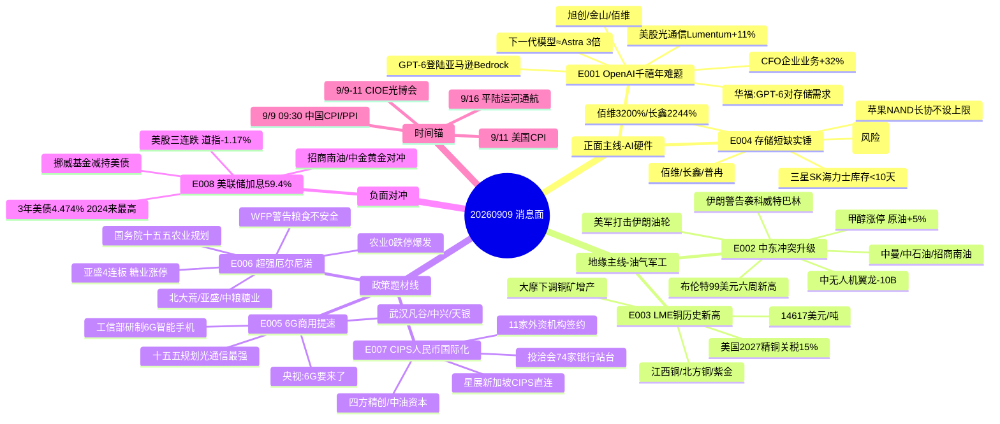

# 2026-09-09 · **消息面事件驱动**

> **数据源新鲜度**: ok · **降级状态**: false · **置信度**: 0.66
> **覆盖窗口**: 前 72h(09-06 ~ 09-09) · **主源**: 财联社快讯(news_cls 2421 条) + 5 焦点群(364 条) + 东财中报预告(500 条) + news_major(800 条) + tushare 9/8 日线
> **注意**: 公众号三刀源为**用户主动取消**(2026-08-20),非抓取失败;weflow down 仅影响 R3,不阻断 R4

## 一句话结论

今日消息面 = **地缘油价(油气/油运/军工)+ 存储短缺 + 铜价新高 + AI(OpenAI下一代模型)** 四线为主攻,辅以 **6G商用 + 厄尔尼诺农业 + CIPS人民币国际化** 三条题材线,**唯一宏观负面对冲是美联储9月加息概率59.4% + 美股三连跌**;情绪低位试错,候选按分歧低吸,高位连板不追。

## 🗺️ 消息面全景图

## 🎯 顶级事件详解(每事件三问 + 首推票思维链)

### E20260909_001 · OpenAI千禧年数学难题 + 下一代模型 · strength=high · polarity=正面

**事件摘要**: OpenAI 88小时攻克千禧年数学难题之一"纳维-斯托克斯方程",首次披露下一代内部模型通过率最高近48%、约为GPT-6 Astra最强表现的近3倍;同日 GPT-6 Astra 登陆亚马逊 Bedrock、ChatGPT Images 2.5 发布、OpenAI企业业务环比+32%;Meta推出个人AI智能体Muse;三星领投 Mistral AI D轮(估值240亿美元)。6 独立源(4 news_cls/news_major + 华福AI互联网 + 群聊)。美股光通信领涨(Lumentum +11%/康宁 +7%/Coherent +7%)为海外映射实锤。

**推理深度三问**:
- **大资金意图**: OpenAI 是 A 股 AI 主线叙事的总开关。千禧年难题 + 下一代模型不是单纯新闻,而是把"GPT-6 后还有大升级"做成**预期接力**——大资金需要新催化来继续持有高位算力硬件,而"更强调推理侧 + Agent 化"精准指向存储/光模块/软件这三条 A 股能落地的链。企业业务 +32% 是商业化放量实锤,估值锚从"炒概念"切到"炒兑现"。
- **为什么走强**: 三段式共振——模型能力(下一代 3 倍)+ 生态扩展(Bedrock/Images 2.5)+ 商业数据(企业 +32%);美股光通信大涨是**隔夜最直接的资金投票**,A 股 9/9 光模块/存储大概率高开。
- **逻辑够不够硬**: **硬**。OpenAI 官方发布 + CFO 数据 + 美股产业链验证,都是可证事实;华福 AI 互联网 09-08 早 8 点专题《GPT-6 Astra 对存储的需求》把逻辑链补全(长上下文/KV Cache/推理存储)。弱点是算力硬件本身已在高位(旭创 902 元),消息面越热兑现盘越重。

**首推票思维链**:

#### 中际旭创 300308.SZ · role=首推·光模块龙头
- **买入理由**: 全球光模块龙头,GPT-6 Agent 化推理提升 1.6T/3.2T 需求;美股 Lumentum +11%/康宁 +7% 隔夜映射;9/9-11 CIOE 光博会为时间锚;9/8 逆势收涨 0.44%
- **风险点**: 902 元/万亿市值高位,日成交巨大,波动剧烈;追高吃面风险
- **止损条件**: 破 821.16(9/8 收盘 902.37 × 0.91)止损 · 以买入价 -5~-10% 为最终基准
- **可验证假设**: 若开盘 30 分钟光模块板块主力净流入 ≤ 0 或旭创冲高回落 → 当日回避

#### 金山办公 688111.SH · role=次选·AI办公
- **买入理由**: WPS AI + 文档智能体,GPT-6 Astra 长程 Agent 能力直接受益;亚马逊拓展 ChatGPT Work 企业插件(WPS 是核心办公场景)
- **风险点**: 9/8 科创50 回调 -1.52%,AI 应用跟跌,软件弹性弱于硬件
- **止损条件**: 破 214.10(235.27 × 0.91)止损
- **可验证假设**: 若 AI 应用板块不跟 OpenAI 催化走强 → 逻辑未兑现,减仓

#### 佰维存储 688525.SH · role=弹性·存储
- **买入理由**: 存储模组 + 先进封测,GPT-6 长上下文提升推理侧存储需求;中报净利预增 **3200.15%~3421.59%**(东财)双因子
- **风险点**: 科创板 20cm 波动,存储高位回调快
- **止损条件**: 破 201.57(221.50 × 0.91)止损
- **可验证假设**: 若存储板块(三星/海力士库存不足 10 天)走弱 → 离场

---

### E20260909_002 · 中东冲突升级 + 油价六周新高 · strength=high · polarity=负面(地缘)

**事件摘要**: 美军打击伊朗哈尔克岛/贾斯克附近目标(含油轮),伊朗革命卫队警告袭击科威特及巴林港口油轮并令船员撤离;美中央司令部称摧毁 5 艘伊朗原油运输船;布伦特触及 99 美元创六周新高,收盘 WTI 93.03(+1.69%)/布伦特 97.92(+0.95%);9/8 期货甲醇涨停、原油 +5%,A 股油气/石化涨停潮(华锦股份/石化机械/中曼石油);胡塞武装宣布对沙特大规模军事行动,中无人机翼龙-10B(沙特第一款隐身战机)受央视石锤。7 独立源。

**推理深度三问**:
- **大资金意图**: 这是**供给收缩 + 地缘溢价**双驱动的大宗主线。美国对伊朗"经济绞杀"(击沉/瘫痪油轮)是明牌,伊朗报复威胁科威特/巴林港口 = 霍尔木兹物流进一步承压;大资金在油价上做**确定性多头**(高盛上调油价预测、美银行警告冲突升级油价可至 120-150 美元),A 股映射油气/油运/军工三分支。
- **为什么走强**: 9/8 已现盘面实锤——油气涨停潮 + 甲醇涨停 + 原油期货 +5%,这不是预期而是**正在发生的行情**;隔夜冲突再度升级(美军打击油轮)提供第二段催化。
- **逻辑够不够硬**: **硬**。冲突有军事行动实锤 + 油价有期货/现货数据 + A 股有涨停盘面,三层都是客观事实。弱点是**地缘缓和即是利空**(若美伊谈判/阿曼协议出现,油气/油运瞬间回撤)。

**首推票思维链**:

#### 中曼石油 603619.SH · role=首推·油服弹性
- **买入理由**: 油气开采 + 油服,9/8 涨停 +9.98% 是油服弹性龙头,油价 93 美元中枢下业绩弹性大
- **风险点**: 已涨停,若今日高开冲高追入风险大;地缘缓和即回撤
- **止损条件**: 破 22.66(24.90 × 0.91)止损 · 涨停板追高需等分歧
- **可验证假设**: 若油价夜盘回落 >1% 或伊朗/美国释放缓和信号 → 当日回避

#### 中国石油 601857.SH · role=中军·油权重
- **买入理由**: 油气开采绝对权重,油价 93 美元中枢下业绩弹性;9/8 收涨 2.54%,机构增配有金属同源
- **风险点**: 权重股弹性小,只适合波段
- **止损条件**: 破 10.28(11.30 × 0.91)止损
- **可验证假设**: 若油价日内走弱但中石油不补跌 → 中军稳住可持有

#### 招商南油 601975.SH · role=对冲·油运
- **买入理由**: 油运龙头,霍尔木兹封锁运距拉长 + 运价上行,地缘溢价 + 避险双属性;9/8 收涨 4.72%
- **风险点**: 纯事件驱动,地缘缓和即回撤
- **止损条件**: 破 4.24(4.66 × 0.91)止损
- **可验证假设**: 若伊朗与科威特/巴林港口事态平息 → 逻辑证伪离场

#### 中无人机 688297.SH · role=弹性·军工无人机
- **买入理由**: 翼龙-10B 为沙特空军第一款隐身战机(央视石锤),胡塞武装对沙特军事行动直接催化军工无人机
- **风险点**: 题材脉冲,持续性依赖地缘
- **止损条件**: 破 40.85(44.89 × 0.91)止损
- **可验证假设**: 若军工板块整体不跟 → 单票无合力,剔除

---

### E20260909_003 · LME铜历史新高 + 全球抢铜潮 · strength=high · polarity=正面

**事件摘要**: LME 三个月期铜 9/7 创历史新高、9/8 亚洲时段续涨至 14617 美元/吨;驱动 = 美国 2027 年 1 月精炼铜加征 15% 关税预期 + 智利出口一年低点 + 大摩下调铜矿增产预期(全球产出或现 2017 年来首次年度下滑);9/8 A 股铜板块集体暴动(北方铜业涨停/江西铜业 +5.45%),21 家铜产业链公司上半年净赚超 627 亿;公募权益基金增配有金属。5 独立源。

**推理深度三问**:
- **大资金意图**: 铜是"**关税 + 供给收缩 + 再通胀**"三逻辑共振的大宗之王。美国关税扩至精铜 + 智利出口低点 + 大摩减产预期 = 供给端三重紧,资金把铜当抗通胀硬资产配置;A 股铜板块 9/8 已暴动 = 资金提前进场。
- **为什么走强**: LME 创历史新高是**客观价格事实**;铜流向美国(跨太平洋抢铜潮)是贸易流实锤;公募增配有金属 = 机构资金背书。
- **逻辑够不够硬**: **硬**。价格创新高 + 基本面(智利/大摩)支撑 + 资金验证三重确认。弱点是关税是预期炒作,政策反复会带来回撤。

**首推票思维链**:

#### 江西铜业 600362.SH · role=首推·铜龙头
- **买入理由**: 铜矿 + 冶炼一体化龙头,LME 铜价历史新高直接受益;9/8 收涨 5.45% 领涨权重
- **风险点**: 高位波动,若铜价夜盘回落联动
- **止损条件**: 破 44.16(48.53 × 0.91)止损
- **可验证假设**: 若 LME 铜夜盘回落 >1% → 当日回避

#### 北方铜业 000737.SZ · role=弹性·铜矿
- **买入理由**: 纯铜矿标的,9/8 涨停 +9.63%,铜价弹性最大
- **风险点**: 已涨停,追高风险
- **止损条件**: 破 14.30(15.71 × 0.91)止损 · 涨停后分歧低吸
- **可验证假设**: 若高开冲高无封板 → 兑现盘出货,不追

#### 紫金矿业 601899.SH · role=中军·铜金
- **买入理由**: 全球铜金龙头,9/8 收涨 3.01%,公募增配标的
- **风险点**: 权重弹性小
- **止损条件**: 破 30.81(33.86 × 0.91)止损
- **可验证假设**: 若铜板块强度维持但紫金相对走弱 → 换手不足离场

---

### E20260909_004 · 存储供应短缺实锤 + 苹果NAND长协 · strength=high · polarity=正面

**事件摘要**: 韩国券商 KB 称存储芯片严重供应短缺,三星/SK海力士库存已不足 10 天、明年实际可售供应明显不足;苹果罕见签下 NAND 长期供应协议(不设价格上限),据传对手方为铠侠、协议期 3-5 年;业绩硬 alpha:佰维存储中报预增 3200.15%~3421.59%、普冉 2977%、长鑫 2244.03%~2544.19%。风险面:江波龙港股(09976)上市首日破发 + A 股 358 元与定增价倒挂(公募浮亏 3600 万)引热议。5 独立源。

**推理深度三问**:
- **大资金意图**: 存储是"**涨价 + 业绩兑现**"双引擎,与 09-08 主线一脉相承。库存不足 10 天 = 现货端事实,苹果 NAND 长协不设价格上限 = 大客户锁定涨价持续性的**最强背书**;业绩预告(佰维 3200%)把"涨价的票 + 业绩的票"做成同一只票。
- **为什么走强**: 供应短缺(韩媒/券商)+ 长协(苹果)+ 业绩(东财)三源共振,且与 E001(GPT-6 存储需求)形成**双事件叉乘**——存储既吃 AI 推理需求又吃供给短缺。
- **逻辑够不够硬**: **硬**。供给有库存数据、需求有苹果长协、业绩有预告数字,都是可证事实。弱点是板块已连续走强,江波龙破发/定增倒挂提示**高位分歧**。

**首推票思维链**:

#### 佰维存储 688525.SH · role=首推·存储模组
- **买入理由**: 存储模组 + 先进封测,中报净利预增 **3200.15%~3421.59%** 为存储链业绩弹性最大标的;与 E001 GPT-6 存储需求双事件共振
- **风险点**: 科创板 20cm 波动,情绪退潮回撤快
- **止损条件**: 破 201.57(221.50 × 0.91)止损
- **可验证假设**: 若存储板块强度维持但佰维相对走弱 → 换手不足离场

#### 长鑫科技 688825.SH · role=次选·DRAM龙头
- **买入理由**: 国内 DRAM 唯一自主可控标的,中报净利预增 **2244.03%~2544.19%**;国产替代 + 涨价双逻辑
- **风险点**: 58 元已高位,追高需分歧
- **止损条件**: 破 53.13(58.39 × 0.91)止损
- **可验证假设**: 若 DRAM 现货价未持续上行 → 逻辑弱化

#### 普冉股份 688766.SH · role=弹性·NOR
- **买入理由**: NOR Flash + EEPROM,中报净利预增 2977%,存储链业绩弹性标的
- **风险点**: 401 元高价股,20cm 波动
- **止损条件**: 破 365.18(401.30 × 0.91)止损
- **可验证假设**: 若存储板块整体走强但普冉滞涨 → 高估兑现,离场

---

### E20260909_005 · 6G商用提速 + 低轨卫星互联网 · strength=high · polarity=正面

**事件摘要**: 工信部明确"提升低轨卫星互联网能力、突破星载通信设备、研制 6G 智能手机、适时启动 6G 商用";央视报道"6G 智能手机,要来了";信息通信业"十五五"规划出炉、机构称光通信确定性最强;9/8 A 股 002579 一分钟涨停引爆 6G 题材,武汉凡谷涨停(+10.03%)、通宇通讯 +5.26%;群聊深挖天银机电(星敏器市占率 80%+/太赫兹芯片批量出货)。5 独立源。

**推理深度三问**:
- **大资金意图**: 6G 是**政策时间锚 + 题材扩散**。工信部把"研制 6G 智能手机、适时启动 6G 商用"写进官方口径 = 从"概念"升级为"规划",资金在通信/射频/卫星里找低位补涨(此前 6G 涨幅落后于 AI 算力)。
- **为什么走强**: 央视 + 工信部 + 十五五规划三官方源同日密集出,叠加 002579 一分钟涨停的**盘面点火**,题材密度极高。
- **逻辑够不够硬**: **中上**。硬在政策官方确认(工信部/央视);弱在 6G 商用是 2027-2030 远期叙事,当前是题材阶段,标的纯度需甄别。

**首推票思维链**:

#### 武汉凡谷 002194.SZ · role=首推·射频滤波器
- **买入理由**: 滤波器/双工器龙头,主供海外设备商,5G-A/6G 基站通道数提升直接受益;9/8 涨停 +10.03% 为 6G 龙头
- **风险点**: 已涨停,追高风险;6G 题材一日游风险
- **止损条件**: 破 10.08(11.08 × 0.91)止损 · 涨停后分歧低吸
- **可验证假设**: 若 6G 板块无持续资金跟进 → 题材兑现离场

#### 中兴通讯 000063.SZ · role=中军·6G主设备
- **买入理由**: 6G 主设备商龙头,工信部商用规划直接受益,中军权重稳
- **风险点**: 权重弹性小
- **止损条件**: 破 30.22(33.21 × 0.91)止损
- **可验证假设**: 若通信板块整体走强但中兴不动 → 中军无合力

#### 天银机电 300342.SZ · role=弹性·卫星载荷
- **买入理由**: 星敏器市占率超 80%,太赫兹芯片批量出货,低轨卫星 + 6G 双属性
- **风险点**: 题材脉冲
- **止损条件**: 破 29.54(32.46 × 0.91)止损
- **可验证假设**: 若卫星互联网板块不跟 → 单票弱,剔除

#### 中国卫通 601698.SH · role=次选·卫星互联网
- **买入理由**: 卫星运营龙头,低轨卫星互联网能力提升直接受益
- **风险点**: 卫星题材容量小
- **止损条件**: 破 22.06(24.24 × 0.91)止损
- **可验证假设**: 若低轨卫星政策无后续 → 题材降温离场

---

### E20260909_006 · 超强厄尔尼诺 + 全球粮食安全 · strength=high · polarity=正面

**事件摘要**: 世界气象组织确认厄尔尼诺已形成并将持续增强、预计发展为超强级别;世界粮食计划署警告将加剧全球突发性粮食不安全;9/8 A 股农业板块"0 跌停"爆发(亚盛集团 4 连板/播恩集团 3 连板/敦煌种业/中粮糖业/南宁糖业涨停),超级厄尔尼诺引爆糖业股涨停潮;国务院印发《加快农业农村现代化"十五五"规划》;六部门完善乡村振兴投入机制、支持涉农企业上市融资;燕麦/番茄涨价预期升温。6 独立源。

**推理深度三问**:
- **大资金意图**: "**供给收缩 + 涨价兑现**"的确定性叙事——厄尔尼诺是天气驱动的供给刚性收缩,粮价/糖价有期货和机构预测先行确认;乡村振兴政策(涉农企业上市)提供政策背书,资金把农业当"滞涨 + 低位"补涨方向。
- **为什么走强**: 9/8 已现"0 跌停"盘面实锤——亚盛 4 连板、糖业涨停潮,这是**正在进行的行情**而非预期;WFP 警告 + 国务院规划提供官方背书。
- **逻辑够不够硬**: **中上**。硬在盘面(0 跌停)+ 官方源(国务院/WFP);弱在 A 股农业标的多为小盘题材,业绩弹性需等 Q3 财报,且高位连板(亚盛 4 板)分化风险大。

**首推票思维链**:

#### 北大荒 600598.SH · role=首推·粮食种植
- **买入理由**: 粮食种植龙头,厄尔尼诺减产预期 + 粮食安全直接受益;9/8 收涨 5.63% 中军定位,比 4 连板亚盛更稳
- **风险点**: 种植弹性小于题材龙头
- **止损条件**: 破 12.79(14.06 × 0.91)止损
- **可验证假设**: 若厄尔尼诺炒作退潮但北大荒相对抗跌 → 中军守住可持有

#### 亚盛集团 600108.SH · role=龙头·4连板
- **买入理由**: 农业种植 + 乡村振兴,9/8 4 连板封死为板块高度龙头,厄尔尼诺题材总龙
- **风险点**: **高位 4 连板**,若高开无封板则兑现盘出货;农业题材波动大
- **止损条件**: 破 4.80(5.28 × 0.91)止损 · 高位龙头仅分歧低吸不追板
- **可验证假设**: 若明日竞价不及预期或农业板块整体分歧 → 龙头退潮,不参与

#### 中粮糖业 600737.SH · role=次选·糖业龙头
- **买入理由**: 糖业龙头,泰国糖减产 17% + 厄尔尼诺糖价上行预期;9/8 涨停 +9.99%
- **风险点**: 已涨停,糖价上行需现实跟进(业内:强预期先行,现实待跟进)
- **止损条件**: 破 16.53(18.16 × 0.91)止损 · 涨停后分歧低吸
- **可验证假设**: 若国际糖价(纽约原糖)回落 → 逻辑弱化,离场

---

### E20260909_007 · CIPS人民币跨境支付 11家外资签约 · strength=medium · polarity=正面

**事件摘要**: 新闻联播报道 CIPS 跨境支付系统 **11 家外资机构签约**、人民币结算国际化开始;CIPS 首次登陆国家级投洽会、74 家全球银行站台;星展银行推出新加坡 CIPS 直连服务;数字人民币跨境服务亮相投洽会;杭州银行打通 CIPS 直联"高速路"。6 独立源(新闻联播官方 + 投洽会 + 群聊共振)。

**推理深度三问**:
- **大资金意图**: 人民币国际化是**中长期政策主线**,CIPS 外资签约 = 跨境支付基础设施从"建设"走向"放量",是题材 + 政策共振的低位补涨方向(板块此前涨幅有限)。
- **为什么走强**: 新闻联播级报道 + 投洽会 74 家银行站台 = 官方背书实锤;群聊"风中追风"高频共振(单人多源但已被官方源确认)。
- **逻辑够不够硬**: **中上**。硬在官方源(新闻联播/投洽会);弱在题材容量小、A 股纯正标的少(四方精创/中油资本),跟风票易一日游。

**首推票思维链**:

#### 四方精创 300468.SZ · role=首推·CIPS技术
- **买入理由**: CIPS 跨境支付系统核心技术服务商,11 家外资签约直接受益;25.3 元低位,题材容量小但纯度最高
- **风险点**: 题材容量小,若板块一日游回撤快
- **止损条件**: 破 23.02(25.30 × 0.91)止损
- **可验证假设**: 若跨境支付板块开盘无资金进场 → 事件逻辑未兑现,不参与

#### 中油资本 000617.SZ · role=次选·昆仑银行CIPS直参
- **买入理由**: 昆仑银行为 CIPS 直接参与者,人民币国际化 + 中字头金融受益;9/8 收涨 1.83%
- **风险点**: 金融权重弹性小
- **止损条件**: 破 6.60(7.25 × 0.91)止损
- **可验证假设**: 若人民币跨境支付概念整体走弱 → 离场

#### 京北方 002987.SZ · role=弹性·银行IT
- **买入理由**: 银行 IT 龙头,CIPS 系统建设与运营改造受益
- **风险点**: 银行 IT 弹性一般
- **止损条件**: 破 10.75(11.81 × 0.91)止损
- **可验证假设**: 若 CIPS 题材不扩散至金融科技 → 单票弱

---

### E20260909_008 · 美联储9月加息59.4% + 美股三连跌 · strength=medium · polarity=负面

**事件摘要**: CME 美联储观察:9 月加息 25bp 概率 **59.4%**;美股三大指数集体收跌(道指 -1.17%/标普 -0.58%/纳指 -0.31%);美国 3 年期美债拍卖中标收益率 4.474% 创 2024 年 6 月以来最高;挪威主权财富基金拟大幅减持美债;日本抛售美债救日元、8 月外储降幅刷新纪录;富国银行:周五 CPI 或决定下周决策。5 独立源。

**推理深度三问**:
- **大资金意图**: 加息概率 59.4% + 美债 4.474% 是**全球成长股估值的系统性压力**;挪威基金减持美债 + 日本抛美债 = 美债供需恶化,长端利率难下。大资金在"贵金属 + 油运 + 高股息"做防御,在成长股降杠杆。
- **为什么走强**: 这是 9 月初"非农超预期 → 加息预期升温"链条的延续(9/7 非农 16.2 万远超预期),非单日消息;3 年美债拍卖收益率创新高是**最新证据**。
- **逻辑够不够硬**: **硬**。CME 概率 + 美债拍卖 + 美股收盘都是硬数据。这是 R4 今日唯一宏观负面,必须写进 D1 风控——**对高位科技股(旭创/长鑫/佰维)是估值压制项**。

**首推票思维链**(负面对冲分支,仅观察/小仓位):

#### 招商南油 601975.SH · role=对冲·油运
- **买入理由**: 油运龙头,地缘溢价 + 利率避险双对冲;与 E002 共振
- **风险点**: 纯事件驱动
- **止损条件**: 破 4.24(4.66 × 0.91)止损
- **可验证假设**: 若中东局势缓和 + 油价回落 → 逻辑双证伪,离场

#### 中金黄金 600489.SH · role=对冲·黄金
- **买入理由**: 黄金央企龙头,加息预期下金价承压但避险需求托底
- **风险点**: 金价 9/8 已回调 -1.06%,加息落地前黄金偏弱
- **止损条件**: 破 22.93(25.20 × 0.91)止损
- **可验证假设**: 若金价跌破 4350 关键位 → 对冲失效,离场

## 📊 板块 × 事件热力矩阵

| 板块 | 事件锚 | 首推龙头 | 独立源数 | 中报预告 | 净综合置信 |
|------|--------|----------|----------|----------|:--:|
| AI算力/光模块 | E001 OpenAI千禧年难题 | 中际旭创 | 6 | — | 🟢🟢🟢 |
| 存储/DRAM/HBM | E001+E004 短缺+GPT-6 | 佰维存储 | 6 | 佰维3200%/长鑫2244% | 🟢🟢🟢 |
| 油气/石化 | E002 中东冲突+油价99 | 中曼石油 | 7 | — | 🟢🟢🟢 |
| 油运 | E002+E008 地缘+避险 | 招商南油 | 5 | — | 🟢🟢🟡 |
| 军工/无人机 | E002 胡塞+翼龙-10B | 中无人机 | 3 | — | 🟢🟢🟡 |
| 铜/有色 | E003 LME 14617新高 | 江西铜业 | 5 | — | 🟢🟢🟢 |
| 6G/通信 | E005 工信部+央视 | 武汉凡谷 | 5 | — | 🟢🟢🟡 |
| 卫星互联网 | E005 低轨卫星 | 中国卫通 | 3 | — | 🟢🟡 |
| 农业/种植 | E006 厄尔尼诺+0跌停 | 北大荒 | 6 | — | 🟢🟢🟢 |
| 糖业 | E006 泰国减产+糖涨停 | 中粮糖业 | 4 | — | 🟢🟢🟡 |
| 跨境支付/金融科技 | E007 CIPS 11家签约 | 四方精创 | 6 | — | 🟢🟢🟡 |
| 海外利率敏感成长股 | E008 加息59.4% | (对冲)招商南油/中金黄金 | 5 | — | 🔴 |

## 🔥 中报业绩预告命中(硬 alpha 交叉验证)

从 `eastmoney_earnings_predict`(2026H1,500 条)提取与今日事件板块交集:

| 代码 | 名称 | 预告类型 | 增速下限-上限 | 事件命中 | 逻辑强度 |
|------|------|----------|--------------|----------|:--:|
| 688525.SH | 佰维存储 | 预增 | 3200.15%~3421.59% | E001+E004 存储 | 🟢🟢🟢 |
| 688825.SH | 长鑫科技 | 预增 | 2244.03%~2544.19% | E004 存储 | 🟢🟢🟢 |
| 688766.SH | 普冉股份 | 预增 | 2976.99% | E004 存储 | 🟢🟢🟢 |
| 300502.SZ | 新易盛 | 预增 | 77.56%~102.93% | E001 光模块(相关性) | 🟢🟢 |
| 300394.SZ | 天孚通信 | 预增 | 25.56%~48.02% | E001 光模块(相关性) | 🟢🟢 |
| 688041.SH | 海光信息 | 预增 | 41.5%~52.32% | E001 AI算力(相关性) | 🟢🟢 |

**注**: 佰维/长鑫/普冉三票既是事件催化又是业绩硬 alpha,是 D1 的**双因子优先池**。

## 关键证据

- 证据 1: OpenAI 内部模型 88 小时攻克纳维-斯托克斯方程,下一代模型通过率最高近 48% 约为 Astra 3 倍 · 来源 news_cls/新浪 · 2026-09-09 04:53
- 证据 2: GPT-6 Astra 登陆亚马逊 Bedrock / ChatGPT Images 2.5 / 企业业务环比 +32% · 来源 news_cls+news_major · 2026-09-09 04:35-06:20
- 证据 3: 美军打击伊朗哈尔克岛/贾斯克附近目标(含油轮),摧毁 5 艘伊朗原油运输船 · 来源 news_cls/央视 · 2026-09-09 04:32-06:17
- 证据 4: 伊朗革命卫队警告袭击科威特及巴林港口油轮、船员撤离 · 来源 news_cls/央视 · 2026-09-09 04:06
- 证据 5: 布伦特触及 99 美元创六周新高,收盘 WTI 93.03(+1.69%) · 来源 news_cls · 2026-09-09 04:02
- 证据 6: LME 三个月期铜 14617 美元/吨创历史新高,美国 2027 年精铜关税 15% 预期 · 来源 news_cls · 2026-09-08 23:23
- 证据 7: 大摩下调铜矿增产预期,全球产出或现 2017 年来首次年度下滑 · 来源 news_major · 2026-09-09 00:16
- 证据 8: 韩国券商 KB: 三星/SK海力士存储库存不足 10 天 · 来源 news_cls/上证报 · 2026-09-08 04:19
- 证据 9: 苹果罕见签下 NAND 长期供应协议(不设价格上限) · 来源 news_major · 2026-09-08 17:19
- 证据 10: 工信部:研制 6G 智能手机、适时启动 6G 商用 + 央视"6G 智能手机要来了" · 来源 群聊+央视 · 2026-09-08 09:39/12:30
- 证据 11: 世界气象组织确认超强厄尔尼诺 + WFP 警告粮食不安全 · 来源 人民财讯 · 2026-09-08 10:49
- 证据 12: 9/8 A 股农业"0 跌停"、亚盛集团 4 连板、糖业涨停潮 · 来源 news_cls · 2026-09-08 15:22
- 证据 13: CIPS 跨境支付系统 11 家外资机构签约(新闻联播) · 来源 群聊 · 2026-09-08 21:54
- 证据 14: CME 美联储 9 月加息概率 59.4% + 3 年美债 4.474% 创 2024 年 6 月来最高 · 来源 news_cls · 2026-09-09 06:14/01:31
- 证据 15: 佰维 3200%~3421% / 长鑫 2244%~2544% / 普冉 2977% 中报预增 · 来源 东财 earnings_predict · 2026-07-16/24

## 数据源审计

| 源 | 日期 | 状态 | 备注 |
|---|---|:--:|---|
| tushare/news_cls | 2026-09-09 | 🟢 | 2421 条·72h 回看 |
| tushare/news_major | 2026-09-09 | 🟢 | 800 条 |
| eastmoney/earnings_predict | 2026-09-09 | 🟢 | 500 条 · 2026H1 |
| wechat_cli_5groups | 2026-09-09 | 🟢 | 364 条 · 5 焦点群(匿名) |
| wechat_official_sanji | 2026-09-09 | ⚪ | 用户主动禁用(2026-08-20) |
| tushare_daily | 2026-09-08 收盘 | 🟢 | 5549 条 · 止损价计算 |
| weflow | 2026-09-09 | 🔴 | 404,仅影响 R3 |
| xtick/hot_news | — | ⚪ | 未用,fetch 层 news_cls 已覆盖 |

## 不确定性 / 反证

1. **高位硬件兑现风险**: 光模块/存储/铜都已在相对高位(旭创 902、长鑫 58、江波龙 358),消息面越热兑现盘越重;E001/E003/E004 必须按"分歧低吸"而非"追高"执行
2. **江波龙破发 + 定增倒挂**: 港股 09976 上市首日破发 + A 股 358 元与定增价倒挂(公募浮亏 3600 万),"打折买股难稳赚"讨论升温——存储链高位情绪扰动,相关高位票防分化
3. **地缘缓和风险**: E002 油气/油运/军工全部依赖冲突持续,若美伊谈判/阿曼协议/科威特出口恢复出现,事件逻辑当日证伪(科威特出口已恢复至 2/3 是早期缓和信号)
4. **农业高位连板分化**: 亚盛集团 4 连板为高度龙头,若高开无封板则兑现;燕麦/番茄等为群聊题材,需 news_cls 二次确认
5. **CIPS 题材容量小**: 纯正标的仅四方精创/中油资本,群聊"风中追风"单人多源强情绪,跟风票易一日游
6. **美联储加息是慢变量**: 59.4% 概率的加息预期对成长股是压制而非利空出尽,3 年美债 4.474% 是估值杀手,今日 09:30 中国 CPI/PPI + 社融/M2 发布或对冲;高位科技股若冲高回落要果断减仓
7. **数据源缺失方向**: 无前晚 event-tracker(events_classified)落盘,公司公告层以 news_major 公告精选代偿;vibe-trading/hithink/iwencai 均不可用,个股验证仅本地双源(news+tushare),置信度 0.66 封顶;硅电容/字节 PICO 为群聊多源强情绪但缺独立确认,未进 top_events

## 与其他 R/D/E 的关系

- 依赖: data/raw/20260909/manifest.json、news_cls、news_major、eastmoney_earnings_predict、wechat_cli_5groups、mcp_health、tushare_daily(均 ok)
- 被消费: R2 主线(油气/存储/铜/AI 硬件候选)/ R5 个股画像(佰维/长鑫/旭创等)/ R6 反证(高位硬件兑现+地缘缓和)/ D1 预案(8 事件映射 execution + watch)
- 与 R3: 未落盘,kol_confirm 用群聊关键词频率代偿(农业/油气/存储/6G 共振强烈)

## Sub-Agent 元数据

- skill: analyze_news_impact_v1@1.3
- artifact: data/research/20260909/R4_news.json
- method: llm_v1(硬扩容·五源硬约束·8硬事件聚合+板块极性叉乘·λ=0.15·tushare日线止损校准)
- 生成时刻: 2026-09-09T07:15:00+08:00
