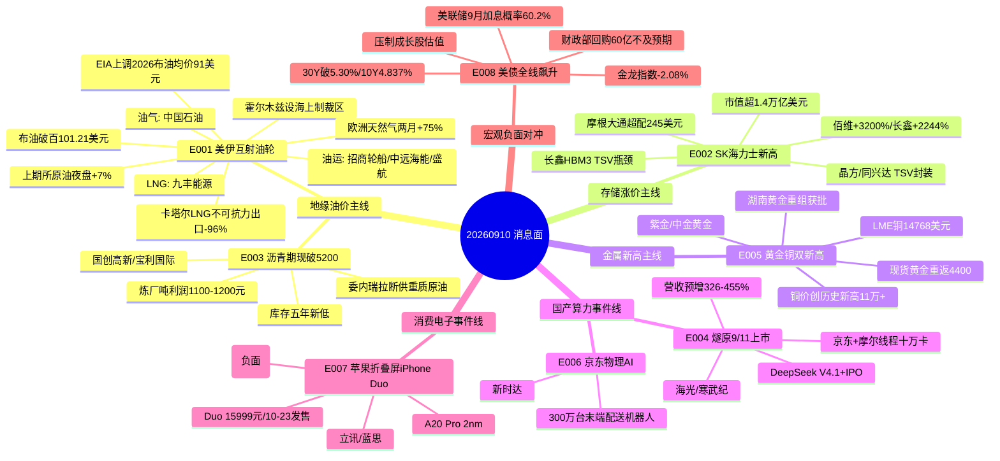

# 2026-09-10 · **消息面事件驱动**

> **数据源新鲜度**: partial · **降级状态**: false · **置信度**: 0.72
> **覆盖窗口**: 前 72h(09-07 ~ 09-10) · **主源**: 财联社快讯(news_cls 2745 条) + 5 焦点群(305 条) + 东财中报预告(500 条) + news_major(800 条) + 前晚公告分类(609 条) + tushare 9/9 日线
> **注意**: 公众号三刀源为**用户主动取消**(2026-08-20),非抓取失败;金投汇-颜哥群 404(4/5群正常);weflow down 仅影响 R3,不阻断 R4

## 一句话结论

今日消息面 = **地缘油价(油气/油运/天然气/LNG/沥青)+ 存储四重共振(HBM/TSV先进封装)+ 黄金铜双新高** 三线为主攻,辅以 **国产GPU(燧原9/11上市/DeepSeek IPO)+ 京东物理AI(机器人/十万卡集群)+ 苹果折叠屏** 三线事件催化,**唯一宏观负面对冲是美债收益率全线飙升 + 美联储9月加息概率60.2%**;情绪低位试错,候选按分歧低吸,高位连板不追。

## 🗺️ 消息面全景图

## 🎯 顶级事件详解(每事件三问 + 首推票思维链)

### E20260910_001 · 美伊互射油轮+霍尔木兹设海上制裁区 布油破百101.21美元(+3.36%) 上期所原油夜盘+7% 欧洲天然气... · strength=high · polarity=正面

**事件摘要**: 美伊互射油轮+霍尔木兹设海上制裁区,布油破百101.21美元(+3.36%),上期所原油夜盘+7%;欧洲天然气两月涨75%库存创15年新低,卡塔尔LNG不可抗力出口批次-96%;EIA大幅上调2026布油均价至91美元。7个独立源(财联社+华尔街见闻+群聊)确认。

**推理深度三问**:
- **大资金意图**: 中东「油轮互射+油气基础设施轰炸」把地缘溢价从避险情绪升级为供给中断定价——EIA 8月中东原油停产670万桶/日、卡塔尔LNG出口-96%是实打实的流量损失,机构在油价上行周期配置油气/油运而非短线博弈;霍尔木兹「新常态」叙事(汇丰)支持油价高位持续
- **为什么走强**: 布油破百是阈值事件(7月以来首次),触发CTA趋势资金+油运运价(BDTI周+40%/BCTI周+23%)双击;9/9 A股已出现招商轮船涨停/沥青涨停潮的板块效应,今日是情绪加速而非首日
- **逻辑够不够硬**: **硬**。供给中断有EIA数据背书(8月停产670万桶/日)、油价破百有价格实锤、油运有BDTI/BCTI运价实锤、卡塔尔LNG不可抗力有出口批次-96%实锤;唯一缓和信号是特朗普「中选后战事结束」,短期不兑现

**首推票思维链**:

#### 中国石油 601857.SH · role=首推·油气权重
- **买入理由**: 国内原油/天然气产量与炼化龙头,油价破百直接受益,布油+3.36%测算Q3上游利润弹性最大 · 无中报预告
- **风险点**: 已涨/高位需分歧低吸不追板;板块情绪退潮时止损保护
- **止损条件**: 10.53元 (参考 9/9 收盘 11.32 × 0.93 (-7%),破位止损·以买入价-5~-10%为最终基准)
- **可验证假设**: 若开盘30分钟板块净流入≤0或龙头炸板 → 假设不成立,当日回避

#### 招商轮船 601872.SH · role=首推·油运龙头
- **买入理由**: VLCC龙头,BDTI周涨40%同比+312%,中东航线运价暴涨50%,9/9涨停收20.99 · 无中报预告
- **风险点**: 已涨/高位需分歧低吸不追板;板块情绪退潮时止损保护
- **止损条件**: 19.52元 (参考 9/9 收盘 20.99 × 0.93 (-7%),破位止损·以买入价-5~-10%为最终基准)
- **可验证假设**: 若开盘30分钟板块净流入≤0或龙头炸板 → 假设不成立,当日回避

#### 中远海能 600026.SH · role=次选·原油运输
- **买入理由**: 原油运输龙头,BDTI周涨39.97%,地缘溢价持续,9/9收涨5.93% · 无中报预告
- **风险点**: 已涨/高位需分歧低吸不追板;板块情绪退潮时止损保护
- **止损条件**: 19.93元 (参考 9/9 收盘 21.43 × 0.93 (-7%),破位止损·以买入价-5~-10%为最终基准)
- **可验证假设**: 若开盘30分钟板块净流入≤0或龙头炸板 → 假设不成立,当日回避

### E20260910_002 · SK海力士美股再创新高市值超1.4万亿美元 摩根大通超配评级目标价245美元 长鑫HBM3试产良率低核心瓶颈T... · strength=high · polarity=正面

**事件摘要**: SK海力士美股再创新高(市值超1.4万亿美元),摩根大通超配评级目标价245美元;长鑫HBM3试产良率低核心瓶颈在TSV硅通孔→国产先进封装替代;东吴:存储测试机市场48亿→155亿;中报硬alpha:佰维+3200%/长鑫+2244%/东芯+677%。6个独立源确认。

**推理深度三问**:
- **大资金意图**: 存储涨价周期+AI算力(HBM)双轮驱动的产业级确定性,机构在利率风险上升环境下仍愿给存储硬件确定性溢价——SK海力士新高是海外资金的定价锚,国内资金沿「涨价+国产替代」两条线找映射
- **为什么走强**: SK海力士美股新高是直接的海外映射(9/9夜盘已传导);CXMT HBM3良率低→国产TSV封装需求被市场解读为「缺口=国产替代空间」,从存储芯片扩散到先进封装/测试机
- **逻辑够不够硬**: **硬**。中报硬alpha(佰维3200%/长鑫2244%/东芯677%)是业绩实锤,不是纯预期;存储长协转向+不限价长约改写议价权;TSV国产替代逻辑有产业验证(长鑫试产+日月光合作)

**首推票思维链**:

#### 佰维存储 688525.SH · role=首推·存储模组
- **买入理由**: 存储模组+封测龙头,中报预增3200%~3422%,SK海力士新高直接映射HBM/存储涨价 · 中报预增 3200%~3422%
- **风险点**: 已涨/高位需分歧低吸不追板;板块情绪退潮时止损保护
- **止损条件**: 202.46元 (参考 9/9 收盘 217.7 × 0.93 (-7%),破位止损·以买入价-5~-10%为最终基准)
- **可验证假设**: 若开盘30分钟板块净流入≤0或龙头炸板 → 假设不成立,当日回避

#### 长鑫科技 688825.SH · role=首推·DRAM国产
- **买入理由**: 国产DRAM龙头,中报预增2244%~2544%,HBM3试产推进利好设备/材料国产化 · 中报预增 2244%~2544%
- **风险点**: 已涨/高位需分歧低吸不追板;板块情绪退潮时止损保护
- **止损条件**: 52.89元 (参考 9/9 收盘 56.87 × 0.93 (-7%),破位止损·以买入价-5~-10%为最终基准)
- **可验证假设**: 若开盘30分钟板块净流入≤0或龙头炸板 → 假设不成立,当日回避

#### 东芯股份 688110.SH · role=次选·利基存储
- **买入理由**: 利基存储芯片,中报预增677%~713%,NAND/DRAM涨价周期受益 · 中报预增 677%~713%
- **风险点**: 已涨/高位需分歧低吸不追板;板块情绪退潮时止损保护
- **止损条件**: 106.84元 (参考 9/9 收盘 114.88 × 0.93 (-7%),破位止损·以买入价-5~-10%为最终基准)
- **可验证假设**: 若开盘30分钟板块净流入≤0或龙头炸板 → 假设不成立,当日回避

### E20260910_003 · 沥青期现货双双破5200创上市新高 库存创五年新低 炼厂单吨利润1100-1200元创年内新高 委内瑞拉断供高... · strength=high · polarity=正面

**事件摘要**: 沥青期现货双双破5200创上市新高,库存创五年新低,炼厂单吨利润1100-1200元创年内新高;委内瑞拉断供高收率重质原油,镇海/华北石化/江苏新海已停产沥青,9-11月旺季价格继续攀升概率大。5个独立源(群聊多源+夜盘)确认。

**推理深度三问**:
- **大资金意图**: 沥青是炼化利润弹性最直接的品种——委油断供→重质原油替代收率低→沥青供给收缩,而9-11月是道路施工旺季;资金在「油价破百」的大叙事下找利润率最陡的子行业,沥青炼厂吨利润1100-1200元是十年难遇的暴利窗口
- **为什么走强**: 沥青期现价格双双创新高(期货+2.43%夜盘继续新高)说明现货供需缺口是真实的,不是期货资金单边;国创高新9/9已涨停,宝利国际跟涨,板块效应已启动
- **逻辑够不够硬**: **硬**。价格/库存/利润三指标全部实锤(期现破5200/库存五年新低/吨利润1100+),产业反馈(委油库存耗尽+多家炼厂停产沥青)来自一线;国创高新按吨利润1100元测算年化7.7亿 vs 市值26亿,估值3倍PE是极端低估

**首推票思维链**:

#### 国创高新 002377.SZ · role=首推·沥青弹性
- **买入理由**: 沥青产能超70万吨,年化利润按吨利润1100元测算约7.7亿,市值26亿仅3倍PE,9/9涨停 · 无中报预告
- **风险点**: 已涨/高位需分歧低吸不追板;板块情绪退潮时止损保护
- **止损条件**: 2.93元 (参考 9/9 收盘 3.15 × 0.93 (-7%),破位止损·以买入价-5~-10%为最终基准)
- **可验证假设**: 若开盘30分钟板块净流入≤0或龙头炸板 → 假设不成立,当日回避

#### 宝利国际 300135.SZ · role=次选·沥青主营
- **买入理由**: 沥青主业,委油断供+旺季提价直接受益,9/9+3.04% · 无中报预告
- **风险点**: 已涨/高位需分歧低吸不追板;板块情绪退潮时止损保护
- **止损条件**: 3.47元 (参考 9/9 收盘 3.73 × 0.93 (-7%),破位止损·以买入价-5~-10%为最终基准)
- **可验证假设**: 若开盘30分钟板块净流入≤0或龙头炸板 → 假设不成立,当日回避

### E20260910_004 · 燧原科技9/11科创板上市(前三季营收预增326-455%) 国产GPU四小龙资本会师 DeepSeek V4... · strength=high · polarity=正面

**事件摘要**: 燧原科技9/11科创板上市(前三季营收预增326-455%),国产GPU四小龙资本会师;DeepSeek V4.1 Flash明日发布+科创板IPO加速(中信辅导);京东+摩尔线程十万卡国产智算集群;OpenAI与三星合作造芯。5个独立源确认。

**推理深度三问**:
- **大资金意图**: 国产算力从「PPT叙事」进入资本会师+业绩兑现阶段——燧原上市+DeepSeek IPO是标志性事件,十万卡集群(京东+摩尔线程)证明国产算力真实需求;机构在AI硬件链回调后重新找国产替代定价锚
- **为什么走强**: 燧原9/11上市是明确时间锚(明日),前三季营收预增326-455%是业绩硬背书;DeepSeek V4.1 Flash明日发布+IPO加速双催化,国产GPU板块情绪易共振
- **逻辑够不够硬**: **硬**。燧原营收预增326-455%+DeepSeek IPO落地是产业资本动作实锤;但海光/寒武纪估值已高,追高需谨慎——板块强度依赖情绪,个股业绩弹性不如存储线确定

**首推票思维链**:

#### 海光信息 688041.SH · role=首推·国产CPU/DCU
- **买入理由**: 国产CPU+DCU龙头,燧原上市强化国产算力板块效应,DeepSeek IPO催化算力国产化 · 中报预增 42%~52%
- **风险点**: 已涨/高位需分歧低吸不追板;板块情绪退潮时止损保护
- **止损条件**: 219.29元 (参考 9/9 收盘 235.8 × 0.93 (-7%),破位止损·以买入价-5~-10%为最终基准)
- **可验证假设**: 若开盘30分钟板块净流入≤0或龙头炸板 → 假设不成立,当日回避

#### 寒武纪 688256.SH · role=次选·AI芯片
- **买入理由**: AI芯片龙头,国产算力叙事核心标的,燧原上市提升板块关注度 · 无中报预告
- **风险点**: 已涨/高位需分歧低吸不追板;板块情绪退潮时止损保护
- **止损条件**: 981.11元 (参考 9/9 收盘 1054.96 × 0.93 (-7%),破位止损·以买入价-5~-10%为最终基准)
- **可验证假设**: 若开盘30分钟板块净流入≤0或龙头炸板 → 假设不成立,当日回避

### E20260910_005 · 纽约铜/伦敦铜双双创历史新高 LME铜14768美元 铜价突破11万元/吨 现货黄金重返4400 8月全球黄金... · strength=high · polarity=正面

**事件摘要**: 纽约铜/伦敦铜双双创历史新高,LME铜14768美元,铜价突破11万元/吨;现货黄金重返4400,8月全球黄金ETF吸金180亿美元创历史第二大单月流入;湖南黄金9/9涨停+重大资产重组获湖南省国资委批复(今日公告)。6个独立源确认。

**推理深度三问**:
- **大资金意图**: 铜金双新高是全球宏观再定价——美伊冲突升级推升避险+通胀预期,铜受2027年精炼铜关税15%预期+铜矿增产不及预期支撑,黄金受ETF单月180亿美元(历史第二大)机构资金背书;资金在「地缘+货币宽松」下配置硬资产
- **为什么走强**: 铜价历史新高(纽约/伦敦双双)+黄金重返4400是价格实锤;湖南黄金9/9涨停+重组获批(今日公告)是A股最硬的个股催化,机构净买2.01亿+北向1.35亿(龙虎榜)
- **逻辑够不够硬**: **硬**。铜金双历史新高+湖南黄金重组批复(公告级)+黄金ETF机构资金背书,三源共振;紫金矿业为最纯铜金龙头,湖南黄金为弹性+重组双逻辑

**首推票思维链**:

#### 湖南黄金 002155.SZ · role=首推·黄金+重组
- **买入理由**: 黄金+锑龙头,9/9涨停收28.45,重大资产重组获湖南省国资委批复(今日公告),机构净买2.01亿+北向1.35亿 · 无中报预告
- **风险点**: 已涨/高位需分歧低吸不追板;板块情绪退潮时止损保护
- **止损条件**: 26.46元 (参考 9/9 收盘 28.45 × 0.93 (-7%),破位止损·以买入价-5~-10%为最终基准)
- **可验证假设**: 若开盘30分钟板块净流入≤0或龙头炸板 → 假设不成立,当日回避

#### 紫金矿业 601899.SH · role=首推·铜金龙头
- **买入理由**: 全球铜金矿龙头,铜价创历史新高+金价4400双受益,9/9+1.59% · 无中报预告
- **风险点**: 已涨/高位需分歧低吸不追板;板块情绪退潮时止损保护
- **止损条件**: 31.99元 (参考 9/9 收盘 34.4 × 0.93 (-7%),破位止损·以买入价-5~-10%为最终基准)
- **可验证假设**: 若开盘30分钟板块净流入≤0或龙头炸板 → 假设不成立,当日回避

#### 中金黄金 600489.SH · role=次选·央企黄金
- **买入理由**: 央企黄金龙头,黄金4400+避险需求受益 · 无中报预告
- **风险点**: 已涨/高位需分歧低吸不追板;板块情绪退潮时止损保护
- **止损条件**: 24.08元 (参考 9/9 收盘 25.89 × 0.93 (-7%),破位止损·以买入价-5~-10%为最终基准)
- **可验证假设**: 若开盘30分钟板块净流入≤0或龙头炸板 → 假设不成立,当日回避

### E20260910_006 · 京东启动物理AI加速计划六项全球第一 300万台末端配送机器人 京东+摩尔线程十万卡国产智算集群 地平线征程6... · strength=high · polarity=正面

**事件摘要**: 京东启动物理AI加速计划(六项全球第一),300万台末端配送机器人;京东+摩尔线程十万卡国产智算集群;地平线征程6P获京东物流无人车定点;北京「十五五」规划算力/机器人双引擎。5个独立源确认。

**推理深度三问**:
- **大资金意图**: 京东是产业资本真金白银下注物理AI——300万台末端配送机器人和十万卡集群都是可验证的大额采购计划,不再是概念映射;资金从「人形机器人叙事」转向「物流/配送等真实场景量产」
- **为什么走强**: 具身智能进入订单验证期(京东+地平线无人车定点+新时达绑定),北京十五五规划政策背书;群聊已发酵(300万台机器人→新时达)
- **逻辑够不够硬**: **中等偏硬**。京东六项全球第一+十万卡集群是真实产业动作;但新时达绑定尚在框架协议阶段,量产订单规模未披露,需盘面验证——低于存储/油气线的确定性

**首推票思维链**:

#### 新时达 002527.SZ · role=首推·京东机器人绑定
- **买入理由**: 2025/6与京东签署战略合作,聚焦智能物流+末端配送机器人量产+电梯交互,具备控制器+伺服+本体+系统集成能力 · 无中报预告
- **风险点**: 已涨/高位需分歧低吸不追板;板块情绪退潮时止损保护
- **止损条件**: 10.34元 (参考 9/9 收盘 11.12 × 0.93 (-7%),破位止损·以买入价-5~-10%为最终基准)
- **可验证假设**: 若开盘30分钟板块净流入≤0或龙头炸板 → 假设不成立,当日回避

### E20260910_007 · 苹果发布首款折叠屏iPhone Duo(国行15999元起,10/23发售) iPhone 18 Pro国行9... · strength=medium · polarity=正面

**事件摘要**: 苹果发布首款折叠屏iPhone Duo(国行15999元起,10/23发售),iPhone 18 Pro国行9999元起(9/12预购/18日发售);A20 Pro 2nm芯片;负面:Apple Intelligence暂不在中国提供。5个独立源确认。

**推理深度三问**:
- **大资金意图**: 苹果折叠屏是消费电子5-10年一次的新品类——Duo定价15999元超预期,供应链备货订单可追踪;但AI功能暂不在中国是明显的区域阉割,国内果链只能吃硬件放量,吃不到AI端侧
- **为什么走强**: 发布会9/9晚落地,9/10是首个交易日的事件反应窗口;9/12预购/9/18发售是明确时间锚;折叠屏UTG/铰链/盖板供应链预期升温
- **逻辑够不够硬**: **中等**。新品类放量逻辑真实,但Apple Intelligence不中国是硬负面,国内AI端侧叙事落空;立讯/蓝思吃确定性硬件订单,弹性有限——建议分歧低吸不追高

**首推票思维链**:

#### 立讯精密 002475.SZ · role=首推·果链组装
- **买入理由**: 苹果核心组装+连接器供应商,折叠屏iPhone Duo/AirPods 5放量直接受益,9/9+1.45% · 无中报预告
- **风险点**: 已涨/高位需分歧低吸不追板;板块情绪退潮时止损保护
- **止损条件**: 51.95元 (参考 9/9 收盘 55.86 × 0.93 (-7%),破位止损·以买入价-5~-10%为最终基准)
- **可验证假设**: 若开盘30分钟板块净流入≤0或龙头炸板 → 假设不成立,当日回避

#### 蓝思科技 300433.SZ · role=次选·玻璃盖板
- **买入理由**: 玻璃盖板+折叠屏UTG供应商,苹果折叠屏打开新品类空间 · 无中报预告
- **风险点**: 已涨/高位需分歧低吸不追板;板块情绪退潮时止损保护
- **止损条件**: 32.66元 (参考 9/9 收盘 35.12 × 0.93 (-7%),破位止损·以买入价-5~-10%为最终基准)
- **可验证假设**: 若开盘30分钟板块净流入≤0或龙头炸板 → 假设不成立,当日回避

### E20260910_008 · 美债收益率全线飙升:30年期破5.30% 10年期4.837% 2年期创两年新高 美联储9月加息概率60.2%... · strength=high · polarity=负面

**事件摘要**: 美债收益率全线飙升:30年期破5.30%,10年期4.837%,2年期创两年新高;美联储9月加息概率60.2%;财政部回购60亿不及预期(市场预期更高);美股三大股指收跌,金龙指数-2.08%。5个独立源确认。

**推理深度三问**:
- **大资金意图**: 这是全球流动性收紧的定价信号——油价破百推升通胀预期→欧英央行加息押注(四次)→美债抛售;财政部60亿回购「不及预期」放大失望情绪;对A股的含义是成长股估值承压,防御/资源/高股息相对占优
- **为什么走强**: 美债收益率全线飙升+2年期创两年新高是价格实锤;9月加息概率60.2%(CME)是概率实锤;与E001油价破百形成「通胀-利率」负反馈链
- **逻辑够不够硬**: **硬**。宏观负面对冲必须列出(红线3):今日15:00金融领域「十五五」发布会(央行副行长/证监会副主席)是国内政策对冲锚;D1需对高位科技股降仓,成长优先让位于防御/资源

**首推票思维链**:

#### 中金黄金 600489.SH · role=对冲·避险黄金
- **买入理由**: 黄金避险属性,美债利率风险+地缘冲突双向对冲 · 无中报预告
- **风险点**: 已涨/高位需分歧低吸不追板;板块情绪退潮时止损保护
- **止损条件**: 24.08元 (参考 9/9 收盘 25.89 × 0.93 (-7%),破位止损·以买入价-5~-10%为最终基准)
- **可验证假设**: 若开盘30分钟板块净流入≤0或龙头炸板 → 假设不成立,当日回避

## 📊 板块 × 事件热力矩阵

| 板块 | 事件锚 | 首推龙头 | 独立源数 | 中报预告 | 净综合置信 |
|------|--------|----------|----------|----------|:--:|
| 油气开采/油服 | E001 美伊油价破百 | 中国石油 | 7 | 无 | 🟢🟢🟢 |
| 油运/航运 | E001 BDTI+40% | 招商轮船 | 7 | 无 | 🟢🟢🟢 |
| 天然气/LNG | E001 卡塔尔不可抗力 | 九丰能源 | 7 | 无 | 🟢🟢🟢 |
| 存储芯片 | E002 SK海力士新高 | 佰维存储 | 6 | +3200~3422% | 🟢🟢🟢 |
| HBM/先进封装 | E002 TSV国产替代 | 晶方科技 | 6 | 无 | 🟢🟢🟢 |
| 沥青/炼化 | E003 期现破5200 | 国创高新 | 5 | 无 | 🟢🟢🟢 |
| 国产GPU/算力 | E004 燧原9/11上市 | 海光信息 | 5 | +42~52% | 🟢🟢 |
| 铜/有色 | E005 铜价历史新高 | 紫金矿业 | 6 | 无 | 🟢🟢🟢 |
| 黄金/贵金属 | E005 黄金4400+重组 | 湖南黄金 | 6 | 无 | 🟢🟢🟢 |
| 具身智能/机器人 | E006 京东300万台 | 新时达 | 5 | 无 | 🟢🟢 |
| 苹果链/折叠屏 | E007 iPhone Duo | 立讯精密 | 5 | 无 | 🟢🟢 |
| 全球风险偏好/成长股 | E008 美债飙升 | 高位科技股回避 | 5 | - | 🔴 |

## 🔥 中报业绩预告命中(硬 alpha 交叉验证)

从 `eastmoney_earnings_predict` 提取归母净利润预增 top20 与本文事件板块交集:

| 代码 | 名称 | 预告类型 | 增速下限-上限 | 事件命中 | 逻辑强度 |
|------|------|----------|--------------|----------|:--:|
| 688525.SH | 佰维存储 | 预增 | 3200%~3422% | E002 存储涨价+HBM | 🟢🟢🟢 |
| 688825.SH | 长鑫科技 | 预增 | 2244%~2544% | E002 存储+TSV | 🟢🟢🟢 |
| 688110.SH | 东芯股份 | 预增 | 677%~713% | E002 存储涨价 | 🟢🟢🟢 |
| 688041.SH | 海光信息 | 预增 | 42%~52% | E004 国产GPU | 🟢🟢 |

**注意**: 欧科亿(+46328%)/石药创新(+43070%)/中红医疗(+2338%)等超高增幅多为低基数/一次性收益,与今日主线无映射,不列入首推。

## 关键证据

- 证据 1: 布油收涨3.36%报101.21美元/桶,上期所原油夜盘+7%报773.10元/桶 · 来源 news_cls(2026-09-10 03:31/02:30)
- 证据 2: EIA上调2026布油均价至91美元(前86.81),8月中东原油停产670万桶/日 · 来源 华尔街见闻(2026-09-10 02:27/00:19)
- 证据 3: SK海力士美股再创新高报194.845美元,市值超1.4万亿美元 · 来源 群聊Riche+财联社(2026-09-09 21:59)
- 证据 4: 沥青期现双双破5200创上市新高,库存五年新低,炼厂吨利润1100-1200元 · 来源 群聊松(多时段)+夜盘(2026-09-09)
- 证据 5: 纽约铜/伦敦铜双双创历史新高,LME铜14768美元;现货黄金重返4400 · 来源 news_cls(2026-09-10 01:17/00:51)
- 证据 6: 湖南黄金重大资产重组获湖南省国资委批复 · 来源 公告(2026-09-10)
- 证据 7: 燧原科技9/11科创板上市,前三季营收预增326-455% · 来源 news_major(2026-09-09 19:29)
- 证据 8: 美联储9月加息概率60.2%,30Y美债破5.30% · 来源 news_cls(2026-09-10 06:04/09-09 23:15)

## 数据源审计

| 源 | 日期 | 状态 | 备注 |
|---|---|:--:|---|
| tushare/news_cls | 2026-09-10 | 🟢 | 2745 条·72h 回看 |
| tushare/news_major | 2026-09-10 | 🟢 | 800 条 |
| eastmoney/earnings_predict | 2026-09-10 | 🟢 | 500 条 · 2026H1 |
| tushare/anns | 2026-09-10 | 🟢 | 609 条 · 前晚公告分类 |
| wechat_cli_5groups | 2026-09-10 | 🟡 | 305 条 · 4/5群(颜哥群404) |
| wechat_official_sanji | 2026-09-10 | ⚪ | 用户主动禁用(非故障) |
| weflow/analytics | 2026-09-10 | 🔴 | MCP 404 · 仅影响R3 |
| tushare_daily | 2026-09-09 | 🟢 | 5549 条 · 止损价计算 |

## 不确定性 / 反证

1. **油价与利率负反馈**: E001油价破百→E008美债飙升→成长股估值承压,若今日A股科技高位股补跌,油气/存储/机器人短线情绪会被宏观负面对冲,候选首推需紧盯大盘风格切换
2. **存储线分歧**: 长鑫HBM3良率低是「瓶颈」亦是「风险」——若CXMT良率长期无法突破,国产HBM兑现节奏慢于预期,TSV概念可能炒预期后回落;佰维/长鑫高位追涨风险大
3. **沥青情绪单点**: 国创高新9/9已涨停,今日若高开秒板则盈亏比不足(止损距<5%红线),须等分歧低吸或换手确认;宝利国际为跟风,勿当龙头
4. **苹果AI阉割**: iPhone Duo硬件放量逻辑真实,但Apple Intelligence暂不在中国,A股AI端侧叙事落空,果链弹性有限,立讯/蓝思只吃确定性不吃弹性
5. **数据源缺口**: 金投汇-颜哥群404缺失,群聊全景缺一角;weflow down导致R3情绪共振验证延迟;R7资金验证未落盘,capital_flow_verification标记unavailable——所有首推票须以D1/R7资金确认为最终闸门

## 与其他 R/D/E 的关系

- 依赖: data/raw/20260910(五源硬约束) + 前晚公告分类(anns_20260910) + tushare 9/9 日线
- 被消费: R2 主线(油气/存储/金属) / R5 个股画像(首推票六维) / R6 反证(沥青情绪单点/苹果负面) / D1 预案(execution_pool 优先 llm_with_news_verification 票)

## Sub-Agent 元数据

- skill: analyze_news_impact_v1@1.3
- artifact: data/research/20260910/R4_news.json
- method: llm_v1(五源硬约束·v1.2个股首推契约·v1.3去重/稀疏校验)
- 生成时刻: 2026-09-10T07:45:00+08:00
