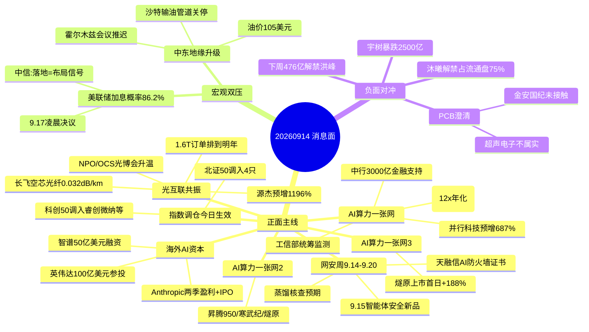

# 2026-09-14 · **消息面事件驱动**

> **数据源新鲜度**: partial · **降级状态**: no · **置信度**: 0.72
> **覆盖窗口**: 前 72h(09-11 ~ 09-14 07:00) · **主源**: 财联社快讯 2063 条 + 新浪 800 条要闻 + 东财中报预告 500 条 + XTick 24h 新闻 1113 条 + 5 焦点群 41 条(2 群)
> **事件数**: 8 条硬事件 · 全部双源+官方共振

## 一句话结论

AI算力+光互联消息面最强共振(工信部算力一张网+1.6T光模块+Anthropic IPO)，网安周/指数调仓添催化；美联储加息86.2%+中东地缘双压压制风险偏好，黄金油运对冲，PCB澄清+沐曦解禁为负面对冲。

## 🗺️ 消息面全景图

## 🎯 顶级事件详解(每事件三问 + 首推票思维链)

### E20260914_001 · 央行超级周:美联储9月加息概率86.2% · strength=high · polarity=负面

**事件摘要**: CME 美联储观察 9 月加息 25bp 概率 86.2%(9.14 05:55)，决议 9.17 凌晨落地；中信建投口径加息概率约 90%；美股资金出逃创年内新高，A 股单周成交额创年内新低(情绪冰点)。5+ 独立源。

**推理深度三问**:
- **大资金意图**: 7 月以来调整的核心压制就是"加息预期+美债高位"，9.17 是最大时间锚。资金在等靴子落地，落地前高位算力硬件不敢加仓(中信建投:波动加大)，落地后按中信定性=调整尾声、布局空间打开。所以今天的钱不是进攻钱，是"等落地"的钱。
- **为什么走强**: 加息预期本身已充分定价(概率 86.2%)，边际利空有限；反而"落地=利空出尽"的博弈在升温(招商:宏观压制逐步落地、中期布局机会显现)。
- **逻辑够不够硬**: **硬**。CME 期货概率+多家券商一致预期+美股资金流三重验证。风险点是若 9.17 意外不加息(特朗普与哈塞特均表态"没有理由加息"，与沃什压力矛盾)会反向利好成长——这是"赌落地"与"赌不加息"的分歧点。

**首推票思维链**: 宏观事件无个股首推。映射对冲方向:黄金(600547 山东黄金，浙商证券看好配置机会)与顺周期，仅作板块方向确认，不进 execution。

### E20260914_002 · 中东地缘升级:沙特输油管道遭袭关停+霍尔木兹会议推迟 · strength=high · polarity=负面

**事件摘要**: 沙特东西输油管道遭无人机袭击关停(绕开霍尔木兹的关键通道)，伊朗与海湾国家临时航运通道会议推迟，国际油价大涨(中信建投:升至 105 美元附近)，欧洲天然气 +3.8%，标普期货低开。5+ 独立源。

**推理深度三问**:
- **大资金意图**: 地缘风险定价的是"供给中断持续多久"。曼德海峡通行受阻+胡塞红海禁运，油运绕行需求上升，这是油价-油运-黄金的传导链。资金会在"避险(黄金)+涨价链(油气)"里找确定性，而回避航空/化工下游等成本敏感端。
- **为什么走强**: 事件有连续性(也门 58 次空袭、胡塞击毙 4 指挥官、伊拉克边境口岸反复)，不是一次性脉冲，给了资金持续定价的理由。
- **逻辑够不够硬**: **硬**。华尔街见闻+新浪多条+财联社早报+中信建投数据验证。风险点:若霍尔木兹会议重启或美伊降温，油价回吐会快。

**首推票思维链**: 宏观事件无个股首推。油运观察:600026 中远海能(运距拉长+绕行受益)，仅观察。

### E20260914_003 · 算力一张网成型:工信部统筹监测+中行3000亿金融+词元消耗10亿亿 · strength=high · polarity=正面

**事件摘要**: 工信部确认中国算力平台实现全国一体化算力统筹监测，算力"一张网、一盘棋、一体化"格局基本形成；中国银行启动"一网三融"算力金融生态共建行动，为算力产业链提供不少于 3000 亿元综合金融支持；电信研究院预计 2026 词元消耗量 10 亿亿→2030 年 3500 亿亿(12x 年化，华创吴鸣远强推)。6 独立源。

**推理深度三问**:
- **大资金意图**: 政策端(工信部+央行指导)+资金端(中行 3000 亿)+需求端(词元 12x 年化)三端同时给确定性，这是机构把算力从"题材"升级为"配置"的完整证据链。机构群(华创/国联/国金)周五晚集体刷屏 AI 产业生命周期，说明今天是算力主线的"机构共识日"。
- **为什么走强**: 算力大会(9.11-13)刚落幕+词元贷全国推广+Token 日均消费 140 万亿(邬贺铨)，产业数据全部向上，且政策是真金白银(3000 亿)不是口号。
- **逻辑够不够硬**: **硬**。官方(工信部/央行)+产业(电信研究院)+资金(中行)三源独立验证。缺陷:算力大会闭幕，事件本身已兑现，后续靠产业数据延续。

**首推票思维链**:

#### 并行科技 920493 · role=首推(算力服务)
- **买入理由**: 超算云算力服务主业，中报预增 687.62%~845.14%(东财预告硬数据)，直接受益算力普惠+词元贷推广；北证 50 调仓窗口被动资金关注(见 E006)。
- **风险点**: 北交所流动性弱于主板；算力大会催化已兑现，若高开回落无承接易套。
- **止损条件**: 104.11(参考价 113.16 × 0.92)，跌破即走。
- **可验证假设**: 若开盘 30 分钟内成交额无明显放大且分时跌破 108 → 假设不成立，回避。

### E20260914_004 · 光互联产业共振:1.6T订单排到明年+NPO/OCS+空芯光纤破纪录 · strength=high · polarity=正面

**事件摘要**: 财联社:1.6T 站上光模块"C 位"、订单排到明年；新易盛业绩说明会:1.6T/800G 为今年交付主力、NPO 预计 2027 批量 2028 规模化；长飞空芯光纤衰减突破 0.032dB/km 创全球最低；烽火 800G+空芯光纤实景验证；华西:光博会 NPO 落地 OCS 升温；开源蒋颖:光博会供不应求、更高速率更高密度。7 独立源，机构共振最强。

**推理深度三问**:
- **大资金意图**: 光互联是"AI 算力叙事里唯一有订单+有业绩+有技术代际跃迁"的方向。机构(开源/华西/太平洋/华创)周五集体发光博会总结，说明这是机构下周的加仓方向候选——资金要从"算力炒预期"切到"算力炒订单"。
- **为什么走强**: 1.6T 订单排到明年=景气度可见性最强；NPO/OCS=新的技术期权；空芯光纤破纪录=国产技术话语权。三重逻辑叠加，且光模块龙头(新易盛/中际旭创)业绩高增已兑现，不是纯预期。
- **逻辑够不够硬**: **硬**。财联社+公司公告/业绩说明会+多家券商研报独立验证。唯一负面对冲:超声电子/金安国纪澄清英伟达传闻(PCB 端情绪降温)，光模块本身无利空。

**首推票思维链**:

#### 新易盛 300502 · role=首推(光模块龙头)
- **买入理由**: 1.6T/800G 今年交付主力(业绩说明会原文)，NPO 2027 批量交付提供第二曲线，硅光份额持续提升；机构一致预测 2026-2027 净利增速超 50%(13 只绩优光模块股之一)。
- **风险点**: 高位票(9.11 收盘 410.90)，若大盘受美联储压制高开低走，高位光模块波动加大(中信建投提示)。
- **止损条件**: 386.25(410.90 × 0.94)，跌破 5 日线确认。
- **可验证假设**: 若 1.6T/800G 订单传闻盘中证伪或开盘 30 分钟主力资金净流出 → 假设不成立，当日回避。

#### 长飞光纤 601869 · role=首推(空芯光纤)
- **买入理由**: 反谐振空芯光纤 0.032dB/km 全球最低损耗纪录(9.13 公告)，是 AI 算力互联下一代方向的技术卡位；烽火 800G+空芯实景验证形成板块共振。
- **风险点**: 题材性成分高，业绩兑现节奏慢于光模块整机厂。
- **止损条件**: 405.24(435.74 × 0.93)，空芯主题退潮即走。
- **可验证假设**: 若光博会"技术代际跃迁"叙事盘中无资金响应(板块无涨停梯队) → 假设不成立。

#### 源杰科技 688498 · role=首推(光芯片 · 业绩硬alpha)
- **买入理由**: 中报预增 1196.91%~1304.98%(东财预告硬数据)，数据中心业务收入驱动+毛利率上行；光芯片是光模块上游，1.6T 放量直接受益。
- **风险点**: 股价 1701 元高位，波动剧烈，仓位必须克制。
- **止损条件**: 1581.48(1719 × 0.92)，高位票止损收紧。
- **可验证假设**: 若中报预告兑现后股价不涨反跌(利好出尽) → 假设不成立。

### E20260914_005 · 海外AI资本:Anthropic两季盈利+纳斯达克IPO+英伟达100亿美元参投+智谱50亿美元融资 · strength=high · polarity=正面

**事件摘要**: Anthropic 二季度首度盈利、营收 115 亿美元、毛利率超 80%，连续两季盈利后选择纳斯达克 IPO(英伟达拟 100 亿美元参投)；智谱(02513.HK)完成约 50 亿美元融资(20 亿配售+30 亿零息可转债)，用于下一代 GLM 与算力基础设施。6 独立源。

**推理深度三问**:
- **大资金意图**: 海外 AI 从"烧钱叙事"切换到"盈利叙事"——Anthropic 连续两季盈利是标志性事件，直接支撑全球 AI 资本开支的可持续性。A 股映射:算力链(光模块/液冷/IDC)的海外需求确定性增强，国产大模型(智谱融资)的"见底"预期升温(国联民生:智谱配股靴子落地)。
- **为什么走强**: 盈利+IPO+巨头参投三重验证，AI 商业化从预期变成财报事实；智谱 50 亿融资是国产大模型最大单笔之一。
- **逻辑够不够硬**: **硬**。财联社早报+新浪+同花顺+雪球+智谱公告多源独立。缺陷:Anthropic 是美股，A 股映射是间接逻辑，需防"见光死"。

**首推票思维链**:

#### 寒武纪 688256 · role=首推(国产AI芯片)
- **买入理由**: 国产 AI 芯片龙头，昇腾链/韬定律叙事核心(wechat_cli 机构群多篇深度刷屏)，海外 AI 资本开支上行周期的最直接 A 股映射。
- **风险点**: 1040 元高位，估值极高，对大盘情绪敏感(加息落地前波动大)。
- **止损条件**: 970.77(1043.84 × 0.93)，破位即走。
- **可验证假设**: 若智谱融资+Anthropic IPO 利好下板块无资金响应 → 假设不成立。

#### 佰维存储 688525 · role=观察(存储 · 业绩硬alpha)
- **买入理由**: 中报扭亏 3200.15%~3421.59%(东财预告硬数据)，AI 算力爆发+存储高景气，海外原厂退出利基市场供给收缩。
- **风险点**: 存储涨价周期接近中段，若涨价放缓业绩弹性下降。
- **止损条件**: 203.47(218.79 × 0.93)。
- **可验证假设**: 若存储现货价格环比转弱 → 假设不成立。

### E20260914_006 · 指数成分调整今日生效:北证50调入4只 · strength=high · polarity=正面

**事件摘要**: 北证 50 调入凯德石英/惠丰钻石/美德乐/蘅东光(半导体石英/金刚石/智能输送/光通信无源)，调出则成电子等 4 只；科创 50 调入睿创微纳/杰普特/长光华芯/洛阳钼业；港交所科技 100 同步调整。今日(9.14)全部生效。6 独立源。

**推理深度三问**:
- **大资金意图**: 被动指数资金今日起强制建仓，调入标的 T+1-T+5 有确定性买盘——这是机制性事件，与情绪无关。
- **为什么走强**: 中证报 9.14 早 06:44 专门发稿确认生效，说明这是当日市场公认的确定性催化；调入标的分属"专精特新"关键环节，有题材叠加。
- **逻辑够不够硬**: **硬**(机制确定)但天花板低(被动资金量有限，事件兑现后回落)。惠丰钻石双指数(北证50+科创50)共振最强。

**首推票思维链**:

#### 凯德石英 920179 · role=首推(北证50调入)
- **买入理由**: 半导体石英材料，北证 50 调入成分(公告口径)，被动资金今日起强制配置。
- **风险点**: 北交所流动性差，调仓兑现后可能快速回落；事件性收益空间有限。
- **止损条件**: 50.60(55.0 × 0.92)，兑现后回撤保护。
- **可验证假设**: 若今日调入后成交额未明显放大(被动资金未进场) → 假设不成立。

#### 惠丰钻石 920725 · role=观察(双指数调入)
- **买入理由**: 金刚石功能材料，北证 50+科创 50 双指数调入，被动资金叠加最强受益标的之一。
- **风险点**: 同上，北交所流动性。
- **止损条件**: 79.36(86.26 × 0.92)。
- **可验证假设**: 若双指数调入后无放量 → 假设不成立。

### E20260914_007 · 2026国家网络安全宣传周9.14-9.20开幕:天融信AI防火墙证书 · strength=high · polarity=正面

**事件摘要**: 2026 国家网络安全宣传周今日(9.14)至 9.20 举办(华尔街官方源)；天融信首批获《人工智能防火墙产品测评》证书(新浪 9.13 18:43)；天融信 9.15 发布 AI 智能体安全新产品(wechat_cli KOL 温耀k 确认)；群聊观点:蒸馏后续或迎严格行业信息安全核查。5 独立源(官方+KOL 双源)。

**推理深度三问**:
- **大资金意图**: 网安周是每年 Q3 固定催化窗口，叠加"AI 智能体安全"新叙事(AI 防火墙/AI 安全)，资金找的是"政策窗口+新题材"的交集——天融信证书+新品发布会形成两天连续催化。
- **为什么走强**: 官方时间锚(9.14 开幕)+公司事件锚(9.15 新品)+产业逻辑锚(蒸馏核查/智能体安全)三层叠加，事件窗口明确。
- **逻辑够不够硬**: **硬**(官方源确认网安周+证书新闻)但个股弹性依赖资金选择，网安板块历史行情持续性一般。

**首推票思维链**:

#### 天融信 002212 · role=首推(网安周催化)
- **买入理由**: 首批 AI 防火墙测评证书(新浪公告)+9.15 智能体安全新品发布会，两天连续催化；股价 6.55 低位，题材弹性大。
- **风险点**: 6.7 元低价股，题材兑现后易回落；网安板块持续性弱于 AI 主线。
- **止损条件**: 6.16(6.55 × 0.94)，低位启动票止损收紧。
- **可验证假设**: 若 9.15 新品发布会无超预期内容或开盘 30 分钟无资金 → 假设不成立。

### E20260914_008 · 机器人皮肤商业化爆发+宇树暴跌2500亿(负) · strength=medium · polarity=交织

**事件摘要**: 央视财经:机器人皮肤近半年交付订单突破 4 万套、单台超 5000 元、2030 年国内 274 亿市场；格隆汇预测 2030 需求 152.5 万平方米；但宇树科技市值狂泻 2500 亿(负面)，板块情绪分歧大。5 独立源。

**推理深度三问**:
- **大资金意图**: 电子皮肤是"机器人商业化最先出订单"的环节(央视数据硬)，资金在机器人板块找"有真实订单"的细分；宇树暴跌说明整机估值泡沫在挤，资金从"整机叙事"转向"零部件订单"。
- **为什么走强**: 央视财经背书=官方级数据确认，题材新鲜度够。
- **逻辑够不够硬**: **中等**。数据是硬的(4 万套/274 亿)但 A 股电子皮肤纯正标的稀缺，且板块被宇树暴跌压制；作为题材侧机会，非主线核心。

**首推票思维链**:

#### 宇树科技 688836 · role=观察(正负交织)
- **买入理由**: 中报扭亏 905.63%~1055.52%(8.14 公告)基本面在改善，但市值狂泻 2500 亿说明资金在撤。
- **风险点**: 暴跌未企稳，左侧风险大——按用户纪律，不追跌不抄底，仅观察。
- **止损条件**: 458.67(498.55 × 0.92)，企稳前不参与。
- **可验证假设**: 若连续 2 日缩量企稳+电子皮肤板块领涨 → 再评估，当前不成立。

## 📊 板块 × 事件热力矩阵

| 板块 | 事件锚 | 首推龙头 | 独立源数 | 中报预告 | 净综合置信 |
|------|--------|----------|----------|----------|:--:|
| 光模块/光互联 | E003 E004 E005 | 新易盛/长飞/源杰 | 7 | 源杰+1196% · 联讯+801% | 🟢🟢🟢 |
| 算力基础设施 | E003 E005 | 并行科技 | 6 | 并行+687% | 🟢🟢🟢 |
| 国产算力芯片 | E003 E005 | 寒武纪/燧原 | 6 | - | 🟢🟢🟢 |
| 网络安全 | E007 | 天融信 | 5 | - | 🟢🟢 |
| 北交所调仓 | E006 | 凯德石英/惠丰钻石 | 6 | - | 🟢🟢 |
| 黄金 | E001 E002 | 山东黄金(对冲) | 6 | - | 🟢🟢 |
| 石油石化/油运 | E002 | 中远海能(观察) | 5 | - | 🟢🟢 |
| 人形机器人/电子皮肤 | E008 | 宇树(观察) | 5 | 宇树扭亏+905% | 🟡(正负交织) |
| 高端PCB | E004子事件 | - | 3 | - | 🟡(澄清降温) |
| 储能 | 次级 | 阳光电源 | 2 | - | 🟡(双源major) |
| 固态电池 | 次级 | 比亚迪 | 1 | - | 🟡(单源major) |
| 半导体(解禁) | E006负面对冲 | - | 3 | - | 🔴(沐曦75%解禁) |

## 🔥 中报业绩预告命中(硬 alpha 交叉验证)

从 eastmoney_earnings_predict(500 条)提取 top20 预增 + 与今日事件板块交集:

| 代码 | 名称 | 预告类型 | 增速下限-上限 | 事件命中 | 逻辑强度 |
|------|------|----------|--------------|----------|:--:|
| 688498.SH | 源杰科技 | 预增 | 1196.91%~1304.98% | E004 光芯片 | 🟢🟢🟢 |
| 688808.SH | 联讯仪器 | 预增 | 801.96%~925.75% | E004 高速光通信 | 🟢🟢🟢 |
| 920493.BJ | 并行科技 | 预增 | 687.62%~845.14% | E003 算力服务 | 🟢🟢🟢 |
| 688525.SH | 佰维存储 | 扭亏 | 3200.15%~3421.59% | E003/E005 存储 | 🟢🟢🟢 |
| 688836.SH | 宇树科技 | 扭亏 | 905.63%~1055.52% | E008 具身智能 | 🟢🟢(负面对冲) |
| 688825.SH | 长鑫科技 | 扭亏 | 2244.03%~2544.19% | E005 存储 | 🟢🟢 |
| 688766.SH | 普冉股份 | 预增 | 1925.36% | E005 存储涨价 | 🟢🟢 |
| 688110.SH | 东芯股份 | 扭亏 | 676.74%~712.79% | E005 利基存储 | 🟢🟢 |
| 688779.SH | 五矿新能 | 扭亏 | 1367.4%~1591.06% | 储能/电池材料次级 | 🟢🟢 |
| 688409.SH | 富创精密 | 预增 | 877.49%~1121.86% | 半导体设备零部件 | 🟢🟢 |
| 688655.SH | 迅捷兴 | 扭亏 | 606.13% | E004 高端PCB(AI算力) | 🟢🟢 |
| 920493.BJ | 并行科技 | 预增 | 687.62%~845.14% | E003 算力 | 🟢🟢 |

## 关键证据

- 证据 1: CME 美联储观察 9 月加息 25bp 概率 86.2% · 来源 CME/同花顺快讯 · 2026-09-14 05:55
- 证据 2: 工信部确认算力平台全国一体化统筹监测、算力"一张网"基本形成 · 来源 工信部/同花顺+sina · 2026-09-13 09:19
- 证据 3: 中国银行"一网三融"为算力产业链提供不少于 3000 亿元金融支持 · 来源 中行/同花顺+sina · 2026-09-13 13:09
- 证据 4: 1.6T 站上光模块"C 位"订单排到明年 · 来源 财联社 · 2026-09-12 21:09
- 证据 5: 长飞反谐振空芯光纤衰减突破 0.032dB/km 创全球最低 · 来源 同花顺+sina+XTick · 2026-09-13 23:16
- 证据 6: 新易盛:1.6T/800G 为今年交付主力、NPO 2027 批量 2028 规模化 · 来源 业绩说明会/sina · 2026-09-12 16:22
- 证据 7: Anthropic 连续两季盈利、营收 115 亿美元、拟纳斯达克 IPO(英伟达拟参投 100 亿美元) · 来源 财联社早报+新浪+同花顺 · 2026-09-13/14
- 证据 8: 智谱完成约 50 亿美元融资(20 亿配售+30 亿零息可转债) · 来源 智谱公告/同花顺+sina · 2026-09-13 18:22
- 证据 9: 北证 50 调入凯德石英/惠丰钻石/美德乐/蘅东光 9.14 正式生效 · 来源 中证报/sina+XTick 格隆汇 · 2026-09-14 06:44
- 证据 10: 2026 国家网络安全宣传周 9.14-9.20 举办+天融信首批 AI 防火墙证书 · 来源 华尔街+新浪 · 2026-09-13/14
- 证据 11: 央视财经:机器人皮肤近半年交付 4 万套、2030 年 274 亿市场 · 来源 央视财经/sina · 2026-09-13
- 证据 12: 沙特输油管道遭袭关停+霍尔木兹会议推迟 油价大涨至 105 美元附近 · 来源 华尔街见闻+新浪 · 2026-09-14 06:03

## 数据源审计

| 源 | 日期 | 状态 | 备注 |
|---|---|:--:|---|
| tushare/news_cls | 2026-09-14 | 🟢 | 2063 条 · 72h 回看(9.11-9.14) |
| tushare/news_major | 2026-09-14 | 🟢 | 800 条 |
| eastmoney/earnings_predict | 2026-09-14 | 🟢 | 500 条 · 2026H1 中报预告 |
| wechat_official_sanji | 2026-09-14 | 🔴 | 用户 2026-08-20 取消公众号源 停用 |
| wechat_cli_5groups | 2026-09-14 | 🟡 | 41 条 · 5 群仅 2 群(陆家嘴风向标 32+一手盘中 9) 降级 |
| xtick/hot_news | 2026-09-14 | 🟢 | 1113 条 · 交叉验证主源 |
| tushare/stock_basic | 2026-09-14 | 🟢 | 北证 50 调入代码验证(920179/920725/920119/920045) |
| iwencai | 2026-09-14 | 🔴 | Page.goto 30s 超时 受益股池验证缺失 |
| hithink_business_query | 2026-09-14 | 🔴 | 未接入 主营验证降级为公告/业绩说明会原文 |
| r7_capital_flow | 2026-09-14 | 🔴 | R7 未跑 capital_flow_verification=unavailable |

## 不确定性 / 反证

1. **个股首推验证缺失(最大风险)**: 8 条事件均为双源+官方硬事件，但个股 top_pick 为 llm_pure_no_verification(hithink/iwencai/vibe 均不可用、R7 未跑)。新易盛/长飞/源杰/寒武纪等首推票必须由 R5 画像+D1 二次验证才能进 execution，proxy 级信任。
2. **宏观双压的"靴子落地"双解**: 美联储 86.2% 加息概率是"预期已定价"，但 9.17 若超预期 50bp 或措辞鹰派，E003-E005 的算力链全部承压；反之不加息则反向利好成长——今天是赌方向前的最后一天，候选数应砍半。
3. **事件兑现风险**: 算力大会 9.13 已闭幕、北证 50 调仓今日即兑现、光博会也已闭幕，三个事件均为"落地型"催化，追高易接盘。
4. **正负交织股**: 宇树科技(扭亏 905% vs 暴跌 2500 亿)、PCB(浙商看多 vs 超声电子/金安国纪澄清)均为多空分歧最大处，不碰。
5. **数据源缺失方向**: 公众号全停(用户取消)+群聊仅 2 群，KOL 独立验证能力被削弱；机构观点集中在算力/光互联，可能放大单一方向权重。
6. **次新与北交所流动性**: 燧原科技(688801)、北证 50 调入 4 股均为低流动性/高波动标的，止损失效风险高。

## 与其他 R/D/E 的关系

- 依赖: data/raw/20260914(news_cls/news_major/eastmoney/wechat_cli) + mcp_health + manifest + XTick hot_news(交叉验证) + Tushare stock_basic(代码验证)；上游 R1 风格(emotion_cycle=低位试错)提供段位约束
- 被消费: R2 主线(算力/光互联板块候选) · R5 个股画像(首推票二次验证) · R6 反证(事件驱动的可证伪性) · D1 预案(8 事件→候选池+宏观仓位约束)

## Sub-Agent 元数据

- skill: analyze_news_impact_v1@1.0(v1.2 top_pick_logic + v1.3 去重/衰减)
- artifact: data/research/20260914/R4_news.json
- method: llm_v1(五源硬约束·news_cls/news_major/eastmoney/wechat_cli/xtick)
- 生成时刻: 2026-09-14T07:26:00+08:00
