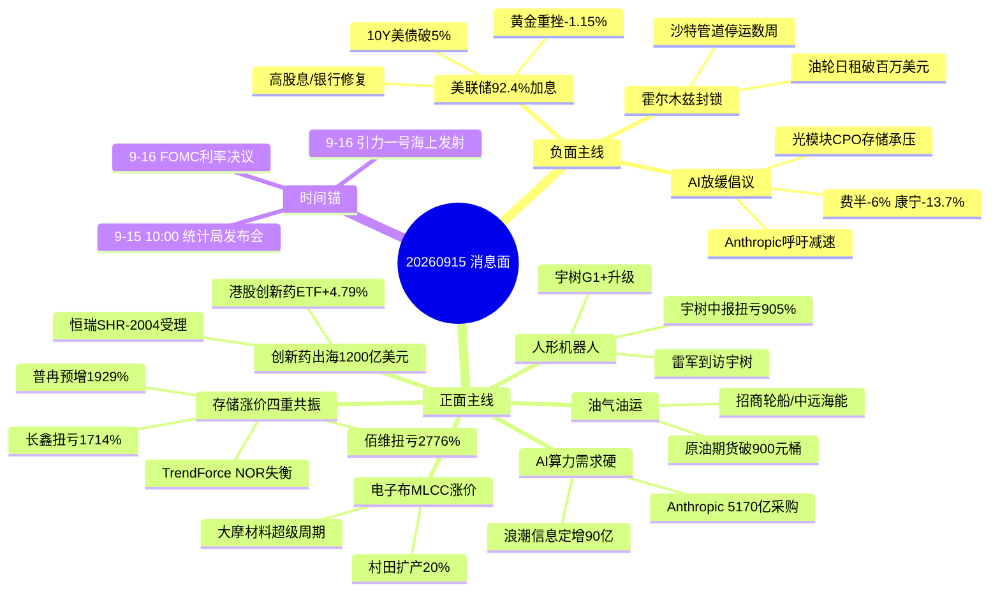

# 2026-09-15 · **消息面事件驱动**

> **数据源新鲜度**: partial · **降级状态**: 🔴 degraded · **置信度**: 0.60
> **覆盖窗口**: 前 72h(09-12 ~ 09-15 06:53) · **主源**: 财联社/新浪快讯 2186 条 + 要闻 800 条 + 东财中报预告 500 条
> **事件数**: 8 条硬事件 · 2 负面(1 行业级) + 6 正面 · 全部 ≥4 源共振
> **降级说明**: 公众号源用户已停用 + 5 焦点群全 timeout → 群聊/公众号双缺, news_cls 升格主源, 中报硬 alpha 补偿验证缺口

## 一句话结论

地缘(霍尔木兹封锁油价破百)+宏观(美联储92.4%加息10Y破5%)双压, AI放缓倡议引发费半-6%行业级利空; 正面主线在存储涨价(中报硬alpha密集)、人形机器人(雷军到访宇树)、创新药出海(1200亿美元)、油气油运(油轮日租破百万)。情绪=高位震荡, 候选砍半, 只做中报预增+事件双证票。

## 🗺️ 消息面全景图

## 🎯 顶级事件详解(每事件三问 + 首推票思维链)

### E20260915_003 · 费城半导体-6%+Anthropic呼吁放缓AI · strength=high · polarity=负面

**事件摘要**: 费半单日-6.01%, 康宁-13.69%/泰瑞达-13.30%/Coherent-12.73%/SK海力士-7.49%/美光-7.35%; Anthropic CEO Amodei 呼吁放缓先进AI模型开发, 马斯克赞同, 特朗普批驳。微软发布《人本主义AI行为准则》。5 源共振(news_cls sina+10jqka + 华尔街见闻 + 财联社 + 浙商证券研报)。

**推理深度三问**:
- **大资金意图**: 短期是**情绪杀估值**而非杀逻辑——Anthropic 同日仍在签 137 亿美元算力采购(见 E004), 一年累计 5170 亿, 需求侧没有证伪; 大资金借"放缓倡议"在美联储加息窗口前高位兑现算力利润, 费半 -6% 是拥挤交易的第一波踩踏
- **为什么走强**: 昨天(09-14)A股已先行映射——中际旭创-5.72%、新易盛-4.99%、澜起-3.81%, 今日美股费半继续-6%, 说明这是**跨市场共振的行业级利空**, 不是单日噪音; 康宁-13.69% 指向光通信上游, Coherent-12.73% 直指光模块, A股光模块链今日大概率低开
- **逻辑够不够硬**: **硬(利空)**。Anthropic 是前沿模型厂+英伟达/Palantir 同步限制使用 OpenAI/Anthropic 模型+微软发行为准则, 三家头部同时转向"慢AI"叙事, 短期共识形成; 但**中线逻辑未被破坏**——算力采购金额硬增长, 属"买点后置"而非"逻辑证伪"

**首推票思维链**(本事件为利空, 下列为回避/离场票):

#### 中际旭创 300308.SZ · role=回避·光模块龙头
- **买入理由**: 无。昨日已-5.72%(873元), 今日费半-6%映射继续承压, 高位光模块回避, 不接飞刀
- **风险点**: 费半映射未消化 + 康宁-13.69%上游塌方 + 美联储加息压制估值
- **止损条件**: 已持有者跌破 829(09-14 收盘 × 0.95) 离场, 反弹不追
- **可验证假设**: 若今日开盘 30 分钟内光模块板块净流入转正且中际旭创收复 873 → 利空钝化可重新评估; 否则维持回避

#### 新易盛 300502.SZ · role=回避·光模块
- **买入理由**: 无。昨日-4.99%(401.9), Coherent/Astera 美股映射直接利空
- **风险点**: 光模块高位+美股映射+机构减仓
- **止损条件**: 跌破 382(401.9 × 0.95) 离场
- **可验证假设**: 板块内若出现"利空不跌"(低开高走)信号 → 视为见底信号, 否则观望

### E20260915_002 · 美联储9月加息92.4%+10Y美债破5% · strength=high · polarity=负面

**事件摘要**: CME 美联储观察显示 9 月加息 25bp 概率 92.4%; 10Y 美债收益率 2023 年以来首次破 5%; 花旗/高盛/摩根大通/汇丰/大摩集体转鹰; 超级央行周(美联储 9/16 + 英国 + 日本)。5 源共振。

**推理深度三问**:
- **大资金意图**: 加息 25bp 已被 92.4% 定价,**利空落地即利空出尽**——中金明确"预防式加息落地反而是反着做"的教科书案例(1997); 大资金在等 9/16 决议落地后启动反攻, 高股息/银行是加息窗口的避风港
- **为什么走强**: 10Y 破 5% 是 2023 年以来第一次, 全球风险资产无差别承压; A股高股息板块 9 月已修复(银行月内+3% 居 31 行业首), 资金从成长切确定性
- **逻辑够不够硬**: **硬**。92.4% 定价 + 三大行转鹰 + 美债破 5% 三重确认; 但注意 9/16 是时间锚, 落地后方向可能反转

**首推票思维链**:

#### 工商银行 601398.SH · role=首推·高股息防御
- **买入理由**: 加息利好银行息差; 高股息板块 9 月修复领涨(月内+3% 31 行业首); 昨日+1.36% 逆势走强; 资金避险窗口首选
- **风险点**: 纯防御属性, 弹性有限, 无涨停基因; 加息落地后资金可能回流成长导致高股息补跌
- **止损条件**: 跌破 7.85(8.22 × 0.955) 离场
- **可验证假设**: 若 9/16 加息落地后银行板块净流入转负 → 防御逻辑兑现完毕, 当日止盈

### E20260915_001 · 霍尔木兹海峡封锁+油价破百 · strength=high · polarity=正面

**事件摘要**: 国内原油期货首次升破 900 元/桶; WTI 101.39 美元(+1.34%), 布油 105.68(+1.02%); 伊朗称海峡已封锁并"智能管控", 油轮触雷爆炸; 沙特东西输油管道遭袭停运数周; 油轮日租成本首破百万美元/日。5 源共振(含华尔街见闻+财联社)。

**推理深度三问**:
- **大资金意图**: 地缘供给冲击是**真金白银的涨价链**——油轮日租破百万美元(波罗的海交易所数据)是航运景气度的硬指标, 沙特管道停运数周造成 4% 全球供应缺口预期; 资金沿"油价→油气开采→油运→化工成本端"传导
- **为什么走强**: 霍尔木兹封锁从"口头威胁"升级为"实际事件"(油轮触雷+美军击落无人机+击落MQ-1), 地缘溢价从情绪转为实物; 国内成品油已上调 260/250 元
- **逻辑够不够硬**: **硬**。但 bearish_scope=行业级——油价破百砸航空/物流/化工下游/高耗能制造, 正反两面必须同时列

**首推票思维链**:

#### 中国海油 600938.SH · role=首推·油气龙头
- **买入理由**: 海上油气开采龙头, 油价破百直接弹性; 地缘供给冲击下确定性最高; 中报业绩稳定
- **风险点**: 油价已高位(布油 105), 特朗普称"冲突结束油价将暴跌"构成政治面反噬风险; 昨日平收说明尚未启动
- **止损条件**: 跌破 32.20(33.91 × 0.95) 离场
- **可验证假设**: 若今日油价期货续涨且中国海油放量突破 34.8(昨日高点) → 主升确认; 若油价回落则逻辑转弱

#### 招商轮船 601872.SH · role=首推·油运
- **买入理由**: VLCC 油运龙头, 霍尔木兹封锁推升运价+油轮日租破百万美元(历史级)
- **风险点**: 海峡通航若快速恢复(美军护航有效)则运价回落; 昨日平收 20.0 未启动
- **止损条件**: 跌破 19.00(20.00 × 0.95) 离场
- **可验证假设**: 波罗的海油轮日租若连续两日维持百万美元 → 运价逻辑成立

### E20260915_006 · 存储涨价四重共振 · strength=high · polarity=正面

**事件摘要**: TrendForce 预估 2026H2 NOR Flash 供需失衡合约价维持高点; 十铨陈庆文: 存储续涨 DRAM 缺口显著 27H1 最严峻; 美光/闪迪赴韩抢 HBM 人才佐证景气; 中报硬 alpha: 长鑫扭亏 1714~2530%、佰维扭亏 2776~3421%、普冉预增 1929~2977%。5 源共振(含 earnings_predict 交叉)。

**推理深度三问**:
- **大资金意图**: 存储是本轮 AI 行情中**业绩最先兑现**的环节——长鑫/佰维/普冉三票中报扭亏/预增全部落地, 涨价周期(DRAM 缺口 27H1 最严峻)给 2-3 季度业绩能见度; 机构分歧点在外资抛售三星/海力士 4 万亿韩元+美股存储重挫(美光-7.35%), 属"涨多了的兑现"而非"逻辑破坏"
- **为什么走强**: 基本面(涨价+业绩)与情绪面(美股映射)背离, 正是**低位业绩票的黄金坑**; 普冉 chart_vision 技术锚 363.63 支撑未破
- **逻辑够不够硬**: **硬**。涨价有 TrendForce+十铨双机构背书, 业绩有中报预告硬数据, 3 票全部 earnings_predict 交叉命中; bearish 面(外资抛售韩存储)标注为板块级, 提示注意兑现节奏

**首推票思维链**:

#### 长鑫科技 688825.SH · role=首推·存储制造
- **买入理由**: DRAM 国产龙头; 中报扭亏 1714.67~1934.85%(另一口径 2278~2530%), earnings_predict 硬交叉; 存储涨价周期直接受益
- **风险点**: 昨日-3.95%(54.49) 技术面走弱; 高位存储链受美股映射压制; 市值大弹性中等
- **止损条件**: 跌破 51.75(54.49 × 0.95) 离场
- **可验证假设**: 若今日低开后收复 54.49(昨日收盘) → 利空钝化, 存储链见底信号

#### 佰维存储 688525.SH · role=首推·存储模组
- **买入理由**: 中报扭亏 2776~3421%(最高口径 3200~3421%), 企业级 SSD+存储模组双主线
- **风险点**: 昨日-2.77%(207.11) 高位回撤; 美股存储映射
- **止损条件**: 跌破 196.75(207.11 × 0.95) 离场
- **可验证假设**: DRAM 现货价若续涨 → 涨价逻辑强化

#### 普冉股份 688766.SH · role=首推·NOR
- **买入理由**: 中报预增 1929~2977%, 与 TrendForce "NOR Flash 供需失衡"直接对应; chart_vision 给出 363.63 支撑锚
- **风险点**: chart_vision 全部周期均线空头排列(偏空 bias 0.75), 技术面未企稳
- **止损条件**: **跌破 360.00 无条件止损**(chart_vision 明确锚点)
- **可验证假设**: 若放量站回 20 日线 → 空头排列修复, 反转确认

### E20260915_004 · Anthropic-Rum 137亿美元算力采购 · strength=high · polarity=正面

**事件摘要**: Anthropic 与 Rum Group 签 137 亿美元 6 年算力采购协议, 一年累计 5170 亿美元; Rum Group 大涨 27%; 软银获 118.7 亿美元贷款支持 OpenAI 投资。4 源共振。

**推理深度三问**:
- **大资金意图**: 这是 E003 的**正反两面拆条**(v1.4 错题本 004)——同一主体(Anthropic)一边呼吁放缓 AI 一边签 5170 亿算力采购, 说明放缓是"安全叙事"、采购是"商业行动"; 大资金借此验证算力需求侧未被证伪, 回调即买点
- **为什么走强**: 5170 亿美元/年是史无前例的算力资本开支, 直接利好 AIDC/服务器/液冷/电源; 浪潮信息同日公告定增 90 亿投 AI 基础设施, 润泽科技申请 500 亿授信, 国内厂商用行动呼应
- **逻辑够不够硬**: **硬**。金额+期限+多个独立来源; 但需注意与 E003 情绪利空并存, 短期可能继续被费半拖累

**首推票思维链**:

#### 浪潮信息 000977.SZ · role=首推·算力服务器
- **买入理由**: AI 服务器龙头; 拟定增 90 亿投 AI 基础设施(硬资本开支信号); Anthropic 5170 亿采购印证需求
- **风险点**: 昨日-2.44%(68.82) 跟随算力链回调; E003 费半利空未消化; 定增短期摊薄预期
- **止损条件**: 跌破 65.40(68.82 × 0.95) 离场
- **可验证假设**: 若算力板块情绪企稳且浪潮收复 69.86(昨日高点) → 买点确认

#### 润泽科技 300442.SZ · role=首推·AIDC
- **买入理由**: 拟新增不超 500 亿授信加大 AIDC 投入, 算力订单潮直接受益
- **风险点**: 昨日-0.61%(60.68) 弱势; AIDC 重资产高负债; 高位算力压制
- **止损条件**: 跌破 57.70(60.68 × 0.95) 离场
- **可验证假设**: AIDC 板块资金净流入转正 → 需求逻辑获盘面确认

### E20260915_005 · 雷军到访宇树+宇树G1+升级 · strength=high · polarity=正面

**事件摘要**: 小米雷军 9/14 晚现身杭州宇树科技(王兴兴陪同); 宇树同日宣布 G1+ 全面升级(6 项); 高盛大幅上调 2035 年人形机器人销量预测; 国家数据局局长刘烈宏召开具身智能座谈会; 宇树中报扭亏 905~1055%。5 源共振。

**推理深度三问**:
- **大资金意图**: 雷军到访=小米生态链对人形机器人的产业级背书, 叠加国家数据局座谈会(政策面)+高盛预测(机构面)+中报扭亏(基本面)四维共振, 人形机器人从主题炒向产业落地
- **为什么走强**: 宇树 G1+ 是产品迭代硬事件, 扭亏 905% 是业绩硬验证; 具身智能被"十五五"规划点名, 政策预期充足
- **逻辑够不够硬**: **硬**。4 类独立信号(产业/政策/机构/业绩)同日共振, 且宇树中报为 earnings_predict 硬交叉命中

**首推票思维链**:

#### 宇树科技 688836.SH · role=首推·机器人本体
- **买入理由**: 事件主角(雷军到访+G1+升级); 中报扭亏 905.63~1055.52% 硬 alpha; 人形机器人本体龙头
- **风险点**: 昨日-1.49%(470.0) 高位; 科创板情绪受费半压制; 估值极高(扭亏初期)
- **止损条件**: 跌破 446.50(470.00 × 0.95) 离场
- **可验证假设**: 若今日机器人板块领涨且宇树放量突破 479.41(昨日高点) → 事件驱动主升确认

#### 三花智控 002050.SZ · role=次选·机器人执行器
- **买入理由**: 特斯拉链执行器核心供应商, 机器人板块联动; 板块联动度 0.82
- **风险点**: 昨日仅-0.49% 无涨停基因; 弹性弱于本体标的; 主升需板块整体配合
- **止损条件**: 跌破 32.95(34.70 × 0.95) 离场
- **可验证假设**: 机器人板块若出现 3 只以上涨停 → 板块效应成立, 三花补涨

### E20260915_007 · 创新药出海1200亿美元 · strength=high · polarity=正面

**事件摘要**: 今年创新药对外授权突破 1200 亿美元(+36%), 首付款超百亿; 港股通创新药 ETF 领涨 4.79%(盘面验证); 恒瑞 SHR-2004 上市申请获受理; 康哲 CMS-D001 获 SLE 临床批件。5 源共振。

**推理深度三问**:
- **大资金意图**: 创新药出海是"十五五"确定性产业趋势——1200 亿美元 BD 交易+首付款超百亿是硬数据, 港股创新药 ETF +4.79% 说明资金已在行动; A股创新药补涨预期明确
- **为什么走强**: BD 出海带来现金流+估值重估双逻辑; 恒瑞/荣昌/石药三票业绩或事件共振
- **逻辑够不够硬**: **硬**。1200 亿美元(+36%)宏观数据+ETF 盘面验证+恒瑞受理事件+荣昌/石药中报硬 alpha 交叉

**首推票思维链**:

#### 恒瑞医药 600276.SH · role=首推·创新药龙头
- **买入理由**: SHR-2004 上市申请受理(新事件催化); 出海 BD 龙头; 昨日+1.12% 逆势走强(医药独立性)
- **风险点**: 大盘若因加息大跌, 医药难独善其身; 受理≠获批, 时间差风险
- **止损条件**: 跌破 41.00(43.15 × 0.95) 离场
- **可验证假设**: 若港股创新药 ETF 今日续涨且恒瑞放量突破 43.19(昨日高点) → 主线确认

#### 荣昌生物 688331.SH · role=次选·ADC创新药
- **买入理由**: 中报扭亏 1065~1145% 硬 alpha; 出海 BD 弹性大; 昨日+2.81%
- **风险点**: 昨日已涨 2.81%, 追高需谨慎; 科创板情绪
- **止损条件**: 跌破 112.00(117.94 × 0.95) 离场
- **可验证假设**: ADC 赛道 BD 新闻若续发 → 弹性释放

### E20260915_008 · 电子布/覆铜板/MLCC涨价 · strength=high · polarity=正面

**事件摘要**: 电子布 G75 涨至 22800-24000 元/吨(供需偏紧); 大摩: 玻纤布与铜箔材料超级周期; 村田 MLCC 产能提升两成(AI 服务器); A股 MLCC 概念昨已涨停(康达新材/双星新材)。5 源共振。

**推理深度三问**:
- **大资金意图**: AI 硬件涨价链从 GPU/光模块向**上游材料**(玻纤布/铜箔/MLCC)扩散, 大摩"材料超级周期"是机构级背书; 村田扩产是日本龙头对 AI 服务器 MLCC 需求的确认
- **为什么走强**: 电子布连续涨价+MLCC 概念昨涨停(康达新材/双星新材/昀冢科技)+大摩研报, 量价齐升
- **逻辑够不够硬**: **硬**。涨价有卓创数据+村田扩产+大摩研报三源; 但 bearish: 超声电子 5 天 3 板后澄清"未给英伟达供货", 金安国纪否认英伟达/华为供应链 → 高位澄清票回避, 只做有真实订单的龙头

**首推票思维链**:

#### 沪电股份 002463.SZ · role=首推·PCB
- **买入理由**: 1.6T 交换机批量出货+3.2T 预研(真实订单); 大摩材料超级周期直接受益; PCB 龙头
- **风险点**: 昨日-1.99%(125.7) 回调; 超声电子澄清拖累 PCB 高位情绪
- **止损条件**: 跌破 119.40(125.70 × 0.95) 离场
- **可验证假设**: PCB 板块若今日低开高走 → 澄清利空钝化, 龙头修复

#### 风华高科 000636.SZ · role=首推·MLCC
- **买入理由**: MLCC 国产龙头; 昨日+5.2%(58.9) 板块领涨; 村田扩产验证 AI 服务器 MLCC 需求
- **风险点**: 昨日已涨 5.2% 追高风险; MLCC 概念情绪票波动大
- **止损条件**: 跌破 55.95(58.90 × 0.95) 离场
- **可验证假设**: MLCC 概念若今日续封 2 板 → 板块效应延续, 风华高科中军补位

## 📊 板块 × 事件热力矩阵(极性叉乘)

| 板块 | 正面事件 | 负面事件 | 净极性 | 首推龙头 | 中报硬alpha | 净综合置信 |
|------|----------|----------|--------|----------|:--:|:--:|
| 油气开采 | E001 油价破百 | — | 🟢 正面 | 中国海油 | — | 🟢🟢🟢 |
| 油运 | E001 油轮日租破百万 | — | 🟢 正面 | 招商轮船/中远海能 | — | 🟢🟢🟢 |
| 化工 | E001 成本推升 | E001 成本挤压(下游) | 🟡 交织 | — | — | 🟢🟢 |
| 航空/物流 | — | E001 油价破百 | 🔴 负面 | — | — | 🟡 |
| 银行/高股息 | E002 加息利好 | — | 🟢 正面 | 工商银行 | — | 🟢🟢🟢 |
| 黄金/贵金属 | — | E002 加息+金价-1.15% | 🔴 负面 | — | — | 🟡 |
| 光模块/CPO | — | E003 费半-6% 康宁-13.7% | 🔴 负面 | 回避(旭创/新易盛) | — | 🔴 |
| 半导体 | E006 存储涨价 | E003 费半-6% | 🔴 负面偏交织 | 观察(澜起) | 长鑫/佰维/普冉 | 🟡 |
| 存储/NOR/DRAM | E006 涨价+业绩 | E003 美股存储重挫 | 🟡 交织偏正 | 长鑫/佰维/普冉 | 扭亏1714~3421% | 🟢🟢🟢 |
| AI算力/AIDC | E004 5170亿采购 | E003 放缓倡议 | 🟡 交织(短空长多) | 浪潮信息/润泽科技 | — | 🟢🟢 |
| 人形机器人 | E005 雷军到访+G1+ | — | 🟢 正面 | 宇树科技 | 扭亏905~1055% | 🟢🟢🟢 |
| 创新药/CXO | E007 出海1200亿 | — | 🟢 正面 | 恒瑞医药 | 荣昌扭亏1065~1145% 石药扭亏2895%+ | 🟢🟢🟢 |
| PCB/覆铜板 | E008 涨价+大摩周期 | E008 超声/金安国纪澄清 | 🟡 交织偏正 | 沪电股份 | — | 🟢🟢 |
| MLCC | E008 村田扩产20% | — | 🟢 正面 | 风华高科 | — | 🟢🟢🟢 |

## 🔥 中报业绩预告命中(硬 alpha 交叉验证)

从 `eastmoney_earnings_predict`(500 条)提取净利润预增 top25 与今日事件板块交集:

| 代码 | 名称 | 预告类型 | 增速下限-上限 | 事件命中 | 逻辑强度 |
|------|------|----------|--------------|----------|:--:|
| 688825.SH | 长鑫科技 | 扭亏 | 1714%~2530% | E006 存储涨价 DRAM龙头 | 🟢🟢🟢 |
| 688525.SH | 佰维存储 | 扭亏 | 2776%~3421% | E006 存储模组 | 🟢🟢🟢 |
| 688766.SH | 普冉股份 | 预增 | 1929%~2977% | E006 NOR供需失衡直接对应 | 🟢🟢🟢 |
| 688836.SH | 宇树科技 | 扭亏 | 905%~1055% | E005 雷军到访+G1+ | 🟢🟢🟢 |
| 688331.SH | 荣昌生物 | 扭亏 | 1065%~1145% | E007 创新药出海 | 🟢🟢🟢 |
| 300765.SZ | 石药创新 | 扭亏 | 2895%~49624% | E007 创新药出海 | 🟢🟢🟢 |
| 688498.SH | 源杰科技 | 预增 | 1001%~1305% | E003 光芯片(受负面压制, 暂缓) | 🟢🟢 |
| 002491.SZ | 通鼎互联 | 预增 | 3293%~4768% | 通信/光缆(今日无直接事件) | 🟢 |
| 688308.SH | 欧科亿 | 预增 | 46327%~54065% | 刀具/机床(今日无直接事件) | 🟢 |

## 关键证据

- 证据 1: 费半指数日内-6.01%, 康宁-13.69%/泰瑞达-13.30%/Coherent-12.73%/SK海力士-7.49% · 来源 news_cls:sina(2026-09-14 21:44)
- 证据 2: Anthropic 与 Rum Group 签 137 亿美元 6 年算力采购, 一年累计 5170 亿美元 · 来源 news_cls:sina + 10jqka(2026-09-14 23:32)
- 证据 3: 国内原油期货首次升破 900 元/桶, 布油 105.68 美元, 油轮日租破百万美元/日 · 来源 news_cls + news_major(2026-09-15 06:53)
- 证据 4: TrendForce 预估 2026H2 NOR Flash 供需失衡合约价维持高点; 十铨称 DRAM 缺口 27H1 最严峻 · 来源 news_cls(2026-09-14 14:01)
- 证据 5: 雷军 9/14 晚现身宇树科技, 宇树同日推 G1+ 升级 · 来源 news_cls:sina + 10jqka(2026-09-14 21:05-23:16)
- 证据 6: 创新药出海 1200 亿美元(+36%), 港股通创新药 ETF 领涨 4.79% · 来源 news_cls(2026-09-14 20:58 + 15:01)

## 数据源审计

| 源 | 日期 | 状态 | 备注 |
|---|---|:--:|---|
| news_cls | 2026-09-15 | 🟢 | 2186 条·72h 回看·关键词命中 691 |
| news_major | 2026-09-15 | 🟢 | 800 条·含华尔街见闻/财联社/新浪 |
| eastmoney/earnings_predict | 2026-09-15 | 🟢 | 500 条·2026H1·top25 交叉 |
| wechat_official_sanji | 2026-09-15 | 🔴 | 用户停用(0 条) |
| wechat_cli_5groups | 2026-09-15 | 🔴 | 5 群全 timeout/找不到对象(0 条) |
| chart_vision_snapshot | 2026-09-15 | 🟡 | 6 票价格锚点(存储/芯片) 6 票 timeout |
| r7_capital_flow | — | 🔴 | R7 未落盘(资金验证 unavailable) |
| xtick/tushare/datapro MCP | 2026-09-15 | 🟡 | mcp_health: tushare/xtick/datapro ok, weflow/qmt down |

## 不确定性 / 反证

1. **降级补偿不足**: 公众号+群聊双缺, KOL 独立验证为零, 所有事件依赖 news_cls+news_major 双通道——同一上游的两个镜像, 存在回声室风险
2. **E003 vs E004 正反同体**: Anthropic 同日"放缓倡议"(利空)+"137亿采购"(利多), 市场短期先信哪个不确定; 若费半今日继续-6%, E004 利好会被情绪淹没, 算力票继续补跌
3. **油价政治反噬**: 特朗普明确"冲突结束油价将暴跌"+"愿与伊朗谈判", 地缘溢价随时可能被政治面压制; 油运/油气是 T+1 情绪票, 追高即接盘
4. **存储技术面偏空**: chart_vision 对普冉/兆易/北京君正全部标注"均线空头排列, 偏空", 涨价逻辑 vs 技术面背离, 中报硬 alpha 可能被情绪淹没
5. **中报预告时效**: 长鑫/佰维/普冉/宇树/荣昌/石药 notice 日期 7-8 月, 距今日已 1-2 个月, 属"已消化信息"重提, 不是新预期

## 与其他 R/D/E 的关系

- 依赖: data/raw/20260915/{news_cls,news_major,eastmoney_earnings_predict,chart_vision_snapshot,manifest,mcp_health}
- 被消费: R2 主线(油气/存储/机器人/创新药板块候选) / R5 个股画像(8 首推票) / R6 反证(存储正反+PCB澄清) / D1 预案(execution_pool 候选)
- 注意: E003 行业级利空 → R2 应砍 AI 硬件候选; R5 对长鑫/普冉/宇树做技术面二次确认

## Sub-Agent 元数据

- skill: analyze_news_impact_v1@1.1(降级模式)
- artifact: data/research/20260915/R4_news.json
- method: llm_v1(硬扩容·降级五源·λ=0.15时间衰减·v1.4正反两面拆条)
- 生成时刻: 2026-09-15T07:40:00+08:00
