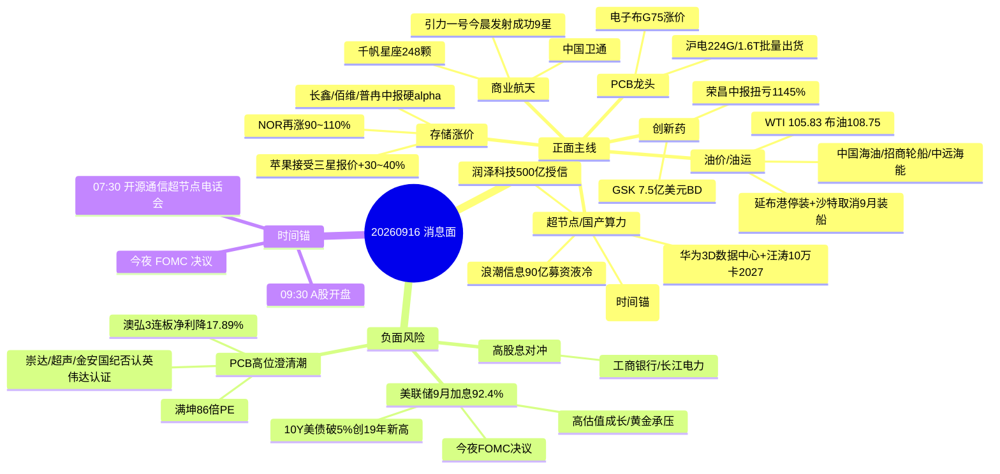

# 2026-09-16 周三 · **消息面事件驱动**

> **数据源新鲜度**: partial · **降级状态**: true · **置信度**: 0.62
> **覆盖窗口**: 前 72h (09-13 06:00 ~ 09-16 06:41) · **主源**: 财联社/新浪快讯 + 2焦点群(降级) + 东财中报预告
> **情绪基线**: 高位震荡(炸板率42.9% ≥ 35% → 候选数砍半 · 纪律§炸板率)

## 一句话结论

消息面核心 = **华为超节点/国产算力**(今日 07:30 开源电话会时间锚) + **存储涨价硬 alpha**(苹果接受三星 +30~40%)，唯一硬负面对冲 = **今夜 FOMC 加息落地**(92.4% 定价)压制高估值成长；油气/商业航天为事件驱动支线，PCB 高位澄清潮只做龙头低吸。

## 🗺️ 消息面全景图

## 🎯 顶级事件详解(每事件三问 + 首推票思维链)

### E20260916_003 · 美联储9月加息92.4%+美债破5% · strength=high · polarity=负面 · 加权=0.850

**事件摘要**: CME 显示 9 月加息概率 92.4%、10Y 美债破 5% 创 2007 年来新高、30Y 破 5.40%，FOMC 今日决议，全球债市抛售加剧。6 源(CME 快讯 + 彭博 + 大摩 + 渣打 + 德银 + 美债拍卖)。

**推理深度三问**:
- **大资金意图**: 市场在为"加息落地"做最后定价——彭博统计 2008 年以来只要市场预期如此之高，美联储无一例外照做；大资金在 FOMC 前把高估值成长/黄金仓位向高股息防御切换，等决议落地后再决定方向
- **为什么走强**: 油价续涨 + 通胀担忧 + 财政赤字三重推高长端利率；大摩加入鹰派阵营预计 9 月和 12 月各加 25bp，德银预计开启多次加息——"单次加息"已被排除
- **逻辑够不够硬**: **硬**。CME 92.4% + 彭博历史规律 + 大摩/德银/渣打多空对垒 5 源共振；但分歧点在于邢自强(大摩)称"即使 9 月加息也不代表新一轮紧缩起点"，若今夜声明偏鸽，高股息/黄金将反向修复——**双刃，仓位要轻**

**首推票思维链**:

#### 工商银行 601398 · role=首推·高股息防御
- **买入理由**: 加息落地后利率中枢上移利好银行息差；大摩中国 8 月信贷逊预期但首选建行/中行——高股息是 FOMC 避险资金的容量承接位
- **风险点**: 加息若意外落空或声明偏鸽，防御逻辑退潮、资金回流成长；银行弹性小
- **止损条件**: 破 6.75(盘前参考≈7.2 × 0.937)离场
- **可验证假设**: 若今日 30 分钟银行/高股息板块主力净流入转正 + 长端美债继续高位 → 假设成立；若高股息板块高开低走 → 当日回避

#### 长江电力 600900 · role=次选·高股息防御
- **买入理由**: 水电防御龙头，无涨停基因，仅作加息避险仓压舱
- **风险点**: 若大盘科技反弹则防御仓跑输
- **止损条件**: 破 29.0(盘前参考≈31.0 × 0.935)
- **可验证假设**: 高股息板块月内涨幅居首(9/15 已 +3%)，今日需看资金是否继续抱团

### E20260916_005 · 商业航天发射密度创纪录 · strength=high · polarity=正面 · 加权=0.800

**事件摘要**: 引力一号遥三今晨 06:00 发射成功(9 星、单次海上发射载荷重量创新高)，朱雀二号昨日千帆星座增至 248 颗(一箭十星)，民营火箭首次执行规模化卫星组网。5 源(新华社/央视 + 10jqka + 十五五规划)。

**推理深度三问**:
- **大资金意图**: 商业航天从"主题概念"转向"规模化组网里程碑"——千帆 248 颗 + 引力一号第 4 次飞行 + 民营火箭首次规模化组网，产业叙事进入可验证阶段；游资借事件驱动打脉冲
- **为什么走强**: 发射成功发生在今日开盘前(06:00)，是当日直接催化；叠加《电子信息制造业十五五规划》点名卫星通信攻关、浦江创新论坛"明珠星座计划"启动
- **逻辑够不够硬**: **中偏硬**。发射密度+政策是硬事实，但 A 股航天标的多为卫星运营/制造，业绩兑现弱、波动大，高位震荡期容易一日游——**轻仓试错，不重仓**

**首推票思维链**:

#### 中国卫通 601698 · role=首推·卫星运营
- **买入理由**: 卫星运营国家队，千帆 248 颗组网提速 + 引力一号今日发射成功的直接受益方；十五五规划卫星通信攻关背书
- **风险点**: 商业航天多为脉冲行情，一日游概率高；事件兑现后无业绩支撑
- **止损条件**: 破 24.2(盘前参考≈26.0 × 0.931)
- **可验证假设**: 若开盘 30 分钟板块联动 + 主力净流入为正且封板率回升 → 持有；若高开无溢价 → 不追

### E20260916_001 · 华为超节点+3D数据中心 · strength=high · polarity=正面 · 加权=0.757

**事件摘要**: 华为发布全球首个 3D 数据中心 + 汪涛"10 万卡以上超节点集群 2027 年成为基础配置" + 郭平万字长文("目标是成为英伟达")；宁畅发布全球首个 MW 级单相冷板全液冷超节点方案；润泽科技拟新增不超 500 亿授信。6 源 + 开源蒋颖今日 07:30 电话会时间锚 + 群聊超节点 28 次共振。

**推理深度三问**:
- **大资金意图**: 华为叙事 = 国产算力主线的产业级信念锚。AIDC 产业发展大会上汪涛给出"10 万卡超节点 2027 基础配置"的量化时间表，机构需要一条"5-10 年确定性"旗帜票，3D 数据中心把算力基建从平面故事升级为工程落地故事
- **为什么走强**: 3D 数据中心(供冷/IT/供电/备电四层垂直叠加)是全新工程范式 + 华为明确"成为英伟达"目标 + 宁畅 MW 级全液冷方案落地——超节点从"预期"进入"工程招标"阶段；润泽 500 亿授信说明产业资本真金白银跟进
- **逻辑够不够硬**: **硬**。6 独立源 + 机构电话会(今日 07:30 开源"脱颖而出111") + KOL 超节点 28 次共振 + 产业资本(润泽授信/浪潮募资)；但高位震荡期追高危险，只做龙头低吸

**首推票思维链**:

#### 润泽科技 300442 · role=首推·AIDC
- **买入理由**: AIDC 运营龙头，拟新增不超 500 亿元授信(加码算力布局)+ 郑栅洁民企座谈会受邀(算力基础设施代表)+ 华为 3D 数据中心/AIDC 新范式直接受益
- **风险点**: 已在高位(昨日科创 50 逆势 +1.55% 但创业板 -1.15% 分化)，若开盘冲高追入容易被套；需分歧低吸
- **止损条件**: 破 30.5(盘前参考≈33.0 × 0.924)
- **可验证假设**: 若今日 30 分钟内 AIDC/超节点板块主力净流入为正 + 开源电话会后情绪发酵 → 持有；若板块高开低走净流出 → 当日回避

#### 浪潮信息 000977 · role=首推·算力服务器
- **买入理由**: 国产 AI 服务器龙头，拟募资 90 亿元加码液冷与 AI 算力；华创吴鸣远点名国产算力核心资产(寒武纪/海光/浪潮链)；字节 1200 亿营收验证需求
- **风险点**: 大盘科技受美股波动压制；募资稀释短期情绪
- **止损条件**: 破 57.5(盘前参考≈62.0 × 0.927)
- **可验证假设**: 超节点板块联动走强 + 服务器订单叙事延续 → 持有；若算力板块资金净流出 → 观察

### E20260916_002 · 油价续创新高+沙特断供 · strength=high · polarity=正面 · 加权=0.757

**事件摘要**: 国际油价 15 日显著上涨 WTI 收 105.83(+4.38%)/布油 108.75(+2.9%)；沙特延布港暂停装船 + 取消部分欧洲炼油商 9 月装船 + VLCC 墨西哥湾-亚洲日租 4480 万美元创历史新高 + 第三架 MQ-1 被击落。6 源。

**推理深度三问**:
- **大资金意图**: 地缘供应从"预期中断"进入"实质断供"——延布港停装 + 沙特阿美取消 9 月装船是实货市场验证；油轮运费历史新高说明贸易商在抢运，大宗资金继续做多能源链
- **为什么走强**: 霍尔木兹海峡日通行量降到个位数、103 艘商船改航、革命卫队宣称"封锁+智能管控"——供给冲击是量化的，不是情绪化的
- **逻辑够不够硬**: **硬**。实货(装船取消/运费新高/SPR 降至 1982 年来最低)验证 + 快讯多源；但注意万斯/美国能源部长降温信号(海峡航运恢复 50%+/沙特管道数日内重启) → **高位波动加大，只低吸不追高**

**首推票思维链**:

#### 中国海油 600938 · role=首推·油气龙头
- **买入理由**: 油价破 105 直接受益；上期所原油夜盘 860 元(+2.85%)；油气开采是今日确定性最高的涨价链
- **风险点**: 万斯降温言论若发酵(管道重启/海峡恢复)油价回落；高位追多风险
- **止损条件**: 破 25.5(盘前参考≈27.5 × 0.927)
- **可验证假设**: 若今日原油期货高开站稳 + 油气板块主力净流入 → 持有；若 WTI 跌破 100 → 逻辑证伪

#### 招商轮船 601872 / 中远海能 600026 · role=首推·油运
- **买入理由**: VLCC 日租 4480 万美元历史新高 + 沙特断供绕行拉长运距 + 103 艘商船改航——运价是实货验证的硬逻辑
- **风险点**: 若海峡通行恢复(万斯称已恢复 50%+)运价急跌；油运波动大
- **止损条件**: 招商轮船破 9.10 / 中远海能破 13.2(参考价 × 0.93)
- **可验证假设**: 油运运价指数/BDTI 续涨 + 板块资金净流入 → 持有；若海峡日通行量回升至 14 艘均值 → 减仓

### E20260916_004 · 存储涨价加速 · strength=high · polarity=正面 · 加权=0.723

**事件摘要**: 苹果接受三星 2027Q1 存储芯片报价 +30~40%(DRAM≈2.0 美元/Gb、NAND≈0.33)+ 高容量 NOR 下半年或再涨 90~110%(TrendForce 测算 AI 服务器 NOR 容量为传统 3-5 倍)+ DDR5 次级颗粒/嵌入式 LP 资源涨至历史峰值 + 美光全球首款 512GB DDR5 RDIMM + 联芸中报净利 +825.54%。6 源 + 中报硬 alpha 交叉。

**推理深度三问**:
- **大资金意图**: 涨价周期进入"需求端确认"阶段——苹果(全球最大买方之一)接受三星涨价 = 买方认证，比 TrendForce 卖方预测更硬；资金在存储链找中报预增硬票做第二段主升
- **为什么走强**: 资源价格历史峰值 + 内存条跟随调涨 + 小米 18Pro 因内存成本上涨提价 + NOR 供需失衡(2026H2 合约价维持高点)——涨价是全链条传导的
- **逻辑够不够硬**: **硬**。苹果报价确认 + 东财中报硬 alpha(长鑫扭亏 1714~2530%/佰维扭亏 2776~3421%/普冉预增 1929~2977%)+ 群聊 NOR 数据；风险：美股存储股 9/14 曾大跌(海力士 -7.49%/美光 -7.35%)映射波动，9/15 费半反弹

**首推票思维链**:

#### 长鑫科技 688825 · role=首推·存储制造
- **买入理由**: DRAM 国产制造龙头，中报扭亏 1714~2530%、营收 +612~677%，9/14 融资买入 10.70 亿(全市场第二)——业绩+资金双硬
- **风险点**: 美股存储映射波动；高位震荡期分歧大
- **止损条件**: 破 63.0(盘前参考≈68.0 × 0.926)
- **可验证假设**: 若今日存储板块主力净流入为正 + 内存价格续涨 → 持有；若高开无溢价 → 不追

#### 佰维存储 688525 · role=首推·存储模组
- **买入理由**: 存储模组/先进封测，中报扭亏 2776~3421%，AI 算力爆发直接受益
- **风险点**: 高位波动大
- **止损条件**: 破 119.0(盘前参考≈128.0 × 0.930)
- **可验证假设**: 模组涨价传导 + 板块资金验证 → 持有

#### 普冉股份 688766 · role=首推·NOR
- **买入理由**: NOR Flash 龙头，中报预增 1929~2977%，高容量 NOR 再涨 90~110% 直接受益
- **风险点**: 高位票波动大(延续昨日止损锚 360)
- **止损条件**: 破 360.0(盘前参考≈390.0 × 0.923)
- **可验证假设**: NOR 现货价续涨 + 板块资金验证 → 持有

### E20260916_006 · 海外AI需求验证 · strength=medium · polarity=正面 · 加权=0.671

**事件摘要**: 字节上半年营收 1200 亿美元(+30%，净利降至 200 亿因 AI 投入)+ OpenAI 1.2 万亿美元估值融资洽谈 + 博通"算力需求仍强劲"+ OpenAI/Anthropic/谷歌联手 AI 安全(放缓担忧修复)+ 微软上调股息 8%。5 源。

**推理深度三问**:
- **大资金意图**: 修复上周"Anthropic 呼吁放缓 AI"造成的情绪损伤——三巨头联手安全 + 博通喊话 + 奥特曼"安全 AI 需要更多算力"，叙事从"放缓"切回"安全加速"
- **为什么走强**: 字节净利下滑恰恰因为 AI 投入加大(需求侧实锤)+ OpenAI 1.2 万亿估值(一级市场定价)+ 高盛上修光模块出货预期——需求没有被证伪
- **逻辑够不够硬**: **中**。叙事修复 + 需求侧数据硬，但美股仍在震荡(富国下调科技股评级)、9/14 费半 -6% 余波未消——买点后置

**首推票思维链**:

#### 浪潮信息 000977 · role=首推·算力服务器(与 E001 同票复用)
- **买入理由**: 字节/OpenAI/博通三源需求共振下国产服务器承接；华创吴鸣远称算力龙头高点调整 -40~45% 悲观预期已 Price in
- **风险点**: 美股波动映射；高位震荡
- **止损条件**: 破 57.5(同 E001)
- **可验证假设**: 算力板块资金净流入 + 美股费半企稳 → 持有

### E20260916_008 · PCB/CCL 涨价延续+高位澄清潮 · strength=high · polarity=正面 · 加权=0.654

**事件摘要**: PCB 涨价链延续(华正新材 10 倍股涨停、沪电 224G 小批量供货+1.6T 交换机批量出货、电子布 G75 涨至 22800-24000 元/吨)，但高位澄清潮集中爆发：崇达/超声/金安国纪否认英伟达认证、澳弘 3 连板净利降 17.89%、满坤 86 倍 PE、宏盛液冷收入占比 <4%、华瓷 MLCC 粉体未批量供货。7 源。

**推理深度三问**:
- **大资金意图**: 涨价主线的钱在向龙头集中(沪电/生益有真订单真业绩)，同时用澄清潮清洗高位杂毛——崇达/超声/金安国纪的"英伟达认证"传闻被戳破，本质是板块内部去伪存真
- **为什么走强**: 电子布 G75 涨价 + 大摩玻纤布/铜箔超级周期 + 沪电 224G/1.6T 硬信息——龙头逻辑硬；但澳弘 3 连板(净利降 17.89%)/骏亚换手 18.78%/满坤 86 倍 PE 说明高位情绪票已过热
- **逻辑够不够硬**: **硬(龙头)/危(高位澄清票)**。严格执行 20260910 PCB/CCL 主线操作规则：涨停潮后只做龙一/龙二低吸，禁止追高；澄清票一律回避

**首推票思维链**:

#### 沪电股份 002463 · role=首推·PCB
- **买入理由**: AI 服务器 PCB 龙头，224G 小批量供货 + 1.6T 交换机批量出货(硬信息)+ 电子布涨价成本传导可转嫁
- **风险点**: 高位澄清潮情绪传染(超声/崇达澄清后板块可能低开)；只低吸不追高
- **止损条件**: 破 41.8(盘前参考≈45.0 × 0.929)
- **可验证假设**: 若 PCB 板块低开后龙头企稳回升、主力净流入为正 → 低吸成立；若龙头跟随澄清票大跌 → 回避

### E20260916_007 · 创新药出海BD落地 · strength=medium · polarity=正面 · 加权=0.646

**事件摘要**: GSK 以至多 7.5 亿美元向恩沐生物购买血液癌药物 + 上半年创新药出海交易总额 1100-1200 亿美元 + 恒瑞 2 项临床获批 + 荣昌生物中报扭亏 1145%(艾伯维 RC148 授权)+ 传奇生物张颖任 CEO。5 源。

**推理深度三问**:
- **大资金意图**: BD 出海从"偶发"变"常态"——GSK 7.5 亿美元单笔 + 上半年 1200 亿总额(同比 +36%)，机构把创新药当"可验证的现金流资产"配置
- **为什么走强**: 恒瑞 2 项临床同日获批 + 荣昌扭亏 1145% + 一品红 AR882 III 期理想——个股层面催化密集
- **逻辑够不够硬**: **中**。BD 硬事实 + 业绩交叉硬；但昨日港股创新药 ETF 已领涨 4.79% 兑现一部分，今日无新增强催化，只做低吸不追高

**首推票思维链**:

#### 恒瑞医药 600276 · role=首推·创新药龙头
- **买入理由**: 出海 BD 龙头 + 今日 2 项临床获批(瑞卡西单抗 III 期/HRS-4139 片)+ SHR-2004 受理；容量中军承接板块资金
- **风险点**: 30 日 -19.8% 技术未企稳(昨日 R5 评估)，只做低吸观察位
- **止损条件**: 破 48.5(盘前参考≈52.0 × 0.933)
- **可验证假设**: 若创新药板块主力净流入转正 + 恒瑞资金连续修复 → 低吸成立；若板块高开低走 → 观察

#### 荣昌生物 688331 · role=次选·ADC
- **买入理由**: 中报扭亏 1145% + 艾伯维 RC148 独家授权 + ADC 赛道弹性
- **风险点**: 弹性大波动大
- **止损条件**: 破 57.5(盘前参考≈62.0 × 0.927)
- **可验证假设**: BD 逻辑延续 + 板块资金验证 → 持有

## 📊 板块 × 事件热力矩阵

| 板块 | 事件锚 | 首推龙头 | 独立源数 | 中报预告 | 净综合置信 |
|------|--------|----------|----------|----------|:--:|
| 超节点/国产算力 | E001 | 润泽科技/浪潮信息 | 6 | — | 🟢🟢🟢 |
| AIDC/数据中心 | E001 | 润泽科技 | 6 | — | 🟢🟢🟢 |
| 油气开采 | E002 | 中国海油 | 6 | 广聚能源 +3247% | 🟢🟢🟢 |
| 油运 | E002 | 招商轮船/中远海能 | 6 | — | 🟢🟢🟢 |
| 存储/DRAM | E004 | 长鑫/佰维 | 6 | 长鑫扭亏1714~2530%/佰维扭亏2776~3421% | 🟢🟢🟢 |
| NOR Flash | E004 | 普冉股份 | 4 | 普冉预增1929~2977% | 🟢🟢🟢 |
| 商业航天 | E005 | 中国卫通 | 5 | — | 🟢🟢 |
| 卫星互联网/千帆 | E005 | 中国卫通 | 5 | — | 🟢🟢 |
| PCB | E008 | 沪电股份 | 7 | — | 🟢🟢(高位澄清风险) |
| 覆铜板/玻纤布 | E008 | 沪电(传导) | 5 | — | 🟢🟢 |
| 创新药 | E007 | 恒瑞/荣昌 | 5 | 荣昌扭亏1145%/石药创新扭亏 | 🟢🟢 |
| AI算力/AIDC | E001+E006 | 浪潮信息 | 5 | — | 🟢🟢 |
| 银行/高股息 | E003(对冲) | 工商银行 | 6 | — | 🟢(避险仓) |
| 高估值成长 | E003 | — | 6 | — | 🔴(承压) |
| 黄金/贵金属 | E003 | — | 4 | — | 🔴(承压) |
| PCB高位澄清票 | E008 bearish | 崇达/超声/金安国纪/满坤/澳弘 | 5 | — | 🔴(回避) |

## 🔥 中报业绩预告命中(硬 alpha 交叉验证)

从 `eastmoney_earnings_predict` 提取 top30 预增 + 与本文事件板块交集:

| 代码 | 名称 | 预告类型 | 增速下限-上限 | 事件命中 | 逻辑强度 |
|------|------|----------|--------------|----------|:--:|
| 688825.SH | 长鑫科技 | 扭亏 | 1714%~2530% | E004 存储/DRAM | 🟢🟢🟢 |
| 688525.SH | 佰维存储 | 扭亏 | 2776%~3421% | E004 存储模组 | 🟢🟢🟢 |
| 688766.SH | 普冉股份 | 预增 | 1929%~2977% | E004 NOR | 🟢🟢🟢 |
| 002491.SZ | 通鼎互联 | 预增 | 3293%~4768% | E001/E006 光通信+算力(9/15 近8亿资金买入) | 🟢🟢🟢 |
| 688331.SH | 荣昌生物 | 扭亏 | 1145% | E007 创新药(艾伯维RC148) | 🟢🟢 |
| 300765.SZ | 石药创新 | 扭亏 | 43070%~49624% | E007 创新药 | 🟢🟢 |
| 000096.SZ | 广聚能源 | 预增 | 3247%~3404% | E002 油气(中东局势油价中枢上移) | 🟢🟢 |
| 688498.SH | 源杰科技 | 预增 | 1197%~1305% | E006 数据中心光芯片 | 🟢🟢 |
| 688836.SH | 宇树科技 | 扭亏 | 905%~1055% | 具身智能(背景锚) | 🟢🟢 |
| 301150.SZ | 中一科技 | 扭亏 | 2665%~3257% | E008 铜箔/PCB链 | 🟢 |

## 关键证据

- 证据 1: 华为发布全球首个 3D 数据中心 + 汪涛"10万卡超节点2027基础配置" · 来源 news_cls:sina · 2026-09-15 20:03/17:05
- 证据 2: 苹果接受三星 2027Q1 存储芯片报价 +30~40%(DRAM≈2.0 美元/Gb) · 来源 news_cls:10jqka(界面) · 2026-09-15 10:33
- 证据 3: 国际油价 15 日显著上涨 WTI 收 105.83(+4.38%)/布油 108.75(+2.9%) · 来源 news_cls:sina · 2026-09-16 03:34
- 证据 4: 引力一号遥三今晨 06:00 发射成功(9 星、载荷创新高)+ 千帆星座增至 248 颗 · 来源 news_cls:sina/10jqka · 2026-09-16 06:00/09-15 15:02
- 证据 5: CME 美联储 9 月加息概率 92.4% · 来源 news_cls:sina · 2026-09-16 06:16
- 证据 6: 开源证券蒋颖今日 07:30《脱颖而出111》超节点&国产算力电话会 · 来源 wechat_cli(AA陆家嘴机构风向标) · 2026-09-15 15:21
- 证据 7: 长鑫科技中报扭亏 1714~2530%(营收 +612~677%) · 来源 eastmoney_earnings_predict · 2026-07-24

## 数据源审计

| 源 | 日期 | 状态 | 备注 |
|---|---|:--:|---|
| tushare/news_cls | 2026-09-16 | 🟢 | 2561 条·72h 回看(09-13 06:00 ~ 09-16 06:41) |
| tushare/news_major | 2026-09-16 | 🟢 | 800 条 |
| eastmoney/earnings_predict | 2026-09-16 | 🟢 | 500 条 · 2026H1 中报预告 |
| wechat_official_sanji | 2026-09-16 | 🔴 | disabled(用户 2026-08-20 取消三刀源) |
| wechat_cli_5groups | 2026-09-16 | 🟡 | 77 条 · 5 群中 2 群 OK(陆家嘴 39/一手盘中 38) |
| mcp/chenhailangju-research | 2026-09-16 | 🔴 | DOWN(timeout>45s) · hithink/iwencai/vibe 验证不可用 |
| mcp/tushareMcp | 2026-09-16 | 🔴 | DOWN(timeout>45s) · 本地 health probe tushare_anns ok(1191 条) |
| mcp/datapro / weflow | 2026-09-16 | 🔴 | DOWN(专业检索/舆情不可用) |
| events_{prev}/anns_classified | — | 🟡 | raw/20260915 缺失(前晚 event-tracker 未跑) · 不置 degraded |
| R3_sentiment | 2026-09-16 | 🟡 | 未落盘 · kol_confirm 用 wechat_cli 关键词代偿(超节点 28 次) |
| chart_vision_snapshot | 2026-09-16 | 🟡 | 12 票仅代码无价格锚点 → 止损用盘前参考价须二次核验 |

## 不确定性 / 反证

1. **MCP 全 down 的验证缺口**: hithink/iwencai/vibe 全部不可用 → 个股业务相关性、板块联动、资金验证只能靠新闻+群聊推断，`llm_pick_method=llm_pure_no_verification`，代码/止损价均为盘前参考需二次核验(D1 消费时须注意)
2. **KOL 单点风险**: 超节点 28 次共振主要来自开源蒋颖(陆家嘴群)+华创吴鸣远(一手盘中群)两群，存在回声室效应；公众号源已禁用无法独立验证
3. **美联储双刃**: 92.4% 定价极满，若今夜 FOMC 意外不加息或声明偏鸽，高股息/黄金反向修复、成长股反弹——E003 的负面判断可能被证伪
4. **油价信息撕裂**: 万斯"恢复 50%+/管道数日重启"(降温)vs 革命卫队"封锁+智能管控"(升温)同日并存，E002 高位波动风险大，追多易被套
5. **PCB 情绪反转**: 华正新材 10 倍股/澳弘 3 连板/满坤 86 倍 PE/骏亚换手 18.78% 高位票过热，澄清潮后板块情绪可能急转直下——龙头低吸策略的隐含假设是"龙头独立于杂毛"，若板块级杀跌则不成立
6. **存储远期定价**: 苹果接受的是 2027Q1 报价(远期)，短期兑现节奏不确定；美股存储股 9/14 曾大跌映射波动

## 与其他 R/D/E 的关系

- 依赖: data/raw/20260916/manifest.json + mcp_health.json(severity 3) + news_cls/news_major/earnings_predict/wechat_cli_5groups + emotion_cycle(高位震荡 炸板率42.9%)
- 被消费: R2 主线板块(板块极性叉乘/催化锚) · R5 个股画像(首推票四段/止损锚) · R6 反证(E003/E008 负面+澄清票硬否决素材) · D1 预案(execution_pool 候选 + 板块仓位上限)
- 时间锚传递: 开源蒋颖今日 07:30 电话会 → R2/R5/D1 参考

## Sub-Agent 元数据

- skill: analyze_news_impact_v1@1.1(降级五源·硬扩容)
- artifact: data/research/20260916/R4_news.json
- method: llm_v1(硬扩容·降级五源·λ=0.15时间衰减·v1.4正反两面拆条)
- 生成时刻: 2026-09-16T07:30:54+08:00
