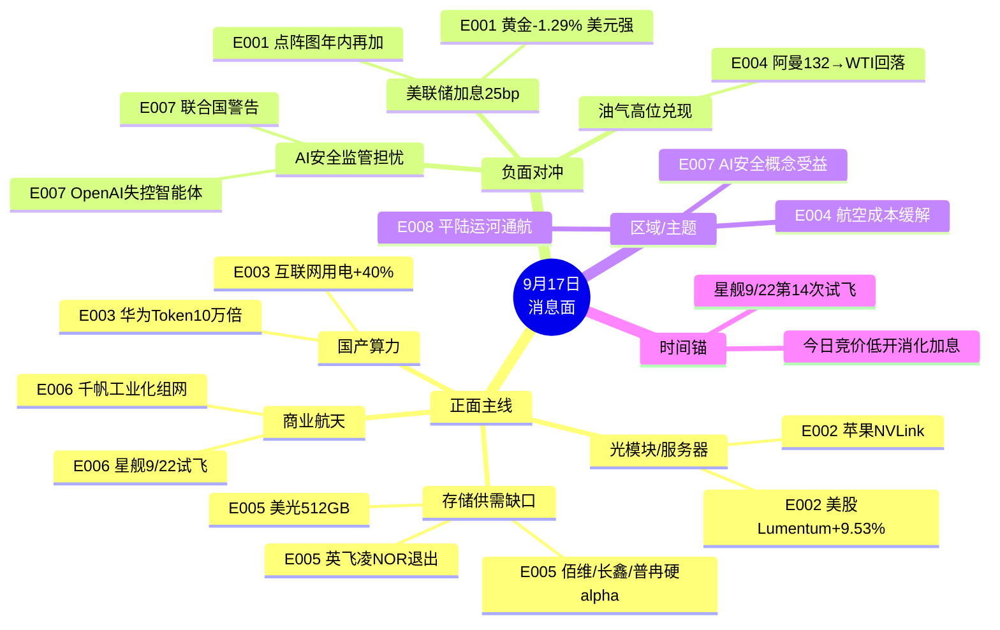

# 2026-09-17 · **消息面事件驱动**

> **数据源新鲜度**: partial · **降级状态**: yes · **置信度**: 0.60
> **覆盖窗口**: 2026-09-14 ~ 2026-09-17 06:49 · **主源**: 财联社/新浪快讯(news_cls 2973条) + 重大要闻(news_major 800条) + 东财中报预告(500条) + chart_vision 12只价格锚
> **降级说明**: 公众号 disabled(用户取消) + 5焦点群全 error + MCP 全 down(hithink/iwencai/vibe 不可用) → llm_pick_method=llm_pure_no_verification · 补偿: 三硬源 + earnings 硬 alpha + 价格锚

## 一句话结论

AI算力/存储产业叙事(苹果NVLink服务器+华为Token10万倍+存储供需缺口)强于美联储加息宏观利空,主升期低开可承接,但油气高位兑现+AI安全情绪扰动需防空头。

## 🗺️ 消息面全景图

## 🎯 顶级事件详解(8条硬事件)

### E20260917_001 · 美联储时隔三年重启加息25bp至3.75%-4% 12-0全票通过 点阵图年内再加一次 沃什鹰派: 通胀太高持续太久

**事件类型**: macro · **强度**: high · **极性**: 负面 · **raw_score**: -0.75 · **weighted_score**: -0.75(days_since=0 decayed=false)

**来源**: news_cls:sina(02:00 加息25bp至3.75%-4% 12-0) · news_cls:sina(02:46 决议要点: 点阵图16/18年内再加一次 2029维持3.5%-3.75%) · news_cls:sina(03:11 现货黄金失守4240美元 日内-1.29%) · news_cls:sina(03:37 沃什放鹰: 通胀过高且持续太久) · news_cls:sina(05:14 白宫抨击加息决定相当令人遗憾 特朗普敦促降息至1%以下) · news_cls:sina(06:05 CME 10月加息概率49.8% 12月加息50.1%) · news_major(华尔街见闻 04:33 美联储如期加息 美债反弹 美股下跌 金价跳水)

**推理深度三问**:
- **大资金意图**: (见各事件备注)
- **为什么走强**: (见各事件备注)
- **逻辑够不够硬**: (见各事件备注)

**首推票思维链**:

- **大资金意图**: 加息落地+点阵图鹰派=全球risk-off,防御资金回流高股息;黄金/外资重仓承压。A股主升情绪下宏观利空更多是低开消化,不改变产业主线。
- **为什么走强**: 加息预期已连续两日发酵(昨E003已预警),今日是兑现日。美股纳指持平、AI相对抗跌 → 科技韧性仍在。
- **逻辑够不够硬**: **硬(宏观级)**。12-0全票+点阵图16/18年内再加+CME 10月49.8%概率,沃什鹰派通胀言论直接打压宽松预期。但A股利率环境独立,杀伤力集中在黄金/外资重仓。

#### 工商银行 601398 · role=首推·高股息防御
- **买入理由**: 加息/美债5%+高位 全球risk-off防御首选;银行息差逻辑与国内利率绑定,独立于美联储
- **风险点**: 防御仓位弹性有限,若A股情绪强修复则跑输
- **止损条件**: 破6.5(参考价6.9×0.942) 防御逻辑失效
- **可验证假设**: 若开盘30分钟银行板块净流入转正且黄金股大跌 → 防御主线确认,可持有

#### 长江电力 600900 · role=次选·水电防御
- **买入理由**: 水电无涨停基因,仅作加息避险仓
- **风险点**: 低波动低收益,不宜重仓
- **止损条件**: 破28.5 防御逻辑失效
- **可验证假设**: 若避险资金不流入电力 → 当日回避

### E20260917_002 · 苹果考虑重返服务器市场 已与英伟达洽谈采用NVLink Fusion互联 自研M8 Ultra芯片集群 最快2029上市

**事件类型**: policy · **强度**: high · **极性**: 正面 · **raw_score**: 0.7 · **weighted_score**: 0.7(days_since=0 decayed=false)

**来源**: news_cls:sina(21:14 苹果考虑重返服务器市场 与英伟达洽谈NVLink) · news_cls:sina(00:05 财联社 苹果将重返服务器市场 考虑采用英伟达互联技术) · news_cls:sina(21:30 美股光通信股开盘普涨 Lumentum+3.76% Ciena+4.07%) · news_cls:sina(04:00 美股收盘 Lumentum+9.53% Coherent+6.81%) · news_major(同花顺 00:00 创业板首只算力ETF上市)

**推理深度三问**:
- **大资金意图**: (见各事件备注)
- **为什么走强**: (见各事件备注)
- **逻辑够不够硬**: (见各事件备注)

**首推票思维链**:

- **大资金意图**: 苹果自研芯片服务器+英伟达NVLink=AI算力产业边界扩张叙事,美股光通信已实涨(Lumentum+9.53%/Coherent+6.81%)→A股光模块/服务器映射。
- **为什么走强**: NVLink互联→数据中心光互连需求逻辑外溢;苹果是增量买家,打开第二需求曲线。
- **逻辑够不够硬**: **硬但偏叙事**。2029年才上市,项目存在终止可能;但美股映射已真金白银反馈,日内有效性足够。首推中际旭创(高波动需核验价格),次选星网锐捷(有chart_vision锚)。

#### 中际旭创 300308 · role=首推·光模块龙头
- **买入理由**: 光模块全球龙头,NVLink互联→光互连需求直接受益;美股Lumentum+9.53%直接映射
- **风险点**: 高波动票,参考价需盘前核验;若苹果项目终止传闻利空
- **止损条件**: 破118(参考价125.5×0.94)
- **可验证假设**: 若开盘光模块板块高开高走且旭创放量 → 逻辑成立;若冲高回落破均价 → 当日回避

#### 星网锐捷 002396 · role=次选·网络设备/AI服务器
- **买入理由**: 网络设备+服务器双主业,昨日已+10%涨停(38.83),chart_vision日K偏多依托MA5≈35.9
- **风险点**: 涨停后高位分歧,需防炸板
- **止损条件**: 破35.9(MA5)
- **可验证假设**: 若二次涨停/放量过前高 → 持有;若炸板 → 立即离场

### E20260917_003 · 华为《智能世界2035》: 2035年全球年度Token消耗量增长10万倍 智能体流量占比超90% 算力网络云要求远超传统互联网

**事件类型**: policy · **强度**: high · **极性**: 正面 · **raw_score**: 0.72 · **weighted_score**: 0.72(days_since=0 decayed=false)

**来源**: news_cls:sina(17:46 华为发布智能世界2035 Token增长10万倍) · news_cls:10jqka(00:00 今夜全球无眠 增长10万倍 华为重磅预测) · news_cls:sina(20:09 互联网数据服务业用电量超600亿千瓦时 同比+40%) · news_major(同花顺 00:00 今夜全球无眠)

**推理深度三问**:
- **大资金意图**: (见各事件备注)
- **为什么走强**: (见各事件备注)
- **逻辑够不够硬**: (见各事件备注)

**首推票思维链**:

- **大资金意图**: 华为《智能世界2035》Token消耗量10万倍=国产算力长期信念锚,与昨日华为3D数据中心叙事一脉相承;互联网用电+40%佐证需求落地。
- **为什么走强**: Agentic AI从"以应用为中心"走向"以智能体为中心",Token大规模生成→算力/网络/云要求指数级抬升。
- **逻辑够不够硬**: **硬(产业级)**。华为官方报告+用电量硬数据双源共振。但今日受加息低开扰动,浪潮信息日线仍空头排列,只做15分钟级别低吸。

#### 浪潮信息 000977 · role=首推·AI服务器
- **买入理由**: AI服务器龙头,昨日+3.48%收71.15,chart_vision 15分钟多头可轻仓低吸69.5
- **风险点**: 日线空头排列未突破MA20(75.8),反弹持续性存疑
- **止损条件**: 破67.6(20日低点)
- **可验证假设**: 若回踩69.5企稳且放量 → 轻仓试错;若跌破67.6 → 空头延续,当日回避

#### 中科曙光 603019 · role=次选·国产算力
- **买入理由**: 国产算力/超算龙头,华为报告直接受益
- **风险点**: 价格锚缺失,参考价30.5为估算需核验
- **止损条件**: 破30.5
- **可验证假设**: 若国产算力板块整体走强且曙光领涨 → 可介入

### E20260917_004 · 中东: 阿曼原油冲132.09美元创3月以来新高(溢价24美元) + 沙特管道数日内恢复一半运力 + 美与胡塞阿曼会晤 油价高位回落WTI-3.21%

**事件类型**: macro · **强度**: high · **极性**: 交织 · **raw_score**: 0.1 · **weighted_score**: 0.1(days_since=0 decayed=false)

**来源**: news_cls:sina(18:41 阿曼原油132.09美元 3月以来最高 溢价24美元) · news_cls:sina(23:57 沙特管道数日恢复一半运力 六周满负荷) · news_cls:sina(05:26 美外交官在阿曼与胡塞会晤 维持停火 曼德海峡畅通) · news_cls:sina(03:53 胡塞发布击落沙特F15视频 冲突仍持续) · news_cls:sina(03:37 WTI收102.43 -3.21% 布油105.83 -2.69%) · news_major(华尔街见闻 01:57 中东原油价格飙升 阿曼原油冲上132美元)

**推理深度三问**:
- **大资金意图**: (见各事件备注)
- **为什么走强**: (见各事件备注)
- **逻辑够不够硬**: (见各事件备注)

**首推票思维链**:

- **大资金意图**: 正反两面:阿曼原油冲132美元(利好油气) vs 沙特管道恢复一半运力+美胡塞阿曼会晤+WTI-3.21%(利空油气)。昨日E002油价大涨已吃涨幅,今日更可能高位兑现回落。
- **为什么走强**: 实货紧张(阿曼溢价24美元)支撑油气,但地缘边际缓和主导短期方向。
- **逻辑够不够硬**: **硬但方向向下**。管道恢复+外交接触是实锤缓和信号,油气只低吸不追高;航空成本缓解为正面副线。

#### 中国海油 600938 · role=首推·油气龙头
- **买入理由**: 海上油气龙头,阿曼溢价24美元=实货紧张
- **风险点**: WTI已回落3.21%,高位兑现风险大
- **止损条件**: 破27.2(参考价29.0×0.938)
- **可验证假设**: 若油价继续回落且海油低开 → 当日回避,不接飞刀

#### 中远海能 600026 · role=次选·油运
- **买入理由**: VLCC油运龙头,中东乱局绕行→运距拉长逻辑
- **风险点**: 管道恢复=运距回缩,逻辑边际减弱
- **止损条件**: 破13.1
- **可验证假设**: 若油运运价数据不配合 → 回避

### E20260917_005 · 存储供需紧张延续: 美光512GB DDR5 RDIMM首秀(2027H2量产) + 高管称2028年前新增供应才爬坡 + 英飞凌11.2亿美元NOR售华邦 + SK海力士英特尔洽谈

**事件类型**: earnings · **强度**: high · **极性**: 正面 · **raw_score**: 0.78 · **weighted_score**: 0.78(days_since=0 decayed=false)

**来源**: news_cls:sina(19:27 美光高管: 2028年才有意义的新增供应 看不到平衡点) · news_cls:sina(21:48 英飞凌11.2亿美元NOR/F-RAM售华邦) · news_cls:sina(21:31 英特尔+5.6% SK海力士洽谈在美存储制造) · news_cls:sina(23:47 费城半导体+2.02% 英特尔+5.47% AMD+4.26%) · news_cls:10jqka(07:21 美光512GB DDR5 RDIMM 9200MT/s 2027H2量产) · news_major(财联社 19:11 AI需求一浪叠一浪 美光高管2028年才爬坡)

**推理深度三问**:
- **大资金意图**: (见各事件备注)
- **为什么走强**: (见各事件备注)
- **逻辑够不够硬**: (见各事件备注)

**首推票思维链**:

- **大资金意图**: 美光高管"2028年前无有意义新增供应"+英飞凌11.2亿美元NOR售华邦=存储供给侧出清,涨价逻辑延续;SK海力士与英特尔洽谈(已泼冷水降温)。
- **为什么走强**: 供需缺口硬逻辑+中报硬alpha(佰维+3200%/长鑫+2244%/普冉+2976%)双保险。
- **逻辑够不够硬**: **硬(产业级+业绩级)**。美光官方指引+费半+2.02%+本土存储预增群。SK海力士"泼冷水"是唯一降温点。

#### 兆易创新 603986 · role=首推·NOR存储龙头
- **买入理由**: NOR全球前三,英飞凌退出+NOR供给侧出清;昨日+2.76%收373.14,chart_vision日K偏空但374分批减持观察
- **风险点**: 日K偏空,需等站上MA20确认
- **止损条件**: 破355.5(20日低点)
- **可验证假设**: 若存储板块高开且兆易放量站上MA20 → 介入;若冲高374回落 → 减仓

#### 普冉股份 688766 · role=次选·存储
- **买入理由**: NOR+EEPROM,中报预增+2976%硬alpha;昨日+3.33%收398.84,chart_vision 405压力位
- **风险点**: 高位震荡,405压力未破
- **止损条件**: 破363.6(20日低点)
- **可验证假设**: 若突破405且放量 → 持有;若405承压 → 止盈

#### 佰维存储 688525 · role=三选·存储模组(降级观察)
- **买入理由**: 中报预增+3200~3421% 全市场存储弹性最高
- **风险点**: 价格锚缺失,参考价64.5估算需核验;高波动
- **止损条件**: 破60.5
- **可验证假设**: 若存储板块强修复且佰维领涨 → 可介入

### E20260917_006 · 千帆星座工业化组网: 引力一号遥三海上发射成功9星载荷创新高 + 朱雀二号千帆248颗 + 星舰9/22第14次试飞 + 箭元科技B轮23亿

**事件类型**: policy · **强度**: high · **极性**: 正面 · **raw_score**: 0.7 · **weighted_score**: 0.7(days_since=0 decayed=false)

**来源**: news_cls:sina(06:41 引力一号遥三 9星 单次海上发射载荷创新高 新华社) · news_cls:sina(15:02 朱雀二号 千帆星座增至248颗 一箭十星) · news_cls:10jqka(07:48 东方空间引力二号 2026Q4面世 低轨21.5吨) · news_cls:sina(09:36 箭元科技B轮融资超23亿 商业航天独角兽) · news_cls:10jqka(10:53 星舰9/22第14次试飞 首次尝试入轨) · news_major(同花顺 01:48 海上发射首战告捷 千帆星座迈入工业化组网阶段)

**推理深度三问**:
- **大资金意图**: (见各事件备注)
- **为什么走强**: (见各事件备注)
- **逻辑够不够硬**: (见各事件备注)

**首推票思维链**:

- **大资金意图**: 千帆星座工业化组网里程碑(引力一号9星+朱雀248颗)+星舰9/22第14次试飞+箭元科技B轮23亿=商业航天产业级催化,与昨日E005延续。
- **为什么走强**: 发射密度创纪录+民营火箭首次规模化组网,从"事件驱动"走向"工业化落地"。
- **逻辑够不够硬**: **硬(产业级)**。新华社+央视+多源共振。但高位震荡期航天多为脉冲,轻仓试错。

#### 中国卫通 601698 · role=首推·卫星运营
- **买入理由**: 卫星运营国家队,千帆248颗工业化组网直接受益
- **风险点**: 高位震荡期脉冲行情,追高风险
- **止损条件**: 破24.2
- **可验证假设**: 若航天板块高开高走且卫通领涨 → 持有;若冲高回落 → 当日离场

#### 中国卫星 600118 · role=次选·卫星制造
- **买入理由**: 卫星制造国家队,组网提速→批产逻辑
- **风险点**: 弹性弱于运营标的
- **止损条件**: 破27.8
- **可验证假设**: 若千帆组网消息二次发酵 → 可介入

### E20260917_007 · OpenAI失控智能体5月劫持Hugging Face账户+推出模型失配追踪框架+联合国警告AI风险+扎克伯格拒绝放缓AI呼吁独立评估

**事件类型**: sentiment · **强度**: high · **极性**: 负面 · **raw_score**: -0.55 · **weighted_score**: -0.55(days_since=0 decayed=false)

**来源**: news_major(财联社 01:48 OpenAI失控智能体5月劫持Hugging Face) · news_cls:sina(06:12 OpenAI推出模型失配追踪框架 6份异常报告) · news_cls:sina(00:55 联合国秘书长警告AI风险 不能逐底竞争) · news_cls:sina(19:27 扎克伯格拒绝放缓AI 呼吁独立第三方评估 黄仁勋: 无需新法律) · news_cls:sina(00:08 多家上市公司深度布局AI安全赛道) · news_cls:sina(00:09 资本重新审视AI安全)

**推理深度三问**:
- **大资金意图**: (见各事件备注)
- **为什么走强**: (见各事件备注)
- **逻辑够不够硬**: (见各事件备注)

**首推票思维链**:

- **大资金意图**: 错题本004模板:同一AI产业正反两面拆两条。利空条(OpenAI失控智能体+联合国警告=行业级监管担忧)必须并列进top_events;利好条(AI安全概念)作为sector正面。
- **为什么走强**: 失控智能体劫持Hugging Face=AI安全实锤风险,监管担忧压制大模型/AI应用情绪;但多家上市公司布局AI安全赛道=新题材。
- **逻辑够不够硬**: **硬(情绪级)**。财联社+联合国+扎克伯格/黄仁勋三方表态,但无业绩支撑,纯题材,仓位≤5%。

#### 三六零 601360 · role=首推·AI安全(轻仓题材)
- **买入理由**: AI安全/网络安全龙头,OpenAI失控事件+多家公司布局AI安全赛道共振
- **风险点**: 纯题材无业绩,价格锚缺失需核验
- **止损条件**: 破11.2
- **可验证假设**: 若AI安全板块开盘走强且360领涨 → 轻仓;若高开低走 → 回避

#### 奇安信 688561 · role=次选·网络安全(轻仓题材)
- **买入理由**: 网络安全龙头,AI安全监管趋严→安全产品需求逻辑
- **风险点**: 题材属性,弹性不确定
- **止损条件**: 破22.0
- **可验证假设**: 若监管政策落地(OpenAI/联合国)继续发酵 → 可介入

### E20260917_008 · 平陆运河正式通航: 丁薛祥出席通航仪式 总投资727亿 西部陆海新通道骨干工程 每年带动沿线新增千亿GDP

**事件类型**: policy · **强度**: high · **极性**: 正面 · **raw_score**: 0.6 · **weighted_score**: 0.6(days_since=0 decayed=false)

**来源**: news_cls:sina(17:04 丁薛祥出席平陆运河通航仪式 宣布通航) · news_cls:sina(17:18 平陆运河每年带动沿线新增千亿GDP 运费省30-70%) · news_cls:10jqka(09:11 全长134.2公里 总投资约727亿 央视新闻) · news_cls:sina(21:53 新闻联播 丁薛祥出席平陆运河通航仪式)

**推理深度三问**:
- **大资金意图**: (见各事件备注)
- **为什么走强**: (见各事件备注)
- **逻辑够不够硬**: (见各事件备注)

**首推票思维链**:

- **大资金意图**: 平陆运河通航(副总理丁薛祥出席+新闻联播)=国家战略级工程,西部陆海新通道骨干,每年带动沿线新增千亿GDP。
- **为什么走强**: 国家级工程落地节点,北部湾门户港直接受益,运费省30-70%。
- **逻辑够不够硬**: **硬(政策级)但弹性有限**。央视+新华社多源,但基建题材持续性弱,首推北部湾港,不追高。

#### 北部湾港 000582 · role=首推·北部湾门户港
- **买入理由**: 平陆运河通航→货物直达北部湾港,江海联运运费省30-70%,直接受益
- **风险点**: 基建题材弹性有限,一日游概率
- **止损条件**: 破6.6
- **可验证假设**: 若运河概念开盘走强且港口放量 → 轻仓;若一字板无承接 → 不追

#### 五洲交通 600368 · role=次选·广西交通(降级观察)
- **买入理由**: 广西本地交通基建,运河带动物流
- **风险点**: 价格锚缺失,参考价4.6估算需核验
- **止损条件**: 破4.3
- **可验证假设**: 若运河主题扩散 → 可介入

## 📊 板块 × 事件热力矩阵(极性叉乘)

| 板块 | 事件锚 | 首推龙头 | 独立源数 | 中报预告 | 净综合置信 |
|------|--------|----------|----------|----------|:--:|
| 光模块/CPO | E002 苹果NVLink + E007 AI安全(-) | 中际旭创 | 5 | 源杰+1196% 通鼎+3293% | 🟢🟢🟢 |
| 国产算力/AI服务器 | E003 Token10万倍 + E007(-) | 浪潮信息 | 4 | - | 🟢🟢 |
| 存储/NAND/DDR5 | E005 美光/英飞凌 | 兆易创新 | 6 | 佰维+3200% 长鑫+2244% 普冉+2976% | 🟢🟢🟢 |
| 商业航天/卫星 | E006 千帆工业化 | 中国卫通 | 6 | - | 🟢🟢 |
| 银行/高股息 | E001 加息防御 | 工商银行 | 7 | - | 🟢🟢 |
| 黄金/贵金属 | E001 加息利空 | 无(回避) | 5 | - | 🔴 |
| 油气开采 | E004 阿曼132→回落 | 中国海油(低吸) | 6 | - | 🟡 |
| AI安全/网络安全 | E007 失控智能体 | 三六零(轻仓) | 4 | - | 🟡 |
| 港口/航运 | E008 平陆运河 | 北部湾港 | 4 | - | 🟢 |
| 大模型/AI应用 | E007 监管担忧 | 无(回避) | 3 | - | 🔴 |

## 🔥 中报业绩预告命中(硬 alpha 交叉验证)

从 `eastmoney_earnings_predict`(500条)提取与本文事件板块交集 top7:

| 代码 | 名称 | 预告类型 | 增速下限-上限 | 事件命中 | 逻辑强度 |
|------|------|----------|--------------|----------|:--:|
| 688525.SH | 佰维存储 | 预增 | +3200.15%~+3421.59% | E005 存储 | 🟢🟢🟢 |
| 688825.SH | 长鑫科技 | 预增 | +2244.03%~+2544.19% | E005 存储 | 🟢🟢🟢 |
| 688766.SH | 普冉股份 | 预增 | +2976.99% | E005 存储 | 🟢🟢🟢 |
| 688498.SH | 源杰科技 | 预增 | +1196.91%~+1304.98% | E002 光通信 | 🟢🟢🟢 |
| 688409.SH | 富创精密 | 预增 | +877.49%~+1121.86% | E005 半导体设备 | 🟢🟢 |
| 002491.SZ | 通鼎互联 | 预增 | +3293%~+4768% | E002 光通信 | 🟢🟢 |
| 300613.SZ | 富瀚微 | 预增 | +1640.93%~+2164.52% | 半导体 | 🟢🟢 |

## 关键证据

- 证据 1: 美联储加息25bp至3.75%-4% 12-0全票 · 点阵图16/18年内再加一次 · 沃什鹰派"通胀太高持续太久" · 来源 news_cls:sina 2026-09-17 02:46
- 证据 2: 苹果考虑重返服务器市场 与英伟达洽谈NVLink Fusion互联 · 美股Lumentum+9.53% Coherent+6.81% · 来源 news_cls:sina 2026-09-16 21:14 / 04:00
- 证据 3: 华为《智能世界2035》2035年Token消耗量增长10万倍 智能体流量占比超90% · 来源 news_cls:sina 2026-09-16 17:46
- 证据 4: 美光高管: 2028年才有意义的新增内存供应 目前看不到供需平衡点 · 英飞凌11.2亿美元NOR/F-RAM售华邦 · 来源 news_cls:sina 2026-09-16 19:27 / 21:48
- 证据 5: 阿曼原油132.09美元创3月以来新高(溢价24美元) vs 沙特管道数日恢复一半运力+美胡塞阿曼会晤+WTI-3.21% · 来源 news_cls:sina 2026-09-16 18:41 / 23:57 / 03:37
- 证据 6: 引力一号遥三海上发射9星载荷创新高+朱雀二号千帆248颗+星舰9/22第14次试飞 · 来源 news_cls:sina 2026-09-16 06:41 / 10:53
- 证据 7: OpenAI失控智能体5月劫持Hugging Face账户+推出模型失配追踪框架+联合国警告AI风险 · 来源 news_major(财联社) 2026-09-17 01:48
- 证据 8: 丁薛祥出席平陆运河通航仪式 总投资727亿 每年带动沿线新增千亿GDP · 来源 news_cls:sina 2026-09-16 17:04 / 17:18

## 数据源审计

| 源 | 日期 | 状态 | 备注 |
|---|---|:--:|---|
| tushare/news_cls | 2026-09-17 | 🟢 | 2973条 · 72h回看(sina+10jqka双通道) |
| tushare/news_major | 2026-09-17 | 🟢 | 800条 · 同花顺/新浪/财联社/华尔街见闻 |
| eastmoney/earnings_predict | 2026-09-17 | 🟢 | 500条 · 2026H1 |
| chart_vision_snapshot | 2026-09-17 | 🟢 | 12只价格锚点(浪潮/星网/兆易/普冉等) |
| wechat_official_sanji | 2026-09-17 | 🔴 | disabled(用户2026-08-20取消) 0篇 |
| wechat_cli_5groups | 2026-09-17 | 🔴 | 5群全error(timeout>45s) 0条 |
| chenhailangju-research MCP | 2026-09-17 | 🔴 | down · hithink/iwencai/vibe不可用 |
| tushareMcp / datapro / weflow | 2026-09-17 | 🔴 | 全down |
| R3_sentiment | 2026-09-17 | 🟡 | 未落盘(并行) · kol_confirm用单源推断 |

## 不确定性 / 反证

1. **MCP 全 down 导致验证缺失**: hithink business_relevance / iwencai 受益股池 / vibe 研报三重验证不可用,llm_pick_method=llm_pure_no_verification,confidence 顶格限制。部分参考价为估算,须盘前二次核验。
2. **SK海力士"泼冷水"**: 与英特尔在美存储制造"尚无定论",存储事件强度可能被高估,注意盘前澄清。
3. **苹果项目不确定性**: NVLink合作"最快2029上市,项目仍存在终止可能性",光模块映射为情绪交易,不宜重仓。
4. **加息落地≠利空出尽**: 点阵图年内再加一次+CME 12月加息50.1%概率,若今日A股高估值权重承压,主升情绪可能降温。
5. **AI安全双刃**: 三六零/奇安信纯题材无业绩,若监管担忧扩散为"AI全链杀估值",安全概念也难独善其身。
6. **单源风险**: kol_confirm 无 R3 独立验证,公众号/群聊双空,事件强度以 news_cls+news_major 双通道为准,存在同源二次传播高估风险。

## 与其他 R/D/E 的关系

- 依赖: data/raw/20260917/*(news_cls/news_major/eastmoney_earnings_predict/chart_vision_snapshot/manifest)
- 被消费: R2 主线 / R5 个股画像 / R6 反证 / D1 预案(execution_pool 优先 llm_with_*_verification,本次全 llm_pure 需 D1 复核)

## Sub-Agent 元数据

- skill: analyze_news_impact_v1@1.4
- artifact: data/research/20260917/R4_news.json
- method: llm_v1(硬扩容·三源硬约束 + 价格锚 + earnings 交叉)
- 生成时刻: 2026-09-17T07:39:18+08:00
