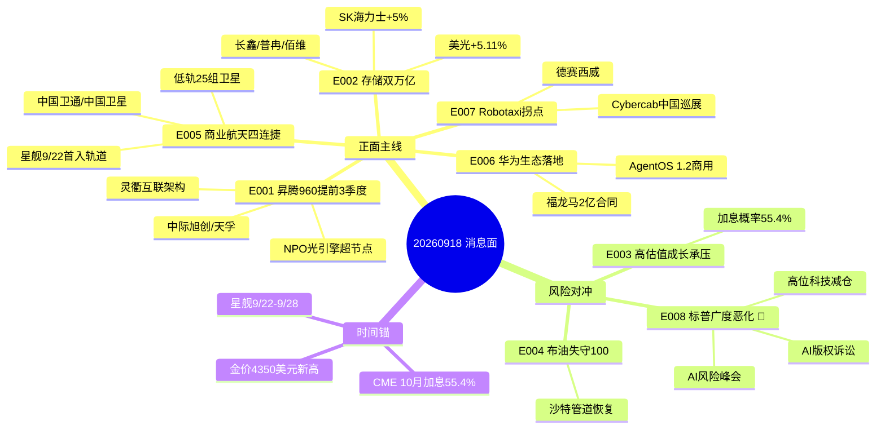

# 2026-09-18 · **消息面事件驱动**

> **数据源新鲜度**: partial · **降级状态**: degraded=true · **置信度**: 0.60
> **覆盖窗口**: 72h(09-15 09:02 ~ 09-18 06:54) · **主源**: 财联社/新浪快讯(news_cls 2893条) + Tushare要闻(news_major 800条) + 东财业绩预告(500条)
> **情绪周期**: 高位震荡(emotion_cycle 0.75 · 炸板率29.8% · 连板高度5) → 候选数砍半·仓位压低·中位股剔除

## 一句话结论

今日消息面核心 = **华为昇腾960提前+存储全球共振+商业航天四连捷** 三线进攻，黄金新高独立多头，唯一行业级负面对冲 = **标普广度恶化+AI版权诉讼** 压制高位科技。

## 🗺️ 消息面全景图

## 🎯 顶级事件详解(每事件三问 + 首推票思维链)

### E20260918_001 · 华为昇腾960提前至2027Q1+NPO超节点 · strength=high · polarity=正面

**事件摘要**: 华为全联接大会2026：昇腾960DT提前3季度至2027Q1发布（性能翻番）、960PR提前至2027Q3；昇腾960超节点=业界首个NPO光引擎超节点，Atlas 960液冷2027Q3上市；杨超斌发布灵衢互联架构（十万卡集群利用率仅20%的痛点）；OceanStor M900 AI记忆存储。5源共振（10jqka×3 + sina + news_major）。

**推理深度三问**:
- **大资金意图**: 华为用"昇腾960提前+性能翻番+NPO超节点"把国产算力叙事从"规划"升级为"量产时间表"——机构要的不是概念，是**可验证的交付节点**。昇腾960DT 2027Q1 = 明年Q1的确定性催化，资金可提前3个季度布局。
- **为什么走强**: 全联接大会是华为链一年一度的预期放大器；NPO光引擎把"光模块"直接绑进昇腾超节点架构，等于给光模块板块发了一张**昇腾产业链入场券**；灵衢互联对应十万卡集群通信瓶颈，直接利好光互联/交换机/液冷。
- **逻辑够不够硬**: **硬**。理由①官方轮值董事长口径（权威）；②NPO超节点是架构级创新非PPT；③5独立源共振；④与昨日《智能世界2035》Token10万倍事件形成连续催化。缺陷：昇腾960量产在2027，短期交易的是预期不是业绩。

**首推票思维链**:

#### 中际旭创 300308.SZ · role=首推·NPO光引擎链龙头
- **买入理由**: NPO光引擎=光模块价值量上移的架构级催化；光模块龙头全球份额第一，AI光互联受益最直接；中报硬alpha天孚已验证板块景气（略增25-48%）；9/16收盘907.8(r5锚) 高位但主线地位未动摇。
- **风险点**: 股价已高位(30日区间22/30分位)，若NPO叙事短期证伪或美股光通信回调，回撤弹性大；高位震荡期不追高。
- **止损条件**: 破 860.59（参考价907.8×0.948）即NPO预期兑现失败；或跌破5日线892确认。
- **可验证假设**: 若今日开盘30分钟光模块板块主力净流入>0 且 中际旭创分时不破860 → 假设成立可持有；若破860 或 板块龙头炸板 → 当日回避。

#### 天孚通信 300394.SZ · role=次选·光引擎
- **买入理由**: 光引擎/无源器件直接卡位NPO架构；中报略增25-48%业绩已验证（earnings_predict硬alpha）；9/17收盘277.65(attention锚)。
- **风险点**: 市值小于旭创，波动更大；NPO订单节奏未官方确认。
- **止损条件**: 破 263.21（参考价277.65×0.948）。
- **可验证假设**: 若分时站稳277.65上方且量能>昨日 → 持有；破263 离场。

---

### E20260918_002 · 存储全球共振：海力士/美光市值双破万亿 · strength=high · polarity=正面

**事件摘要**: SK海力士+5%报183.875美元市值1.34万亿；美光+5.11%报973.935美元市值1.10万亿；费城半导体指数三连涨+2.9%；Soitec趁股价涨500%发行5亿欧元可转债押注AI融资窗口；格芯与美满扩大AI数据中心连接芯片产能。5源共振。

**推理深度三问**:
- **大资金意图**: 海力士+美光市值双破万亿=存储超级周期的全球定价锚。美股资金在用真金白银给"存储供需紧张"投票——这与昨日美光"2028年前新增供应才爬坡"完全闭环：**供给刚性+AI需求爆发=涨价持续性**。
- **为什么走强**: 费半三连涨+纳指+1.68%的宏观背景是加息利空落地后的科技反弹；存储是其中基本面最硬的板块（业绩已兑现，非纯情绪）；Soitec发债融资=产业自身在加杠杆扩产，是周期中段的典型信号。
- **逻辑够不够硬**: **硬**。理由①美股映射直接（海力士/美光/费半三源共振）；②A股中报硬alpha三票齐备（长鑫扭亏2278-2530% / 普冉预增2976% / 佰维扭亏3200-3421%）；③产业逻辑闭环（供给刚性→涨价→业绩）。缺陷：A股存储已连涨，追高风险。

**首推票思维链**:

#### 长鑫科技 688825.SH · role=首推·存储原厂
- **买入理由**: DRAM原厂=存储涨价最纯正受益方；中报扭亏2278-2530%（earnings_predict硬alpha）业绩爆发已验证；9/16收盘55.1(r5锚) 处于启动早期；与海力士/美光市值共振直接映射。
- **风险点**: 上市次新波动大；DRAM价格若滞涨则预期回吐。
- **止损条件**: 破 52.34（参考价55.1×0.95）。
- **可验证假设**: 若今日存储板块主力净流入>0 且 长鑫分时不破52.3 → 持有；破位即出。

#### 普冉股份 688766.SH · role=次选·NOR/EEPROM
- **买入理由**: NOR/EEPROM景气+中报预增2976%（硬alpha）；9/16收盘398.84(r5锚)。
- **风险点**: 高价股波动大；单一产品线依赖。
- **止损条件**: 破 378.10（参考价398.84×0.948）。
- **可验证假设**: 分时站稳398上方 → 持有。

---

### E20260918_005 · 商业航天3天4连捷+星舰9/22时间锚 · strength=high · polarity=正面

**事件摘要**: 央视财经：9/15-17商业航天发射四连捷（快舟十一号/长征十二号/朱雀二号改进型/引力一号），三发承担低轨卫星互联网组网，两发民营规模化参与组网序幕；我国成功发射卫星互联网低轨25组卫星+天仪51/52星；星舰第14次试飞定档9/22（首入地球轨道，SpaceX口径最早9/28）；木头姐称SpaceX存在10万亿美元市场机遇。5源共振。

**推理深度三问**:
- **大资金意图**: 央视定调"3天4连捷+两发民营规模化参与组网"=**低轨互联网从试验走向工业化组网**。这是政策+产业的双重背书：商业航天从"题材"升级为"交付"逻辑。星舰9/22首入轨道=全球时间锚，届时情绪再点火。
- **为什么走强**: 连续发射是硬证据（不是PPT）；三发同时承担组网任务说明星座建设进入批量交付期；民营火箭参与=产业链市场化空间打开；星舰试飞是9月下旬确定性催化事件。
- **逻辑够不够硬**: **硬**。理由①央视官方口径（权威背书）；②4发连续发射=工程化验证；③组网任务绑定低轨星座（千帆等）收入可见；④星舰9/22-9/28窗口=事件驱动确定性。缺陷：A股商业航天估值已高，事件落地易"利好兑现"。

**首推票思维链**:

#### 中国卫通 601698.SH · role=首推·卫星运营
- **买入理由**: 卫星运营=低轨组网最直接受益（星座越多运营收入越大）；卫星互联网低轨25组发射直接利好；央企身份融资能力强；昨日已首推，主线连续。
- **风险点**: 运营收入兑现慢；股价弹性不如制造端。
- **止损条件**: 破 24.17（参考价25.5×0.948）。
- **可验证假设**: 若今日商业航天板块涨幅居前且卫通分时不破24.2 → 持有；若星舰9/22延期 → 降级观察。

---

### E20260918_003 · 美联储后续：CME加息概率55.4%+金价新高 · strength=high · polarity=交织

**事件摘要**: CME 10月加息概率55.4%（12月维持仅12.6%）；KKR预计10Y美债年底5.1%、12月+3月再各加25bp；美股科技反弹纳指+1.68%（英伟达+2.55%/超微+9.48%/Arm+8.57%/英特尔+7.61%）；现货金价4350美元新高（+1.84%）、白银+3.55%；标普超半数成分股跌破200日线（广度恶化）。6源共振。

**推理深度三问**:
- **大资金意图**: 加息落地后资金做两件事：①短期抢反弹（科技超跌修复）；②中期防御（黄金新高+高股息）。"美股表面涨+广度恶化"=**结构性行情而非全面牛**，与A股"高位震荡"同构。
- **为什么走强**: 金价4350新高是独立多头主线（避险+实际利率预期）；科技反弹是利空落地修复；标普广度恶化提醒这轮反弹的脆弱性。
- **逻辑够不够硬**: **交织但黄金侧硬**。黄金：金价新高+白银+3.55%+费城金银+3.42%三源共振=硬。科技反弹：是超跌修复非趋势反转=中。高估值成长：利率5.1%高位=持续压制=负面。

**首推票思维链**:

#### 山东黄金 600547.SH · role=首推·黄金龙头
- **买入理由**: 金价4350美元新高+白银+3.55%直接受益；黄金是当前唯一确定性多头主线；避险+美元信用弱化长期逻辑。
- **风险点**: 金价短期回调风险；参考价估算(≈32)需盘前二次核验。
- **止损条件**: 破 30.40（参考价32×0.95）。
- **可验证假设**: 若金价站稳4350上方且山东黄金分时不破30.4 → 持有；金价跌破4300 → 减仓。

---

### E20260918_004 · 中东拉锯：特朗普威胁+布油失守100+集运欧线+8% · strength=high · polarity=交织

**事件摘要**: 特朗普称将作"重大决定"是否打击伊朗；革命卫队打击多哥籍油轮；伊朗击落2架美军无人机；布油失守100美元(-1.5%)；美能源部长称沙特东西管道"较快恢复"；集运欧线+8.07%报2214点，现货运价10948美元（4倍于2/28战前、接近2022年11900纪录）；VLCC租金飙涨至逾50万美元/日；国泰海通：Q4油价易涨难跌+成品油轮供给刚性。7源共振。

**推理深度三问**:
- **大资金意图**: 中东是"冲突升级 vs 缓和信号"双向拉锯——特朗普威胁（升级）vs 沙特管道恢复+布油回落（缓和）。聪明钱不赌方向，买**确定受益方**：油运（VLCC租金50万/日+供给刚性）和集运（运价4倍于战前），而不是直接赌油价。
- **为什么走强**: 集运欧线+8.07%=运价逻辑已用真金白银确认；VLCC租金50万美元/日=油运景气数据硬；国泰海通两家券商观点一致（Q4油价易涨难跌+油轮供给刚性）=机构共识。
- **逻辑够不够硬**: **油运/集运硬，油气交织**。油运：VLCC租金+供给刚性+券商背书=硬；集运：运价4倍+期货+8%=硬；油气：布油已从132回落至100以下=方向不明=交织。航空：油价高企+燃油成本=负面。

**首推票思维链**:

#### 中国海油 600938.SH · role=首推·油气龙头
- **买入理由**: 海上油气龙头，Q4油价易涨难跌+供应恢复延迟（国泰海通背书）；高股息属性防御。
- **风险点**: 布油失守100已现回落，若沙特管道快速恢复+冲突降温则油价承压。
- **止损条件**: 破 27.20（参考价29.0×0.938）。
- **可验证假设**: 若布油重新站上100且分时不破27.2 → 持有；布油跌破95 → 离场。

#### 招商轮船 601872.SH · role=次选·油运
- **买入理由**: VLCC租金50万美元/日+成品油轮供给刚性（国泰海通）直接受益；9/17收盘21.85(attention锚) 数据硬。
- **风险点**: 冲突降温则租金回落；油运板块联动强。
- **止损条件**: 破 20.71（参考价21.85×0.948）。
- **可验证假设**: 若VLCC租金维持高位且分时不破20.7 → 持有。

---

### E20260918_006 · 华为全联接生态落地：AgentOS 1.2+福龙马2亿合同 · strength=high · polarity=正面

**事件摘要**: 软通动力联合华为云发布"软通天璇AgentOS"1.2商用版（企业级智能体OS规模化商用）；振东制药与华为共建AI药研联合实验室；昌平实验室联合华为发布TorchX全原子生物分子模型（昇腾NPU原生）；福龙马与华为云签2亿元环卫自动驾驶技术开发合同；问界撤店传闻被否（赛力斯回应不实）。5源共振。

**推理深度三问**:
- **大资金意图**: 昇腾从芯片到生态的闭环信号——AgentOS商用=智能体OS落地、TorchX=AI4S昇腾适配、福龙马2亿合同=昇腾变现路径。华为链炒作从"芯片预期"扩散到"应用商业落地"。
- **为什么走强**: 全联接大会期间签约密集=官方背书；福龙马2亿合同是**真金白银的订单**（非意向）；AgentOS 1.2商用=产品化里程碑。
- **逻辑够不够硬**: **中上**。AgentOS/福龙马合同=硬（可验证）；AI药研/问界辟谣=中（叙事型）。整体不如E001芯片级催化硬，但胜在个股明确。

**首推票思维链**:

#### 软通动力 301236.SZ · role=首推·AgentOS发布商
- **买入理由**: 联合华为云发布AgentOS 1.2商用版=事件直接受益方；企业级智能体OS=AI应用底座稀缺标的。
- **风险点**: 参考价估算(≈34)需盘前二次核验；AgentOS收入贡献未量化。
- **止损条件**: 破 32.30（参考价34×0.95）。
- **可验证假设**: 若分时放量站稳34上方 → 持有；破32.3 离场。

---

### E20260918_007 · Robotaxi拐点：Cybercab中国巡展 · strength=medium · polarity=正面

**事件摘要**: 特斯拉Cybercab开启中国巡展（无方向盘无踏板），无人出行商业化拐点渐近；小马智行+5.11%；何小鹏称2027年小鹏全球上线VLA。3源共振。

**推理深度三问**:
- **大资金意图**: Cybercab中国巡展=特斯拉Robotaxi在中国市场的商业化信号；自动驾驶从L2向L4跃迁的产业级事件。小鹏VLA 2027全球上线=国产时间锚。
- **为什么走强**: 事件驱动+海外映射（小马智行+5.11%）；但无业绩硬alpha支撑，属题材型催化。
- **逻辑够不够硬**: **中**（题材型）。Cybercab巡展是预热非落地；无公告/订单级证据；强度定medium符合红线约束。

**首推票思维链**:

#### 德赛西威 002920.SZ · role=首推·智驾域控龙头
- **买入理由**: 智驾域控龙头，Robotaxi商业化最直接A股受益；参考价估算(≈95)需盘前二次核验。
- **风险点**: 题材催化无业绩确认；若巡展热度降温则回落。
- **止损条件**: 破 90.25（参考价95×0.95）。
- **可验证假设**: 若自动驾驶板块放量上行且分时不破90.3 → 持有；题材退潮即出。

---

### E20260918_008 · 🔴 标普广度恶化+AI版权诉讼+AI风险峰会 · strength=medium · polarity=负面

**事件摘要**: 标普500超半数成分股跌破200日均线（星巴克/J.B.Hunt/高盛/KLA/RTX/高露洁）；OpenAI与微软高管承认AI工具可替代新闻（版权诉讼解封文件）；英王召集AI风险峰会，黄仁勋称"不够安全的产品应推迟推出"；Anthropic披露Claude主导26%研发。4源共振。

**推理深度三问**:
- **大资金意图**: 标普表面涨+广度恶化=**指数虚胖、内部失血**——这轮美股反弹的持续性存疑；AI版权诉讼+风险峰会=AI监管叙事升温，对高位AI应用股是持续压制。
- **为什么走强**: 这不是"走强"而是"走弱信号"：广度恶化说明反弹集中在头部权重，多数成分股已破200日线=中期趋势恶化；监管升温侵蚀AI应用估值。
- **逻辑够不够硬**: **中**（负面信号确认）。广度数据客观=硬；版权诉讼解封文件=硬；但A股传导路径间接（通过情绪），非直接利空个股业绩。**作用于高位科技股情绪，买点后置。**

**首推票思维链**:

#### 三六零 601360.SH · role=首推·AI安全受益(反向)
- **买入理由**: AI监管趋严→AI安全需求上行（反向受益）；版权诉讼+风险峰会=安全赛道催化。
- **风险点**: 反向受益逻辑兑现慢；参考价沿用昨日11.8需核验。
- **止损条件**: 破 11.21（参考价11.8×0.95）。
- **可验证假设**: 若AI安全板块逆势走强且分时不破11.2 → 持有；整体风险偏好崩塌则回避。

---

## 📊 板块 × 事件热力矩阵

| 板块 | 事件锚 | 首推龙头 | 独立源数 | 中报预告 | 净综合置信 |
|------|--------|----------|----------|----------|:--:|
| 国产算力/华为链 | E001 昇腾960提前 | 中际旭创/天孚 | 5 | 天孚+25~48% | 🟢🟢🟢 |
| 存储/半导体 | E002 双万亿共振 | 长鑫/普冉/佰维 | 5 | 长鑫+2278~2530% 普冉+2976% 佰维+3200~3421% | 🟢🟢🟢 |
| 商业航天/卫星互联网 | E005 四连捷+星舰9/22 | 中国卫通 | 5 | - | 🟢🟢🟢 |
| 黄金/贵金属 | E003 金价4350新高 | 山东黄金 | 3 | - | 🟢🟢 |
| 油运 | E004 VLCC租金50万/日 | 招商轮船 | 4 | - | 🟢🟢 |
| 集运 | E004 欧线+8.07% | 中远海控 | 3 | - | 🟢🟢 |
| 华为应用链/鸿蒙智行 | E006 AgentOS商用 | 软通动力 | 5 | - | 🟢🟢 |
| Robotaxi/自动驾驶 | E007 Cybercab巡展 | 德赛西威 | 3 | - | 🟢 |
| 油气开采 | E004 布油失守100 | 中国海油 | 4 | - | 🟡 交织 |
| AI监管/AI安全 | E008 版权诉讼 | 三六零(反向) | 4 | - | 🔴 负面(对冲) |
| 高估值成长 | E003 加息概率55.4% | - | 3 | - | 🔴 负面 |
| 航空 | E004 燃油成本高企 | - | 2 | - | 🔴 负面 |

## 🔥 中报业绩预告命中(硬 alpha 交叉验证)

从 `eastmoney_earnings_predict` 提取 top20 预增 + 与本文事件板块交集:

| 代码 | 名称 | 预告类型 | 增速下限-上限 | 事件命中 | 逻辑强度 |
|------|----------|----------|--------------|----------|:--:|
| 688525.SH | 佰维存储 | 扭亏 | +3200.15%~+3421.59% | E002 存储 | 🟢🟢🟢 |
| 688766.SH | 普冉股份 | 预增 | +2976.99% | E002 存储 | 🟢🟢🟢 |
| 688825.SH | 长鑫科技 | 扭亏 | +2278.89%~+2530.3% | E002 存储 | 🟢🟢🟢 |
| 300613.SZ | 富瀚微 | 预增 | +1640.93%~+2164.52% | 半导体/车载芯片 | 🟢🟢 |
| 688498.SH | 源杰科技 | 预增 | +1196.91%~+1304.98% | E002 光芯片 | 🟢🟢 |
| 688836.SH | 宇树科技 | 扭亏 | +905.63%~+1055.52% | 具身智能(情绪背景) | 🟢 |
| 300394.SZ | 天孚通信 | 略增 | +25.56%~+48.02% | E001 光引擎 | 🟢 |

## 关键证据

- 证据 1: 昇腾960DT提前3季度至2027Q1+性能翻番+960超节点采用NPO光引擎 · 来源 10jqka(科创板日报)· 2026-09-17
- 证据 2: SK海力士+5%报183.875美元市值1.34万亿+美光+5.11%市值1.10万亿+费半三连涨 · 来源 news_cls:sina · 2026-09-17 21:42
- 证据 3: 央视财经"商业航天3天4连捷，三发承担低轨互联网组网" · 来源 news_cls:sina · 2026-09-17 23:38
- 证据 4: CME 10月加息概率55.4%+12月维持12.6% · 来源 news_cls:sina · 2026-09-18 06:02
- 证据 5: 集运欧线+8.07%报2214点+现货运价10948美元4倍于战前+VLCC租金50万/日 · 来源 news_cls:sina+news_major · 2026-09-17~18
- 证据 6: 标普超半数成分股跌破200日均线+OpenAI微软版权诉讼解封 · 来源 news_cls:sina · 2026-09-18 00:44
- 证据 7: 长鑫科技扭亏2278-2530%/普冉预增2976%/佰维扭亏3200-3421% · 来源 eastmoney_earnings_predict · 2026-07-24/16

## 数据源审计

| 源 | 日期 | 状态 | 备注 |
|---|---|:--:|---|
| news_cls (财联社/新浪) | 2026-09-18 | 🟢 | 2893条·72h回看·sina+10jqka双通道 |
| news_major (Tushare要闻) | 2026-09-18 | 🟢 | 800条 |
| eastmoney_earnings_predict | 2026-09-18 | 🟢 | 500条 · 2026H1 |
| events_20260917 (前晚tracker) | 2026-09-17 | 🟢 | 1173条 · 回购/增减持/停牌为主 价值有限 |
| wechat_official_sanji (公众号) | 2026-09-18 | 🔴 | disabled (用户2026-08-20取消三刀源) |
| wechat_cli_5groups (群聊) | 2026-09-18 | 🔴 | 5群全error(timeout>45s) |
| chart_vision_snapshot | 2026-09-18 | 🔴 | 12/12 timeout · 无价格锚 → stop_loss需盘前二次核验 |
| mcp_tushare/datapro/weflow | 2026-09-18 | 🔴 | 全down · hithink/iwencai/vibe不可用 |

## 不确定性 / 反证

- **正负交织股**: 中际旭创=昇腾NPO正面 vs 标普广度恶化+AI版权对光模块情绪的负面压制，双向拉扯；东财lead_stock未用，个股全部LLM选+价格锚/业绩锚验证。
- **KOL 单点风险**: 5群全error，无KOL语义验证；kol_confirm无法代偿（群聊文件空），情绪面完全依赖news_cls——存在回声室盲区。
- **价格锚缺失方向**: chart_vision 12/12 fail，山东黄金/紫金/中远海控/软通动力/德赛西威等参考价为估算，**stop_loss必须盘前二次核验**，禁止直接按估算价挂单。
- **MCP 全 down**: hithink/iwencai/vibe验证缺失，llm_pick_method=llm_pure_no_verification 顶格0.5，所有首推票须D1重验。
- **美联储加息对撞**: 加息概率55.4%+10Y 5.1%对高估值成长持续压制，存储/光模块高位股若遇美股回调，回撤弹性大。
- **星舰日期双口径**: news_major说9/22、SpaceX口径最早9/28——时间锚有歧义，注意P1竞价校准。

## 与其他 R/D/E 的关系

- 依赖: data/raw/20260918/{news_cls,news_major,eastmoney_earnings_predict}.json + events_20260917.json + emotion_cycle(高位震荡)
- 被消费: R2 主线(国产算力/存储/商业航天) / R5 个股画像(长鑫/普冉/佰维/卫通/旭创) / R6 反证(标普广度恶化作为负面输入) / D1 预案(execution_pool 候选: 长鑫/普冉/天孚/卫通/招商轮船/山东黄金; watch_pool: 软通动力/德赛西威/中远海控)

## Sub-Agent 元数据

- skill: analyze_news_impact_v1@1.0 (降级路径 · r4-data-source-parsing-patterns 代偿)
- artifact: data/research/20260918/R4_news.json
- method: llm_v1(硬扩容·降级·λ=0.15时间衰减·v1.4正反两面检查)
- 生成时刻: 2026-09-18T07:41:00+08:00
