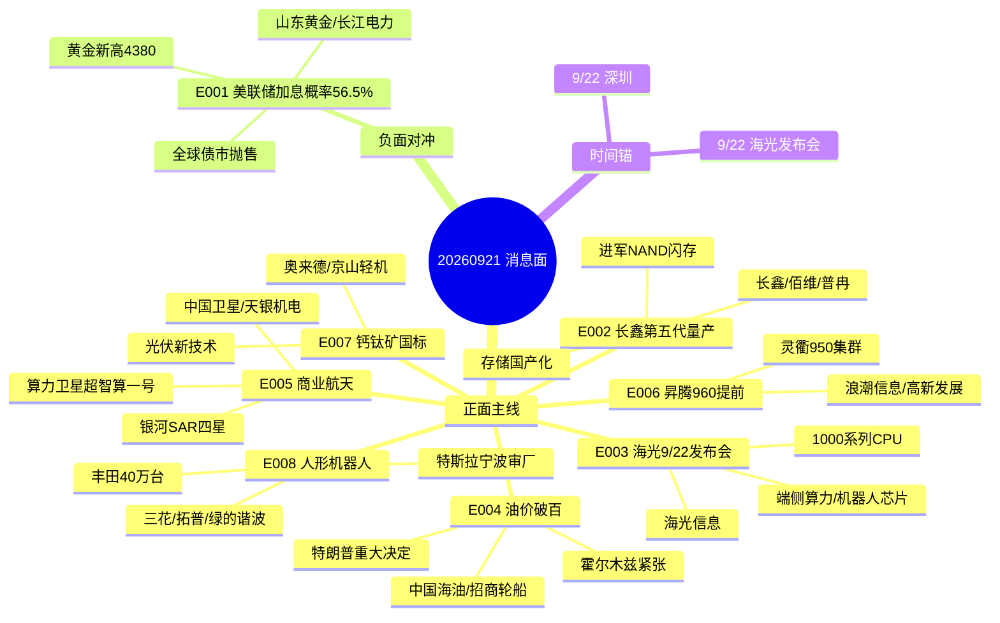

# 2026-09-21 · **消息面事件驱动**

> **数据源新鲜度**: partial · **降级状态**: degraded=true · **置信度**: 0.62
> **覆盖窗口**: 72h(09-18 09:01 ~ 09-21 06:54) · **主源**: 财联社/新浪快讯(news_cls 2193条) + Tushare要闻(news_major 800条) + 东财业绩预告(500条)
> **情绪周期**: 高位震荡(emotion_cycle 0.51 · 炸板率24.27% · 连板高度4) → 候选数砍半·仓位压低·中位股剔除

## 一句话结论

今日消息面核心 = **存储第五代量产+海光9/22发布会+油运地缘破百** 三线进攻,商业航天/人形机器人延续,唯一行业级负面对冲 = **美联储10月加息概率56.5%** 压制高位成长;黄金新高独立多头。

## 🗺️ 消息面全景图

## 🎯 顶级事件详解(每事件三问 + 首推票思维链)

### E20260921_001 · CME美联储观察: 10月加息概率56.5%(维持不变43.5%) 12月维持仅10.2% + 全球 · strength=high · polarity=负面 · weighted=-0.78

**事件摘要**: CME美联储观察: 10月加息概率56.5%(维持不变43.5%) 12月维持仅10.2% + 全球债市抛售(10Y美债破5% 2Y创2024年7月新高) + 日央行加息至1.25% 全球紧缩周期升级 · 独立源 4 个 · 衰减 0 日(有效)
- 来源: news_cls:10jqka(06:03 CME 10月加息概率56.5%); news_cls:sina(08:18 全球债市再遇抛售 关注全球紧缩周期升级); news_cls:sina(07:28 欧美日接连加息 海外货币政策环境转向紧缩); news_cls:sina(23:05 美2Y收益率创2024年7月以来新高 4.7475%)
- **反证(v1.4)**: bearish_scope=行业级 · 砸盘面=['AI算力', '半导体', '创新药', '港股科技', '高估值成长']

**推理深度三问**:

- **大资金意图**: CME 10月加息概率 56.5% 是上周美联储加息 25bp 落地后的市场定价延续,海外紧缩周期升级(日央行 1.25% / 10Y 美债破 5% / 2Y 创 2024 年 7 月新高) → 全球流动性紧平衡叙事成为高位科技最大压制项;大资金用黄金新高(4380 美元)做对冲表达,A股红利/高股息成为防御通道。
- **为什么走强**: 紧缩周期升级并非新信息,但 2Y 收益率新高+债市抛售说明通胀易上难下已被重新定价;对 A股影响是结构性的——成长股估值受压制、红利/黄金独立多头,资金杠铃两端配置。
- **逻辑够不够硬**: **硬但偏宏观**。CME 概率 + 债市收益率 + 日央行动作三源共振,方向确定;但无 A股个股级直接催化,作用路径是估值压制而非事件驱动,定位为仓位约束,不作为进攻买点。

**首推票思维链**:

- 600547.SH **山东黄金** · 首推·避险资金反向受益 · 止损 31.07 · 目标 [37.03, 38.67]
  - **思维链**: 买入理由: 现货金 4380 美元新高+地缘避险+紧缩下央行购金逻辑;风险点: 若美伊缓和/金价回落回吐;止损条件: 破 31.07(9/18 收盘 32.77×0.948);可验证假设: 开盘 30 分钟黄金板块量能延续且金价站稳 4350 上方
- 600900.SH **长江电力** · 次选·高股息防御 · 止损 26.8 · 目标 [29.97, 31.1]
  - **思维链**: 买入理由: 紧缩期确定性现金流+防御属性;风险点: 弹性低、资金切换至成长时跑输;止损条件: 破 26.80;可验证假设: 大盘若低开红利指数相对抗跌

**可验证假设**: 开盘 30 分钟验证上述 2 票的板块联动 + 量能 + 资金方向,不符则当日回避。

### E20260921_002 · 长鑫科技第五代工艺技术平台量产(世界制造业大会) + 同步展出大容量LPDDR5X + 路透: 长鑫 · strength=high · polarity=正面 · weighted=0.757

**事件摘要**: 长鑫科技第五代工艺技术平台量产(世界制造业大会) + 同步展出大容量LPDDR5X + 路透: 长鑫存储拟进军NAND闪存(北京新厂研发线) 存储国产化再下一城 · 独立源 3 个 · 衰减 1 日(有效)
- 来源: news_cls:sina(22:52 长鑫科技公告 第五代工艺量产 LPDDR5X); news_major:财新(23:00 长鑫科技第五代技术平台量产 存储密度/功耗/成本均提升); news_cls:10jqka(15:24 路透 长鑫存储准备进入NAND闪存市场)
**推理深度三问**:

- **大资金意图**: 长鑫第五代工艺量产(世界制造业大会官宣) + 同步展出大容量 LPDDR5X + 路透报道长鑫拟进军 NAND 闪存 = 国产存储从 DRAM 向 NAND 全面突围,大资金意图把存储做成国产算力自主可控的产业级旗帜——业绩预告(长鑫扭亏 2278-2530% / 佰维扭亏 3200-3421% / 普冉预增 2976%)给足基本面硬背书。
- **为什么走强**: 存储涨价周期(三星/海力士/美光海外共振) + 国产替代提速(长鑫 NAND 新产线) + 业绩预告暴增三因素叠加;9/18 半导体板块 6 家涨停、存储双万亿市值主线延续,今日第五代量产公告是预期已兑现→更强预期的第二段催化。
- **逻辑够不够硬**: **硬**。官方公告(9/20 22:52) + 财新要闻 + 路透 NAND 三源共振,且业绩预告独立验证(不是预期是已披露数据);缺陷是长鑫已高位,量产公告可能被解读为利好兑现,须防高开低走。

**首推票思维链**:

- 688825.SH **长鑫科技** · 首推·存储原厂·第五代量产直接受益 · 止损 52.65 · 目标 [63.87, 67.76] · 中报:扭亏 2278.89~2530.3%
  - **思维链**: 买入理由: 国产 DRAM 原厂+第五代工艺量产+中报扭亏 2278-2530%;风险点: 高位利好兑现/减持;止损条件: 破 52.65(9/18 收盘 55.54×0.948);可验证假设: 高开不破 55.54 且半小时主力净流入为正
- 688525.SH **佰维存储** · 次选·存储模组 · 止损 205.6 · 目标 [249.41, 264.59] · 中报:扭亏 3200.15~3421.59%
  - **思维链**: 买入理由: 扭亏 3200-3421%+AI 算力存储高景气;风险点: 高波动;止损条件: 破 205.60;可验证假设: 存储板块整体高开且佰维量能放大
- 688766.SH **普冉股份** · 三选·NOR/EEPROM · 止损 407.64 · 目标 [498.8, 520.3] · 中报:预增 2976.99%
  - **思维链**: 买入理由: 预增 2976.99%+存储价格上行;风险点: 9/18 已涨停 10% 高位;止损条件: 破 407.64;可验证假设: 溢价承接不炸板
- 603986.SH **兆易创新** · 四选·NOR龙头 · 止损 367.99 · 目标 [438.64, 458.05]
  - **思维链**: 买入理由: 存储+MCU 双轮+板块权重;风险点: 权重慢票弹性小;止损条件: 破 367.99;可验证假设: 板块放量兆易同步上行

**可验证假设**: 开盘 30 分钟验证上述 4 票的板块联动 + 量能 + 资金方向,不符则当日回避。

### E20260921_003 · 海光信息 9/22 深圳发布 1000 系列 CPU(低功耗/嵌入式/端侧算力) + 新品类芯片(机 · strength=high · polarity=正面 · weighted=0.75

**事件摘要**: 海光信息 9/22 深圳发布 1000 系列 CPU(低功耗/嵌入式/端侧算力) + 新品类芯片(机器人/机器视觉/智能制造) 5600亿算力龙头产品线扩张 · 独立源 2 个 · 衰减 0 日(有效)
- 来源: news_cls:10jqka(15:31 海光将发布新品类芯片 面向物理世界场景 机器人/机器视觉); news_cls:sina(05:56 海光信息称将于9月22日深圳发布1000系列CPU)
**推理深度三问**:

- **大资金意图**: 海光 9/22 深圳发布 1000 系列 CPU(低功耗/嵌入式/端侧) + 新品类芯片(机器人/机器视觉) = 国产算力龙头从数据中心向物理世界延伸,大资金意图把端侧算力+机器人芯片做成算力主线第二增长曲线;时间锚 9/22 发布会 = 明日催化确定性高。
- **为什么走强**: 海光 5600 亿市值龙头地位 + 中报预增 41.5-52.32% + CPU 产品线扩张 + 机器人芯片新品类卡位 = 算力+机器人双主题交叉;华为昇腾 950 集群全球上线同步强化国产算力板块效应。
- **逻辑够不够硬**: **硬**。发布会时间锚明确(9/22),双时点消息(9/20 15:31 + 9/21 05:56)确认;业绩预增独立验证;缺点是发布前一日可能有兑现资金,追高需谨慎。

**首推票思维链**:

- 688041.SH **海光信息** · 首推·CPU+DCU龙头 · 止损 228.83 · 目标 [280.0, 294.48] · 中报:预增 41.5~52.32%
  - **思维链**: 买入理由: 9/22 发布会事件驱动+预增 41.5-52.32%+端侧算力/机器人芯片新品类;风险点: 发布会兑现回落;止损条件: 破 228.83(9/18 收盘 241.38×0.948);可验证假设: 9/22 发布会前两日股价站稳 241 上方且量能温和

**可验证假设**: 开盘 30 分钟验证上述 1 票的板块联动 + 量能 + 资金方向,不符则当日回避。

### E20260921_004 · 布伦特暗盘破100美元(+2%) + 特朗普称对伊朗将作重大决定(选项含彻底摧毁/协议) + 伊朗在 · strength=high · polarity=交织 · weighted=0.7

**事件摘要**: 布伦特暗盘破100美元(+2%) + 特朗普称对伊朗将作重大决定(选项含彻底摧毁/协议) + 伊朗在霍尔木兹海峡击落美军无人机 + 109艘商船改道 + 沙特利雅得空袭警报 油运/油气景气上行 · 独立源 5 个 · 衰减 0 日(有效)
- 来源: news_cls:sina(03:27 布伦特暗盘突破100美元 日内涨超2%); news_cls:sina(22:28 特朗普称将对伊朗作出重大决定); news_cls:sina(02:00 伊朗军方在霍尔木兹海峡上空击落轨道飞行器无人机); news_cls:sina(01:41 美中央司令部 已改道109艘商船)
- **反证(v1.4)**: bearish_scope=行业级 · 砸盘面=['航空', '化工下游', '交运燃油', '消费']

**推理深度三问**:

- **大资金意图**: 布伦特暗盘破 100 美元 + 特朗普对伊朗重大决定(选项含彻底摧毁) + 伊朗在霍尔木兹击落美军无人机 + 109 艘商船改道 + 沙特利雅得空袭警报 = 地缘风险溢价重新点燃,大资金意图把油运/油气做成通胀+地缘双主题主线——VLCC 运价上行+霍尔木兹风险溢价。
- **为什么走强**: 9/18 布油曾暴跌 9%(停火预期) 但 9/20-21 重新破 100,地缘反复拉锯制造剧烈波动;美国中央司令部称海峡石油运量创六个月新高说明实际运输未断,但风险溢价持续抬升;油运(招商轮船/中远海能)是量价齐升+风险溢价最直接受益。
- **逻辑够不够硬**: **硬但双向**。特朗普决策+击落无人机+商船改道多源确认地缘紧张;但若美伊达成协议油价回落则逻辑证伪(9/18 已演示过反向),必须标注 bearish_scope=行业级(航空/化工/消费成本端受损)。

**首推票思维链**:

- 600938.SH **中国海油** · 首推·油气龙头 · 止损 30.62 · 目标 [36.5, 38.11]
  - **思维链**: 买入理由: 油价破 100 直接受益+高股息;风险点: 油价回落;止损条件: 破 30.62(9/18 收盘 32.3×0.948);可验证假设: 布油站稳 100 且开盘油气板块高开
- 601872.SH **招商轮船** · 次选·油运VLCC · 止损 21.2 · 目标 [25.94, 27.28]
  - **思维链**: 买入理由: VLCC 运价上行+霍尔木兹风险溢价;风险点: 地缘缓和运价回落;止损条件: 破 21.20;可验证假设: 开盘油运板块领涨且量能放大
- 600026.SH **中远海能** · 三选·油运 · 止损 20.92 · 目标 [24.94, 26.04]
  - **思维链**: 买入理由: 原油运输核心+弹性;风险点: 与招商轮船同质;止损条件: 破 20.92;可验证假设: 油运指数红盘

**可验证假设**: 开盘 30 分钟验证上述 3 票的板块联动 + 量能 + 资金方向,不符则当日回避。

### E20260921_005 · 银河航天四颗SAR卫星一箭四星成功发射 + 株洲太空星际PIESAT-2 13~16星 + 超智算一 · strength=high · polarity=正面 · weighted=0.585

**事件摘要**: 银河航天四颗SAR卫星一箭四星成功发射 + 株洲太空星际PIESAT-2 13~16星 + 超智算一号算力卫星发射(力箭一号) + 民营火箭中科宇航一箭9星 算力上天 · 独立源 4 个 · 衰减 1 日(有效)
- 来源: news_cls:10jqka(19:41 银河航天四颗SAR卫星成功发射 长征二号丁一箭四星); news_cls:sina(19:41 株洲太空星际PIESAT-2 13~16星发射成功); news_cls:10jqka(14:12 国内首个首箭首星一体化算力卫星超智算一号成功发射); news_major:同花顺(01:32 民营火箭密集发射 中科宇航一箭9星推算力上天)
**推理深度三问**:

- **大资金意图**: 银河航天四颗 SAR 卫星 + 太空星际 PIESAT-2 13~16 星 + 超智算一号算力卫星(力箭一号) + 中科宇航一箭 9 星算力上天 = 商业航天从发射事件升级为算力基础设施叙事,大资金意图做卫星互联网/算力卫星的中期主线。
- **为什么走强**: 9/18 R4 已列商业航天主线(3 天 4 连捷),今日再叠加算力卫星+民营火箭密集发射 = 连续性佳;天数天算工程化落地标志商业航天进入业绩验证阶段。
- **逻辑够不够硬**: **硬**。央视军事/同花顺多源确认发射事件;主线连续性(前日已强)是情绪加分项;缺点是商业航天个股业绩兑现慢,偏主题。

**首推票思维链**:

- 600118.SH **中国卫星** · 首推·卫星总装 · 止损 56.5 · 目标 [69.14, 72.12]
  - **思维链**: 买入理由: 卫星制造国家队+发射事件共振;风险点: 主题退潮;止损条件: 破 56.50(9/18 收盘 59.6×0.948);可验证假设: 开盘卫星互联网板块高开且中国卫星量能放大
- 300342.SZ **天银机电** · 次选·星敏感器 · 止损 30.5 · 目标 [37.0, 38.6]
  - **思维链**: 买入理由: 卫星核心部件+弹性;风险点: 高波动;止损条件: 破 30.50;可验证假设: 板块红盘天银同步
- 688568.SH **中科星图** · 三选·卫星应用 · 止损 29.61 · 目标 [35.91, 37.79]
  - **思维链**: 买入理由: 数字地球应用+算力卫星受益;风险点: 应用变现慢;止损条件: 破 29.61;可验证假设: 卫星应用子板块走强

**可验证假设**: 开盘 30 分钟验证上述 3 票的板块联动 + 量能 + 资金方向,不符则当日回避。

### E20260921_006 · 华为全联接大会2026: 昇腾960发布提前(提前3季度) + 灵衢昇腾950智算集群全球上线 +  · strength=high · polarity=正面 · weighted=0.533

**事件摘要**: 华为全联接大会2026: 昇腾960发布提前(提前3季度) + 灵衢昇腾950智算集群全球上线 + 昇腾跨过生态拐点(CANN月活5200+) + 中信证券: 国产算力进入系统级竞争 · 独立源 4 个 · 衰减 2 日(有效)
- 来源: news_cls:10jqka(14:50 中信证券 昇腾960发布提前 竞争步入系统时代); news_cls:10jqka(14:15 华为 昇腾已跨过生态拐点 Agentic时代构建AI新生态); news_cls:10jqka(16:16 华为云周跃峰 灵衢昇腾950智算集群全球上线 40天稳定/10分钟故障恢复); news_cls:10jqka(09:15 三六零与昇腾AI联合打造AI Agent方案)
**推理深度三问**:

- **大资金意图**: 昇腾 960 发布提前 3 季度 + 灵衢昇腾 950 智算集群全球上线 + 昇腾跨过生态拐点(CANN 月活 5200+) = 国产算力从单卡升维系统级,大资金意图把华为链做成国产算力主线的产业信念锚;中信证券明确先进制程/先进封装/先进存储/超节点放量。
- **为什么走强**: 华为全联接大会 2026(9/17-18) 密集发布 + 中信/中信建投研报背书 + 昇腾生态伙伴(360/软通)落地 = 机构从看多升级配置;已是第三日催化,作为主线锚而非新买点。
- **逻辑够不够硬**: **硬(主线锚)**。研报+华为官方双源确认;但 days_since=2 已衰减至 0.533,只能作为背景性主线,不作为当日首推催化——首推票只做回踩确认。

**首推票思维链**:

- 000977.SZ **浪潮信息** · 首推·昇腾AI服务器 · 止损 68.14 · 目标 [82.66, 86.26]
  - **思维链**: 买入理由: 昇腾生态核心整机商+华为链主线;风险点: 已涨多日;止损条件: 破 68.14(9/18 收盘 71.88×0.948);可验证假设: 华为链回调不破 5 日线再低吸
- 000628.SZ **高新发展** · 次选·昇腾算力(华鲲振宇) · 止损 57.34 · 目标 [70.16, 73.18]
  - **思维链**: 买入理由: 昇腾算力平台+弹性;风险点: 高位波动;止损条件: 破 57.34;可验证假设: 昇腾板块分化中高新独立走强
- 301236.SZ **软通动力** · 三选·AgentOS发布商 · 止损 35.07 · 目标 [42.91, 45.13]
  - **思维链**: 买入理由: 华为生态软件+AgentOS 商用;风险点: 弹性小;止损条件: 破 35.07;可验证假设: 华为链走强软通跟随

**可验证假设**: 开盘 30 分钟验证上述 3 票的板块联动 + 量能 + 资金方向,不符则当日回避。

### E20260921_007 · 钙钛矿光伏领域首个国家标准发布 将成为检测认证/产品研发/产线质控和贸易交付的统一标尺 · strength=medium · polarity=正面 · weighted=0.55

**事件摘要**: 钙钛矿光伏领域首个国家标准发布 将成为检测认证/产品研发/产线质控和贸易交付的统一标尺 · 独立源 2 个 · 衰减 0 日(有效)
- 来源: news_major:同花顺(06:43 钙钛矿光伏领域首个国家标准发布); news_cls:sina(00:08 钙钛矿光伏首个国家标准发布)
**推理深度三问**:

- **大资金意图**: 钙钛矿光伏领域首个国家标准发布(6:43 同花顺要闻) = 行业从概念炒作进入标准规范阶段,大资金意图借国标落地做光伏新技术(钙钛矿)的产业级催化;9/18 光伏设备已走强(亚玛顿涨停)。
- **为什么走强**: 首个国标=检测认证/产品研发/产线质控/贸易交付统一标尺,钙钛矿产业化提速信号;叠加光伏金九银十装机旺季+供给侧出清预期。
- **逻辑够不够硬**: **中硬**。官方要闻双源确认(同花顺+新浪);但钙钛矿量产规模仍小,设备/材料公司业绩兑现慢,属主题催化。

**首推票思维链**:

- 688378.SH **奥来德** · 首推·钙钛矿设备/材料 · 止损 49.01 · 目标 [59.97, 62.56]
  - **思维链**: 买入理由: 钙钛矿蒸镀设备+OLED 材料双主业;风险点: 主题退潮;止损条件: 破 49.01(9/18 收盘 51.7×0.948);可验证假设: 开盘光伏板块红盘且奥来德量能放大
- 000821.SZ **京山轻机** · 次选·钙钛矿设备 · 止损 7.11 · 目标 [8.7, 9.15]
  - **思维链**: 买入理由: 钙钛矿整线设备+低市值弹性;风险点: 低价股波动大;止损条件: 破 7.11;可验证假设: 光伏设备板块走强京山跟随

**可验证假设**: 开盘 30 分钟验证上述 2 票的板块联动 + 量能 + 资金方向,不符则当日回避。

### E20260921_008 · 特斯拉宁波审厂(9/16落地 9/17开启Optimus量产审厂 已向供应链下达订单) + 丰田20 · strength=medium · polarity=正面 · weighted=0.534

**事件摘要**: 特斯拉宁波审厂(9/16落地 9/17开启Optimus量产审厂 已向供应链下达订单) + 丰田2028年起每年投1万亿日元引40万台机器人 + 启元机器人19999元发售 + 地瓜机器人4亿美元C轮 · 独立源 4 个 · 衰减 1 日(有效)
- 来源: news_cls:10jqka(13:56 特斯拉团队宁波落地 开启Optimus量产审厂 已下订单); news_cls:10jqka(13:58 丰田2028年起每年约1万亿日元 40万台机器人); news_cls:10jqka(16:30 启元机器人发布Q1/T1 19999元起 2.5分钟下线一个); news_major:新浪(05:50 地瓜机器人完成4亿美元C轮融资)
**推理深度三问**:

- **大资金意图**: 特斯拉宁波审厂(9/16 落地 9/17 开启 Optimus 量产审厂 已向供应链下达订单) + 丰田 2028 年起每年 1 万亿日元引 40 万台机器人 + 启元机器人 19999 元发售 + 地瓜机器人 4 亿美元 C 轮 = 人形机器人从概念进入量产审厂实质验证,大资金意图做特斯拉链/执行器链的产业级主线。
- **为什么走强**: 特斯拉审厂=实质订单信号(不同于纯概念) + 丰田万亿日元投资=全球产业共振 + 启元消费级机器人发售=情绪引爆点;连续多日催化,主线延续。
- **逻辑够不够硬**: **硬(产业级)**。特斯拉审厂+丰田投资+启元发售多源共振;缺点是 A股相关标的(三花/拓普)与特斯拉实际订单关联度需验证,谨防审厂≠量产。

**首推票思维链**:

- 002050.SZ **三花智控** · 首推·特斯拉Optimus执行器链 · 止损 33.47 · 目标 [40.96, 42.73]
  - **思维链**: 买入理由: 特斯拉审厂核心受益+机器人执行器;风险点: 审厂≠量产订单;止损条件: 破 33.47(9/18 收盘 35.31×0.948);可验证假设: 开盘机器人板块高开且三花放量
- 601689.SH **拓普集团** · 次选·执行器总成 · 止损 42.66 · 目标 [51.75, 54.0]
  - **思维链**: 买入理由: 机器人执行器+汽车主业;风险点: 双主业拖累;止损条件: 破 42.66;可验证假设: 特斯拉链走强拓普跟随
- 688017.SH **绿的谐波** · 三选·谐波减速器 · 止损 278.92 · 目标 [338.35, 356.01]
  - **思维链**: 买入理由: 减速器核心供应商+稀缺性;风险点: 高位;止损条件: 破 278.92;可验证假设: 机器人板块红盘绿的同步
- 603728.SH **鸣志电器** · 四选·空心杯电机 · 止损 47.45 · 目标 [58.06, 60.56]
  - **思维链**: 买入理由: 灵巧手电机+弹性;风险点: 高波动;止损条件: 破 47.45;可验证假设: 板块放量鸣志上行

**可验证假设**: 开盘 30 分钟验证上述 4 票的板块联动 + 量能 + 资金方向,不符则当日回避。

## 📊 板块 × 事件 极性叉乘矩阵

| 板块 | 事件锚 | net_polarity | 正面事件 | 负面事件 | 强度 |
|------|--------|:--:|----------|----------|:--:|
| 宏观/流动性 | -E001 | 🔴 负面 | - | E001 | high |
| 高估值成长/港股科技 | -E001 | 🔴 负面 | - | E001 | medium |
| 存储/半导体 | E002 | 🟢 正面 | E002 | - | high |
| 先进封装/设备 | E002 | 🟢 正面 | E002 | - | medium |
| 国产算力/CPU | E003 | 🟢 正面 | E003 | - | high |
| 机器人芯片 | E003 | 🟢 正面 | E003 | - | medium |
| 油气/油运 | E004 | 🟢 正面 | E004 | - | high |
| 地缘/军工 | E004 | 🟢 正面 | E004 | - | medium |
| 通胀链 | -E004 | 🔴 负面 | - | E004 | medium |
| 商业航天 | E005 | 🟢 正面 | E005 | - | high |
| 卫星互联网 | E005 | 🟢 正面 | E005 | - | medium |
| 华为链/昇腾 | E006 | 🟢 正面 | E006 | - | high |
| 国产算力/超节点 | E006 | 🟢 正面 | E006 | - | high |
| 光伏/钙钛矿 | E007 | 🟢 正面 | E007 | - | medium |
| 人形机器人 | E008 | 🟢 正面 | E008 | - | medium |
| 特斯拉链 | E008 | 🟢 正面 | E008 | - | medium |

## 🔥 中报业绩预告命中(硬 alpha 交叉验证)

| 代码 | 名称 | 预告类型 | 增速下限-上限 | 事件命中 | 逻辑强度 |
|------|------|----------|--------------|----------|:--:|
| 688525.SH | 佰维存储 | 扭亏 | 3200.15%~3421.59% | E002 存储 | 🟢🟢🟢 |
| 688825.SH | 长鑫科技 | 扭亏 | 2278.89%~2530.3% | E002 存储 | 🟢🟢🟢 |
| 688766.SH | 普冉股份 | 预增 | 2976.99% | E002 存储 | 🟢🟢🟢 |
| 688498.SH | 源杰科技 | 预增 | 1196.91%~1304.98% | E002 存储/光芯片 | 🟢🟢 |
| 300613.SZ | 富瀚微 | 预增 | 1640.93%~2164.52% | 半导体/车载芯片 | 🟢🟢 |
| 688041.SH | 海光信息 | 预增 | 41.5%~52.32% | E003 国产算力 | 🟢🟢 |
| 300394.SZ | 天孚通信 | 略增 | 25%~45% | 华为链/光引擎(背景) | 🟢 |

## 关键证据

- 证据 1: 长鑫科技 9/20 22:52 公告第五代工艺平台量产 · 来源 news_cls(新浪) · 2026-09-20
- 证据 2: 长鑫存储拟进军 NAND 闪存(北京新厂研发线) · 来源 news_cls(路透) · 2026-09-18
- 证据 3: 海光信息 9/22 深圳发布 1000 系列 CPU + 机器人芯片新品类 · 来源 news_cls · 2026-09-20/21
- 证据 4: CME 美联储观察 10 月加息概率 56.5% · 来源 news_cls(10jqka) · 2026-09-21 06:03
- 证据 5: 布伦特暗盘破 100 美元 + 特朗普对伊朗重大决定 · 来源 news_cls(新浪) · 2026-09-21 03:27
- 证据 6: 银河航天四颗 SAR 卫星发射成功 · 来源 news_cls(央视军事) · 2026-09-19 19:41
- 证据 7: 昇腾 960 发布提前 + 灵衢 950 集群上线 · 来源 news_cls(中信证券研报/华为) · 2026-09-18/19
- 证据 8: 钙钛矿光伏首个国家标准发布 · 来源 news_major(同花顺) · 2026-09-21 06:43
- 证据 9: 特斯拉宁波审厂 Optimus 量产 + 丰田 40 万台机器人 · 来源 news_cls · 2026-09-18

## 数据源审计

| 源 | 日期 | 状态 | 记录数 | 备注 |
|---|---|:--:|---:|---|
| news_cls | 2026-09-18~21 | 🟢 | 2193 | 财联社/新浪快讯 72h 回看 |
| news_major | 2026-09-20~21 | 🟢 | 800 | Tushare 长篇要闻 |
| eastmoney/earnings_predict | 2026-09-21 | 🟢 | 500 | 中报/季报预告 |
| wechat_official_sanji | - | 🔴 | 0 | 用户 2026-08-20 取消三刀源(disabled) |
| wechat_cli_5groups | - | 🔴 | 0 | 5 群全 error(timeout>45s) |
| chart_vision_snapshot | - | 🔴 | 0 | 12/12 timeout · tushare CLI 直连补价格锚 |
| mcp (tushare/datapro/weflow) | 2026-09-21 | 🔴 | - | MCP 全 down · tushare CLI 直连 ok |
| events_20260918 | 2026-09-18 | 🟢 | 1173 | 前晚 event-tracker |
| R3_sentiment | - | ⚪ | - | 未落盘 → kol_confirm 代偿失败(群聊全 error) |

## 不确定性 / 反证

- **MCP 全 down 导致验证降级**: hithink/iwencai/vibe 全部不可用,llm_pick_method=llm_pure_no_verification,business_relevance=null(hithink_business_degraded=true);R7 未落盘 → capital_flow_verification.r7_status=unavailable
- **价格锚改善但仍需盘前核验**: stop_loss 基于 tushare CLI 直连 9/18 真实收盘价计算(较昨日估算价改善),但仍需 09:25 竞价后二次核验
- **长鑫高位兑现风险**: 长鑫科技 9/18 收盘 55.54 已在高位,量产公告可能被解读为利好兑现,若高开低走不追
- **油价双向风险**: 布油 9/18 曾暴跌 9%,若美伊达成协议油价回落则油运逻辑证伪(本事件标 bearish_scope=行业级)
- **KOL 单点风险**: 群聊全 error 无法做语义级独立验证,news_cls 双通道(sina+10jqka)为唯一交叉源
- **情绪高位震荡(0.51)**: 炸板率 24.27% 未过 35% 红线,但连板高度 4 说明接力情绪一般,候选数已砍半,仓位建议压低

## 与其他 R/D/E 的关系

- 依赖: news_cls / news_major / eastmoney_earnings_predict / events_20260918 / emotion_cycle
- 被消费: R2 主线 / R5 个股画像 / R6 反证 / D1 预案

## Sub-Agent 元数据

- skill: analyze_news_impact_v1@1.0
- artifact: data/research/20260921/R4_news.json
- method: llm_v1(硬扩容·降级路径·λ=0.15时间衰减·v1.4正反两面检查·板块极性叉乘)
- 生成时刻: 2026-09-21T08:04:40+08:00
