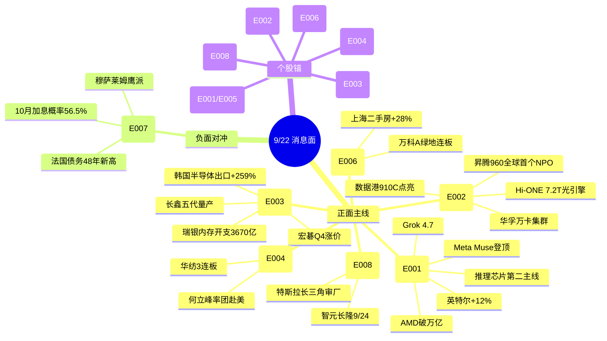

# 2026年9月22日 · **消息面事件驱动**

> **数据源新鲜度**: ok · **降级状态**: false · **置信度**: 0.70
> **覆盖窗口**: 前 72h · **主源**: 财联社快讯(2223) + 5 焦点群(591) + 东财中报预告(500) + 前晚事件分类(1107)
> **情绪周期**: 主升(0.53) · 主线: 科技硬件链(存储/半导体/CPO) + 国产算力/昇腾链

## 一句话结论

今日消息面核心是**美股 Agentic AI 行情(AI智能体/CPU/推理芯片)映射 + 华为昇腾超节点国产算力 + 存储链四重共振**,三者叠加科技硬件链主升延续; 唯一硬负面对冲是**美联储10月加息概率56.5%压制高估值成长**。

## 🗺️ 消息面全景图

## 🎯 顶级事件详解(每事件三问 + 首推票思维链)

### E20260922_001 · Agentic AI 智能体行情重估 · strength=high · polarity=正面 · w=0.82

**事件摘要**: 美股映射硬催化。Meta 智能体 Muse 登顶美区 App Store/Google Play 免费榜,AMD 市值首破 1 万亿美元(+9~12%),英特尔涨 12.08%,Arm 涨 17.16%,纳指 +2.26%,费城半导体指数 +4.3% 创 8 月 4 日以来最佳;SpaceXAI 发布 Grok 4.7(速度翻倍、价格半价),OpenAI 加紧开发新功能应对 Grok Bot/Muse。群聊 song 点评: Agentic AI 带动 CPU 需求重估,推理芯片是第二主线。

**推理深度三问**:
- **大资金意图**: 美股资金从"GPU 单一叙事"切换到"Agent 7×24 自主执行→Token 消耗倍数放大→CPU 承担浏览器/工具调用/任务调度"的新算力定价模型,AMD/Intel 是承接方。这是**算力需求的二阶导重估**,不是简单轮动。
- **为什么走强**: Muse 不是单次问答,是 7×24 自主循环的智能体,Token 消耗是对话式的数倍;市场发现 Agent 时代除了推理还大量需要 CPU 承担调度任务 → Intel/AMD 补涨。
- **逻辑够不够硬**: **硬**。5 个独立源共振(news_cls 美股收盘 + Muse 登顶 + Grok 4.7 + 费半 + 群聊 song 点评),且是"事实(登顶榜单)+叙事(CPU 重估)"双层催化。A 股映射风险在于: CPU 重估能否在 A 股找到纯正标的(国产 CPU/信创),否则只是情绪高开。

**首推票思维链**:

#### 华宇软件 300271 · role=首推·智能决策平台华字辈
- **买入理由**: Jev 决策模型最正宗 A 股映射——公司已落地"数据驱动智能决策平台"(LLM/RAG/Agent/text2DSL),叠加华字辈辨识度(9/21 华字辈 30 多只涨停的板块效应);收盘 5.94 低位。
- **风险点**: 主要来自 KOL 群聊驱动,新闻源覆盖少;若高开超 8% 追高风险大,需分歧承接确认。
- **止损条件**: 破 5.35(5.94 × 0.90)离场。
- **可验证假设**: 若开盘 30 分钟主力净额 ≤ 0 或高开回落破分时均线 → 假设不成立,当日回避。

### E20260922_002 · 华为昇腾960超节点(NPO) · strength=high · polarity=正面 · w=0.73

**事件摘要**: 华为全联接大会(9/17-19):昇腾 960 超节点为**全球首个采用 NPO 技术的超节点**,Hi-ONE 光引擎 7.2T、十万亿参数级;昇腾 950 规模商用、960DT/PR 提前发布。开源通信蒋颖关键词: 超节点/NPO/液冷。9/20 数据港×华为昇腾 910C 超节点正式点亮(南财快讯),华孚时尚阿克苏万卡集群(一期 10000 张 910C)。

**推理深度三问**:
- **大资金意图**: 华为叙事 = 国产算力的产业级信念锚。昇腾 960 提前发布 + 950 规模商用,机构需要"国产算力能打"的确定性旗帜,数据港 910C 点亮提供可复制的 IDC 标杆。
- **为什么走强**: R2 已把"国产算力/昇腾链"定为主线第二档(score 77),NPO 超节点是**新叙事增量**(光互联去 DSP 化),叠加 9/22 海光发布会窗口(1000 系列 CPU+机器人芯片新品类)= 事件密集+时间锚。
- **逻辑够不够硬**: **硬**。开源通信 + 中信证券双研报 + 数据港官微 + 群聊产业链 4 源共振;昇腾 960 是实打实的量产产品(非 PPT)。光芯片源杰科技中报 +1196% 提供业绩锚。

**首推票思维链**:

#### 数据港 603881 · role=首推·昇腾910C超节点点亮
- **买入理由**: 9/20 数据港×华为昇腾 910C 超节点正式点亮,IDC 从基础设施服务商升级为"国产算力服务商";静安区国资委控股,具备可复制标杆意义(群聊 13:15 三重卡位);收盘 24.64。
- **风险点**: 事件已发酵一天(9/20 点亮、9/21 群聊),若今日高开兑现需防回落;昇腾订单实际收入贡献尚未披露。
- **止损条件**: 破 22.18(24.64 × 0.90)离场。
- **可验证假设**: 若开盘竞价量能较 9/21 显著放大且 30 分钟不回补 → 资金确认;若缩量高开冲高回落 → 情绪退潮回避。

### E20260922_003 · 存储链四重共振 · strength=high · polarity=正面 · w=0.65

**事件摘要**: (1) 长鑫科技第五代技术平台 9/20 世界制造业大会正式量产(11.95nm 半间距、密度大幅提升);(2) 韩国 9 月前 20 天出口 +78.3% 创纪录,半导体出货 +259.4%;(3) 瑞银: 2026 AI 资本开支近 1 万亿美元,内存开支从 710 亿→3670 亿美元;(4) 宏碁: 存储/CPU 吃紧,Q4 终端 PC 涨价 5-20%。业绩硬交叉: 长鑫中报扭亏 +2244%、佰维扭亏 +3200%、普冉 +1925%。

**推理深度三问**:
- **大资金意图**: 存储是本轮科技硬件链(主线第一档,score 86)的业绩确定性之王——涨价 + 原厂扩产 + 出口数据三向印证,机构在"AI capex 确定性"里选存储做容量底仓。
- **为什么走强**: 长鑫五代量产是**国产 DRAM 从跟跑到并跑**的标志性事件,叠加韩国出口数据证明全球存储超级周期延续。
- **逻辑够不够硬**: **硬**。产业事件(量产)+ 出口数据(韩国)+ 机构预测(瑞银)+ 涨价(宏碁)+ 业绩预告(3 家)五源全指向存储 = R4 当日最强 alpha 组合。

**首推票思维链**:

#### 长鑫科技 688825 · role=首推·存储原厂五代量产
- **买入理由**: 国产 DRAM 原厂,五代技术平台量产直接受益;中报预告扭亏 +2244~2544%(earnings_predict 2026-07-24)为硬业绩;收盘 56.88。
- **风险点**: 昨日 R4 已首推过一次(E20260921_002),部分预期已反映;若高开超 5% 追高需谨慎。
- **止损条件**: 破 51.19(56.88 × 0.90)离场。
- **可验证假设**: 若放量过前高且主力 5 日净流入转正 → 主升延续;若冲高回落破分时均线 → 二波启动失败回避。

### E20260922_004 · 中美经贸磋商+降税 · strength=medium · polarity=正面 · w=0.45

**事件摘要**: 何立峰 9/19-23 率团赴美开展中美经贸磋商;群聊 PX 中美关系组: 本轮围绕降税,四大受益方向(低价值商品/纺织/果链/食品);华纺股份 3 连板打高度,华字辈 30 多只涨停。

**推理深度三问**:
- **大资金意图**: 外交事件驱动的"降税预期交易",资金在磋商窗口(至 9/23)内博弈出口链;华字辈是 A 股特色玄学加持。
- **为什么走强**: 华纺 3 连板打出赚钱效应,资金沿着"降税四大方向"扩散到纺织/果链。
- **逻辑够不够硬**: **中**。官方源(商务部)+ 群聊 PX 组 + 盘面 3 板三源共振,但降税落地与否不确定,且 9/23 磋商结束即兑现窗口。

**首推票思维链**:

#### 华纺股份 600448 · role=首推·降税+华字辈3连板
- **买入理由**: 纺织出口降税最直接受益 + 华字辈涨停潮辨识度,3 连板已打高度(收盘 3.89)。
- **风险点**: 情绪票,3 板后加速风险大;9/23 磋商结束若无实质降税即兑现回落。
- **止损条件**: 破 3.58(3.89 × 0.92)离场。
- **可验证假设**: 若竞价继续一字/高开秒板且板块内华字辈跟风 → 主升;若高开炸板且纺织板块分歧 → 兑现离场。

### E20260922_005 · TypeSafe 'Jev' 决策模型爆火 · strength=medium · polarity=正面 · w=0.65

**事件摘要**: Jev( System-One 决策模型)36 小时 14 万开发者内测,提速 193.6 倍、成本降 444.6 倍;华创计算机今晚 20:30 电话会议深度解读;群聊多源热推(华宇软件/因赛/华阳/三六零)。

**推理深度三问**:
- **大资金意图**: Jev 把 AI 从"生成内容"推向"机器自主决策",华创/华福电话会议代表机构开始给"决策层 AI"定价;华宇软件是已落地同类能力的标的。
- **为什么走强**: 新叙事(决策模型) + 华字辈辨识度 + 机构电话会议背书,情绪与逻辑双驱动。
- **逻辑够不够硬**: **中**。主要来自 KOL 群聊(单源顶格 medium),news 侧只有"OpenAI 应对 Grok Bot/Muse"的旁证;但华创电话会议是机构级验证,加分。

**首推票思维链**:

#### 华宇软件 300271 · role=首推·智能决策平台华字辈
- **买入理由**: Jev 最正宗 A 股映射(已落地数据驱动智能决策平台)+ 华字辈;与 E001 同票但逻辑独立(决策层 AI 叙事),收盘 5.94 低位。
- **风险点**: 纯情绪驱动、无业绩支撑;群聊来源为主,需警惕高开兑现。
- **止损条件**: 破 5.35(5.94 × 0.90)离场。
- **可验证假设**: 若华创电话会议纪要今日发酵带动竞价放量 → 确认;若竞价无量高开回落 → 情绪一日游回避。

### E20260922_006 · 地产链涨停潮 · strength=medium · polarity=正面 · w=0.62

**事件摘要**: 9/21 万科 A、绿地控股连板,我爱我家涨停,房地产服务板块领跑;上海二手房 9 月累计成交 15597 套同比 +28%,单日网签 1495 套创下半年新高;华宝基金: 头部国央企成本轮制度变革核心受益者。

**推理深度三问**:
- **大资金意图**: 地产链从"政策预期"转向"成交数据验证",上海二手房创新高是真实需求信号,资金切向地产服务(轻资产、弹性大)。
- **为什么走强**: 万科/绿地连板打高度 + 地产服务板块领涨,数据(成交)+ 情绪(涨停潮)共振。
- **逻辑够不够硬**: **中**。盘面(涨停潮)+ 数据(上海二手房)+ 机构(华宝基金)三源,但地产是脉冲式行情,持续性存疑;万科龙虎榜净卖 -1.92 亿提示分歧。

**首推票思维链**:

#### 我爱我家 000560 · role=首推·地产服务涨停
- **买入理由**: 地产服务龙头,9/21 涨停 +10% 且龙虎榜净买 2.17 亿(资金确认),地产链里弹性最大的方向;收盘 3.19。
- **风险点**: 地产链情绪股,若万科等龙头分歧则补涨股先杀。
- **止损条件**: 破 2.93(3.19 × 0.92)离场。
- **可验证假设**: 若今日地产服务板块继续领涨且我爱我家竞价高开 → 主升;若板块涨停家数锐减 → 退潮回避。

### E20260922_007 · 宏观紧缩负面 · strength=high · polarity=负面 · w=-0.74

**事件摘要**: CME 美联储观察: 10 月加息概率 56.5%(维持 43.5%);穆萨莱姆: 若不进一步收紧,18 个月后通胀仍远高于 2% 目标;法国公共债务 2026 年将达 GDP 的 119.3% 创 48 年新高;10Y 美债高位。油价大跌(WTI -4.5% 收 95.78,布伦特跌破 100)缓解部分通胀担忧。

**推理深度三问**:
- **大资金意图**: 海外紧缩周期是 A 股高估值成长的系统性压制,10 月加息概率过半意味着流动性窗口收窄。
- **为什么走强**: 这是"利空出尽"后的二次确认(9/18 已加息 25bp),若 10 月再加息则高估值科技承压。
- **逻辑够不够硬**: **硬**。CME + 美联储官员 + 法国债务三源,且与昨日 E001 宏观负面延续共振。但油价大跌是缓冲项(缓解输入性通胀)。

**首推票思维链**:

#### 山东黄金 600547 · role=首推·避险资金反向受益
- **买入理由**: 地缘+紧缩环境避险主线,现货黄金 4341 美元高位,黄金 ETF 资金连续流入;收盘 32.23。
- **风险点**: 若 10 月加息落地,美元走强短期压制金价;今日现货金已小幅回调(-0.84%)。
- **止损条件**: 破 29.97(32.23 × 0.93)离场。
- **可验证假设**: 若金价企稳且避险情绪升温 → 逻辑成立;若金价跌破 4320 → 逻辑失效回避。

### E20260922_008 · 人形机器人量产催化 · strength=medium · polarity=正面 · w=0.56

**事件摘要**: 特斯拉机器人团队长三角审厂,多家企业已获订单(华昌达: 唯一华字辈特斯拉人形机器人);智元×长隆 9/24 全球首个大型具身智能主题乐园启幕(300 台机器人上岗);IFR 2026 出货预测 9 万台。但监管窗口指导提高人形机器人 IPO 审核门槛传闻构成板块级扰动。

**推理深度三问**:
- **大资金意图**: 特斯拉审厂=量产倒计时信号,智元长隆主题乐园=具身智能 C 端落地叙事;IFR 出货预测给"从试点到放量"的行业空间。
- **为什么走强**: 华字辈 + 特斯拉审厂双重标签,情绪辨识度高。
- **逻辑够不够硬**: **中**。群聊(产业链审厂)+ 新闻(智元长隆)+ 机构(IFR)三源,但 IPO 门槛传闻是负面对冲,板块需内部高低切换。

**首推票思维链**:

#### 华昌达 300278 · role=首推·特斯拉审厂+华字辈
- **买入理由**: 特斯拉直接供应商(美国子公司长期供海外工厂产线),唯一华字辈特斯拉人形机器人,审厂通过即投产;收盘 3.68 低位。
- **风险点**: 情绪票,若机器人板块被 IPO 门槛传闻压制则领跌;审厂订单实际落地待确认。
- **止损条件**: 破 3.31(3.68 × 0.90)离场。
- **可验证假设**: 若 9/24 智元长隆开园前板块持续发酵且华昌达竞价放量 → 主升;若 IPO 门槛传闻发酵杀板块 → 回避。

## 📊 板块 × 事件热力矩阵

| 板块 | 事件锚 | 首推龙头 | 独立源数 | 中报预告 | 净综合置信 |
|------|--------|----------|----------|----------|:--:|
| AI智能体/Agent | E001+E005 | 华宇软件 | 5 | 无 | 🟢🟢🟢 |
| CPU/推理芯片 | E001 | (国产CPU待映射) | 4 | 无 | 🟢🟢 |
| 国产算力/昇腾链 | E002 | 数据港 | 4 | 无 | 🟢🟢🟢 |
| CPO/NPO光互联 | E002 | 源杰科技 | 4 | +1196~1304% | 🟢🟢🟢 |
| 存储/DRAM | E003 | 长鑫科技 | 5 | 扭亏+2244% | 🟢🟢🟢 |
| 半导体/先进封装 | E003 | 兆易创新 | 4 | +1925%(普冉) | 🟢🟢🟢 |
| 纺织出口 | E004 | 华纺股份 | 3 | 无 | 🟢🟢 |
| 果链/消费电子 | E004 | 水晶光电 | 3 | 无 | 🟢🟢 |
| 地产/地产链 | E006 | 我爱我家 | 3 | 无 | 🟢🟢 |
| 人形机器人 | E008 | 华昌达 | 3 | 无 | 🟢🟡 |
| 宏观/流动性 | E007(负) | 山东黄金(避险) | 3 | 无 | 🔴🔴 |
| 高估值成长/港股科技 | E007(负) | — | 3 | 无 | 🔴 |

## 🔥 中报业绩预告命中(硬 alpha 交叉验证)

| 代码 | 名称 | 预告类型 | 增速下限-上限 | 事件命中 | 逻辑强度 |
|------|----------|----------|--------------|----------|:--:|
| 688825.SH | 长鑫科技 | 扭亏 | +2244%~+2544% | E003 存储五代量产 | 🟢🟢🟢 |
| 688525.SH | 佰维存储 | 扭亏 | +3200%~+3421% | E003 存储 | 🟢🟢🟢 |
| 688766.SH | 普冉股份 | 预增 | +1925% | E003 存储 | 🟢🟢🟢 |
| 688498.SH | 源杰科技 | 预增 | +1196%~+1304% | E002 NPO光芯片 | 🟢🟢🟢 |
| 300502.SZ | 新易盛 | 预增 | +77%~+102% | E002 CPO(背景) | 🟢🟢 |
| 300394.SZ | 天孚通信 | 略增 | +25%~+45% | E002 光引擎(背景) | 🟢🟢 |

## 关键证据

- 证据 1: Meta Muse 登顶美区 iOS/Google 免费榜 + AMD 市值破万亿 + 费半 +4.3% · 来源 news_cls · 2026-09-22
- 证据 2: 华为昇腾 960 超节点全球首个 NPO(Hi-ONE 7.2T)+ 数据港 910C 点亮 · 来源 开源通信蒋颖/中信证券研报/南财快讯 · 2026-09-21
- 证据 3: 长鑫科技第五代平台量产 + 韩国半导体出口 +259% + 瑞银内存开支 3670 亿 · 来源 news_cls · 2026-09-20/21
- 证据 4: 上海二手房 9 月 +28% 创单日新高 1495 套 · 来源 news_cls(澎湃) · 2026-09-21
- 证据 5: CME 美联储 10 月加息概率 56.5% · 来源 news_cls · 2026-09-22 06:01

## 数据源审计

| 源 | 日期 | 状态 | 备注 |
|---|---|:--:|---|
| tushare/news_cls | 2026-09-22 | 🟢 | 2223 条·72h 回看 |
| tushare/news_major | 2026-09-22 | 🟢 | 800 条 |
| eastmoney/earnings_predict | 2026-09-22 | 🟢 | 500 条 · 2026H1 预告 |
| wechat_cli_5groups | 2026-09-22 | 🟢 | 591 条 · 5 焦点群(匿名) |
| events_20260921 | 2026-09-21 | 🟢 | 龙虎榜 66 + 周末公告 1041 |
| wechat_official_sanji | 2026-09-22 | 🔴 | 用户 2026-08-20 取消(常态) |
| weflow-analytics | 2026-09-22 | 🔴 | ngrok 隧道离线(不影响 R4) |
| hithink_business_query | — | 🔴 | 本会话未接入 → business_relevance=null |

## 不确定性 / 反证

- **华宇软件双事件叠加**: E001 与 E005 都首推华宇软件,但逻辑不同(美股智能体 vs Jev 决策模型),若其中一条证伪需快速区分,警惕"票重叠=资金分散"的错觉。
- **KOL 单点风险**: E005(Jev)主要来自群聊,若华创电话会议纪要不及预期,情绪票当日高开回落概率大。
- **数据源缺失方向**: hithink/iwencai/vibe 未接入 → top_pick_logic 全部 llm_pure_no_verification,业务相关性未做 MCP 级验证;依赖群聊/新闻中的业务描述。
- **地产链持续性存疑**: 万科龙虎榜净卖 -1.92 亿与涨停并存,分歧信号;地产是脉冲行情非主线。
- **美股映射衰减**: 今日 A 股若高开兑现美股涨幅,需防"高开低走"的卖预期行情;CPU 重估在 A 股缺少纯正映射标的。
- **负面必须并列**: 美联储加息(10 月概率 56.5%)是唯一行业级负面,对高估值成长/AI 高位票形成压制,买入节奏需后置。

## 与其他 R/D/E 的关系

- 依赖: data/raw/20260922(news_cls/news_major/earnings_predict) + data/raw/20260921(events_20260921) + R7(0918 资金锚)
- 被消费: R2 主线确认 / R5 个股画像 / R6 反证 / D1 预案

## Sub-Agent 元数据

- skill: analyze_news_impact_v1@1.3
- artifact: data/research/20260922/R4_news.json
- method: llm_v1(五源硬约束·8 条硬事件·板块极性叉乘)
- 生成时刻: 2026-09-22T07:15:00+08:00
