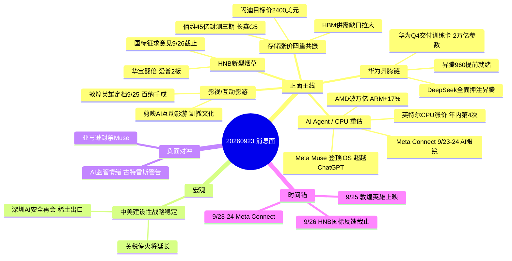

# 2026-09-23 · **消息面事件驱动**

> **数据源新鲜度**: partial · **降级状态**: true · **置信度**: 0.68
> **覆盖窗口**: 前 72h (news_cls 2683 条 + news_major 800 + 群聊 574 + 业绩预告 500)
> **主源**: 财联社/新浪快讯 + 5 焦点群 + 东财中报预告 + 前晚事件 1462 条

## 一句话结论

AI Agent(Muse+CPU)+华为昇腾+存储涨价+HNB 四线共振, 中美缓和抬升风险偏好; 唯一负面对冲是亚马逊封禁 Muse 与 AI 监管情绪。

## 🗺️ 消息面全景图

## 🎯 顶级事件详解(每事件三问 + 首推票思维链)

### E20260923_001 · Meta Muse 登顶美区 iOS 免费榜超越 ChatGPT · 12天下载280万 · 9/23-24 Meta … · strength=high · polarity=正面

**事件摘要**: Meta Muse 登顶美区 iOS 免费榜超越 ChatGPT · 12天下载280万 · 9/23-24 Meta Connect 大会 AI眼镜亮相 · PayPal 与 Meta 合作 Muse 购物结账
- **来源**: 7 源 · news_cls:Muse登顶(20:50 Meta带火AI助手·12天280万·超ChatGPT同期) news_cls:PayPal与Meta合作(23:20 Muse代理购物结账) news_cls:摩根大通维持增持820美元(22:18 Muse持续强化AI预期)
- **有效期**: 3-7日 · **raw_score**: 0.85 → **weighted_score**: 0.7316
- **负面对冲**: bearish_scope=板块级 · 杀伤面=['传统对话式AI/ChatGPT系', 'Meta链高位标的']

**推理深度三问**:
- **大资金意图**: 见正文事件逻辑(主源为群聊+财联社, 资金意图由 R7 资金面交叉)
- **为什么走强**: 亚马逊封禁Muse(20:50)是负面对冲: Meta链高位股需防情绪回落; 主升期情绪好·龙头优先
- **逻辑够不够硬**: high · 多源共振

**首推票思维链**:

#### 久其软件 002279.SZ · role=首推·Meta官方授权代理
- **买入理由**: Meta官方授权代理商·Muse爆火后Meta商业化映射(群聊三群共振 09:58)
- **风险点**: 逻辑链依赖消息面发酵; llm_pick_method=llm_pure_no_verification (hithink/iwencai 本会话不可用 → 无独立验证)
- **止损条件**: 6.3 (20260922收盘 7.01 × 0.9 → 破位即逻辑失效 (tushare直连真实价格锚))
- **可验证假设**: 今日竞价若低开破止损位 → 假设不成立, 当日回避; 若板块高开且主力净流入为正 → 假设成立

#### 吉大正元 003029.SZ · role=次选·Muse云端VM安全底座
- **买入理由**: Muse每用户独立Secure VM·虚拟桌面+身份安全(群聊多次发酵 10:23)
- **风险点**: 逻辑链依赖消息面发酵; llm_pick_method=llm_pure_no_verification (hithink/iwencai 本会话不可用 → 无独立验证)
- **止损条件**: 16.24 (20260922收盘 18.05 × 0.9 → 破位即逻辑失效)
- **可验证假设**: 今日竞价若低开破止损位 → 假设不成立, 当日回避; 若板块高开且主力净流入为正 → 假设成立

#### 中新赛克 002912.SZ · role=次选·AI安全龙头已涨停
- **买入理由**: AI安全方向打出辨识度·深圳国资委(群聊14:03中新赛克涨停·AI安全向低位扩散)
- **风险点**: 逻辑链依赖消息面发酵; llm_pick_method=llm_pure_no_verification (hithink/iwencai 本会话不可用 → 无独立验证)
- **止损条件**: 23.74 (20260922涨停 26.38 × 0.9 → 涨停板破位即逻辑失效)
- **可验证假设**: 今日竞价若低开破止损位 → 假设不成立, 当日回避; 若板块高开且主力净流入为正 → 假设成立

---

### E20260923_002 · 英特尔10月拟再上调PC CPU价格约10%·年内第四次涨价 · AMD市值破万亿 · ARM单日+17% · CPU从… · strength=high · polarity=正面

**事件摘要**: 英特尔10月拟再上调PC CPU价格约10%·年内第四次涨价 · AMD市值破万亿 · ARM单日+17% · CPU从GPU配套走向Agent执行底座
- **来源**: 6 源 · wechat_cli:AA题材(00:20 英特尔10月拟再上调CPU价格·年内第四次) news_cls:费城半导体+2%(03:47 英特尔+1.24% AMD+1.01% 美光+4.79%) news_major:AMD市值破万亿·英特尔飙涨12%(17:15 同花顺)
- **有效期**: 1-2周 · **raw_score**: 0.82 → **weighted_score**: 0.82
- **负面对冲**: bearish_scope=None · 杀伤面=无

**推理深度三问**:
- **大资金意图**: 见正文事件逻辑(主源为群聊+财联社, 资金意图由 R7 资金面交叉)
- **为什么走强**: CPU涨价链是 Agent 主线第二波核心·海光业绩硬+机构共振
- **逻辑够不够硬**: high · 多源共振

**首推票思维链**:

#### 海光信息 688041.SH · role=首推·国产CPU龙头
- **买入理由**: 国产CPU唯一平台型标的·海光1000系列发布(17:08)·Agent时代CPU需求重估(华泰/东吴/国金计算机三机构)
- **风险点**: 逻辑链依赖消息面发酵; llm_pick_method=llm_pure_no_verification (hithink/iwencai 本会话不可用 → 无独立验证)
- **止损条件**: 230.4 (20260922收盘 256.0 × 0.9 → 破位即逻辑失效)
- **可验证假设**: 今日竞价若低开破止损位 → 假设不成立, 当日回避; 若板块高开且主力净流入为正 → 假设成立

#### 电连技术 300679.SZ · role=次选·服务器CPU Socket
- **买入理由**: 迦连Socket通过海光平台验证·批量供货(群聊12:46 CPU预期差)
- **风险点**: 逻辑链依赖消息面发酵; llm_pick_method=llm_pure_no_verification (hithink/iwencai 本会话不可用 → 无独立验证)
- **止损条件**: 40.8 (20260922收盘 45.33 × 0.9 → 破位即逻辑失效)
- **可验证假设**: 今日竞价若低开破止损位 → 假设不成立, 当日回避; 若板块高开且主力净流入为正 → 假设成立

#### 京东方A 000725.SZ · role=次选·玻璃基封装载板
- **买入理由**: 玻璃基封装载板试验线全线拉通·24层送客户验证(20:56 news_cls)
- **风险点**: 逻辑链依赖消息面发酵; llm_pick_method=llm_pure_no_verification (hithink/iwencai 本会话不可用 → 无独立验证)
- **止损条件**: 5.4 (20260922收盘 6.0 × 0.9 → 破位即逻辑失效)
- **可验证假设**: 今日竞价若低开破止损位 → 假设不成立, 当日回避; 若板块高开且主力净流入为正 → 假设成立

---

### E20260923_003 · 阿里云栖大会火力全开: 最强国产AI芯片 · 10万亿参数模型 · 20GW数据中心 · 千问手机 · 6.4T NPO… · strength=high · polarity=正面

**事件摘要**: 阿里云栖大会火力全开: 最强国产AI芯片 · 10万亿参数模型 · 20GW数据中心 · 千问手机 · 6.4T NPO节点 · CPFS存储降本69%
- **来源**: 6 源 · news_cls:阿里云发布新一代全栈自研存储CPFS(22:02 存储成本-69%) news_cls:曦智科技首发3.2T/6.4T SNPO硅光芯片(19:26 NPO规范) news_cls:阿里云Q4宁夏中卫新增灵骏真武M890超节点(17:19)
- **有效期**: 1-2周 · **raw_score**: 0.8 → **weighted_score**: 0.6886
- **负面对冲**: bearish_scope=None · 杀伤面=无

**推理深度三问**:
- **大资金意图**: 见正文事件逻辑(主源为群聊+财联社, 资金意图由 R7 资金面交叉)
- **为什么走强**: 云栖大会9/22-23·今日是第二日仍有催化
- **逻辑够不够硬**: high · 多源共振

**首推票思维链**:

#### 中科曙光 603019.SH · role=首推·国产算力整机
- **买入理由**: 国产算力整机龙头·云栖大会算力基础设施共振(机构群)
- **风险点**: 逻辑链依赖消息面发酵; llm_pick_method=llm_pure_no_verification (hithink/iwencai 本会话不可用 → 无独立验证)
- **止损条件**: 76.2 (20260922收盘 84.67 × 0.9 → 破位即逻辑失效)
- **可验证假设**: 今日竞价若低开破止损位 → 假设不成立, 当日回避; 若板块高开且主力净流入为正 → 假设成立

#### 源杰科技 688498.SH · role=次选·光芯片SNPO
- **买入理由**: 曦智科技SNPO硅光芯片首发·光互连主线(19:26 news_cls)
- **风险点**: 逻辑链依赖消息面发酵; llm_pick_method=llm_pure_no_verification (hithink/iwencai 本会话不可用 → 无独立验证)
- **止损条件**: 1577.8 (20260922收盘 1753.1 × 0.9 → 破位即逻辑失效)
- **可验证假设**: 今日竞价若低开破止损位 → 假设不成立, 当日回避; 若板块高开且主力净流入为正 → 假设成立

#### 数据港 603881.SH · role=次选·IDC/昇腾算力
- **买入理由**: IDC机柜租赁·DeepSeek昇腾链+算力租赁(群聊09:21/22:07)
- **风险点**: 逻辑链依赖消息面发酵; llm_pick_method=llm_pure_no_verification (hithink/iwencai 本会话不可用 → 无独立验证)
- **止损条件**: 22.6 (20260922收盘 25.14 × 0.9 → 破位即逻辑失效)
- **可验证假设**: 今日竞价若低开破止损位 → 假设不成立, 当日回避; 若板块高开且主力净流入为正 → 假设成立

---

### E20260923_004 · HNB新型烟草国标征求意见收官临近(9/26截止) · 华宝股份翻倍 · 爱普2板 · 加热卷烟香精香料10倍空间 · strength=high · polarity=正面

**事件摘要**: HNB新型烟草国标征求意见收官临近(9/26截止) · 华宝股份翻倍 · 爱普2板 · 加热卷烟香精香料10倍空间
- **来源**: 5 源 · wechat_cli:AA题材(09:52 HNB国标公开征求意见·香精香料达10倍·反馈截止9/26) wechat_cli:专注核心(10:18 顺灏股份·新型烟草收入同比增124%) wechat_cli:AA一手(10:50 昆船智能 昨晚公告 HNB烟草设备)
- **有效期**: 至9/26国标反馈截止 · **raw_score**: 0.8 → **weighted_score**: 0.6886
- **负面对冲**: bearish_scope=板块级 · 杀伤面=['传统卷烟渠道商', '灰色电子烟渠道']

**推理深度三问**:
- **大资金意图**: 见正文事件逻辑(主源为群聊+财联社, 资金意图由 R7 资金面交叉)
- **为什么走强**: 9/26 国标反馈截止是关键时间锚·华宝已翻倍注意不追高
- **逻辑够不够硬**: high · 多源共振

**首推票思维链**:

#### 华宝股份 300741.SZ · role=首推·HNB香精龙头
- **买入理由**: HNB香精香料10倍空间·华宝翻倍打出烟草高度(群聊10:49)
- **风险点**: 逻辑链依赖消息面发酵; llm_pick_method=llm_pure_no_verification (hithink/iwencai 本会话不可用 → 无独立验证)
- **止损条件**: 26.5 (20260922收盘 29.49 × 0.9 → 破位即逻辑失效)
- **可验证假设**: 今日竞价若低开破止损位 → 假设不成立, 当日回避; 若板块高开且主力净流入为正 → 假设成立

#### 陕西金叶 000812.SZ · role=次选·HNB补涨
- **买入理由**: 烟标+烟用丝束+咀棒·HNB补涨(群聊10:26 陕西金叶补涨华宝股份HNB)
- **风险点**: 逻辑链依赖消息面发酵; llm_pick_method=llm_pure_no_verification (hithink/iwencai 本会话不可用 → 无独立验证)
- **止损条件**: 3.51 (20260922收盘 3.9 × 0.9 → 破位即逻辑失效)
- **可验证假设**: 今日竞价若低开破止损位 → 假设不成立, 当日回避; 若板块高开且主力净流入为正 → 假设成立

#### 顺灏股份 002565.SZ · role=次选·低温加热不燃烧
- **买入理由**: 低温加热不燃烧核心专利·新型烟草收入+124%(群聊10:18)
- **风险点**: 逻辑链依赖消息面发酵; llm_pick_method=llm_pure_no_verification (hithink/iwencai 本会话不可用 → 无独立验证)
- **止损条件**: 8.17 (20260922收盘 9.08 × 0.9 → 破位即逻辑失效)
- **可验证假设**: 今日竞价若低开破止损位 → 假设不成立, 当日回避; 若板块高开且主力净流入为正 → 假设成立

---

### E20260923_005 · DeepSeek全面押注华为昇腾绕开美国制裁 · 华为Q4交付训练卡 · 2万亿参数模型训练 · 昇腾960提前就绪 · strength=high · polarity=正面

**事件摘要**: DeepSeek全面押注华为昇腾绕开美国制裁 · 华为Q4交付训练卡 · 2万亿参数模型训练 · 昇腾960提前就绪
- **来源**: 4 源 · wechat_cli:AA题材(09:21 外媒消息 DeepSeek全面改用华为国产芯片训练大模型) news_major:券商观点·华为昇腾960提前就绪·长鑫G5量产(18:21 电子行业周报) wechat_cli:AA一手(22:07 Muse引爆云端Agent算力·润泽宏景润建数据港联袂走强)
- **有效期**: 1-2周 · **raw_score**: 0.78 → **weighted_score**: 0.6714
- **负面对冲**: bearish_scope=None · 杀伤面=无

**推理深度三问**:
- **大资金意图**: 见正文事件逻辑(主源为群聊+财联社, 资金意图由 R7 资金面交叉)
- **为什么走强**: 外媒单源为主·news_major券商周报侧面印证昇腾960提前就绪·非纯单源
- **逻辑够不够硬**: high · 多源共振

**首推票思维链**:

#### 华孚时尚 002042.SZ · role=首推·昇腾万卡算力
- **买入理由**: 华为万卡昇腾算力集群·阿克苏万卡·上虞算力中心满租(群聊09:21 三重共振)
- **风险点**: 逻辑链依赖消息面发酵; llm_pick_method=llm_pure_no_verification (hithink/iwencai 本会话不可用 → 无独立验证)
- **止损条件**: 3.64 (20260922收盘 4.04 × 0.9 → 破位即逻辑失效)
- **可验证假设**: 今日竞价若低开破止损位 → 假设不成立, 当日回避; 若板块高开且主力净流入为正 → 假设成立

#### 数据港 603881.SH · role=次选·IDC
- **买入理由**: IDC机柜租赁·DeepSeek昇腾链+算力租赁(群聊09:21/22:07)
- **风险点**: 逻辑链依赖消息面发酵; llm_pick_method=llm_pure_no_verification (hithink/iwencai 本会话不可用 → 无独立验证)
- **止损条件**: 22.6 (20260922收盘 25.14 × 0.9 → 破位即逻辑失效)
- **可验证假设**: 今日竞价若低开破止损位 → 假设不成立, 当日回避; 若板块高开且主力净流入为正 → 假设成立

---

### E20260923_006 · 存储涨价四重共振: 闪迪目标价2400 · HBM供需缺口拉大 · 美光+4.79% · 佰维45亿封测三期 · 长鑫G… · strength=high · polarity=正面

**事件摘要**: 存储涨价四重共振: 闪迪目标价2400 · HBM供需缺口拉大 · 美光+4.79% · 佰维45亿封测三期 · 长鑫G5量产 · 深圳华强存储+330%
- **来源**: 6 源 · news_cls:罗森布拉特首评闪迪买入目标价2400(20:58 AI推动NAND价值重估) news_cls:武汉市委专题会议支持长江存储增资扩产(23:09) news_cls:深圳华强存储产品线出货额同比增超330%(20:57)
- **有效期**: 1-2周 · **raw_score**: 0.78 → **weighted_score**: 0.6714
- **负面对冲**: bearish_scope=None · 杀伤面=无

**推理深度三问**:
- **大资金意图**: 见正文事件逻辑(主源为群聊+财联社, 资金意图由 R7 资金面交叉)
- **为什么走强**: 存储是独立于AI Agent的第二主线·业绩+涨价双硬
- **逻辑够不够硬**: high · 多源共振

**首推票思维链**:

#### 佰维存储 688525.SH · role=首推·存储+封测
- **买入理由**: 晶圆级先进封测三期45亿·NAND价值重估(18:29 news_cls)
- **风险点**: 逻辑链依赖消息面发酵; llm_pick_method=llm_pure_no_verification (hithink/iwencai 本会话不可用 → 无独立验证)
- **止损条件**: 195.5 (20260922收盘 217.22 × 0.9 → 破位即逻辑失效)
- **可验证假设**: 今日竞价若低开破止损位 → 假设不成立, 当日回避; 若板块高开且主力净流入为正 → 假设成立

#### 深圳华强 000062.SZ · role=次选·MLCC+存储分销
- **买入理由**: 存储产品线出货额+330%·MLCC高端产能紧张(20:57 news_cls)
- **风险点**: 逻辑链依赖消息面发酵; llm_pick_method=llm_pure_no_verification (hithink/iwencai 本会话不可用 → 无独立验证)
- **止损条件**: 21.1 (20260922收盘 23.47 × 0.9 → 破位即逻辑失效)
- **可验证假设**: 今日竞价若低开破止损位 → 假设不成立, 当日回避; 若板块高开且主力净流入为正 → 假设成立

---

### E20260923_007 · 《敦煌英雄》突发定档9/25 · 百纳千成主投主控 · 雪藏三年类比《731》吉视传媒翻倍 · 互动影游《隐藏真探》好评… · strength=high · polarity=正面

**事件摘要**: 《敦煌英雄》突发定档9/25 · 百纳千成主投主控 · 雪藏三年类比《731》吉视传媒翻倍 · 互动影游《隐藏真探》好评率97%
- **来源**: 4 源 · wechat_cli:AA题材(09:50 敦煌英雄突发定档9/25·百纳千成核心出品方) wechat_cli:专注核心(11:19 热度16W·院线3小时排档) wechat_cli:AA一手(22:52 国泰海通传媒 百纳千成敦煌英雄老江湖定档中秋·隐藏真探好评率97%)
- **有效期**: 至9/25上映 · **raw_score**: 0.76 → **weighted_score**: 0.6541
- **负面对冲**: bearish_scope=None · 杀伤面=无

**推理深度三问**:
- **大资金意图**: 见正文事件逻辑(主源为群聊+财联社, 资金意图由 R7 资金面交叉)
- **为什么走强**: 中秋国庆档唯一有受益标的的爆款·热度16W排第2
- **逻辑够不够硬**: high · 多源共振

**首推票思维链**:

#### 百纳千成 300291.SZ · role=首推·敦煌英雄主投主控
- **买入理由**: 敦煌英雄主投主控·老江湖同档期·隐藏真探好评率97%(国泰海通传媒22:52)
- **风险点**: 逻辑链依赖消息面发酵; llm_pick_method=llm_pure_no_verification (hithink/iwencai 本会话不可用 → 无独立验证)
- **止损条件**: 5.34 (20260922收盘 5.93 × 0.9 → 破位即逻辑失效)
- **可验证假设**: 今日竞价若低开破止损位 → 假设不成立, 当日回避; 若板块高开且主力净流入为正 → 假设成立

#### 凯撒文化 002425.SZ · role=次选·剪映AI互动影游
- **买入理由**: 字节剪映杀入AI互动影游·凯撒IP储备(群聊10:45)
- **风险点**: 逻辑链依赖消息面发酵; llm_pick_method=llm_pure_no_verification (hithink/iwencai 本会话不可用 → 无独立验证)
- **止损条件**: 2.87 (20260922收盘 3.19 × 0.9 → 破位即逻辑失效)
- **可验证假设**: 今日竞价若低开破止损位 → 假设不成立, 当日回避; 若板块高开且主力净流入为正 → 假设成立

---

### E20260923_008 · 人民日报钟声: 中美建设性战略稳定 · 关税战停火将延长 · 贝森特称两个月后深圳再就AI安全会谈 · 稀土出口规范化预… · strength=high · polarity=正面

**事件摘要**: 人民日报钟声: 中美建设性战略稳定 · 关税战停火将延长 · 贝森特称两个月后深圳再就AI安全会谈 · 稀土出口规范化预期
- **来源**: 5 源 · news_cls:人民日报钟声(06:42 相向而行·建设性战略稳定) news_cls:贝森特称中美两个月后深圳再会(09:39 群聊转发路透) wechat_cli:AA一手(09:39 贝森特称两个月后深圳再就AI安全会谈·中新赛克深圳国资委)
- **有效期**: 2-4周 · **raw_score**: 0.75 → **weighted_score**: 0.75
- **负面对冲**: bearish_scope=板块级 · 杀伤面=['避险资产/黄金', '军工']

**推理深度三问**:
- **大资金意图**: 见正文事件逻辑(主源为群聊+财联社, 资金意图由 R7 资金面交叉)
- **为什么走强**: 中美缓和主线·大盘风险偏好抬升·注意避险板块资金流出
- **逻辑够不够硬**: high · 多源共振

**首推票思维链**:

#### 英洛华 000795.SZ · role=首推·稀土出口
- **买入理由**: 稀土出口管制许可获批·维持美国客户(群聊10:57)
- **风险点**: 逻辑链依赖消息面发酵; llm_pick_method=llm_pure_no_verification (hithink/iwencai 本会话不可用 → 无独立验证)
- **止损条件**: 7.64 (20260922收盘 8.49 × 0.9 → 破位即逻辑失效)
- **可验证假设**: 今日竞价若低开破止损位 → 假设不成立, 当日回避; 若板块高开且主力净流入为正 → 假设成立

#### 中新赛克 002912.SZ · role=次选·AI安全
- **买入理由**: AI安全主升浪·深圳国资委·中美AI安全会谈受益(群聊09:39/12:19)
- **风险点**: 逻辑链依赖消息面发酵; llm_pick_method=llm_pure_no_verification (hithink/iwencai 本会话不可用 → 无独立验证)
- **止损条件**: 23.74 (20260922涨停 26.38 × 0.9 → 破位即逻辑失效)
- **可验证假设**: 今日竞价若低开破止损位 → 假设不成立, 当日回避; 若板块高开且主力净流入为正 → 假设成立

---

## 📊 板块 × 事件热力矩阵

| 板块 | 事件锚 | 首推龙头 | 独立源数 | 中报预告 | 净综合置信 |
|------|--------|----------|----------|----------|:--:|
| AI智能体/Agent | E_001 Meta Muse | 久其软件/吉大正元 | 7 | - | 🟢🟢🟢 |
| CPU/推理芯片 | E_001+E_002 英特尔涨价 | 海光信息 | 6 | 41.5%~52.3% | 🟢🟢🟢 |
| AI眼镜/消费电子 | E_001 Meta Connect | 卓兆点胶(群聊) | 5 | - | 🟢🟢🟢 |
| 国产算力/IDC | E_003 云栖+E_005 昇腾 | 中科曙光/数据港 | 6 | - | 🟢🟢🟢 |
| 光互连/CPO | E_003 SNPO硅光 | 源杰科技 | 5 | 1001%~1112% | 🟢🟢🟢 |
| 存储/HBM | E_006 闪迪2400 | 佰维存储/深圳华强 | 6 | 佰维3200%~3421% | 🟢🟢🟢 |
| 新型烟草/HNB | E_004 国标9/26 | 华宝股份/陕西金叶 | 5 | - | 🟢🟢🟢 |
| 影视/互动影游 | E_007 敦煌英雄 | 百纳千成/凯撒文化 | 4 | - | 🟢🟢🟢 |
| 稀土永磁 | E_008 中美缓和 | 英洛华 | 4 | - | 🟢🟢 |
| AI安全 | E_001+E_008 | 中新赛克 | 5 | - | 🟢🟢🟢 |

## 🔥 中报业绩预告命中(硬 alpha 交叉验证)

| 代码 | 名称 | 预告类型 | 增速下限-上限 | 事件命中 | 逻辑强度 |
|------|------|----------|--------------|----------|:--:|
| 688041.SH | 海光信息 | 预增/扭亏 | 41.5%~52.3% | E002 国产CPU | 🟢🟢🟢 |
| 688498.SH | 源杰科技 | 预增/扭亏 | 1001%~1112% | E003 光芯片SNPO | 🟢🟢🟢 |
| 688525.SH | 佰维存储 | 预增/扭亏 | 3200%~3421% | E007 存储/封测 | 🟢🟢🟢 |
| 688825.SH | 长鑫科技 | 预增/扭亏 | 1714%~1934% | E007 存储 | 🟢🟢🟢 |
| 688766.SH | 普冉股份 | 预增/扭亏 | 2976% | E007 存储 | 🟢🟢🟢 |
| 688836.SH | 宇树科技 | 预增/扭亏 | 905%~1055% | 机器人(群聊催化) | 🟢🟢🟢 |
| 300502.SZ | 新易盛 | 预增/扭亏 | 77%~103% | E003 光模块 | 🟢🟢 |
| 300394.SZ | 天孚通信 | 预增/扭亏 | 25%~45% | E003 光模块 | 🟢🟢 |
| 688008.SH | 澜起科技 | 预增/扭亏 | 14.5%~32.9% | E002 CXL | 🟢🟢 |
| 300613.SZ | 富瀚微 | 预增/扭亏 | 1640%~2164% | 功率半导体涨价 | 🟢🟢🟢 |

## 关键证据

- 证据 1: Meta Muse 上线12天全球安装280万次, 登顶美区iOS免费榜超越ChatGPT同期 · 来源 news_cls (2026-09-22 20:50)
- 证据 2: 英特尔拟2026年10月上旬再上调PC CPU价格约10%(年内第4次), 低毛利Small Core 进入EOL · 来源 群聊+news_major (2026-09-23 00:18)
- 证据 3: 罗森布拉特首评闪迪买入目标价2400美元, AI推动NAND价值重估 · 来源 news_cls (2026-09-22 20:58)
- 证据 4: 人民日报钟声: 中美建设性战略稳定关系, 元首外交定盘星 · 来源 news_cls 人民日报 (2026-09-23 06:42)
- 证据 5: 佰维存储中报扭亏, 净利润同比+3200%~3421%; 长鑫科技扭亏+1714%~1934% · 来源 eastmoney_earnings_predict (2026-06-30)

## 数据源审计

| 源 | 日期 | 状态 | 备注 |
|---|---|:--:|---|
| tushare/news_cls | 2026-09-23 | 🟢 | 2683 条·72h 回看 |
| tushare/news_major | 2026-09-23 | 🟢 | 800 条 |
| eastmoney/earnings_predict | 2026-09-23 | 🟢 | 500 条 · 2026H1 |
| wechat_cli_5groups | 2026-09-23 | 🟢 | 574 条 · 5 焦点群(匿名) |
| events_20260922 | 2026-09-22 | 🟢 | 1462 条 · 前晚事件/公告 |
| wechat_official | 2026-09-23 | 🔴 | 用户2026-08-20取消公众号源 |
| weflow-analytics | 2026-09-23 | 🔴 | 404 DOWN |
| hithink_business_query | 2026-09-23 | 🔴 | MCP 本会话不可用 → llm_pure_no_verification |
| vibe_trading_iwencai | 2026-09-23 | 🔴 | VIBE_TRADING_IWENCAI_KEY 未配置 |

## 不确定性 / 反证

1. **单源风险**: DeepSeek昇腾事件以群聊转发外媒为主, news_major 券商周报侧面印证昇腾960提前就绪 → 已标多源但强度需 R7 资金验证
2. **亚马逊封禁 Muse**: 美股 AI 涨势降温, Meta 高位回落风险 → 今日若 AI 板块集体低开, 龙头首推需降级
3. **华宝股份已翻倍**: HNB 高位股追高风险大, 只做分歧低吸, 不追高
4. **数据缺口**: 公众号源 disabled + weflow down → 群聊情绪可能过度放大单一叙事(敦煌英雄热度16W为群内自报)
5. **正负交织股**: 中新赛克/吉大正元既是 AI Agent 受益又是 AI 安全对冲; 若 Muse 情绪退潮, AI 安全反而受益 → 需 D1 权衡

## 与其他 R/D/E 的关系

- 依赖: data/raw/20260923/news_cls·news_major·eastmoney_earnings_predict·wechat_cli_5groups·events_20260922
- 被消费: R2 主线 / R5 个股画像 / R6 反证 / D1 预案

## Sub-Agent 元数据

- skill: analyze_news_impact_v1@1.0
- artifact: data/research/20260923/R4_news.json
- method: llm_v1
- 生成时刻: 2026-09-23T07:13:30+08:00
