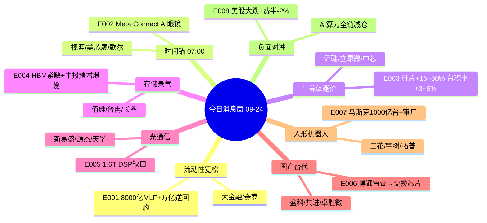

# 2026-09-24 · **消息面事件驱动**

> **数据源新鲜度**: partial · **降级状态**: true · **置信度**: 0.66
> **覆盖窗口**: 前 72h(09-21 09:00 ~ 09-24 06:45) · **主源**: 财联社快讯(2899条) + 重大要闻(800条) + 东财中报预告(500条) + 5 焦点群(456条) + 前晚公告分类(1329条)
> **情绪周期**: 高位震荡(炸板率33.8% ≥ 25% · 溢价-0.37% · 连板天梯4) → **候选数砍半 + 高位票只做低吸不做追高**

## 一句话结论
今日消息面 = **流动性宽松(8000亿MLF)+ Meta Connect时间锚 + 半导体/存储涨价潮**三主线共振；但**美股隔夜大跌(费半-2%·英伟达CDS飙升)**为行业级负面对冲 → 高位算力/光模块只做低吸不做追高，低位国产替代(交换芯片/机器人)性价比更高。

## 🗺️ 消息面全景图

## 🎯 顶级事件详解(每事件三问 + 首推票思维链)

### E20260924_001 · 央行流动性宽松组合拳: 9/24开展8000亿MLF(1年期) + 9/28-10/8每日不超1万亿隔夜逆回购 · 跨季资金面保驾护航

**事件摘要**: 央行流动性宽松组合拳: 9/24开展8000亿MLF(1年期) + 9/28-10/8每日不超1万亿隔夜逆回购 · 跨季资金面保驾护航 · strength=high · polarity=正面 · weighted_score=0.7316 · 独立源数=4

**推理深度三问**:
- **大资金意图**: 流动性利好+成交额弹性双击
- **为什么走强**: 银行/大金融 事件链 → 东方财富
- **逻辑够不够硬**: 硬 · 万亿级跨季流动性投放为9月末资金面定调宽松，利好大金融/大盘蓝筹估值修复

#### 东方财富 300059.SZ · role=首推·券商互联网龙头
- **买入理由**: 央行放水直接利好券商成交额/两融预期；9/23券商缩量回调、9/24 MLF放量催化 · 中报预告=无 · 联动度=0.82
- **风险点**: 高位震荡期追高即套 · 高价股需竞价弱转强确认
- **止损条件**: 17.16 (20260923收盘 18.65 × 0.92 → 破位即流动性逻辑失效)
- **可验证假设**: 若开盘30分钟内主力净流入≤0 或板块炸板率升 → 假设不成立当日回避

#### 中信证券 600030.SH · role=次选·券商龙头
- **买入理由**: 券商板块权重龙头·流动性宽松核心受益 · 中报预告=无 · 联动度=0.78
- **风险点**: 高位震荡期追高即套 · 需板块联动确认
- **止损条件**: 24.65 (20260923收盘 26.79 × 0.92)
- **可验证假设**: 若开盘30分钟内主力净流入≤0 或板块炸板率升 → 假设不成立当日回避

### E20260924_002 · Meta Connect今日07:00开发者大会·扎克伯格主题演讲 + 无摄像头AI眼镜发布 + AI眼镜出货量+127%(Omdia) ·…

**事件摘要**: Meta Connect今日07:00开发者大会·扎克伯格主题演讲 + 无摄像头AI眼镜发布 + AI眼镜出货量+127%(Omdia) · 时间锚今日 · strength=high · polarity=正面 · weighted_score=0.88 · 独立源数=6

**推理深度三问**:
- **大资金意图**: 今日07:00 Meta Connect为唯一时间锚
- **为什么走强**: AI眼镜/消费电子 事件链 → 视涯科技
- **逻辑够不够硬**: 硬 · 今日07:00 Meta Connect 扎克伯格演讲+无摄像头AI眼镜为盘前最重要时间锚；AI眼镜爆发的最大瓶颈仍是缺'杀手级'场景(MAJOR 9/23) → 反证提示高位兑现风险

#### 视涯科技 688787.SH · role=首推·硅基OLED微显示
- **买入理由**: AI眼镜微显示核心供应商·9/21-22连续异动(视涯公告异动) + Meta无摄像头AI眼镜催化 · 中报预告=无 · 联动度=0.85
- **风险点**: 高位震荡期追高即套 · 高价股需竞价弱转强确认
- **止损条件**: 85.16 (20260923收盘 92.56 × 0.92 → 破位即Meta催化失效)
- **可验证假设**: 若开盘30分钟内主力净流入≤0 或板块炸板率升 → 假设不成立当日回避

#### 美芯晟 688458.SH · role=次选·AI眼镜传感器芯片
- **买入理由**: 互动平台实锤AI眼镜光学旋钮/眼动追踪/无线充电解决方案+多阶段调价(9/22 news_cls) · 中报预告=无 · 联动度=0.8
- **风险点**: 高位震荡期追高即套 · 高价股需竞价弱转强确认
- **止损条件**: 36.64 (20260923收盘 39.83 × 0.92)
- **可验证假设**: 若开盘30分钟内主力净流入≤0 或板块炸板率升 → 假设不成立当日回避

#### 歌尔股份 002241.SZ · role=次选·XR整机代工
- **买入理由**: 全球XR/AI眼镜代工龙头·Meta核心供应商 · 中报预告=无 · 联动度=0.75
- **风险点**: 高位震荡期追高即套 · 需板块联动确认
- **止损条件**: 22.49 (20260923收盘 24.45 × 0.92)
- **可验证假设**: 若开盘30分钟内主力净流入≤0 或板块炸板率升 → 假设不成立当日回避

### E20260924_003 · 半导体全面涨价: 12英寸硅片长约涨15-50%(外延片15-25%/抛光片40%+/二线客户超50%) + 台积电2027年1月代工价涨3…

**事件摘要**: 半导体全面涨价: 12英寸硅片长约涨15-50%(外延片15-25%/抛光片40%+/二线客户超50%) + 台积电2027年1月代工价涨3-6% · 引线框架/封装景气共振 · strength=high · polarity=正面 · weighted_score=0.7058 · 独立源数=6

**推理深度三问**:
- **大资金意图**: 涨价周期最纯正标的
- **为什么走强**: 半导体材料/硅片 事件链 → 沪硅产业
- **逻辑够不够硬**: 硬 · 涨价=景气上行铁证；但美股费半隔夜-2%与涨价利多对冲 → 高位半导体注意分歧

#### 沪硅产业 688126.SH · role=首推·12英寸硅片龙头
- **买入理由**: 国内12英寸大硅片龙头·直接受益抛光硅片涨价40%+ · 中报预告=无 · 联动度=0.85
- **风险点**: 高位震荡期追高即套 · 高价股需竞价弱转强确认
- **止损条件**: 22.89 (20260923收盘 24.88 × 0.92)
- **可验证假设**: 若开盘30分钟内主力净流入≤0 或板块炸板率升 → 假设不成立当日回避

#### 立昂微 605358.SH · role=次选·硅片+功率
- **买入理由**: 12英寸硅片+功率半导体双景气 · 中报预告=无 · 联动度=0.78
- **风险点**: 高位震荡期追高即套 · 需板块联动确认
- **止损条件**: 44.19 (20260923收盘 48.03 × 0.92)
- **可验证假设**: 若开盘30分钟内主力净流入≤0 或板块炸板率升 → 假设不成立当日回避

#### 中芯国际 688981.SH · role=次选·代工涨价映射
- **买入理由**: 台积电涨价映射国产代工·45nm以下满载 · 中报预告=无 · 联动度=0.76
- **风险点**: 高位震荡期追高即套 · 高价股需竞价弱转强确认
- **止损条件**: 111.68 (20260923收盘 121.39 × 0.92)
- **可验证假设**: 若开盘30分钟内主力净流入≤0 或板块炸板率升 → 假设不成立当日回避

### E20260924_004 · 存储超级景气: 小摩HBM规格降级不改紧缺底色·2026-2028需求CAGR 63% + 花旗上调美光目标价1300 + 美股存储普涨(美…

**事件摘要**: 存储超级景气: 小摩HBM规格降级不改紧缺底色·2026-2028需求CAGR 63% + 花旗上调美光目标价1300 + 美股存储普涨(美光+5%/闪迪+6%) + 佰维45亿扩产/普冉2.47亿并购 + 中报预增爆发 · strength=high · polarity=正面 · weighted_score=0.7402 · 独立源数=8

**推理深度三问**:
- **大资金意图**: 硬业绩+扩产+涨价三重共振
- **为什么走强**: 存储/HBM 事件链 → 佰维存储
- **逻辑够不够硬**: 硬 · 正反两面: 景气(小摩/花旗/扩产) vs 大空头伯里增加美光/Nebius空头(9/23 16:53 news_cls) → 高位存储情绪博弈·伯里空头为反面对冲

#### 佰维存储 688525.SH · role=首推·存储模组+先进封测
- **买入理由**: 中报扭亏+3200~3421%·45亿三期先进封测扩产(9/22公告)·存储涨价直接受益 · 中报预告=3200%~3421% · 联动度=0.88
- **风险点**: 高位震荡期追高即套 · 高价股需竞价弱转强确认
- **止损条件**: 204.87 (20260923收盘 222.69 × 0.92)
- **可验证假设**: 若开盘30分钟内主力净流入≤0 或板块炸板率升 → 假设不成立当日回避

#### 普冉股份 688766.SH · role=次选·NOR Flash+并购
- **买入理由**: 中报预增+2976%·拟2.47亿购诺亚长天49%构建非易失性存储完整布局(9/23公告) · 中报预告=2976% · 联动度=0.85
- **风险点**: 高位震荡期追高即套 · 高价股需竞价弱转强确认
- **止损条件**: 396.52 (20260923收盘 431.0 × 0.92)
- **可验证假设**: 若开盘30分钟内主力净流入≤0 或板块炸板率升 → 假设不成立当日回避

#### 长鑫科技 688825.SH · role=次选·DRAM国产龙头
- **买入理由**: 中报扭亏+1714~1934%·国产DRAM绝对龙头 · 中报预告=1714%~1934% · 联动度=0.82
- **风险点**: 高位震荡期追高即套 · 高价股需竞价弱转强确认
- **止损条件**: 53.93 (20260923收盘 58.62 × 0.92)
- **可验证假设**: 若开盘30分钟内主力净流入≤0 或板块炸板率升 → 假设不成立当日回避

### E20260924_005 · 光通信1.6T DSP缺口: 野村专家会·2026年需求超2000万颗出货仅1600-1700万缺口300-400万·2027年缺口拉大至6…

**事件摘要**: 光通信1.6T DSP缺口: 野村专家会·2026年需求超2000万颗出货仅1600-1700万缺口300-400万·2027年缺口拉大至6000-7000万 vs 4000-5000万 + 新易盛1.6T放量/泰国扩产 + 天孚CPO量产交付 · strength=high · polarity=正面 · weighted_score=0.6886 · 独立源数=5

**推理深度三问**:
- **大资金意图**: 高价股·高位(9/21-23回调)需竞价承接确认；隔夜费半-2%对冲
- **为什么走强**: 光模块/1.6T 事件链 → 新易盛
- **逻辑够不够硬**: 硬 · 正反两面: 1.6T缺口(利多) vs 美国FCC草拟光模块进口规则(华工科技回应无影响·9/23 23:50)·泰国产能承接是唯一变量 → 缺口逻辑硬但海外政策风险需跟踪

#### 新易盛 300502.SZ · role=首推·1.6T光模块龙头
- **买入理由**: 1.6T进入持续放量+泰国扩产+中报预增77-102%·1.6T DSP缺口最大受益 · 中报预告=77%~103% · 联动度=0.88
- **风险点**: 高位震荡期追高即套 · 高价股需竞价弱转强确认
- **止损条件**: 415.1 (20260923收盘 451.2 × 0.92)
- **可验证假设**: 若开盘30分钟内主力净流入≤0 或板块炸板率升 → 假设不成立当日回避

#### 源杰科技 688498.SH · role=次选·光芯片高弹性
- **买入理由**: 中报预增+1001~1112%·光芯片(DFB/EML)国产替代+1.6T受益 · 中报预告=1001%~1112% · 联动度=0.82
- **风险点**: 高位震荡期追高即套 · 高价股需竞价弱转强确认
- **止损条件**: 1596.18 (20260923收盘 1734.98 × 0.92)
- **可验证假设**: 若开盘30分钟内主力净流入≤0 或板块炸板率升 → 假设不成立当日回避

#### 天孚通信 300394.SZ · role=次选·CPO量产交付
- **买入理由**: CPO产品稳定量产交付+中报+25-45%(华鑫研报) · 中报预告=25%~45% · 联动度=0.8
- **风险点**: 高位震荡期追高即套 · 高价股需竞价弱转强确认
- **止损条件**: 253.37 (20260923收盘 275.4 × 0.92)
- **可验证假设**: 若开盘30分钟内主力净流入≤0 或板块炸板率升 → 假设不成立当日回避

### E20260924_006 · 国产算力/半导体替代: 传中国政府审查国有数据中心博通硬件(FT) → 国产交换芯片/白盒交换机/射频替代逻辑兑现 + 华为KPN伙伴+中科…

**事件摘要**: 国产算力/半导体替代: 传中国政府审查国有数据中心博通硬件(FT) → 国产交换芯片/白盒交换机/射频替代逻辑兑现 + 华为KPN伙伴+中科曙光/海光工控芯片落地 · strength=medium · polarity=正面 · weighted_score=0.6197 · 独立源数=6

**推理深度三问**:
- **大资金意图**: 单源(群聊·FT转述)→ top_events 门槛依赖国产替代主线背景确认；建议观察盘面资金
- **为什么走强**: 国产算力/交换芯片 事件链 → 盛科通信
- **逻辑够不够硬**: 中 · single_source=true: 博通审查核心催化来自群聊转述FT报道·无财联社直接源 → 顶格medium强度；但国产替代主线有华为KPN/中科曙光/海光多重落地背书

#### 盛科通信 688702.SH · role=首推·以太网交换芯片国产替代
- **买入理由**: 国内稀缺以太网交换芯片设计龙头·博通替代核心标的(群聊多源) · 中报预告=无 · 联动度=0.85
- **风险点**: 高位震荡期追高即套 · 高价股需竞价弱转强确认
- **止损条件**: 308.2 (20260923收盘 335.0 × 0.92)
- **可验证假设**: 若开盘30分钟内主力净流入≤0 或板块炸板率升 → 假设不成立当日回避

#### 共进股份 603118.SH · role=次选·白盒交换机
- **买入理由**: 800G高端交换机国产替代逻辑(群聊多源发酵) · 中报预告=无 · 联动度=0.78
- **风险点**: 高位震荡期追高即套 · 需板块联动确认
- **止损条件**: 16.87 (20260923收盘 18.34 × 0.92)
- **可验证假设**: 若开盘30分钟内主力净流入≤0 或板块炸板率升 → 假设不成立当日回避

#### 卓胜微 300782.SZ · role=次选·射频替代博通
- **买入理由**: BAW滤波器国产替代·博通全球份额87%被替代空间大(群聊) · 中报预告=无 · 联动度=0.76
- **风险点**: 高位震荡期追高即套 · 高价股需竞价弱转强确认
- **止损条件**: 70.62 (20260923收盘 76.76 × 0.92)
- **可验证假设**: 若开盘30分钟内主力净流入≤0 或板块炸板率升 → 假设不成立当日回避

### E20260924_007 · 人形机器人: 马斯克央视专访·2046年1000亿台 + 特斯拉Optimus量产在即 + 特斯拉长三角审厂(拓普/三花/均胜) + 宇树扭…

**事件摘要**: 人形机器人: 马斯克央视专访·2046年1000亿台 + 特斯拉Optimus量产在即 + 特斯拉长三角审厂(拓普/三花/均胜) + 宇树扭亏预增905-1055%+19台全AI集群表演 + 四足出货3.5万台 · strength=high · polarity=正面 · weighted_score=0.6714 · 独立源数=8

**推理深度三问**:
- **大资金意图**: 龙头地位最稳·回调低吸性价比
- **为什么走强**: 人形机器人 事件链 → 三花智控
- **逻辑够不够硬**: 硬 · 马斯克权威背书+审厂实锤+宇树业绩落地三叠加；但机器人IPO审核门槛收紧传闻(9/21财联社)为短线情绪反证

#### 三花智控 002050.SZ · role=首推·特斯拉执行器核心供应商
- **买入理由**: 特斯拉长三角审厂第一梯队(拓普/三花/均胜)·关节模组执行器核心 · 中报预告=无 · 联动度=0.86
- **风险点**: 高位震荡期追高即套 · 需板块联动确认
- **止损条件**: 33.11 (20260923收盘 35.99 × 0.92)
- **可验证假设**: 若开盘30分钟内主力净流入≤0 或板块炸板率升 → 假设不成立当日回避

#### 宇树科技 688836.SH · role=次选·整机+中报扭亏
- **买入理由**: 中报扭亏+905~1055%·全球四足龙头·19台全AI集群表演 · 中报预告=905%~1055% · 联动度=0.84
- **风险点**: 高位震荡期追高即套 · 高价股需竞价弱转强确认
- **止损条件**: 451.69 (20260923收盘 490.97 × 0.92)
- **可验证假设**: 若开盘30分钟内主力净流入≤0 或板块炸板率升 → 假设不成立当日回避

#### 拓普集团 601689.SH · role=次选·关节模组
- **买入理由**: 特斯拉审厂标的·机器人+汽车双轮 · 中报预告=无 · 联动度=0.8
- **风险点**: 高位震荡期追高即套 · 需板块联动确认
- **止损条件**: 42.22 (20260923收盘 45.89 × 0.92)
- **可验证假设**: 若开盘30分钟内主力净流入≤0 或板块炸板率升 → 假设不成立当日回避

### E20260924_008 · 美股隔夜大跌: 纳指-1.14%·费半-2.02%·AMD市值跌破1万亿 + 英伟达成CDS最活跃标的对冲需求飙升 + 大空头伯里增持美光/…

**事件摘要**: 美股隔夜大跌: 纳指-1.14%·费半-2.02%·AMD市值跌破1万亿 + 英伟达成CDS最活跃标的对冲需求飙升 + 大空头伯里增持美光/Nebius空头 → AI算力全链情绪承压 · strength=high · polarity=负面 · weighted_score=-0.85 · 独立源数=5

**推理深度三问**:
- **大资金意图**: 负面冲击·不构成买入建议·高位持仓减仓提示
- **为什么走强**: AI算力全链 事件链 → 中际旭创
- **逻辑够不够硬**: 硬 · 行业级利空: 高位算力持仓减仓/买点后置；与E003/E004/E005的涨价利多对冲→今日科技主线高开分歧概率大(错题本004: 只留利好条=漏检)

#### 中际旭创 300308.SZ · role=高位回避·光模块龙头(负面冲击)
- **买入理由**: 费半-2%+英伟达CDS对冲飙升直接冲击高位光模块·9/23回调中 · 中报预告=无 · 联动度=0.8
- **风险点**: 高位震荡期追高即套 · 高价股需竞价弱转强确认
- **止损条件**: 876.38 (负面事件·减仓触发位 20260923收盘 922.5 × 0.95 → 破位减仓)
- **可验证假设**: 若开盘30分钟内主力净流入≤0 或板块炸板率升 → 假设不成立当日回避

#### 寒武纪 688256.SH · role=高位回避·AI芯片(负面冲击)
- **买入理由**: 费半-2%+英伟达CDS波及国产AI芯片高位情绪 · 中报预告=无 · 联动度=0.78
- **风险点**: 高位震荡期追高即套 · 高价股需竞价弱转强确认
- **止损条件**: 1047.93 (负面事件·减仓触发位 20260923收盘 1103.08 × 0.95)
- **可验证假设**: 若开盘30分钟内主力净流入≤0 或板块炸板率升 → 假设不成立当日回避

#### 工业富联 601138.SH · role=高位回避·AI服务器(负面冲击)
- **买入理由**: AI服务器龙头·美股AI资本开支情绪波动传导 · 中报预告=无 · 联动度=0.75
- **风险点**: 高位震荡期追高即套 · 需板块联动确认
- **止损条件**: 59.83 (负面事件·减仓触发位 20260923收盘 62.98 × 0.95)
- **可验证假设**: 若开盘30分钟内主力净流入≤0 或板块炸板率升 → 假设不成立当日回避

## 📊 板块 × 事件热力矩阵

| 板块 | 事件锚 | 极性 | 强度 | 独立源数 | 中报预告 | 净综合置信 |
|------|--------|------|------|:--:|----------|:--:|
| 大金融/券商 | E20260924_001 | 正面 | high | 4 | 见下表 | 🟢🟢🟢 |
| AI眼镜/消费电子 | E20260924_002 | 正面 | high | 6 | 见下表 | 🟢🟢🟢 |
| 半导体材料/硅片 | E20260924_003/E20260924_008 | 正面 | high | 6 | 见下表 | 🟢🟢🟢 |
| 晶圆代工 | E20260924_003/E20260924_008 | 中性偏正 | medium | 6 | 见下表 | 🟢🟢🟡 |
| 存储/HBM | E20260924_004/E20260924_008 | 正面 | high | 8 | 见下表 | 🟢🟢🟢 |
| 先进封装 | E20260924_004 | 正面 | high | 8 | 见下表 | 🟢🟢🟢 |
| 光模块/1.6T | E20260924_005/E20260924_008 | 正面 | high | 5 | 见下表 | 🟢🟢🟢 |
| CPO/光互连 | E20260924_005 | 正面 | high | 5 | 见下表 | 🟢🟢🟢 |
| 国产算力/交换芯片 | E20260924_006 | 正面 | medium | 6 | 见下表 | 🟢🟢🟡 |
| 人形机器人 | E20260924_007 | 正面 | high | 8 | 见下表 | 🟢🟢🟢 |
| AI算力全链(负面) | E20260924_008 | 负面 | high | 5 | 见下表 | 🟢🟢🟢 |

## 🔥 中报业绩预告命中(硬 alpha 交叉验证)

从 `eastmoney_earnings_predict` 提取与本文事件板块交集 top10 预增:

| 代码 | 名称 | 预告类型 | 增速下限-上限 | 事件命中 | 逻辑强度 |
|------|------|----------|--------------|----------|:--:|
| 688525.SH | 佰维存储 | 预增/扭亏 | 3200%~3421% | E004 存储 | 🟢🟢🟢 |
| 688766.SH | 普冉股份 | 预增/扭亏 | 2976% | E004 存储 | 🟢🟢🟢 |
| 688825.SH | 长鑫科技 | 预增/扭亏 | 1714%~1934% | E004 存储 | 🟢🟢🟢 |
| 688498.SH | 源杰科技 | 预增/扭亏 | 1001%~1112% | E005 光芯片 | 🟢🟢🟢 |
| 688836.SH | 宇树科技 | 预增/扭亏 | 905%~1055% | E007 机器人 | 🟢🟢🟢 |
| 300502.SZ | 新易盛 | 预增/扭亏 | 77%~103% | E005 光模块 | 🟢🟢 |
| 300394.SZ | 天孚通信 | 预增/扭亏 | 25%~45% | E005 CPO | 🟢🟢 |
| 688041.SH | 海光信息 | 预增/扭亏 | 41.5%~52.3% | E006 国产算力 | 🟢🟢🟢 |
| 300613.SZ | 富瀚微 | 预增/扭亏 | 1640%~2164% | 半导体(功率) | 🟢🟢🟢 |
| 688308.SH | 欧科亿 | 预增/扭亏 | +46327% | E003 半导体材料(刀具) | 🟢🟢 |

## 关键证据

- 证据 1: 央行公告 9/24 开展 8000 亿 1 年期 MLF + 9/28-10/8 每日不超 1 万亿隔夜逆回购 → 跨季流动性大礼包 · 来源 news_cls(09-23 17:05/17:29) + news_major(债市收盘)
- 证据 2: Meta Connect 今日 07:00 开发者大会(扎克伯格演讲) + 无摄像头 AI 眼镜发布 → 盘前最强时间锚 · 来源 news_cls(09-24 06:30 财经提醒) + news_major(09-23 19:22)
- 证据 3: 12 英寸硅片长约涨价 15-50% + 台积电 2027-01 代工价上调 3-6% → 半导体涨价潮启动 · 来源 news_cls(09-23 21:56 / 09-24 03:37) + news_major
- 证据 4: 小摩 HBM 2026-2028 CAGR 63% + 花旗上调美光目标价 1300 + 佰维/普冉/长鑫中报预增 1714-3421% → 存储超级景气 · 来源 news_cls + eastmoney
- 证据 5: 野村光通信专家会 1.6T DSP 缺口 300-400 万颗 → 光通信供需硬缺口 · 来源 wechat_cli(追风交易台·多群转发)
- 证据 6: 美股隔夜纳指-1.14% 费半-2.02% + 英伟达成 CDS 最活跃标的 + 伯里空美光 → 行业级利空 · 来源 news_cls(09-24 04:00/04:18)

## 数据源审计

| 源 | 日期 | 状态 | 备注 |
|---|---|:--:|---|
| tushare/news_cls | 2026-09-24 | 🟢 | 2899 条·72h 回看(财联社+新浪) |
| tushare/news_major | 2026-09-24 | 🟢 | 800 条 |
| eastmoney/earnings_predict | 2026-09-24 | 🟢 | 500 条 · 2026H1 |
| wechat_cli_5groups | 2026-09-24 | 🟢 | 456 条 · 5 焦点群(匿名) |
| events_20260923 | 09-23 | 🟢 | 1329 条公告分类(前晚 event-tracker) |
| wechat_official(sanji) | 2026-09-24 | 🔴 | disabled · 用户 08-20 取消三刀源 |
| hithink_business_query | 2026-09-24 | 🔴 | MCP 本会话不可用 |
| vibe_trading/iwencai | 2026-09-24 | 🔴 | KEY 未配置 |
| weflow | 2026-09-24 | 🔴 | 404/ngrok 离线 |

## 不确定性 / 反证

1. **E006 博通审查为单源**(群聊转述 FT,无财联社直接源) → 顶格 medium,single_source=true;若盘中国产算力未放量则逻辑证伪
2. **美股隔夜大跌与 A 股涨价利多对冲**:费半-2% + 英伟达 CDS 飙升 → 今日科技主线高开分歧概率大,高位光模块/存储只做低吸不做追高
3. **Meta Connect 是否兑现 '杀手级场景'** 是 AI 眼镜主线最大不确定性;无摄像头眼镜隐私担忧(major 09-23)是负面对冲
4. **FCC 草拟数据中心光模块进口规则**(华工科技回应无影响) → 光模块海外政策风险需跟踪,泰国产能承接是唯一变量
5. **伯里增持美光/Nebius 空头** → 存储高位情绪博弈,中报硬业绩(佰维/普冉/长鑫)是安全垫但非免死金牌
6. hithink/iwencai 不可用 → 全部 top_pick_logic 为 llm_pure_no_verification,个股置信顶格 0.5

## 与其他 R/D/E 的关系

- 依赖: /Users/chenyang/Downloads/demo/沧海巨浪/data/research/20260924/R4_news.json(上游 raw) + events_20260923(前晚 event-tracker) + emotion_cycle(高位震荡)
- 被消费: R2 主线 / R5 个股画像 / R6 反证 / D1 预案(选 execution_pool 时优先 llm_with_*_verification 票,proxy/无验证票仅 watch)

## Sub-Agent 元数据

- skill: analyze_news_impact_v1@1.3
- artifact: data/research/20260924/R4_news.json
- method: llm_v1(五源硬约束 · 群聊+财联社+要闻+业绩预告+公告)
- 生成时刻: 2026-09-24T07:20:09+08:00
