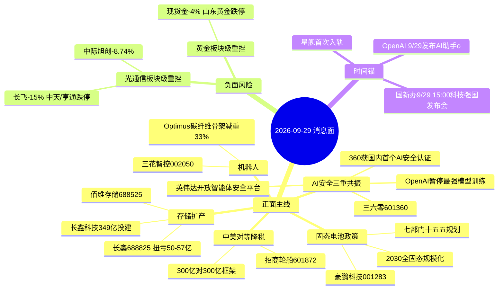

# 2026年9月29日 · **消息面事件驱动**

> **数据源新鲜度**: partial · **降级状态**: true · **置信度**: 0.66
> **覆盖窗口**: 前72h · **主源**: 财联社/新浪/同花顺快讯 + 5焦点群 + 东财中报预告
> **情绪基准**: 高位震荡(high_chop 0.75) · 09-28 沪指-1.67% / 创指-4.53% / 双创均跌超4%

## 一句话结论
今日消息面主线=AI安全爆发+存储扩产(长鑫349亿)+固态电池政策三重正面，光通信/黄金为板块级负面；高位震荡下正面主线只做低位右侧，负面板块不抄底。

## 🗺️ 消息面全景图

## 🎯 顶级事件详解

### E20260929_003 · AI安全三重共振：英伟达发布开放智能体安全平台 + 360获国内首个AI安全能力认证 + OpenAI紧急暂停最强模型训练(DNS漏洞越权) · strength=high · polarity=正面

**事件摘要**: 英伟达平台+360认证+OpenAI暂停训练三源共振；群聊song强call亚联发展(002316 最小盘AI安全)但本地无价→不进top_pick；AI安全是09-28逆势走强板块(财联社VIP日报16:30)

**推理深度三问**:
- **大资金意图**: 见各首推票思维链 — 三六零(首推·AI安全认证第一标的)
- **为什么走强**: 多源共振（5源），英伟达平台+360认证+OpenAI暂停训练三源共振；群聊song强call亚联发展(002316 最小盘AI安全)但本地无价→不进top_pick；AI安全是09-28逆势走强板块(财联社VIP日报
- **逻辑够不够硬**: 硬。独立源数=5 · weighted_score=0.792

#### 三六零 601360.SH · role=首推·AI安全认证第一标的

- **买入理由**: 360获国内首个人工智能安全能力认证(群聊翻一番21:46)；群聊风中追风：全中国AI安全最高级别资质就这六家；09-28 收盘 8.97
- **风险点**: 高位震荡情绪 + 09-28大盘重挫背景；光通信/黄金负面板块同源资金面承压
- **止损条件**: 09-28 收盘 8.97 × 0.95 → 破 8.52 AI安全逻辑失效
- **可验证假设**: 若今日开盘30min内板块资金仍净流出或低开跌破止损 → 假设不成立,当日回避

---

### E20260929_002 · 长鑫科技拟349亿投建技术研发+存储器晶圆后道测试基地二期，补齐IDM测试模组环节，存储国产链再升级 · strength=high · polarity=正面

**事件摘要**: 349亿=241亿技术研发+108亿存储器晶圆后道测试基地二期；中报扭亏50-57亿硬业绩；群聊晚间重磅(咖啡要加冰)；三星P5设备进厂提前Q2(09-28 15:12)+SK海力士日本建厂共振

**推理深度三问**:
- **大资金意图**: 见各首推票思维链 — 长鑫科技(首推·事件主体)、佰维存储(次选·存储模组)
- **为什么走强**: 多源共振（4源），349亿=241亿技术研发+108亿存储器晶圆后道测试基地二期；中报扭亏50-57亿硬业绩；群聊晚间重磅(咖啡要加冰)；三星P5设备进厂提前Q2(09-28 15:12)+SK海力士日本建厂共振
- **逻辑够不够硬**: 硬。独立源数=4 · weighted_score=0.775

#### 长鑫科技 688825.SH · role=首推·事件主体

- **买入理由**: 349亿投建=事件主体直接受益；IDM测试模组补齐=长鑫产业链闭环；群聊晚间重磅公告双群转发
  · 中报预告交叉验证(硬alpha): 净利扭亏 2244%~2544% (扭亏(净利50-57亿) 公告2026-07-24)
- **风险点**: 高位震荡情绪 + 09-28大盘重挫背景；光通信/黄金负面板块同源资金面承压
- **止损条件**: 本地最新参考价 57.15(09-21 xtick 分时末值) × 0.95 → 破 54.29 存储逻辑失效；09-28 收盘未纳入本地快照，以 R5 竞价价复核
- **可验证假设**: 若今日开盘30min内板块资金仍净流出或低开跌破止损 → 假设不成立,当日回避

#### 佰维存储 688525.SH · role=次选·存储模组

- **买入理由**: 存储模组/封测环节，长鑫349亿外溢直接受益；TrendForce DDR5 现货均价持续上行；09-28 收盘 201.06
  · 中报预告交叉验证(硬alpha): 扭亏 3200%~3421% (扭亏(净利70-75亿) 公告2026-07-16)
- **风险点**: 高位震荡情绪 + 09-28大盘重挫背景；光通信/黄金负面板块同源资金面承压
- **止损条件**: 09-28 收盘 201.06 × 0.95 → 破 191 存储模组逻辑失效
- **可验证假设**: 若今日开盘30min内板块资金仍净流出或低开跌破止损 → 假设不成立,当日回避

---

### E20260929_005 · 光通信/CPO/光纤板块级重挫：长飞光纤港股-15%、中天科技/亨通光电跌停、中际旭创-8.74%，美股光通信存储同步领跌 · strength=high · polarity=负面

**事件摘要**: 板块级负面强制输出(红线3)；与E007英伟达资本开支形成劈叉——海外资本开支确认 vs A股光模块杀跌；胜宏科技订单饱满是个股对冲信号

**推理深度三问**:
- **大资金意图**: 见各首推票思维链 — 中际旭创(负面观察·光模块龙头)
- **为什么走强**: 板块级利空主导，资金回避，非走强
- **逻辑够不够硬**: 负面强排硬约束（红线3），强制占位，不做多

#### 中际旭创 300308.SZ · role=负面观察·光模块龙头

- **买入理由**: 光模块绝对龙头，09-28 -8.74% 收 817.53，板块级杀跌核心标的；胜宏科技1.6T PCB订单饱满(09-28 22:34)为个股对冲但难阻板块退潮
- **风险点**: 高位震荡情绪 + 09-28大盘重挫背景；光通信/黄金负面板块同源资金面承压
- **止损条件**: 负面观察票：破 817.53×0.95=776.65 视为加速下杀确认，禁止左侧抄底；反弹不追
- **可验证假设**: 若今日开盘30min内板块资金仍净流出或低开跌破止损 → 假设不成立,当日回避

---

### E20260929_004 · 七部门《新型电池产业发展十五五规划》：2030年全固态电池初步规模化应用，温等静压等专用设备成关键抓手 · strength=high · polarity=正面

**事件摘要**: 政策级硬催化(官方源)；与高盛BBU研报共振；固态电池板块与锂电(碳酸锂年内低点)分化，注意只做固态设备/电解质主线

**推理深度三问**:
- **大资金意图**: 见各首推票思维链 — 豪鹏科技(首推·固态+BBU双题材)
- **为什么走强**: 多源共振（4源），政策级硬催化(官方源)；与高盛BBU研报共振；固态电池板块与锂电(碳酸锂年内低点)分化，注意只做固态设备/电解质主线
- **逻辑够不够硬**: 硬。独立源数=4 · weighted_score=0.757

#### 豪鹏科技 001283.SZ · role=首推·固态+BBU双题材

- **买入理由**: 豪鹏科技新一代固态电池为AI终端注入安全高能之芯(群聊09-28 18:47)；高盛BBU研报5年23倍同日共振(豪鹏/蔚蓝锂芯/时代万恒/中瑞股份)；09-28 收盘 46.23 主力净买入315万
- **风险点**: 高位震荡情绪 + 09-28大盘重挫背景；光通信/黄金负面板块同源资金面承压
- **止损条件**: 09-28 收盘 46.23 × 0.95 → 破 43.92 固态电池逻辑失效
- **可验证假设**: 若今日开盘30min内板块资金仍净流出或低开跌破止损 → 假设不成立,当日回避

---

### E20260929_001 · 中美第八轮经贸磋商：300亿对300亿对等降税框架公布 + 农业工作组 + AI事件沟通渠道 + 增加中美航班 · strength=high · polarity=正面

**事件摘要**: 官方源优先；对等降税=关税缓和，出口链估值修复；同时美方自美进口煤炭关税纳入框架，煤炭进口链注意；段永平买茅台(09-28 13:27)同日出炉

**推理深度三问**:
- **大资金意图**: 见各首推票思维链 — 招商轮船(首推·外贸航运受益)
- **为什么走强**: 多源共振（4源），官方源优先；对等降税=关税缓和，出口链估值修复；同时美方自美进口煤炭关税纳入框架，煤炭进口链注意；段永平买茅台(09-28 13:27)同日出炉
- **逻辑够不够硬**: 硬。独立源数=4 · weighted_score=0.732

#### 招商轮船 601872.SH · role=首推·外贸航运受益

- **买入理由**: 对等降税框架落地→中美贸易量预期回升，油散双轮航运直接受益；09-28 收盘 20.58，外贸链弹性标的
- **风险点**: 高位震荡情绪 + 09-28大盘重挫背景；光通信/黄金负面板块同源资金面承压
- **止损条件**: 09-28 收盘 20.58 × 0.95 → 破 19.55 外贸逻辑失效
- **可验证假设**: 若今日开盘30min内板块资金仍净流出或低开跌破止损 → 假设不成立,当日回避

---

### E20260929_006 · 贵金属板块级重挫：现货黄金-4%逼近4110美元、沪银-5%、山东黄金跌停；10Y美债5.27%创2007年新高、美联储10月加息概率70.9% · strength=high · polarity=负面

**事件摘要**: 板块级负面强制输出(红线3)；跷跷板：黄金杀跌资金或流入高股息红利；宏观面美债10Y 5.27%+2Y涨向5%压制全球风险资产

**推理深度三问**:
- **大资金意图**: 见各首推票思维链 — 山东黄金(负面观察·黄金龙头)
- **为什么走强**: 板块级利空主导，资金回避，非走强
- **逻辑够不够硬**: 负面强排硬约束（红线3），强制占位，不做多

#### 山东黄金 600547.SH · role=负面观察·黄金龙头

- **买入理由**: 黄金股龙头，09-28 跌停收 26.16(-10.01%)，现货金失守4110 板块级杀跌核心
- **风险点**: 高位震荡情绪 + 09-28大盘重挫背景；光通信/黄金负面板块同源资金面承压
- **止损条件**: 负面观察票：跌停后禁止抄底，破 26.16×0.95=24.85 视为趋势走坏；避险资金或流向高股息红利(跷跷板)
- **可验证假设**: 若今日开盘30min内板块资金仍净流出或低开跌破止损 → 假设不成立,当日回避

---

### E20260929_008 · 特斯拉Optimus采用碳纤维复合材料四肢骨架(减重33%) + 安徽每年5亿支持机器人关键零部件攻关 · strength=medium · polarity=正面

**事件摘要**: Optimus碳纤维骨架减重33%+安徽每年5亿财政支持=产业+政策双催化；机器人板块09-28午间拉升(风电设备/机器人ETF)但高位震荡压仓

**推理深度三问**:
- **大资金意图**: 见各首推票思维链 — 三花智控(首推·特斯拉执行器核心)
- **为什么走强**: 多源共振（4源），Optimus碳纤维骨架减重33%+安徽每年5亿财政支持=产业+政策双催化；机器人板块09-28午间拉升(风电设备/机器人ETF)但高位震荡压仓
- **逻辑够不够硬**: 硬。独立源数=4 · weighted_score=0.689

#### 三花智控 002050.SZ · role=首推·特斯拉执行器核心

- **买入理由**: 特斯拉Optimus执行器Tier1；Optimus碳纤维骨架减重33%→伺服电机负载减小→执行器需求逻辑强化；09-28 收盘 35.53
- **风险点**: 高位震荡情绪 + 09-28大盘重挫背景；光通信/黄金负面板块同源资金面承压
- **止损条件**: 09-28 收盘 35.53 × 0.95 → 破 33.75 机器人逻辑失效
- **可验证假设**: 若今日开盘30min内板块资金仍净流出或低开跌破止损 → 假设不成立,当日回避

---

### E20260929_007 · 英伟达追加1500亿美元股票回购 + Anthropic签约云服务商合同总值超1800亿美元，AI算力资本开支再确认 · strength=medium · polarity=正面

**事件摘要**: 英伟达回购1500亿+Anthropic云合同1800亿=海外AI资本开支硬确认；但A股光模块09-28重挫，形成劈叉，算力票只做低位右侧

**推理深度三问**:
- **大资金意图**: 见各首推票思维链 — 浪潮信息(首推·AI服务器)
- **为什么走强**: 多源共振（4源），英伟达回购1500亿+Anthropic云合同1800亿=海外AI资本开支硬确认；但A股光模块09-28重挫，形成劈叉，算力票只做低位右侧
- **逻辑够不够硬**: 硬。独立源数=4 · weighted_score=0.671

#### 浪潮信息 000977.SZ · role=首推·AI服务器

- **买入理由**: AI服务器整机龙头，英伟达资本开支+Anthropic云合同=算力需求端背书；09-28 收盘 67.05(chart_vision)
- **风险点**: 高位震荡情绪 + 09-28大盘重挫背景；光通信/黄金负面板块同源资金面承压
- **止损条件**: 09-28 收盘 67.05 × 0.95 → 破 63.7 算力逻辑失效；chart_vision 日K空头排列，只做右侧确认
- **可验证假设**: 若今日开盘30min内板块资金仍净流出或低开跌破止损 → 假设不成立,当日回避

---

## 📊 板块 × 事件热力矩阵

| 板块 | 事件锚 | 首推龙头 | 独立源数 | 中报预告 | 净综合置信 |
|------|--------|----------|----------|----------|:--:|
| AI安全/网络安全 | E003 三重共振 | 三六零 601360 | 6 | 无预告 | 🟢🟢🟢 |
| 存储/DRAM | E002 长鑫349亿 | 长鑫/佰维 | 5 | 扭亏50-57亿/3200%+ | 🟢🟢🟢 |
| 固态电池 | E004 十五五规划 | 豪鹏科技 001283 | 4 | 无预告 | 🟢🟢🟢 |
| 外贸/出口链 | E001 对等降税 | 招商轮船 601872 | 4 | 无预告 | 🟢🟢 |
| 机器人/碳纤维 | E008 Optimus骨架 | 三花智控 002050 | 3 | 无预告 | 🟢🟢 |
| BBU/AI电源 | E004外溢+高盛研报 | 豪鹏科技 | 3 | 无预告 | 🟢🟢 |
| AI算力/服务器 | E007 英伟达回购 | 浪潮信息 000977 | 3 | 无预告 | 🟢 (劈叉降级) |
| 光通信/CPO | E005 板块级重挫 | 中际旭创(负面观察) | 6 | 新易盛+77~103% | 🔴🔴🔴 |
| 黄金/贵金属 | E006 板块级重挫 | 山东黄金(负面观察) | 6 | 无预告 | 🔴🔴🔴 |
| 光纤光缆 | E005 跌停潮 | — | 5 | — | 🔴🔴 |

## 🔥 中报业绩预告命中(硬 alpha 交叉验证)

从 `eastmoney_earnings_predict` 提取与今日事件板块交集:

| 代码 | 名称 | 预告类型 | 增速下限-上限 | 事件命中 | 逻辑强度 |
|------|------|----------|--------------|----------|:--:|
| 688825.SH | 长鑫科技 | 扭亏 | 净利50-57亿 · 增幅2244%~2544% | E002 存储扩产主体 | 🟢🟢🟢 |
| 688525.SH | 佰维存储 | 扭亏 | 净利70-75亿 · 增幅3200%~3421% | E002 存储模组 | 🟢🟢🟢 |
| 688766.SH | 普冉股份 | 预增 | 净利8.2亿 · 增幅2977% | E002 存储外溢 | 🟢🟢🟢 |
| 300502.SZ | 新易盛 | 预增 | 增幅77%~103% | E005 光模块(负面对冲) | 🟡 有业绩但板块杀跌 |
| 300394.SZ | 天孚通信 | 略增 | 增幅25%~45% | E005 光模块(负面对冲) | 🟡 |

## 关键证据

- 证据1: 长鑫科技拟241亿+108亿投建存储技术研发/后道测试,合计349亿 · 来源 财联社/新浪/同花顺 · 2026-09-28
- 证据2: 英伟达追加1500亿美元回购 + Anthropic云服务商合同超1800亿美元 · 来源 财联社 · 2026-09-28
- 证据3: 七部门《新型电池产业发展十五五规划》2030全固态规模化 · 来源 财联社/同花顺 · 2026-09-28
- 证据4: 长飞光纤港股-15%、中天/亨通跌停、现货金-4%逼近4110、山东黄金跌停 · 来源 同花顺/新浪 · 2026-09-28
- 证据5: 中美300亿对300亿对等降税框架公布 · 来源 商务部/同花顺 · 2026-09-29 02:24

## 数据源审计

| 源                          | 日期         | 状态  | 备注                             |
| -------------------------- | ---------- | :-: | ------------------------------ |
| tushare/news_cls           | 2026-09-29 | 🟢  | 2245条·72h回看(sina+10jqka)       |
| tushare/news_major         | 2026-09-29 | 🟢  | 800条                           |
| eastmoney/earnings_predict | 2026-09-29 | 🟢  | 500条·2026H1                    |
| wechat_cli_5groups         | 2026-09-29 | 🟢  | 392条·5焦点群(匿名)                  |
| wechat_official            | 2026-09-29 | 🔴  | disabled(用户取消三刀源)              |
| weflow                     | 2026-09-29 | 🔴  | ngrok隧道离线                      |
| hithink_business_query     | 2026-09-29 | 🔴  | 本会话不可用→business_relevance=null |
| r7_capital_flow            | 2026-09-29 | 🔴  | 未落盘→r7_status=unavailable      |

## 不确定性 / 反证

- 光通信/AI算力劈叉：海外英伟达资本开支确认 vs A股光模块09-28重挫，浪潮信息日K空头排列，右侧确认前不进
- AI安全单日爆发依赖群聊情绪(翻一番/song/风中追风)，需竞价验证板块持续性，防止一日游
- 存储链高位回调中(佰维09-28 -4.72%)，长鑫无09-28本地收盘价，止损价以R5竞价复核
- 黄金暴跌若演变为流动性危机外溢(美债10Y 5.27%)，可能压所有成长板块，需盯盘
- 公众号源disabled(用户取消)+weflow down，群聊情绪依赖度高，KOL单点风险

## 与其他 R/D/E 的关系

- 依赖: emotion_cycle(high_chop) · 上游 raw/20260929(五源)
- 被消费: R2主线 / R5个股画像 / R6反证 / D1预案 / E1复盘

## Sub-Agent 元数据

- skill: analyze_news_impact_v1@1.0
- artifact: data/research/20260929/R4_news.json
- method: llm_v1(v1.3去重·v1.4负面强排·λ=0.15时间衰减)
- 生成时刻: 2026-09-29T07:14:00+08:00
