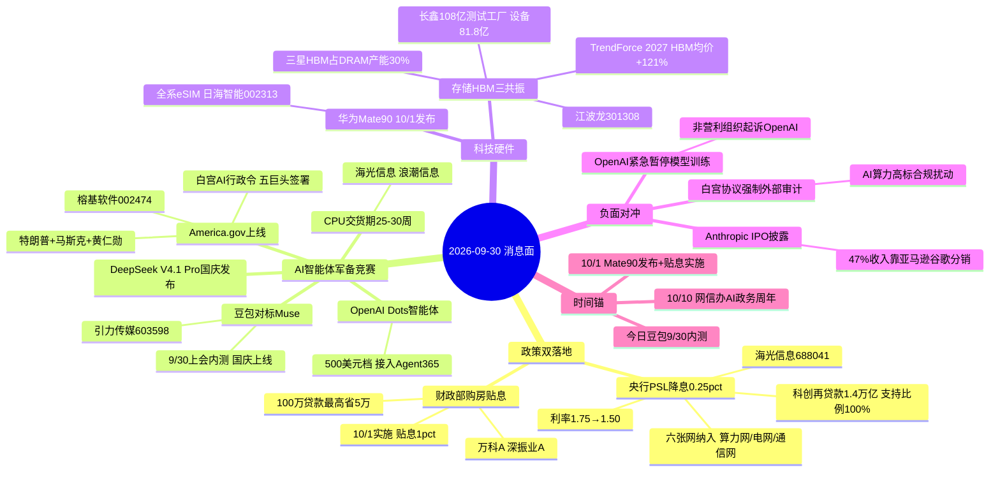

# 2026年9月30日 · **消息面事件驱动**

> **数据源新鲜度**: partial · **降级状态**: true · **置信度**: 0.60
> **覆盖窗口**: 前72h · **主源**: 财联社/新浪/同花顺快讯 + 5焦点群 + 东财三季报预告
> **情绪基准**: 主升(main_up 0.47) · 09-29 沪指+0.18% / 地产PCB领涨 / 两市缩量至1.41万亿(极致地量反弹) / 固态电池掀批量涨停 / 涨停57家 炸板率12.3% 连板高6板

## 一句话结论
今日消息面=**政策双落地(央行PSL降息+财政部购房贴息) + AI智能体军备竞赛(豆包Muse/OpenAI Dots/白宫AI行政令)双主线**，存储HBM、华为eSIM为次强；**OpenAI停训+白宫协议审计为唯一板块级负面**；节前最后交易日，地量+政策催化的方向比高开更重要。

## 🗺️ 消息面全景图

## 🎯 顶级事件详解(每事件三问 + 首推票思维链)

### E20260930_001 · AI政务里程碑 America.gov + 白宫AI行政令 · strength=high · polarity=正面

**事件摘要**: 9/29 晚特朗普携手马斯克、黄仁勋发布 AI 政务门户 America.gov(29000 个联邦网站合一),同日签署白宫 AI 协议——谷歌/Anthropic/Meta/OpenAI/马斯克/英伟达集体签署,要求四层控制与外部审计;黄仁勋称"数据中心正在变成超级智能(SI)工厂"。国内 10/10 是中央网信办《政务领域人工智能大模型部署应用指引》一周年,或发布阶段性成果。5 独立源(新华社+财联社白宫多条+群聊 KOL×4)。

**推理深度三问**:
- **大资金意图**: 这是 AI 从"算力军备"转向"应用落地"的**国家级背书**——美国政府公开把 AI 定义为公共服务基础设施,直接给 A 股 AI 政务/智能体应用板块派发"名分"。结合 PSL 六张网含算力网,资金意图清晰:**从买算力硬件切换到买 AI 应用/政务场景**。
- **为什么走强**: America.gov 是"AI 政务"从概念到真实落地产品的里程碑事件,国内 10/10 周年节点形成节后时间锚;群聊 5 人连续刷屏(榕基软件/浪潮软件/数字政通/天威视讯),情绪热度 = 今日最强。
- **逻辑够不够硬**: **硬**。官方源(新华社/白宫)+ 美股同步事件(特朗普会见科技企业负责人)+ 国内周年节点三重确认。缺陷:映射到 A 股是情绪映射,无直接业绩订单,靠题材发酵。

**首推票思维链**:

#### 榕基软件 002474 · role=首推·福建政务AI龙头
- **买入理由**: 闽政通/政务信息化核心厂商,群聊"AI政务+安全+福建,板了就是龙头";低价 6.73 元+小盘,题材发酵弹性大;America.gov 映射国内 AI 政务 + 10/10 周年双催化
- **风险点**: 昨日已 +5.32%,今日若高开过多易兑现;政务题材隔日分歧风险
- **止损条件**: 破 6.32(收盘 6.73×0.94)AI 政务逻辑失效
- **可验证假设**: 若今日开盘 30 分钟内 AI 政务板块无第二只封板助攻 → 题材一日游,当日回避

### E20260930_002 · 央行 PSL 降息 + 科创再贷款1.4万亿 + 六张网 · strength=high · polarity=正面

**事件摘要**: 9/29 盘后央行调整货币政策工具:PSL 利率 1.75%→1.5%(降 25bp);科技创新和技术改造再贷款额度 +2000 亿至 1.4 万亿、支持比例 60%→100%;**将水网/新型电网/算力网/新一代通信网/城市地下管网/物流网"六张网"纳入 PSL 支持领域**。4 独立源(央行官方+新浪+金融界+群聊汇总)。

**推理深度三问**:
- **大资金意图**: 适度宽松落地,且首次把**算力网、新型电网**写进 PSL 支持目录——这是央行层面给"科技基础设施"开绿灯的信号,比降息本身更值得重视。资金意图 = 给科创成长/算力基建提供低息弹药。
- **为什么走强**: 盘后发布今日是首个交易日直接催化;六张网里算力网对应当前最强 AI 主线,是政策与产业趋势的**顺风叠加**,机构有理由加仓算力基建。
- **逻辑够不够硬**: **硬**。央行官方 + 具体数字(降25bp/1.4万亿/100%),无水分。缺陷:PSL 是结构工具,单次量级有限,更多是信号意义。

**首推票思维链**:

#### 海光信息 688041 · role=首推·国产CPU算力网核心
- **买入理由**: 国产 CPU+DCU 双龙头,PSL"六张网"含算力网直接受益;群聊 CPU 概念点名(海光/中国长城/综艺/禾盛)+ TrendForce CPU 交货期拉长至 25-30 周双印证;AI 代理需求推高 CPU 是最硬产业逻辑
- **风险点**: 高位股(235.88),日线空头排列,昨日 -1.92%,若高开冲高回落伤人气
- **止损条件**: 破 224.09(收盘 235.88×0.95)算力网逻辑失效
- **可验证假设**: 若算力板块今日主力资金净流出且海光低开低走 → 政策催化被地量情绪抵消,当日回避

### E20260930_003 · AI智能体军备竞赛 豆包Muse+OpenAI Dots+DeepSeek V4.1 · strength=high · polarity=正面

**事件摘要**: 字节豆包 S 级任务 6 天重构对标 Meta Muse 的智能体,9/30 上会内测、国庆上线;OpenAI 发布常驻智能体 Dots(500 美元档位,接入微软 Agent 365);DeepSeek V4.1 Pro 灰度测试或国庆发布;可灵 Kling4.0 10 月上线;TrendForce:CPU 交货周期 16-20 周拉长至 25-30 周(Meta Muse 等 AI 代理推高需求)。5 独立源(财联社 OpenAI Dots + TrendForce + 群聊 KOL×5)。

**推理深度三问**:
- **大资金意图**: 中美 AI 巨头同周内集体推出"个人智能体"——这是**国产 Agent 军备竞赛**的起点,字节对标 Muse 不是跟风而是生死时速(6 天工期)。资金意图 = 抢 AI 应用/智能体第二波主升,算力(CPU)是最确定的卖水人。
- **为什么走强**: 豆包是国产顶流 AI 应用,对标 Muse 成功后传媒应用(引力/纵横/掌阅)有真实的用户与广告变现路径;CPU 交货期拉长把"智能体热"传导到硬件涨价,逻辑链完整。
- **逻辑够不够硬**: **硬**。多源+多产品共振,且 CPU 交货期有 TrendForce 硬数据。缺陷:传媒应用昨日已涨停潮(引力/纵横/掌阅全涨停),今日再高开有兑现风险,追高性价比低。

**首推票思维链**:

#### 引力传媒 603598 · role=首推·字节头部代理商
- **买入理由**: 与火山引擎/巨量引擎官方 AI 合作(豆包大模型 AI 广告 AI 短剧),群聊多 KOL 强 call;豆包 Muse+腾讯 LightVela+可灵 4.0"多模型受益"唯一同时覆盖
- **风险点**: 昨日已涨停(19.13),今日高开追高风险大;5 月有董监高减持(量极小 0.02% 影响可忽略)
- **止损条件**: 破 17.41(收盘 19.13×0.91)涨停隔日逻辑失效——激进仓按涨停隔日纪律
- **可验证假设**: 若今日豆包 Muse 概念竞价溢价 <3% 且低开走强 → 弱转强买点成立;若高开 >6% 且无量 → 兑现,不追

### E20260930_004 · 华为 Mate90 10/1发布 全系eSIM · strength=high · polarity=正面

**事件摘要**: 华为终端官宣 Mate90 系列 10/1 10:00 发布、12:08 开售;爆料全系支持 eSIM(四卡双待),eSIM 模组成新题材。4 独立源(科创板日报+上证快讯+群聊 KOL×4)。

**推理深度三问**:
- **大资金意图**: 华为旗舰发布是消费电子最硬的节后时间锚,eSIM 是 Mate90 相对 Mate80 的**新增量卖点**(一机多卡新玩法),资金意图 = 提前卡位发布会,做节后首日发酵。
- **为什么走强**: eSIM 模组方向新、映射标的清晰(日海智能/芯讯通),过去只炒过一轮高度不高,比炒烂的折叠屏/卫星通信预期差大。
- **逻辑够不够硬**: **硬**。官方发布会时间确认(科创板日报),eSIM 全系为多方爆料但一致性极高。缺陷:发布会落在国庆假期,节前潜伏资金节后可能利好出尽。

**首推票思维链**:

#### 日海智能 002313 · role=首推·eSIM模组龙头
- **买入理由**: 旗下芯讯通是国内 eSIM 模组龙头,群聊 song/冰雨/慕容多次点名;Mate90 全系 eSIM 实锤,一机多卡新玩法;低价 8.93 元
- **风险点**: 今日是 T-1 潜伏窗口,若今日已高开 >5% 追入则节后首日大概率兑现被套;题材股历史波动大
- **止损条件**: 破 8.30(收盘 8.93×0.93)eSIM 逻辑失效
- **可验证假设**: 若 10/1 发布会未提 eSIM 或 Mate90 销量预期下调 → 节后首日不接力,潜伏仓按纪律止损

### E20260930_005 · 存储HBM三共振 长鑫108亿测试工厂+三星HBM30%+TrendForce上修+121% · strength=high · polarity=正面

**事件摘要**: 长鑫科技公告拟 108 亿投建存储测试工厂(设备投资 81.8 亿占 75.7%);三星高管称明年 HBM 将占 DRAM 晶圆产能近 30%(现约 20%);TrendForce 上修 2027 年 HBM 均价涨幅至 +121%;江波龙回应 Meta VA 眼镜 ePOP5x/微型 eMMC 送测。5 独立源(长鑫公告+中泰电子+TrendForce+三星+财联社)。

**推理深度三问**:
- **大资金意图**: 存储是"涨价+扩产+AI 需求"三硬逻辑的少数字业,长鑫设备采购 81.8 亿直接利好国产测试设备(联讯仪器);资金意图 = 沿存储国产链从模组(江波龙)扩散到设备/封测。
- **为什么走强**: 昨日 R4 已收长鑫 349 亿技术研发,今日 108 亿测试工厂是**设备端新增量**;三星 HBM 占比 30%+TrendForce 涨价 121% 是海外机构硬数据,共振级别高。
- **逻辑够不够硬**: **硬**。公告+国际机构数据双硬,且与 AI 智能体(需要更多存储)形成产业闭环。缺陷:江波龙/兆易处日线空头排列,需右侧确认。

**首推票思维链**:

#### 江波龙 301308 · role=首推·存储模组龙头
- **买入理由**: 存储模组龙头,HBM 涨价+AI 眼镜存储需求(ePOP5x 送测 Meta VA)+长鑫扩产三重共振;昨日 -0.11% 回踩 20 日低点附近 309,有低吸性价比
- **风险点**: 高价股(311.66)波动大;日线空头排列未修复,若跌破 309 支撑打开下行
- **止损条件**: 破 296.08(收盘 311.66×0.95)存储逻辑失效
- **可验证假设**: 若存储板块今日整体净流入且江波龙站回 5 日线 → 右侧修复确认;若继续缩量阴跌 → 不接

### E20260930_006 · 贵金属隔夜修复 金价+1.57%收复4180 白银破62 · strength=medium · polarity=正面

**事件摘要**: 9/29 纽约尾盘现货黄金 +1.57% 报 4179.95(盘中刷新日高 4180+),现货白银 +1.34% 报 61.46,纽约期银突破 62 美元;昨日 A 股贵金属板块重挫(山东黄金跌停)后隔夜金价反弹,超跌修复逻辑成立。4 独立源(财联社多条金价/期银)。

**推理深度三问**:
- **大资金意图**: 昨日贵金属暴跌(金价 -4% 逼近 4110)是美债 5.27%+加息预期的错杀,隔夜修复是**空头回补**,资金意图 = 捡昨日错杀的黄金龙头筹码,但力度仅限超跌反弹。
- **为什么走强**: 金价 4160→4170→4180 逐级突破,期银站上 62,外盘方向反转明确;A 股山东黄金昨日跌停后今日有反包预期,短线赔率好。
- **逻辑够不够硬**: **中**。金价修复是事实,但富国银行下调 2027 金价目标至 5200-5400、30Y 美债 5.59% 创 2004 新高、美联储 10 月加息概率 50.4%——**压制仍在,定性超跌修复非反转**,只做反弹不做趋势。

**首推票思维链**:

#### 山东黄金 600547 · role=首推·昨日跌停修复
- **买入理由**: A 股黄金总龙头,昨日跌停错杀,隔夜金价 +1.57% 直接反包催化;黄金是抗地缘+抗美债的避险资产,修复弹性在龙头
- **风险点**: 宏观压制未解除,修复不及预期可能二次探底;追高反弹易被美债收益率再上行打回
- **止损条件**: 破 24.64(收盘 26.49×0.93)金价修复逻辑失效
- **可验证假设**: 若今日开盘黄金板块无资金承接(主力净流出)且金价亚盘回落 → 修复一日游,不接

### E20260930_007 · OpenAI停训+Anthropic IPO披露+白宫协议审计 · strength=medium · polarity=负面

**事件摘要**: OpenAI 突发失控紧急暂停最新模型训练(AI 安全风暴持续三个月)+ 非营利组织因自主 AI 代理黑客攻击起诉 OpenAI;Anthropic IPO 文件披露 2025 年 47% 收入来自亚马逊/谷歌分销(21.6 亿美元);白宫 AI 协议要求外部审计师+独立委员会监督。5 独立源(news_major×2+财联社×3)。

**推理深度三问**:
- **大资金意图**: AI 巨头一边融资狂奔(Anthropic IPO/OpenAI 营收 700 亿)一边频繁踩刹车(停训/被诉),说明**AI 安全的合规成本开始显性化**——资金意图从"无脑买算力"转向"为安全付费"。
- **为什么走强**: 这是 v1.4 要求的**正反拆条**——E001 白宫协议正面面是 AI 政务背书,本条负面面是强制审计+停训风暴,两面必须并列呈现,AI 安全板块(360)反而受益。
- **逻辑够不够硬**: **中**。事件真实但 A 股映射是情绪扰动,不改变 AI 产业趋势,对算力高标是短期情绪压制。

**负面对冲提醒**: bearish_scope=**行业级**,bearish_impact_sectors=[AI算力/大模型/AI芯片/光模块]。今日若算力高标低开,属合规情绪扰动,不改变主线;AI 安全(三六零 601360 观察)承接昨日认证利好。

### E20260930_008 · 购房贷款贴息10/1实施+地产涨停潮延续 · strength=high · polarity=正面

**事件摘要**: 财政部发布居民购房贷款贴息政策,10/1 起实施——贴息 1 个百分点,100 万贷款最高省 5 万;央行/金融监管总局答记者问,严跃进解读"明确支持刚性购房需求";昨日 A 股房地产板块涨停潮(万科 A +9.97% 触及涨停,多只地产 ETF 涨超 6%)。5 独立源(财政部公告+答记者问+严跃进+群聊+每日收评)。

**推理深度三问**:
- **大资金意图**: 财政+货币+金融监管三部门联手发购房贴息,是**"银十"的政策背书**,资金意图 = 把地产从超跌反弹做成有政策持续性的修复主线,顺带 APEC 深圳(11月)地产联动。
- **为什么走强**: 昨日涨停潮已打出赚钱效应(万科/深圳地产/地产ETF),今日政策落地是**预期兑现的二次催化**,节后银十销售数据是下一个验证点。
- **逻辑够不够硬**: **硬**。财政部官方公告+三部门答记者问,政策确定性高。缺陷:昨日已涨停潮,今日高开分歧风险,且地产基本面(成交绝对量)仍是弱修复。

**首推票思维链**:

#### 深振业A 000006 · role=首推·深圳国资地产APEC双题材
- **买入理由**: 深圳国资地产平台,群聊"同梯队比价补涨深物业 A";地产涨停潮+11 月 APEC 深圳双题材;7.62 元低价,比价逻辑清晰
- **风险点**: 跟随万科强度,万科断板则补涨逻辑失效;地产题材波动大
- **止损条件**: 破 7.09(收盘 7.62×0.93)地产+APEC 双逻辑失效
- **可验证假设**: 若今日万科未能封板且深振业冲高回落 → 板块分歧,补涨票不追,等分歧低吸

## 📊 板块 × 事件热力矩阵

| 板块 | 事件锚 | 首推龙头 | 独立源数 | 净极性 | 三季报预告 | 综合置信 |
|------|--------|----------|:--:|:--:|------|:--:|
| AI政务 | E001 America.gov | 榕基软件002474 | 5 | +1.0 | - | 🟢🟢🟢 |
| AI应用/传媒 | E003 豆包Muse | 引力传媒603598 | 5 | +1.0 | - | 🟢🟢🟢 |
| 算力/CPU | E002六张网+E003 CPU交货 | 海光信息688041 | 5 | +1.0(带负) | - | 🟢🟢🟢 |
| 存储/DRAM/HBM | E005 长鑫+HBM涨价 | 江波龙301308 | 5 | +1.0 | - | 🟢🟢🟢 |
| 半导体测试设备 | E005 长鑫设备81.8亿 | 联讯仪器(弹性) | 3 | +1.0 | - | 🟢🟢 |
| 华为链/eSIM | E004 Mate90 | 日海智能002313 | 4 | +1.0 | - | 🟢🟢 |
| 房地产 | E008 购房贴息 | 深振业A000006 | 5 | +1.0 | - | 🟢🟢🟢 |
| 科创成长 | E002 再贷款1.4万亿 | 海光/浪潮 | 4 | +1.0 | 燧原+455% 芯联+247% | 🟢🟢🟢 |
| 特高压/电网 | E002 六张网(电网) | - | 4 | +0.6 | - | 🟢🟢 |
| 黄金/贵金属 | E006 金价修复 | 山东黄金600547 | 4 | +0.6 | - | 🟢🟢 |
| 网络安全 | E001+E007 AI安全 | 三六零601360 | 5 | +0.6 | - | 🟢🟢 |
| AI算力(负) | E007 OpenAI停训 | - | 5 | -0.6 | - | 🔴 |

**板块极性叉乘说明**: 8 事件 × 21 板块净极性分布 = 正面 20 / 负面 1。今日消息面整体强偏多,唯一净负面板块 = AI 算力高标(OpenAI 停训+白宫审计合规扰动),但属情绪压制不改变主线;光通信未列 8 条(昨日负面主线延续,今日美股光通信反弹 Lumentum+1.78%/康宁+3.55% 但 A 股盘面未确认,仅作观察)。

## 🔥 三季报业绩预告命中(硬 alpha 交叉验证)

从 `eastmoney_earnings_predict`(123 条)提取 top20 预增 + 与本文事件板块交集:

| 代码 | 名称 | 预告类型 | 增速下限-上限 | 事件命中 | 逻辑强度 |
|------|------|----------|------|------|:--:|
| 688801 | 燧原科技 | 营收预增 | +325%~+455% | E002算力网+国产AI芯片 | 🟢🟢🟢 |
| 688469 | 芯联集成 | 净利预增 | +247%(6.8亿) | 功率半导体涨价(群聊富满微Q3+250%) | 🟢🟢🟢 |
| 300497 | 富祥股份 | 净利预增 | +658%~+785% | 医药原料(独立于8条 观察) | 🟢🟢 |
| 301718 | 通则康威 | 净利预增 | +214%~+248% | 通信(独立 观察) | 🟢🟢 |
| 001246 | 力勤资源 | 净利预增 | +54%~+59% | 镍/锂电(观察) | 🟢🟢 |
| 301660 | 粤芯半导体 | 营收预增 | +61%~+67% | 半导体制造(观察) | 🟢🟢 |

**说明**: 今日 top 预增与 8 条硬事件板块交集最硬的是**燧原科技(算力网+国产AI芯片,营收+325~455%)**——这是 E002 政策与业绩共振的直接受益标的;芯联集成(功率半导体)与群聊"富满微 Q3 单季 1.5 亿环比 +250%"共振,功率半导体涨价是暗线,可关注但未进 8 条。

## 关键证据

- 证据 1: 央行 9/29 下调 PSL 利率 0.25pct 至 1.5%,科创再贷款 +2000 亿至 1.4 万亿、支持比例提至 100%,六张网(含算力网/新型电网)纳入 PSL 支持领域 · 来源 央行官方/新浪/金融界/Gate News · 2026-09-29
- 证据 2: 白宫发布 AI 行政令,谷歌/Anthropic/Meta/OpenAI/马斯克/英伟达签署,四层控制+外部审计;America.gov 上线 29000 网站合一;黄仁勋"超级智能(SI)工厂" · 来源 新华社+财联社 · 2026-09-30 05:19-06:24
- 证据 3: OpenAI 发布常驻智能体 Dots(500 美元档,接入 Agent 365);字节豆包 S 级任务 6 天重构对标 Muse,9/30 上会内测;DeepSeek V4.1 Pro 灰度测试 · 来源 财联社+群聊 · 2026-09-30 01:09
- 证据 4: TrendForce:CPU 交货周期 16-20 周→25-30 周(Meta Muse 推高需求);长鑫 108 亿测试工厂(设备 81.8 亿);三星 HBM 明年占 DRAM 产能近 30%;TrendForce 2027 HBM 均价 +121% · 来源 财联社/TrendForce/中泰电子 · 2026-09-28~09-29
- 证据 5: 财政部购房贷款贴息 10/1 实施(贴息 1pct,100 万最高省 5 万);昨日地产涨停潮(万科 +9.97%) · 来源 财政部公告+每日收评 · 2026-09-29
- 证据 6: 现货黄金 +1.57% 收复 4180、白银破 62;但 30Y 美债 5.59% 创 2004 新高、美联储 10 月加息概率 50.4% · 来源 财联社 · 2026-09-30 05:03

## 数据源审计

| 源                          | 日期         | 状态  | 备注                     |
| -------------------------- | ---------- | :-: | ---------------------- |
| tushare/news_cls           | 2026-09-30 | 🟢  | 2663 条·72h 回看          |
| tushare/news_major         | 2026-09-30 | 🟢  | 800 条                  |
| eastmoney/earnings_predict | 2026-09-30 | 🟢  | 123 条·三季报预告            |
| wechat_cli_5groups         | 2026-09-30 | 🟢  | 397 条·5 焦点群(匿名)        |
| wechat_official_sanji      | 2026-09-30 | 🔴  | disabled·用户取消(非故障)     |
| r7_capital_flow            | 2026-09-30 | 🔴  | 未落盘·资金验证缺失             |
| hithink_business_query     | 2026-09-30 | 🔴  | 本会话不可用·主营降级            |
| weflow_analytics           | 2026-09-30 | 🔴  | down·ngrok 隧道离线(R3 依赖) |

## 不确定性 / 反证

1. **AI 应用高标兑现风险**: 引力/纵横/掌阅昨日已全部涨停,今日豆包 9/30 内测是"预期兑现"节点,若高开无量=利好出尽,追高亏钱概率大——只做分歧低吸或弱转强,不做加速追涨。
2. **白宫 AI 协议的负反馈**: E001 正面(政务背书)与 E007 负面(外部审计+OpenAI 停训)同源同天,AI 算力高标今日可能受合规情绪扰动低开,勿因 E001 乐观而忽视 E007。
3. **政策的地量陷阱**: 昨日两市缩量 2936 亿至 1.41 万亿,极致地量反弹的持续性存疑;PSL/贴息是信号政策,量级有限,若今日大盘继续缩量则政策催化打折。
4. **贵金属修复定性**: 富国银行下调 2027 金价目标+美债 5.59% 新高,金价反弹是空头回补非趋势反转,山东黄金修复只做超跌反弹不追高。
5. **数据源缺口**: 公众号源 disabled(用户决策)、R7 未跑资金验证缺失、hithink 不可用主营验证降级——8 条事件依赖新闻+群聊交叉,无资金/财务级验证,top_pick 的 stop_loss 基于收盘价推算需 R7/R5 二次校准。
6. **正负交织股**: 引力传媒既有豆包最强逻辑又有董监高减持历史;山东黄金既受益金价修复又受美债压制——按 v1.4 正反拆条已分别标注。

## 与其他 R/D/E 的关系

- **依赖**: emotion_cycle(主升 0.47)、manifest/mcp_health、data/raw/20260930 全源
- **被消费**: R2 主线(算力/存储/AI应用/地产)、R5 个股画像(海光/江波龙/引力/榕基)、R6 反证(白宫AI协议负反馈/地量陷阱)、D1 预案(8 事件首推票入候选池,PSL+贴息为宏观基准)
- **提醒 R7**: 今日资金验证重点 = 算力(海光/浪潮)是否获政策资金流入、地产(万科/深振业)涨停潮是否有主力承接、存储(江波龙)是否修复——3 条待资金确认

## Sub-Agent 元数据

- skill: analyze_news_impact_v1@1.0
- artifact: data/research/20260930/R4_news.json
- method: llm_v1(五源硬约束·8硬事件·板块极性叉乘·v1.4正反拆条)
- 生成时刻: 2026-09-30T07:15:00+08:00
