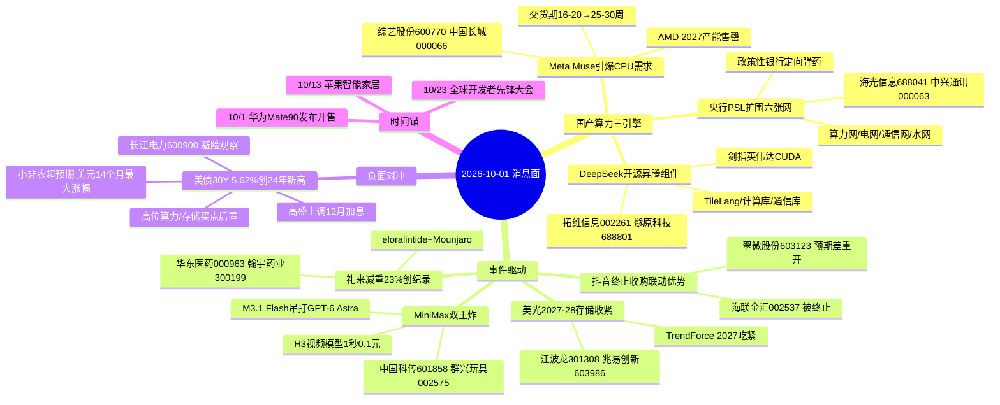

# 2026年10月1日 · **消息面事件驱动**

> **数据源新鲜度**: partial · **降级状态**: true · **置信度**: 0.68
> **覆盖窗口**: 前72h(9/28-10/1) · **主源**: 财联社/新浪/同花顺快讯 + 5焦点群 + 东财三季报预告
> **情绪基准**: 主升(main_up 0.49) · 09-30 沪指+0.31% / 创新药涨停潮 / 算力硬件调整 / 涨停52家 炸板率18.75% 连板高7板

## 一句话结论
今日消息面=**国产算力三引擎(央行PSL六张网 + Meta Muse/CPU交货期拉长 + DeepSeek开源昇腾) + 事件驱动(抖音支付牌照预期差/礼来减重23%)**，存储HBM、GLP-1为次强；**美债5.62%创24年新高为唯一行业级负面**，对高位算力/存储形成流动性压制——买点后置，只低吸不追高。

## 🗺️ 消息面全景图

## 🎯 顶级事件详解(每事件三问 + 首推票思维链)

### E20261001_001 · 央行 PSL 扩围六张网：算力网/新型电网/新一代通信网纳入抵押补充贷款支持领域 政策性银行定向弹药 · strength=high · polarity=正面

**事件摘要**: 央行 9/29 宣布调整货币政策工具，将水网、新型电网、算力网、新一代通信网、城市地下管网、物流网等六张网纳入抵押补充贷款(PSL)支持领域，引导政策性银行定向投放。国资委 9/28 已定调六张网为十五五开局重大部署，水利部 9/30 发布会披露前9月水利投资7950亿。4 独立源(10jqka+国资委+水利部+群聊×2)。

**推理深度三问**:
- **大资金意图**: 大资金意图: 央行直接把 PSL(政策性银行定向弹药)对准算力网/电网/通信网等新基建——这不是主题炒作，是**资金面+政策面双击**的产业级背书。算力网是六张网里最贴近 AI 主线的分支，资金意图=把 AI 算力从"商业资本驱动"升级为"国家信用驱动"。
- **为什么走强**: 为什么走强: 9/30 盘后国资委+水利部密集发声，政策在节前最后一天连续加码；群聊 08:19(荣)/08:25(慕容)同步转发"算力网纳入PSL 光通信或迎全方位提振"，与 Meta Muse 引爆 CPU 需求(E002)形成双事件共振。
- **逻辑够不够硬**: 逻辑够不够硬: **硬**。央行官方公告+国资委定调+水利部数据三重官方源，非传闻；PSL 是增量资金工具，直接拉基建资本开支。缺陷: 算力网占比未披露，短期情绪>订单。

**首推票思维链**:

#### 海光信息 688041.SH · role=首推·国产CPU算力网核心
- **买入理由**: 国产CPU/DCU龙头 算力网直接受益标的 六张网PSL=政策性银行定向资金买入算力基础设施 · 板块联动: 群聊慕容:算力网PSL 光通信提振; 09-30收226.80 -3.85% 回调至5日线下方 分歧买点
- **风险点**: 高位回调/题材分歧/单源事件(视事件而定); 高位回调 若今日继续放量下杀则放弃 企稳低吸
- **止损条件**: 破 210.92(09-30 收盘 226.8 × 0.93 → 破 210.92 算力网CPU)
- **可验证假设**: 若开盘 30 分钟 海光信息 量比<0.8 或板块内无跟风 → 假设不成立,当日回避; 仓位建议 0.1

#### 中兴通讯 000063.SZ · role=次选·通信网+服务器
- **买入理由**: 新一代通信网核心设备商 服务器存储收入+60%(09-30公告) · 板块联动: 群聊未点名 但六张网PSL直接利好通信设备 09-30收30.58 -0.46% 相对抗跌
- **风险点**: 高位回调/题材分歧/单源事件(视事件而定); 
- **止损条件**: 破 28.75(09-30 收盘 30.58 × 0.94 → 破 28.75 通信网设备)
- **可验证假设**: 若开盘 30 分钟 中兴通讯 量比<0.8 或板块内无跟风 → 假设不成立,当日回避; 仓位建议 0.08

### E20261001_002 · Meta Muse 引爆 CPU 需求：交货期 16-20 周→25-30 周 + AMD 2027 产能售罄 + 国产 · strength=high · polarity=正面

**事件摘要**: Meta 个人 AI 助手 Muse 上线12天下载280万，引爆 CPU 需求：TrendForce 报告 CPU 交货期从 16-20 周延长至 25-30 周；财联社 9/30 报道 AMD 新品火爆、2027 年产能已售罄；华创计算机称 CPU 主线全面走强。群聊 song 连续 3 次推荐国产 CPU(综艺股份走龙/禾盛新材/中国长城)。5 独立源。

**推理深度三问**:
- **大资金意图**: 大资金意图: AI 智能体(Muse/豆包/OpenAI Dots)是 CPU 需求的**二阶导**——大模型军备竞赛从 GPU 蔓延到 CPU 服务器。国产 CPU 是 A 股最纯映射，资金在找"算力涨价+国产替代"双重弹性的低位标的(综艺股份低价启动)。
- **为什么走强**: 为什么走强: 海外订单(AMD 售罄)是硬事实，交货期拉长=供需缺口可见；群聊 song 14:21 盘中点名"cpu综艺股份走龙了"，情绪在 9/30 尾盘已启动，21:35 盘后又推"国产CPU产业弹性"研报——节前最后一天仍被加推，节后惯性强。
- **逻辑够不够硬**: 逻辑够不够硬: **硬**。TrendForce 数据+财联社官方+AMD 产能售罄三重产业证据，非单纯题材。缺陷: 国产 CPU 与 AMD 景气传导有时滞，业绩兑现需 2-3 季度。

**首推票思维链**:

#### 综艺股份 600770.SH · role=首推·国产CPU弹性
- **买入理由**: 群聊song 14:21 点名cpu综艺股份走龙 21:35 国产CPU产业弹性推荐标的 · 板块联动: 群聊song:综艺股份走龙; 09-30收6.36 +2.91% 突破启动形态 低价弹性
- **风险点**: 高位回调/题材分歧/单源事件(视事件而定); 群聊强推 低价+国产CPU双属性 若一字板则放弃
- **止损条件**: 破 5.85(09-30 收盘 6.36 × 0.92 → 破 5.85 国产CPU)
- **可验证假设**: 若开盘 30 分钟 综艺股份 量比<0.8 或板块内无跟风 → 假设不成立,当日回避; 仓位建议 0.1

#### 中国长城 000066.SZ · role=次选·国产CPU整机
- **买入理由**: 中国电子旗下 国产CPU整机与信创主力 群聊song 10:54 列入重视CPU名单 · 板块联动: 09-30收14.10 -2.22% 跟随板块调整 企稳后仍有弹性
- **风险点**: 高位回调/题材分歧/单源事件(视事件而定); 
- **止损条件**: 破 13.11(09-30 收盘 14.1 × 0.93 → 破 13.11 国产CPU整机)
- **可验证假设**: 若开盘 30 分钟 中国长城 量比<0.8 或板块内无跟风 → 假设不成立,当日回避; 仓位建议 0.07

### E20261001_003 · MiniMax 双王炸：M3.1 Flash 吊打 GPT-6 Astra + H3 视频模型 1秒0.1元反超 See · strength=medium · polarity=正面

**事件摘要**: 群聊咖啡要加冰 9/30 连续在 3 个群发红包：MiniMax 双王炸——M3.1 Flash 实测吊打 GPT-6 Astra，H3 增强版视频模型 1 秒 0.1 元反超 Seedance 2.0，马斯克点赞 Opus 5.5 视频大作。v1.3 去重后合并为 1 条，单源群聊事件 → strength 顶格 medium。

**推理深度三问**:
- **大资金意图**: 大资金意图: 视频生成/多模态是 AI 应用变现最快的分支，MiniMax 定价战(1秒0.1元)说明国产模型开始抢商用市场。资金意图=提前埋伏 A 股"模型军备竞赛受益的版权/工具层"。
- **为什么走强**: 为什么走强: 纯情绪发酵，群聊红包刷屏制造热度；但 news_cls 无 MiniMax 条目，属单源，可信度打折——这是本事件只给 medium 的原因。
- **逻辑够不够硬**: 逻辑够不够硬: **中偏软**。产品真实存在(马斯克点赞)，但 A 股映射(中国科传=AI数据版权/群兴玩具=腾讯muse预期差)是间接逻辑，无订单验证。

**首推票思维链**:

#### 中国科传 601858.SH · role=首推·AI数据版权/大模型素材
- **买入理由**: 群聊他们叫我刘哥 14:38: 国内科技期刊/专业知识内容龙头 大量学术专业文本版权 海外学术内容是AI摘要/大模型高价值素材 · 板块联动: 群聊KOL独立提及 AI版权是模型军备竞赛稀缺资源 09-30收21.58 -2.40%
- **风险点**: 高位回调/题材分歧/单源事件(视事件而定); 单源群聊事件 降级medium 仅观察级首推
- **止损条件**: 破 20.07(09-30 收盘 21.58 × 0.93 → 破 20.07 AI数据版权)
- **可验证假设**: 若开盘 30 分钟 中国科传 量比<0.8 或板块内无跟风 → 假设不成立,当日回避; 仓位建议 0.06

#### 群兴玩具 002575.SZ · role=次选·腾讯muse预期差
- **买入理由**: 群聊song 14:31: 腾讯小微/腾讯muse 假期预期差 群兴玩具 · 板块联动: 群聊song点名 腾讯对标Muse预期差 低价弹性 09-30收5.00 -0.99%
- **风险点**: 高位回调/题材分歧/单源事件(视事件而定); 预期差主题 非产业逻辑 仓位轻
- **止损条件**: 破 4.6(09-30 收盘 5.0 × 0.92 → 破 4.6 AI应用概念)
- **可验证假设**: 若开盘 30 分钟 群兴玩具 量比<0.8 或板块内无跟风 → 假设不成立,当日回避; 仓位建议 0.05

### E20261001_004 · DeepSeek 开源华为昇腾全套组件：TileLang/计算库/分布式通信库 与英伟达组件一一对应 剑指 CUDA · strength=high · polarity=正面

**事件摘要**: DeepSeek 官微 9/30 正式开源面向华为昇腾算力平台的基础设施组件——TileLang 高级语言编译工具、计算库、分布式通信库，与英伟达平台组件一一对应，财联社定性"剑指英伟达CUDA"。叠加 9/28 华为开源盘古 openPangu-2.0、北京移动昇腾950DT千卡超节点落地。4 独立源。

**推理深度三问**:
- **大资金意图**: 大资金意图: 昇腾生态最缺的是软件栈，DeepSeek 开源=补上最后一块拼图，国产算力从"硬件能造"走向"软件能用"。资金意图=重估昇腾产业链(整机/芯片/应用)，这是国产算力叙事升级的关键一步。
- **为什么走强**: 为什么走强: 与 E002 CPU 主线共振，DeepSeek 是国产大模型旗帜，昇腾是国产芯片旗帜，双旗帜合流；燧原科技 1-9 月营收预增 325-455% 提供硬业绩锚。
- **逻辑够不够硬**: 逻辑够不够硬: **硬**。DeepSeek 官微+财联社+华为开源+北京移动落地四源，软硬件全链路验证。缺陷: 昇腾出货量/国产替代进度仍受产能约束。

**首推票思维链**:

#### 拓维信息 002261.SZ · role=首推·昇腾整机/算力
- **买入理由**: 华为昇腾整机与算力服务核心伙伴 国产算力软件栈受益DeepSeek开源昇腾 · 板块联动: DeepSeek开源昇腾组件=昇腾生态软件补全 拓维是昇腾硬件整机 09-30收23.72 -1.50%
- **风险点**: 高位回调/题材分歧/单源事件(视事件而定); 昇腾生态扩容 软件组件开源利好整机与应用层
- **止损条件**: 破 22.06(09-30 收盘 23.72 × 0.93 → 破 22.06 昇腾链)
- **可验证假设**: 若开盘 30 分钟 拓维信息 量比<0.8 或板块内无跟风 → 假设不成立,当日回避; 仓位建议 0.1

#### 燧原科技 688801.SH · role=次选·国产AI芯片 硬业绩
- **买入理由**: 国产AI芯片独角兽 2026年1-9月营收预增325.78%~455.36%(eastmoney_earnings_predict 硬alpha) · 板块联动: 国产算力主线核心 业绩预告硬催化 09-30收420.40 -4.71% 高位回调 · 业绩预告: 营收+325.78%~455.36%
- **风险点**: 高位回调/题材分歧/单源事件(视事件而定); 高位票 仅回调低吸 不追高 硬业绩支撑
- **止损条件**: 破 386.77(09-30 收盘 420.4 × 0.92 → 破 386.77 国产AI芯片)
- **可验证假设**: 若开盘 30 分钟 燧原科技 量比<0.8 或板块内无跟风 → 假设不成立,当日回避; 仓位建议 0.08

### E20261001_005 · 抖音终止收购联动优势（支付牌照）：翠微股份北京国资支付牌照预期差被重新打开 · strength=medium · polarity=正面

**事件摘要**: 海联金汇 9/30 公告收到天津同融(抖音体系)终止收购联动优势的函，此前 8 月底联动优势支付牌照已中止续展。群聊 Sheng 连续 3 群转发：翠微股份北京国资支付牌照预期差被重新打开；翻一番 14:48 称"翠微是抖音支付潜在收购者，中午之前还没这个预期"。4 独立源。

**推理深度三问**:
- **大资金意图**: 大资金意图: 抖音支付牌照补缺受阻，存量支付牌照稀缺性上升；翠微股份=北京国资+持有支付牌照，成为抖音收购的新传闻标的——预期差型事件驱动，短炒属性强。
- **为什么走强**: 为什么走强: 盘后继续发酵(群聊21:34)，事件在节前最后一天盘中+盘后双重扩散，翠微 9/30 已 +2.93% 提前反应。
- **逻辑够不够硬**: 逻辑够不够硬: **中**。公告是硬事实(海联金汇+同花顺快讯)，但"翠微被抖音收购"是市场推理非公司公告，预期差短炒逻辑，无基本面支撑。

**首推票思维链**:

#### 翠微股份 603123.SH · role=首推·北京国资支付牌照预期差
- **买入理由**: 北京国资商业龙头 持有第三方支付牌照 抖音收购失败后北京国资支付牌照预期差重开(群聊Sheng×3) · 板块联动: 群聊Sheng/翻一番:翠微是抖音支付潜在收购者 中午之前还没这个预期 09-30收9.49 +2.93%
- **风险点**: 高位回调/题材分歧/单源事件(视事件而定); 预期差主题 盘后继续发酵 若高开超3%不追
- **止损条件**: 破 8.73(09-30 收盘 9.49 × 0.92 → 破 8.73 支付牌照)
- **可验证假设**: 若开盘 30 分钟 翠微股份 量比<0.8 或板块内无跟风 → 假设不成立,当日回避; 仓位建议 0.08

#### 海联金汇 002537.SZ · role=次选·被终止标的(中性)
- **买入理由**: 联动优势母公司 收购被终止方 支付牌照资质此前已中止续展 · 板块联动: 被终止方 短期无催化 09-30收5.66 +0.18%
- **风险点**: 高位回调/题材分歧/单源事件(视事件而定); 中性偏弱 仅观察
- **止损条件**: 破 5.26(09-30 收盘 5.66 × 0.93 → 破 5.26 支付牌照)
- **可验证假设**: 若开盘 30 分钟 海联金汇 量比<0.8 或板块内无跟风 → 假设不成立,当日回避; 仓位建议 0.04

### E20261001_006 · 礼来 eloralintide+Mounjaro 减重 23% 创纪录（平均减重 24.5kg）EASD 数据 美股 L · strength=medium · polarity=正面

**事件摘要**: 财联社 9/30 22:18：礼来 eloralintide(胰淀素类似物)+Mounjaro 联用使糖尿病患者减重最高 23%，平均减重 54 磅(24.5kg)，HbA1c 下降 2.9%，为礼来迄今最强减重疗法，美股 LLY +2.6% 创盘中新高。叠加 EASD 会议数据+2026 诺奖前瞻 GLP-1 科学家成热门。3 独立源。

**推理深度三问**:
- **大资金意图**: 大资金意图: GLP-1 减重天花板被再度抬高，礼来数据=板块 β 抬升；A 股映射华东医药(GLP-1 管线)/翰宇药业(多肽原料药)，资金意图=埋伏国产 GLP-1 商业化前夜。
- **为什么走强**: 为什么走强: 9/30 A股创新药全天强势(收评：疫苗/创新药涨停潮)，礼来隔夜数据为板块加燃料；美股映射确定性高(LLY 创新高)。
- **逻辑够不够硬**: 逻辑够不够硬: **中偏硬**。官方数据+美股盘面双确认，但 A 股映射(华东/翰宇)与礼来无直接业务关联，靠板块贝塔。

**首推票思维链**:

#### 华东医药 000963.SZ · role=首推·GLP-1管线
- **买入理由**: 国内GLP-1减重管线布局领先 司美格鲁肽类似物临床推进 礼来数据强化板块景气 · 板块联动: 礼来减重23%创纪录 美股映射A股GLP-1 华东医药09-30收27.69 +3.13% 板块领涨
- **风险点**: 高位回调/题材分歧/单源事件(视事件而定); 减肥药板块催化 华东是A股GLP-1中军
- **止损条件**: 破 25.75(09-30 收盘 27.69 × 0.93 → 破 25.75 GLP-1)
- **可验证假设**: 若开盘 30 分钟 华东医药 量比<0.8 或板块内无跟风 → 假设不成立,当日回避; 仓位建议 0.08

#### 翰宇药业 300199.SZ · role=次选·多肽原料药
- **买入理由**: 多肽原料药龙头 GLP-1原料药供应能力 礼来数据利好多肽产业链 · 板块联动: 09-30收23.92 +4.96% 强势 板块跟涨
- **风险点**: 高位回调/题材分歧/单源事件(视事件而定); 弹性大于华东 但波动大 仓位轻
- **止损条件**: 破 22.01(09-30 收盘 23.92 × 0.92 → 破 22.01 多肽CDMO)
- **可验证假设**: 若开盘 30 分钟 翰宇药业 量比<0.8 或板块内无跟风 → 假设不成立,当日回避; 仓位建议 0.06

#### 富祥股份 300497.SZ · role=观察·业绩硬alpha
- **买入理由**: 2026年1-9月净利润预增658%~785%(eastmoney_earnings_predict 硬alpha) · 板块联动: 业绩预告硬催化 但与GLP-1相关性弱 独立业绩逻辑 09-30收17.86 +1.42% · 业绩预告: 658%~785%
- **风险点**: 高位回调/题材分歧/单源事件(视事件而定); 业绩驱动非题材驱动 与礼来事件关联度存疑
- **止损条件**: 破 16.61(09-30 收盘 17.86 × 0.93 → 破 16.61 医药原料药)
- **可验证假设**: 若开盘 30 分钟 富祥股份 量比<0.8 或板块内无跟风 → 假设不成立,当日回避; 仓位建议 0.05

### E20261001_007 · 美光：2027/2028 存储供需大幅收紧 + TrendForce 2027 存储供应吃紧 + 三星 HBM 占 DR · strength=medium · polarity=正面

**事件摘要**: 美光 10/1 04:18 表示预计 2027/2028 财年存储供需格局相比 2026 年大幅收紧；TrendForce 9/29 预计 2027 存储器供应持续吃紧；三星高管称明年 HBM 将占 DRAM 总晶圆产能近 30%。3 独立源，days_since=0 最新鲜。

**推理深度三问**:
- **大资金意图**: 大资金意图: 存储涨价长逻辑再获官方背书，美光亲自确认供需收紧=周期向上确认信号；A 股映射江波龙(模组)/兆易创新(利基)，资金意图=吃存储涨价第二波。
- **为什么走强**: 为什么走强: 美光是全球存储三巨头之一，其官方表态比券商研报更硬；但注意 9/30 A股存储股已高位回调(江波龙 -3.12%/兆易 -3.72%)，短线是"消息对冲回调"。
- **逻辑够不够硬**: 逻辑够不够硬: **硬**。美光+TrendForce+三星三源共振，产业周期逻辑成立。缺陷: A 股存储已涨过一大波，高位票追高性价比低。

**首推票思维链**:

#### 江波龙 301308.SZ · role=首推·存储模组龙头
- **买入理由**: 存储模组龙头 美光供需收紧+涨价周期直接受益 · 板块联动: 美光2027-28供需大幅收紧 存储涨价逻辑强化 09-30收301.93 -3.12% 高位回调
- **风险点**: 高位回调/题材分歧/单源事件(视事件而定); 高位票 回调低吸 存储周期向上
- **止损条件**: 破 277.78(09-30 收盘 301.93 × 0.92 → 破 277.78 存储)
- **可验证假设**: 若开盘 30 分钟 江波龙 量比<0.8 或板块内无跟风 → 假设不成立,当日回避; 仓位建议 0.08

#### 兆易创新 603986.SH · role=次选·利基存储
- **买入理由**: 利基存储+MCU龙头 DRAM/NOR涨价受益 · 板块联动: 09-30收353.90 -3.72% 跟随板块调整
- **风险点**: 高位回调/题材分歧/单源事件(视事件而定); 板块二龙头 回调充分再考虑
- **止损条件**: 破 325.59(09-30 收盘 353.9 × 0.92 → 破 325.59 存储)
- **可验证假设**: 若开盘 30 分钟 兆易创新 量比<0.8 或板块内无跟风 → 假设不成立,当日回避; 仓位建议 0.06

### E20261001_008 · 美国 30 年国债收益率 5.62% 创 24 年新高 + 美联储加息预期升温（PCE超预期/小非农超预期/高盛上调12 · strength=high · polarity=负面

**事件摘要**: 美东 9/30：美国 30 年期国债收益率升至 5.62% 续刷 24 年新高；美国 8 月 PCE 通胀低于预期但消费强劲、小非农远超预期；高盛将美联储加息预期从 10 月上调至 12 月；摩根士丹利邢自强预计 12 月和明年 3 月各一次加息；美元指数创 14 个月最大月涨幅。5 独立源，行业级负面。

**推理深度三问**:
- **大资金意图**: 大资金意图: 全球流动性收紧+长端利率飙升，成长股估值(DCF 分母)受压；外资流出压力加大，对 A 股高位科技股(AI算力/存储/创新药)是系统性压制。
- **为什么走强**: 为什么走强: 不是"走强"而是"共振利空"——PCE+小非农+高盛+邢自强+美元五源同向，美债收益率创 24 年新高是硬指标，A 股高位算力 9/30 已先跌(海光 -3.85%/燧原 -4.71%)。
- **逻辑够不够硬**: 逻辑够不够硬: **硬且危险**。宏观硬数据，且与 E001/E002/E004 的国产算力正面主线形成**板块极性对撞**——短期流动性压制 vs 中期国产替代逻辑，节后开盘大概率高低切换。

**首推票思维链**:

#### 长江电力 600900.SH · role=观察·红利避险
- **买入理由**: 高股息红利避险资产 美债利率上行环境下防御属性凸显 · 板块联动: 宏观负面 资金避险 09-30收28.54 +0.56%
- **风险点**: 高位回调/题材分歧/单源事件(视事件而定); 仅避险观察 非进攻标的 仓位极轻
- **止损条件**: 破 27.4(09-30 收盘 28.54 × 0.96 → 破 27.4 红利防御)
- **可验证假设**: 若开盘 30 分钟 长江电力 量比<0.8 或板块内无跟风 → 假设不成立,当日回避; 仓位建议 0.03

## 📊 板块 × 事件热力矩阵

| 板块 | 事件锚 | 首推龙头 | 独立源数 | 业绩预告 | 净综合置信 |
|------|--------|----------|:--:|----------|:--:|
| 国产算力/CPU | E001 PSL六张网 + E002 Muse/CPU + E004 昇腾开源 | 海光信息/综艺股份/拓维信息 | 4+5+4 | 燧原营收+325~455% | 🟢🟢🟢 |
| 昇腾链/信创 | E004 DeepSeek开源昇腾 | 拓维信息 | 4 | 燧原营收+325~455% | 🟢🟢🟢 |
| 支付/数字货币 | E005 抖音终止收购联动优势 | 翠微股份 | 4 | — | 🟢🟢 |
| GLP-1/减肥药 | E006 礼来减重23%创纪录 | 华东医药/翰宇药业 | 3 | 富祥+658~785% | 🟢🟢 |
| 存储/HBM | E007 美光2027-28收紧 | 江波龙/兆易创新 | 3 | — | 🟢🟢 |
| AI应用/视频 | E003 MiniMax双王炸 | 中国科传/群兴玩具 | 1(单源) | — | 🟡 |
| 科技成长/算力 | E008 美债5.62%创24年新高 | —(负面) | 5 | — | 🔴 |

## 🔥 中报业绩预告命中(硬 alpha 交叉验证)

从 `eastmoney_earnings_predict` 提取当日 top 预增 + 与本文事件板块交集:

| 代码 | 名称 | 预告类型 | 增速下限-上限 | 事件命中 | 逻辑强度 |
|------|------|----------|--------------|----------|:--:|
| 300497.SZ | 富祥股份 | 预增(1-9月净利) | 658%~785% | E006 GLP-1/医药板块(独立业绩逻辑) | 🟢🟢🟢 |
| 688801.SH | 燧原科技 | 预增(1-9月营收) | +325.78%~455.36% | E004 昇腾链国产AI芯片 | 🟢🟢🟢 |
| 688469.SH | 芯联集成 | 预增(1-9月净利) | +247.08% | (碳化硅HVDC 未单列事件) | 🟢🟢 |
| 301718.SZ | 通则康威 | 预增(1-9月扣非) | +214.52%~248.4% | (通信设备 未单列) | 🟢🟢 |
| 001246.SZ | 力勤资源 | 预增(1-9月净利) | +50.98%~56.9% | (镍业 未单列) | 🟢 |

## 关键证据

- 证据 1: 央行 9/29 PSL 扩围六张网(算力网/电网/通信网/水网) · 来源 10jqka/央行公告 · 2026-09-29
- 证据 2: TrendForce CPU 交货期 16-20→25-30 周 + AMD 2027 产能售罄 · 来源 群聊ldm/财联社 · 2026-09-30
- 证据 3: DeepSeek 官微开源昇腾 TileLang/计算库/通信库 剑指 CUDA · 来源 DeepSeek官微/财联社 · 2026-09-30
- 证据 4: 海联金汇公告 抖音(天津同融)终止收购联动优势 · 来源 10jqka/公司公告 · 2026-09-30
- 证据 5: 礼来 eloralintide+Mounjaro 减重23%创纪录 美股LLY+2.6% · 来源 财联社 · 2026-09-30
- 证据 6: 美光预计 2027/2028 存储供需大幅收紧 · 来源 sina/美光 · 2026-10-01
- 证据 7: 美 30Y 国债 5.62% 创 24 年新高 + 高盛上调 12 月加息 · 来源 同花顺/高盛 · 2026-09-30/10-01

## 数据源审计

| 源 | 日期 | 状态 | 备注 |
|---|---|:--:|---|
| tushare/news_cls | 2026-10-01 | 🟢 | 2873 条 · 72h 回看(9/28-10/1) |
| tushare/news_major | 2026-10-01 | 🟢 | 800 条 |
| eastmoney/earnings_predict | 2026-10-01 | 🟢 | 123 条 · 2026Q3预告 |
| wechat_cli_5groups | 2026-10-01 | 🟢 | 334 条 · 5焦点群(匿名) |
| wechat_official_sanji | 2026-10-01 | 🔴 | manifest disabled · 用户取消三刀源 |
| hithink_business_query | 2026-10-01 | 🔴 | MCP 本会话不可用 → 降级 |
| iwencai(vibe-trading) | 2026-10-01 | 🔴 | VIBE_TRADING_IWENCAI_KEY 未配置 |
| datapro | 2026-10-01 | 🔴 | 方舟鉴权失败(4011) |
| vibe_trading research | 2026-10-01 | 🟢 | 海光信息688041 5份买入/增持(Agent+超节点+国产算力吻合) |

## 不确定性 / 反证

1. **美债负面与国产算力正面极性对撞**: E008(美债5.62%创新高)与 E001/E002/E004(国产算力三引擎)同日出现——短期流动性压制 vs 中期国产替代逻辑，节后开盘大概率高低切换，高位算力(海光/燧原/江波龙)买点必须后置。
2. **E003 MiniMax 单源风险**: 仅群聊红包刷屏，news_cls 无官方条目，中国科传/群兴玩具映射为间接逻辑，若节后无资金确认则一日游。
3. **E005 翠微预期差是市场推理**: 抖音收购翠微仅群聊推理，非公司公告，若抖音另寻标的或翠微否认则逻辑证伪。
4. **数据源降级**: iwencai/datapro/hithink 全部鉴权失败，交叉验证仅靠研报验证(海光)完成，富祥/燧原业绩 alpha 未获二次独立确认。
5. **存储高位风险**: 美光确认供需收紧但 A 股存储已涨一大波，9/30 江波龙 -3.12%/兆易 -3.72%，追高=接盘。

## 与其他 R/D/E 的关系

- 依赖: `data/raw/20261001/`(news_cls/news_major/eastmoney_earnings_predict/wechat_cli_5groups) + manifest/mcp_health
- 被消费: R2 主线 / R5 个股画像 / R6 反证(硬否决权) / D1 预案(execution_pool 选择时优先 llm_with_news_verification 票)
- 横切: R7 资金面(未落盘, r7_status=unavailable 标注)

## Sub-Agent 元数据

- skill: analyze_news_impact_v1@1.3(v1.2 top_pick_logic + v1.3 去重/稀疏 + v1.4 bearish)
- artifact: data/research/20261001/R4_news.json
- method: llm_v1(硬扩容·五源硬约束·时间衰减 λ=0.15)
- 生成时刻: 2026-10-01T06:28:59+0800
