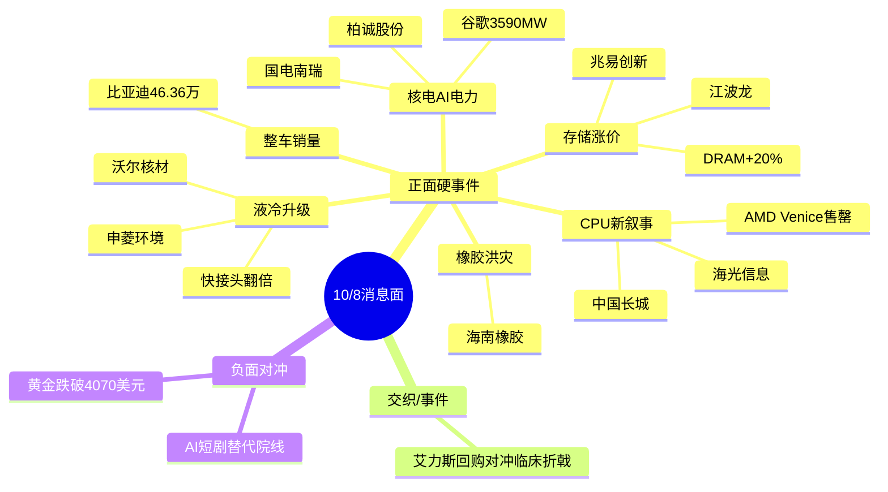

# 2026年10月8日 · 消息面事件驱动（节后首个交易日）

> 数据源新鲜度: partial · 降级状态: false · 置信度: 0.66
> 覆盖窗口: 10月5日-10月8日（国庆假期全程）· 主源: 财联社快讯1857条 + 5焦点群131条 + 东财三季报预告128条

## 一句话结论

假期外盘AI主线再加速：CPU接棒存储成为新叙事，液冷价值量翻倍，核电获史上最大订单；唯一负面对冲是贵金属回落与AI短剧对传统院线的替代。

## 🗺️ 消息面全景图

## 🎯 顶级事件详解

### E20261008_001 · CPU新叙事：AMD Venice 2027产能售罄 + Muse类Agent引爆CPU TAM · strength=high · polarity=正面

事件摘要: 假期国海/华福/开源密集推CPU：AMD六代EPYC "Venice" 2027产能配额售罄并承接2028订单；Muse类Agent产品使2030年CPU TAM从290亿升至3000亿美元（60% CAGR）；英特尔PC CPU再涨价10%。

推理深度三问:
- **大资金意图**: 存储炒完后市场需要AI硬件的"下一个涨价环节"，券商用Venice售罄+TAM十倍叙事给机构提供从存储切CPU的调仓理由，属于主线内部的板块轮动而非新故事
- **为什么走强**: CPU是此前AI行情中涨幅最小、逻辑最滞后的一环，"需求是产量30-40倍"提供了补涨的赔率
- **逻辑够不够硬**: 中硬。售罄来自X平台爆料Jukan而非AMD官方，TAM 3000亿为远期推演；国产映射（海光）业绩兑现度高，小票（长城/综艺）纯情绪

#### 海光信息 688041 · role=首推
- **买入理由**: 国产x86服务器CPU唯一规模化标的，CPU+DCU双线，机构CPU主线第一映射
- **风险点**: 9/30收226.8元，若假期情绪一次性兑现高开过多则追高风险大，等分歧回踩
- **止损条件**: 213.19元（-6%硬止损），跌破10日线确认
- **可验证假设**: 开盘30分钟国产CPU板块封板率<50%或海光主力净流出 → 降级watch

#### 中国长城 000066 · role=弹性
- **买入理由**: 飞腾CPU整机平台，CPU主题低位弹性票
- **风险点**: 无业绩验证、纯KOL点名，属杂毛边界票，只做计划内试错
- **止损条件**: 13.25元（-6%）
- **可验证假设**: 竞价不能高开2%以上或封板无力 → 不进

### E20261008_002 · 存储周期延续：DRAM最高涨价20% · strength=high · polarity=正面

事件摘要: 10/7快讯DRAM大厂计划涨价最高20%；苏姿丰10/7与三星半导体负责人会面应对内存短缺；美股存储板块盘后拉升。

推理深度三问:
- **大资金意图**: 存储是AI硬件中"涨价数据最密集"的方向，机构借假期海外存储股强势继续加仓确定性
- **为什么走强**: 涨价从NAND/HBM扩散到DRAM，周期宽度变宽
- **逻辑够不够硬**: 硬。涨价有厂商计划+AMD高管会面双验证；缺陷是A股存储股9月已有较大涨幅

#### 兆易创新 603986 · role=首推
- **买入理由**: NOR+利基DRAM龙头，存储涨价链机构首推
- **风险点**: 9/30收353.9元贴近5日线下方，短期均线压制
- **止损条件**: 332.67元（-6%）
- **可验证假设**: 竞价存储板块不能集体高开1%以上 → 买点后置

#### 江波龙 301308 · role=弹性
- **买入理由**: 模组厂价格弹性最大，直接吃DRAM涨价
- **风险点**: 301.93元已处高位，波动大
- **止损条件**: 283.81元
- **可验证假设**: 开盘30分钟不能站稳5日线 → 不追

### E20261008_003 · 液冷快接头价值翻倍 · strength=high · polarity=正面

事件摘要: 摩根大通测算Vera Rubin Ultra单NVL72机柜快接头价值从1.1万升至2.05万美元；OCP峰会聚焦AI互连与液冷；三星电机50亿美元扩产半导体基板。

推理深度三问:
- **大资金意图**: Rubin Ultra带来单机柜零部件价值量重估，机构从GPU向"卖水人"环节扩散
- **为什么走强**: 价值量翻倍是具体数字而非概念，且有明确产品代际锚点
- **逻辑够不够硬**: 硬。小摩成本拆解+OCP时间锚共振

#### 沃尔核材 002130 · role=首推
- **买入理由**: 高速通信线+液冷快接头供货头部算力客户，快接头翻倍主线A股首推
- **风险点**: 15.71元低价票，易被游资炒作后炸板
- **止损条件**: 14.77元
- **可验证假设**: 竞价封单不足或液冷板块无第二只助攻 → 降级

#### 申菱环境 301018 · role=弹性
- **买入理由**: 数据中心液冷温控核心供应商
- **风险点**: 88.31元高位，估值不便宜
- **止损条件**: 83.01元
- **可验证假设**: 开盘放量滞涨 → 不进

### E20261008_004 · 谷歌3590兆瓦核能协议 · strength=high · polarity=正面

事件摘要: 谷歌与Constellation Energy达成科技史上最大核能合作，锁定3590兆瓦20年，Gemini嵌入能源运营。10/6 Constellation美股盘前涨超5%。

推理深度三问:
- **大资金意图**: "AI缺电"叙事获史上最大订单背书，机构打通算力→电力→核电的配置链条
- **为什么走强**: 核电是AI电力中弹性最大、订单可验证的方向
- **逻辑够不够硬**: 中硬。A股核电与谷歌无直接供货关系，属主题映射，需防高开低走

#### 柏诚股份 601133 · role=首推
- **买入理由**: 核电洁净室工程龙头，核电扩产订单直接受益
- **风险点**: 22.41元小票容量有限，主题兑现快
- **止损条件**: 21.07元
- **可验证假设**: 核电板块无3只以上联动 → 仅观察

#### 国电南瑞 600406 · role=中军
- **买入理由**: 电网自动化龙头，AI用电增量的机构必配中军
- **风险点**: 弹性小，适合配置不适合进攻
- **止损条件**: 21.17元
- **可验证假设**: 作为中军只在核电主线确认后低吸

### E20261008_005 · 比亚迪9月销量46.36万辆 +17% · strength=high · polarity=正面

推理深度三问:
- **大资金意图**: 销量公告级硬数据，机构在"金九银十"窗口验证整车景气
- **为什么走强**: 46.36万辆超预期，出口与高端双驱动
- **逻辑够不够硬**: 硬。公司公告数据；但A股整车T+1接力情绪历来弱于科技

#### 比亚迪 002594 · role=首推
- **买入理由**: 销量+17%公告硬催化，全球新能源乘用车份额62%
- **风险点**: 83.31元大盘股，短线爆发力有限
- **止损条件**: 78.31元
- **可验证假设**: 整车板块竞价无跟风 → 降为中线持有逻辑不加仓

### E20261008_006 · AI短剧热搜第二（正反两面）· polarity=正面/bearish_scope=板块级

正面: AI短剧破圈，掌阅科技/芒果超媒受益。反面（必须并列）: 传统院线、真人长剧遭替代，中国电影/光线传媒承压。

#### 掌阅科技 603533 · role=首推
- **买入理由**: 阅读版权+AI漫剧落地，AI短剧辨识度最高
- **风险点**: 23.88元，题材轮动快
- **止损条件**: 22.45元
- **可验证假设**: 传媒板块无助攻或短剧热搜降温 → 隔日走

### E20261008_007 · 艾力斯：1-2亿回购 vs 伏美替尼海外3期折戟 · polarity=正面/bearish_scope=个股级

多空同体：回购托底与出海逻辑证伪同日出现。仅作事件性小仓试错，不进核心。
- 艾力斯 688578: 止损104.89元，若低开跌破前低不接回购叙事。

### E20261008_008 · 泰国洪灾橡胶减产 胶价历史新高 · strength=high

#### 海南橡胶 601118 · role=首推
- **买入理由**: 国内天然橡胶龙头，泰南占泰国57%种植面积受灾，供给缺口+涨价双驱动
- **风险点**: 洪灾影响可能被高估，涨价兑现节奏取决于旺季复产
- **止损条件**: 5.99元
- **可验证假设**: 商品端胶价开盘不能维持升势 → 不追

## 📊 板块 × 事件热力矩阵

| 板块 | 事件锚 | 首推龙头 | 独立源数 | 加权分 | 净置信 |
|------|--------|----------|:--:|:--:|:--:|
| 国产CPU | E001 | 海光信息 | 4+ | 0.82 | 🟢🟢🟢 |
| 存储 | E002 | 兆易创新 | 3+ | 0.666 | 🟢🟢🟢 |
| 液冷 | E003 | 沃尔核材 | 3+ | 0.76 | 🟢🟢🟢 |
| 核电/AI电力 | E004 | 柏诚股份 | 2 | 0.72 | 🟢🟢 |
| 整车 | E005 | 比亚迪 | 2 | 0.68 | 🟢🟢 |
| AI应用/短剧 | E006 | 掌阅科技 | 2 | 0.60 | 🟢🟢 |
| 橡胶 | E008 | 海南橡胶 | 2 | 0.70 | 🟢🟢 |
| 传统院线 | E006反面 | （承压） | — | -0.30 | 🔴 |

## 🔥 三季报业绩预告命中（硬alpha交叉验证）

| 代码 | 名称 | 预告指标 | 增速区间 | 事件命中 | 强度 |
|------|------|----------|----------|----------|:--:|
| 300497 | 富祥股份 | 归母净利 | +658%~785% | 无直接事件锚（独立硬alpha） | 🟢🟢🟢 |
| 688801 | 燧原科技 | 营收 | +326%~455% | E001算力链（国产AI芯片） | 🟢🟢🟢 |
| 688469 | 芯联集成 | 归母净利 | +247% | E002半导体链 | 🟢🟢 |
| 600521 | 华海药业 | 归母净利 | +170%~190% | 医药（独立） | 🟢🟢 |
| 301660 | 粤芯半导体 | 营收 | +61%~67% | E002半导体（次新上市中） | 🟢🟢 |

注: 本文8大事件首推票（海光/兆易/沃尔等）多数尚未发布三季报预告，买入逻辑以产业催化为主，业绩验证待10月中下旬。

## 关键证据

- 证据1: "DRAM大厂计划涨价 涨幅最高达20%" · 财联社 2026-10-07
- 证据2: "AMD Venice EPYC 2027产能配额售罄 承接2028订单" · 国海/开源研报+X平台 2026-10-07
- 证据3: "Rubin Ultra单柜快接头价值1.1万→2.05万美元" · 摩根大通 2026-10-07
- 证据4: "谷歌与Constellation锁定3590兆瓦20年" · 群聊+海外媒体 2026-10-07
- 证据5: "比亚迪9月新能源销量463561辆" · 公司公告 2026-10-07

## 数据源审计

| 源 | 日期 | 状态 | 备注 |
|---|---|:--:|---|
| news_cls | 2026-10-05~08 | 🟢 | 1857条 假期全量快讯 |
| news_major | 2026-10-07 | 🟢 | 800条 |
| eastmoney_earnings_predict | 2026-10-08 | 🟢 | 128条 三季报预告 |
| wechat_cli_5groups | 2026-10-07 | 🟢 | 131条 5焦点群（匿名） |
| overseas_snapshot | 2026-10-08 | 🟡 | 商品类skipped 贵金属以快讯补 |
| wechat_official_pool | 2026-10-08 | 🔴 | 用户2026-08-20主动停用 |

## 不确定性 / 反证

1. CPU"售罄"消息源为X平台爆料人，未经AMD官方确认，若开盘被辟谣则E001强度下调
2. R7资金面假期无个股级净流入数据，全部首推票缺主力资金验证，首仓必须低于常规（建议≤10%）
3. 假期美股呈缩圈状态（一半以上个股跌入熊市），指数新高由少数巨头贡献，若英伟达/博通开盘走弱将压制全部AI映射
4. 贵金属假期大跌（黄金失守4070、白银破60），对有色/黄金持仓为明确负反馈，本文未列入硬事件但D1需处理
5. 核电/橡胶均为海外主题映射，A股无直接订单，防高开低走

## 与其他 R/D/E 的关系

- 依赖: emotion_cycle（主升 0.49）、R7资金面（假期降级）
- 被消费: R2主线板块 / R5个股画像 / R6反证 / D1预案
- 特别提示D1: CPU/存储/液冷同属AI算力一条主线内部轮动，不应拆成三条独立主线重复给仓位

## Sub-Agent 元数据

- skill: analyze_news_impact_v1@1.3
- artifact: data/research/20261008/R4_news.json
- method: llm_v1（五源聚合 + 时间衰减λ=0.15 + 跨源取max）
- 生成时刻: 2026-10-08T07:45+08:00
