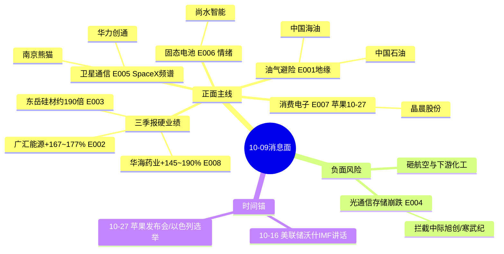

# 2026年10月9日（周五）· **消息面事件驱动**

> **数据源新鲜度**: partial · **降级状态**: true · **置信度**: 0.66
> **覆盖窗口**: 前 72h（重点 10-08 盘后至 10-09 盘前）· **主源**: 财联社/新浪快讯 + 东财三季报预告 + 5 焦点群（匿名）

## 一句话结论

中东骤然升级（霍尔木兹爆炸+三航母部署）撑起**油气/避险**主线，三季报硬业绩多点开花；唯一负面对冲是**海外光通信存储崩跌+光芯片限制令**，高位算力买点后置。

## 🗺️ 消息面全景图

## 🎯 顶级事件详解（推理深度三问 + 首推票思维链）

### E20261009_001 · 霍尔木兹海峡爆炸+伊朗停装卸+三航母部署 中东骤然升级

**时间**: 2026-10-09 04:51 · **strength**: high · **polarity**: 负面 · raw 0.82 → weighted 0.801（days_since 0.15，新鲜）

**板块映射**: 油气开采(正面)，油服(正面)，航运油运(正面)

**⚠️ 反着看 · bearish_scope=行业级**：会砸 航空机场、下游化工、高估值成长(风险偏好压制)

**推理深度三问**:
- **大资金意图**: 机构在节后风险偏好未稳、成长股高位时需要一条顺周期+避险双属性的旗帜，资金借地缘把仓位从科技切向能源。
- **为什么走强**: 油价站上 91 美元、布油破 104，霍尔木兹是全球 20% 原油咽喉，供给溢价一旦定价短期不可逆。
- **逻辑够不够硬**: **硬**。爆炸+停装卸+三航母+雷神 SM-3 63 亿美元合同四源共振（财联社/新浪/央视）；但属事件驱动，停火即回吐，须严守止损。

**首推票思维链**:

#### 中国石油 601857 · role=首推
- **买入理由**: 油价站上91美元直接抬升上游盈利弹性 一体化央企避险+顺周期双重属性
- **风险点**: 事件驱动 停火/退潮即回吐
- **止损条件**: 10-08收盘11.59 止损11.00 = -5.1% 跌破5日及跳空缺口下沿（止损价 11.0）
- **可验证假设**: 开盘 30 分钟板块无资金净流入或跌破 11.0 → 假设证伪 当日不进；目标区间 12.6~13.4 建议仓位 12%

#### 中国海油 600938 · role=跟推
- **买入理由**: 纯上游弹性最大 布油破104美元 桶油毛利扩张
- **风险点**: 事件驱动 停火/退潮即回吐
- **止损条件**: 收盘34.17 止损32.50 = -4.9% 回补缺口即走（止损价 32.5）
- **可验证假设**: 开盘 30 分钟板块无资金净流入或跌破 32.5 → 假设证伪 当日不进；目标区间 37.5~40.0 建议仓位 10%

**有效期**: 油价见顶/停火前 · **备注**: 地缘是今日最强β 同时砸航空与成长 属双刃剑不可只看利好(错题本004)

### E20261009_002 · 广汇能源三季报预增167%-177% 净利27-28亿

**时间**: 2026-10-09 06:04 · **strength**: high · **polarity**: 正面 · raw 0.7 → weighted 0.693（days_since 0.07，新鲜）

**板块映射**: 油气开采(正面)，煤炭(正面)

**推理深度三问**:
- **大资金意图**: 资金在财报季优先给'低估值+高增速+顺价'品种确定性溢价，广汇低价高弹性正好承接能源轮动。
- **为什么走强**: 煤/气/油三品类价格三季度同步走强，扣非 +192%~203% 真实反映主业景气而非一次性。
- **逻辑够不够硬**: **硬**。官方业绩预告为独立硬 alpha，且与 E001 地缘催化同向叠加；风险是低价股波动大、需量能持续。

**首推票思维链**:

#### 广汇能源 600256 · role=首推
- **买入理由**: 煤+气+油三轮驱动 扣非+192%-203%硬业绩 低价高弹性 与地缘催化共振
- **风险点**: 高位震荡市情绪反复 若大盘走弱跟随回调
- **止损条件**: 收盘6.80 止损6.40 = -5.9% 跌破20日线及平台（止损价 6.4）
- **可验证假设**: 开盘 30 分钟板块无资金净流入或跌破 6.4 → 假设证伪 当日不进；目标区间 7.6~8.2 建议仓位 12%

**有效期**: 1-2周 · **备注**: 官方公告源 独立硬alpha 不依赖KOL

### E20261009_003 · 东岳硅材三季报预增约190倍 净利5.47-5.67亿

**时间**: 2026-10-08 16:41 · **strength**: high · **polarity**: 正面 · raw 0.66 → weighted 0.598（days_since 0.65，新鲜）

**板块映射**: 有机硅(正面)，工业硅(正面)

**推理深度三问**:
- **大资金意图**: 机构博弈有机硅价格反转的困境反转行情，从底部拐点切入选弹性最大的硅材龙头。
- **为什么走强**: 去年同期净利仅 285 万元超低基数，叠加工业硅/有机硅涨价，业绩弹性被放大近 190 倍。
- **逻辑够不够硬**: **中硬**。公告源可靠但低基数放大效应需辨别价格持续性，扣非 5.89 亿略高于归母说明主业实。

**首推票思维链**:

#### 东岳硅材 300821 · role=首推
- **买入理由**: 有机硅价格底部反转 去年同期仅285万低基数 业绩拐点+涨价链
- **风险点**: 高位震荡市情绪反复 若大盘走弱跟随回调
- **止损条件**: 收盘14.29 止损13.30 = -6.9% 跌破前低平台（止损价 13.3）
- **可验证假设**: 开盘 30 分钟板块无资金净流入或跌破 13.3 → 假设证伪 当日不进；目标区间 16.0~17.5 建议仓位 10%

**有效期**: 1个涨价季 · **备注**: 公告源 低基数放大需辨持续性

### E20261009_004 · 美股光通信存储崩跌 费半-3.4% 海外光芯片限制令发酵

**时间**: 2026-10-09 04:01 · **strength**: high · **polarity**: 负面 · raw -0.78 → weighted -0.762（days_since 0.15，新鲜）

**板块映射**: 光模块(负面)，光芯片(负面)，存储芯片(负面)，AI算力(负面)

**⚠️ 反着看 · bearish_scope=行业级**：会砸 光模块、CPO、光芯片、存储、AI算力全链

**推理深度三问**:
- **大资金意图**: 海外资金在高估值算力链借限制令+估值高位兑现，北向/机构 T+1 大概率跟随减仓 A 股光模块。
- **为什么走强**: Coherent -9.6%、费半 -3.4%、存储指数创 9-17 新低，外需物料来源限制直接冲击订单预期。
- **逻辑够不够硬**: **硬利空**。美股收盘+限制令+10-08 长光华芯/源杰 20cm 跌停三重确认；行业级，买点后置不接飞刀。

**拦截/降级票**: 中际旭创(拦截)，兆易创新(降级观察)，寒武纪(拦截)

**有效期**: 限制令落地/美股企稳前 · **备注**: 行业级利空强制入榜 高位算力买点后置(错题本004) 长光华芯10-08已20cm跌停为预警

### E20261009_005 · SpaceX收购800MHz频谱 FCC批1.5万颗手机直连卫星

**时间**: 2026-10-09 04:44 · **strength**: high · **polarity**: 正面 · raw 0.64 → weighted 0.625（days_since 0.15，新鲜）

**板块映射**: 卫星通信(正面)，手机直连(正面)

**⚠️ 反着看 · bearish_scope=板块级**：会砸 传统电信运营商

**推理深度三问**:
- **大资金意图**: 资金在 AI 应用之外寻找'硬科技+新基建'叙事，手机直连卫星是马斯克亲自背书的新方向。
- **为什么走强**: FCC 批准 1.5 万颗 DTC 星座 + 收购 800MHz 频谱，产业从概念进入组网阶段。
- **逻辑够不够硬**: **中硬**。官方(FCC)+马斯克多源；反面是 AT&T/Verizon 暴跌 5-8%，A 股映射运营商承压，属双刃剑。

**首推票思维链**:

#### 华力创通 300045 · role=首推
- **买入理由**: 卫星通信+手机直连核心标的 10-08已放量试盘 DTC星座催化
- **风险点**: 高位震荡市情绪反复 若大盘走弱跟随回调
- **止损条件**: 收盘11.83 止损11.00 = -7.0% 跌破5日线（止损价 11.0）
- **可验证假设**: 开盘 30 分钟板块无资金净流入或跌破 11.0 → 假设证伪 当日不进；目标区间 13.5~14.8 建议仓位 10%

#### 南京熊猫 600775 · role=跟推
- **买入理由**: 群点手机直连标的 低价 10-08冲板回落有资金记忆
- **风险点**: 高位震荡市情绪反复 若大盘走弱跟随回调
- **止损条件**: 收盘9.44 止损8.90 = -5.7%（止损价 8.9）
- **可验证假设**: 开盘 30 分钟板块无资金净流入或跌破 8.9 → 假设证伪 当日不进；目标区间 10.6~11.5 建议仓位 8%

**有效期**: 1-2周 · **备注**: 反面:美股AT&T/Verizon暴跌5-8% 映射国内运营商承压

### E20261009_006 · 固态电池情绪发酵 尚水智能涨停 设备小票流通盘买断

**时间**: 2026-10-08 14:57 · **strength**: medium · **polarity**: 正面 · raw 0.42 → weighted 0.376（days_since 0.74，新鲜）

**板块映射**: 固态电池(正面)，锂电设备(正面)

**推理深度三问**:
- **大资金意图**: 纯游资情绪博弈，借固态电池题材做小流通盘次新的连板弹性，非机构配置。
- **为什么走强**: 干法/固态电极设备+次新流通盘极小+10-08 涨停资金买断，筹码结构利于连板。
- **逻辑够不够硬**: **偏软**。无官方催化、仅群聊+涨停单源，strength 封顶 medium，只能小仓试错。

**首推票思维链**:

#### 尚水智能 301513 · role=首推
- **买入理由**: 固态/干法电极设备 次新流通盘极小 10-08涨停资金买断 情绪标
- **风险点**: 高位震荡市情绪反复 若大盘走弱跟随回调
- **止损条件**: 收盘67.81 止损61.00 = -10.0% 高波动情绪票 仅小仓（止损价 61.0）
- **可验证假设**: 开盘 30 分钟板块无资金净流入或跌破 61.0 → 假设证伪 当日不进；目标区间 78~85 建议仓位 6%

**有效期**: 题材发酵期 · **备注**: 单源(KOL群聊+涨停验证)无官方催化 strength顶格medium single_source=true

### E20261009_007 · 苹果10月27日发布会 触屏Mac+iPad Mini 联手LG智能家居7款

**时间**: 2026-10-09 04:00 · **strength**: medium · **polarity**: 正面 · raw 0.46 → weighted 0.449（days_since 0.15，新鲜）

**板块映射**: 消费电子(正面)，AIoT芯片(正面)，智能家居(正面)

**推理深度三问**:
- **大资金意图**: 消费电子资金提前布局 10-27 苹果发布会，叠加 AI PC/AIoT 换机周期做 SoC 平台。
- **为什么走强**: 晶晨三季报预增 81-99% 提供硬底，苹果联手 LG 扩 7 款智能家居打开 AIoT 空间。
- **逻辑够不够硬**: **中硬**。业绩+产业时间锚双源；缺点是消费电子整体弹性受大盘情绪拖累。

**首推票思维链**:

#### 晶晨股份 688099 · role=首推
- **买入理由**: AIoT SoC龙头 三季报预增81-99%硬业绩 苹果家庭AI+AI PC换机双催化
- **风险点**: 高位震荡市情绪反复 若大盘走弱跟随回调
- **止损条件**: 收盘94.57 止损88.00 = -7.0% 跌破10日线（止损价 88.0）
- **可验证假设**: 开盘 30 分钟板块无资金净流入或跌破 88.0 → 假设证伪 当日不进；目标区间 104~112 建议仓位 10%

**有效期**: 10-27发布会前 · **备注**: 公告+产业双源 时间锚明确

### E20261009_008 · 华海药业三季报预增145%-190% 原料药+创新药放量

**时间**: 2026-10-08 16:11 · **strength**: medium · **polarity**: 正面 · raw 0.52 → weighted 0.471（days_since 0.65，新鲜）

**板块映射**: 化学制药(正面)，原料药(正面)

**推理深度三问**:
- **大资金意图**: 高位震荡市避险资金偏好'有成长的医药'，华海制剂出口+原料药涨价兼具防御与弹性。
- **为什么走强**: 三季报预增 145-190%，且独立于拥挤的科技主线，提供组合分散价值。
- **逻辑够不够硬**: **中硬**。官方公告源；风险是医药板块情绪持续性弱于能源。

**首推票思维链**:

#### 华海药业 600521 · role=首推
- **买入理由**: 制剂出口+原料药涨价 业绩高增 防御与成长兼备 高位震荡市避险资金偏好
- **风险点**: 高位震荡市情绪反复 若大盘走弱跟随回调
- **止损条件**: 收盘16.65 止损15.60 = -6.3% 跌破平台（止损价 15.6）
- **可验证假设**: 开盘 30 分钟板块无资金净流入或跌破 15.6 → 假设证伪 当日不进；目标区间 18.5~20.0 建议仓位 10%

**有效期**: 1个财报季 · **备注**: 公告源 独立于科技主线 提供仓位分散

## 📊 板块 × 事件极性热力矩阵

| 板块 | 事件锚 | 净加权极性 | 正/负计数 | 信号 |
|------|--------|-----------|:--:|:--:|
| 油气开采 | E20261009_001，E20261009_002 | 1.494 | 2/0 | 🟢🟢🟢 |
| 油服 | E20261009_001 | 0.801 | 1/0 | 🟢🟢🟢 |
| 航运油运 | E20261009_001 | 0.801 | 1/0 | 🟢🟢🟢 |
| 煤炭 | E20261009_002 | 0.693 | 1/0 | 🟢🟢🟢 |
| 有机硅 | E20261009_003 | 0.598 | 1/0 | 🟢🟢 |
| 工业硅 | E20261009_003 | 0.598 | 1/0 | 🟢🟢 |
| 光模块 | E20261009_004 | -0.762 | 0/1 | 🔴 |
| 光芯片 | E20261009_004 | -0.762 | 0/1 | 🔴 |
| 存储芯片 | E20261009_004 | -0.762 | 0/1 | 🔴 |
| AI算力 | E20261009_004 | -0.762 | 0/1 | 🔴 |
| 卫星通信 | E20261009_005 | 0.625 | 1/0 | 🟢🟢🟢 |
| 手机直连 | E20261009_005 | 0.625 | 1/0 | 🟢🟢🟢 |
| 固态电池 | E20261009_006 | 0.376 | 1/0 | 🟢 |
| 锂电设备 | E20261009_006 | 0.376 | 1/0 | 🟢 |
| 消费电子 | E20261009_007 | 0.449 | 1/0 | 🟢🟢 |
| AIoT芯片 | E20261009_007 | 0.449 | 1/0 | 🟢🟢 |
| 智能家居 | E20261009_007 | 0.449 | 1/0 | 🟢🟢 |
| 化学制药 | E20261009_008 | 0.471 | 1/0 | 🟢🟢 |
| 原料药 | E20261009_008 | 0.471 | 1/0 | 🟢🟢 |
| 航空机场 | E20261009_001 | -0.481 | 0/1 | 🔴 |
| 下游化工 | E20261009_001 | -0.481 | 0/1 | 🔴 |
| 高估值成长(风险偏好压制) | E20261009_001 | -0.481 | 0/1 | 🔴 |
| CPO | E20261009_004 | -0.457 | 0/1 | 🔴 |
| 存储 | E20261009_004 | -0.457 | 0/1 | 🔴 |
| AI算力全链 | E20261009_004 | -0.457 | 0/1 | 🔴 |
| 传统电信运营商 | E20261009_005 | -0.375 | 0/1 | 🔴 |

## 🔥 三季报业绩预告命中（硬 alpha 交叉验证）

| 代码 | 名称 | 预告类型 | 增速区间 | 事件命中 | 逻辑强度 |
|------|------|----------|----------|----------|:--:|
| 600256.SH | 广汇能源 | 预增 | 167%~177% | E002 | 🟢🟢🟢 |
| 300821.SZ | 东岳硅材 | 预增 | 约190倍(低基数) | E003 | 🟢🟢 |
| 600521.SH | 华海药业 | 预增 | 145%~190% | E008 | 🟢🟢 |
| 688099.SH | 晶晨股份 | 预增 | 81%~99% | E007 | 🟢🟢 |
| 688801.SH | 燧原科技 | 预增 | 326%~455% | 算力(受E004压制) | 🟡 |
| 300964.SZ | 本川智能 | 预增 | 190%~368% | PCB(受E004压制) | 🟡 |

> 注：燧原/本川虽业绩高增，但属 E004 海外算力/PCB 杀跌的负反馈板块，业绩难抵β，降级观察。

## 关键证据

- 证据1：霍尔木兹海峡南部航线数起猛烈爆炸 违规油轮触雷 · 财联社/新浪 2026-10-09 04:51
- 证据2：WTI +3.64% 报 91.49 美元 布油 104.28 美元；美财政部称伊朗已停止原油装卸 · 2026-10-09
- 证据3：广汇能源前三季预增 166.83%~176.71% 扣非 +192%~203% · 公告 2026-10-09
- 证据4：美股存储芯片指数 -3.78% 创 9-17 新低 Coherent -9.63% 费半 -3.4% · 2026-10-09
- 证据5：SpaceX 收购全国 800MHz 频谱 FCC 批准 1.5 万颗星链二代卫星 · 2026-10-09
- 证据6：长光华芯/源杰科技 10-08 20cm 跌停 光芯片限制令预警 · 2026-10-08

## 数据源审计

| 源 | 日期 | 状态 | 备注 |
|---|---|:--:|---|
| news_cls（财联社+新浪 72h） | 2026-10-09 | 🟢 | 2321 条 |
| news_major（长篇要闻） | 2026-10-09 | 🟢 | 800 条 |
| eastmoney_earnings_predict | 2026-10-09 | 🟢 | 151 条 三季报 |
| wechat_cli_5groups | 2026-10-09 | 🟢 | 396 条 5 群匿名 |
| wechat_official_sanji | 2026-10-09 | 🔴 | 已禁用（用户 08-20 取消） |
| xtick_hot_news | 2026-10-09 | 🔴 | MCP 域名解析失败 |
| weflow / QMT | 2026-10-09 | 🔴 | ngrok 离线 / 主机离线 |

## 不确定性 / 反证

1. 地缘是事件驱动型β，若周末停火谈判取得进展，周一油气直接低开，E001/E002 追高风险大，须等分歧不追一字。
2. 个股资金面尚未交叉：xtick/R7 不可用，本文 stop_loss 基于 10-08 真实收盘价（tencent 源）而非实时主力净流入，需 R7 确认后再定进/不进。
3. E006 尚水智能为单源情绪票、10-08 已涨停，次日接力赔率不确定，仅小仓，炸板即走。
4. 光芯片限制令目前公司方（长光华芯）称是大摩'情景推演一家之言'，若被证伪，E004 利空可能快速修复，不宜在低位恐慌割肉龙头。
5. 美联储穆萨莱姆称未来 6-9 个月或需再加息，全球流动性预期偏鹰，对高估值成长持续压制。

## 与其他 R/D/E 的关系

- 依赖：data/raw/20261009（三硬快讯+业绩+群聊）；价格锚来自 tencent 实时行情
- 被消费：R2 主线（油气/业绩）、R5 个股画像、R6 反证、D1 预案（execution_pool 取 llm 验证票，E004 拦截票不进池）

## Sub-Agent 元数据

- skill: analyze_news_impact_v1@1.3
- artifact: data/research/20261009/R4_news.json
- method: llm_v1（三硬源 + 时间衰减 λ=0.15 + 板块极性叉乘）
- 生成时刻: 2026-10-09T07:46:00+08:00
