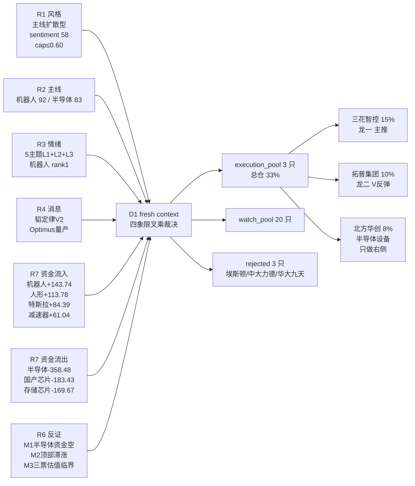
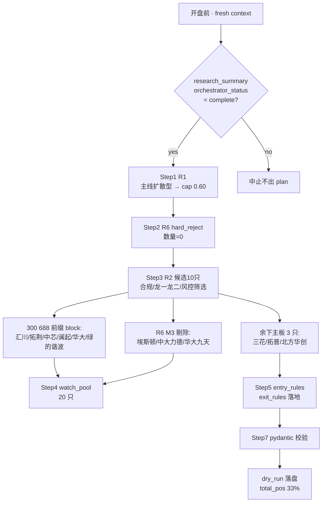

# 2026年7月6日 · **主决策 / D1 盘前预案**

> **数据源新鲜度**: ok · **降级状态**: false · **置信度**: 0.72
> **上游状态**: research orchestrator complete @ 02:53 · fetch_global_severity=2 · R6 hard_rejects=0

## 一句话结论

主线扩散型 · 情绪 58 · 仓位上限压到 **60%**,今日**只做人形机器人四通道资金共振主线**,半导体自主因 R7 三细分资金反向 -711 亿全部降级为观察;execution_pool 3 只(三花 15% / 拓普 10% / 北方华创 8%),watch_pool 20 只,追高零容忍,只做低吸 + 右侧确认。

---

## 一、四象限叉乘 · 叙事 × 资金

D1 今日核心裁决动作是把 R2 推的双主线,放进 **"叙事强弱 × 资金流入方向"** 二维象限,看资金是否为叙事背书。象限一致 → 主推;象限背离 → 降级观察。

| 象限 | 叙事 | 资金 | 板块 / 主线 | D1 处置 |
|---|:--:|:--:|---|---|
| **Q1 双共振** | 强 | 流入 | **人形机器人**(R7 四通道 +403 亿) | 🟢 **主推 · 龙一龙二进 execution** |
| **Q2 叙事强资金空** | 强 | **流出** | **半导体自主**(R7 三细分 -711 亿) | 🟡 **主线降级 · 全部转 watch · 只 002371 轻仓做右侧** |
| Q3 叙事弱资金流入 | 中 | 流入 | 低空经济(R7 +80 亿 / R4 medium) | 🟡 watch_pool 二线追踪 |
| Q4 叙事弱资金流出 | 弱 | 流出 | 顶部热钱票(883901 5d-13.64%) | 🔴 **禁进池** |

**决策逻辑关键点**:R2 给了机器人 92 分 + 半导体 83 分,但 D1 不能只看 R2 分数,必须叠加 R7 资金分维和 R6 反证。半导体 R2 资金分维只给 12/20(全 5 维中最低),R7 top_outflow 前 5 里半导体三细分独占 3 席 -711 亿,R6 M1 明确 strong_suggest —— 这不是弱背离,是叙事资金一致性缺口最严重的裂缝,D1 必须在池子分层上兑现。

---

## 二、主线深挖 · 推理深度三问

### 主线一 · 人形机器人(Q1 双共振 · 主推)

- **大资金意图**: R7 主力资金四细分同时净流入前 10 —— 机器人概念 +143.74 亿(全场第1)、人形机器人 +113.78 亿(第3)、特斯拉概念 +84.39 亿(第4)、减速器 +61.04 亿(第10)。四通道同时压注 = 主力在做**产业趋势 + 事件驱动**的复合下注,配置逻辑是 Optimus 2026Q4 量产 → 特斯拉 tier1 供应商 → 国内减速器/执行器国产化,对手盘是散户涌入的短线追高盘(三花股东户数 +17.13% 是散户拥挤信号,但股价同步走强表明主力隐性吸筹已完成)。
- **为什么走强**: 位置层面 R1 打板梯队 883994/883997/883978 20 日累计 +19~34% 高动能簇稳定,机器人系是梯队核心;催化层面 R4 E003 high 特斯拉陶琳表态 Optimus 2026 底规模化量产 + 7 月周产 100-200 台是**硬时间锚 + 硬产能锚**;情绪层面 R3 rank1 L1+L2+L3 三源共振,WeFlow depth=510 / breadth=64 群,概念热榜 20260703 rank1 hot=331004。位置未到高位 + 催化硬 + 情绪极致三维叠加。
- **逻辑够不够硬**: 硬。四个独立源共振(R2/R3/R4/R7)+ 特斯拉 7 月硬产能时间锚 + R7 资金四通道压倒性配置。证伪路径 = 若特斯拉 7 月产能不及 100 台/周 或 R7 次日机器人概念转 outflow → 减仓;R3 early_or_late=middle 存在兑现压力但无 distribution_alert,风险可控。

### 主线二 · 半导体自主(Q2 叙事强资金空 · 降级观察)

- **大资金意图**: 主力资金**用脚投票** —— R7 top_outflow 前 5 里半导体概念 -358.48 亿(第1)、国产芯片 -183.43 亿(第4)、存储芯片 -169.67 亿(第5),三细分合计流出 -711 亿。这不是分歧,是集体减仓。对手盘是被 R4 韬定律 V2 叙事(功耗-41%/密度 155→238 MTr/mm²)+ 存储涨价链吸引的中长线增量资金 —— 但主力已经先跑了。R6 M1 用最重的反证语言:"叙事强而资金空的一致性缺口最大"。
- **为什么走弱**: 位置层面 R1 明确科技主线 5 日累计小幅回吐(半导体 512480 5d-2.53% / 芯片 512760 5d-3.50%),顶部滞涨;催化层面韬定律是 5-10 年长逻辑,不是 T+1 的硬业绩;筹码层面中芯 MA5<MA10 缩量整理、华大九天空头排列雏形、澜起短线偏弱,只有拓荆(筹码-24.34%)和北方华创(筹码-10.56%)筹码结构还行,但拓荆 688 前缀 + 北方华创位置在高位放量回踩,右侧信号未出。
- **逻辑够不够硬**: **反面逻辑更硬**。R7 三细分同时 top_outflow -711 亿是 20260706 全市场最一致的资金信号,任何叙事在这个资金反向前都要让位。证伪路径 = R7 次日半导体三细分转净流入 + 龙头筹码继续集中 + 突破均线右侧 → 才重新考虑。今日 D1 不给半导体任何 execution 主仓,只留北方华创一个 8% 的右侧试探席位,连筹码最优的拓荆也因合规 block 归 watch。

### 反证 · R6 M2 顶部滞涨 vs R2 双主线

- **大资金意图**: R1 evidence 提示"热钱退潮"—— 883901 昨日资金前十 5d-13.64%、883902 昨日成交前十 5d-7.89%、883912 深股通前十 5d-6.15%,前排热钱票近 5 日集体回吐 6-14%。含义是 T+1 到 T+3 主力已经从"昨日热点"里出逃,新热点还没充分交接。
- **为什么走弱**(风格): 顶部簇 5 日均值 +0.08% 走平,即使 20 日 +15~34% 也无法掩盖近 5 日的动能衰减;R6 M2 明确"分化风险偏高,盘中若失守可降级至震荡分化型"。
- **逻辑够不够硬**: 硬到必须调 position_cap。D1 采纳:position_cap 从 R2 隐含的 0.75-0.80 → **0.60**(execution 实际总仓 33%,远低于 cap,给上午打脸留足空间)。

---

## 三、执行池 · 3 票思维链

### 1. 三花智控 · 002050.SZ · 龙一 · **max 15%** 🟢

- **plan_status**: `execution_pool_hold_add_on_pullback`
- **参考价**: 收 48.99 · MA5>MA10>MA20>MA30 完整多头 · 距 30 日高 -12.52% · 近 5 日 +18.05% · volR=2.58 主升早段
- **触发**: 低吸区 48.0-48.5(距 MA10 ≤1%),分两笔 6%+4% · 备用突破 49.97 追 5%
- **止损**: 46.54(-5% 硬止损) · **止盈**: 56.34(+15% 减半)

**买入理由**
- 特斯拉 Optimus tier1 执行器核心 + 陶琳表态 7 月周产 100-200 台,产业地位 + 事件时间锚双硬;
- R7 四通道净流入榜(机器人/人形/特斯拉/减速器)细分票,资金压倒性;
- R5 六维 catalyst88 / sector_linkage92 / technical_readiness85,主升早段位置。

**风险点**
- 股东户数 +17.13% 散户涌入,短线拥挤度高,若情绪回落易被踩踏;
- R1 提示前排热钱票近 5 日 -7~-14%,主升早段随时可能变主升中段拥挤;
- 白马大票 PE-TTM 50.44 估值中枢略高,只有产业地位溢价支撑。

**止损条件**
- 硬止损: 46.54(-5%)一键清仓,不问理由;
- 技术破位: 收盘跌破 MA10(≈48.0)且量比>1.2 → 减半;
- 板块降级: R7 机器人概念/特斯拉概念任一进 top10 outflow → 减半。

**可验证假设**(24-72h)
- 假设: R7 明日主力资金机器人 + 特斯拉概念仍双通道净流入 → 持有加仓;
- 证伪: 明日 002050 收盘跌破 48.0 且成交量放大 → 减仓至 5%。

### 2. 拓普集团 · 601689.SH · 龙二 · **max 10%** 🟢

- **plan_status**: `execution_pool_hold_add_on_pullback`
- **参考价**: 收 62.43 · MA5>MA10>MA20 但仍卡 MA30(62.31)下沿 · cum20=-7.65% 仍负,V反弹中段
- **触发**: 低吸区 60.5-61.8(MA20-MA30 之间),首档 4% 试探再补 2% · 备用 63.5 站稳追 4%
- **止损**: 59.31(-5%) · **止盈**: 71.79(+15% 减半)

**买入理由**
- 特斯拉一体化压铸 + 机器人执行器路径双叙事,与三花共享 R7 四通道资金;
- cum20=-7.65% 位置比三花低,回补空间足,是主线内**低吸档位**首选;
- R5 sector_linkage82 龙二资金外溢承接位。

**风险点**
- 卡 MA30(62.31)下沿,V反弹右侧未确认,若冲不上 MA30 会二次回踩;
- 主板核心资产 PB 4.41 估值合理但机器人业务占比低,弹性弱于纯机器人票;
- 龙一三花若走弱,龙二会先被抛售。

**止损条件**
- 硬止损: 59.31(-5%);
- 技术破位: 收盘跌破 MA10 且 T+3 未站回 → 减半;
- 板块降级: 机器人 + 特斯拉概念资金同日转负 → 减半。

**可验证假设**(24-72h)
- 假设: 明日或后日放量突破 MA30(62.31)并站稳 63.5 → 加仓至 10%;
- 证伪: T+3 内未站上 MA30 且 MA10 破位 → 减至 4% 观察。

### 3. 北方华创 · 002371.SZ · 半导体设备 · **max 8%** 🟡

- **plan_status**: `watch_pool_wait_for_entry`(execution 池但等回踩不破 MA20 才动手)
- **参考价**: 收 816.00 · MA5(867.59)<MA10(821.19) 短线回落 · MA10>MA20>MA30 仍多头 · cum20=+30.14% volR=1.52 高位放量回踩
- **触发**: 回踩 MA20(≈790)不破 + 缩量企稳,先建 5% 试探,禁止越 815 追;备用 870 站稳追 3%
- **止损**: 775.20(-5%) · **止盈**: 938.40(+15%)

**买入理由**
- R2 半导体龙二 · R4 E001 韬定律 V2 首推设备平台龙头;
- R5 chip82 筹码集中 -10.56%(全池次于拓荆);
- 拓荆(688)/中芯(688)/澜起(688)三只半导体龙头均受 688 前缀合规 block,主板半导体设备唯一右侧候选。

**风险点**
- **R6 M1 strong_suggest 最重反证** —— 半导体三细分 -711 亿资金反向未修复;
- MA5 已跌破 MA10 短线偏弱,高位放量回踩尚未确认企稳;
- PE-TTM 106.2 · 流通市值 5916.9 亿全池最大,大盘股弹性受限。

**止损条件**
- 硬止损: 775.20(-5%);
- 技术破位: **收盘跌破 MA20(≈790)且量比>1.3 → 全部清仓**(半导体资金空的一致性缺口正在兑现);
- 板块降级: R7 半导体三细分次日仍占 outflow top5 → 减半。

**可验证假设**(24-72h)
- 假设: 明日或后日半导体概念资金转为净流入 top20 → 5% 建仓;
- 证伪: R7 半导体三细分连续 2 日仍 top_outflow → execution 撤除转 watch。

---

## 四、观察池 20 只 · 板块化布防

| 板块 | 代表票 | 观察逻辑 |
|---|---|---|
| 人形机器人(合规 block) | 300124 汇川技术 / 688017 绿的谐波 | 减速器/伺服总龙头,R3 rank1,创业板/科创板前缀 block,只观察不自动买 |
| 人形机器人(R6 剔除) | 002747 埃斯顿 / 002896 中大力德 | R6 M3 strong_suggest 估值临界 + R7 lhb_bull_trap 涨停净卖出,追高零容忍 |
| 半导体自主(合规 block) | 688072 拓荆 / 688981 中芯 / 688008 澜起 / 301269 华大九天 | R2 龙头但 688/300 前缀 block 或 R6 M3 剔除,右侧信号出+资金转向再重估 |
| 半导体主板二线 | 600745 闻泰 / 600703 三安 / 002049 紫光国微 | R7 资金反向下作纯观察,等主线资金修复 |
| 光通信/CPO(R6 soft) | 300308 中际旭创 / 603083 剑桥科技 | R4 E005 业绩催化(杭电+852%/永鼎+57-120%)但传言压制,二线追踪 |
| MLCC/被动元件 | 603260 合盛硅业 / 002983 芯瑞达 | R4 E004 涨价链 high,共振维不足待跨源加持 |
| 电子布/玻纤/CCL | 600183 生益科技 | R4 E006 涨价链 high 但 KOL 覆盖单一 |
| 商业航天/低空经济 | 002013 中航机电 / 002190 成飞集成 / 300043 星辉娱乐 | R7 +80.74 亿(第5)+ R3 rank5 但 R4 medium 强度不足 |
| 机器人零部件二线 | 300368 汇金股份 | 情绪扩散候补 |

---

## 五、R6 反证采纳全记录

| # | Mode | 严重度 | 目标 | D1 处置 |
|---|:--:|:--:|---|---|
| M1_01 | 数据源冲突 | strong | 半导体自主主线 R7 -711 亿资金反向 | **采纳** · 主线降级,拓荆/中芯/澜起/华大九天 → watch,北方华创降 wait_for_entry |
| M2_01 | 一致性检查 | strong | R1 顶部滞涨 vs R2 双主线 | **采纳** · position_cap 0.75 → 0.60,execution 单票 15/10/8 保守 |
| M3_01 | 估值×主线临界 | strong | 002747 埃斯顿 PE332 | **采纳** · 剔出 execution 转 watch |
| M3_02 | 估值×主线临界 | strong | 002896 中大力德 PE298 | **采纳** · 剔出 execution 转 watch |
| M3_03 | 估值×主线临界 | strong | 301269 华大九天 PE nan | **采纳** · 剔出 execution 转 watch(叠加 300 前缀 block) |
| M3_04 | 估值×主线临界 | soft | 688072 拓荆 PE143 | **部分采纳** · 筹码 -24% 溢价合理,但 688 合规 block 归 watch |
| M1_02 | 数据源冲突 | soft | R2 secondary 光通信/CPO 未入主线 | **采纳** · 二线追踪 |
| mode6_supplement | 霸榜出货补充 | ≈strong | 002747 埃斯顿 lhb_bull_trap | **采纳** · 已并入 M3_01 剔除 |

**R6 hard_rejects=0**, 但四条 strong_suggest 合并处置,把 execution 从 R2 候补的 10 只压到 3 只 · 总仓从 max 0.80 压到 33%。

---

## 六、决策链路总结

---

## 七、监控节点 · 上午盘验证清单

| 时点 | 观察项 | 触发行为 |
|---|---|---|
| 09:25 竞价 | 002050 竞价溢价 · 大盘情绪 | 溢价>3% 减半仓/等回踩;<1% 挂低吸单 |
| 09:35-10:00 | R7 机器人概念主力流向 | 若转 outflow → 三花+拓普减仓预警 |
| 10:00-11:30 | 半导体三细分是否继续 outflow | 若转 inflow top5 → 北方华创可试探建仓 |
| 11:35 | R7 midday 增量(P2 中盘修订接管) | 交接给 midday_amendment_v1 |
| 尾盘 14:45 | 三花是否失守 MA10 · 002371 是否破 MA20 | 触发对应止损条件 |

---

## 数据源审计

| 源 | 日期 | 状态 | 备注 |
|---|---|:--:|---|
| research_summary | 2026-07-06 | 🟢 | orchestrator_status=complete · 7 R artifacts 齐全 · 02:53 完成 |
| R1_style | 2026-07-06 | 🟢 | 主线扩散型 · sentiment 58 · cap 0.60 · confidence 0.72 |
| R2_main_sectors | 2026-07-06 | 🟢 | 双主线 · 机器人 92 / 半导体 83 · 4 secondary · confidence 0.80 |
| R3_sentiment | 2026-07-06 | 🟢 | 5 主题 L1+L2+L3 三源共振 · WeFlow 5 群焦点(匿名) · confidence 0.82 |
| R4_news | 2026-07-06 | 🟢 | 8 top_events · 韬定律V2/Optimus/MLCC/电子布/CPO · confidence 0.78 |
| R5_stock_profiles | 2026-07-06 | 🟢 | 10 只候选六维画像 · Tushare daily 45 日窗口 · confidence 0.75 |
| R6_devil_advocate | 2026-07-06 | 🟢 | hard_rejects=0 · 8 counter_arguments · 1 mode6_supplement · confidence 0.82 |
| R7_capital_flow | 2026-07-06 | 🟡 | premarket_full · fetch_global_severity=2 · confidence 0.55 · 主力/北向/游资/LHB 齐全 |
| user_preferences | 2026-07-04 | 🟢 | leader_preference + position_hard_rules + block_prefixes 生效 |
| QMT 持仓上下文 | — | 🔴 | 本次 fresh context 未注入 · 均以新开仓视角评估 |

**主源缺失**: 无 · **degraded**: false

---

## 元信息

- skill: main_decision_v1@1.0
- artifact: data/runtime/watchlist_plan_20260706.json
- mode: **dry_run** · autonomous_trading_enabled: **false** · requires_user_confirmation: **true**
- 执行池 3 只 / 观察池 20 只 / rejected 3 只
- 总仓位设计: 33%(远低于 cap 0.60,为上午打脸预留空间)
- 生成耗时: N 秒
- model: ark-code-latest
