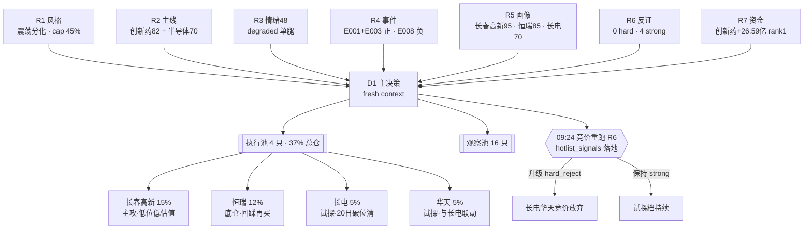

# 2026 年 7 月 7 日 · **主决策 / D1 盘前预案**

> **数据源新鲜度**: partial(R3 情绪单腿、R5 筹码降级)
> **降级状态**: true
> **置信度**: 0.63(七源加权,R7 资金 0.75 权重最高)

## 一句话结论

昨日炸板率 39% 叠加创业板 -1.77% 的杀成长,把风格明确摁进 **震荡分化型**;资金蹊跷板从高位科技清晰切到创新药+红利+减肥药,是今日**唯一可信的主线证据**。仓位上限压到 **45%**,执行池 4 只、观察池 16 只,**创新药主攻(长春高新 15% + 恒瑞 12%),半导体只做试探档(长电/华天各 5%)**,追高一律放弃,竞价溢价 >+2% 立即弃单。

## 详细分析

### 大盘位置与风格判定 — 为什么必须收敛到 45% 仓位

R1 给出的判据链条非常干净:上一交易日涨停 64、跌停却有 46、炸板 41 折算炸板率约 39%,连板梯队 5→4→3 各只剩 1 只,已经出现明显的高度断层;创业板 -1.77% 单日、深成 -1.16%,而上证走平,这不是均衡分化,而是**资金主动杀成长、被动守老登**。KMeans 六簇聚类里唯一还带主动能的 C2 半导体/科创 50/证券/医药簇,5 日切片也已退到 -1.41%,芯片 5 日 -8.19%、科创 50 -5.87%,主动能其实是**边退潮边最后一根救命草**的形态。

在这种结构里,R1 建议仓位上限 45%、拒绝追高、拒绝情绪高标接力,是**由风格出发**的底线。R6 M2_01 反证进一步指出:R1 明确了独主线+震荡分化,但 R2 却给了两条主线,其中半导体属于弱主线,若周一继续跟随消费电子/CPO 下杀就立即失效,严格来讲第二主线的仓位应该**≤ 10% 试探性梯队**。D1 采纳这条 strong_suggest,把总仓上限从 R1 的 0.45 → 派生"创新药 ≤ 27% + 半导体 ≤ 10%"的强分层结构。

### 主线选择 — 三源交叉后只剩创新药是硬主线

R7 资金面把答案摆得非常直白:创新药 +26.59 亿全市场 rank1、单抗 +15.89 亿、减肥药 +15.36 亿、医药医疗风格 +14.97 亿,**医药链条自上而下全面净流入**,同时红利股 +22.14 亿、大盘价值 +22.88 亿、金融地产 +19.64 亿。这是一次教科书式的"资金撤离弹性、锁进防御"。反方向看,融资融券 -830 亿、昨日高振幅 -539 亿、MSCI/深股通合计流出 -847 亿,消费电子 -136 亿、CPO -145 亿、玻璃基板 -62 亿——**所有高位科技被系统性抛售**。

R3 颜晓滨群的操盘手叙事完全对上:风格切到"老登(创新药/煤炭/猪肉/银行)+ 低位科技",valid_period 1-5 天。R4 的 8 条 top 事件里,虽然创新药**没有**任何 high-strength 单点事件锚,但反面的 E20260707_008(高位科技借利好出货 · 光模块 -13.5%、天孚 -36%、电子布补跌)是**红字 high strength 的负面事件**,这条负面事件本身就是最强的"别站错方向"信号。

半导体线的处境相对尴尬:R4 E001 韬定律 V2 + E003 蒋颖电话会给了两条 high-strength 催化,R3 颜晓滨也承认"低位科技可看 3 个月",但 R7 的板块资金证据是**反向的**——先进封装本身没有净流入,同赛道的消费电子/CPO/玻璃基板反而巨额流出。R2 自评本主线"资金维仅得 8/20",data_health 就写着 insufficient_verification。所以我把它列为**次级、试探档**,而不是主攻。

### 四象限叉乘 — 每只票必须同时过风格/主线/资金/反证四关

我把四条硬约束做了叉乘:R1 风格(震荡分化 → 拒绝追高、老登受益)× R2 主线得分(创新药 82 / 半导体 70)× R7 资金方向(创新药入 / 半导体反向)× R6 反证严重度(创新药 soft / 半导体 strong)。四象限落下来只有创新药同时四通过,半导体只过两关(R2 + R4 催化)、失分在 R7 与 R6。所以**权重必须体现在仓位上**,而不是简单的"进不进池"。

## 关键证据

- **证据 1(资金):** 创新药 +26.59 亿 rank1 · 减肥药 +15.36 亿 · 单抗 +15.89 亿 · 证金持股 +24.59 亿 rank2 共振 —— 来源 R7 sector_flows
- **证据 2(叙事):** 颜晓滨群明确定调"风格切换 → 老登+低位科技,valid_period 1-5 天",三群平行热议 BBU/液冷/存储—— 来源 R3 kol_summary
- **证据 3(负面锚):** R4 E20260707_008 · 颜晓滨警示高位科技借利好出货,光模块 -13.5%、天孚 -36%,strength=high —— 来源 R4 top_events
- **证据 4(反证):** R6 hard_rejects=0、strong_suggest=4 · 半导体主线四条 strong_suggest 集中(M1_01/M2_01/M3_02/M6_01) —— 来源 R6 counter_arguments
- **证据 5(个股画像):** 长春高新 R5=95 · pb=1.27 · pos45=29% 深水低位;恒瑞 R5=85 但 pos45=84.6% 追高风险 —— 来源 R5 profiles
- **证据 6(风格):** 昨日炸板率≈39% · 连板梯队 5→4→3 各只剩 1 只严重断层 —— 来源 R1 evidence

## 执行池(4 只 · 合计 37%)

### 长春高新 000661.SZ — 本轮首选进攻位

**大资金意图:** R7 显示减肥药子板块昨日已 +15.36 亿净流入,但股价才 +0.73%,说明有人在**低位默默吸筹**而不是拉高出货;板块内跌幅第一的减肥药 +2.03% 也没落到这只票上,反而 pb=1.27 处于医药股极端安全边际。

**为什么走强:** 双主线双引擎——长效生长激素 + GLP-1 减肥药;弹性大于恒瑞,估值又比恒瑞便宜一大截;R3 颜晓滨"切换到老登"这条叙事对它的正命中最强(既是老登又是 GLP-1 主赛道)。

**逻辑够不够硬:** 硬。四象限全部通过——风格(老登受益)× 主线(创新药 82)× 资金(减肥药 +15.36 亿)× 反证(R6 零负面命中)。R5 composite=95 全池最高,是唯一一个 R6 counter_arguments 没有点名的执行池标的。

- **买入理由:** pos45=29% 深水,pb=1.27 极端便宜,弹性 > 恒瑞;R6_M1_02 明列"弹性 000661 > 600276",这是反证 skill 本身建议的权重倒挂
- **风险点:** 近半年业绩预期下修压制机构加仓意愿;若周一整个医药板块高开后回落,底部反弹票承压更明显
- **止损条件:** 硬止损 65.98(-5%),破 5 日线减半,破 10 日线全清;板块日流入 <5 亿或减肥药翻绿减仓 50%
- **可验证假设:** 若开盘 30 分钟内 GLP-1 子板块保持 +1% 以上、创新药 ETF 不翻绿,则加仓假设成立;若板块高开低走 → 假设伪证,不加仓
- **仓位:** 15% · **买点:** 68.5–69.5 · **止盈:** 79.88(+15%)

### 恒瑞医药 600276.SH — 机构底仓,不是战斗仓

**大资金意图:** 证金 rank2 +24.59 亿共振、创新药 ETF T-1 已 +1.39% 领跑——机构昨日已经建过一波仓,今日大概率**震荡消化筹码**而不是继续拉升;R7 创新药 +26.59 亿 rank1 是板块层面的资金,不等于恒瑞会单日暴力上涨。

**为什么走强:** 创新药一哥的地位无可争议——GLP-1 + ADC + PD-1 三箭齐发,港A 双轨,MSCI/沪深 300 权重股,机构必配底仓;R7 医药链条全线流入,恒瑞是资金主线的第一落点。

**逻辑够不够硬:** 半硬。资金流向 100% 支持,但 R4 无 high-strength 直接催化(叙事维仅靠 R3 颜晓滨风格切换),R5 pos45=84.6% 追高风险显性,R6_M3_01 soft_suggest 已经明说"买点收敛到 60 日线上方分批"。

- **买入理由:** 板块资金 rank1、机构底仓属性、R2 sector_score=82 全维正向
- **风险点:** ETF T-1 已经 +1.39% 存在 T+0 高开出货、pe_ttm=46.4 pb=5.92 估值中位偏高、20d +20.58% 已经透支近月催化
- **止损条件:** 硬止损 53.93(-5%),破 MA10 减半,**跌破 60 日线全部清仓**(R6_M3_01 要求);创新药 ETF 连续两日净流出且板块日跌 >2% 减半
- **可验证假设:** 若开盘 +2% 以内可试探 4% 底仓,余 8% 等回踩 56.0-56.6;开盘 +3% 以上直接放弃
- **仓位:** 12% · **买点:** 56.0–56.6 · **止盈:** 65.29

### 长电科技 600584.SH — 半导体试探档,20 日线破位无条件清仓

**大资金意图:** 昨日华虹 +12、海光 +6、中芯 +5、寒武 +2,先进封装本身没有板块级净流入,消费电子/CPO/玻璃基板同类高位科技被巨额抛售——**资金既想炒题材又不愿意在这个位置追,是典型的观望+试探**。

**为什么走强:** R4 E001 韬定律 V2 论文(混合键合功耗 -41%/频率 +13%/密度 155→238)+ E003 蒋颖 07:30 电话会,催化时间锚极精准;R3 颜晓滨"低位科技"叙事的 A 股映射。

**逻辑够不够硬:** 不够硬。R6 用了四条 strong_suggest 逐一警示——M1_01(资金反向)、M2_01(第二主线违反 R1 独主线)、M3_02(高位/估值中位)、M6_01(高位科技借利好出货,只差 hotlist_signals 落地就可能升级为 hard_reject)。R5 flags 直接写着 `distribution_alert / high_valuation / not_truly_low_position`,composite=70 是执行池最低。

- **买入理由:** 华为韬定律 V2 硬叙事锚 + 蒋颖 07:30 电话会时间锚 + Mate90 装测封测链
- **风险点:** distribution_alert_potential + 60 日 +20% 已经不算真正低位 + E008 高位科技出货的板块级共振风险
- **止损条件:** 硬止损 88.83(-5%);**跌破 20 日线无条件全部清仓**(R6_M3_02 要求);消费电子/CPO/玻璃基板任意一板日跌 >3% 且长电盘中翻绿即全清
- **可验证假设:** 09:24 竞价快照 hotlist_signals 落地后由 P1 skill 重跑 R6 模式六,若届时长电命中 distribution_alert 且 5 日主力净流出为负 → 升级 hard_reject → 竞价直接放弃;否则 5% 试探档进
- **仓位:** 5%(试探) · **买点:** 92.0–93.5 · **止盈:** 无(试探档不设正向目标)

### 华天科技 002185.SZ — 与长电成对试探,合计 ≤10% 满足 R6 上限

**大资金意图:** 华为 Mate90 装测封测链的第二受益人,与长电形成板块梯队,但**筹码结构和长电几乎一致**,资金也没有单独青睐它的证据。

**为什么走强:** R4 E001 韬定律 V2 弹性大于长电、pe_ttm 稍低于长电、市值小一档 → 弹性大;R2 板块内综合评分 top2。

**逻辑够不够硬:** 不够硬。与长电同一批 R6_M3_02 strong_suggest 命中,风险传导路径几乎同源。之所以还保留 5%,是因为**如果长电走强,华天大概率跟涨且弹性更好**;如果长电走弱,双清就是了。

- **买入理由:** Mate90 封测二线弹性、板块内 top2 排名、韬定律 V2 直接受益
- **风险点:** 与长电同源的分布式派发风险、pe_ttm 55-65 偏高、20 日线破位共振风险
- **止损条件:** 硬止损 18.35(-5%);跌破 20 日线无条件全部清仓;与长电同步的板块指数触发条件立即减半
- **可验证假设:** 若长电盘中不能守住 5 日线,华天大概率同步破位,预设"长电破 20 日 → 华天同步清仓"的联动规则
- **仓位:** 5%(试探) · **买点:** 19.2–19.6 · **止盈:** 无

## 观察池(16 只)

**创新药扩散替补(3 只):** 复星医药 600196(R5=90 单抗子线) · 通化东宝 600867(R5=87 GLP-1 纯正弹性) · 新和成 002001(GLP-1 原料药,periphery)——一旦主线扩散、恒瑞/长春高新任意一只被 R6 升级或走弱,这三只按 R5 排序候补。

**先进封装候补(1 只):** 通富微电 002156(R5=75 AMD 封装伙伴)——若长电华天双清,通富作为板块指数信号回补的最后一根锚。

**BBU/AI 服务器电源电池(3 只):** 时代万恒 600241(官网实锤 · T-1 已涨停) · 蔚蓝锂芯 002245(小圆柱回封) · 豪鹏科技 001283(互动平台确认对英伟达出货)——**只做续接观察,不做首板买入**;若时代万恒继板则说明板块被点燃,再考虑豪鹏/蔚蓝跟随。

**液冷/交换机/存储(6 只):** 浪潮信息 000977(液冷整机龙头 · 80 亿订单 · GB300 全系列认证) · 紫光股份 000938(交换机 H3C) · 中兴通讯 000063(800G 智算 Scale-Across) · 星网锐捷 002396(Q2 环增 >9 倍,替代锐捷 301165 的合规选择) · 共进股份 603118(华为超节点) · 德明利 001309(存储涨价链)——R3+R4 双源共振但 R7 资金反向,以观察为主。

**商业航天/算力事件(3 只):** 航天电子 600879 + 航天机电 600151(长征十号乙 7/10 首飞) · 航锦科技 000818(中报预告 +191.45%~+308% · 算力转型)——事件驱动短窗口标的,只观察不追。

## 数据源审计

| 源 | 状态 | 抓取日期 | 记录数 | 备注 |
|---|---|---|---|---|
| research_summary | 🟢 ok | 2026-07-07 | 7 | orchestrator_status=complete · severity=2 |
| R1_style | 🟢 ok | 2026-07-07 | 1 主结论 | confidence 0.70 · 震荡分化 |
| R2_main_sectors | 🟢 ok | 2026-07-07 | 2 主线 + 5 次级 | 半导体 data_health=insufficient_verification |
| R3_sentiment | 🟡 degraded | 2026-07-07 | 5 共振主题 | weflow_snapshot 超时 · hotlist_signals pending |
| R4_news | 🟢 ok | 2026-07-07 | 8 top 事件 | E008 负面 high strength 是主线反面锚 |
| R5_stock_profiles | 🟡 partial | 2026-07-07 | 10 个股画像 | chenhailangju/canghai-sise MCP DOWN · 龙虎榜 30d 全 0 |
| R6_devil_advocate | 🟢 ok | 2026-07-07 | 0 hard + 4 strong + 3 soft | 模式六因 hotlist_signals pending 降级为 strong |
| R7_capital_flow | 🟢 ok | 2026-07-07 | 4 维度 | confidence 0.75 全池最高 · 主要证据来源 |

**匿名化说明:** R3 KOL 群聊来源统一以"机构风向标群/AA 陆家嘴/摩天轮/一手盘中/专注核心/AA 题材"六个化名描述,未落具体群名与用户昵称。

## 不确定性 / 反证

**最大不确定性是"半导体到底能不能进池"这个问题**。R4 给了两条 high strength 催化(韬定律 V2 + 蒋颖电话会),但 R7 板块资金完全反向,R6 用四条 strong_suggest 集中警告,R5 直接给 distribution_alert 标签。我的处理是**"进池但仅限试探档"**——如果 09:24 竞价 hotlist_signals 落地后 R6 模式六升级为 hard_reject,长电华天在竞价里就要清掉,而不是等开盘。

**第二大不确定性是恒瑞的追高风险**。R5 pos45=84.6% 明显偏高,R6_M3_01 soft_suggest 明说要"回踩 60 日线上方分批",但 R7 又是全市场 rank1 的资金流入首选落点。我的处理是**权重倒挂**——长春高新 15% > 恒瑞 12%,恒瑞只在回踩 5 日线 56.0-56.6 才买,追高 T+0 一律放弃。

**第三大不确定性是 R3/R5 的降级**。weflow_snapshot 超时导致情绪源单腿;chenhailangju/canghai-sise MCP 全线 DOWN 导致 R5 龙虎榜 30 日全 0、筹码维用 daily_basic 分位近似——这两条降级会**低估**分布式派发信号,所以整体仓位再收敛一档到 45%(而非 R1 建议的上限 50%)。

## 与其他 R/D/E 的关系

- **依赖:** R1(风格+仓位上限) · R2(主线+龙头候选) · R3(情绪浓度) · R4(催化+负面锚) · R5(个股六维画像) · R6(反证严重度) · R7(资金四维)
- **被消费:**
  - **P1 竞价校准 skill(09:24-09:29):** 消费本预案的 execution_pool + watch_pool,竞价快照落地 hotlist_signals 后重跑 R6 模式六;若长电/华天升级为 hard_reject 则从 execution_pool 剔除
  - **P2 午盘修订 skill(11:35-12:05):** 消费本预案 + 上午成交/未成交状态,若创新药资金撤退则减仓恒瑞至 8%
  - **E1 每日复盘(15:10):** T+0/T+1 追踪 execution_pool 收益、watch_pool 命中率、R6 反证是否被市场验证

## Sub-Agent 元数据

- skill: main_decision_v1
- artifact: /Users/chenyang/Downloads/demo/沧海巨浪/data/runtime/watchlist_plan_20260707.json
- 生成耗时: 单轮 fresh context(<1 分钟)
- model: ark-code-latest

## 决策流可视化(mermaid)

## Version History

- v1(2026-07-07 08:15): 首版 fresh context LLM 决策 · 采纳 R6 全部 4 条 strong_suggest · 半导体收敛至 10%
