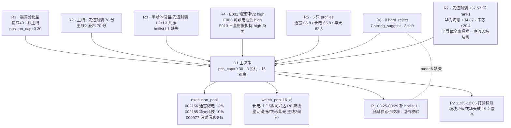

# 2026 年 7 月 8 日 · **D1 主决策 · 盘前预案**

> 🟡 **数据源新鲜度**: partial(research_summary 缺失 · R1-R7 unit 齐全)
> 🟠 **降级状态**: degraded(fetch severity=3 · MCP 三挂 · WeChat 公众号全挂)
> 📊 **置信度**: 0.62
> 🎯 **mode**: `dry_run` · 需用户人工 flip `live` 才自动委托

---

## 🎯 一句话结论

震荡分化型 + 独主线(近似) + 情绪 40 + fetch severity=3 → **仓位上限 30% 硬顶**,execution 缩至 3 只、首推 002156 通富微电、总仓 30% 满,保留 70% 现金对冲情绪反手。

---

## 📊 结构地图

---

## 🧠 详细分析

### 段一 · 风格与仓位定档(R1)

今日 R1 判定 **震荡分化型 + 独主线**,情绪浓度 40,`position_cap_suggestion=0.30`。原因是 6 板孤票(恒尚节能)缺乏 2-5 板梯队跟随,涨停家数 U≈32、跌停 D≈29 二者近平,炸板率 42%(<50% 尚未崩溃)。**大盘背景**:上证 3990.24 -1.26% + 创业板指 3911.91 -0.94%,创业板 5 日累跌 -8.4% 抱团退潮未止。**大资金意图**:R7 唯一净流入板块簇是半导体全家桶(先进封装/华为海思/氮化镓/中芯/IGBT/碳化硅合计 +154 亿),融资融券 -758 亿 + 沪深股通合计 -805 亿是大盘杠杆撤出;**为什么走强**只有半导体链条被硬资金站队,其余板块处于全面出货;**逻辑够不够硬**:R3 hotlist L1 层完全缺失,无法用霸榜数据反证,故 R6 mode6 硬否决无法闭环 → 义务转派 P1 + 开盘 hotlist_rank_signal_v1 补齐。

结论:仓位上限锁 0.30,不上探,不下调(震荡分化的 0.40-0.60 区间下沿,反映 fetch severity=3 + 无梯队的双重保守)。

### 段二 · 主线取舍(R2 × R6 × R7)

R2 给出 2 条主线:

| 主线 | 得分 | 龙一 | 龙二 | D1 决策 |
| ---: | ---: | ---: | ---: | ---: |
| 先进封装/华为韬定律V2 | 78 | 600584 长电 | 002156 通富 | ✅ 主仓位 22%(通富 12 + 华天 10) |
| 液冷/交换网络/AIDC | 70 | 000977 浪潮 | 002396 星网锐捷 | ⚠️ 降二线 · 只放浪潮 8% |

**为什么先进封装留、液冷降**:

- **大资金意图**:R7 板块资金 top4 全部是半导体(先进封装 37.57 / 华为海思 34.87 / 氮化镓 26.71 / 中芯 20.4),液冷/交换网络在 top10 无任何显性归口,R2 自认资金维仅 12/20;
- **为什么走强**:R4 E001 韬定律 V2 论文 07-05 公开、07-06 蒋颖电话会、07-06 液冷板块已冲高兑现,液冷属"催化后余温"(R3 rank2 note 明示),先进封装属首发窗口(叙事+资金双共振);
- **逻辑够不够硬**:液冷侧 R4 E008 光模块/CPO 高位小登连续大跌 + E010 三星财报担忧属同一 AI 硬件情绪链,存在情绪反手拖累估值扩张的风险;先进封装侧唯一威胁是长电/士兰微 PE 分位 75-90%+ 高位陷阱,但通富位置最舒服(pos_in_range 43.5%)可规避。

### 段三 · R6 反证系统性采纳

R6 共 7 strong_suggest + 3 soft:

| R6 编号 | 目标 | severity | D1 处置 |
| :--- | :--- | :---: | :--- |
| M2_01 | R2 硬推 2 主线 5 龙头 | 🔴 strong | ✅ 严守 pos_cap 0.30 · 液冷降二线 · execution 缩至 3 |
| M3_01 · M7_01 | 长电 PE81/位置 85% | 🔴 strong | ✅ 移出 execution → watch |
| M3_02 · M7_03 | 士兰微 4 项复合红旗 | 🔴 strong | ✅ 移出 execution → watch |
| M3_03 | 华天 5d 累跌 -9% | 🟡 soft | ✅ 保留首推 · 硬止损 19.20 · 限仓 10% |
| M7_02 | 同兴达纯题材期权 | 🔴 strong | ✅ 移入 watch · 仅情绪扩散阶段试仓 ≤3% |
| M6_01 | mode6 hard_reject 客观条件缺失 | 🔴 strong | ✅ P1 前调 hotlist_rank_signal_v1 补 L1 · 09:24 二次核验霸榜 |
| M1_01 | 液冷/交换网络主线弱 | 🟠 soft | ✅ 浪潮限仓 8% · 首选浪潮非纯题材 |
| M1_02 | AI 情绪面反手风险 | 🟠 soft | ✅ 保留 70% 现金对冲 |

**无 R6 hard_reject 触发**(mode6 数据缺失所致),D1 未 override 任何 strong_suggest。

### 段四 · 情绪与消息共振度(R3 × R4)

R3 情绪 45(半降级 · WeFlow TIMEOUT · L2+L3 双源共振 rank1 半导体设备/rank2 液冷交换/rank5 先进封装/散热),R4 top10 事件:

- 🟢 E001 韬定律V2 混合键合 · 6 源交叉 · strength=high
- 🟢 E002 BBU/AIDC 80 亿浪潮订单 · strength=high
- 🟢 E003 蒋颖电话会 · 液冷 Q3 兑现 · strength=high
- 🟡 E004 航锦国产算力 · single_source · 需开盘 15 分钟验证
- 🟡 E005 长征十号乙 07-10 发射 · medium(R7 商业航天 -103 亿严重出货)
- 🟢 E006 DDR3 存储涨价周期 · strength=high
- 🔴 **E008 光模块/CPO 高位小登大跌 · strength=high 负面**
- 🔴 **E010 三星财报 171 万亿 vs 预期 173.9 · AI 涨过头担忧 · strength=high 负面**

正 6 负 2 · 但负面处于同一 AI 硬件情绪链,是液冷/交换网络降级的关键理由。

### 段五 · 数据完整性与降级路径

| 降级项 | 影响 | D1 对策 |
| :--- | :--- | :--- |
| research_summary.json 缺失 | orchestrator 未汇总 | fallback 直读 R1-R7 · 已 pydantic 校验 |
| WeChat 公众号 0/21 · WeFlow TIMEOUT | 情绪面单源 | R1 情绪从量化+群聊双源自算 |
| canghai-sise / canghai-charts / vibe-trading DOWN | R5 chart_vision/block_trades/margin/dragon_tiger 全 null | R5 每票 composite -10 · 已计入 |
| hotlist L1 层 tushare 未落盘 | R6 mode6 hard_reject 客观条件缺失 | 义务转派 P1 + hotlist_rank_signal_v1 |
| fetch_global_severity=3 | 全局最严 | mode 强制 dry_run · autonomous_trading=false |

---

## 🎯 执行池(3 只 · 总仓 30%)

### 1️⃣ 通富微电 002156.SZ · **首推票** · role=leader · 12%

| 维度 | 内容 |
| :--- | :--- |
| 🎯 板块 | 先进封装(主线1) · R7 rank1 硬资金归属 |
| 💰 大资金意图 | R7 先进封装 +37.57 亿 rank1 · 板块内主力最集中 |
| 📈 为什么走强 | AMD 主要封测供应商 · 混合键合弹性 · R4 E001 韬定律V2 明列 |
| 🧠 逻辑够不够硬 | R5 composite 66.8 板块最高 · pos_in_range 43.5% 位置最舒服 · R6 counter_arguments **零命中** · fundamental_flags=[best_risk_reward_within_leaders] |
| **买入理由** | 硬资金 rank1 板块 + 位置最舒服 + R6 无反证 三重共振 |
| **风险点** | 半导体全家桶属 R1 C1 主动能带 5d -10.30% 已退潮 · 若 588000/512760 破 20 日均线主线即证伪 |
| **止损条件** | -5% 硬止损 62.87 · 跌破 MA10 减半仓 · 板块 -3% 且资金转出全撤 |
| **可验证假设** | T+2 内先进封装板块日线不破 5 日均线 · 龙虎榜佛山/紫阳双游资锁定不断 |
| entry | trend_pullback_buy · trigger 65.50 · zone [64.50, 66.20] · max_premium 2% |
| exit | stop_loss 62.87(p1) · MA10 破位(p2) · 板块降级(p3) · +15% 减半(p4) |

### 2️⃣ 华天科技 002185.SZ · **龙一游资锁定** · role=leader · 10%

| 维度 | 内容 |
| :--- | :--- |
| 🎯 板块 | 先进封装(西安3D+南京Chiplet) |
| 💰 大资金意图 | R7 龙虎榜 · 佛山系 +2.84 亿 + 紫阳东路 +2.71 亿 双游资同锁 net 5.55 亿 |
| 📈 为什么走强 | R4 E001 明列 · 昆山日月同芯混合键合 Bump 直接对标 · circ_mv 662 亿中盘游资偏爱区间 |
| 🧠 逻辑够不够硬 | R6 M3_03 soft_suggest 明示允许首推但硬止损 19.2 · fundamental_flags=[hot_money_locked, high_short_term_pullback] · 5d 累跌 -9% 短期获利盘沉重 |
| **买入理由** | 双游资锁 + 板块龙一 + 混合键合直接对标 |
| **风险点** | 5d -9% 短期获利盘 + R6 mode6 霸榜出货客观条件缺失 · 若开盘游资撤退迅速崩塌 |
| **止损条件** | R6 硬止损 19.20 硬止损 · 破位即撤 · 尾盘跌破 MA5 减半仓 |
| **可验证假设** | T 日龙虎榜佛山/紫阳仍在净买入 · hotlist_rank_signal 无连续 2 日榜首出货信号 |
| entry | trend_pullback_buy · trigger 19.60 · zone [19.30, 19.95] · 溢价 >2% 放弃 |
| exit | stop_loss 19.20(p1) · 游资出货/尾盘破 MA5 减半(p2) · +15% 减半 22.93(p3) |

### 3️⃣ 浪潮信息 000977.SZ · **液冷+硬 alpha** · role=core_largecap · 8%

| 维度 | 内容 |
| :--- | :--- |
| 🎯 板块 | 液冷整机/AI 服务器(主线2 降二线) |
| 💰 大资金意图 | R7 板块级液冷/AIDC **无显性归口**(资金端未硬承接) · 但硬 alpha 独立驱动 |
| 📈 为什么走强 | 中报预告 +226-228% · GB300 唯一全系列认证 · 80 亿订单实锤 · R4 E002 + E003 双 high |
| 🧠 逻辑够不够硬 | R6 M1_01 明示"首选浪潮而非纯题材" · 硬 alpha 相对独立于 AI 情绪链 · 但仍受 E008/E010 情绪面拖累风险 |
| **买入理由** | 硬 alpha 独立驱动 · 液冷板块龙一 · 主板大市值抗震荡分化 |
| **风险点** | 液冷板块资金未跟 · 若龙头炸板+主线2 情绪扩散失败迅速降级 |
| **止损条件** | P1 补齐参考价后 -5% 硬止损 · 液冷板块 -3% 且龙头炸板全撤 |
| **可验证假设** | 中报预告 +226-228% 在业绩快报窗口(7 月中下旬)前不被下修 |
| entry | trend_pullback_buy · 开盘 1.5% 内低吸 · **trigger_price 由 P1 校准** |
| exit | stop_loss trigger_price 待 P1(p1) · MA10/板块 -3% 减半(p2) · 板块资金流出 5 亿+龙头炸板(p3) |

---

## 👀 观察池(16 只)

| 类别 | ts_code · 名称 | 理由 |
| :--- | :--- | :--- |
| R6 降级 | 600584 长电科技 | R6 M3_01/M7_01 · PE81.2 高位陷阱 · 若入池限 5% · stop_loss 88 |
| R6 降级 | 600460 士兰微 | R6 M3_02/M7_03 · 4 项复合红旗 · 常态应 hard_reject |
| R6 降级 | 002845 同兴达 | R6 M7_02 · 纯题材期权 · 仅情绪扩散试仓 ≤3% |
| blocked | 688981 中芯国际 | 688 execution_block · 韬定律 V2 首要 anchor |
| blocked | 301165 锐捷网络 | 301 execution_block · 交换机四剑客 |
| blocked | 688702 盛科通信 | 688 execution_block · 国产交换芯片 |
| 主线2 候补 | 002396 星网锐捷 | 主线2 龙二 · 若浪潮先启动可跟入 |
| 主线2 候补 | 000063 中兴通讯 | 大市值蓝筹 · Scale-Across 交换 |
| 主线2 候补 | 000938 紫光股份 | H3C 交换机四剑客 |
| 主线2 候补 | 603118 共进股份 | 华为超节点交换机 · 主线1+2 交叉 |
| 二线 BBU | 002245 蔚蓝锂芯 | R2 二线 · 07-06 已涨停回封 |
| 二线 BBU | 001283 豪鹏科技 | R2 二线候补 |
| 二线存储 | 603986 兆易创新 | R4 E006 · DDR3 涨价周期 |
| 事件驱动 | 000818 航锦科技 | R4 E004 single_source · 开盘 15 分钟公告验证 |
| 事件驱动 | 600879 航天电子 | R4 E005 长征十号乙 07-10 · R7 板块 -103 亿严重出货 |
| 半导体全家桶 | 002129 TCL 中环 | R7 氮化镓/碳化硅 +43 亿净流入跟随 |

---

## 🔍 R6 反证采纳

- **hard_rejects**: **0**(R6 mode6 客观条件缺失,义务转派 P1 + hotlist_rank_signal_v1)
- **strong_suggest 采纳**: 8/8(100%)· 无 override
- **soft_note**: 2 · 全部落实(现金对冲 70% + 液冷限仓 8%)

---

## ⚠️ 不确定性 / 反证

1. **R1 独主线判定近似**:6 板孤票缺乏梯队,若开盘被撬 → 立即退化为无主线,pos_cap 应下调至 0.20
2. **R7 板块资金"半导体全家桶"vs R3"高位科技三月不看"张力未解**:大资金站队半导体但 T-1 定调型群明示反向出货,mode6 数据缺失无法闭环
3. **液冷/浪潮硬 alpha 存在**但 R7 板块资金**未承接**,与"硬 alpha"叙事存在反证 · P2 若午盘板块无资金启动应减仓
4. **三星财报 E010** 亚洲市场 AI 涨过头担忧与浪潮/存储硬 alpha 情绪面张力 · 若韩综继续暴跌 → 情绪反手风险 up

---

## 🔗 与其他 R/D/E 的关系

- **依赖(上游)**: R1/R2/R3/R4/R5/R6/R7 单元 artifact(research_summary.json 缺失,fallback 直读)
- **被消费(下游)**:
  - **P1 auction_amendment_v1**(09:25-09:29): 浪潮 000977 参考价 + -5% 止损补齐 · 华天/通富溢价校验 · hotlist_rank_signal_v1 补 L1 数据
  - **P2 midday_amendment_v1**(11:35-12:05): 板块 -3% / 华天破 19.2 / 液冷板块资金未启动 → 减仓触发
  - **canghai-execute**: 消费 execution_pool + 后续 amendment

## 📋 数据源审计

| 源 | 状态 | 抓取时间 | 记录 | 备注 |
| :--- | :---: | :---: | :---: | :--- |
| R1_style | 🟢 ok | 2026-07-08 | 1 | degraded · confidence 0.45 |
| R2_main_sectors | 🟢 ok | 2026-07-08 | 2 | degraded · confidence 0.62 |
| R3_sentiment | 🟢 ok | 2026-07-08 | 1 | degraded · WeFlow TIMEOUT |
| R4_news | 🟢 ok | 2026-07-08 | 10 | degraded · 公众号 0/21 |
| R5_stock_profiles | 🟡 partial | 2026-07-08 | 5 | 4 MCP DOWN |
| R6_devil_advocate | 🟢 ok | 2026-07-08 | 10 | mode6 hard_reject 客观条件缺失 |
| R7_capital_flow | 🟢 ok | 2026-07-08 | — | confidence 0.75 |
| research_summary | 🔴 error | — | — | orchestrator 未落盘 · fallback 直读 |
| user_preferences | 🟢 ok | 2026-07-04 | v1 | pos_cap 铁律硬约束 |

---

## 🧷 Sub-Agent 元数据

- **skill**: main_decision_v1
- **artifact**: `data/plans/20260708/watchlist_plan.json`(pydantic OK)
- **同源机读 md**: `data/plans/20260708/plan.md`
- **契约版本**: watchlist_plan_v1 + canghai_writing_contract_v1
- **model**: LLM fresh context(canghai-plan profile)
- **mode**: dry_run(fetch severity=3 硬顶 · autonomous_trading_enabled=false)
- **总仓预算**: 30% / 3 只 / 单板块 22%(先进封装)+ 8%(液冷)· 均未破铁律
