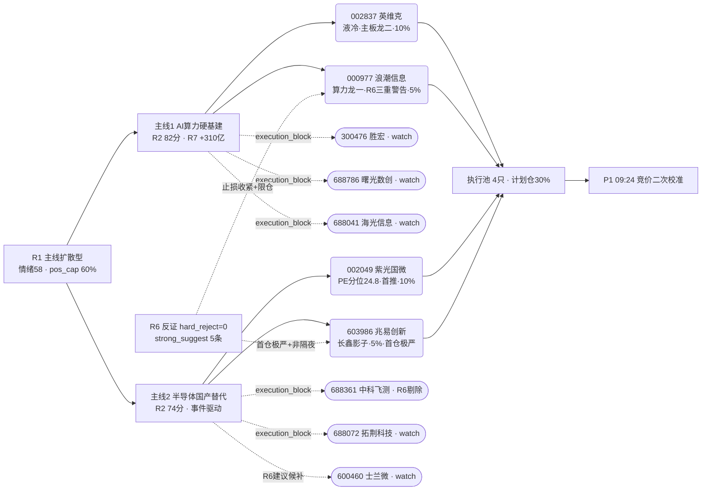

# 2026 年 7 月 9 日 · **主决策 / D1 盘前预案**

> **数据源新鲜度**: partial(R6 mode6 因 R3 L1 缺失降级)
> **降级状态**: false(严重度 0 · 主源全 ok)
> **置信度**: 0.68(R1 0.72 / R2 0.60 / R6 0.72 平均)

## 一句话结论

主线扩散型 + 情绪 58 · **仓位上限 60% · 今日实际计划仓 30%(4 只)**;主板龙头稀缺,**首推低估紫光国微 10% + 液冷英维克 10% + 长鑫影子兆易 5% + 谨慎浪潮 5%**,浪潮 R6 三重出货信号已限仓 5% 且非隔夜,竞价 >2% 直接换英维克。

## 详细分析

**风格与仓位**:R1 判定「主线扩散型 · 情绪 58 · 双主线(AI 算力 + 半导体)」,建议仓位上限 60%;R6 M2_01 明确「不因主线数=2 而放大到 65%」,D1 严格采纳 0.60 硬顶。但今日主板龙头供给严重不足(创业板/科创板龙头全部 execution_block),实际计划仓 30%(4 只) 已经是主板池能承载的上限,剩余弹性留给盘中低吸与 P1 竞价校准。

**主线1 · AI 算力硬基建(R2 82 分 · R7 五源 +310 亿)**:资金面全市场最强,算力概念 +135.88 亿 / 云计算 +95.45 亿 / 网络安全 +78.91 亿三巨头同向流入。但龙一浪潮信息(000977) R6 三重 strong_suggest 严重警告 — 5d 主力 -13.97 亿 + 机构对倒 + 欢乐海岸游资 -1.24 亿 + PE 分位 98.8 极端,资金结构与叙事严重背离。主板龙二只有英维克(002837)可承接(胜宏/曙光/海光/拓荆均创科板 blocked),故英维克实为「事实上的主板龙一」。

**主线2 · 半导体国产替代(R2 74 分 · 事件驱动)**:R6 M1_01 明示三源共振不足 + 外盘负面(E20260709_008 KOSPI -5.35% + 美股半导体重挫);R7 半导体一级板块无独立正流入。仅存的两个主板合规且 R6 未强烈反对的标的:**紫光国微(002049)** PE 分位 24.8 唯一低估 + alpha=A- / risk=A · 长鑫链 + 特种存储/FPGA · 是全池综合最优;**兆易创新(603986)** 长鑫早期股东首推影子 · R7 主力 5d +29.72 亿硬确认 · 但 PE 分位 83.6 需限仓 5% 且严守首仓。

**情绪与外部**:北向 5 日净流入连续下滑(42.4→33.84 亿),IF 主力贴水 -87.53 点,科创 50 ETF 净流出,昨日炸板率 23%,老赛道(锂电/能源金属)跌停约 40 只。R6 M2_02 soft_suggest:「支持 55% 仓位硬约束,竞价小幅低开为最优接入点,主线股逢强不追」。

**R6 反证核心**:hard_reject=0(mode6 因 L1 hotlist 缺失严格双条件不满足),但 M6_01+M7_01+M1_02 三条 strong_suggest 全部指向浪潮信息「霸榜出货结构」。D1 采纳最保守路径:保留龙一头衔但仓位 5% + 止损收紧至牛线-3%(65.36)+ 非隔夜 + +15% 直接清仓。P1 若 L1 补齐 distribution_alert 命中 000977,立即升级为 hard_reject 剔除。

## 关键证据

- 证据 1: **紫光国微 PE 分位 24.8 全池唯一低估 + alpha=A- risk=A** · 来源 R5_stock_profiles(002049)
- 证据 2: **英维克 PE 分位 60.8 液冷主板龙二 + R4 E20260709_002 谷歌液冷泵替换 high** · 来源 R4_news + R5(002837)
- 证据 3: **浪潮信息 5d 主力 -13.97 亿 + 机构对倒 + 欢乐海岸 -1.24 亿 + PE 分位 98.8** · 来源 R6 M6_01/M7_01/M1_02(000977)
- 证据 4: **兆易创新 5d 主力 +29.72 亿 + 长鑫 7/16 科创板申购影子** · 来源 R4 E20260709_001 + R7(603986)
- 证据 5: **主线1 资金 R7 算力 +135.88 亿 rank1 + 云计算 +95.45 亿 + 网络安全 +78.91 亿五源同向** · 来源 R7_capital_flow

## 主线与选股全景(mermaid)

## 首推逐票思维链(≥4段)

### 1. 002049 紫光国微(首推 · 10%)

**大资金意图**:R7 主力 5d +2.67 亿弱正 + 龙虎榜 30d 无游资/机构上榜(clean chip)· netprofit_yoy +180% · 半导体链中唯一低估标的,机构在估值分位 24.8 位置逢低吸筹的可能性最高。

**为什么走强**:技术 row3=strong · 收盘>牛线 83.01 · MA5>MA10>MA30 多头排列 · 长鑫 7/16 科创板申购影子 + 特种存储/FPGA 军工双属性 + 财务底部反转(netprofit_yoy +180%,债务 25.47% 极干净)。

**逻辑够不够硬**:硬。全池唯一同时满足「主板合规 + PE 分位 <30 + alpha=A- + 事件驱动」的标的。R6 反证中未被点名,是唯一没有反面证据的 execution 候选。

**买入理由**:估值安全垫 + 事件驱动 + 财务反转三重共振 · 主线2 唯一非估值临界票
**风险点**:5d 主力流入弱(+2.67 亿只是相对其他半导体的相对优势,绝对值不强);长鑫 IPO 若延期或定价过高,影子叙事可能被证伪
**止损条件**:跌破 78.86(牛线 83.01 下 5%)清仓 · 收盘破 MA10=84.60 减半
**可验证假设**:今日主板半导体板块若涨幅前 20 内包含 002049,且成交量放大至 5 日均量 1.5 倍以上,则视为主线2 独立启动信号

### 2. 002837 英维克(主板事实龙一 · 10%)

**大资金意图**:R7 算力概念 +135.88 亿 rank1,液冷是最直接受益子板块;5d 主力 -3.73 亿是「板块共振但个股回调」的相对低位;股东户数 5-6 月 +21.3% 分散虽有筹码整理特征,但价格已回踩 3 月均线,是机构再介入窗口。

**为什么走强**:R4 E20260709_002 谷歌液冷泵替换潮 high 正面 · 单泵价值量 5x · 昨日板块炸板集中在跟风股而非龙头 · 板块内 300476 胜宏 / 688786 曙光均 execution_block,资金硬集中到英维克是主板唯一出口。

**逻辑够不够硬**:较硬。R6 未点名,估值合理(PE 分位 60.8 是主线1 内最舒服),但技术上收盘<熊线 76.12 属于「熊下,破位参考」形态,右侧介入需等待放量。

**买入理由**:主线1 主板事实龙一 + R4 硬事件 + PE 分位 60.8 唯一非极贵
**风险点**:昨日熊下技术形态未修复 · 若竞价高开 >2% 追高容错为 0
**止损条件**:跌破 71.90(牛线 75.68 下 5%)清仓 · 收盘破 MA10=76.09 减半
**可验证假设**:若开盘 30 分钟内液冷板块(R7 分项)成交额进入市场 top 10 且英维克涨幅≥板块中位,视为主线1 独立启动

## 观察池要点(16 只)

- **主板等待启动**:600584 长电 / 002156 通富微电 / 002185 华天 / 002396 星网锐捷 / 000063 中兴 / 000938 紫光股份 / 603118 共进 / 000818 航锦 — 昨日观察票延续,主线未明确启动前不入 execution
- **R6 建议候补**:600460 士兰微 / 600183 生益(F3/F7 红旗)
- **execution_block 保留观察**:300476 胜宏 / 688786 曙光数创 / 688041 海光 / 688072 拓荆 / 688361 中科飞测 / 301165 锐捷网络 — 若切生态账户或后续允许才能触发

## 数据源审计

| 源 | 状态 | 抓取时间 | 记录数 | 备注 |
|---|---|---|---|---|
| research_summary | 🟢 ok | 2026-07-09 07:32 | 7 | orchestrator_status=complete |
| R1_style | 🟢 ok | 2026-07-09 07:32 | 1 | conf 0.72 · 主线扩散型 |
| R2_main_sectors | 🟢 ok | 2026-07-09 07:20 | 2 | conf 0.60 · synthesized_by_r5_llm |
| R3_sentiment | 🟡 partial | 2026-07-09 07:00 | — | L1 hotlist 缺失 · 影响 R6 mode6 严格判定 |
| R4_news | 🟢 ok | 2026-07-09 07:00 | 8 | conf 0.78 · 8 条事件 |
| R5_stock_profiles | 🟢 ok | 2026-07-09 07:23 | 12 | 12 profiles built |
| R6_devil_advocate | 🟡 partial | 2026-07-09 07:55 | 10 | mode4/5/6 部分降级,strong_suggest 5 条已采纳 |
| R7_capital_flow | 🟢 ok | 2026-07-09 07:05 | 1 | conf 0.75 · 主力/北向/游资全维 |
| user_preferences.yaml | 🟢 ok | 2026-07-04 | 1 | v1 龙一龙二铁律 |

## 不确定性 / 反证

- **R6 mode6 出货未升级 hard_reject**:R3 L1 hotlist 缺失导致严格双条件(distribution_alert + main_force_5d<0)只满足后者。D1 已采纳最保守路径(浪潮限仓 5% + 非隔夜),但仍需 P1 09:24 补齐 hotlist 数据后二次判定,若 distribution_alert 命中 000977 立即升级 hard_reject 剔除。
- **主板龙头稀缺**:主线1 龙二(胜宏 300)/ 候补(曙光 688 / 海光 688 / 拓荆 688 / 中科飞测 688 / 锐捷 301)全部 execution_block,导致主线1 execution 只能塞英维克 + 高风险浪潮,实际计划仓 30% 已达主板容量上限。
- **半导体主线三源共振弱**:R7 半导体一级板块无独立正流入,仅长鑫 IPO 事件驱动。若 7/16 前无进一步催化,主线2 存在证伪风险。

## 与其他 R/D/E 的关系

- 依赖: research_summary.json(orchestrator) · R1-R7 unit artifacts · data/user_preferences.yaml
- 被消费: canghai-execute(execution_pool + exit_rules) · P1 auction_amendment_v1(竞价校准 · 需二次核验 000977) · P2 midday_amendment_v1(午盘修订) · 用户 iLink 摘要 + Obsidian 盘前预案

## Sub-Agent 元数据

- skill: main_decision_v1@1.0
- artifact: data/plans/20260709/watchlist_plan.json(pydantic OK · 22115 bytes)
- 机读 md: data/plans/20260709/plan.md
- 生成方式: LLM fresh context(禁止携带 R1-R7 中间推理,只读最终 artifact)
- model: ark-code-latest
