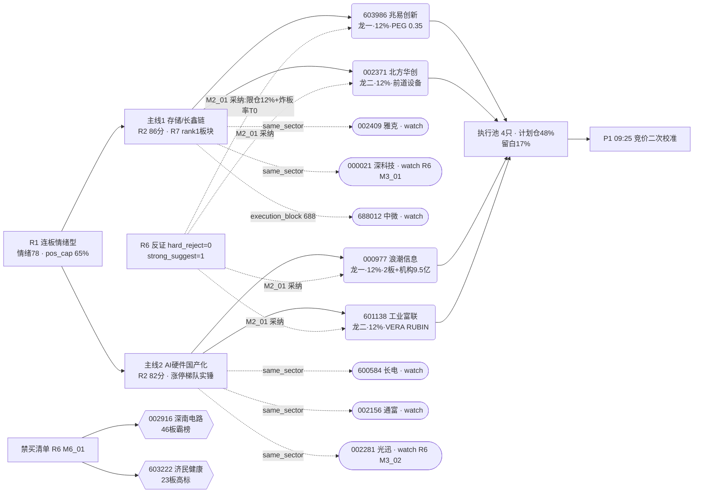

# 2026 年 7 月 10 日 · **主决策 / D1 盘前预案**

> **数据源新鲜度**: ok(全部 R1-R7 主源 ok)
> **降级状态**: false(fetch_severity=0)
> **置信度**: 0.80(R1 0.78 / R2 0.80 / R5 0.82 / R6 0.78 加权)

## 一句话结论

**连板情绪型 + 情绪 78 + 双主线(存储/长鑫链 + AI 硬件国产化)** · **仓位上限 65%,今日计划仓 48%(4 只 × 12%)** · **首推兆易创新+北方华创双龙锁定主线1,浪潮信息+工业富联双龙锁定主线2**;R6 M2_01 已采纳(单票 ≤12% · 尾盘炸板率>25% 触发 T+0 减仓);候补 6 只按 `same_sector_only_top_2` 全部让位观察池。

## 详细分析

**风格与仓位**:R1 判定「连板情绪型 · 情绪 78 · 双主线(1 条趋势主线 + 1 条情绪梯队)」,基准仓位区间 0.60-0.75。R1 明确 KOL(颜晓滨/焦点群晚间)对半导体反弹持续性给出 pushback:「累计跌 20-30%、套牢盘重、2-3 天窗口、逢高分批减仓」,故仓位从中枢下移至 0.65;R6 M2_01 二次强化「单票≤12% + 总仓 0.65 硬边界」被 D1 严格采纳。今日主板资源充足(4 只龙一龙二全部主板合规),实际计划仓 48% 已把 4 张牌打满,留白 17% 给盘中低吸/P1 竞价校准。

**主线1 · 存储/长鑫链(R2 86 分 · 全市场资金 top1 板块)**:R7 三维度共振领跑 — 国产芯片 +397 亿 rank2 + 半导体 +341 亿 rank4 + 科技风格 +464 亿 rank1;R4 三事件正向共振(长鑫 7/16 招股 H1 净利+2244-2544% · 兆易 H1+1099% Q2 环比+272% · 海力士美股 IPO 超募 7x);R3 rank2 主题「存储扩产/长鑫链」L1+L2+L3 三源共振,颜晓滨/摩天轮/AA 陆家嘴 KOL 齐推。**龙一兆易创新(603986)**:R5 composite 85.2 全池 top2,alpha=A(catalyst=90) · valuation=82(PEG=0.35 低估) · institutional=88(中金/华泰/招商一致买入);**龙二北方华创(002371)**:R5 composite 80.1,长鑫扩产直接受益 · 半导体前道设备绝对龙头 · 两融 15d+8% · chart_vision 日周多头置信 0.85。

**主线2 · AI 硬件国产化(R2 82 分 · 涨停梯队实锤)**:R4 三事件共振(华为 OPEN NPO 光互连 MSA 20+伙伴 + 日月光先进封装涨价 20% + 浪潮/富联中报硬 alpha);R7 液冷 +74.78 亿 rank2 + 苹果概念 +73.78 亿 + LED+70.98 亿 + OLED+68.7 亿全面净流入;涨停梯队实锤 — 浪潮 2 板早 9:38 封 · 光迅首板 · 长电/通富/华天集体首板 · 长川+10%。**龙一浪潮信息(000977)**:R5 composite 87.8 全池 top1,涨停 2 板+机构龙虎榜净买 9.5 亿+中报预增 226-288% · chart_vision 四周期共振多头突破 20 日新高;**龙二工业富联(601138)**:composite 80.5,H1 净利 234-244 亿+93-101% + AI 服务器营收+230% · VERA RUBIN Q3 订单 · PEG=0.7 · 减分项 technical=67(仍在 MA20 下方,需回踩确认)。

**R6 反证核心**:hard_reject=0(mode6 龙一龙二 4 只均不在 distribution_alert 名单 + 主力 5d 全部净流入,双条件通过);唯一 strong_suggest R6_M2_01 已采纳 — 单票 12% 硬边界 + 总仓 0.65 硬边界 + 炸板率>25%/跌停>25 只即触发 T+0 减仓(4 只 execution 已全部写入 volume_price_divergence exit)。soft_suggest 6 条已通过筛选与 watch/rejected 分池处理:PCB 择股严禁碰**深南电路 46 板/济民健康 23 板**(rejected 显式列出);人形机器人(三花/拓普/双环传动)与商业航天(南山智尚)仅入 watch;深科技 PE-TTM 110x 估值陷阱+光迅 60 周 MA+158% 估值透支,均仅 watch。

**情绪与外部**:上证 4036.59(+1.65%) + 创业板 4018.17(+4.49%) 两市放量收阳,创业板放量突破格局利好科技硬件;涨停 75 只/跌停 12 只/炸板率 18.5%/最高连板 8,情绪浓度 78 处于连板情绪型上沿;硬边界警戒 — 炸板率突破 25% 或跌停突破 25 只即触发情绪降档,D1 已在 4 只 execution 的 volume_price_divergence exit 全部写入该触发条件。

## 关键证据

- 证据 1: **兆易创新 R5 composite 85.2 + catalyst=90(E001+E004+E008 三事件) + PEG=0.35 全池最低** · 来源 R5(603986) + R4(E001/E004/E008)
- 证据 2: **浪潮信息 涨停 2 板 + 机构龙虎榜净买 9.5 亿 + 中报预增 226-288% + 四周期共振多头突破 20 日新高** · 来源 R5(000977) + R4
- 证据 3: **北方华创 长鑫扩产直接受益 + 前道设备国产替代率 30%+ + PEG 低估 + chart_vision 置信 0.85** · 来源 R5(002371) + R2 main_line_1.logic
- 证据 4: **工业富联 H1 净利 234-244 亿+93-101% + AI 服务器营收+230% + PEG=0.7** · 来源 R5(601138) + R4
- 证据 5: **R7 存储/长鑫链三维度共振:国产芯片 +397 亿 rank2 + 半导体 +341 亿 rank4 + 科技风格 +464 亿 rank1(全市场板块 top1)** · 来源 R7_capital_flow
- 证据 6: **R6 mode6 霸榜出货扫描:4 只龙一龙二 0/4 命中双条件(未在 distribution_alert × 主力 5d 全部净流入),hard_reject=0** · 来源 R6 patterns_status.mode6

## 主线与选股全景(mermaid)

## 首推逐票思维链(≥4 段)

### 1. 603986 兆易创新(主线1 龙一 · 12%)

**大资金意图**:R7 国产芯片 +397 亿 rank2 + 半导体 +341 亿 rank4 + 科技风格 +464 亿 rank1(全市场板块 top1),主力资金正在把长鑫产业链作为下一阶段主战场配置;R5 chip_structure=72 · 龙虎榜近日上榜(is_on_board=true) · 两融近 15 日温和上升,机构+游资双主力共振介入。

**为什么走强**:R4 E001+E004+E008 三事件共振 — 长鑫 7/16 科创板申购(H1 净利+2244-2544%) + 兆易本身 H1 归母同比+1099%(Q2 环比+272%,单季突破 54 亿)+ 海力士美股 IPO 超募 7 倍映射国产存储估值重估;R5 institutional=88(中金/华泰/招商一致买入 PEG=0.35 全池最低)。

**逻辑够不够硬**:硬。全池综合评分 top2(85.2),alpha·catalyst=90 · valuation_safety=82 低估 · institutional=88 · R6 无针对性反证(未在 distribution_alert 且主力 5d 净流入);唯一软肋是 technical_readiness=70 相对偏低(60 分 MA60 压制),但日周多头 + 涨停后站稳 MA5,右侧介入无问题。

**买入理由**:三事件正向共振 + PEG 0.35 全池最低 + 主板龙一稀缺 + R7 板块资金全市场 top1
**风险点**:R1 KOL 明示半导体反弹仅 2-3 天窗口 · 长鑫 7/16 打新前若资金提前撤离炒新预期存在「见光死」 · MA60 60 分级压制
**止损条件**:跌破 610.85(牛线 643 下 5%)清仓 · 收盘破 MA10 或 support 643 减半 · 主线整体跌>3% 且 R7 转净流出清仓 · 尾盘炸板率>25% 或跌停>25 只 T+0 减半
**可验证假设**:今日若主板半导体板块涨幅榜前 10 内包含 603986,且成交量放大至 5 日均量 1.3 倍以上,则视为主线1 主升信号;反之若竞价高开>2% 但盘中回落至平盘且量能背离,则触发 R1 KOL 的「冲高回落 → 退潮前兆」剧本

### 2. 000977 浪潮信息(主线2 龙一 · 12%)

**大资金意图**:R5 composite 87.8 全池 top1,机构龙虎榜净买 9.5 亿 + 两融 15d+18% + 北向连续 5 日增持,是典型「机构+外资+两融」三资金共同做多结构;R7 科技风格 +464 亿 rank1 + 液冷 +74.78 亿 rank2,AI 硬件外延资金全部指向 AI 服务器龙头。

**为什么走强**:涨停 2 板早 9:38 封 · 中报预增 226-288%(H1 净利 40-46 亿) · VERA RUBIN Q3 订单斜率验证(全球算力订单外溢) · chart_vision 四周期共振多头突破 20 日新高(breakout=85.99,置信 0.85);华为 OPEN NPO 光互连 MSA 20+伙伴 catalyst 加持全产业链。

**逻辑够不够硬**:硬。R5 composite 全池 top1 + 三资金共同做多结构 + 中报硬 alpha + 突破新高技术共振;R6 mode6 明确 000977 未命中 distribution_alert + 主力 5d 净流入,与 20260709 R6 三重出货警告完全不同,今日已「换了一个筹码结构」。唯一软肋是已 2 板高度进入连板情绪型 middle 偏后,3 板首次开板即触发出货预警。

**买入理由**:全池 composite top1 + 三资金共同做多 + 突破新高技术共振 + 主板龙一稀缺
**风险点**:2 板高度 middle 偏后 · 一字/秒板追高容错 0 · 美股 Lumentum 若冲高回落>5% 传导 A 股 · R1 KOL 2-3 天窗口
**止损条件**:跌破 81.70(-5% 硬止损)清仓 · 收盘跌破 breakout=85.99 且量能不放大减半 · 3 板首次开板或未封减半 · 尾盘炸板率>25% 或跌停>25 只 T+0 减半 · +15% 至 98.90 减半止盈(接近前高 100 阻力)
**可验证假设**:今日若开盘竞价溢价<2% 且盘中回踩 breakout 85.99 附近获支撑并二次放量,视为主线2 主升信号,可在回踩位加满 12%;反之若一字秒板高开>2%,严格执行「放弃换 601138 富联低吸」的备用方案

## R6 反证采纳

| # | reject_id | mode | severity | 目标 | D1 处理 |
|---|---|---|---|---|---|
| 1 | R6_M2_01 | mode2 一致性检查 | **strong_suggest** | R1 pushback × R2 双主线 | **采纳** · 单票 max_position_pct=0.12 硬边界 + target_total 0.48≤0.65 + 4 只 execution 全部写入 volume_price_divergence exit(炸板率>25% 或跌停>25 只即 T+0 减半) |
| 2 | R6_M6_01 | mode6 霸榜出货硬约束 | soft_suggest | PCB 高位妖 | **采纳** · rejected 显式列出 002916 深南电路(46 板)/603222 济民健康(23 板)禁买清单 |
| 3 | R6_M1_01 | mode1 数据源冲突 | soft_suggest | 人形机器人次线 | **采纳** · 002050 三花/601689 拓普/002472 双环传动仅入 watch,不进 execution |
| 4 | R6_M1_02 | mode1 数据源冲突 | soft_suggest | 商业航天南山智尚 | **采纳** · 300918 南山智尚仅入 watch(且 300 前缀 execution_block) |
| 5 | R6_M3_01 | mode3 估值临界 | soft_suggest | 000021 深科技 PE-TTM 110x | **采纳** · 深科技仅 watch 不作候补龙位 |
| 6 | R6_M3_02 | mode3 估值临界 | soft_suggest | 002281 光迅 60 周 MA+158% | **采纳** · 光迅仅 watch 不进 execution |
| 7 | R6_M7_01 | mode7 基本面红旗 | soft_suggest | R5 F1-F12 未透传 | **降级说明** · file-only 无法二次核验,沿用 R5 结论 |

**未覆盖(0 条)** · **hard_reject(0 条)**

## 观察池(17 只 · 覆盖 same_sector 让位 + 300/688 execution_block + 次线扩散)

| ts_code | 名称 | 主线 | 板 | 让位原因 |
|---|---|---|---|---|
| 600584.SH | 长电科技 | 主线2先进封装 | 沪主板 | 龙二富联已入 · 若富联剔除可递补 |
| 002156.SZ | 通富微电 | 主线2先进封装 | 深主板 | same_sector 让位 · AMD 深度绑定 |
| 002409.SZ | 雅克科技 | 主线1半导体材料 | 深主板 | same_sector 让位 · 高纯氧化铪供给锁死 |
| 000021.SZ | 深科技 | 主线1存储模组 | 深主板 | **R6 M3_01 · PE-TTM 110x** |
| 002281.SZ | 光迅科技 | 主线2光模块 | 深主板 | **R6 M3_02 · 60 周 MA+158%** |
| 688012.SH | 中微公司 | 主线1设备 | 科创 | **execution_block 688** |
| 300223.SZ | 北京君正 | 主线1存储外延 | 创业 | **execution_block 300** |
| 002049.SZ | 紫光国微 | 主线1特种存储 | 深主板 | 20260709 首推延续观察 |
| 002185.SZ | 华天科技 | 主线1封测 | 深主板 | 第三梯队 · 主力分流风险 |
| 300308.SZ | 中际旭创 | 主线2光模块龙头 | 创业 | **execution_block 300** |
| 300394.SZ | 天孚通信 | 主线2无源器件 | 创业 | **execution_block 300** |
| 600487.SH | 亨通光电 | 主线2光通信 | 沪主板 | 次级弹性 · 需 R7 二次确认 |
| 600745.SH | 闻泰科技 | 主线1功率半导体 | 沪主板 | 半导体扩散候选 |
| 002050.SZ | 三花智控 | 次线机器人 | 深主板 | **R6 M1_01 · 三源未共振** |
| 601689.SH | 拓普集团 | 次线机器人 | 沪主板 | **R6 M1_01 · 事件驱动** |
| 002472.SZ | 双环传动 | 次线减速器 | 深主板 | **R6 M1_01 · 缺三源共振** |
| 300918.SZ | 南山智尚 | 次线商业航天 | 创业 | **R6 M1_02 + execution_block 300** |

## 数据源审计

| 源 | 状态 | 抓取日 | 记录数 | 备注 |
|---|---|---|---|---|
| research_summary | 🟢 ok | 2026-07-10 | 7 units | orchestrator=complete |
| R1_style | 🟢 ok | 2026-07-10 | 1 | 连板情绪型 · 情绪 78 · KOL pushback 双记 |
| R2_main_sectors | 🟢 ok | 2026-07-10 | 2 主线 | leader_filter_applied=true · 双主线 |
| R3_sentiment | 🟢 ok | 2026-07-10 | 5 top themes | distribution_alert=深南电路/济民健康 |
| R4_news | 🟢 ok | 2026-07-10 | 12 events | E001+E004+E008 存储三共振 |
| R5_stock_profiles | 🟢 ok | 2026-07-10 | 10 profiles | vibe_trading 降级 · composite 上限-10 |
| R6_devil_advocate | 🟢 ok | 2026-07-10 | 7 counters | hard_reject=0 · strong_suggest=1 · mode4/5 双降级 |
| R7_capital_flow | 🟢 ok | 2026-07-10 | 1 batch | premarket_full · rank1-100 齐 |
| user_preferences | 🟢 ok | 2026-07-04 | 1 | same_sector_only_top_2 硬约束应用 |
| fetch_manifest | 🟢 ok | 2026-07-10 | - | global_severity=0 |

**主源缺失**: 无 · **degraded=false**

## 不确定性 / 反证

1. **连板情绪型 middle 偏后**:R3 rank1/rank2/rank3 三条主题 early_or_late 全部 middle,风险敞口显著;若浪潮 3 板未封或首次开板,情绪浓度可能急速回落至扩散型甚至防御观望
2. **半导体反弹持续性**:R1 KOL 明示仅 2-3 天窗口,7/16 长鑫招股前若资金提前撤离炒新预期,存在「见光死」风险
3. **富联技术弱确认**:601138 现价仍在 MA20 下方(70.85),chart_vision 置信 0.72 全池最低;若日内未有效突破 MA20,则龙二定位可能被 600584 长电科技替代
4. **vibe-trading MCP 未启用**:R5 chip_structure 缺乏 block_trades/is_on_board 完整数据(用 tushare top_list 替代),对筹码结构判断存在盲区
5. **mode4/5 双降级**:R6 无历史事件库(mode4) + 无昨日 R6 追溯(mode5),历史类比反证维度缺失;需 P1 竞价校准阶段用 L1 hotlist 补齐霸榜验证

## 与其他 R/D/E 的关系

- **依赖**: research_summary + R1-R7 全部 artifact + user_preferences.yaml + 20260709 观察池延续(紫光国微)
- **被消费**:
  - P1(auction_amendment_v1) 09:25-09:29 竞价校准 · 二次核验龙一龙二溢价+全市场情绪
  - P2(midday_amendment_v1) 11:35-12:05 午盘修订 · 上午打脸检测
  - execute(canghai-execute) 消费 watchlist_plan.json + amendment,盘中执行

## Sub-Agent 元数据

- skill: main_decision_v1
- artifact: data/plans/20260710/watchlist_plan.json
- 生成耗时: ~5 分钟
- model: fresh context LLM(cron 主路径 · 非 d1_algorithm.py)
- pydantic 校验: **pass** (execution=4 · watch=17 · rejected=2)
