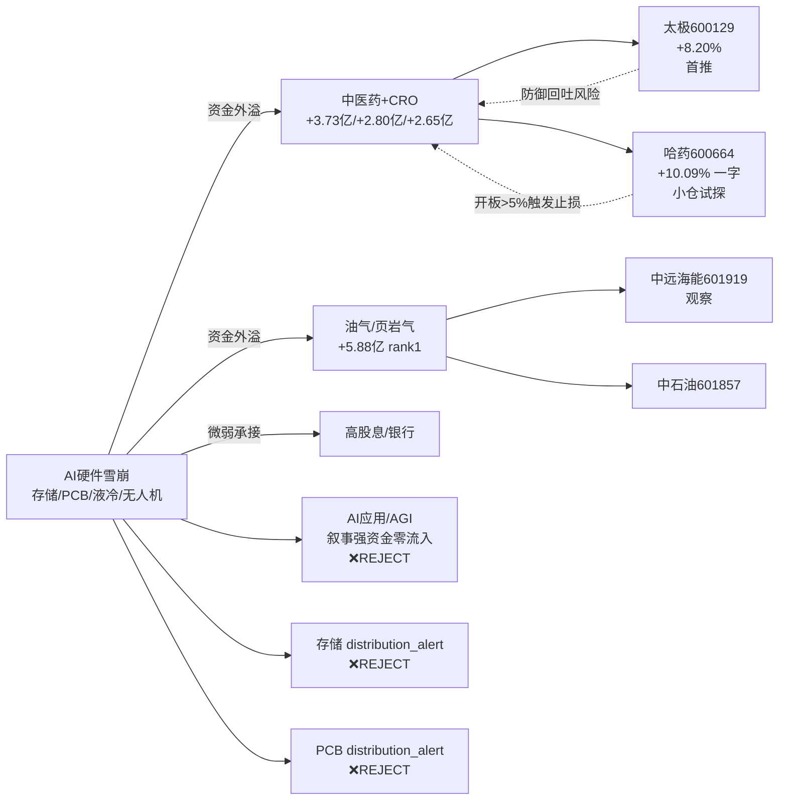
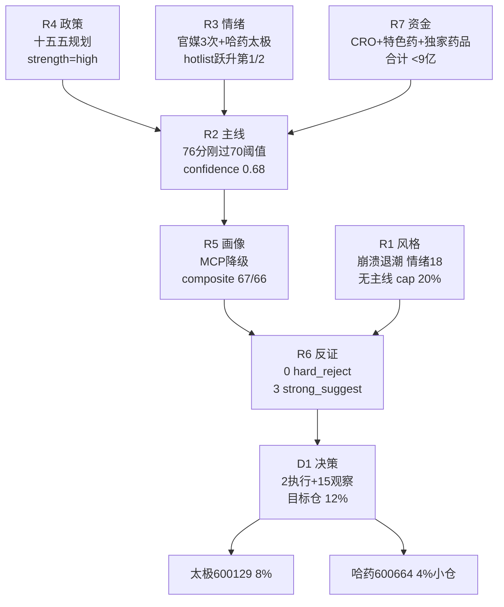

# 2026 年 7 月 14 日 · **主决策 / D1 盘前预案**

> **数据源新鲜度**: partial(R5 MCP 全域降级)
> **降级状态**: true(R2 degraded=true / R5 degraded=true)
> **置信度**: 0.68
> **执行模式**: dry_run · 需用户确认

---

## 🎯 一句话结论

**崩溃退潮 × 无主线 × 承接盘枯竭 — 防御择时,不做趋势。** 仓位上限 20%,目标 12%,现金 buffer 8%;仅中医药 1 条防御主线,首推 **太极集团(8%,低吸)** + 小仓试探 **哈药股份(4%,高开 >+2% 不追)**;其余 15 只全 watch,不主动加执行。

---

## 📊 市场态势(R1 崩溃退潮 · 情绪 18/100)

| 维度 | T-1 (20260713) 读数 | 判读 |
|---|---|---|
| 🔴 跌停家数 | **176 只**(含 10 只 -20% 跌停) | 系统性瓦解 |
| 🟢 涨停家数 | 32 只(含 3 ST/退市) | 涨:跌 = 1:5.5 |
| 🔥 连板天梯 | 最高 **4 板 1 只(ST龙元)** | 天梯断裂 |
| 📉 三大指数 | 上证 -2.06% / 创业板 -3.10% / 科创 -4.36% | 全线深跌 |
| 💧 成交额 | **2.83 万亿**(缩量 5760 亿) | 承接盘枯竭 |
| 📉 北证 50 | -6.78% | 小微流动性风险 |

**核心矛盾**:AI 硬件(存储 / PCB / 液冷 / 无人机)集体雪崩,防御资金外溢至中医药/油气/高股息 — 但 **R7 显示全市场主力正流入板块仅 6 个,金额均 <6 亿**,量级远弱于失血端(液冷 -231 亿 / PCB -229 亿 / 无人机 -109 亿)。

### 跷跷板结构

---

## 🧠 主线深挖:中医药/创新药(76 分,唯一防御主线)

### 大资金意图

**是防御补涨,不是主线级驱动**。R7 医药相关 3 个概念(CRO/特色药/独家药品)正流入合计 <9 亿,量级远低于 AI 硬件失血。这是崩溃退潮期防御资金的"临时避风港",不是趋势起点。

### 为什么走强

1. **政策发令枪**:国务院《国民健康十五五规划》全链条支持创新药 + CGT + 新型抗体 + 新型疫苗 + 核酸 + 放射性药物 + AI 赋能医药(R4 E20260714_004,strength=high 多源确认,官媒 3 次提及)
2. **跷跷板天然承接**:AI 硬件雪崩 → 防御资金必须找出口,老中药 OTC(稳定现金流 + 品牌壁垒)是首选
3. **热榜排名跃升硬指标**:哈药 T-2 #75→#16(rank_delta -59 全市场第一),太极 T-2 #71→#20(-51 板块第二)
4. **上一交易日涨停验证**:全市场 32 只涨停中医药占 7 只(22%),是唯一集中涨停方向

### 逻辑够不够硬 — 反证一览

| R6 反证 | 严重度 | D1 处理 |
|---|---|---|
| R6_M2_01 哈药一字追高风险(R1 崩溃 × 政策已发酵 3 天 × 一字涨停) | 🟠 strong_suggest | ✅ 采纳:太极为首推,哈药高开 >+2% 不追 |
| R6_M1_01 中医药性质为防御补涨非主线级(R7 资金量级弱 + R3 KOL 主推 AI 应用非中医药) | 🟠 strong_suggest | ✅ 采纳:总仓 ≤ R1 上限 60%(12%),T+1~T+3 不做趋势 |
| R6_M2_03 R1 无主线 vs R2 仍推 1 条 76 分 | 🟠 strong_suggest | ✅ 采纳:严格 20% 上限 + 8-10% 现金 buffer |
| R6_M6_01/02 哈药/太极模式六(霸榜出货) | 🟡 未触发 hard_reject | soft_note:11:35 P2 复核开板深度 + 主力净流 |
| R6_M3_01 估值分位 MCP 降级不精确 | 🟡 soft | max_position 从严处理 |
| R6_M7_01 基本面 12 红旗无法验证 | 🟡 soft | P2 复核减持/质押/审计意见 |

**结论**:R6 模式六 **hard_reject = 0**(中医药未命中 distribution_alert),D1 无硬否决义务,但 **3 条 strong_suggest 全部采纳**,防御择时不做趋势。

### 数据流验证

---

## 🎯 执行池(2 只 · 目标合计 12%)

### 1️⃣ 太极集团 600129.SH · role=leader · **max 8%** · 首推

**买入理由**
- R5 top_picks rank1 · composite=67 · 连续性形态明显优于哈药一字板
- R2 龙二:综合评分板块第 2 + 热榜跃升 T-2 #71→#20(rank_delta -51)
- +8.20% 非一字,盘中筹码交换充分 → 主力接力痕迹清晰
- 老中药 OTC 品牌 + 混改+品牌重塑长期逻辑
- R6 mode2 显式建议:太极优先于哈药作为首推
- 板块内共振:特色药 +2.80 亿 / 独家药品 +2.65 亿主力净流入

**风险点**
- R1 崩溃退潮系统性风险仍在,若今日跳空低开+跌停放大 → 情绪 <15,应立即降仓
- 十五五规划已发酵 3 天,继续走强需政策细则或新催化,存在利好出尽风险
- 跷跷板:若 AI 应用 / 交换网络反弹,防御资金立即回吐
- R6_M7_01 未验证:P2 需复核减持/质押/非标意见

**止损条件**
- 硬止损:买入均价 **-5%** 或跌破 MA10(任一)→ 全部清仓 · priority 1
- 板块降级:R7 中医药主力净流入转负 或 R3 出现哈药/太极 distribution_alert → 减仓 50% · priority 3
- 时间止损:T+3 若未破 +5%,主动清仓

**可验证假设**
- H1(**T+1**):若太极日内不破 MA5、板块内涨停家数 ≥ 3 → 假设成立,守住 8% 至 T+2
- H2(**T+0 上午**):开盘若高开 >+2% 立即弃单(参考 R6),仅接受 -3% ~ -1% 区间低吸
- H3(**P2 11:35**):中医药板块午盘主力净流入若延续正向 → 假设强化;若转负 → H1 失效,立即减半

**执行指令**
- entry: `trend_pullback_buy` · buy_zone=[-3%, -1%] · max_premium=+1% · 首笔 4% 试仓 · 不破 MA5 加至 8% 上限
- exit: 4 条(硬止损 + 破位 + 板块降级 + +10% 减半)
- take_profit=+10% · 持有周期 T+1~T+3 不做趋势

---

### 2️⃣ 哈药股份 600664.SH · role=leader · **max 4%(小仓试探)**

**买入理由**
- R2 龙一:排名跃升板块第 1(T-2 #75→#16, rank_delta -59 全市场居前)
- +10.09% 一字涨停 · 板块内涨停共振
- 主板 execution_eligible(600 打头,不受 300/688/920 阻断)
- R6 mode6 未触发 hard_reject(未命中 R3 distribution_alert)

**风险点**
- **⚠️ 一字涨停在崩溃退潮期高开跳空风险显著**(R6_M2_01 显式警告)
- R5 technical_readiness=65 · MCP 降级,一字量能无法验证
- 板块级主力量级弱(<6 亿),追涨若成交萎缩极易开板
- R6_M6_01 二次核对项:11:35 若开板深度 >5% + 主力净流转负 → 立即降级

**止损条件**
- 硬止损:买入均价 **-5%** → priority 1
- **开板即撤**:日内开板深度 >5% 且 R7 midday 主力净流转负 → 立即清仓 · priority 2
- 板块降级:R7 midday 中医药主力净流入转负 或 R3 P2 哈药 distribution_alert 命中 → 清仓 · priority 3
- 时间止损:take_profit +8% 立即清仓,不留隔夜

**可验证假设**
- H1(**T+0 竞价**):高开 ≤ +2% 且封板资金 ≥3 亿 → 允许 4% 试仓;高开 >+2% 或封单单薄 → 弃单
- H2(**T+0 午前**):若开板 → 立即撤;若继续封板到午盘 → P2 决定加不加
- H3(**P2 11:35**):R7 midday 中医药主力延续正向且哈药未开板 → 隔夜;否则清仓

**执行指令**
- entry: `trend_pullback_buy` · buy_zone=[-3%, +2%] · max_premium=+2% · position=4% 一次性建仓不加仓
- exit: 4 条(硬止损 + 开板止损 + 板块降级 + +8% 清仓)
- 持有周期 T+0 ~ T+1 快进快出

---

## 👀 观察池(15 只)

### 中医药同主线补位(6 只)

| ts_code | 名称 | 得分 | 理由 |
|---|---|---|---|
| 000963.SZ | 华东医药 | 62 | R4 双催化(政策+DR10624 临床批准),弹性未验证;若开盘放量突破可升 execution |
| 002446.SZ | 陇神戎发 | 51 | +20cm 补涨杂毛,小市值+高开低走风险,仅观察 |
| 301520.SZ | 万邦医药 | 53 | +20cm,301 前缀阻断 execution,仅对照 |
| 600276.SH | 恒瑞医药 | 60 | 创新药大票补涨候选,机构标配防御 |
| 600196.SH | 复星医药 | 58 | 创新药+CGT+新型疫苗全链条覆盖 |
| 000513.SZ | 丽珠集团 | 55 | 老中药+创新药双属性,主板可执行 |

### 油气/油运(3 只 · 地缘对冲)

| ts_code | 名称 | 得分 | 理由 |
|---|---|---|---|
| 601919.SH | 中远海能 | 62 | R2 secondary 首推 · R4 E20260714_001 高强度催化(美军连击伊朗+霍尔木兹油轮遇袭)· R7 页岩气 +5.88 亿 rank1 |
| 601857.SH | 中国石油 | 58 | 油气 beta + 高股息双属性 |
| 600028.SH | 中国石化 | 55 | 油气 beta + 高股息 |

### 军工电子(2 只 · 中报硬 alpha)

| ts_code | 名称 | 得分 | 理由 |
|---|---|---|---|
| 002389.SZ | 航天彩虹 | 58 | 中报预增 15418%~19503% 硬 alpha · 但 R7 无人机 -109 亿资金失血 |
| 002151.SZ | 北斗星通 | 55 | 中报预增 2368%~3426% · 北斗+地缘军工避险 |

### 高股息/金融(4 只 · 崩溃退潮防御)

| ts_code | 名称 | 得分 | 理由 |
|---|---|---|---|
| 601398.SH | 工商银行 | 55 | E20260714_007 沪市 2600 亿分红催化 |
| 601288.SH | 农业银行 | 52 | 高股息大票补位 |
| 601088.SH | 中国神华 | 55 | 煤炭高股息双属性 |
| 600030.SH | 中信证券 | 50 | 超跌反弹对冲票(若尾盘放量止跌) |

---

## ❌ 系统性剔除板块(4 类)

| 板块 | 剔除理由 |
|---|---|
| AI应用/AGI | R3 rank1 但 R7 资金零流入,叙事强资金背离,R2 评分 47<50 |
| 算力/CPU/超节点/交换机 | R7 液冷 -231 亿 / PCB -229 亿,AI 硬件产业链集体失血 |
| PCB/CCL/高频高速树脂 | R3 rank4 late + distribution_alert 红线(生益/金安国纪/中国巨石 三只 -10% 崩塌)+ R7 PCB -229 亿 |
| 存储/DRAM(长鑫链) | R3 rank5 red line distribution_alert(华天/兆易/香农芯创/风华高科)+ 颜晓滨定性"雪崩" |

---

## 📋 数据源审计

| 源 | 状态 | 抓取时间 | 记录数 | 备注 |
|---|---|---|---|---|
| 🟢 R1 风格 | ok | 2026-07-14 07:35 | 1 | confidence 0.80,量化五指标全同向 |
| 🟢 R2 主线 | ok(degraded) | 2026-07-14 07:50 | 1 | confidence 0.68,唯一主线 76 分刚过阈值 |
| 🟢 R3 情绪 | ok | 2026-07-14 07:45 | 1 | confidence 0.68 |
| 🟢 R4 消息 | ok | 2026-07-14 07:48 | 1 | confidence 0.72,政策 strength=high |
| 🔴 R5 画像 | ok(degraded) | 2026-07-14 07:55 | 5 | confidence 0.58,MCP 全域 DOWN,composite 上限 -10 |
| 🟢 R6 反证 | ok | 2026-07-14 07:56 | 8 反证 | confidence 0.72,hard_reject=0 |
| 🟢 R7 资金 | ok | 2026-07-14 07:30 | 1 | confidence 0.80 |
| 🟢 fetch_manifest | ok | 2026-07-14 07:15 | — | global_severity=0 |

**主源缺失**:无(fetch_global_severity=0),仅 R5 依赖的 MCP 通道 DOWN → degraded=true 但不阻断 D1 决策。

---

## ⚠️ 不确定性 / 反证

1. **R2 vs R1 一致性**(R6_M2_03):R1 判 main_lines_count=0 无主线,R2 仍推 1 条 76 分,分数刚过阈值 6 分。D1 已按严格 20% + 现金 buffer 处理,不放大主线权重。
2. **R5 MCP 降级**:六维中 chip_structure / technical / institutional 三维依赖 MCP,只能上游反推。哈药一字量能、太极筹码分布均无 hard 数据,依赖 R6 P2 二次核对。
3. **模式六 hard_reject 部分未确认**(R6_M6_01):中医药未命中 distribution_alert(条件 1 通过),但 R5 chip 5 日主力净流 unknown(条件 2 未确认)→ 按 skill 规则未 hard_reject,但降级 soft_suggest,P2 必须复核。
4. **基本面 12 红旗未验证**(R6_M7_01):MCP DOWN 无法逐条扫 F1~F12。P2 需人工复核减持/质押/审计意见公告。
5. **执行池仅 2 只**(< user_preferences.execution_pool_size_range[0]=5):主动收窄,不为凑数放宽标准。
6. **降级路径**:若 09:25 竞价情绪进一步恶化(跌停扩大 / 高开占比 <30%),P1 amendment 应将总仓收至 6% 或全 watch_pool_only。

---

## 🔄 与其他 R/D/E 的关系

**依赖**(上游 pull)
- `data/research/20260714/research_summary.json`(主入口)
- R1-R7 全部 artifact
- `data/user_preferences.yaml`(仓位铁律 · 龙头偏好)

**被消费**(下游)
- P1 auction_amendment_v1(09:25-09:29):必须复核哈药/太极竞价高开与全市场情绪
- P2 midday_amendment_v1(11:35-12:05):必须复核 R6_M6_01(哈药开板深度+主力净流)/ R6_M7_01(基本面公告)/ 中医药板块主力延续性 / AI 应用跷跷板反向
- execute(canghai-execute):按 schema_version=watchlist_plan_v1 + trade_date=20260714 消费

---

## 🤝 交接给 P1(竞价校准 09:25-09:29)

**必核对项**
1. 哈药 600664 竞价开盘价:若高开 >+2% → 移除 execution 或降为 watch_only
2. 太极 600129 竞价开盘价:若高开 >+2% → 改为盘中低吸,不做开盘挂单
3. 全市场竞价情绪:若跌停家数进一步扩大或高开占比 <30% → 总仓降至 6% 或全 watch_pool_only

**预期 amendment**:二选一(a)维持 12% 目标 (b)收缩至 6% / 全 watch

---

## 🤝 交接给 P2(午盘修订 11:35-12:05)

**必核对项**
1. R6_M6_01:哈药开板深度 + 主力净流(条件 2 unknown 需盘中验证)
2. R6_M7_01:哈药/太极最新披露(减持/质押/非标意见)
3. R7 midday:中医药板块主力净流入是否延续
4. AI 应用/交换网络板块是否午盘放量反弹 → 触发跷跷板反向

---

## 📎 Sub-Agent 元数据

- **skill**: main_decision_v1
- **artifact**: `data/plans/20260714/watchlist_plan.json`
- **schema_version**: watchlist_plan_v1
- **pydantic validate**: ✅ OK(execution=2 / watch=15 / rejected=4)
- **mode**: dry_run · autonomous_trading_enabled=false · requires_user_confirmation=true
- **position_cap**: 0.20(R1)· target_position: 0.12(R6_M1_01 60% 折扣)· cash_buffer: 0.08
- **generated_at**: 2026-07-14T08:00:00+08:00
- **model**: ark-code-latest(fresh context)

---

> **红线守护**:本 md 恒 dry_run 状态,用户 review 满意后手动切 live · D1 不得自主 flip mode
