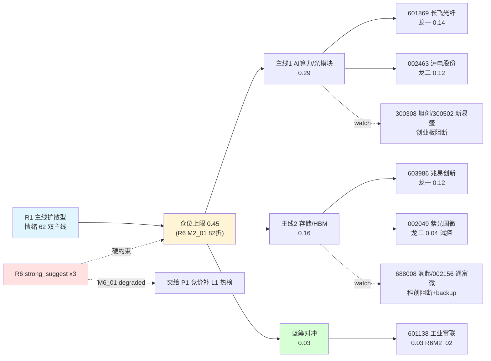

# 2026年7月15日 · **主决策 / D1 盘前预案**

> 📡 **数据源新鲜度**: partial(R5/R6 二级 MCP 降级,主源全 ok)
> 🟡 **降级状态**: true(R6 mode6 霸榜出货硬否决数据缺失 · R5 图形/大宗降级)
> 🎯 **置信度**: 0.75

## 一句话结论

**主线扩散型 · 双主线 AI算力+存储 · 仓位上限 45%(R1 建议 0.55 打 82 折)· execution 5 只主板双龙 + 蓝筹对冲 · R6 三条 strong_suggest 全部显式采纳。**

## 详细分析

### 大盘背景 · 为什么今天要保守
昨日大盘 V 反(上证 +1.36% / 深成 +2.77% / 创业板 +3.43%)属于**指数级放量普涨**,涨停 81 家看似强势,但**连板梯队断裂**:可参与最高仅 3 板(哈药股份 1 只),2 板 5 只,最高 5 板为不可交易的 ST 龙元。R1 定性"V 反首日情绪虚高",给出 0.55 仓位建议但同时挂上"若盘中分歧转弱迅速降级至 30%"的保护性条款。

我们**主动打 82 折将目标仓降至 0.45**,原因有二:
- R6 M2_01 显式建议"initial position <=45%,预留 10% 保护性 buffer"
- R6 M2_02 提示**霍尔木兹地缘冲突 + 美联储 7 月加息概率 34.2%(CME)**,双负面事件短期压制 A 股风险偏好,R7 板块资金前十已经出现"富时罗素/大盘股/HS300/机构重仓/周期股" 蓝筹+周期占主导的**防御风格切换苗头**

### 主线 1:AI算力/光模块(执行池 29% 仓位)
- **R3 rank1 主题**:WeFlow AI 语义 depth=845/breadth=125 全场第一,L2+L3 强共振
- **R4 硬 alpha 集中**:E002 长飞光纤中报预增 **1349-1784%**、E003 算力硬件进出口 +56.6% + 赛意信息 50.79 亿服务器合同 + 行云科技租金上调 28.79 亿(+79%)
- **R7 板块资金正共振**:5G 概念 +198.89 亿(rank3)+ 通信技术 +192.25 亿(rank7)+ PCB +161.74 亿
- **海外映射**:Tower Semi 盘前 +18.7%(硅光扩产)+ SK 海力士 ADR +17%
- **券商三连推**:07-14/07-15 广发/天风/开源 all-in 通信大反攻

**问题**:光模块核心龙头 **中际旭创(300308)/新易盛(300502)/天孚通信** 全部**创业板 300 前缀阻断**,主板可执行只剩 **长飞光纤(601869)/沪电股份(002463)** 两只,深度浅。

### 主线 2:存储/HBM/DRAM(执行池 16% 仓位)
- **R3 rank2 主题 early 阶段**,海力士 ADR +17% A 股尚未反应
- **R4 双硬催化**:E001 长鑫科技 IPO 定价 8.66 元/579 亿战配豪华、E004 存储超级周期(三星 DRAM +20%,兆易创新中报预增 +1100%)
- **叙事够长**:R3 KOL 风中追风定性"存储供需缺口至 2029 上半年,两年以上"
- **但 R6 M1_01 strong_suggest 反证**:R7 先进封装板块主力净流出 -31.86 亿(rank5 尾部)+ 华天科技 lhb_bull_trap 机构专用净卖 -26.9 亿,存储生态**资金面未共振**、机构撤离信号已出现

主板可执行只有 **兆易创新(603986)/紫光国微(002049)**,澜起科技(688008)科创板阻断。

### 蓝筹对冲(执行池 3% 仓位)
R6 M2_02 显式建议保留 1 只主板蓝筹对冲科技成长集中度。选 **工业富联(601138)** — AI 服务器龙头,大市值稳态 PEG 0.6-0.8,郭台铭系+外资长线重仓,抗地缘属性。

## 关键证据

- **证据 1**:R1 明确"V 反首日情绪虚高、连板梯队断裂、最高可参与仅 3 板",风险 4 项均指向情绪级脆弱。来源 `R1_style.json`
- **证据 2**:R2 filter_leader_v1 严格执行 leader_preference,300/688/920 前缀强约束下 execution 主板只剩 4 只(长飞/沪电/兆易/紫光国微)。来源 `R2_main_sectors.json` notes
- **证据 3**:R5 长飞 composite_adj=83、沪电 78、兆易 78、紫光国微 69,工业富联 88(backup)。来源 `R5_stock_profiles.json`
- **证据 4**:R6 hard_reject 0 / strong_suggest 3 / soft_suggest 4,mode6 因 R3 hotlist degraded 无法触发硬否决。来源 `R6_devil_advocate.json`
- **证据 5**:R7 北向 5 日净流入稳定 33.7-44.9 亿区间(20260714 41.59 亿),5G/通信技术/PCB 主力资金正流入 rank3/7/10。来源 `R7_capital_flow.json`

## 板块-选股-仓位映射

## 执行池详解(5 只 · 每票思维链)

### 1. 601869.SH 长飞光纤(龙一 · 0.14)

- **大资金意图**:R7 5G/通信技术双板块正共振共 391 亿净流入,加上 07-14/07-15 广发/天风/开源三家券商电话会 all-in 通信大反攻,机构定价意图明确 — 借主板承接光模块海外映射(Tower +18.7%)完成筹码切换到主板。
- **为什么走强**:中报预增 1349-1784% 硬 alpha 锁死 + 全球硅光扩产直接对标其海外多模份额 + 主板可执行深水稀缺(旭创/新易盛均创业板不可 execution)。
- **逻辑够不够硬**:硬 alpha(中报)+ 全球产业景气(硅光/AI 光模块)+ 券商一致度极高。middle 阶段但券商三连推情绪透支风险存在。

**买入理由**:R2 主线1 龙一 + R5 composite_adj=83 全 execution 池 #1 + 主板承接不可替代。
**风险点**:券商三连推情绪透支高开低走 / 主板深度有限 / 光模块前期已调 40% middle 阶段追高。
**止损条件**:硬止损 -5% · 收盘破 MA10 · 板块资金转负减半 · +15% 减半 +25% 清仓。
**可验证假设**:若旭创/新易盛竞价冲高 >7% 而长飞 <3%,则**"主板承接假设弱化"**(R6 M1_02),开仓量减半。

### 2. 002463.SZ 沪电股份(龙二 · 0.12)

- **大资金意图**:AI PCB 是英伟达/AMD 高多层 HDI 核心供应商,广发/中信/华福密集覆盖 AI PCB 组合首推,一致预期上调。R7 PCB 板块净流入 161.74 亿证明主力资金已认可 PCB 是 AI 算力链条第二支主板承接队。
- **为什么走强**:R4 E002 PCB 龙头批量中报超预期 + AI PCB 高成长(2026 一致预期 +80-100%)+ PEG 0.6-0.8 相对生益/鹏鼎估值中枢偏低。
- **逻辑够不够硬**:与长飞同板块协同、AI PCB 硬需求已验证,**但 R6 M3_02 提醒板块集中度已达 40% 边缘 + 前高附近获利了结压力 + R5 chart_degraded 未验证突破**。

**买入理由**:R2 主线1 龙二 + R5 78 分 + AI PCB 主板唯一深水标的。
**风险点**:与长飞同板块集中度已达 40% 上限 / 前高附近筹码消化 / 形态 degraded 未验证。
**止损条件**:硬止损 -5% · 收盘破 MA10 · 板块资金转负或旭创/新易盛盘中破位减半 · +15% 减半。
**可验证假设**:R6 M3_02 采纳 — **单票上限从 15% 收至 12%**,若竞价冲高 >5% 直接放弃开盘改盘中回踩 3.5MA 择低进入。

### 3. 603986.SH 兆易创新(存储龙一 · 0.12)

- **大资金意图**:R4 E001 长鑫科技 IPO 战配 579 亿(中微/澜起/拓荆/沪硅/小米/阿里云)+ E004 存储超级周期(三星 +20%/海力士 ADR 溢价 51%),叙事跨度 2-3 年,机构长期配置属性。但 R6 M1_01 反证:R7 先进封装 -31.86 亿 + 华天科技 lhb_bull_trap 机构撤离,存储生态短期资金面**未共振**。
- **为什么走强**:中报预增 +1100% 硬 alpha + 存储主控/DRAM 主板唯一核心票。
- **逻辑够不够硬**:中长期 hard 但短期 R7 反向、R3 hotlist L1 缺、7/16 长鑫申购日抽血近在眼前。R6 M3_01 soft_suggest 提示 PE 2026E ~35-40x 偏贵。

**买入理由**:R2 主线2 龙一 + 长期硬 alpha + 主板唯一核心票。
**风险点**:长鑫 7/16 申购抽血 / R7 存储生态资金面未共振 / 近两日已回调 middle 阶段追高。
**止损条件**:硬止损 -5% · **-3.5% 软预警减半(R6 M3_01)** · 板块资金未转正或华天/紫光国微扩散破位减半 · 7/16 长鑫申购日前浮盈 >15% 清仓不隔夜。
**可验证假设**:先观察 09:25 竞价 5 分钟,竞价 <=+3% 且存储板块整体高开 >+1% 才开盘首笔 6%;若存储板块整体低开则改分时观察。

### 4. 002049.SZ 紫光国微(存储龙二 · 0.04 试探)

- **大资金意图**:R3 rank1(AI)+ rank2(存储)双主题交叉,机构 + 社保长期持仓,但短期缺乏硬催化剂,与兆易同板块作为分散仓。
- **为什么走强**:特种集成电路 + 存储接口 IP 主板龙头,长鑫战配生态受益,PEG ~0.8-1.0 相对纯芯片股安全边际稍强。
- **逻辑够不够硬**:板块共振稍弱,ROE 稳定 15%+ 但弹性弱于纯存储。R6 M1_01 存储主线整体下调至 12-15%,兆易已占 12% → 紫光国微收窄至 4% 试探仓。

**买入理由**:R2 主线2 龙二 + 存储生态主板补位。
**风险点**:特种业务国防订单节奏影响弹性 / 长鑫抽血同步分流。
**止损条件**:硬止损 -5% · 收盘破 MA10 全清 · 兆易破位或存储板块整体降级同步撤 · +12% 清仓。
**可验证假设**:试探仓一次到位不加仓,竞价 >+5% 放弃。

### 5. 601138.SH 工业富联(蓝筹对冲 · 0.03)

- **大资金意图**:郭台铭系 + 外资 + 大公募长线重仓,大市值稳态,R6 M2_02 显式建议作为**科技成长集中度对冲仓**,应对霍尔木兹地缘 + 美联储加息压制风险偏好。
- **为什么走强**:AI 服务器龙头 GB200/GB300 主力代工,R4 E003 算力硬件进出口 +56.6% + 赛意信息 50.79 亿服务器合同直接印证下游景气。
- **逻辑够不够硬**:R5 composite_adj=88 backup_eligible 一致 buy,PEG 0.6-0.8 估值安全边际。**但大市值弹性弱,GB300 出货节奏敏感**。

**买入理由**:R6 M2_02 显式蓝筹对冲 + R5 88 分 backup + R4 E003 服务器合同验证。
**风险点**:大市值弹性弱 / 已在近月新高附近 / 与光模块+PCB 同 AI 板块相关性高。
**止损条件**:硬止损 -5% · 收盘破 MA20(大市值参照)· AI 主线整体破位同步撤 · +12% 减半。
**可验证假设**:一次到位仓 3%,竞价 <=+3% 首笔;若地缘紧张升级(WTI +5%)可考虑加码。

## 观察池(17 只 · 覆盖主线备胎 + 板块联动)

| ts_code | 名称 | 主题 | 状态 |
|---|---|---|---|
| 300308.SZ | 中际旭创 | 光模块全球龙一 | 创业板阻断 · P1 竞价参照 |
| 300502.SZ | 新易盛 | 光模块龙二 | 创业板阻断 · P1 竞价参照 |
| 688008.SH | 澜起科技 | 存储接口芯片龙头 | 科创板阻断 |
| 002156.SZ | 通富微电 | 存储先进封装 backup | R5 80 兆易替补 |
| 002185.SZ | 华天科技 | 存储封测 | **R6 lhb_bull_trap 反向警戒** |
| 300706.SZ | 光智科技 | 磷化铟 InP | R3 rank3 · 创业板阻断 |
| 600584.SH | 长电科技 | 存储先进封装主板 backup | — |
| 600745.SH | 闻泰科技 | 半导体功率+存储外围 | — |
| 002371.SZ | 北方华创 | 半导体设备(存储扩产端) | — |
| 603501.SH | 韦尔股份 | 半导体设计 CIS+DRAM | — |
| 002230.SZ | 科大讯飞 | AI 应用算力下游 | — |
| 600588.SH | 用友网络 | AI 云 SaaS | — |
| 002008.SZ | 大族激光 | PCB 上游激光设备 | 分散板块集中度 |
| 002444.SZ | 巨星科技 | 机器人工业自动化 | secondary_line |
| 002747.SZ | 埃斯顿 | 机器人硬 alpha 中报 2144-2593% | R7 资金失血未升 |
| 601919.SH | 中远海能 | 油运地缘对冲 | R6 M2_02 关联 |
| 601136.SH | 首创证券 | 券商情绪对冲 | 备用观察 |

## R6 反证采纳明细

| reject_id | 模式 | 严重程度 | D1 处置 |
|---|---|---|---|
| R6_M1_01 | 存储主线资金面未共振 | strong_suggest | ✅ 采纳:存储主线整体 16%(兆易12+紫光4),兆易先观察竞价5分钟 |
| R6_M2_01 | 全池仓位初始 <=45% | strong_suggest | ✅ 采纳:目标仓 45%(而非 R1 建议 0.55 打满),预留 10% 现金 buffer |
| R6_M2_02 | 蓝筹对冲科技集中度 | strong_suggest | ✅ 采纳:工业富联 3% 蓝筹对冲 + watch 保留中远海能地缘对冲候补 |
| R6_M1_02 | 长飞/沪电竞价确认 | soft_suggest | ✅ 内联:竞价 >+5% 放弃开盘改分时回踩 |
| R6_M3_01 | 兆易单票 12% + -3.5% | soft_suggest | ✅ 内联:单票 12% 上限、-3.5% 软预警减半、-5% 铁律清仓 |
| R6_M3_02 | 沪电单票 12% + 3.5MA | soft_suggest | ✅ 内联:单票 12% 上限、竞价 >+5% 改盘中 3.5MA 择低 |
| R6_M6_01 | mode6 霸榜出货数据缺失 | soft_suggest(降级) | ⚠️ **交 P1 竞价补 L1 热榜交叉,若命中即升 hard_reject 从 execution 移除** |

**hard_rejects_applied**: 无(R6 mode6 因 R3 hotlist degraded 无法触发,已交 P1 补验证)
**strong_suggests_overridden**: 无

## 数据源审计

| 源 | 状态 | 抓取时间 | 记录数 | 备注 |
|---|---|---|---|---|
| research_summary | 🟢 ok | 07:57 | 7 artifacts | orchestrator complete |
| R1_style | 🟢 ok | 07:35 | 1 | 主线扩散型 conf 0.72 |
| R2_main_sectors | 🟢 ok | 07:48 | 2 main + 3 sec | filter_leader_v1 applied |
| R3_sentiment | 🟢 ok | — | — | conf 0.72;hotlist L1 degraded |
| R4_news | 🟢 ok | — | — | conf 0.72 |
| R5_stock_profiles | 🟡 degraded | 07:52 | 10 | chart/vibe-trading MCP 未启用 |
| R6_devil_advocate | 🟡 degraded | 07:55 | 7 args | mode6 数据源缺失/mode4-5 无库 |
| R7_capital_flow | 🟢 ok | 07:33 | premarket_full | 北向 5 日稳定 |
| user_preferences | 🟢 ok | 2026-07-04 | v1 | leader_preference/hard_rules 加载 |
| fetch_manifest | 🟢 ok | — | severity=0 | 全 MCP 存活 |

## 不确定性 / 反证

1. **R6 mode6 霸榜出货硬否决无法验证** — R3 hotlist_signals 本轮未采集 Tushare ths_hot/dc_hot + XTick moneyflow,distribution_alert=[] 为**数据源缺失**而非"无信号"。P1 竞价必须补 L1 热榜交叉,否则 execution 4 只主板龙头可能在 09:30 后暴露霸榜出货风险。
2. **主板可执行深度浅** — 光模块核心龙头(旭创/新易盛/天孚)+ 存储核心龙头(澜起/中芯)全部 300/688 阻断,主板承接 4 只(长飞/沪电/兆易/紫光国微)相对创业板龙头流动性低 30-50%,单票下单须分批。
3. **V 反首日情绪虚高风险** — R1 已明确"若盘中分歧转弱迅速降级至 30%",R6 M2_01 已折算为 45% 目标 + 10% buffer,但若 10:00 两市成交额同比 -20% 或炸板率 >30%,须触发降级至 30%(P2 兜底)。
4. **长鑫申购抽血 7/16** — 兆易/紫光国微不留隔夜大仓,浮盈 >15% 清仓机制已内联。
5. **地缘 + 宏观压制风险偏好** — 霍尔木兹交火 + 美联储加息 34.2%(CME),R7 资金已见蓝筹周期切换苗头,工业富联 3% 蓝筹对冲 + 中远海能 watch 已经作应对。

## 与其他 R/D/E 的关系

- **上游依赖**:R1(风格/仓位上限)、R2(主线+龙头筛选)、R5(六维画像+alpha_grade)、R6(反证采纳)、R7(板块资金)、user_preferences.yaml(铁律)
- **下游消费**:
  - P1 auction_amendment_v1(09:25-09:29 竞价校准 · 补 L1 热榜 + 长飞沪电兆易竞价确认)
  - P2 midday_amendment_v1(11:35-12:05 午盘修订 · 6 项 verify_at_1135)
  - canghai-execute(消费 watchlist_plan.json + 两份 amendment)

## Sub-Agent 元数据

- **skill**: main_decision_v1
- **artifact**: `data/plans/20260715/watchlist_plan.json`(31 KB,pydantic v1 通过)
- **落盘**: 2026-07-15 08:05:00 +08:00
- **model**: fresh context LLM(main path)
- **mode**: dry_run · autonomous_trading_enabled=false · requires_user_confirmation=true
- **execution_pool_size**: 5(下限 5 达标)
- **watch_pool_size**: 17(15-25 达标)
- **仓位分配**:长飞14% + 沪电12% + 兆易12% + 紫光4% + 工业富联3% = **45.0%** buffer 10%
- **执行深度提示**:主板承接票流动性较创业板龙头低 30-50%,单票下单分批;P1/P2 必须严格执行 handoff 校验项
