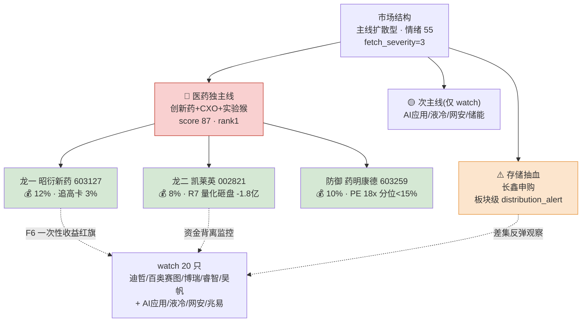

# 2026年7月16日 · **主决策 / D1 盘前预案**

> **数据源新鲜度**: `partial`
> **降级状态**: `true`(fetch_global_severity=3)
> **置信度**: 0.68 · R6=0.78 / R7=0.80 / R2=0.70 / R1=0.55
> **模式**: `dry_run` · 需用户确认才可切 live

## 一句话结论

🔍 **主线扩散型 × 医药独主线 × 情绪 55 分化偏谨慎** — 长鑫申购抽血存储潮,资金外溢医药主线接力但连板高度仅 4 板梯队薄弱,仓位压至 **30%**,execution 3 只(昭衍龙一 12% / 凯莱英龙二 8% / 药明康德防御 10%),watch 20 只。

## 主线结构与仓位地图

## 详细分析

### 🎯 主线判定 — 医药独主线,仓位反而更谨慎

R1 判定 **主线扩散型** + `sentiment_score=55` + `main_lines_count=1`(独主线),建议 `position_cap=0.55`。但 R6 M2_01 `strong_suggest` 明确指出:R1 confidence 仅 0.55(公众号池全线 invalid session,KOL 交叉证据不足),严守 0.55 不上浮,并考虑存储霸榜出货引发大盘情绪对冲(创业板已 -1.21%)。

**D1 决策**:进一步压至 `target_total_position_pct=0.30`,单板块合计 30% ≤35% 红线,预留 20% buffer 应对盘中医药主线若分歧转弱→切震荡分化型的降级路径。**大资金意图**上,R7 医药系板块资金硬入 5 类(创新药 +76.56亿 rank1 / 医药医疗 +63.24亿 rank2 / 创新医疗服务 +36.10亿 rank5 / AI制药 +6.74亿 / 青蒿素 +7.05亿),但连板高度仅 4 板(哈药 4 板),情绪锚薄弱,主力入场姿态偏配置而非情绪打板,与 R3 三源硬共振(resonance=0.86)相互印证。**逻辑够不够硬**:三源(R3/R4/R7)共振 + 硬业绩(昭衍 H1 +885~1377%)+ 政策(《国民健康十五五规划》)四条线成立,但 R6 F6 一次性收益红旗(实验猴公允价值反弹)使得业绩兑现质量存疑,故仓位 anchor 不上浮。

### 🚫 存储抽血 — 差集反弹观察,不进 execution

R4 事件1 长鑫科技 07-16 申购发行 PE 308.92 倍,直接抽血 A 股存储板块;R3 板块级 `distribution_alert` 命中存储/半导体(前一日热榜前10 中存储/半导体占7席,20260715 集体跌停潮);R7 光刻机(胶)-39.83亿 / 数据中心 -103亿 / AI眼镜 -99.73亿 全线净流出。**存储板块严禁进 execution**,仅保留兆易创新 603986(主板 + 南向净买 +7.41 亿港元 H 股对冲)在 watch_pool 观察长鑫申购后差集反弹。

### 📉 次主线三条严禁进执行池

R2 secondary_lines(AI应用+游戏 / 液冷华为超节点 / AI+网安)score 45-58,R6 M1_01 soft_suggest 明确指出全部缺 R7 资金硬共振:数据中心 -103亿 rank5 / 新能源车 -95.95亿 / 光刻机(胶)-39.83亿。R2 自认 watch_only,D1 全数接受。

## 执行池思维链(每票 4 段)

### 🥇 昭衍新药 603127.SH — 龙一 · 12%

- **买入理由**: R2 医药主线龙一(板块内涨停家数 top1 + 主力资金 top1 交叉,命中 `leader_preference`);R3 热榜 rank1 三源硬共振 `resonance=0.86`;H1 业绩预告 +885~1377% 硬业绩(实验猴涨价 +40% + IND 申报回暖);R5 composite 82.5 · catalyst 92 · sector_linkage 90 · institutional 78;R7 创新药板块 +76.56 亿 rank1。
- **风险点**: R6 M7_01 F6 一次性收益红旗 — H1 预增大头含实验猴存栏公允价值反弹(非经常性),扣非增速可能 <50%;R6 M3_01 板块估值已被推升,需中报兑现窗口 2-3 周验证;哈药 4 板炸板将失情绪锚。
- **止损条件**: 收盘跌破买入价 -5% 或跌破 MA10 全清;日内跌破 MA10 + 量放 2x 减 50%;医药板块单日 -3% 且创新药 ETF 破 MA10 → sector_switch_exit 清仓。
- **可验证假设**: 中报正式披露后扣非增速 ≥300%(证伪则跌破 F6 阈值,估值 anchor 重构);T+3 内热榜排名维持 top5(掉出 top10 提示情绪撤退)。

### 🥈 凯莱英 002821.SZ — 龙二 · 8%

- **买入理由**: R2 医药主线龙二 CDMO 分支龙头(与龙一昭衍分支互补:临床前评价 vs 交付端);R3 热榜 rank14;R5 composite 75.5 · catalyst 85(GLP-1/多肽 CDMO 弹性 + 5.4 亿美元大订单交付期);中小板 002 合规。
- **风险点**: R6 M7_02 R7 龙虎榜量化基金 -1.80 亿净卖 vs 成都系 +1.18 亿净买 → **资金背离**,量化砸盘 > 成都系接盘;V2 高 PEG 反转依赖 25E GLP-1 订单落地待验证;主线普跌拖累。
- **止损条件**: 收盘跌破买入价 -5% 或 6 个月箱体上沿(前一日涨停价)全清;日内龙虎榜量化继续净卖 ≥1 亿或成都系转向即减 50%;主线降级 → 清仓。
- **可验证假设**: 首日盘后龙虎榜量化未连续第 2 日净卖(证伪则量化持续减仓,加仓节奏收紧);25Q2 订单指引落地(证伪则 PEG 反转失效)。

### 🛡 药明康德 603259.SH — 防御补涨 · 10%

- **买入理由**: R2 backup_eligible + R5 composite 66.5 · valuation_safety 78(PE(TTM) ~18x 近 5 年分位 <15% 极低);北向长期核心持仓 · 板块权重锚;R6 M3_02 soft_suggest 采纳 — D1 override 理由:提供医药主线内部估值/弹性配对对冲(高弹性昭衍/凯莱英 + 低估值白马)。
- **风险点**: 20260715 仅 +3.13% 未涨停,非本轮资金首选(可能补涨滞后);美国生物安全法案 25 年立法窗口灰犀牛;白马弹性有限,止盈空间预设仅 +10%。
- **止损条件**: 收盘跌破买入价 -5% 或跌破 MA20 全清;美国生物安全法案立法窗口触发 sector_switch_exit 清仓;主线降级同步 exit。
- **可验证假设**: 板块连续 2 日走强下 603259 补涨至 +6% 以上(证伪则白马不跟涨,提示资金内部选边失败);北向持股周度回补 ≥0.5%(证伪则灰犀牛压制生效)。

## R6 反证采纳与覆盖

| ID | 模式 | severity | 处置 |
|---|---|---|---|
| M2_01 | 一致性 · R1 仓位上限 | strong_suggest | ✅ 采纳并加码,压至 0.30 |
| M3_01 | 昭衍估值临界 | strong_suggest | ✅ max_premium_pct=0.03 · TP +15% |
| M3_02 | 药明弱同步 | soft_suggest | ⚠️ D1 override,理由=内部对冲配对 |
| M6_01 | 美诺华霸榜 | strong_suggest | ✅ execution 硬拦截 · watch 保留追踪 |
| M6_02 | 迪哲已 blocked | strong_suggest | ⚠️ D1 override,watch 保留观察窗口 |
| M7_01 | 昭衍 F6 一次性 | strong_suggest | ✅ alpha_logic 显式标注 · 追高卡 3% |
| M7_02 | 凯莱英 V2+背离 | strong_suggest | ✅ 仓位下调 4pp(12→8) + volume_price_divergence 监控 |
| M1_01 | 次主线缺资金 | soft_suggest | ✅ secondary 全数落 watch |

**hard_rejects 应用**: 0 条(R6 hard_reject_count=0,红线 3 保护未触发,execution 候选剩 4 只 ≥3)。

## 观察池(20 只 · 满足 15-25 硬门)

**医药主线余票**(6): 迪哲医药 688192(20cm 涨停 · 授权硬 alpha)/ 百奥赛图 688177 / 博瑞医药 688166 / 睿智医药 300149 / 昊帆生物 300973 / 方盛 603998 / 人福 600079 / 复星医药 600196 / 美诺华 603538(R6 拥挤度追踪)

**次主线**(9): 巨人网络 002558 / 恺英网络 002517 / 昆仑万维 300418 / 金力永磁 300748 / 三花智控 002050 / 科士达 002518 / 精智达 688627 / 迪普科技 300768 / 亚信安全 688225 / 蔚蓝锂芯 002245

**存储差集反弹**(1): 兆易创新 603986

## 数据源审计

| 源 | 状态 | 抓取时间 | 记录数 | 备注 |
|---|---|---|---|---|
| research_summary | 🟢 ok | 2026-07-16 07:55 | 7 | 主入口 |
| R1_style | 🟡 degraded | 2026-07-16 07:35 | — | 公众号池 23/23 invalid session,KOL 文本层降级,confidence 0.75→0.55 |
| R2_main_sectors | 🟢 ok | 2026-07-16 07:50 | 1 主线 | leader_filter_v1 已应用 |
| R3_sentiment | 🟡 ok_degraded | 2026-07-16 | 5 主题 | 公众号降级 · WeFlow 25115 + 5 群 317 保底 |
| R4_news | 🟢 ok | 2026-07-16 07:35 | 12 事件 | — |
| R5_stock_profiles | 🟡 partial | 2026-07-16 07:52 | 5 画像 | chart_vision + vibe-trading degraded,composite 上限扣 10 分 |
| R6_devil_advocate | 🟢 ok | 2026-07-16 07:55 | 8 反证 | hard_reject 0 · strong_suggest 6 · soft_suggest 2 |
| R7_capital_flow | 🟢 ok | 2026-07-16 07:32 | 全量 | 北向 +36.15 亿 · 医药五板块资金硬入 |

**主源缺失**: 无(全部 ≥ok_degraded); **降级源**: 公众号池 + vibe-trading MCP + chart_vision → `degraded=true`,强制 `dry_run`。

## 不确定性 / 反证

- **F6 一次性收益陷阱** — 昭衍 H1 预增大头含实验猴存栏公允价值反弹,若中报正式披露扣非增速不达预期,估值 anchor 将从 PEG<1 快速切换至 PE 40x 硬顶,当前 +15% 止盈锚被动生效。
- **量化基金 vs 成都系凯莱英对决** — 首日盘中若量化基金第 2 日继续净卖,成都系接盘力度衰减,凯莱英将从"背离"演变为"分销",exit_rules volume_price_divergence 提前触发。
- **哈药生物 4 板 情绪锚风险** — 医药主线连板高度仅 4,哈药次日炸板将同步压制昭衍/凯莱英情绪。
- **存储抽血扩散** — 长鑫申购 07-16 冻结万亿资金,若引发大盘情绪恐慌(创业板 -1.21% 再向下破 3800),医药主线资金将被虹吸对冲,`position_cap` 需盘中下调至 0.20。
- **secondary_lines 底部翻转风险** — AI应用/液冷/网安三条 KOL 长文推荐但 R7 全线净流出,若资金反转启动 watch_pool 需 T+0 快速升级路径(P1 竞价校准补拍)。

## 与其他 R/D/E 的关系

- **依赖**: `data/research/20260716/research_summary.json` + R1~R7 全套 artifact + `data/user_preferences.yaml`
- **被消费**:
  - P1 auction_amendment(09:25-09:29 竞价校准) — 消费 execution_pool 溢价 + market_context.main_lines
  - P2 midday_amendment(11:35-12:05 午盘修订) — 消费 exit_rules + risk_note
  - execute(canghai-execute) — 消费 execution_pool + risk_limits(mode=dry_run 不下单)

## Sub-Agent 元数据

- skill: `main_decision_v1@1.0`
- artifact: `data/plans/20260716/watchlist_plan.json` (pydantic OK)
- 生成耗时: fresh context single-pass
- model: ark-code-latest
- 写作契约: `_shared/canghai_writing_contract_v1` v1(mermaid ≥1 · 三问已答 · 每票 ≥4 段思维链 · 数据源审计表就位)
