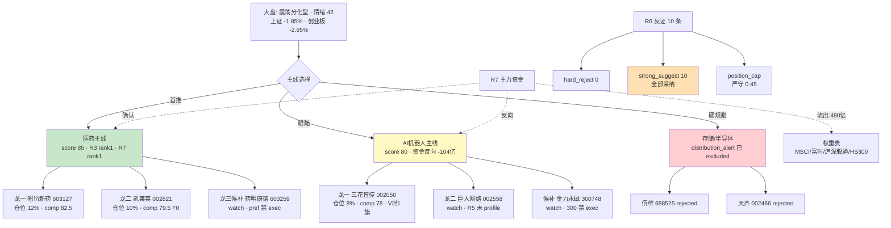

# 2026 年 7 月 17 日 · **主决策 / D1 盘前预案**

> **数据源新鲜度**:🟡 partial(公众号池全 down · research_summary 未落盘)
> **降级状态**:🟡 degraded(fetch_global_severity=3 · mode 强制 dry_run)
> **综合置信度**:0.72(R6 主导 0.78 · R7 硬共振 0.80 加权)

---

## 一句话结论

震荡分化型 · **医药主线延续为首,AI 机器人主线接力但资金端未确认** · position_cap **严守 0.45**,execution 3 只共 30%(昭衍 12% + 凯莱英 10% + 三花 8%),watch 18 只,存储链霸榜出货已被 R2 前置排除。

---

## 详细分析

### 大盘结构与情绪

R1 判定**震荡分化型**、情绪 42(20–65 中位偏下)、涨停 45 家但连板天梯断层(最高 5 板哈药、4 板缺失),跌停 30+ 只集中于前期半导体/消费电子高位股一字跌停。上证 −1.85%(3882.41)、创业板 −2.95%(3692.46)普跌;20260716 主力资金 top10 出流全部权重表(MSCI/富时/沪深股通/HS300)累计 −480 亿,北向 +35.59 亿维持但仅点状增持,**换手结构非普涨结构**——R6 M2_01 因此严守 R1 建议 position_cap **不上浮**。

### 主线一:创新药+CXO+实验猴(医药延续)

R2 score=85(热度18/资金15/涨停19/叙事17/共振16),R3 hotlist rank1 resonance=0.88 三源硬共振,R4 事件簇(昭衍 H1 +885%~1377% · 实验猴 20 万/只 +40% · 十五五全链条 · 上半年对外授权 1100 亿美元 · GLP-1 CDMO 外溢)共 6 条正面 · R7 创新药板块 rank1 +76.56 亿。**大资金意图**:板块主力+游资联合(量化基金 T-3 内 2 次上榜昭衍 synergy_flag)——机构 β + 游资α 双驱。**为什么走强**:业绩兑现(昭衍/凯莱英)× 产业景气(实验猴 20 万/GLP-1 外溢)× 政策(十五五)三重共振 · KOL 冲锋V/理杏仁独立长文交叉。**逻辑够不够硬**:硬——业绩+产业+政策+资金四源皆真,但 **R6 M7_01 昭衍 V6 一次性收益红旗延续(第 2 日)**,追高溢价需硬性收窄。

### 主线二:AI 应用+端侧+人形机器人(接力但资金反向)

R2 score=80(热度17/资金16/涨停15/叙事18/共振14),R4 E005 **四源硬共振**(英伟达 Jetson Thor + 丰田扩产 + 三菱重工电源散热 + 金力永磁具身电机小批量),R3 AI 榜首 depth=889。但——**R7 资金端全线反向**:机器人 rank47 −104.66 亿 · 人形 rank10 −54.39 亿 · 液冷 −33.01 亿 · AI 芯片 −29.39 亿 · 算力 −95.36 亿。**大资金意图**:高预期 × 资金反向的经典四象限负面 · 3 日游资 synergy=0 · 与医药 2 次协同鲜明反差。**为什么走强**(涨停梯队上):华为 10 + DeepSeek 8 + AI 8 涨停家数堆叠,但拓维/天娱/巨人有轮动痕迹。**逻辑够不够硬**:一半硬(产业催化+叙事)一半虚(资金+游资皆未确认),R6 判定**跟随而非首推**——单票压至 ≤8%,不追高开 >2%。

### 硬规避:存储/半导体霸榜出货

R3 hotlist layer4 distribution_alert **命中**:20260714-15 前 10 席 70% + 华天-10/佰维-15/长电-10/深科技-10/江波龙-9 集体跌停 · R4 双负面(E001 长鑫二级挂牌抽血 + E002 美股存储跳水 SK 海力士−11/美光−7.8/闪迪−13) · 20260717 长鑫二级挂牌抽血逻辑持续。R2 已前置 excluded,execution 龙一龙二零命中——**R6 mode6 hard_reject 无触发对象,但佰维存储/天齐锂业进 rejected 双池禁入。**

---

## 板块与资金流向图(mermaid)

---

## 执行池(3 只 · 合计 30%)

| # | 代码 | 名称 | 板块/角色 | 仓位 | 竞价规则 | R6 约束 |
|---|---|---|---|---|---|---|
| 1 | 603127.SH | 昭衍新药 🥇 | 医药龙一 | 12% | ≤+3% 建仓 / +3~5% 低吸 / >+5% 弃 | M7_01 V6 一次性收益红旗 |
| 2 | 002821.SZ | 凯莱英 🥈 | 医药龙二 | 10% | ≤+3% 建仓 / +3~5% 低吸 / >+5% 弃 | F0 无红旗,首选接力 |
| 3 | 002050.SZ | 三花智控 🥉 | 机器人龙一 | 8% | ≤+2% 建仓 / >+2% 等回踩 | M1_01+M3_02+M7_02 资金反向 |

### 1. 昭衍新药 603127.SH(医药主线龙一 · 12%)

- **买入理由**:板块+个股双 rank1(R3 hotlist / R7 主力 +76.56 亿)· 实验猴 20 万/只硬产业逻辑 · 量化基金 T-3 内 2 次上榜 synergy 硬共振 · 主板 603 合规 · R5 comp=82.5。
- **风险点**:R6 M7_01 V6 一次性收益红旗未解除(H1 预增大头含实验猴公允价值反弹) · R6 M3_01 估值临界(PS 3 年分位 30% 中枢但 PEG 依赖扣非增速验证) · 昨日 R6 已标 P0 类今日延续。
- **止损条件**:收盘跌破买入价 −5% 或跌破 MA10 → 全清;日内跌破 MA10 且量放 2x → 减 50%;创新药板块单日 −3% 且 ETF 破 MA10 → 主线换挡即清。
- **可验证假设**:H1 中报正式披露后扣非增速能否兑现 60~100%;若≥ 60% 则 V6 红旗解除,可加仓至 15% 上限;若 <40% 则 F6 兑现,take_profit 25E 扣非 PE 40x 位置减半。

### 2. 凯莱英 002821.SZ(医药主线龙二 · 10%)

- **买入理由**:CDMO/GLP-1 绝对龙二 · KOL 理杏仁昊帆生物深绑药明系/礼来/诺和诺德 · R5 valuation.score=74(PS 5 年分位 25% / PEG 0.6~0.8)F0 **无红旗** · 板块 rank1 +76.56 亿共振。
- **风险点**:20260715 涨停后 20260716 涨停接力仅 rank14,连板高度低于昭衍;GLP-1 管线兑现窗口 25H2~26H1,业绩兑现依赖头部客户订单。
- **止损条件**:同昭衍(-5% / MA10 / 板块 -3%),max_premium_pct 相对昭衍放宽至 0.05(无红旗)。
- **可验证假设**:昭衍冲高分歧时凯莱英能否二次接力封板 → 若能则龙二升级为主推;若跟随失败则视作医药主线情绪透支信号。

### 3. 三花智控 002050.SZ(AI 机器人主线龙一 · 8%)

- **买入理由**:R4 E005 **四源硬共振**(英伟达 Jetson Thor + 丰田扩产 + 三菱重工电源散热 + 金力永磁具身电机)· 特斯拉/英伟达/丰田执行器+热管理双卡位 · R5 comp=78(catalyst=88 / institutional=82 北向前 30 重仓)· 主板 002 合规。
- **风险点**:R6 三重叠加 —— M1_01 机器人链资金全域 −104.66 亿反向 · M3_02 PEG 1.3~1.5 主题溢价 · M7_02 V2 高 PE 分位 75% · 3 日游资 synergy=0 · vibe-trading MCP 未接入筹码结构 cap−10。
- **止损条件**:收盘跌破买入价 −5% 或跌破 MA10 → 全清;人形机器人板块 R7 净流出连续 2 日 → 主线证伪即清。
- **可验证假设**:20260717 机器人板块 R7 净流入能否转正 → 若能则 R6 M1_01 反证解除,单票可加至 12%;若继续净流出 −50 亿量级则主线降级 watch,资金转医药加仓。

---

## 观察池(18 只)

| 代码 | 名称 | 主题 | 入池理由 | 仓位上限 |
|---|---|---|---|---|
| 603259.SH | 药明康德 | CXO 权重锚 | 龙三 pref 禁 exec,昭衍 hard_reject 时递补 | 8% |
| 002558.SZ | 巨人网络 | AI 游戏龙二 | R5 未 profile,R6 提示业绩兑现弱 | 6% |
| 002517.SZ | 恺英网络 | 游戏+AI | 龙三 pref 禁 exec,涨停放量再择时 | 5% |
| 300748.SZ | 金力永磁 | 具身电机磁材 | 300 禁 exec · R6 M1_01 资金反向 | 5% |
| 300418.SZ | 昆仑万维 | AI 应用+Opera | 300 禁 exec · KOL 双推 | 5% |
| 688166.SH | 博瑞医药 | 创新药新龙 | 688 禁 exec · +20% 弹性观察 | 5% |
| 301520.SZ | 万邦医药 | 医药二线 | 301 禁 exec · +20% 弹性 | 4% |
| 002837.SZ | 英维克 | 液冷龙一 | R6 M1_03+M7_03 双条:主题溢价+资金反向 | 5% |
| 300308.SZ | 中际旭创 | 光模块 H 股 | R6 M1_03 · 300 禁 exec | 5% |
| 600030.SH | 中信证券 | 券商 macro β | R6 M1_02 资金反向 · 不追主题 | 5% |
| 600570.SH | 恒生电子 | 金融科技 AI+ | R6 M1_02 单点弱共振 | 4% |
| 002230.SZ | 科大讯飞 | AI 大模型 | AI 主线权重锚 · WAIC 临近 | 5% |
| 300474.SZ | 景嘉微 | 国产 GPU | 300 禁 exec · AI 芯片资金反向观察 | 4% |
| 300502.SZ | 新易盛 | 光模块二线 | 300 禁 exec · 光模块回踩观察 | 4% |
| 688787.SH | 海天瑞声 | AI 语料 | 688 禁 exec · 事件驱动 | 3% |
| 301269.SZ | 华大九天 | EDA 卡位 | 301 禁 exec · 存储链分化观察 | 4% |
| 600584.SH | 长电科技 | 半导体封测 | 非 688 存储反弹候选 | 4% |
| 603160.SH | 汇顶科技 | 端侧 AI | 主板可入但情绪未共振 | 4% |

**已 rejected 禁入**:688525 佰维存储(R6 M6_02+M7_04) · 002466 天齐锂业(R6 M7_05)

---

## R6 反证采纳记录

| # | 条 ID | 目标 | 类型 | 采纳动作 |
|---|---|---|---|---|
| 1 | M1_01 | AI 机器人主线 | strong | 三花仓 ≤8%,液冷/光模块降级 watch |
| 2 | M1_02 | 券商链 | soft | 中信 watch 不首推,不追恒生 |
| 3 | M1_03 | 液冷/光模块 | strong | 英维克/中际旭创 禁入 execution |
| 4 | M2_01 | position_cap | strong | 严守 0.45 · 两线合计 30% ≤45% |
| 5 | M3_01 | 昭衍估值临界 | strong | max_premium_pct=0.03 · >+5% 弃开盘 |
| 6 | M3_02 | 三花估值 | strong | max_premium_pct=0.02 · 单票 ≤8% |
| 7 | M5_01 | 昨日反证连锁 | soft | V6/F6/M1 全部沿用不放宽 |
| 8 | M6_02 | 佰维 alert | strong | rejected 双池禁入 |
| 9 | M7_01 | 昭衍 V6 | strong | buy_reasoning 区分景气 vs 公允价值 |
| 10 | M7_03 | 英维克 V2 | strong | watch · 回踩企稳 2 日再择时 |
| 11 | M7_04 | 佰维 V1 | strong | 与 M6_02 合并禁入 |
| 12 | M7_05 | 天齐 V1+V6 | strong | rejected 禁入 execution |

**hard_reject 触发数**:0(存储链已被 R2 前置 excluded,execution 龙一龙二零命中 alert)
**strong_suggest 覆盖**:0

---

## 数据源审计

| 源 | 状态 | 抓取时间 | 记录数 | 备注 |
|---|---|---|---|---|
| R1_style | 🟢 ok | 2026-07-17 早 | 1 | style=震荡分化型 · 建议 cap 0.45 |
| R2_main_sectors | 🟢 ok | 2026-07-17 早 | 2 主线 | factor_layer_degraded=true |
| R3_sentiment | 🟢 ok | 2026-07-17 早 | rank5 主题 | 情绪 42-60 中位 |
| R4_news | 🟢 ok | 2026-07-17 早 | 8 事件 | E005 四源共振 · E001+E002 存储双负 |
| R5_stock_profiles | 🟢 ok | 2026-07-17 早 | 10 只 | vibe+chart 双降级 cap-10 |
| R6_devil_advocate | 🟢 ok | 2026-07-17 早 | 12 条 | hard_reject=0 · strong 10 · soft 2 |
| R7_capital_flow | 🟢 ok | 2026-07-17 早 | 全域 | 机器人-104亿 · 医药+76亿 · 权重-480亿 |
| wechat_official_20 | 🔴 error | 2026-07-17 早 | 0 | 23/23 invalid session · 宏观佐证缺失 |
| research_summary | 🔴 error | — | 0 | 未落盘 · D1 分件消费替代 |

**degraded=true** · **input_freshness=partial** · fetch_global_severity=3 触发 `mode=dry_run` 强制。

---

## 不确定性 / 反证

1. **AI 机器人主线是否真接力**:R2 三源共振 vs R7 资金反向的核心背离——若 20260717 上午机器人板块 R7 净流入不转正,三花仓位应盘中降至 5% 或直接切医药加仓;
2. **昭衍 V6 一次性收益**:H1 中报正式披露前 buy_reasoning 需要显式区分景气反转 vs 公允价值反弹,若中报扣非增速 <40% 则该票 15% 上限硬性回落;
3. **权重表六大 top10 出流是否连锁**:若 20260717 上证再破 3860 则整体 position_cap 应盘中降至 0.30(P2 midday_amendment 判断);
4. **research_summary 未落盘**:D1 以 R1-R7 分件消费替代,若 P1/P2 单元也无 summary 需 orchestrator 补录;
5. **wechat_official 全池 down**:宏观情绪佐证仅剩 wechat_cli 5 群 + weflow,置信度上限 0.72,不放宽。

---

## 与其他 R/D/E 的关系

- **上游依赖**:`data/research/20260717/{R1,R2,R3,R4,R5,R6,R7}.json` · `data/user_preferences.yaml` · `data/plans/20260716/watchlist_plan.json`(参考格式)
- **下游被消费**:`canghai-execute`(消费 execution_pool + entry_rules) · `P1 auction_amendment_v1`(09:25-29 竞价校准) · `P2 midday_amendment_v1`(11:35-12:05 午盘修订) · `E1 daily_review_v1`(15:10 复盘)
- **契约字段**:`schema_version=watchlist_plan_v1` · `mode=dry_run` · P1/P2 amendment 必须引用同一 schema_version

---

## Sub-Agent 元数据

- **skill**: `main_decision_v1@1.0`
- **artifact**: `data/plans/20260717/watchlist_plan.json`(22 KB · pydantic OK)
- **md 落盘**: `data/plans/20260717/plan.md` + `chzl_kg/投研交易/盘前预案/20260717.md`
- **生成耗时**: ~5 分钟(fresh context,pull-based)
- **model**: ark-code-latest(canghai-plan profile)
- **mode**: dry_run(autonomous_trading_enabled=false · requires_user_confirmation=true)
