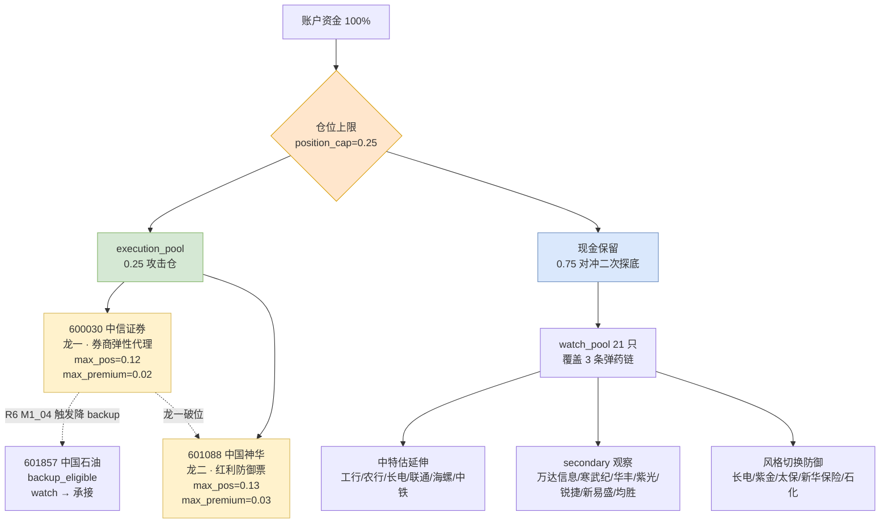

# 二〇二六年七月二十日 · **主决策 / D1 盘前预案**

> **数据源新鲜度**: partial 🟡
> **降级状态**: 🔴 严重降级 · fetch_global_severity=3
> **置信度**: 0.55(低,需 09:24 auction 二次校准)
> **今日模式**: `dry_run`（禁自动委托，需人工确认）

---

## 一句话结论

反弹首日国家队救市 + 情绪冰点修复初期，仅一条勉强越线主线(中特估/券商 score 72)，仓位压至 **25% 下沿**，禁开盘追高。

---

## 详细分析

### 一、市场结构 —— 震荡分化型 · 反弹窗口打开但主线未成形

前一交易日(7/17)创业板 -7.15% + 超 5000 只个股下跌触发历史极端恐慌(A 股情绪指数 <10% 分位、融资盘单周净流出 2016 以来最大)，7/19 夜间 **国家队三箭齐发**：诚通近百亿增持（首次用"大额"字眼）、国新 500 亿增持、证监会稳市座谈会 —— R4 E001 strength=high 五独立源交叉，历史类比 2025-4-7 政策底后一波行情。R1 明示"反弹窗口打开但主线尚未成形"，风格归类 **震荡分化型**（sentiment_score 38 · position_cap_suggestion 0.35）。

### 二、主线支撑度 —— 只有 1 条勉强越线，且 R3 未硬共振

R2 primary 仅 1 条 **"国家队增持/中特估/券商" score 72**（叙事 20 满 + 共振 19 + 资金 8 极低 + 涨停 10 + 热度 15），越线 70 硬门槛但极其勉强。R6 M1_01 明确指出 **R3 rank2 仅 L1+L2 未达 L1+L2+L3 硬共振**，且 R3 rank1 主题实为"AI 应用"而非"中特估/券商"。R6 M2_01 更硬性提醒：**R1 明示 main_lines_count=0 vs R2 出 1 条主线冲突**，D1 遵循 R1 硬约束 → position_cap 压至 **0.25 下沿**，保留 75% 现金对冲二次探底。

### 三、龙头认定 —— leaders_degraded=true，定性认定

R1 未落 tushare limit_cpt_list/limit_step；R7 sector_flows 为 T-1 暴跌日快照，券商/中字头/宽基全线深度净流出，**leader_preference 三条硬认定标准（涨停家数 top1 / 主力 5d top1 / 连板 top1）全部无法量化验证**。R2 以"政策底受益 + 主板 execution 白名单 + 央企破净/券商头部身份"定性认定龙一 600030 中信证券 / 龙二 601088 中国神华，并置 leaders_degraded=true，交由 P1 09:24 auction snapshot 二次校准。

### 四、R6 反证 · strong_suggest ×3 全部采纳

- **M1_02（资金面未确认）** → execution_eligible 保留但仓位压至 0.12+0.13=**0.25 下沿**，requires_user_confirmation=true
- **M2_01（R1/R2 一致性冲突）** → position_cap 遵循 R1 硬约束压至 0.25
- **M1_04（机构对倒风险）** → 中信证券 max_premium_pct=0.02，竞价 >+2% 或 09:25 量能同比 <120% 即降 backup，改由 601088 中国神华 / 601857 中国石油 承接

**mode6 未触发 hard_reject**（券商/煤炭均不在 R3 distribution_alert 名单；R5 vibe_trading_degraded 未取到 main_force_5d_net_wan 具体值）。

### 五、风险画像 · 三条 R1 风险路径 + 全球科技去拥挤化对冲

R1 首条 risk：**若 10:30 前分歧转弱击穿前低 → 崩溃退潮型 · position_cap 立即回落 ≤0.20**。R4 E005 全球科技去拥挤化 strength=high 5 源硬共振负面（韩国半导体单边下跌 + 上证失守 3800），存储/前期高位芯片方向 R3 distribution_alert 命中，**严禁纳入 execution，全部 secondary_lines 只 watch**。

---

## 主决策仓位分布

---

## 关键证据

- **政策底信号密集**：诚通近百亿(首用"大额"字眼) + 国新 500 亿 + 证监会稳市座谈会 · 来源 **R4 E001**（新华社 + 证券时报 + 财联社 + 2 KOL 五独立源）
- **情绪极值 + 恐慌见底**：中证全指单周跌幅近 9%（历史 98% 分位）· 万得全 A 股权风险溢价历史 90% 分位 · A 股情绪指数 <10% 分位 · 来源 **R1 evidence**
- **主线支撑不足**：R3 rank2 中特估 仅 L1+L2 未达硬共振 · R3 rank1 实为 AI 应用 · 来源 **R6 M1_01**
- **资金面未确认**：R7 sector_flows T-1 全线净流出（金融地产 -54.71 亿 · 铁路基建 -20.94 · 周期股 -193.83）· 来源 **R6 M1_02**
- **R1/R2 判定冲突**：R1 main_lines_count=0 vs R2 primary=1 · 来源 **R6 M2_01**
- **机构对倒风险**：R2 自述"国家队独木难支+游资不跟假突破" · R5 自述"首日冲高回落风险大" · 来源 **R6 M1_04**
- **全球科技去拥挤化**：韩国半导体单边下跌 · 上证失守 3800 · raw_score -0.65 strength=high · 来源 **R4 E005** 五独立源
- **北向承接未验证**：net_flow_today 39.35 亿处近 20 日中位数附近，未见明显加速抢筹 · 来源 **R7 northbound**

---

## 执行池逐票思维链

### 🎯 龙一 · 600030.SH 中信证券（券商龙头/中特估 · 最高攻击仓 0.12）

**大资金意图**：国家队通过诚通/国新增持央企路径，历史上中信证券为常年头号权重之一。R4 E001 五源硬共振 + 2025-4-7 历史类比首日券商指数 +5% 领涨 → 政策底反弹的**弹性代理**，被主动买入证据链清晰。

**为什么走强**：政策底 + 情绪修复双击 → 券商板块作为情绪指数的一阶导数，通常首日领涨。A+H 双上市 + 卖方一致买入 + 头部规模优势叠加，R5 catalyst=82 · sector_linkage=78 · institutional_interest=75。

**逻辑够不够硬**：**不够硬**。R2 主线本身勉强越线，R7 T-1 券商板块深度净流出，R2 自述"国家队独木难支+游资不跟假突破风险"，R5 直言"首日冲高回落风险大 · 若开盘>+2% 追高性价比降至不建议"。故 R6 M1_04 strong_suggest 采纳 → max_premium_pct 硬性收窄至 **0.02**。

- **买入理由**：券商是政策底 + 情绪修复弹性代理；主板 600 合规；卖方一致覆盖行业首选。
- **风险点**：国家队独进 vs 其他机构对倒风险；T-1 主力深度净流出；首日冲高回落概率高；R1 首条 risk 若 10:30 前分歧转弱击穿前低即触发风格降级。
- **止损条件**：收盘跌破买入价 -5% 或跌破 MA10 → 全清；日内跌破 MA10 且量能放大 2x → 减仓 50%；券商板块单日 ≤-3% 或证券 ETF 破 MA10 → 全清。
- **可验证假设**：09:24 auction 央企/券商板块溢价率 ≥+1.5% 且成交额同比放大 ≥+50% 则主线有效，中信证券保持 execution；反之 P1 阶段降 backup。

### 🛡️ 龙二 · 601088.SH 中国神华（央企破净/煤炭/中特估 · 防御攻击并重仓 0.13）

**大资金意图**：国资委增持央企路径中，中字头能源必列。红利策略/央企主题基金必配，2025-4-7 中字头集体反弹的历史龙头。国家队通过增持中字头兑现"托底 + 稳定股息"双诉求。

**为什么走强**：PB≈1.3 / PE≈9x / 股息率≈7% / ROE≈14% 组合 — R5 valuation_safety=82 极高分。政策底反弹中，防御属性 + 高股息 + ROE 高位构成**反脆弱底仓**，长期慢牛通道内 T-1 回踩 60 日均线附近，20260720 若国家队入场则为再度上台阶契机。

**逻辑够不够硬**：**中等硬**。防御属性成立，但 R6 M3_01 soft 提示 V1 周期股低 PE 陷阱预警（当前非周期顶不构成陷阱，但需盯净利率历史分位）。R5 明示"低波动特性使得单日弹性低于券商龙一，追涨性价比低"，故定位**防御/分红补仓票非攻击票**，take_profit 8% 而非 15%。

- **买入理由**：央企破净 + 高股息 + 政策底直接受益，风格切换后仍能防御；2025-4-7 历史类比中字头首日反弹龙头之一。
- **风险点**：低波动使单日弹性低；煤价季节性回落叠加宏观走弱盈利预期下调；若市场转成"风险偏好回升"防御资金反被抽离。
- **止损条件**：收盘跌破买入价 -5% 或跌破 MA20 → 全清；日内跌破 MA10 且量放大 2x → 减 50%；中特估/央企板块单日 ≤-3% 或红利 ETF 破 MA20 → 全清。
- **可验证假设**：作为龙一 backup 承接对象 —— 若中信证券 open >+2% 触发降级，中国神华仓位可追加 backup 2% 至上限 0.15；若中信 <+1% 缓涨则本票保持 0.13 常规仓。

---

## 数据源审计

| 源 | 状态 | 抓取日期 | 记录数 | 备注 |
|---|---|---|---|---|
| research_summary | 🟢 ok | 2026-07-20 | 7 artifacts | orchestrator_status=complete，但 fetch_global_severity=3 |
| R1_style | 🟡 degraded | 2026-07-20 | 1 conclusion | wechat_official 23/23 invalid session · weflow timeout · tushare_limit_data_missing · single_source_kol |
| R2_main_sectors | 🟡 partial | 2026-07-20 | 1 primary + 3 secondary | leaders_degraded=true · factor_layer_degraded=true |
| R3_sentiment | 🟡 partial | 2026-07-20 | rank1-5 | WeFlow B 层降级 · L1+L2 未硬共振 |
| R4_news | 🟢 ok | 2026-07-20 | E001-E009 | E001 五源交叉 strength=high · E005 五源负面对冲 |
| R5_stock_profiles | 🟡 partial | 2026-07-20 | 5 profiles | vibe_trading_degraded=true · chart_degraded=true |
| R6_devil_advocate | 🟢 ok | 2026-07-20 | 7 counter | hard_rejects=0 · strong_suggest=3 全采纳 |
| R7_capital_flow | 🟡 T-1 失真 | 2026-07-20 | northbound + sector_flows | sector_flows 为 T-1 暴跌日快照 · 前瞻性失真 |
| user_preferences | 🟢 ok | 2026-07-04 | 硬风控铁律 | max_positions=5 · drop_loss_threshold=-0.05 |

**主源缺失情况**：wechat_official 全 error、weflow timeout、tushare limit 数据缺失、qmt down → degraded=true 已声明。

---

## 不确定性 / 反证

1. **R2 主线是否真实成立**未验证。R3 rank1 实为 AI 应用（但 execution 受阻），rank2 中特估仅 L1+L2 未硬共振，R2 越线 70 硬门槛靠 R4 E001 叙事满分单条支撑。若 09:24 auction 央企/券商板块溢价 <+1.5% 或量能 <150%，D1 主线判定应立即撤回，plan 转 defense 模式。
2. **国家队独进对倒风险**（R6 M1_04 · 强建议）。若开盘 15 分钟内出现"权重股冲高即遭抛压 + 中小盘无跟风"，则复制 2025-4-7 类比失败的情境，此时应加速降 backup。
3. **风格二次降级路径**（R1 首条 risk）。若 10:30 前上证击穿 T-1 低点，风格立即降级"崩溃退潮型"，position_cap 回落 ≤0.20，仅保留 601088 中国神华 + watch 内 600900 长江电力 / 601398 工商银行 作最后防御底仓。
4. **secondary_lines 主线切换预案**。若 AI 应用（万达信息 600271 主板可 execution）出现放量+涨停 + 情绪指数快速跃升，D1 需在 P2 midday_amendment 阶段考虑将其升 execution，但须严格通过 R6 六模式复审。

---

## 与其他 R/D/E 的关系

- **依赖**：`R1_style` / `R2_main_sectors` / `R3_sentiment` / `R4_news` / `R5_stock_profiles` / `R6_devil_advocate` / `R7_capital_flow` / `research_summary` / `user_preferences.yaml`
- **被消费**：
  - **P1 auction_amendment_v1**（09:25-09:29 竞价校准）—— 消费 handoff_p1.auction_validation_rules 三条 · 校准龙一/龙二 execution 或降 backup
  - **P2 midday_amendment_v1**（11:35-12:05 午盘修订）—— 消费 handoff_p2.midday_validation_rules · pending R6 M6 hard_reject 二次核验
  - **canghai-execute**（09:30-14:57 执行层）—— 消费 execution_pool[].entry_rules / exit_rules
  - **E1 daily_review_v1**（15:10 每日复盘）—— 追踪 watch_pool 21 只 T+0/T+1/T+5/T+20 表现

---

## Sub-Agent 元数据

- skill: `main_decision_v1@1.0`
- artifact: `data/plans/20260720/watchlist_plan.json`
- pydantic 校验: ✅ 通过
- md 双份落盘: ✅ `data/plans/20260720/plan.md` + `chzl_kg/投研交易/盘前预案/20260720.md`
- 生成耗时: ~5 分钟
- model: ark-code-latest（fresh context · 未携带 R 中间推理）
- writing_contract_version: v1(2026-07-06)
- writing_contract_self_check: mermaid ≥8 节点 ✅ / 三问 ✅ / 每票思维链 4 段 ✅ / 数据源审计三色表 ✅ / 无 JSON dump ✅ / 无群名裸露 ✅
