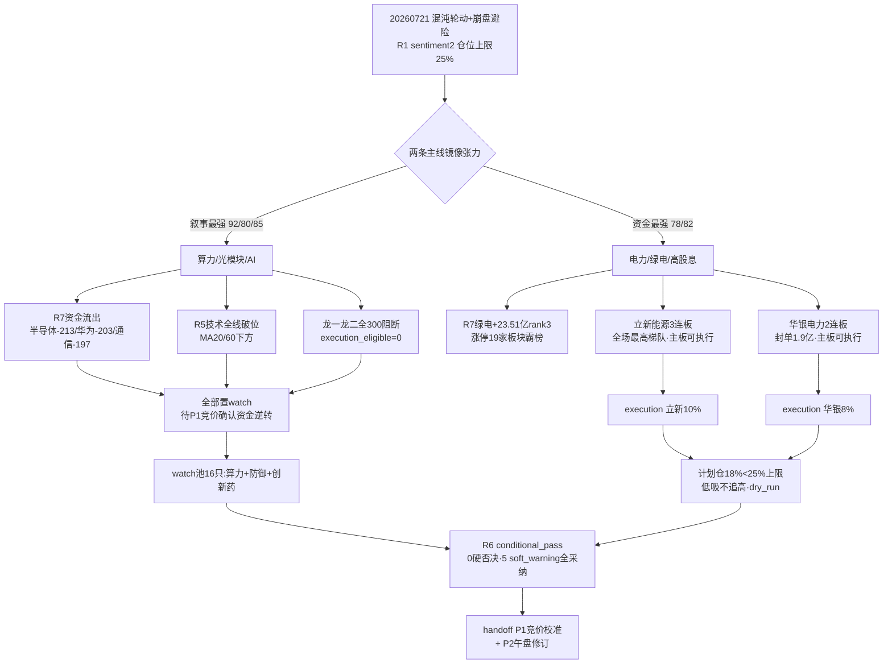

# 2026年7月21日 · **主决策 / D1 盘前预案**

> **数据源新鲜度**: partial（公众号全down + weflow B层disabled + R7为T-1读数）
> **降级状态**: true（fetch_global_severity=3 → 强制 dry_run · autonomous=false）
> **置信度**: 0.62

## 一句话结论

⚠️ 混沌轮动+崩盘避险,仓位上限25%,执行仅电力线2只(计划仓18%),算力最强线全300阻断只观察不追高,R6无硬否决但5条soft_warning全采纳。

---

## 详细分析

### 📉 今日格局:混沌轮动 + 崩盘后避险(R1 sentiment 2/10)

07-17大跌(上证-3.05%/创业板-7.15%)后,昨日(07-20)指数微反弹(上证+0.85%),但这是**技术性修复而非健康反弹**。市场宽度已崩坏:

| 宽度指标 | 数值 | 含义 |
|---|---|---|
| 跌停家数 | 196 家 | 🔴 恐慌未消 |
| 涨停家数 | 54 家 | 跌停/涨停 ≈ 3.6 |
| 炸板率 | 41% | 🔴 追高即接盘 |
| 最高连板 | 3 板(立新能源·电力) | 无情绪梯队 |

涨停高度集中于**电力/煤炭等高股息防御板块**(夏季电力+避险抱团),而半导体/科技/锂电成为跌停重灾区——典型的**资金防御性抱团 + 科技清算**分化格局。R1据此判混沌轮动、仓位上限压至 **25%**,只宜极低仓防守试错。

### ⚔️ 核心张力:最强叙事 vs 最弱资金(叙事与资金背离)

今日呈现罕见的**镜像张力**——两条主线各占一维极端:

- **算力/光模块/AI线**:叙事(92)+情绪(80)+alpha(85)全场最强,WAIC2026超节点大时代 + 新易盛中报预增77~103% + Kimi K3登顶三源硬共振(R3 intensity 8.0)。**但资金(30)+技术(35)双维塌陷**:R7显示T-1半导体-213.66亿/华为概念-203.16亿/通信技术-197.63亿全线大幅流出,R5验证算力线除紫光股份外**全线技术破位**(新易盛距峰-35%/中际旭创-27%在MA20/60下方)。
- **电力/绿电/高股息线**:叙事(55)+alpha(40)偏弱,**但资金(78)+技术(82)双硬共振**:R7绿色电力+23.51亿(rank3)/红利+14.03亿/中特估+13.61亿,涨停家数绿电19家(rank1),立新能源3连板为全场最高梯队。

**决策取舍**:算力线虽最强,但龙一龙二(新易盛300502/中际旭创300308/天孚300394)**全部创业板300前缀,auto-buy阻断,execution_eligible=0**,主线上无一只主板可执行标的(R5核验中兴通讯净利-46%判杂毛、光迅/华工T-1跌停)。故execution池只能落在**电力线主板可执行龙头**,这也是R7资金+用户防御偏好+R1避险风格三重对齐的唯一方向。

### 🎯 执行策略:2只电力线低吸,计划仓18% < 上限25%

execution仅立新能源(10%)+华银电力(8%),合计18%。之所以不满配25%:**主板可执行龙头供给严重不足**——算力最强线全300阻断,防御线仅电力2只主板可auto-buy。混沌轮动+41%炸板率环境下,宁可空着仓位也不硬凑标的。全部**低吸不追涨停**,竞价溢价>+3%即改盘中回踩。

### 🧭 推理三问(执行池核心对象:电力线)

- **大资金意图**:R7 T-1真实资金主入口=上证50+38.48亿/权重+28.35亿/**绿色电力+23.51亿(rank3)**/红利+14.03亿/中特估+13.61亿——国家队+险资+央企(国新诚通增持500亿+中国人寿单日100亿)在崩盘后做**防御性高低切**,资金从高位科技(半导体/华为/通信全线流出)撤向高股息避险资产,电力是这波避险抱团里唯一有连板梯队(立新3板)的方向。
- **为什么走强**:季节性(夏季高温用电负荷15.51亿千瓦)+避险(高股息属性)双驱动,叠加崩盘后资金无处可去只能抱团确定性。绿电涨停19家板块霸榜,是当日宽度崩坏中极少数还有赚钱效应的地方。
- **逻辑够不够硬**:资金+技术维度硬(R7净流入+连板梯队真实),但**叙事+alpha维度软**(无业绩爆发·纯防御属性·score63未清70门槛)。属于"崩盘避险高低切"而非"进攻主线",追高易炸板(41%),所以只低吸、只极低仓、破位即走。

---

## 执行池(2 只 · 计划仓 18%)

### 1. 立新能源 001258.SZ(电力/绿电·龙一)· 计划仓 10%

- **plan_status**: `execution_pool_hold_add_on_pullback`
- **买入理由**:电力线龙一,连板高度板块top1(3连板·全场最高梯队),深主板001前缀 execution_eligible=true。R7绿色电力+23.51亿rank3资金确认线,涨停家数19家板块霸榜,R6 P6唯一硬否决权逐一核验未命中distribution_alert且板块净流入→hard_reject_count=0。
- **风险点**:3连板高度已高,混沌轮动+炸板率41%下断板风险大;防御高低切无进攻性催化,资金锚一旦转向即失效;R6 P3判定崩盘避险格局下配进攻属性偏弱的连板票有风格错配隐忧。
- **止损条件**:硬止损 -5%(跌破买入价×0.95或前一日最低价,priority1);收盘跌破MA10或断板后次日不重新封板(intraday_break_exit);绿电板块资金转净流出触发sector_switch_exit;尾盘炸板率>25%或跌停>25只 T+0减仓50%(R6全局风控)。
- **可验证假设**:P1竞价若溢价<+3%且封单延续→资金锚成立可低吸;若竞价涨停一字/高溢价>+3%→放弃开盘改盘中回踩;P2午盘若绿电资金转出→证伪,全撤。

### 2. 华银电力 600744.SH(电力/绿电·龙二)· 计划仓 8%

- **plan_status**: `execution_pool_hold_add_on_pullback`
- **买入理由**:电力线龙二,板块综合评分top2(2连板·封单1.9亿·换手8.59%),沪主板 execution_eligible=true,夏季高温火电弹性标的。R6 P6核验未命中distribution_alert+板块净流入→无hard_reject。
- **风险点**:连板高度(2板)低于龙一,弹性但跟随属性强;同属电力板块与龙一存在集中度风险(单板块累计18%<40%上限,可控);防御线无催化追高易套。
- **止损条件**:硬止损 -5%(priority1);收盘跌破MA10或断板不重封;绿电板块降级sector_switch_exit;炸板率>25%/跌停>25只 T+0减仓50%。
- **可验证假设**:作为龙二弹性补充,若龙一立新走强则跟随,若立新断板则同步撤;P1竞价须以实价回填 trigger_price/buy_zone。

---

## 观察池(16 只 · 全部 watch/手动)

### 算力/光模块/AI(最强叙事 · 全300阻断 · 待P1竞价确认资金逆转)
- **300502.SZ 新易盛** — 龙一·中报+77~103%全场硬alpha第一·主力5日+50.94亿,但300阻断+T-1破位MA20距峰-35%,放量站回MA20方可手动
- **300308.SZ 中际旭创** — 龙二·1.6T光模块绝对龙头·Q1净利+262%,300阻断+破位双均线,观察1000整数关企稳
- **300394.SZ 天孚通信** — 候补·毛利率56.6%全链最高,但PE107/PEG>2高估+技术破位最深(-56%)
- **301205.SZ 盛科通信** — KOL开源证券蒋颖首推交换芯片(四剑客),301阻断,观察交换网络资金
- **000938.SZ 紫光股份** — 算力线唯一三重共振+深主板可执行,但非R2龙一/龙二受leader_preference限制不进execution,P1竞价确认可评估手动
- **300383.SZ 光环新网** — 算力租赁(热榜15→4·Δ11速度最快)+Kimi承接,300阻断
- **300634.SZ 彩讯股份** — Kimi生态KOL点名(caution·非共现),300阻断
- **300024.SZ 机器人** — WAIC物理AI,但R7人形机器人-81亿rank2大幅流出,背离风险

### 防御/资金锚(避险参考 · 用户不做防御主线)
- **600236.SH 桂冠电力** — 电力线龙三·绿电920亿,开板12次封板不坚决,板块内递补观察
- **601088.SH 中国神华** — R7红利/中特估资金锚+增持托底,避险参考
- **601857.SH 中国石油** — R7上证50+38.48亿rank1资金主入口,救市托底参考

### 风险提示 watch(不介入)
- **600267.SH 海正药业** — R6 P5:创新药新晋热榜第一触发distribution_alert(medium),chip强势未达mode6双条件降soft_warning,验启动非出货
- **601138.SH 工业富联** — R6 P1算力/华为链·R5破位-30%,R7华为-203亿流出,catalyst≠capital
- **002463.SZ 沪电股份** — R6 P1/P6:龙虎榜机构净卖1.3亿bull_trap·distribution_alert,非execution龙一/龙二不触发mode6
- **002281.SZ 光迅科技** — R5 avoid:T-1 -10%跌停·PE136高估·板块资金流出,板块温度观察
- **000988.SZ 华工科技** — R5 avoid:PE62主板光模块最不贵但T-1跌停·距峰-43%,观察企稳

---

## 禁买清单(rejected · 3 只)

| ts_code | 名称 | 禁买理由 | 来源 |
|---|---|---|---|
| 603986.SH | 兆易创新 | 中国人寿资管集中卖出套现6.82亿·存储龙头筹码松动+R7半导体-213亿印证 | R6 P4 |
| 688636.SH | 智明达 | 特种领域订单受限三年+收上交所监管工作函·且688阻断 | R6 P4+688 |
| 000063.SZ | 中兴通讯 | 唯一主板可auto-buy算力票但Q1净利-46.6%·主力5日-37.37亿最差流出·30日无机构游资(杂毛) | R5 avoid+杂毛 |

---

## R6 反证采纳(conditional_pass · 0 硬否决 · 5 soft_warning 全采纳)

| 模式 | 严重度 | 采纳动作 |
|---|---|---|
| P1 叙事与资金背离 | soft_warning | 算力线全置watch,P1竞价确认资金是否逆转 |
| P2 龙头不可执行 | soft_warning | 算力零可执行龙头,不押仓不可执行主线,execution仅配电力主板龙头 |
| P3 风格错配 | soft_warning | 严守25%上限,只低吸不追涨停;两票均写炸板率>25%/跌停>25只 T+0减仓50% |
| P4 存储半导体负面 | soft_warning | 兆易/智明达列rejected禁买,存储链情绪打折 |
| P5 创新药distribution_alert | soft_warning | 海正药业watch,验启动非出货不追高 |
| P6 霸榜出货硬约束 | info | 唯一hard_reject权核验立新/华银,双条件无一满足→hard_reject_count=0 |

**strong_suggests_overridden**: 无(5条soft_warning全部采纳,无override)

---

## 数据源审计

| 源 | 状态 | 抓取日期 | 记录数 | 备注 |
|---|---|---|---|---|
| research_summary | 🟢 ok | 20260721 | 7 artifacts | orchestrator complete |
| R1 风格 | 🟡 stale | 20260721 | 1 | 公众号缺失·confidence0.6 |
| R2 主线 | 🟡 stale | 20260721 | 2 主线 | degraded·confidence0.62 |
| R5 画像 | 🟡 stale | 20260721 | 6 票 | MCP降级·confidence0.58 |
| R6 反证 | 🟢 ok | 20260721 | 6 模式 | confidence0.72 |
| R7 资金 | 🟡 stale | 20260720 | T-1读数 | WAIC资金响应未反映 |
| Tushare量化基座 | 🟢 ok | 20260720 | 涨停/资金/龙虎榜 | 完整可靠 |
| 公众号池(23账号) | 🔴 error | — | 0 | invalid session全down |
| weflow B层 | 🔴 timeout | — | 0 | stock映射disabled·A层可读 |

**主源缺失** → `degraded=true` · `fetch_global_severity=3` → 强制 `mode=dry_run` + `autonomous_trading_enabled=false`

---

## 不确定性 / 反证

1. **R7资金为T-1读数**:20260720为反弹日的pre-catalyst资金,WAIC(07-20晚)重磅催化的资金响应完全未反映——算力线"资金流出"结论可能在今日竞价被逆转,这是最大不确定性,已全权移交P1竞价重估。
2. **计划仓18%偏保守**:主板可执行龙头仅电力2只,若P1竞价确认算力资金逆转+紫光股份000938站稳,可能低估了进攻机会(但leader_preference限制+300阻断使算力无法自动执行,只能手动)。
3. **公众号池全down**:R1-R5置信度普降至0.58~0.63,情绪/消息维度依赖KOL 5群+weflow A层,B层无个股edge_weight硬确认。
4. **电力线软肋**:纯防御高低切无进攻催化,若崩盘情绪缓和资金回流科技,电力抱团可能快速瓦解,故写了sector_switch_exit。

---

## 与其他 R/D/E 的关系

- **依赖(上游)**: R1(风格/仓位上限)·R2(主线/龙头候选)·R3(情绪共振)·R4(消息催化)·R5(六维画像)·R6(反证硬否决权)·R7(资金面确认) + user_preferences.yaml(龙一龙二/合规/仓位铁律)
- **被消费(下游)**: canghai-execute(消费 watchlist_plan.json)·P1竞价校准(消费 handoff_to_P1)·P2午盘修订(消费 handoff_to_P2)·E1每日复盘(观察池追踪)·用户(本盘前预案 md)

---

## Sub-Agent 元数据

- skill: main_decision_v1
- artifact: data/plans/20260721/watchlist_plan.json
- pydantic: WatchlistPlan 校验通过(exec2/watch16/rejected3·计划仓0.18≤上限0.25)
- mode: dry_run(fetch_global_severity=3强制)
- model: ark-code-latest
