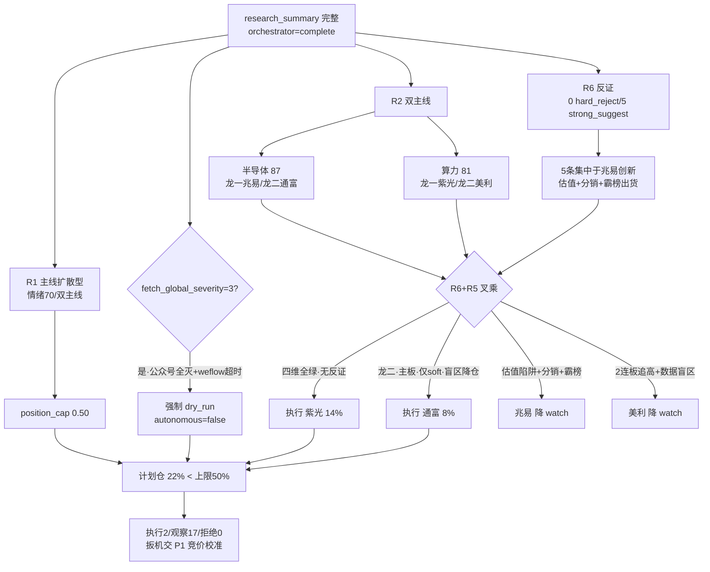
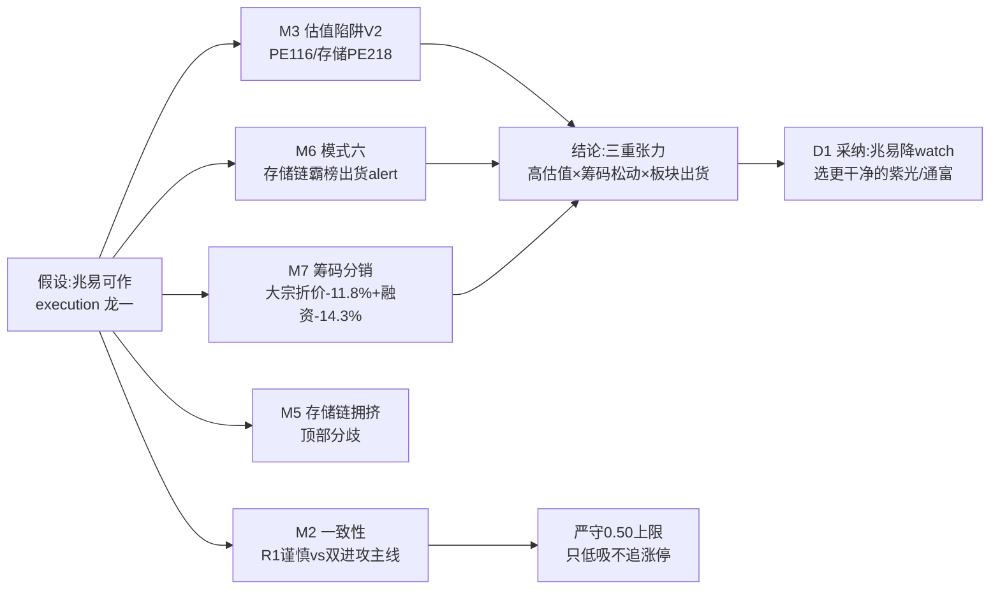
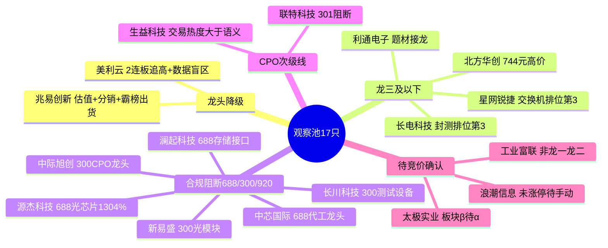

# 2026年7月22日 · **主决策 / D1 盘前预案**

> **数据源新鲜度**：partial　|　**降级状态**：true（fetch_global_severity=3）　|　**置信度**：0.72　|　**模式**：dry_run（不自动交易 · 需用户确认）

## 一句话结论

今天是超跌反弹**次日验证关口**，风格判为**主线扩散型**、情绪浓度 70、仓位上限压到 **50%**。全场唯一大主线是科技（半导体 score87 + 算力 score81），三源共振、资金全链翻红，但**核心承载恰是颜晓滨口中"218 倍 PE、跑路时机"的高位泡沫区，且资金是"末日翻红"**。R6 给出 **0 硬否决 + 5 条强烈建议**，且五条几乎全部指向半导体龙一兆易创新（估值陷阱 + 筹码分销 + 存储链霸榜出货）。据此执行池收敛到**两只最干净的标的**——算力龙一紫光股份（14%）+ 半导体龙二通富微电（8%），合计仓位 **22%**；兆易创新、美利云与其余科创/创业板阻断票共 17 只沉入观察池，等 P1 竞价的右侧承接确认。

## D1 决策树

## 今日市场怎么看

先说大势。上一交易日（0721）是一次暴力超跌反包：上证 `+1.79%` 收 3864.37，创业板指 `+7.05%` 收 3685.97，而就在 0717 两者还分别深跌 `-3.05%` / `-7.15%`。这种 V 形本身就是双刃剑——反弹第一天普涨最容易演成"一日游"或次日分歧。R1 把它归为**主线扩散型**而非连板情绪型，判据扎实：最高连板仅 4 板、无 6 板以上情绪高标，涨停 121 家纯粹是超跌普涨堆出来的，炸板率仅 `6.2%`（封板质量其实不差）。

再看这条唯一主线的成色。三源共振（热榜量化 + 5 群语义 + WeFlow 词云）指向高度一致的科技大方向，R2 拆成两条核心主线——**半导体/存储/先进封装**（score 87，涨停维满分）与 **AI 算力/IDC/超节点**（score 81，共振维满分）。资金面 R7 全链翻红：国产芯片主力 `+212.55 亿`、科技风格 `+295.87 亿`、高带宽内存 `+24.5 亿`(pct +11.82%)、数据中心 `+46.98 亿`，北向连续 5 日走强至 `43.94 亿`。

**但今天最大的张力，也是我不敢把仓位打满的核心原因，有三点：**

- **资金是"末日翻红"**：R7 显示科技风格前四天累计净流出，只有昨日单日翻红 `+295.87 亿`（positive_days=1 / reversal_up）。这不是趋势性流入，而是超跌反弹里的一日回补，右侧成色必须等今早集合竞价二次确认。
- **顶级 KOL 强空背离**：核心 KOL 颜晓滨警示 A 股半导体平均 PE 约 218 倍泡沫、不到 5% 半导体股虹吸约 45% 成交量、融资盘连续 13 天净卖 3100 亿，判断反弹恰是跑路窗口。盘面强度与 KOL 谨慎形成明显背离，情绪浓度存在虚高风险。
- **存储链霸榜出货**：R3 distribution_alert 明示 20 日德明利（存储）跌停霸榜=出货型，存储链拥挤度极高，21 日虽切紫光修复但拥挤度未降。

## R6 反证怎么消费的（推理深度三问 · top 反证点=兆易创新）

R6 今天开出 **0 条硬否决**（模式六红线未触发，`hard_reject_count=0`），5 条 strong_suggest 高度集中在半导体龙一兆易创新，我逐条落地：

对 top 反证对象**兆易创新**的三问：

- **大资金意图**：机构 T-1 虽在场，但险资/大宗层面已在派发——大宗 3 笔折价 `-11.8%`（买卖均华泰上海+广发杭州，典型分销减持）、融资余额 15 日 `-14.3%` 资金撤离，主力借超跌反弹在高位泡沫区出货兑现，对手盘是追反弹的散户与融资盘。
- **为什么走强**：位置上兆易自 846 深跌至 475（回撤 `-43.8%`、ret20 `-32.5%`），属超跌反弹修复；催化是存储业绩预增（江波龙 743 倍）板块共振；但筹码端龙虎榜未见机构接力、60 分空头排列、反弹面临 MA60(509.76) 中期均线压制——**走强是超跌反包而非趋势启动**。
- **逻辑够不够硬**：不硬。V2 估值陷阱 + 颜晓滨 218 倍泡沫警示 + distribution_alert 三源同向看空，R5 composite 仅 72 / valuation_safety 仅 5 分。证伪路径清晰：若今早竞价放量站回 MA60 且无高开分歧，则出货逻辑证伪、可升级手动候选；否则维持降级。**故 D1 降 watch，不进 execution。**

**M5 的自我校准**很关键：昨日 R6 对"算力资金背离"的反证被 WAIC 行情证伪（创业板 +7.05% 科技全面爆发），所以今日算力线背离类反证主动降权；但存储线 distribution_alert 昨日兑现（P5 海正 -2.17%），予以保留。这正是**算力从宽（保留紫光）、存储从严（降兆易）**的原因。

## 四维叉乘：为什么执行池是这两只

把 R5 六维画像与 R6 负面象限叉乘，正向选股落点很清晰——**资金确认 × 主线共振 × 估值安全 × 技术右侧 × 无 R6 硬命中**同时满足的，全场只有两只主板可执行标的：

### 1. 紫光股份 000938（算力龙一 · 14% · 首推）

- **plan_status**：`execution_pool_hold_add_on_pullback` · **止损** 39.39（-5%）· **止盈** 47.68（+15% 减半）
- **买入理由**：① 算力主线龙一，涨停登顶热榜第 1（hot 262835）、成交 193 亿板块第 1、开源蒋颖超节点电话会点名新华三交换网络；② R5 composite `85`（四票最高）、`fundamental_flags=[]`、chart_vision 全周期均线多头 conf 0.80、涨停突破 20 日新高量能配合(vr1.17)。
- **风险点**：① 科技风格资金末日翻红若二次转负则板块 β 走弱；② 涨停后估值快速抬升 + 周线上周 -8.54% 高位抛压。
- **止损条件**：跌破 `39.39`（=参考价 41.46×0.95）清仓；收盘跌破 MA10 或涨停打开不重封则 intraday_break_exit；科技风格午后资金转净流出则 volume_price_divergence T+0 减半。
- **可验证假设**（24h）：今早竞价能否放量站稳 `40.5` 以上、溢价 `<+3%`——是则右侧确认按 14% 低吸，否则改盘中回踩 MA5(37.68)。
- **三问**：**大资金意图**——北向+主力+机构在算力最强承载卡位超节点放量刚需；**为什么走强**——涨停突破新高（位置最优）+ 超节点电话会硬催化 + 量比放量配合；**逻辑够不够硬**——硬，四维全绿 + 无一 R6 反证命中 + PE55.8 算力链最温和，证伪路径仅在资金末日翻红二次转负。

### 2. 通富微电 002156（半导体龙二 · 8% · 弹性补充）

- **plan_status**：`execution_pool_hold_add_on_pullback` · **止损** P1 竞价实价×0.95 回填
- **买入理由**：① 半导体主线龙二，热榜动量板块第 1（+29）、主力 13.4 亿、综合评分第 2、AMD 封测叙事硬；② 选它替代降级的兆易——**封装子方向不带存储链霸榜出货 alert**，自身涨停非霸榜出货（R6 M6 verdict=不触发）。
- **风险点**：① ⚠️ R6 M1-02 数据盲区——R5 仅覆盖 2/4 龙头，通富无六维画像（筹码/估值未核验），故降仓至 8% 且要求 P1 竞价补核验；② 先进封装属科技拥挤簇，板块回摆无避风。
- **止损条件**：跌破买入价 -5% 或前一日最低价清仓；半导体板块资金转净流出或存储 alert 扩散至封装则 sector_switch_exit。
- **可验证假设**（24h）：P1 竞价封单/量比/溢价是否健康——过热（>+3%）或分歧大则降 watch 或改盘中回踩。

两只合计 `22%`，远低于 50% 上限。板块集中度：算力 14%、半导体封装 8%，均未越 40% 单板块红线。**留足 28% 余地给 P1 竞价确认后的右侧加仓。**

## 观察池（17 只）为什么不进执行池

三类逻辑：

- **龙头降级**：兆易创新（R6 五条 strong_suggest 集中攻击，降 watch）、美利云（2 连板追高 + 数据盲区，降 watch）。
- **合规阻断**：长川、源杰、澜起、中芯（688 科创）与中际旭创、新易盛、长川（300 创业板），落在 `execution_block_prefixes`，只能观察不能自动买——其中不乏业绩硬 alpha（源杰预增 1304%），但纪律就是纪律。
- **龙三/次级/待确认**：星网锐捷、长电、北方华创属 R2 综合排位第 3-4（龙三及以下不进 execution）；生益科技属 CPO 次级线（R6 M1-01 交易热度>语义热度）；浪潮信息未涨停待 P1 手动确认。

## 数据源审计

| 源 | 日期 | 状态 | 备注 |
|---|---|:--:|---|
| research_summary | 2026-07-22 | 🟢 | orchestrator=complete · R1-R7 全落盘 |
| tushare.limit_list_d / limit_cpt_list | 2026-07-21 | 🟢 | 涨停 121 / 连板天梯 / 板块涨停家数 |
| tushare.index_daily | 2026-07-21 | 🟢 | 上证 +1.79% / 创业板 +7.05% |
| R7 北向 + 板块资金 | 2026-07-21 | 🟢 | severity=0 完全可信 · 北向 5 日 36.15→43.94 亿 |
| vibe_trading 大宗/两融/龙虎榜 | 2026-07-21 | 🟢 | 兆易大宗折价 -11.8% / 融资 -14.3% |
| wechat_cli_5groups | 2026-07-22 | 🟢 | 578 条 · 5 焦点群（匿名） |
| R5_stock_profiles | 2026-07-22 | 🟡 | 仅覆盖 2/4 龙头（紫光/兆易）· 通富/美利数据盲区 |
| R1_style | 2026-07-22 | 🟡 | degraded 0.55（公众号缺失影响情绪交叉） |
| wechat_official_20 | 2026-07-22 | 🔴 | DOWN · 23/23 invalid session 全灭 |
| weflow_snapshot | 2026-07-22 | 🔴 | DOWN · timeout after 45s |

正因公众号全灭 + weflow 超时 + 资金末日翻红成色待验，`fetch_global_severity=3`，本预案**强制 dry_run、不自动交易、需用户确认**。用户 review 满意后再手动切 live。

## 不确定性 / 反证自省

最大的不确定性是**资金持续性**——末日翻红是右侧启动还是反弹诱多，只有今早竞价能给答案。其次是**顶级 KOL 与盘面的背离**：若颜晓滨对了，则今天买入的算力/半导体龙头也可能是高位接盘。我的对冲是：① 只选主板可交易、估值相对不贵（紫光 PE55.8）、无 R6 硬命中的两只；② 总仓压到 22%、模式设 dry_run；③ 把最终扳机交给 P1 竞价校准——若竞价显示执行池溢价过高或分歧巨大，P1 有权撤下（三选一 amendment 已写入 handoff）。另一层自省：R5 仅覆盖 2/4 龙头，通富微电在数据盲区，故降仓 + 要求 P1 补核验，避免盲区满仓。

## 与其他 R/D/E 的关系

- **依赖**：R1（风格→仓位上限 0.50）、R2（双主线+龙头候选）、R3（情绪共振+distribution_alert）、R4（消息催化）、R5（六维画像，2/4 覆盖）、R6（0 硬否决/5 强建议）、R7（资金末日翻红）
- **被消费**：P1 竞价校准 Agent（09:25 据本预案做竞价溢价确认 + 兆易/美利升降级判定）、execute 层（消费 execution_pool 2 只 + entry/exit rules）、E1 每日复盘 Agent（盘后追踪执行池/观察池兑现度 + R6 反证准确率回填）

## Sub-Agent 元数据

- skill：main_decision_v1
- artifact：data/plans/20260722/watchlist_plan.json（pydantic WatchlistPlan 校验通过）
- model：ark-code-latest
- R6 hard_reject 消费：0 条（无票从 execution_pool 硬剔）；5 条 strong_suggest 全部落地（兆易降 watch × 4 条 + 严守 0.50 上限 × 1 条）；0 条 override
- 执行 2 / 观察 17 / 拒绝 0 · 计划仓 22% < 上限 50%
