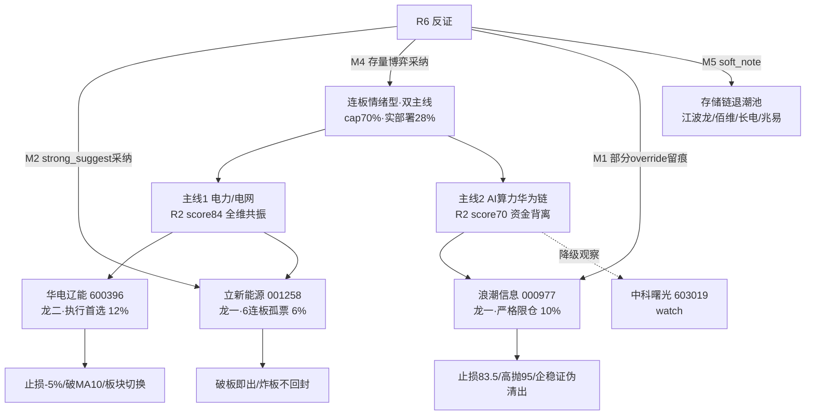

# 2026年7月24日 · **主决策 / D1 盘前预案**

> **数据源新鲜度**: 🟡 partial（R5画像 stale+不匹配、QMT down；核心研究链 R1/R2/R3/R4/R6/R7 全 ok）
> **降级状态**: ⚠️ degraded=true
> **置信度**: 0.70

## 一句话结论

连板情绪型 + 双主线，仓位上限 **70%** 但实际只部署 **28%**（存量博弈主动减仓）：**电力/电网**为全维共振核心主线（华电辽能龙二为执行首选、立新能源6连板龙一极小仓破板即出），**AI算力·华为链**资金全线流出仅保留浪潮信息严格限仓低吸；执行池 3 只、观察池 19 只，R6 零硬否决、2 项 strong_suggest 采纳 + 1 项部分覆盖留痕。

## 详细分析

**风格与仓位（R1）**：今日为「连板情绪型」，情绪浓度 72（涨停116家 breadth 强 + 炸板率17.7% 健康 + 最高6连板），三条主判据全中。但顶端天梯偏薄——6板仅立新能源1只且断层至4板，指数走平缩量。R1 建议仓位上限 70%，只做各主线龙一/龙二。D1 映射 `position_cap=0.70`。

**为什么实际只部署 28%**：R6 M4「资金背离」给出强反证——北向净流入连续5日边际走弱（43.0→30.75亿，hgt/sgt双降），上证/创业板指均+0.25%走平缩量，且资金绝对值最强的是电池技术(+109.51亿)/锂电(+103.69亿)而非情绪主线，指向**存量高低切博弈而非趋势性增量**。D1 采纳：把实际部署压到 0.28（远低于 cap 0.70），全池优先低吸不追高。

**双主线裁决**：
- **电力/电网（R2 score 84，核心）**：五维全共振——R4 top1 特高压第三批招标超2025全年(63亿中标)+三伏用电负荷创新高(strength 0.85)；R7 电网概念+47.33亿/智能电网+43.39亿/特高压+40.15亿概念净流入前八价涨量增；R3 rank2 电力/绿电 L1+L2+L3 三源共振(42号令绿证政策)。连板情绪型下电力承接高低切资金，持续性优于纯题材。
- **AI算力·华为链（R2 score 70，边界侧线）**：R3 rank1 全场最强叙事(梁文锋称英伟达护城河瓦解/华为超节点可平替)+R4 多条 high 催化，**但 R7 资金全线净流出**（算力-120.57亿/华为-113.75亿/半导体-200.73亿/科技风格-313亿），叙事与资金严重背离。R6 M1 判其主线逻辑断裂。

**R5 降级处置**：R5 为20260723 fallback（confidence 0.0），画像标的是紫光股份/兆易创新，与今日 R2 龙头（立新能源/华电辽能/浪潮信息/中科曙光）完全不匹配 → 判为不可用，alpha/risk 默认 B，保守筛选，不采信其画像。

## 主线推理三问

### 主线一：电力/电网
- **大资金意图**：概念板块净流入前八全维在榜且价涨（电网+47.33亿），叠加电池/锂电蓝筹资金最强——大资金在连板情绪型高潮期主动做**高低切防御 + 政策催化**双轮，规避高位科技筹码，抱团确定性政策方向。
- **为什么走强**：特高压第三批招标(63亿超全年)+三伏用电负荷创新高的硬催化，撞上42号令绿证8月强制履约的政策窗口，运营+设备双子分支共振。
- **逻辑够不够硬**：够硬——这是当前唯一「资金+催化+涨停+情绪梯队」四维齐全的主线，是本预案的正向核心。唯一软肋是龙一立新能源6连板孤票的情绪持续性（见 R6 M2）。

### 主线二：AI算力·华为链
- **大资金意图**：资金全线净流出（科技风格-313亿）与最强叙事严重背离——大资金正在**兑现离场**而非加仓，最强叙事是散户/情绪端的一致预期，非资金端的真金白银。
- **为什么走强（叙事层）**：梁文锋国产算力替代叙事+华为超节点1.6万张昇腾950订单+超微600亿新单，叙事强度全场第一。
- **逻辑够不够硬**：**不够硬**——催化→股价传导链在资金流出下断裂，海外 Alphabet Q2 FCF首次转负(-59亿)证伪资本开支可持续性，KOL颜晓滨明确「持币观望保本第一」。故本线仅保留龙一浪潮信息严格限仓低吸，龙二中科曙光直接降级观察池。

## 执行池（3 只 · 实际部署 28%）

### 1. 华电辽能 600396.SH（电力·电网 · 龙二 · 执行首选 12%）
- **plan_status**: `watch_pool_wait_for_entry` · **仓位上限** 12%
- **买入理由**：电力线龙二，热榜#3+首板+9.99涨停，量化基金+量化打板资金流入；相较龙一6连板孤票，首板运营股安全边际更高，是电力线执行首选。
- **风险点**：属高低切防御资金，若科技侧线企稳资金回流则电力承接力衰减；电力运营股弹性弱于设备侧。
- **止损条件**：买入价浮亏>5%全出（硬止损）；收盘有效跌破MA10（技术破位）；科技放量翻红+电力概念资金转净流出则减半（板块切换）。
- **可验证假设**：次日电网概念维持净流入 & 华电辽能不破5日线企稳 → 电力承接成立；若竞价高开>3%则不追、等回踩。

### 2. 立新能源 001258.SZ（电力·电网 · 龙一 · 6连板情绪龙头 · 极小仓 6%）
- **plan_status**: `watch_pool_wait_for_entry` · **仓位上限** 6%（R6 M2 压缩）
- **买入理由**：全市场最高6连板情绪梯队标，量化基金+量化打板双席位承接，是情绪型市场的发动机。
- **风险点**：R6 M2 判为**伪强风险最高标**——高位孤票，R1警示顶端天梯偏薄（6板断层至4板），热榜18→4加速属纯连板情绪高度无资金/基本面背书，盘中龙头分歧转弱将迅速降档。
- **止损条件**：**破板即出**——封板打开或买入价浮亏>5%立即全出；分时封单撤单加速/炸板不回封离场。禁竞价追高。
- **可验证假设**：仅在盘中放量封第7板且封单稳固后小仓试单；开板/分歧走弱即放弃当日，不留隔夜敞口。

### 3. 浪潮信息 000977.SZ（AI算力·华为链 · 龙一 · 严格限仓 10%）
- **plan_status**: `watch_pool_wait_for_entry` · **仓位上限** 10% · **止损 83.5 / 止盈 95.0**
- **买入理由**：服务器全球第三/算力权重龙一，R3最强叙事+R4多条high催化；chart_vision 全周期均线多头 bias 偏多 conf 0.80，60分MA20支撑87.13元有低吸价值（收盘87.96）。
- **风险点**：R6 M1 强反证——算力资金-120.57亿全线流出与最强叙事背离，龙头未企稳前追高易被资金退潮套牢；海外 FCF 转负证伪资本开支叙事。
- **止损条件**：跌破83.5（87.96×0.95）或有效失守60分MA20支撑87.13确认破位全出；冲击前高96.37抛压位95元减半止盈；算力资金持续流出且午后龙头仍不能放量翻红则清出。
- **可验证假设**：回踩86.5-88.0区间低吸（chart低吸price_hint 87.0 conf 0.82），禁在95元前追高；R6 M1 override 留痕——此为「严格限仓+低吸」而非正向核心加仓，龙二中科曙光已降级 watch。

## 观察池（19 只 · 节选）

| 板块 | 标的 | 观察逻辑 |
|---|---|---|
| AI算力 | 603019 中科曙光 | R6 M1 采纳降级：资金流出+龙头未企稳，待放量翻红 |
| 电力 | 600744 华银电力 / 601179 中国西电 / 600312 平高电气 | 运营+特高压设备候补，待涨停/资金梯队盘中确认 |
| 电力 | 600726 华电能源 / 001896 豫能控股 | R3 热榜加速补涨 |
| AI算力 | 000034 神州数码 | 华为链分销龙头，资金流出环境观察 |
| AI算力 | 300308 中际旭创 / 300123 华丰科技 | 300创业板 execution_blocked，仅 watch |
| 存储链 | 301308 江波龙 / 688525 佰维 / 600584 长电 / 603986 兆易 | **R6 M5 退潮池**：热度霸榜价格领跌，禁追最后一棒 |
| 电池 | 002709 天赐材料 / 300037 新宙邦 | R7 资金最强但情绪共振弱，观察持续性 |
| 算力网络/SoC | 002396 星网锐捷 / 603893 瑞芯微 | chart 偏多，待资金回流企稳 |
| PCB | 002384 东山精密 / 002463 沪电股份 | R3 rank4 上游耗材，映射弱观察 |

> 兆易创新为昨日观察票（distribution_alert），昨 actual -3.84% 出货判断兑现，继续跟踪退潮，不纳入 execution。

## 关键证据

- 证据1：电网概念+47.33亿/智能电网+43.39亿/特高压+40.15亿概念净流入前八全维在榜价涨 · 来源 R7
- 证据2：算力-120.57亿/华为-113.75亿/半导体-200.73亿/科技风格-313亿全线净流出 · 来源 R7 + R6 M1
- 证据3：北向净流入连续5日边际走弱 43.0→30.75亿，指向存量博弈 · 来源 R7 + R6 M4
- 证据4：立新能源6连板全市场最高标但顶端天梯偏薄断层至4板，炸板率17.7%接近临界 · 来源 R1 + R6 M2
- 证据5：特高压第三批招标超2025全年(63亿)+三伏负荷创新高，strength 0.85 · 来源 R4

## 数据源审计

| 源 | 状态 | 抓取日期 | 记录数 | 备注 |
|---|---|---|---|---|
| research_summary | 🟢 ok | 2026-07-24 | 7 | orchestrator_status=partial, severity=1 |
| R1_style | 🟢 ok | 2026-07-24 | 1 | 连板情绪型/72/双主线 |
| R2_main_sectors | 🟢 ok | 2026-07-24 | 2 | 电力84 / AI算力70 |
| R3_sentiment | 🟢 ok | 2026-07-24 | 5 | sentiment 60（vs R1 72 温差）|
| R4_news | 🟢 ok | 2026-07-24 | — | 特高压/算力/存储催化 |
| R5_stock_profiles | 🔴 stale | 2026-07-23 | 2 | fallback+标的不匹配→不可用 |
| R6_devil_advocate | 🟢 ok | 2026-07-24 | 5 | hard_reject 0 / strong 3 / soft 2 |
| R7_capital_flow | 🟢 ok | 2026-07-24 | 1 | 北向连降+科技全流出 |
| QMT持仓 | 🔴 error | — | — | 源down→按无仓处理 |

## 不确定性 / 反证

- **R5 缺位**：无法读取今日 execution 龙头的 chip_structure/main_force_5d/估值画像，模式三（估值×主线）、模式六条件(2)、模式七全面降级；D1 以 chart_vision 分时价位（仅浪潮有）+ R2/R7 定性替代，alpha/risk 默认 B。
- **模式六霸榜出货**：condition(1) distribution_alert 未触发（热股#1由紫光轮换为德明利，非霸榜连庄），故无 hard_reject——但这是 condition(2) 资金二次确认缺失下的仅凭 condition(1) 判定，存在盲区。
- **AI算力主线定性边界**：score 70 处于核心主线阈值边界，若盘中龙头不企稳应降级；本预案已通过「仅龙一+限仓0.10+企稳证伪清出」对冲。
- **仓位取舍**：实际部署 0.28 是主动保守，若盘中电力持续放量+北向转强，P2 可上修至 cap 0.70。

## 与其他 R/D/E 的关系

- **依赖**：R1/R2/R3/R4/R6/R7（complete）、R5（fallback 不采信）、user_preferences.yaml、chart_vision_snapshot、20260723 observation_tracking
- **被消费**：canghai-execute（watchlist_plan.json + P1/P2 amendment）、用户（Obsidian 盘前预案 + iLink 摘要）
- **下游校准**：P1（09:25-09:29 竞价校准，重点验立新能源封板/浪潮开盘溢价）、P2（11:35-12:05 午盘修订，验电力承接与算力企稳）

## Sub-Agent 元数据
- skill: main_decision_v1
- artifact: data/plans/20260724/watchlist_plan.json（pydantic-valid）
- mode: dry_run · autonomous_trading_enabled: false · requires_user_confirmation: true
- model: ark-code-latest
