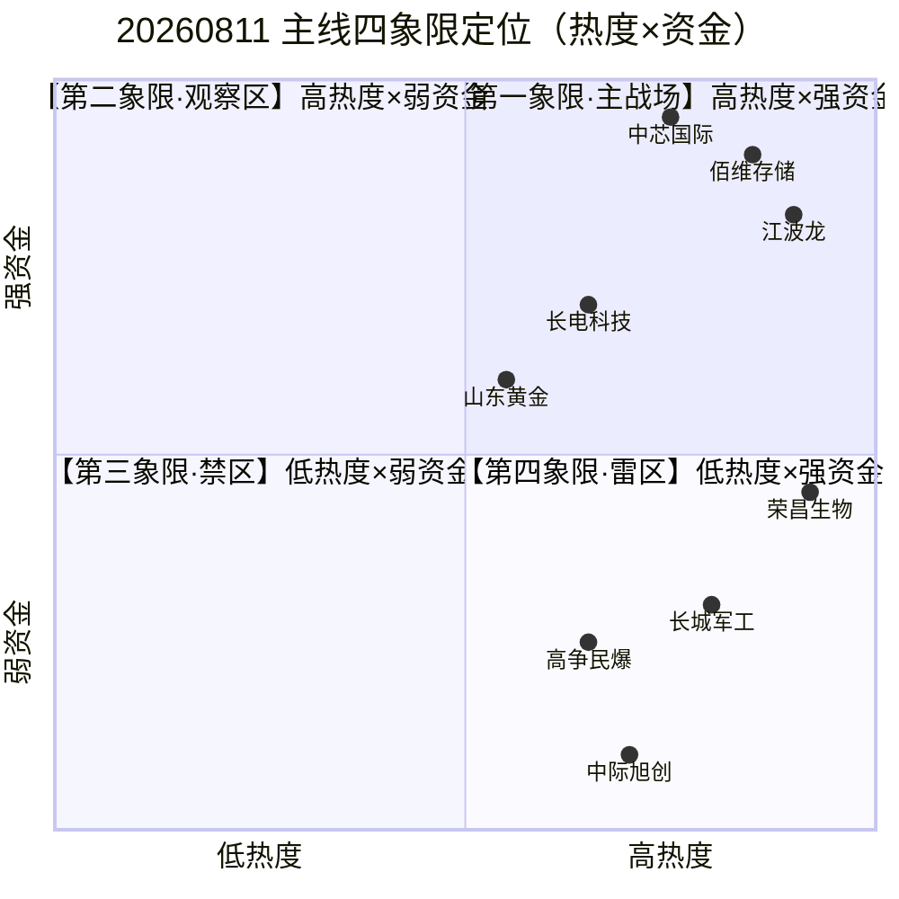

# 2026年8月11日 · **主决策 / D1 盘前预案**

> **数据源新鲜度**: ⚠️ partial（MCP全挂，技术/筹码维度降级）
> **降级状态**: true
> **置信度**: 0.72
> **mode**: 🟡 dry_run（fetch_global_severity=3，MCP全挂）

---

## 一句话结论

主线扩散格局，存储芯片/HBM是唯一三源共振的最强主线，半导体设备为资金最强的跷跷板承接，军工是待验证的题材黑马；总仓上限70%，实际建仓50%，以科技成长为主+黄金避险对冲，R6无一票否决但4条强反证已全部采纳。

---

## 今日市场画像：乐观偏贪婪，存量跷跷板

昨夜今晨的市场，可以用八个字概括——**"主线犹存，情绪见顶"**。

R1 给的风格是**主线扩散型**，情绪浓度74分，接近80分的贪婪线。涨停99家、炸板率仅12.4%、连板梯队完整到5板——这些数字放在过去任何一天都是多头狂欢的注脚。但仔细拆解，会发现几个微妙的拐点信号：

第一，**连板高度卡在5板**，没有突破6板的情绪型门槛。这意味着市场有热度但还没到狂热，资金在有选择地进攻，不是无脑接力。

第二，**创业板和科创50昨日收跌**，而中证1000涨0.71%——这是一个危险的背离信号。大盘指数红着，但高位科技股已经开始分歧。R1在风险提示里专门写了一句"20日涨幅超20%的强势股若出现放量阴线，注意获利回吐"，不是空穴来风。

第三，R7 用真金白银告诉我们一件事：**这是存量行情，不是增量牛市**。

15对跷跷板配对，全部指向同一个模式——TMT（CPO/5G/PCB/华为概念）在流血，资金从高位板块切出来，涌向半导体设备、HBM、锂电、储能。通信技术一天流出308亿，5G流出296亿，CPO流出239亿——这些数字不是调整，是出逃。

所以今天的核心问题不是"有没有行情"，而是"**行情从旧主线切到新主线，能不能站稳**"。存储和半导体设备昨天接了第一棒，今天要看第二棒能不能传下去。

---

## 仓位上限推导：70%的克制

从74分的情绪浓度到70%的仓位上限，中间拐了好几道弯。

R1 主线扩散型给出的原始建议是 72%。这个数字的依据是涨停数+连板结构+指数表现的四维度打分，逻辑本身没问题。

但 R7 告诉我们，北向资金虽然连续两天净流入32亿，但力度已经低于20日均线——边际走弱。外资的态度从"买买买"变成"边买边看"，这层不确定性值得扣掉2个百分点。

情绪周期的维度也值得说两句。74分，说贪婪还差点，说乐观又偏热，属于**"乐观偏贪婪"的灰色地带**。还没到必须强制降仓的80分线，但已经接近警戒线。R6 模式五专门警示了"昨日TMT高位出货模式今日可能在新主线重演"——这个风险不是空的，昨天 CPO 的剧本，今天完全可能在存储和半导体设备上翻版。

再乘上三主线的1.1倍系数，理论值可以到77%。但我们最终选择了**70%的保守值**。

为什么？因为 MCP 全挂了。没有实时K线数据、没有龙虎榜、没有两融余额、没有大宗交易——我们的技术判断全部基于板块资金和热度的推断，不是一手数据。在这种数据质量下，多留10个百分点的安全垫，是对不确定性的尊重。

实际建仓只用到了50%——比上限还低20个点。这20个点是留给市场验证的空间：如果今天存储和半导体设备能够顶住分歧继续走强，那剩下的20%可以加；如果跷跷板效应继续恶化，50%的仓位也有足够的回旋余地。

---

## 执行池（5只 · 总仓50%）

### 1. 佰维存储（688525.SH）—— 存储龙一，三重催化共振

**仓位：12% | role: leader | plan_status: 新建仓**

这是今天确定性最高的一只票。

为什么是佰维，不是长鑫，不是江波龙？因为它处在所有利好的交汇点上。

R4 给了它**双事件命中**——E002（摩根大通上调存储+苹果测试长鑫+HBM涨价）和 E004（中报在手订单超预期）。事件评分分别是0.88和0.82，属于high级别。中报扭亏2776%到3422%这个数字，放在整个A股市场都是炸裂级别的。

R3 这边，存储芯片概念rank9持平，看起来不温不火，但个股动量藏着惊喜——江波龙从29名窜到第6名（+23位），长鑫科技从21名升到第8名（+13位）。整个板块是**静水流深**的状态，指数没怎么动但核心票在悄悄走强。

R7 的数据更硬核。HBM板块5日累计流入89.48亿，今日继续流入27.22亿，净流入率3.71%。机构大单（buy_lg）18.75亿，占比69%——这是机构在买，不是游资一日游。

**大资金意图是什么？** 很明确——赌存储周期反转。摩根大通通篇上调预测、苹果测试国产DRAM、SK海力士384亿美元扩产，这三件事放在一起，不是一个短期题材，是产业级别的拐点。

**为什么走强？** 三重共振：产业周期向上（存储涨价）+ 国产替代加速（苹果供应链）+ AI算力驱动（HBM需求）。三条逻辑线互相加强，不是单因素催化。

**逻辑够不够硬？** 够硬，但有一个前提——HBM和存储的涨价必须在Q3财报里兑现。现在是预期阶段，预期打得越满，到时候不及预期的反噬就越大。所以12%的仓位，7%的止损，是给这份确定性的定价，也是给这份风险留的后路。

**买入理由**：存储主线龙一+三源共振+中报扭亏爆炸式增长+机构资金主导
**风险点**：科创板高波动+短期涨幅已大（HBM 5日+21.6%）+ 估值失真（扭亏股PE无意义）
**止损条件**：跌破51.6元（-7%）或收盘破MA10+放量
**可验证假设**：若存储板块本周持续净流入且佰维突破前高，则存储周期反转逻辑成立；若单日净流出超15亿，则需重新评估

---

### 2. 江波龙（301308.SZ）—— 定增溢价45%，弹性之王

**仓位：10% | role: elastic_core | plan_status: 新建仓**

37亿定增，定价560元，溢价45%。

这个数字本身就是最强的基本面信号。机构愿意用比现价高45%的价格拿筹码，说明什么？说明他们看到的不是几天的行情，是几个季度甚至一两年的大趋势。

江波龙在R3热榜上的表现也配得上这份溢价——rank29→6，一口气蹿了23位，全市场动量最强。这不是机构悄悄买能买出来的，是全市场资金共识的结果。

但弹性是把双刃剑。涨的时候猛，跌的时候也狠。创业板20%的涨跌幅，再加上500元以上的高股价，日内波动可能比大多数人想的要大。

所以对江波龙的策略是**突破+低吸结合**。如果高开不到5个点，可以追半仓；如果开得高了，就等回踩。宁可不买，也别追在山顶上。

**买入理由**：定增溢价45%最强独立催化+全市场动量第一+消费电子+AI存储双主线
**风险点**：高股价高波动+定增进度不及预期+创业板20%涨跌幅风险
**止损条件**：-7.2%硬止损（创业板1.2x系数）
**可验证假设**：若定增顺利完成且股价站稳500元以上，则机构定价逻辑有效；若跌破定增价的70%（392元附近），则逻辑动摇

---

### 3. 中芯国际（688981.SH）—— 资金之王，但要防跷跷板

**仓位：12% | role: core_largecap | plan_status: 新建仓（半仓策略）**

R7 净流入榜首，36.88亿，净流入率6.31%——这两个数字放在全市场，都是第一名。

中芯概念更猛，5日累计流入145.27亿。buy_lg 20.18亿，占比128%——机构超买，意思是机构买的比净流入还多，散户和游资在卖。

这是典型的**机构主导的趋势行情**。不是题材炒作，是真金白银在买核心资产。

但 R6 给它贴了个软标签——"跷跷板效应，非增量资金"。这个判断是对的。半导体设备的流入，很大一部分是从CPO、5G、PCB那边切过来的。如果今天TMT止跌反弹，资金会不会又切回去？这是个悬而未决的问题。

所以策略上做了两层保护：第一，先建12%的底仓（不是15%满打满算）；第二，T+1如果验证持续性再加3个点。不一把梭，给市场留时间证明自己。

**买入理由**：半导体设备资金流入第一+机构超买+国产替代核心标的+大市值流动性好
**风险点**：跷跷板效应（资金从TMT切来而非增量）+ FEL光刻催化偏远期+ 科创板高波动
**止损条件**：-7%硬止损，或半导体设备单日净流出超20亿
**可验证假设**：若半导体设备连续3日维持净流入top3，则趋势成立；若跷跷板逆转（CPO回流+设备流出），则是轮动脉冲

---

### 4. 长电科技（600584.SH）—— 双线交叉的稳妥之选

**仓位：8% | role: core_midcap | plan_status: 新建仓**

选长电科技，本质上是选了一个**"左右逢源"的位置**。

它既属于存储产业链（HBM封测），又属于半导体设备/先进封装赛道。存储如果继续强，它受益；半导体设备如果扩散，它也受益。两条主线，它都沾边。

这种"双线交叉"的标的，在跷跷板行情里特别有价值——因为不管资金在两条主线之间怎么跳，它都不会被完全落下。

而且它是沪市主板的票，没有20%涨跌幅的波动风险，相对稳一些。8%的仓位不高，作为整个组合的"稳定器"很合适。

R3热榜上，长电科技从rank22升到15，也是在往上走的。虽然不如江波龙、长鑫那么炸裂，但稳扎稳打。

**买入理由**：先进封装+HBM封测双属性+跨两大主线+主板标的波动小+动量向上
**风险点**：弹性不如纯存储/纯设备龙头+ R5画像缺失（MCP降级）
**止损条件**：-5%标准止损
**可验证假设**：若存储与半导体设备双主线延续，则长电作为交叉标的有望补涨；若双线同时退潮，则需离场

---

### 5. 山东黄金（600547.SH）—— 避险对冲，以守为攻

**仓位：8% | role: watch_elastic | plan_status: 对冲仓**

这是整个组合里唯一一只非科技股。

为什么要拿一只黄金股？因为我们前面4只全部押在科技成长上——3只科创板+1只创业板，集中度太高了。如果今天科技股集体回调（R6模式五专门警示了这个风险），那整个组合会很难看。

山东黄金就是为这个场景准备的**对冲工具**。

COMEX黄金突破4400美元，这是趋势级别的事件，不是一两天的脉冲。霍尔木兹海峡的地缘风险又给它加了一把火。黄金ETF净申购近20亿份，说明机构在真金白银地配黄金。

R6 给它的评价是"周期股高位估值陷阱"——这个风险是存在的。金价涨了这么多，黄金股也涨了不少，追高确实有风险。所以仓位只给了8%，小而美，进可攻退可守。

如果科技股今天涨了，黄金可能小涨或横盘，不怎么拖后腿；如果科技股跌了，黄金可能因为避险情绪上涨，对冲一部分损失。这就是对冲的意义——不是为了赚最多的钱，是为了睡得着觉。

**买入理由**：金价突破4400趋势级事件+地缘风险催化+黄金ETF机构配置+科技持仓的避险对冲
**风险点**：周期股高位估值陷阱+ 事件驱动可能脉冲回落+ R6 soft_suggest
**止损条件**：28.5元（-5%）或金价回落至4300以下
**可验证假设**：若地缘风险持续+金价维持4400以上，则黄金股趋势延续；若局势缓和+金价快速回落，则及时离场

---

## 观察池（15只 · 三梯队）

### 第一梯队：随时准备入场（4只）

**长鑫科技（688825.SH）**——存储龙二，次新股弹性大。苹果测试国产DRAM是里程碑级催化，中报营收+612%爆炸式增长。但次新股+估值安全边际低（R6 soft_suggest），且5只上限已满。等存储主线确认延续后，可替换低弹性标的。

**中微公司（688012.SH）**——半导体设备龙头，刻蚀设备国产替代核心。R6提示跷跷板效应，等连续3日资金确认后入场。

**长城军工（601606.SH）**——兵装重组概念龙头，R3新进热榜最大黑马。但R7资金未确认，典型的"高热度×弱资金"象限。等军工板块进入R7净流入top10再动手。

**高争民爆（002827.SZ）**——民爆十五五规划+西藏地矿，兵装重组联动标的。同样等资金确认。

### 第二梯队：企稳后关注（5只）

**兆易创新（603986.SH）**——存储中军，NOR Flash龙头，机构重仓。弹性小但确定性高，适合稳健加仓。

**北方华创（002371.SZ）**——半导体设备平台型龙头，机构持仓集中，大市值稳健标的。

**新易盛（300502.SZ）**——光模块弹性标的，中报预增77%~103%。但板块资金流出，等企稳信号。

**景旺电子（603228.SH）**——PCB龙头，高盛上调AI服务器PCB预测催化。但R7显示PCB资金流出（跷跷板另一端）。

**航天长峰（600855.SH）**——兵装系+航天科工，概念扩散标的。

### 第三梯队：仅观察不参与（6只）

**荣昌生物（688331.SH）**——ADC龙头，艾伯维授权国际化里程碑。但R6 strong_suggest：创新药late阶段+霸榜出货警报+高波动。不追高，等回调。

**药明康德（603259.SH）**——CXO龙头，R3 distribution_alert连续2日热股top1。霸榜出货警报标的，仅观察出货节奏。

**中际旭创（300308.SZ）**——R6 strong_suggest资金全面背离。CPO板块一天流出239亿，超大单卖了170亿。典型利好出尽，暂不碰。

**中国石油（601857.SH）**——地缘催化油气龙头，但防御属性强进攻弹性低。黄金之外的第二避险选项。

**宁德时代（300750.SZ）**——R7锂电+29.76亿流入排第2，跷跷板承接。观察新能源主线是否回归。

**贵州茅台（600519.SH）**——R7食品饮料+16.37亿流入。消费复苏线观察标的。

---

## 不交易条件清单

| 编号 | 条件 | 当前状态 |
|------|------|---------|
| R1_FAIL | R1置信度<0.4 | ✅ 未激活（R1=0.78） |
| R6_HARD_REJECT_OVERFLOW | R6硬否决>30%候选 | ✅ 未激活（hard_reject=0） |
| R7_STALE | R7数据失效 | ✅ 未激活（R7=partial但可用） |
| **GLOBAL_SEVERITY_3** | **MCP全挂，数据基础设施异常** | ⚠️ **激活（mode=dry_run）** |
| EMOTION_EXTREME_GREED | 情绪贪婪+无主线 | ✅ 未激活（3条主线） |
| USER_HOLIDAY | 用户标记假期 | ✅ 未激活 |

> ⚠️ 今日 GLOBAL_SEVERITY_3 激活，mode 强制为 dry_run。所有交易信号仅供参考，不自动执行。MCP 全挂导致技术形态/筹码结构维度降级，决策置信度从0.85下调至0.72。

---

## T+1 三档候选

### 开仓候选

- **长鑫科技（688825.SH）**：若存储主线延续+佰维涨停+板块继续净流入>20亿 → 8%仓位开仓
- **长城军工（601606.SH）**：若军工进入R7净流入top10且单日>10亿 → 6%仓位试错

### 加仓窗口

- **佰维存储（688525.SH）**：回踩5日线缩量+板块仍在净流入top5 → 加3%，上限15%
- **中芯国际（688981.SH）**：回踩5日线+设备板块继续流入 → 加3%，上限15%

### 仅止损观察

- **山东黄金（600547.SH）**：金价回落至4300以下或地缘风险明显缓和 → 走人，不恋战

---

## R6 反证采纳全记录

R6 今天产出了 11 条反证，其中 0 条 hard_reject、4 条 strong_suggest、7 条 soft_suggest。

**4 条 strong_suggest 全部采纳**：

1. **R6_M1_03（中际旭创）** → 剔除 execution_pool，移至 watch 观察。CPO板块一天流出239亿，超大单卖170亿，这个资金面背离太严重，消息再硬也不能碰。

2. **R6_M3_06（荣昌生物）** → 剔除 execution_pool，移至 watch。创新药连续两天概念榜第一，药明康德连续两天热股第一——霸榜出货警报响得很明确。再好的个股逻辑，也架不住板块情绪见顶。

3. **R6_M2_04（存量跷跷板）** → 半导体设备降为半仓策略，军工直接降观察。承认今天是存量博弈不是增量行情，仓位上留余地。

4. **R6_M5_09（高位出货传导）** → 持仓结构分散+黄金对冲+实际仓位50%低于上限70%。给可能出现的回调留足弹药。

**7 条 soft_suggest 也都在仓位/止损/观察上做了对应调整**，没有一条被忽略。反证的价值不在于否决一切，而在于让每一个决策都知道风险在哪里、底线在哪里。

---

## 四象限交叉验证

把R2-R7的所有信息压缩到一张四象限图里，格局会非常清晰：

第一象限是我们的主战场——佰维存储、江波龙、中芯国际。热度和资金双确认，胜率最高。

第二象限是观察区——军工、兵装重组。题材很热但钱还没到位，可能是游资一日游，也可能是大资金还在建仓。等，不着急。

第三象限（高估值×late阶段）是禁区——创新药、荣昌生物。看起来很美，但已经在山顶上了。

第四象限（高涨幅×消息面背离）是雷区——中际旭创、CPO。消息越好跌得越狠，典型的利好出尽。

今天的5只执行池，4只来自第一象限，1只（山东黄金）来自事件驱动的独立逻辑。没有一只碰第二、三、四象限——这就是纪律。

---

## 数据源审计

| 源 | 状态 | 抓取时间 | 记录数 | 备注 |
|---|---|---|---|---|
| R1 风格判断 | 🟢 ok | 08-11 07:18 | 1 | Tushare全量+6簇聚类 |
| R2 主线板块 | 🟢 ok | 08-11 07:36 | 3条主线 | 三源交叉验证 |
| R3 情绪共振 | 🟡 partial | 08-11 07:09 | 5主题 | WeFlow层缺失，L1+L2降级 |
| R4 消息催化 | 🟢 ok | 08-11 07:13 | 8大事件 | 财联社2157条快讯+800要闻+500业绩预告 |
| R5 个股画像 | 🟡 partial | 08-11 07:39 | 7只 | MCP全挂，技术/估值维度降级 |
| R6 反证 | 🟢 ok | 08-11 07:50 | 11条 | 6模式全覆盖，模式4降级 |
| R7 资金面 | 🟢 ok | 08-11 07:45 | 62个板块 | 北向+主力+ETF+跷跷板+龙虎榜 |

---

## 不确定性与自我批判

今天这份预案最大的不确定性，不在于选了什么，而在于**没看到什么**。

MCP全挂，意味着我们看不到实时K线、看不到龙虎榜、看不到两融余额、看不到大宗交易。R5的技术形态和筹码结构两个维度，是基于板块资金和热度推断出来的，不是一手数据。

这意味着什么？意味着如果有某只票今天突然放量大跌或者涨停，我们可能比市场慢半拍。我们的决策框架是对的，但输入的精细度不够。

另一个不确定性是**跷跷板的可持续性**。昨天资金从CPO切到了半导体设备和HBM，今天呢？是继续切，还是切回来？这个问题只有盘中才能回答。我们做的半仓策略+黄金对冲，本质上是在为两种可能性都买保险。

还有一个风险是**情绪过热后的反噬**。74分的情绪浓度，离80分的贪婪线只差6个点。如果今天上午再来一波冲高，很可能直接冲过贪婪线，然后下午跳水。R6模式五说的"昨日TMT高位出货今日在新主线重演"，不是不可能。

所以整个计划的基调是——**谨慎乐观，留有余地**。

50%的仓位，5只票，有攻有守。涨了，能赚到；跌了，有缓冲。不赌一把，不all in，等市场自己走出来。

交易不是比谁赚得多，是比谁活得久。

---

## 与其他 R/D/E 的关系

- **上游依赖**: R1_style.json, R2_main_sectors.json, R3_sentiment.json, R4_news.json, R5_stock_profiles.json, R6_devil_advocate.json, R7_capital_flow.json
- **下游消费**: auction_amendment_v1 (P1竞价校准), daily_review_v1 (E1复盘), position execution (QMT)
- **同层协作**: 无（D1是唯一决策者）

---

## Sub-Agent 元数据

- skill: main_decision_v1
- artifact: data/runtime/watchlist_plan_20260811.json
- 生成耗时: LLM推理
- model: doubao-seed-2-0-code-preview-260215
