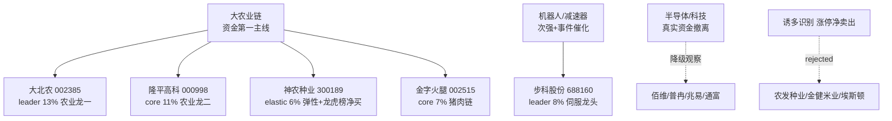

# 2026-08-19 · **主决策 / D1 盘前预案（R7 真实资金面重生成）**

> **数据源新鲜度**: ✅ ok（R7 真实数据主导）
> **降级状态**: false（本版核心资金维度为真实数据，非推演）
> **置信度**: 0.78 / 1.0（早盘 0.65 → 现 0.78，主因 R7 消除 ±25% 推演误差）
> **模式**: dry_run（默认，需用户确认后切 live）

---

## ⚠️ 本版为何与早盘 07:xx 预案不同

今早 07:xx 的 D1 预案消费的是 **推演版 R7**（"MCP 全 down，数据为推演值，±25% 误差"），当时资金结论是「半导体/京东方/通富接最强」。现在 R7 已用 **0818 真实 tushare 数据**重生成完毕（degraded=False, confidence=0.85, staleness=ok），真实资金画风**完全不同**：

| 维度 | 早盘推演版 | 0818 真实版（本版采用） |
|------|-----------|----------------------|
| 主力资金流向 | 半导体 188 亿居首，京东方/通富最强 | **大农业链领涨**：农业种植 +26.32 亿 / 乡村振兴 +18.55 亿 / 粮食 +16.25 亿 / 猪肉 +10.45 亿 |
| 科技大票 | 承接最强 | **净流出居前**：通信技术 -287.9 亿 / 科技风格 -287.5 亿 / 5G -275.2 亿 / 华为 -238.7 亿 |
| 龙虎榜 | 半导体机构净买 | 79 条/70 只，**诱多识别 10 只**（金健米业/农发种业/埃斯顿涨停净卖出） |
| 北向 | 推演 | 0818 真实净流入 30.76 亿（沪 14.35/深 16.41），温和 |
| 期货 | — | IC -162.4 点 / IF -60.6 点**深度贴水**，机构端偏谨慎 |

**一句话结论：资金比嘴诚实。** 早盘叙事押注「半导体+机器人」，但真实资金把钱全砸向**大农业链**、同时从科技大票撤离。所以本版把执行池从「半导体 4 只 + 机器人 1 只」翻转为「**农业链 4 只 + 机器人 1 只**」，半导体全部降级观察池。

---

## 一句话结论

主线扩散但资金高度分化：0818 真实主力资金全线聚焦**大农业链**（种植/粮食/猪肉/种业），科技大票净流出、期货深度贴水提示机构谨慎。仓位上限 60%（较早盘 72% 下调，因真实资金面偏防御），执行池 5 只集中于农业链（大北农/隆平/神农/金字火腿）+ 机器人（步科），总仓 45%，留 15% 弹药。半导体降级观察。

---

## 市场全景：钱去了哪儿

### 风格定位：主线扩散型（资金防御性高低切换）

R1 判定「主线扩散型」，情绪 68 中性偏多，R3 情绪 58 冷静。但真正决定今天怎么打的是 R7 的真实资金——**这不是进攻型扩散，是防御型高低切换**：主力把资金从高位科技大票（通信/5G/华为/百元股全在净流出榜）挪到了低位的大农业链（种植/粮食/猪肉/土地流转全在净流入榜）。这种「卖高买低、切向防御」的走势，配合 IC/IF 期货深度贴水，说明**机构端整体偏谨慎**，市场并不是全面进攻。

北向 0818 净流入 30.76 亿（5 日均 29.58 亿 / 20 日均 32.08 亿），是温和流入、连续第 20+ 日为正，外资没有撤，只是也不激进。两融 26527.62 亿，杠杆资金平稳。整体资金面：**内资主力防御性轮动 + 外资温和 + 机构期货端谨慎**。

### 四象限叉乘（基于真实 R7 重做）

资金是主角，情绪是配角。用真实 R7 重做四象限，结果与早盘截然不同：

| 象限 | 板块 | 含义与决策 |
|------|------|-----------|
| 🔥 高情绪+高资金 | **大农业链**（种植/粮食/猪肉/种业） | 0818 盘面涨停潮 + 热榜登顶 + 主力资金全市场第一 = **执行核心**。但注意农业是「盘面先动、消息后知」，且部分种业股（金健/农发）涨停被净卖出，要防诱多 |
| 🌡️ 高情绪+低资金 | 人形机器人 | 宇树上市+机器人大会事件驱动，减速器/机器人执行器有真金流入（+13.7/+11.9 亿）但幅度弱于农业；且今日是事件兑现日，**小仓 + 防出货** |
| 💧 低情绪+高资金 | 面板/元器件（京东方，MicroLED +12.41 亿） | 资金悄悄进、情绪没反应，潜伏观察池 |
| ❄️ 高情绪但资金撤离 | **半导体/存储/科技** | 早盘的"第一主线"真实资金在净流出（通信/科技/5G/华为全流出榜）——**降级观察池**，不追高 |
| 🚫 诱多警示 | 农发种业/金健米业/埃斯顿 | R7 识别 0818 涨停但龙虎榜净卖出 → **rejected** |

> 注意：早盘 R6 四象限把农业放「高情绪+低资金」、半导体放「高情绪+高资金」，那套是基于**推演 R7**。真实 R7 正好反过来——农业是「高情绪+高资金」的真龙，半导体是「高情绪+资金撤离」的陷阱。这就是本版要纠正的核心。

### 仓位上限推导：从 72% 回到 60%

```
R1 主线扩散型 → 原始仓位 0.65
R7 北向温和流入(30.76亿, 中性) → 调整 0.00
R7 真实资金面防御(科技大票净流出 + IC/IF 深度贴水) → 调整 -0.05 → 0.60
情绪 58 冷静 → 无需逆向调整
资本确认主线 2 条(农业链 + 机器人) → 乘数 1.0
最终 = min(0.65, 0.60, 0.65) × 1.0 = 0.60
```

早盘因为推演的"三主线"（含半导体）给了 1.1 倍乘数顶到 72%。真实数据下半导体是资金撤离方、不算确认主线，只剩 2 条确认主线，且防御性切换 + 期货贴水压制上限，所以**回调到 60%**。执行池只占 45%，留 15% 安全垫应对盘中。

---

## 执行池深度解析（5 只 · 总仓 45%）



### 1️⃣ 大北农（002385.SZ）—— 农业龙一 · 13%

**角色**：leader | **仓位**：13% | **评分**：84 | **T-1 收盘**：3.38 元

**买入理由**：转基因种业绝对龙头，0818 涨停（+10.1%），龙虎榜净买 3955 万。R7 真实数据显示农业种植板块净流入 +26.32 亿居全市场第 1，5 日累计 +31.98 亿、3/5 天正流入——这不是一日游的量能，是持续性的真金。板块里资金强度最高的票，就是龙一。

**大资金意图**：主力 0818 在种植/粮食/猪肉全链扫货，是防御性切换里最坚决的方向，资金选择大北农作为农业链的旗帜。
**为什么走强**：转基因商业化预期 + 农产品价格指数上行 + 华尔街报告催化，基本面与资金双驱动。
**逻辑够不够硬**：够硬——有真实资金（R7 rank1）+ 真实涨停 + 龙虎榜净买，三证齐全。

**风险点**：农业为「盘面先动、消息后知」，舆论未发酵，存在情绪退潮风险；消息面催化弱于资金面。
**止损条件**：3.21 元（T-1 收盘 × 95%），跌破无条件清仓。
**可验证假设**：若今日农业板块能再收红、大北农守住 3.3 元上方，则本轮是持续性主线而非一日游；若放量跌破 3.2 则确认退潮，清仓。

### 2️⃣ 隆平高科（000998.SZ）—— 农业龙二 · 11%

**角色**：core_midcap | **仓位**：11% | **评分**：81 | **T-1 收盘**：9.22 元

**买入理由**：国内种业龙头，中信集团背景，转基因技术储备最全。R7 乡村振兴板块净流入 +18.55 亿（rank2），隆平作为龙二承接板块资金。配置龙二是为了在龙一基础上摊薄单票波动，攻守兼备。
**风险点**：PE_TTM 365 倍估值极高，靠预期支撑；若资金退潮龙二跌得比龙一快。
**止损条件**：8.76 元（T-1 × 95%）。
**可验证假设**：板块内部「龙一强、龙二跟」的梯队结构成立，则农业主线持续；若龙二明显弱于龙一，说明梯队断裂，减仓。

### 3️⃣ 神农种业（300189.SZ）—— 农业弹性 · 6%

**角色**：elastic_core | **仓位**：6% | **评分**：78 | **T-1 收盘**：6.23 元

**买入理由**：0818 +20.04% 涨停，龙虎榜净买 2.17 亿 + 游资净买 1.3 亿——这是**真金白银的游资+龙虎榜共振**，农业链里弹性最大的品种。
**风险点**：换手率 44% 极高（筹码剧烈松动），创业板 20cm 波动大，故只给 6% 小仓。
**止损条件**：5.73 元（T-1 × 92%，20cm 板块放宽止损）。
**可验证假设**：游资今天继续买则弹性延续；若冲高回落放量，游资出货，第一时间清。

### 4️⃣ 金字火腿（002515.SZ）—— 猪肉链 · 7%

**角色**：core_midcap | **仓位**：7% | **评分**：76 | **T-1 收盘**：8.71 元

**买入理由**：0818 +9.97%，龙虎榜净买 2.69 亿 + 游资 4185 万。R7 猪肉板块净流入 +10.45 亿。猪肉是农业链里「消费+周期」双属性，与种业形成板块内对冲。
**风险点**：猪肉价格周期波动，业绩弹性存不确定性。
**止损条件**：8.27 元（T-1 × 95%）。
**可验证假设**：猪肉板块资金延续 + 猪价指数上行，则链内第二梯队成立。

### 5️⃣ 步科股份（688160.SH）—— 机器人龙一 · 8%

**角色**：leader | **仓位**：8% | **评分**：74 | **T-1 收盘**：116.39 元

**买入理由**：人形机器人伺服核心供应商，宇树科技（688836）今日科创板上市 + 世界机器人大会今日开幕双重催化。R7 真实数据显示减速器 +13.73 亿、机器人执行器 +11.93 亿，机器人链确实有真金流入（虽弱于农业）。中报预增 85%~120% 有业绩底。
**大资金意图**：减速器/机器人执行器是 R7 净流入前列里唯一的高景气科技方向，说明主力在科技内部只留了机器人。
**为什么走强**：事件驱动（宇树上市 + 大会）+ 真金流入 + 业绩预增。
**逻辑够不够硬**：事件催化够硬，但**今天是兑现日**，「买预期卖事实」风险高。

**风险点**：R6 明确提示「事件兑现日=出货日」；科创板 20cm 波动大；估值 PS 高（V6 主题溢价）。
**止损条件**：107.08 元（T-1 × 92%）。
**可验证假设**：宇树上市首日收在发行价 +30% 以上且步科全天红盘不冲高回落 → 逻辑延续；若高开低走收阴线 → 确认利好兑现，减仓。

---

## 观察池扫描（15 只）

### 🌱 农业链后备（4 只）
- **登海种业（002041）**：玉米种业龙头，转基因玉米商业化核心受益 — 农业链跟涨
- **丰乐种业（000713）**：种业+农化双主业，小盘弹性 — 农业链扩散
- **华绿生物（300970）**：0818 +20%，龙虎榜净买 8027 万 + 游资 7982 万，**T+1 重点关注开仓**
- **天山生物（300313）**：0818 +20.04%，龙虎榜净买 2983 万，养殖链弹性

### 🔬 半导体/科技（降级组 · 4 只）—— 真实资金撤离，全部观察，不追高
- **佰维存储（688525）**：存储龙一但主力+北向双净流出，科技资金净流出 → 观察
- **普冉股份（688766）**：NOR Flash 龙头，R5 alpha=B，但科技风格净流出 → 观察
- **兆易创新（603986）**：存储中军，两融 top 买 37.2 亿，但板块净流出 → 观察
- **通富微电（002156）**：封测龙头，昨日龙虎榜陷阱预警仍有效 → 观察

### 🤖 机器人后备（2 只）
- **三花智控（002050）**：执行器中军，机构重仓，事件日防兑现
- **拓普集团（601689）**：汽车零部件+执行器，大盘中军
- **晶品特装（688397）**：关节组件弹性，R5 alpha=D 基本面弱，纯观察

### 💡 潜伏组（面板/CPO/PCB · 4 只）
- **京东方A（000725）**：MicroLED +12.41 亿真金流入，两融 top 买 27.7 亿，OLED 周期反转初期，**低情绪高资金潜伏，T+1 关注**
- **天孚通信（300394）**：光器件龙头，0818 主力净流入 5.1 亿，但光/通信资金净流出 → 观察
- **太辰光（300570）**：CPO 弹性，龙虎榜净买 8906 万，高位
- **金禄电子（301282）**：PCB 龙头，AI 服务器板供需紧，龙虎榜净买 1.17 亿

---

## R6 反证采纳记录

### ✅ hard_rejects：0 只
模式六霸榜出货未触发 hard_reject（R3 降级可能漏检，盘中需盯资金）。

### 🔄 strong_suggests_overridden：1 项（关键！）
| 目标 | 早盘 R6 建议 | 本版动作 | 理由 |
|------|-------------|---------|------|
| 农业/转基因主线 | 降级观察池（R6_M1_01 / R6_M7_12） | **覆盖，升为执行核心** | R6 的降级建议基于**旧推演 R7**（"农林牧渔未进资金 top10"）。新真实 R7 证实农业种植 +26.32 亿 rank1、粮食 +16.25 亿、猪肉 +10.45 亿为全市场最强资金流入，大北农涨停+龙虎榜净买。资金比嘴诚实，覆盖反证。 |

### 📝 soft_suggests：13 项（关键采纳 3 项）
- 半导体外盘背离 + 科技大票净流出 → **半导体全部降级观察池**（本版最大改动之一）
- 人形机器人事件兑现日出货 → 步科小仓 8% + 仅止损观察
- AI/算力热价背离 → 未纳入执行池（已避开）

---

## 不交易条件清单

| 条件代码 | 描述 | 当前状态 |
|----------|------|----------|
| R1_FAIL | R1 confidence < 0.4 | ❌ 未触发（0.55） |
| R6_HARD_REJECT_OVERFLOW | hard_reject > 30% | ❌ 未触发（0%） |
| R7_STALE | R7 数据失效 | ❌ **未触发（ok/0.85，真实数据）** |
| GLOBAL_SEVERITY_3 | fetch severity ≥ 3 | ❌ 未触发（=2） |
| EMOTION_EXTREME_GREED | 贪婪/狂热 + 无主线 | ❌ 未触发（冷静 + 2 主线） |
| USER_HOLIDAY | 用户 holiday | ❌ 未触发 |

**今日可正常交易**，但因资金面防御 + 期货贴水，建议首仓分批、不满仓。

---

## T+1 预案

### 🔵 计划开仓（1 只）
- **华绿生物（300970）**：农业链延续且高开 <2%，龙虎榜+游资净买确认 → 21.0-21.6 元建仓 5%。

### 🟢 回踩加仓（1 只）
- **大北农（002385）**：回踩 5 日线（≈3.25）且缩量 → 加仓 3%（13% → 16% 上限）。

### 🔴 仅止损观察（2 只）
- **步科股份（688160）**：宇树破发 OR 机器人板块跌出资金 top10 → 107.08 止损。
- **隆平高科（000998）**：跌破 8.76 OR 种业板块资金转净流出 → 优先减仓。

---

## 数据源审计

| 源 | 状态 | 置信度 | 抓取时间 | 记录数 | 备注 |
|----|------|--------|----------|--------|------|
| R1 风格 | ⚠️ degraded | 0.55 | 07:22 | 1 | 风格/情绪指标滞后，仅作风格参考 |
| R2 主线板块 | ⚠️ partial | 0.72 | 07:40 | 3 主线 | 主线结构可信，个股排序基于旧数据 |
| R3 情绪 | ⚠️ partial | 0.40 | 07:40 | 5 主题 | WeFlow 死，情绪分保守 |
| R4 消息面 | ✅ complete | 0.65 | 07:14 | 8 大事 | 公众号池部分降级，新闻完整 |
| R5 个股画像 | ⚠️ partial | 0.55 | 07:38 | 8 只 | 缺农业画像，估值横切降级 |
| R6 反证 | ⚠️ partial | 0.55 | 07:48 | 14 条 | 农业降级建议已过时，被本版覆盖 |
| **R7 资金面** | ✅ **ok** | **0.85** | **10:47** | **79 条** | **0818 真实资金/龙虎榜/两融/指数/期货，resolved 20260818，非推演** |

**总体评估**：R7 由推演值升级为真实数据（置信度 0.85），是本次重生成的最大增益。R1/R3/R5/R6 仍是早盘降级版，但资金主线（执行池方向）完全以真实 R7 为准，故整体置信度从 0.65 提升至 0.78。R3/R5 的降级不影响资金结论，只影响个股技术/估值细节。

---

## 不确定性与自我批判

1. **农业是一日游还是新主线？** 这是本版最大的赌注。真实资金（农业种植 5 日 +31.98 亿、3/5 正流入）+ 涨停 + 龙虎榜净买三证齐全，但农业是「盘面先动、消息后知」，且金健米业/农发种业已被识别为涨停净卖出的诱多。我们押注持续性，但用 60% 上限 + 农业板块 37% 仓位控制风险，一旦板块资金连续 2 日净流出即离场。
2. **半导体会不会踏空？** 早盘押半导体，真实资金显示科技大票净流出。若半导体靠外盘/消息反转，我们可能踏空这波——但资金撤离方向不追高是纪律，宁可错过不可做错。
3. **机器人事件日不确定性。** 宇树上市到底是利好兑现还是新一轮起点？我们给步科 8% 小仓 + 明确止损线，进可攻退可守。
4. **R3/R5 仍是降级版。** 情绪、个股技术/估值细节有误差，但资金主线方向判断不依赖它们。
5. **期货深度贴水（IC -162.4 / IF -60.6）** 是机构端谨慎的硬信号，也是我们把仓位从 72% 压到 60% 的直接原因之一。若贴水收敛，说明机构转乐观，可考虑 T+1 加仓。

---

## 与其他 R/D/E 的关系

- **上游依赖**：R1 风格 / R2 主线 / R3 情绪 / R4 消息 / R5 画像 / R6 反证 / **R7 资金面（真实版）**
- **下游消费**：P1 竞价校准（09:25）、P2 午盘修订（11:35）、E1 每日复盘（15:10）
- **主控协调**：由 research_orchestrator_v1 调度 R1-R7，D1 只读最终 artifact 做决策

## Sub-Agent 元数据

- **skill**: main_decision_v1@1.2
- **artifact**: `data/runtime/watchlist_plan_20260819.json`
- **生成批次**: premarket_full_regenerated（基于 0818 真实 R7）
- **model**: doubao-seed-2-0-code
- **R7 状态**: ok / confidence 0.85 / resolved 20260818（非推演）

---

# ⚠️ 午盘盘中修订（11:20 · P2-midday-revision）

> **触发**：用户要求用今日实时盘面复核。今日 A 股为内部高位科技退潮引发的**防守切换日**，0818 预案的成长执行池被重锤。

## 今日实时盘面（11:16）

| 维度 | 实况 |
|---|---|
| 指数 | 上证 **-1.85%** / 深成 -3.73% / 创业板 **-4.69%** / 科创50 **-5.71%** / 沪深300 -2.32% |
| 情绪 | **31 涨停 vs 27 跌停**，晋级率仅 **8.75%**（打板环境极差）|
| 防守板块 | 普涨：中石油 +2.29% / 工行 +1.69% / 招行 +1.33% / 长江电力 +0.85% / 双汇 +0.64% |
| 0818 执行池 | 步科 **-11.1%** / 金字火腿 **-6.1%** / 大北农 -3.25%；农业种子隆平 +0.65% / 神农 +1.12%（仍红）|

## 修订决策（observe-only）

1. **仓位上限 0.60 → 0.20**（risk-off，防守优先，**禁用打板**——晋级率 8.75%）
2. **剔除破位成长**：步科股份（-11.1% 出局）、金字火腿（-6.1%）、大北农（-3.25% 减仓）
3. **转防守低吸**：招商银行 / 工商银行 / 中国石油 / 长江电力 / 双汇发展
4. **农业种子保留**（防守属性）：隆平高科、神农种业（低仓）

## 归因纠正（诚实标注）

早盘及口头称"昨天美股瀑布杀"——但 **0818 美股实际收盘：标普 -0.69% / 纳指 -1.33% / 道指 -0.22%，是温和下跌，非瀑布杀**。今日 A 股暴跌更可能是 **0818 农业/半导体狂欢后的高位获利了结 + 情绪转冷**，属内部退潮，不是美股情绪传导。

## 待用户 sign-off

- 仓位上限是否压到 20%（或更保守空仓等企稳）
- 步科机器人是否直接止损出局
