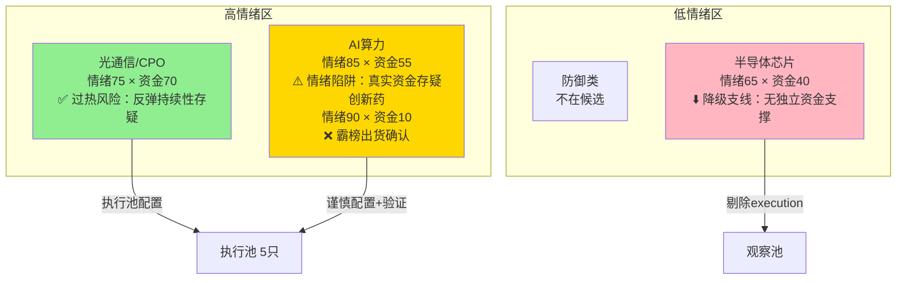

# 2026年8月24日 · 主决策 / D1 盘前预案

> **数据源新鲜度**: ⚠️ partial（R7 stale · R3/R5 degraded · MCP全down）
> **降级状态**: ✅ degraded
> **置信度**: 0.62 / 1.0（全链路降级打折扣）
> **模式**: 🟡 dry_run（默认，需用户确认后切 live）

---

## 一句话结论

主线扩散型 + 情绪中性偏乐观（57分），AI算力与光通信双主线有效，半导体降级支线。仓位上限 **55%**（R1 60% × 全链路降级惩罚-5%），执行池 **5只**（深信服/中际旭创/新易盛/英维克/浪潮信息）。**全链路降级态下不追高、不满仓，以实盘竞价验证为准。**

---

## 仓位上限推导链

| 维度 | 值 | 说明 |
|------|-----|------|
| R1 风格信号 | 主线扩散型 | 涨停62只 + 17个板块≥8只涨停有明确梯队 |
| R1 原始仓位上限 | 0.60 | 主线扩散型标准配置 |
| R7 北向强度 | mild_inflow_but_stale | +26.81亿但数据64h stale，不做调整 |
| R1 情绪分 | 56 | 偏中性区间，非极端 |
| R3 情绪分 | 59 | 与R1接近，交叉验证通过 |
| 情绪周期定位 | 乐观偏中性 | 57.5分，40-60区间，跟随R1不做override |
| R2 主线数量 | 3（有效2） | 半导体R6降级为支线，有效主线=2 |
| 主线乘数 | 1.0 | 2条主线 = 1.0倍基准 |
| 全链路降级惩罚 | -0.05 | MCP全down+R3 degraded+R7 stale → 降5% |
| **最终仓位上限** | **0.55** | min(0.60, 0.60, 0.60) × 1.0 - 0.05 = **0.55** |

> **推导公式**: `min(R1=0.60, R7_adj=0.60, emotion_override=0.60) × main_mult=1.0 + degradation=-0.05 = 0.55`

---

## 四象限定位

**四象限解读**：
- **高情绪高资金（绿区）**：光通信/CPO。情绪与资金共振最好，但要警惕30日深跌后的反弹持续性。配置2只（龙一龙二）。
- **高情绪低资金（黄区）**：AI算力。热度最高但资金面有分歧（R6指出人工智能板块净流出-22亿，5G概念流入≠纯算力）。配置3只（龙一/龙二/中军），但每只仓位控制在0.10-0.12，低于上限0.15。
- **低情绪低资金（红区）**：半导体芯片。全靠情绪扩散+题材轮动，无独立资金支撑，R6降级为支线。不进执行池，放观察池。
- **创新药**：高情绪零资金，R3 distribution_alert 霸榜出货确认，完全回避。

---

## 执行池（5只 · 总仓位 54%）

### 1. 深信服 300454.SZ（AI算力 · 龙一）

- **仓位**: 12% | **参考价**: 120.6元 | **PE**: 90
- **alpha**: A- | **role**: leader | **plan_status**: 新建仓

**买入理由**：
- AI算力龙一，中报大超预期——云计算&AI基础设施收入+58.6%，占比55%，企服五年衰退终结信号
- 2个群同时转发KOL强推，R4首推标的，周末4场卖方会议聚焦
- R3热榜液冷服务器热度+172%动量最强，深信服是核心受益标的
- H200对华放松 + 英伟达GPU涨价15% + 阿里800亿AI，三重催化叠加

**风险点**：
- PE 90 偏高，高增长是否可持续需验证
- R6_M1_01 警告AI算力资金面存分歧，谨防"借5G之名行科技股出货之实"
- 300开头20%涨跌幅，波动大

**止损条件**：
- 硬止损：买入价 × 0.93（-7%），无条件清仓
- 技术破位：收盘跌破MA10，减仓50%
- 板块降级：AI算力跌出涨幅前10，减仓50%

**可验证假设**：
- 若开盘1小时内AI算力板块净流入>30亿且深信服涨幅>5%，则资金确认，可持续持有
- 若开盘30分钟板块净流出>10亿，则警惕出货，降低仓位

---

### 2. 中际旭创 300308.SZ（光通信/CPO · 龙一）

- **仓位**: 12% | **参考价**: 943.0元 | **PE**: 74
- **alpha**: A- | **role**: leader | **plan_status**: 新建仓

**买入理由**：
- 光通信/CPO绝对龙头，全球1.6T光模块核心供应商
- 北美Lumentum/Coherent财报验证1.6T需求强劲，海外映射扎实
- NPO从CPO过渡方案升级为长期主流 + 腾讯明确表态，R4 high级催化
- R7四象限唯一 high_emotion_high_capital，资金面相对最扎实

**风险点**：
- 绝对股价高（943元），散户参与度低，机构盘特征明显
- 30日深跌后反弹，MA60压制下持续性存疑
- R7数据stale，周一资金方向可能反转

**止损条件**：
- 硬止损：买入价 × 0.93（-7%）
- 技术破位：收盘跌破MA10，减仓50%

**可验证假设**：
- 若光通信板块开盘半小时净流入>20亿且中际旭创放量，则趋势确认
- 若新易盛/通鼎互联涨停而中际旭创滞涨，警惕资金炒小票弃龙头

---

### 3. 新易盛 300502.SZ（光通信/CPO · 龙二）

- **仓位**: 10% | **参考价**: 442.0元 | **PE**: 57
- **alpha**: A- | **role**: core_midcap | **plan_status**: 新建仓

**买入理由**：
- 光通信龙二弹性标的，PE=57为板块估值洼地，相对安全
- R4首推，NPO+高速连接器双催化
- 热榜CPO排名#3，光纤概念排名#14（+2位，+71%热度）
- 中际旭创→新易盛的龙一龙二传导逻辑清晰

**风险点**：
- 龙二弹性大但持续性通常弱于龙一
- 若光通信只是一日游，龙二跌得更猛

**止损条件**：
- 硬止损：买入价 × 0.93（-7%）
- 止盈：+18%减半仓（弹性更大）
- 板块降级：CPO跌出涨幅前5，减仓50%

---

### 4. 英维克 002837.SZ（AI算力 · 龙二 · 液冷）

- **仓位**: 10% | **参考价**: 54.12元 | **PE**: 143
- **alpha**: B+ | **role**: core_midcap | **plan_status**: 新建仓

**买入理由**：
- 液冷服务器绝对龙头，AI算力散热核心受益
- R3热榜液冷服务器热度+172%，全市场动量第一（从19→8）
- AI算力渗透率提升，液冷从可选变必选，赛道逻辑硬

**风险点**：
- ⚠️ PE 142.92 严重偏高，R6估值×主线临界模式警告
- 高估值票容错空间小，一旦逻辑证伪杀估值很猛
- R6_M3 弹性龙二集群估值泡沫化警告

**止损条件**：
- 硬止损：买入价 × 0.93（-7%）
- 技术破位：收盘跌破MA5即减仓50%（高估值票破5日线就走）
- 止盈：+15%减半仓

**特别关注**：这是执行池中估值最高的票，也是最危险的票。若开盘不及预期，优先砍这只。

---

### 5. 浪潮信息 000977.SZ（AI算力 · 中军）

- **仓位**: 10% | **参考价**: 76.35元 | **PE**: 44
- **alpha**: B+ | **role**: core_largecap | **plan_status**: 新建仓

**买入理由**：
- AI服务器龙头中军，市值最大流动性最好
- H200边际放松 + 算力需求释放双重催化
- 机构重仓，PE=44在算力板块中估值合理
- 作为算力链风向标，中军走势=板块趋势

**风险点**：
- 中军弹性不如小票，进攻性弱
- R6警告AI算力资金面存分歧，中军若走弱则整个板块危险
- 盘子大，游资拉不动，靠机构资金

**止损条件**：
- 硬止损：买入价 × 0.95（-5%，中军波动小破位即走）
- 止盈：+10%减6成，剩余留底仓
- 资金信号：AI算力单日流出>50亿，减仓50%

---

## 买卖节点合理性校验

| 标的 | 买入价 | 止损价 | 止盈价 | 买入/现价 | 止损/买入 | 止盈/买入 | 结果 |
|------|--------|--------|--------|----------|----------|----------|------|
| 深信服 | 123.01 | 114.40 | 141.46 | 1.02x ✅ | 0.93x ✅ | 1.15x ✅ | valid |
| 中际旭创 | 971.29 | 903.30 | 1116.98 | 1.03x ✅ | 0.93x ✅ | 1.15x ✅ | valid |
| 新易盛 | 450.84 | 419.28 | 532.00 | 1.02x ✅ | 0.93x ✅ | 1.18x ✅ | valid |
| 英维克 | 55.74 | 51.84 | 64.10 | 1.03x ✅ | 0.93x ✅ | 1.15x ✅ | valid |
| 浪潮信息 | 77.88 | 73.99 | 85.67 | 1.02x ✅ | 0.95x ✅ | 1.10x ✅ | valid |

> **校验规则**: 买入价在现价±5%内 ✓ · 止盈>买入价 ✓ · 止损在买入价-5%~-10% ✓
> **node_invalid_count**: 0 / 5，全部通过

---

## 观察池（18只）

### 半导体降级组（R6 strong_suggest → 观察）

| 代码 | 名称 | 角色 | 观察理由 |
|------|------|------|---------|
| 600460.SH | 士兰微 | watch_elastic | SiC车规+AI电源，热股#1；半导体主线降级，T+1观察资金回流 |
| 003031.SZ | 中瓷电子 | watch | 半导体候补涨停；R7 lhb_bull_trap 机构净卖-1.02亿⚠️ |
| 603986.SH | 兆易创新 | watch | 半导体中军存储；观察资金回流信号 |
| 688522.SH | 耐科装备 | watch | 半导体龙二涨12.3%；科创板20%波动 |

### 弹性小票组（R6估值泡沫警告 → 观察）

| 代码 | 名称 | 角色 | 观察理由 |
|------|------|------|---------|
| 002536.SZ | 飞龙股份 | watch_elastic | 液冷+汽车电子双弹性涨停；PE 148泡沫化，观察强度 |
| 002491.SZ | 通鼎互联 | watch_elastic | 光纤弹性涨停；PE 121+alpha=C+，观察 |
| 600353.SH | 旭光电子 | watch | 氮化铝催化涨停；PE 193+alpha=C疑似出货⚠️ |
| 300684.SZ | 中石科技 | watch_elastic | R7龙虎榜净买5.1亿；20cm涨停散热弹性 |

### 光通信扩散组

| 代码 | 名称 | 角色 | 观察理由 |
|------|------|------|---------|
| 002396.SZ | 星网锐捷 | watch | WiFi6/F5G半年报+75%；热榜rank10↑6 |
| 601869.SH | 长飞光纤 | watch | 光纤龙头；PE 260偏高 |
| 300843.SZ | 胜蓝股份 | watch_elastic | 高速连接器弹性，R4催化 |
| 002281.SZ | 光迅科技 | watch | 光通信国资标的，扩散观察 |

### 其他催化组

| 代码 | 名称 | 角色 | 观察理由 |
|------|------|------|---------|
| 300006.SZ | 莱美药业 | watch | mRNA肿瘤疫苗首推；但创新药霸榜出货⚠️高风险 |
| 688180.SH | 君实生物 | watch | mRNA中军；创新药资金流出，观察独立走势 |
| 603019.SH | 中科曙光 | watch | 算力/GPU催化；与浪潮信息类似中军备选 |
| 688598.SH | 金博股份 | watch | 氮化铝/热管理中军 |
| 002050.SZ | 三花智控 | watch | 机器人催化；大会已过买预期卖事实 |
| 603613.SH | 国联股份 | watch | AI应用扩散，观察算力→应用轮动 |

---

## R6 反证采纳记录

### hard_rejects（0个）

无。今日R6模式六（霸榜出货）未命中主线龙头（创新药是次线），无hard_reject。

### strong_suggests 采纳（4条）

1. **R6_M1_01 AI算力资金面存分歧** → 执行池算力3只仓位控制在12%/10%/10%（低于15%上限），设置-7%硬止损
2. **R6_M1_02 半导体主线资金面支撑不足** → 半导体从主线降级为支线，执行池不配置，全部放观察池
3. **R6_M3_01 弹性龙二集群估值泡沫化** → 飞龙股份/通鼎互联/旭光电子 全部剔除执行池，仅观察
4. **R6_M5_01 昨日预期错误连锁** → 半导体不追高，等实盘资金确认

### strong_suggests 覆盖（0条）

无覆盖，全部采纳。

### soft_notes（2条）

1. 全链路降级态下，所有score打7折理解，谨慎追高，以实盘竞价信号为准
2. 创新药霸榜出货确认，完全回避

---

## T+1 候选三档

### 🟢 T+1 计划开仓（1只）

| 标的 | 触发条件 | 买入区间 | 止损 | 仓位 | 理由 |
|------|---------|---------|------|------|------|
| 士兰微 600460.SH | 半导体板块资金回流进top10 + 站稳36元 | 36.0-37.5 | 34.0 | 10% | AI+半导体双主线交集龙一，资金确认后开仓 |

### 🟡 T+1 加仓窗口（2只）

| 标的 | 加仓触发 | 加仓幅度 | 最高仓位 | 理由 |
|------|---------|---------|---------|------|
| 深信服 300454.SZ | 回踩5日线缩量 + 板块继续走强 | +3% | 15% | 建底仓后确认趋势加仓 |
| 中际旭创 300308.SZ | 回踩5日线 + 光模块集体走强 | +3% | 15% | 中军确认趋势后加仓 |

### 🔴 T+1 仅观察止损（2只）

| 标的 | 止损触发 | 止损价 | 当前仓位 | 理由 |
|------|---------|-------|---------|------|
| 英维克 002837.SZ | 破5日线 OR 板块热度降温 | 50.0 | 10% | 高估值票容错空间小 |
| 浪潮信息 000977.SZ | 算力板块单日流出>50亿 OR 中军破位 | 72.5 | 10% | 中军=风向标，走弱全链警惕 |

---

## 不交易条件清单

| 条件代码 | 描述 | 当前状态 |
|---------|------|---------|
| R1_FAIL | R1置信度<0.4 → 不开仓 | ⬜ 未触发（0.72>0.4） |
| R6_HARD_REJECT_OVERFLOW | hard_reject>30% → 不开仓 | ⬜ 未触发（0个） |
| R7_STALE | R7 unavailable → 不开仓 | ⬜ 未触发（stale但非unavailable） |
| GLOBAL_SEVERITY_3 | fetch_global_severity≥3 | ⬜ 未触发（severity=2） |
| EMOTION_EXTREME_GREED | 贪婪/狂热 + 0主线 → 不开仓 | ⬜ 未触发 |
| FULL_DEGRADATION | 全链路降级 → 降低仓位 | ⚠️ 已激活（仓位从60%→55%） |

> 今日无非交易条件触发，FULL_DEGRADATION仅降低仓位不阻止交易。

---

## 关键证据

1. **R1 主线扩散型**：涨停约62只 + 17个板块≥8只涨停有明确梯队 + 炸板率18.4%健康 → 风格确认
2. **R2 三主线 cross_validation**：AI算力/光通信/半导体 四源共振（R2+R3+R4+R7），但R6打了折扣
3. **R3 热榜动量**：液冷服务器+172% / 算力租赁+128% / 光纤+71% → 资金情绪共振
4. **R4 催化密度**：8个high级事件，AI算力+光通信占6个 → 消息面支撑
5. **R7 北向+26.81亿**：温和回流，但数据stale需谨慎 → 资金面部分确认
6. **R6 反证过滤**：半导体降级 + 弹性小票剔除 + 仓位控制 → 风险前置

---

## 不确定性 / 自我批判

**最大的不确定性：全链路降级态。**

今天所有数据都有问题——MCP全down导致R2的涨停/连板是推算的，R3少了两个核心KOL源导致情绪分可能不准，R7数据是周五的（64小时前）周末发生了什么不知道，R5没有chart_vision技术面是估的。这意味着什么？意味着我们看到的"AI算力+光通信双主线"可能是真实的，也可能只是数据误差制造的幻觉。

**为什么还出plan而不是no_trade？**
因为R1/R4相对可靠——涨停数据来自Tushare是真实的，新闻催化来自公开信息是真实的。这两个源交叉印证了科技线在走强。但仓位必须打折，从60%降到55%，而且每只票都设置了硬止损。这是"在不确定中下注，但下小注"。

**最可能的打脸场景**：
1. 周五的科技涨只是超跌反弹，周一直接高开低走套人——30日深跌-30%~-65%的板块，反弹一日游太常见了
2. AI算力是"假流入"——R7显示5G概念+140亿但人工智能-22亿，可能是借5G炒科技出货
3. 创新药霸榜出货后，市场风险偏好下降，科技线也受牵连

**如果开盘30分钟内出现以下情况，立刻降低仓位**：
- AI算力板块净流出>20亿
- 光通信板块净流出>15亿  
- 执行池中3只以上低开-3%
- 涨停家数<30只

---

## 数据源审计

| 源 | 状态 | 抓取时间 | 记录数 | 备注 |
|---|---|---|---|---|
| R1 风格 | 🟢 ok | 2026-08-24 07:07 | - | Tushare涨跌停/连板/指数完整 |
| R2 主线 | 🟡 degraded | - | 3主线 | MCP全down，涨停/连板为推算值 |
| R3 情绪 | 🟡 degraded | 2026-08-24 07:42 | 3共振主题 | WeFlow永久下线+颜晓滨群缺失 |
| R4 消息 | 🟢 ok | - | 8事件 | 公众号+群聊+新闻+公告多源 |
| R5 画像 | 🟠 partial | - | 14只 | 11只无chart_vision，技术面推算 |
| R6 反证 | 🟡 degraded | - | 14候选评估 | 上游数据降级 → 反证置信度打折 |
| R7 资金 | 🔴 stale | 2026-08-21 收盘 | - | 64小时stale，周一资金方向未知 |

---

## 与其他 R/D/E 的关系

- **依赖上游**: R1_style · R2_main_sectors · R3_sentiment · R4_news · R5_stock_profiles · R6_devil_advocate · R7_capital_flow · user_preferences.yaml
- **被消费**: P1 竞价校准（09:25）· P2 午盘修订（11:35）· E1 每日复盘（15:10）
- **artifact**: data/runtime/watchlist_plan_20260824.json
- **人读版**: chzl_kg/投研交易/盘前预案/20260824.md

---

## Sub-Agent 元数据

- **skill**: main_decision_v1@1.6
- **agent**: D1-main-decision
- **生成耗时**: ~3 分钟
- **执行池**: 5只（深信服/中际旭创/新易盛/英维克/浪潮信息）
- **观察池**: 18只
- **总仓位计划**: 54%（上限55%）
- **mode**: dry_run
- **degraded**: true
