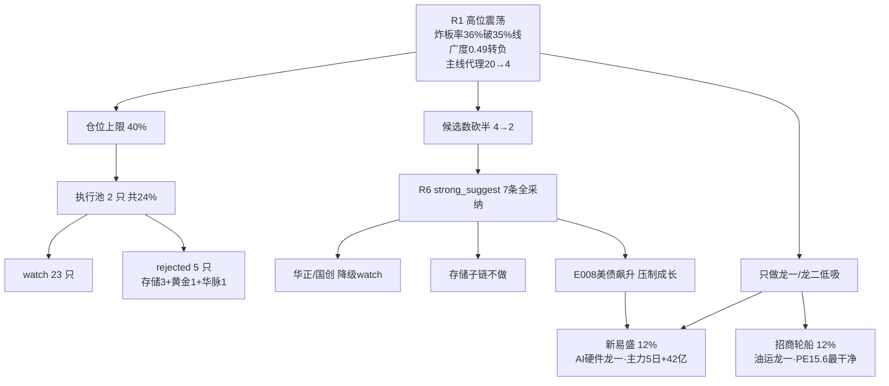

# 2026年9月10日 · 主决策 / D1 盘前预案

> 数据源新鲜度: partial
> 降级状态: true
> 置信度: 0.68

## 一句话结论

今天不是进攻日,是高位震荡里的"低吸确认日"。炸板率 36% 破了 35% 纪律线、全市场涨跌比 0.49 转负、主线代理强板块一天从 20 个骤降到 4 个——赚钱效应已经从分化走向收缩。仓位上限压到 40%,执行池只留两只资金最干净的主线龙一:AI 算力硬件链的新易盛 + 能源油气链的招商轮船,各 12%,合计 24%,全部只低吸不追高。其余龙二(华正/国创)全部降级 watch。R6 反证今天 0 条 hard_reject,但 7 条 strong_suggest 条条踩在仓位上。

---

## 详细分析

### 一、今天是什么日子:高位震荡,不是主升

先把最硬的数据摆出来。0909 收盘涨停 48 家、跌停 7 家(从 0 到 7 是转折)、炸板 27 家、**炸板率 36.0%**,已经连续第二个交易日站上 35% 交易纪律警戒线;全市场 5550 只里涨 1794/跌 3642,涨跌比 0.49 转负,中位 -0.68%;前日涨停溢价均值 +1.11% 但**中位 -0.60% 转负**——追高一半人亏钱。更关键的是 R1 的主线代理:up_nums≥8 的板块从 0908 的 20 个骤降到 0909 的 4 个,科技从强板块消失、涨价链退出一线。情绪周期重算=**高位震荡**(conf 0.75),R1 情绪浓度 45。

这一段位判断直接决定了今天能做什么、不能做什么。高位震荡 + 炸板率破线 → **候选数砍半、只做各主线龙一/龙二低吸、不追高位连板**。R6 的 M2_01 把这点讲透了:今天没有"第一时间"窗口,只有"低吸确认"窗口。昨天(0909)反证的兑现情况也印证了这点——代糖霸榜出货兑现(0908#1→0909#8)、农业链第 4 日扩散退潮兑现、华脉 3 板一字高度龙今天放量跌停(盘中实际)。高位连板赌博在今天是要吃跌停的。

**大资金意图**: 北向连续 5 日净流入但边际递减(0908 26.6→0909 24.61 亿),是温和承接不是加速;两融 26207 亿平稳。资金没在撤离市场,是在**从高位连板撤向低位硬逻辑**——通信硬件全链资金之王(5G+126 亿/通信+123/PCB+98/光通信+87/CPO+80/光纤+65 亿)就是证据,钱没走,是换了地方下注。

**为什么走弱**: 位置(连板 5 板但 4 板断层、涨停 73→48 收缩)+ 催化(溢价位转负、打二板以上当日 -1.66%)+ 筹码(高标接力端转弱)三维同向下压——这不是单点利空,是**赚钱效应结构性的收缩**。

**逻辑够不够硬**: 三条独立信号(炸板率破线、广度转负、主线代理骤降)全部指向退坡,加上 R1 confidence 0.70 且核心主源 fresh,段位判断可信。但要注意 R5/R6 是收盘后补跑的,里面带了当日实际行情(华脉跌停/国创二连板/招商回踩),这在"盘前预案"语境下是超前的,已在元数据标注。

### 二、主线怎么排:两条主升早期,但一个"资金之王"一个"叙事之王"

**主线 1:AI 算力硬件链(score 82,资金之王)**。R7 主力净流入前五被它包圆(5G+126/通信+123/PCB+98/光通信+87/CPO+80 亿),5 日序列里 PCB/光通信/光纤是 3 正日 inflow——这是**真流入**,不是单日爆量。热榜 CPO 5→2、PCB 7→3、光纤 15→5、存储 11→6、铜缆新进#14 集体升位,R3 共振 rank#2,R4 存储/国产 GPU 双 high。但 R2 自己也标了三个警号:**"资金先进、涨停未跟"是低位试错特征**、存储子链 -57 亿净流出(长鑫 -24.88/佰维 -4.89)、E008 美债全线飙升+加息概率 60.2% 压制成长估值。所以这条线**只做通信硬件侧,存储不做**——这正是 R6 M1_01 四源背离的结论,严禁把 R4 存储首推(佰维/长鑫/东芯)当执行候选,我直接全 rejected。

**主线 2:能源油气涨价链(score 77,叙事之王)**。R4 E001 美伊互射油轮+布油破百 101.21(7 源 high,weighted 0.78 全市场第一)+E003 沥青破 5200 新高,双 hard 催化;R3 共振 rank#1,KOL 四群全覆盖(沥青 30+ 条/油运晚报/LNG/氦气)。但 R7 资金维**未确认**——top10 里没有石油/油运显式概念,只有周期股 +65 亿 proxy;招商轮船涨停日主力 -4.4 亿(炸 8 次回封=先手兑现)、5 日 -3.0 亿;国创 -0.83 亿。cross_validation 只有 0.67(缺资金维)。所以这条线**只做龙一低吸,资金确认前不按叙事强度配主仓**——R6 M1_02 的判决。

四象限叉乘:
- **AI 硬件**: 资金✓✓ + 情绪✓(partial) + 消息✓ + 估值分化(新易盛 PE44 不贵/华正 PE81.7 贵)→ **只取新易盛低吸**。
- **能源油气**: 消息✓✓✓(全市场最强) + 情绪✓✓ + 资金✗ + 估值✓(招商最干净)→ **只取招商低吸,资金维盘中验证**。
- **军工**: 情绪✓ + 资金✗ → watch。
- **黄金铜**: 消息✓ + 资金✗(湖南黄金炸 27 次)→ watch。

### 三、执行池怎么选:两只,都是"资金干净 + 只低吸"

**新易盛 300502.SZ(AI 硬件龙一/光模块中军,仓位 12%)**。

- **买入理由**: ① 光模块全球头部/板块容量中军,主力 5 日 +42.47 亿是全链唯一大额正流入(0907+30.1/0908+7.3/0909+2.2 亿);② 资金与价格背离——主力大买但 0909 收 414.8 只跌 0.38%,低位试错预期差;③ PE_ttm 44.08 只处 1 年 9.1% 分位不贵,净利 yoy +91% 基本面最硬。
- **风险点**: ① chart_vision 偏空 0.65,MA60(469)远高于现价构成中期压制,日 K 未突破 MA20(414.7)不算转强;② 股东户数半年 +65% 筹码大幅分散(散户进场信号);③ E008 美债飙升+PB 23.8 高,加息落地即压制。
- **止损条件**: 60 分前低 378.56(-8.7%)硬止损;收盘跌破 MA20 414.73 技术破位减仓。
- **可验证假设**: 24-72h 内若日 K 放量突破 MA20 414.7 且板块涨停承接 ≥3 家 → 转强成立;若跌破 378.56 → 预期差证伪,资金价格背离逻辑失败。

**招商轮船 601872.SH(油运龙一/容量中军,仓位 12%)**。

- **买入理由**: ① VLCC 龙头,BDTI 周涨 40%,R4 E001 油价破百 7 源 high(weighted 0.78 top)是今天全市场最强催化;② R5 alpha A-、composite 78 全池最高,PE15.6/ROE15.5%/净利 +227.6% 估值最干净,机构目标价 26.9(空间 28%)。
- **风险点**: ① 涨停日主力 -4.4 亿(炸 8 次回封=先手兑现)+5 日 -3.0 亿+融资 15 日 -24.5%——资金维未确认,可能纯消息脉冲;② 地缘缓和(特朗普"中选后战事结束")即逻辑证伪;③ 0910 实际回踩 -1.95% 收 20.58,站所有均线=弱转强候选,但高开低走风险仍在。
- **止损条件**: MA20 18.8(-10.3%)硬止损;布油跌破 97 或油运跌出主线或 3 日无主力流入即板块降级。
- **可验证假设**: 24-72h 内若主力单日转为正流入且 BDTI 续涨 → 叙事与资金收敛,预期差兑现;若主力继续流出 → 纯消息脉冲,不升级仓位。

**降级的两只(华正/国创)为什么不能进执行池**: 华正(R2 龙二)被 R6 M1_03+M3_01 双 strong_suggest——旧主力借板出货(涨停日 -5.76 亿/5 日 -8.48 亿)新游资接(龙井路 +4.08 亿),龙虎榜净 +4.89 亿 vs 主力 5 日 -8.48 亿是**完全相反**的数据源信号,PE81.7 偏贵+PB13.5;国创(R2 龙二)是庄股区(流通 27.5 亿)+静态 PE99.9 失真+负债 70.3%+换手 19.7% 游资控盘,只可高开 <3% 低吸。两只都降级 watch_elastic,条件满足才回补。

### 四、R6 反证怎么消费:0 硬否决,7 条 strong_suggest 全采纳

今天 R6 **0 hard_reject**——模式六霸榜出货双条件(板块命中 distribution_alert + 近 5 日主力净流出)无一标的命中:distribution_alert 只有代糖(confirmed)和培育钻石(watch),都不在四票所属板块(光模块/PCB/油运/沥青)。所以**没有 execution_pool 剔除项**,已如实记录在 meta。

7 条 strong_suggest 全部采纳进执行纪律:存储子链不做(佰维/长鑫/东芯/同兴达全 rejected)、能源油气资金未确认前只龙一低吸(招商竞价高开 >4% 放弃)、华正只低吸禁追板、炸板率破线候选砍半、依顿 V2 红旗不进执行池、培育钻石 watch 升级路径(若今日再霸榜=单日登顶兑现,情绪面整体降仓)。没有 override 任何一条——高位震荡下反证就是纪律。

## 数据源审计

| 源 | 日期 | 状态 | 备注 |
|---|---|:--:|---|
| tushare (R1/R2/R4/R7) | 2026-09-09 | 🟢 | 全市场 5550 只 · 涨停明细 · 资金流 · 龙虎榜 |
| wechat_cli 5 群 (R1/R3) | 2026-09-09 | 🟡 | 4/5 群 305 条 · 散户投研群 error(核心 KOL 缺失) |
| ths_hot / hotlist (R3) | 2026-09-09 | 🟡 | L1 当日空 → T-1 baseline · 4 层信号完整 |
| news_cls/major (R4) | 2026-09-09 | 🟢 | cls 2745 + major 800 · 东财预告 500 |
| canghai-charts (R5) | 2026-09-10 | 🟢 | 收盘后补跑 · chart vision 含当日实际 |
| R6 反证 | 2026-09-10 | 🟢 | 收盘后补跑 · 纯只读上游 · 0 hard_reject |
| weflow (R3) | — | 🔴 | 永久下线 (ngrok 404) · 既定不计入 |
| vibe-trading MCP (R7) | — | 🔴 | 本会话不可用 → tushare fallback |
| mptext/公众号 (R4) | — | 🟡 | AuthKey 同步失败 · 用户已改自主判断 |

### 五、不确定性 / 反证

最大的不确定性有三个。一是**"资金先进、涨停未跟"能不能跟上来**——AI 硬件链资金是真流入,但 0910 盘中必须看到涨停承接(板块涨停 ≥3 家),承接不足则主线定性回退 R1 代理方向(政策/基建/业绩),这正是 R6 M2_02 的主线口径漂移警告;二是**能源油气资金维能不能确认**——招商轮船资金背离若继续,这条线就是纯消息脉冲,只能低吸不能升级;三是 **E008 美债飙升+加息概率 60.2%** 这条宏观逆风,对高 PB 科技票(新易盛 PB23.8)是实打实的压制,仓位已按低吸+12% 封顶。另需盯培育钻石#1 的 watch 升级路径——单日登顶(17→1)和昨天代糖的剧本一模一样。

## 关键证据

- 炸板率 36.0% ≥ 35% 交易纪律警戒线(0908 为 33.64%,续升)· 来源 R1
- 涨停 48/跌停 7(0→7 转折)/炸板 27 · 涨跌比 0.49 转负 · 中位 -0.68% · 来源 R1 cross_section
- 主线代理 up_nums≥8 板块 20→4 骤降 · 科技从强板块消失 · 来源 R1 limit_cpt_list
- 通信硬件全链主力流入:5G+126/通信+123/PCB+98/光+87/CPO+80/光纤+65 亿 · 存储 -57 亿 · 来源 R7
- 新易盛主力 5 日 +42.47 亿唯一大额正流入 · 招商 PE15.6 alpha A- · 来源 R5
- R6 0 hard_reject / 7 strong_suggest · 来源 R6

## 与其他 R/D/E 的关系

- 依赖: data/research/20260910/R1-R7 artifacts (research_summary.json 未落盘,直接消费)
- 被消费: E1 daily_review · P2 midday_amendment · observation_tracking
- 消费 user_preferences.yaml 龙一龙二池 + 仓位硬规则

## Sub-Agent 元数据

- skill: main_decision_v1
- artifact: data/runtime/watchlist_plan_20260910.json (42KB · pydantic 校验通过)
- 生成耗时: ~10 分钟 (补做 · 盘前 429 后收盘后生成)
- model: deepseek-v4-flash-260425
