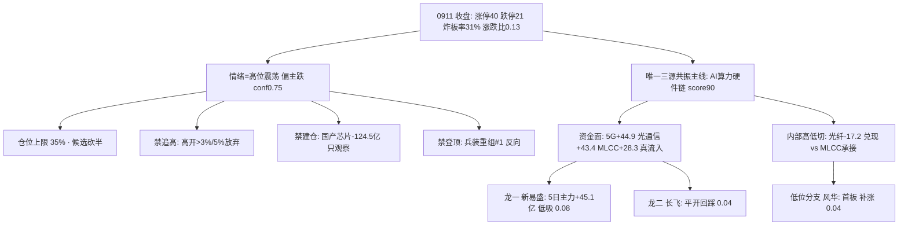

# 2026年9月14日 · 主决策 / D1 盘前预案

> **数据源新鲜度**: partial
> **降级状态**: true (research_summary 缺失 · MCP 网关 severity=3 · 底层 SDK 直连真实 0911 数据)
> **置信度**: 0.60

## 一句话结论

高位震荡偏主跌, 仓位上限 35%, 只做唯一主线 AI 算力硬件链的龙一新易盛低吸、低位分支风华补涨、龙二长飞平开回踩; 光纤/PCB 高位分支禁追高, 国产算力芯片禁建仓, 不追任何高位单日登顶题材。

## 详细分析

### 先认市场, 再认个股 —— 市场在为什么付钱

今天的第一性问题不是"买哪只", 而是市场还愿不愿意为赚钱效应付钱。0911 收盘给出的答案很不客气: 涨停 40 家、跌停 21 家(较 0910 的 7 家三倍放大)、炸板率 31.0%、全市场涨跌比 0.13(涨 643 跌 4870)、中位 -2.21%、涨停溢价中位 -1.90%。这是一次典型的广度崩塌式退坡: 题材还在(强板块名义 17 个), 但赚钱效应系统性转负——有题材、无接力。情绪周期四阶段被 R1 用 0911 真实指标重算为"高位震荡"(conf 0.75, 方向偏主跌), 不是早上 06:50 预计算那版误判的"低位试错"。段位错了后面全错, 所以今天先压段位: 高位震荡期该做的事只有三件——落袋为安、只做龙头分歧低吸或低位补涨、候选砍半。仓位上限从主线扩散型的 0.60-0.80 一路下修, 最终定在 0.35。

为什么只保留一条主线而不是 R1 名义上的"三主线以上"? 因为 R2 用三源硬共振(热榜 + 消息 + 资金)过滤后, 全市场只有 AI 算力硬件链(光互联/光模块/CPO/MLCC/PCB/液冷)同时拿到了 R3 热榜共振 #1、R4 六券商独立催化、R7 概念净流入前八占六席, 共振分 1.0。其余名义强板块要么是概念重叠的计数幻觉(涨跌比 0.13 下 17 个板块 up_nums≥8 不可信), 要么是"有叙事无资金"的空转(国产算力芯片 0911 主力净流出 -124.47 亿、存储 -110.3 亿、人工智能 -98.36 亿, 包揽流出前三)。主线条数收敛到一条, 是对纪律"无主线不开新仓、高位震荡压缩候选"的落实。

### 四象限叉乘 —— 这条主线为什么只能低吸不能追

把情绪、资金、消息、估值四个象限对着主线候选逐一过筛: 情绪面高危(高位震荡 + 广度崩塌 + 跌停三倍放大 + 溢价中位转负), 命中所有高位一致票——所以高开即放弃, 新易盛高开 >3% 不追、长飞高开 >5% 不追, 这是硬闸门不是偏好。资金面高危但结构清晰: 主线资金根基是真的(5G +44.88 亿、光通信 +43.37 亿、被动元件 +33.69 亿、MLCC +28.28 亿、CPO +21.16 亿, 5 日 5G 累计 469 亿), 但内部正在高低切——高位分支(光纤 -17.2 亿、PCB/通信涨停端 lhb 诱多命中 46%)在兑现, 低位分支(MLCC/被动元件)在承接, 融资买入降温(rzmre -185.86 亿)加 IF 贴水 -6.76 点空头增仓, 高位科技整体承压。消息面中性偏压制: 美联储 9/17 凌晨加息概率 86.2% 是高估值科技最大的宏观逆风, 中东地缘油价大涨收缩全球风险偏好; 但产业正面(算力一张网、光博会 1.6T 订单排到明年、海外 AI 资本开支、指数成分调整今日生效、网安周开幕)是真催化, 支撑的是叙事而非当日高开。估值面: 龙一新易盛 PE 44.96(一年 11% 分位)是全场最干净, 中军烽火 PE 162(79% 分位)+ 净利 -32.7% 是最贵最差, 长飞 PE 114 静态贵但靠扭亏增速消化, 风华 PE 158 是周期底部失真。

叉乘结论一句话: AI 算力硬件链四个象限两强两弱(资金强 × 消息强 × 情绪弱 × 估值中), 主线真实但段位在退坡路上, 因此只做"龙一低吸 + 低位分支轻仓补涨", 禁追高; 国产算力四象限"消息强 × 资金极弱", 只观察; 事件线(网安/油运/黄金)"消息强 × 资金未确认", 盘中验证不预建仓。四象限全负但无一项触发 R6 硬否决, R6 反证只决定仓位上限和买点类型, 不构成"不参与"的理由。

## 执行池(3 只 · 高位震荡候选砍半)

### 1. 新易盛 300502.SZ — 主线龙一, 唯一低吸主仓

**大资金意图**: 光模块全球龙头, 主力 5 日净流入 +45.12 亿、0911 单日 +9.36 亿, 全条链资金第一; 0911 收 423 元但只涨 2.94% 未涨停——这个组合说明大资金在高位分歧中仍在承接, 没有出货迹象(大宗近 30 日 5 笔机构对倒平价, 无折价甩卖)。**为什么走强**: 1.6T 订单排到明年、NPO 2027 批量交付, 业绩说明会亲自背书, 六家券商独立共振; 基本面 ROE 35.7%、净利同比 +91%、PE 44.96 处于一年 11% 分位, 是这条链上估值最干净的票。**逻辑够不够硬**: 硬, 但注意两点——股价从 618 高点回撤 -31.6% 后仍在修复期, 且股东户数半年 +65%, 散户进场意味着高位抛压结构在变差, 所以只做回踩 5 日线(416 附近)的低吸, 不做任何追高动作。

**买入理由**: 高位震荡期唯一可低吸确认的主线龙一, 回踩 -5%~-7% 分批接, 触发价 410, 区间 397-417。**风险点**: 高位票对存量利好钝化, 若 0914 高开抢跑就是先手兑现(全市场溢价中位 -1.90% 环境下追高必亏)。**止损条件**: 买入价 ×0.93 = 381.3 硬止损; 收盘跌破 400 关口/MA10 降级观察。**可验证假设**: 若回踩 5 日线缩量企稳且板块资金连续两日翻红, 低吸成立, 加仓至 0.12; 若放量破 400, 假设证伪, 立即退出。波段锁仓(wave_main), 不依赖做 T。

### 2. 风华高科 000636.SZ — 低位分支龙一, 补涨轻仓

**大资金意图**: MLCC/被动元件是全条链唯一"低位 + 资金 + 热榜"三证的分支: 0911 首板涨停(55.99, 13:37 封板, 开板 0 次, 封单 5.74 亿), 元件板块 +3.11% 涨幅全市场第一, 被动元件 +33.69 亿、MLCC +28.28 亿板块资金, 龙虎榜机构专用 +2.86 亿 + 深股通 +1.44 亿双买——是机构与北向在板块内切低的承接位, 不是游资独庄。**为什么走强**: 相对光模块 423/474 的高位, 55.99 的位置低, 热榜 MLCC 从 19 名冲到第 2(+17 最强动量), 高低切的核心就是它。**逻辑够不够硬**: 中上——补涨逻辑成立, 但 PE 158 是周期底部失真, ROE 仅 2.3%, 基本面是周期股的底, 所以只能当短线补涨做, 隔日承接验证后再谈加仓。

**买入理由**: 弱转强(低开/平开放量站上 55.99)可半路, 或回踩 55.6-57 承接不破首板涨停价, 触发价 56.3, 仓位 0.04。**风险点**: 首板后的隔日是验证日, 高开 >5%(>58.8)秒板缩量一字坚决不追; 板块炸板率破 40% 降档。**止损条件**: 56.3 ×0.93 = 52.4 硬止损; 收盘跌破首板涨停价 55.99 或炸板未回封即出(短线不达预期隔日走)。**可验证假设**: 若 MLCC 分支资金持续净入且盘中有封板承接, 补涨成立; 若低开破位无承接, 假设证伪, 当天不碰。持有方式 short(首板补涨, T+1 验证)。

### 3. 长飞光纤 601869.SH — 龙二, 平开回踩观察仓

**大资金意图**: 空芯光纤 0.032dB/km 破全球纪录是 9/13 晚间的次日增量催化, 0911 已 +8.78% 提前反映, 主力 5 日 +15.19 亿; 但光纤概念热榜升 12 位的同时主力净流出 -17.2 亿, 热榜升位 ≠ 资金确认, 这是 R6 模式一的重点警示。**为什么走强**: 空芯光纤是 AI 互联的下一代方向, 题材新鲜度高于 1.6T 订单, 与烽火 800G 实景验证形成板块共振。**逻辑够不够硬**: 中等——题材真、方向对, 但高位(474 元)+ 板块资金背离 + PE 114 静态贵, 只配观察仓。

**买入理由**: 平开/小高开回踩 440-462 承接低吸, 触发价 452, 仓位 0.04; 高开 >5%(>497.7)不追, 竞价被先手资金顶高直接放弃。**风险点**: 隔日高开即利好兑现, 光纤板块资金背离下追高就是接盘。**止损条件**: 452 ×0.93 = 420.4 硬止损; 收盘跌破 MA5(433.8)即出。**可验证假设**: 若平开缩量回踩且光纤板块资金转为净入, 低吸成立; 若高开冲高回落或板块资金继续流出, 证伪, 当日不参与。持有方式 short(高位题材, 不锁仓)。

## 观察池(21 只 · 宁多勿漏, 盘中扫描与次日回看)

主线中军与分支: 烽火通信(容量低吸备选, 行业资金转弱即剔)、中际旭创(光模块容量第二)、源杰科技(光芯片超高位)、联讯仪器(光通信测试)、PCB 四票崇达/嘉立创/金安国纪/超声电子(R6 维持 watch, 超声电子作高度锚: 断板即主线情绪二次受挫)。次线: 寒武纪、燧原、并行科技、星环科技(国产算力, 只观察资金回流)、天融信(网安事件, 9/15 新品前盘中验证)。事件/对冲: 山东黄金(加息+避险方向确认锚)、中远海能(油运 E002)、佰维存储(存储资金流出)、宇树科技(电子皮肤正负交织)、凯德石英/惠丰钻石(北证 50 调入今日生效, 920 不参与)、阳光电源(储能)、比亚迪(固态电池)。以上全部 watch_pool_only, 不进执行、不参与自动交易。

## R6 反证采纳

今日 R6 硬否决(hard_reject)为零——模式六霸榜出货双条件无一命中, 四票既不在兵装重组出货警报板块, 主力 5 日又全部净流入, 所以 execution_pool 无需剔除项(用户指令的"消费 hard_rejects 剔除"已核对: 无票可剔)。五条 strong_suggest 全部采纳并落到仓位与买点: ①光纤/PCB 高位分支禁追高(长飞只平开回踩, PCB 四票 watch); ②国产算力芯片严禁建仓(寒武纪/燧原/并行/佰维全部 rejected 或 watch); ③高位震荡无主升加仓窗口(执行池砍半至 3 只, 只低吸); ④烽火估值最贵业绩最差(剔除执行, 只容量低吸备选); ⑤昨日反证 5/7 兑现, 今日同构警报=兵装重组 #1 单日登顶永作反向, 若续霸榜整体降仓。soft 类(天融信亏损无资金确认、涨停膨胀 >80 防假繁荣、4 板独苗断板防高标补跌、加息落地前高估值承压)全部记录并按 watch/仓位规则处理。

## 关键证据

- 情绪: 涨停 40/跌停 21/炸板率 31.0%/涨跌比 0.13/溢价中位 -1.90% · 来源 R1(0911 真实收盘)
- 主线: AI 算力硬件链三源共振分 1.0, 资金 5 日 5G 累计 469 亿 · 来源 R2/R3/R4/R7 交叉
- 高低切: 光纤 -17.2 亿 + PCB 诱多 46% 兑现 vs 被动元件 +33.69 亿/MLCC +28.28 亿承接 · 来源 R7
- 反证: hard_reject 0 / strong 5 / soft 5 · 来源 R6
- 宏观: 美联储加息 86.2%(9/17 凌晨)+ 中东地缘油价 105 美元 · 来源 R4 E001/E002

## 不确定性 / 反证(自我批判)

最大的不确定不是主线选错, 而是段位判断的时效: 全部数据止于 0911 收盘, 0914 若美联储加息预期升温或中东油价冲击传导, 高位科技可能提前避险放量下跌, 执行票会整体降档——这是 R6 M10 与 error_case_20260907_001(崩溃外推滞后)的双重提醒, 所以今天的仓位上限只给 35% 且全部买点设高开闸门。另一个隐患是情绪面: 广度已崩塌到 0.13, 若 0914 涨停家数跌破 30 或炸板率破 40%, "主线扩散型"会滑向防御观望, 届时执行池三票全部按 sector_switch_exit 撤离, 不恋战。反证的另一面我也必须承认: R6 昨日在通信硬件侧被证伪过("科技全面出货"当日资金大幅回流), 说明这条链的资金韧性比反证担心的更强——所以今天没有把主线龙一降为纯观察, 而是留了低吸仓位, 把风险交给仓位和止损而非研究判断。

## 与其他 R/D/E 的关系

- 依赖: R1 风格/段位 · R2 主线与龙头 · R3 情绪共振 · R4 事件催化 · R5 六维画像 · R6 反证 · R7 资金面 · emotion_cycle/mainline_lifecycle/hotlist_signals
- 被消费: D1 下游 execute(entry/exit 执行) · P1 竞价校准 · P2 午盘修订 · E1 收盘复盘
- 错题本: 已注入 error_case_20260910_001/002、20260907_001/002、20260831_001/002/003、20260908_001、20260909_001, 均写入 JSON meta.corrections_applied

## Sub-Agent 元数据

- skill: main_decision_v1
- artifact: data/runtime/watchlist_plan_20260914.json
- 生成耗时: 补跑(0914 09:15, research_summary 缺失 degraded 模式)
- model: deepseek-v4-flash-ga-260731(provider: custom)

