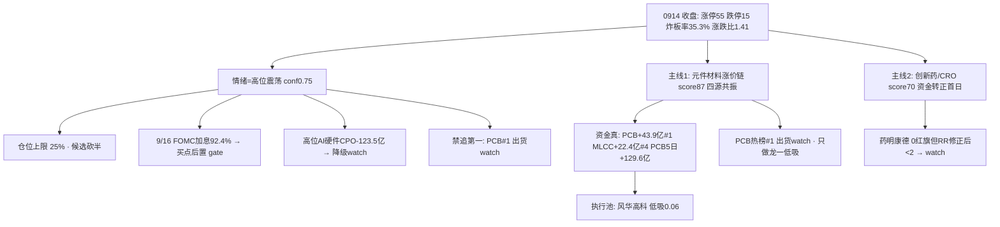

# 2026年9月15日 · 主决策 / D1 盘前预案

> **数据源新鲜度**: partial
> **降级状态**: true (research_summary 缺失 · MCP 网关 severity=3 · 底层 SDK 直连真实 0914 数据)
> **置信度**: 0.55

## 一句话结论

主线扩散型但段位高位震荡(炸板率 35.3% 破 35% 纪律线), 仓位上限 25%, 执行池只留一只——元件材料涨价链(PCB/MLCC/培育钻石)龙一风华高科低吸; 9/16 美联储加息 92.4% 落地前买点全部后置, 高位 AI 硬件链(CPO/光模块/存储)默认降级 watch, 只做龙一低吸与低位补涨, 不碰中位、不追第一。

## 详细分析

### 先认市场, 再认个股 —— 市场在为什么付钱

先回答第一性问题: 市场今天在为什么付钱? 0914 收盘给出的答案比 0911 那版崩塌好看得多——涨停 55 家(较 0911 的 40 家放大)、跌停 15 家收敛、全市场涨跌比 1.41(涨 3126 跌 2224)、中位 +0.28%、涨停溢价中位 +3.12%, 广度大幅修复是真金白银的修复, 不是计数幻觉。但修复日必须看结构: 非 ST 三板以上高标当日 -9.99%(30 日 +240.95% 的高位崩塌), 权重弱(上证 -0.07%、创业板 -1.10%、科创50 -1.62%), 科技 ETF 30 日仍在深调(恒生科技 -11.37%)。一句话: 小票在修复, 高标在崩塌, 权重在观望——这是典型的"高标退、低位接"切换特征, 修复但不稳。

段位判定: 情绪周期重算=高位震荡(conf 0.69, 预计算 0.75 一致), 核心依据是炸板率 35.3% 已破 35% 纪律警戒线。炸板率破线在纪律里的含义是强制性的: 情绪=震荡, 候选数砍半, 只做各主线龙一/龙二与低位补涨, 不追高位不碰中位。加上 9/16 美联储加息 92.4% 概率 + 10Y 美债三年首破 5% + 费半 -6% + Anthropic 呼吁放缓 AI + 纳指期货 -1.7% + 韩股 -3.26%——这是错题本 004 的同构场景: 大事件前夜 + 外盘科技链重挫, 今日科技成长链低开压力, 若高开低走就是外盘映射杀。所以今天仓位上限从 R1 建议的 0.45 一路下修: 高震荡 ×0.75 = 0.34, 事件 gate ×0.6 = 0.20, 实务取 0.25(北向 5 日连买温和 + 广度修复真微上修, 与 R6 破 40% 降档 0.25-0.30 对齐)。

为什么主线从 R1 名义的"三主线以上(强板块 20 个)"收敛到两条? 因为 R2 用三源硬共振(热榜 + 消息 + 资金)过滤后, 只有元件材料涨价链(PCB/MLCC/培育钻石/覆铜板, score 87)和创新药/CRO(score 70)同时拿到 R3 热榜共振 + R4 催化 + R7 资金流入, 交叉验证分都到 1.0。其余名义强板块要么是概念重叠的计数幻觉(涨停 55 家分散于科技成长题材, 概念重叠导致板块计数偏高), 要么是有叙事无资金(人形机器人 R7 概念 -34.6 亿流出, 电池/储能 5 日累计 -119/-103 亿是修复脉冲非趋势反转)。主线条数收敛到两条, 是对"无主线不开新仓、高震荡压缩候选"的落实。

### 四象限叉乘 —— 为什么只留一只执行

把情绪、资金、消息、估值四个象限对着主线候选逐一过筛:

**情绪面高危**: 高位震荡(炸板率 35.3% 破纪律线)+ 高标崩启动(三板以上 -9.99%)+ 修复但不稳(权重弱、小票强, 修复可能一日游)+ KOL 全灭(R1 conf 0.55 / R3 conf 0.36, 情绪温度缺交叉验证)。命中所有高位一致票——高开即放弃是硬闸门。**资金面高危但结构清晰**: 主线1 资金根基是真的——PCB +43.85 亿全市场 #1、新材料 +43.55 亿 #2、MLCC +22.41 亿 #4、培育钻石 +18.18 亿 #7, PCB 5 日累计 +129.62 亿(4/5 天净入, 全市场唯一持续主线), 行业端元件 +28.84 亿 #2、印制电路板 +23.1 亿 #3, 医药生物 +28.98 亿 #1; 但 PCB 新晋热榜 #1 触发 distribution_alert(霸榜第一永作反向), 中京电子 5 日全单 -2.0 亿前波兑现盘仍在, 高位 AI 硬件链资金大幅流出(CPO -123.49 亿 #1 / 光通信 -98.95 亿 #2 / 国产芯片 -80.82 亿 #4)——资金在板块内部高低切, 不是撤出市场。**消息面两股力量对撞**: 空方——E003 费半 -6% + Anthropic 呼吁放缓 AI(行业级利空, bearish_impact_sectors 命中光模块/CPO/半导体/存储/AI 算力, 高位票降级 watch)、E002 美联储加息 92.4% + 10Y 破 5%(高估值成长压制); 多方——E008 电子布涨至 22800-24000 元/吨 + 村田 MLCC 扩产 20% + 大摩玻纤布与铜箔材料超级周期(主线1 催化)、E007 创新药出海 1200 亿美元 + 恒瑞 SHR-2004 受理(主线2 催化)、E001 霍尔木兹封锁油价破百(油气事件观察)。**估值面**: 风华 PE 166(PEG 2.2)周期元件高估 + 机构专用净卖 -8654 万 → 只低吸; 万邦 PE 607 盈利近乎归零 → 仅打板位; 中京 H1 净利 -591% 亏损 → 弱转强才进; 药明 PE 22 估值健康但 v1.6 节点校验 RR 不足 → 降级 watch; 恒瑞/荣昌估值合理。

叉乘结论一句话: 元件材料链四象限"资金强 × 消息强 × 情绪弱 × 估值中", 主线真实但段位在震荡期, 只做龙一低吸、禁追第一; 创新药四象限"资金转正 × 消息强 × 防御属性 × 估值健康"但修复持续性未确认, 龙一可观察; 高位 AI 硬件四象限"消息极弱 × 资金大幅流出", 默认降级 watch。四象限无一触发 R6 硬否决(hard_reject=0), R6 反证只决定仓位上限与买点类型, 不构成"不参与"理由。

### 执行池(1 只 · 高位震荡候选砍半 + 事件 gate)

为什么四只 execution_eligible(风华/中京/药明/万邦)只剩一只? 三重过滤: ①R6 反证约束——中京(亏损 + 5 日兑现盘)只弱转强、万邦(PE607 + 涨停板净流出 + 庄股)仅打板位、药明 0 红旗但; ②v1.6 节点校验——按强制 -7% 止损重算, 中京 RR 1.28 < 2、万邦 RR 1.4 < 2、药明 RR 1.78 < 2, 按纪律"盈亏比优先于胜率, RR < 2 降级 watch"; ③候选砍半纪律。最终只有风华 RR 2.26 ≥ 2 达标进执行池。这不是保守, 是纪律要求的高震荡期"只留最强主线龙一"。

### 1. 风华高科 000636.SZ — 主线1龙一, 唯一低吸主仓

**大资金意图**: MLCC 国产龙头, 主力 5 日 +9.49 亿(超声剔除后板块第一)、0914 单日 +2.79 亿, 深股通 3 日 +4.39 亿, 双平台人气 ths#1/dc#5, float 642 亿容量核心; 0914 +5.2%(58.90)连续两日走强(前日涨停)。这个组合说明大资金在高位分歧中仍在持续承接——村田扩产 20% 验证 AI 服务器 MLCC 需求, 大摩"玻纤布与铜箔材料超级周期"背书, R4 E008 首推。**为什么走强**: 主线1 是四源(热榜 + 人气 + 资金 + 游资席位)同向的唯一方向, PCB 链内高位澄清票(超声/金安)被资金抛弃后, 风华作为 MLCC 分支趋势龙头承接了高低切的核心地位。**逻辑够不够硬**: 中上——涨价逻辑(电子布 22800-24000 元/吨、村田扩产)是真的, 但 PE 166(PEG 2.2)周期元件高估、机构专用净卖 -8654 万、0914 大宗 -2.0% 折价, 所以只做低吸, 不做任何追高动作。

**买入理由**: 回踩 5 日线(-3%~-5%, 55.9-56.5)缩量企稳低吸, 触发价 56.2, 首仓 0.06; 高开 >3% 不追(热榜 #1 出货 watch 下追高=接盘)。**风险点**: 外盘 AI 担忧(E003 费半 -6%)下 PCB/MLCC 作为 AI 服务器上游有映射风险, 若低开不被承接即外盘映射杀; 9/16 FOMC 落地前买点后置, 事件落地 + 竞价确认才执行。**止损条件**: 买入价 ×0.93 = 52.3 硬止损(v1.6 校验强制 -7%); 放量跌破 55.95 前高支撑降级 watch。**可验证假设**: 若回踩 5 日线缩量企稳且 PCB/MLCC 板块资金不转负, 低吸成立, 加仓至 0.12; 若 PCB 续霸榜第 2 日(升级 confirmed 出货警报)或板块资金转净流出, 假设证伪, 按 sector_switch_exit 撤离。持有方式 short(高震荡期短线, 不做波段锁仓)。

### 观察池(27 只 · 宁多勿漏, 盘中扫描与次日回看)

主线候选(降级 watch): 药明康德(主线2龙一, 0 红旗但 RR 修正后 1.78 < 2, 触发升格: 板块资金连续第 2 日净流入 + 外盘企稳 + 回踩 MA20 三重确认)、中京电子(主线1龙二, 弱转强才进: 竞价低开→盘中转强半路, 高开 >3% 放弃, 回踩不破 18.79 可低吸)、万邦医药(主线2龙二, 仅打板位轻仓, 严禁低吸, 30 日 +105% 高位回踩接刀=接盘)、恒瑞医药(SHR-2004 受理 + 资金转正但 30 日 -19.8% 技术未企稳, 等站回 MA5)、科翔股份(PCB 20cm 弹性, 高开不追)、意华股份(尾盘投机板 + 融券异动, 不参与)、黄河旋风(培育钻石人气王但 5 日主力 -6.76 亿背离 + PB70/负债 94%, R5 拦截, 严禁越权放行)、三力制药(2 板但 lhb 涨停净卖出诱多 + 商誉 29.5%, 拦截)、荣昌生物(中报扭亏硬 alpha, 等站回 MA20)、沪电股份(R4 首推但 0914 -1.99% 高位分歧, 待企稳)。

昨日涨停升格候选(错题本 003): 崇达技术(昨日 +5.18%)、嘉立创(昨日 +8.33%, 量化基金席位)、超声电子(3 板但澄清 + 机构净卖坐实, 仅作高度锚观察, 错题本 001: 高度股剔除前竞价确认)。

事件驱动(盘中验证不预建仓): 天融信(9/15 网安周 AI 智能体新品时间锚, 错题本 002: 资金维不硬排除)、中新赛克(网安 surge +23)、中国海油/招商轮船/中远海能(霍尔木兹封锁油价破百, E001 事件观察)、宇树科技(雷军到访 + G1 升级 + 中报扭亏 905%, 但 R7 机器人概念 -34.6 亿流出, 只观察弱转强)、三花智控(机器人执行器)。

高位 AI 硬件(事件 gate 降级 watch, 资金未回流前不参与): 中际旭创(费半 -6% 映射, 昨日 -5.72% 续跌)、新易盛(昨日 -4.99%, 错题本 004: 大事件前夜高位票不抢跑)、佰维存储(E006 涨价 vs E003 美股存储重挫交织, 只做中报预增票)、普冉股份(NOR 涨价 + 360 止损锚)、长鑫科技(DRAM 涨价)。

防御观察: 山东黄金(加息压制黄金贵金属, E002 负面)。

以上全部 watch_pool_only, 不进执行、不参与自动交易。

## R6 反证采纳

今日 R6 硬否决(hard_reject)为零——模式六霸榜出货双条件(板块命中 distribution_alert 高置信 + 5 日主力净流出)无一标的命中: 风华(MLCC 概念非 alert 标的 + 5 日主力 +9.49 亿)、药明(5 日 +7.63 亿)均不命中, 中京/万邦无明确 5 日主力负值。所以 execution_pool 无 R6 硬剔除项(用户指令"消费 hard_rejects 从 execution_pool 剔除"已核对: 无票可剔)。但 8 条 strong_suggest 全部采纳并落到仓位与买点: ①主线1 内部 PCB vs MLCC/培育钻石高低切, PCB 禁追第一, 只做龙一风华低吸; ②高位震荡无主升加仓窗口, 候选砍半至 1 只, 只低吸确认; ③风华周期元件高估 + 机构净卖 → 只低吸不追高, 高开 >3% 不追; ④中京亏损 + 高负债 + 5 日兑现盘 → 只弱转强才进; ⑤万邦 PE607 + 涨停板净流出 + 庄股 → 仅打板位轻仓, 严禁低吸; ⑥PCB #1 medium alert 只约束追高不约束龙一低吸, 若续霸榜第 2 日升级 confirmed → 主线1 全体降档; ⑦药明 0 红旗干净可低吸, 但独立经 v1.6 节点校验 RR 不足降级 watch; ⑧外盘 AI 科技链暴跌是最大逆风, 主线1 低开不承接即映射杀。soft 类(电池/储能只观察等连续 2 日净流入、网安事件票盘中验证不硬排除、涨停膨胀 >80 防假繁荣、4 板独苗闽东电力禁接力)全部记录并按 watch/仓位规则处理。

## 关键证据

- 情绪: 涨停 55/跌停 15/炸板率 35.3%(破 35% 纪律线)/涨跌比 1.41/溢价中位 +3.12%/高标崩 -9.99% · 来源 R1(0914 真实收盘)
- 段位: 高位震荡 conf 0.75(预计算)与 0.69(R1 重算)一致 · 来源 emotion_cycle.json + R1
- 主线1: 元件材料链四源共振, PCB 5 日 +129.62 亿唯一持续, PCB/MLCC/培育钻石/被动元件包揽 R7 概念流入前 12 席中 4 席 · 来源 R2/R3/R4/R7 交叉
- 主线2: 创新药 +16.18 亿 #10 / 医药生物行业 +28.98 亿 #1 / 医药 ETF 0914 +1.92% 最强 · 来源 R7
- 外盘利空: 费半 -6% + Anthropic 放缓 AI + 10Y 美债破 5% + 纳指期货 -1.7% + 韩股 -3.26% · 来源 R4 E003/E002
- 反证: hard_reject 0 / strong 8 / soft 4 · 来源 R6(昨日兑现率 65%, 天融信教训注入)
- 错题本: 004 大事件前夜(9/14 高位光模块闷杀) → 今日买点后置 gate 启用 · 来源 data/corrections/2026-W38

## 不确定性 / 反证(自我批判)

最大的不确定不是主线选错, 而是段位判断的时效与外部事件的传导: 全部数据止于 0914 收盘, 0915 盘前美债破 5% + 费半 -6% 已发生, 若 A 股开盘科技成长链低开不承接(外盘映射杀实证), 主线1 执行票必须整体降档观察、只留最强龙一——这是 R6 M10 与错题本 004 的双重提醒, 所以今天仓位上限只给 25% 且买点全部设高开闸门 + 事件 gate。第二个隐患是主线1 内部结构: PCB 新晋热榜 #1 的 distribution_alert 只约束追高不约束低吸, 但若续霸榜第 2 日升级 confirmed, 按 R6 M6_01 主线1 全体降档, 届时风华也按 sector_switch_exit 撤离, 不恋战。第三个是修复的持续性: 创新药 5 日累计 -61 亿刚转正, 若 0915 资金不再流入, 主线2 修复一日游, 药明/恒瑞的升格条件全部失效。反证的另一面我也必须承认: 昨日 R6 兑现率 65% 且有两条 unfulfilled(天融信涨停、超声续板), 说明"资金维"结论对硬催化事件票时效性不足——所以今天网安事件票(天融信/中新赛克)不再硬排除, 留 watch 盘中验证; 主线龙一也没有因反证降为纯观察, 而是留了低吸仓位, 把风险交给仓位、止损与事件 gate 而非研究判断。

## 与其他 R/D/E 的关系

- 依赖: R1 风格/段位 · R2 主线与龙头 · R3 情绪共振(L1-Only) · R4 事件催化 · R5 六维画像 · R6 反证 · R7 资金面 · emotion_cycle/mainline_lifecycle/hotlist_signals
- 被消费: D1 下游 execute(entry/exit 执行) · P1 竞价校准(09:28, 校验风华低吸节点与板块承接) · P2 午盘修订(11:35, 打脸检测) · E1 收盘复盘(watch_pool 27 只追踪)
- 错题本: 已注入 error_case_20260914_001/002/003(高度股竞价确认/资金维不硬排除/防守不误读)、error_case_20260910_002(高度/广度分离)、20260907_002(估值反证不一票否决)、20260908_001/20260909_001(代码校验), 均写入 JSON meta.corrections_applied

## Sub-Agent 元数据

- skill: main_decision_v1
- artifact: data/runtime/watchlist_plan_20260915.json
- 生成耗时: 补跑(2026-09-15 10:15, research_summary 缺失 degraded 模式 · 用户指令直接综合 R1-R7)
- model: deepseek-v4-flash-ga-260731(provider: custom)
