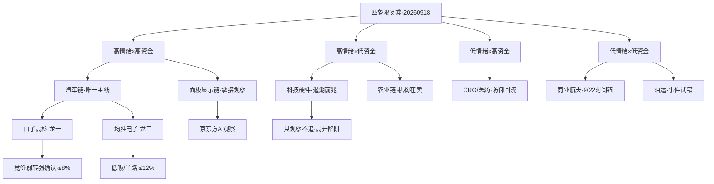

# 2026-09-18 · 主决策 / D1 盘前预案（散文体）

> 数据源新鲜度: partial · 降级状态: degraded · 置信度: 0.75 · 模式: dry_run

## 一句话结论

高位震荡回吐的延续日：0917 涨停从 89 家腰斩到 47 家、炸板率 29.85% 破 25% 分歧线、昨日涨停溢价从 +2.85% 熄火到 +0.39%、广度 0.91 转负、八条宽基全绿——反转次日的回吐已经确认，情绪周期四阶段落在高位震荡（conf 0.75）。主线从三源硬共振里只筛出唯一一条：汽车链（75 分，主升中期）。今日只做汽车链龙一山子高科、龙二均胜电子的竞价确认低吸，总仓上限四成，早盘硬确认（首板晋级率 ≥15% 且炸板率 ≤20%）才上修到五成，炸板率破 35% 立即降档防御。隔夜美股半导体暴涨（纳指 +1.69%、AMD +6.36%、美光 +5.5%）给了科技硬件一个高开起点，但 R7 显示通信 -134.64 亿、存储 -103.65 亿、PCB -96.34 亿全口径净出——人气未散、资金先撤，这是退潮前兆，回吐日的高开是最危险的形态，只观察不追。

## 市场在为什么付钱

先说市场，再说个股。0916 那根 V 反把涨停潮推到 89 家、炸板率压到 11%，0917 立刻还了账：涨停 47 家、炸板率 29.85%、溢价熄火、广度转负、连板高度从 6 板退到 5 板而且 4 板断层——标准的「涨停潮次日退坡」剧本，错题本 20260917_001 把这条写成了铁律：涨停潮次日默认高位震荡，早盘硬确认之前不得输出主升行动指引。今天不是主升日，是回吐日第二天，市场在为「谁能在回吐里接住资金」付钱。资金的答案很清楚：R7 的行业主力净流入前三名是汽车 +37.08 亿、汽车零部件 +30.4 亿、底盘与发动机系统 +18.1 亿——唯一一个三连号的行业；而流出榜全是科技硬件，通信 -134.64 亿、存储 -103.65 亿、PCB -96.34 亿、国产芯片 -81.91 亿，机构龙虎榜净卖 -22.3 亿，26/53 的诱多兑付。钱没有消失，它从高位科技硬件搬去了汽车链和面板显示链——这是退坡日最标准的高低切结构，错题本 002 教训的正面版本。

情绪温度是中性偏暖偏冷之间：R1 浓度 60、R3 浓度 58（在 60 之上又扣了 PCB 霸榜出货和科技硬件资金背离各 1 分），5 日均值 54。不冷到可以大干，也不热到必须撤退，这正是高位震荡的特征——只做最强主线的最强票，其余全部让位给观察。北向连续五天净流入（+25.99 亿），是今天唯一的顺风资金，但量级温和，不足以上修仓位。ETF 端上证 50 和科创 50 有净申购、沪深 300 净赎回，防御端在悄悄接货。

## 大事件已经落地，它的影子还在

美联储 9 月 17 日凌晨的加息 25bp 靴子已经落地——就是上次为它把执行池清零的那个事件。Step 0.55 的买点后置闸门对它是解除的：未来三个交易日内没有新的未落地大事件，下一 FOMC 在 10 月（CME 概率 55.4%），所以不做事件前夜的降仓。但它的影子还在：CME 显示 10 月还要再加一次，30 年美债收益率 5.40% 创 2007 年新高，R4 E003 把高估值成长、创业板、科创 50 标成板块级负面——这对高位科技硬件是持续的估值压制，也是今天科技硬件只观察不追的宏观注脚。另一面，靴子落地后美股风险偏好修复，半导体和 AI 硬件全线暴涨（英特尔 +7.67%、AMD +6.36%、美光 +5.5%、英伟达 +2.54%），英伟达 CEO 说明年芯片销量翻倍——这条消息如果放在三周前，A 股半导体能直接高开三个点，但今天 R7 的资金背离把它变成了高开陷阱：给持仓者一个出货的流动性，而不是给踏空者一个上车位。金价 4350 美元新高、布油失守 100 美元（伊朗冲突出现缓和信号但特朗普还有「重大决定」），这两个跨资产信号分别指向黄金和油运——黄金昨天已经兑现过一次（湖南黄金 -6.15%，R6 兑现记录），今天只观察；油运留给事件驱动试错级观察。

## 四象限叉乘：唯一进攻象限，三个观察象限

把 R3 情绪浓度（58）当 Y 轴、R7 板块主力资金当 X 轴，全市场板块落进四个象限，结论一句话：今天只有一个象限值得进攻，而且必须竞价确认。

**高情绪 × 高资金——汽车链（唯一主线，相对过热）**。四源共振（R2 主线 + R3 l1 观察 rank3 + R4 E007 Robotaxi 催化 + R7 行业资金三连号），山子高科人气 surge 25→2、龙虎榜净买 3.94 亿全市场第一、09:48 早封 4 天 2 板，汽车零部件 8 家涨停行业第一。但 R6 拆穿了这层热：R3 是 L1-only（KOL 全灭，没有真舆论共振），R2 自己承认严格口径 cross_validation 只有 0.67，汽车链资金 persist=1 单日未验证，山子本身高位宽幅震荡（5 日 +14.32%）加 F2/V2 双红旗。所以动作是：只做龙一龙二竞价确认低吸，山子高开超过 7% 不追、破 3.01 就是分歧转退潮，总仓压在四成以内。同象限还有面板显示链——MiniLED +24.44 亿、显示技术 +23.06 亿、OLED +22.36 亿，京东方 A 人气 surge 34→4，但无涨停潮、无催化，资金先于热度，观察京东方能不能成为中军，不抢先手。

**高情绪 × 低资金——科技硬件链和农业链，今天最大的两个陷阱**。科技硬件热榜还霸着（PCB 连续两日 #1，这是 R3 红线的出货警报），人气底座没散（persistent top10 全是科技硬件，中际旭创 182 天），消息面还是正的（昇腾 960 提前、存储景气），但资金全口径净出、机构净卖 22.3 亿、首板晋级率只剩 6.33%——「人气未散资金先撤」就是退潮前兆，和 0915 算力链同构，昨天华正 -9.45% 已经兑现过一次。处理：PCB 第一类票禁入执行池，科技硬件高开只观察，竞价溢价转负立即放弃。农业链是另一只陷阱：金健米业双平台 #1、粮食/转基因/玉米三席新进热榜，但机构专用净卖 2978 万、量化基金 3 日 3 次上榜——游资在买机构在卖，单源观察不追高。

**低情绪 × 高资金——CRO/创新药**。医药三席净入（医药生物 +15.76 亿、医疗研发外包 +13.43 亿、医疗服务 +12.59 亿），医药 ETF 是 0917 唯一收红的 ETF，创新药热榜 10→5。缺的是情绪点火和消息催化，所以是防御回流方向：金石亚药（20cm）放量确认才参与，大盘续弱时它是低吸承接。

**低情绪 × 低资金——商业航天和油运，两个时间锚**。商业航天 3 天 4 连捷是真的（R4 E005 high），但资金没认、热榜掉出，星舰 9/22 试飞是事件窗口，临近再评估。油运 VLCC 租金 50 万美元/日、集运欧线 +8.07% 是真的，招商轮船昨天涨停接棒，但无板块资金确认，只给事件驱动试错级观察。

## 执行池：两只汽车链龙头，全部竞价确认制

R6 今天 hard_reject 是 0 条——模式六（霸榜出货硬否决）没有触发：汽车链龙一龙二都不是 PCB、5 日主力为正，双条件不同时成立。**没有需要从执行池剔除的票，这一点我明确记录**：硬否决权是唯一不可覆盖的闸门，它今天放行了，但放行不等于放开——两只票每一只都被 R6 的 strong_suggest 上了锁：限仓、竞价确认、破位即走。

**山子高科（000981.SZ，汽车链龙一，≤8%）**：这是今天的资金人气双冠——龙虎榜净买 3.94 亿全市场第一（紫阳东路 +1.78 亿、量化打板、T 王三席合力），人气 25→2 双平台，09:48 早封、open_times 1 一致，4 天 2 板高晋级率，286 亿流通盘过市值闸门。大资金意图：用真金把汽车链的人气核心抢在手里，等 Robotaxi 题材发酵。为什么走强——行业资金三连号 + 涨停潮第一梯队 + 人气 surge 三重共振，这是资金主导而非消息主导的票。逻辑够不够硬——题材逻辑中等（R4 E007 只是 medium），但资金逻辑很硬，游资票看承接不看基本面。买入理由：竞价低开 -2%~+3% 快速翻红（弱转强承接，2.95-3.05），或高开 0-7% 且板块 ≥3 家涨停、10:00 前封板（半路/打板 3.14）；风险点：高位宽幅震荡（5 日 +14.32%）、两融剧烈（0915 买 4.18 亿、0916 还 2.58 亿）、pb 10.42 无基本面锚、E003 宏观高估值负面——所以高开超过 7% 一律不追；止损条件：2.83（-5.7%~-9.9%，用户硬止损口径）无条件离场，盘中破 3.01 尾盘不收回先减半；可验证假设：汽车零部件板块若涨停家数缩到 3 家以下或行业资金转净出，半仓逻辑作废，隔日不达预期就走，不讲故事（hold_style=short）。

**均胜电子（600699.SH，汽车链龙二/容量中军，≤12%）**：今天执行池里基本面最干净的票——R5 alpha A、composite 71，5 家券商覆盖（华泰目标 32.67，+64%），机构关注度 80 分，无 P0 红旗（只有 F6 中等的 Q2 单季转弱）。0917 底部放量首板（量比 2.86、换手 3.93% 温和、13:17 尾盘封 open_times 0），从 8 月阴跌通道里走出来，是典型的低位容量中军启动。大资金意图：汽车安全 + 座舱 + 域控三线的中军，板块资金第二，277 亿流通盘承接厚。为什么走强——Robotaxi 商业化预期（R4 E007 直接受益）+ 板块行业资金第一梯队。逻辑够不够硬——智驾域控是硬产业逻辑，估值 PE 22.5 合理，比山子健康一个量级。买入理由：回踩 17.95-18.30 承接（低吸为主），放量（量比 ≥2）突破 18.60 半路跟随，不打板；风险点：尾盘封板说明分歧存在、大票弹性有限、板块若退潮中军也难独活；止损条件：17.10（-5.3%~-8.1%）无条件离场，破 17.80 尾盘不收回减半；可验证假设：汽车链行业资金维持净入，则中军按波段锁仓做（hold_style=wave_main），三浪目标 20.45 压力位减半锁盈。

两只票的竞价三档，机械对照执行，不靠临场判断：

| 山子高科(昨收3.01) | 竞价区间 | 判定 | 动作 |
|---|---|---|---|
| 低开 | < -2%（<2.95） | 分歧转退潮 | 放弃，不接 |
| 平开 | -2%~+3%（2.95-3.10） | 符合预期 | 按 buy_zone 承接，快速翻红=弱转强 |
| 高开 | +3%~+7%（3.10-3.22） | 超预期 | 板块≥3家涨停→半路/打板3.14，超3.22不追 |
| 高开过度 | > +7%（>3.22） | 兑现风险 | 不追，等回踩或放弃 |

| 均胜电子(昨收18.06) | 竞价区间 | 判定 | 动作 |
|---|---|---|---|
| 低开 | < -1.5%（<17.79） | 走弱 | skip / 等回踩17.8承接 |
| 平开 | -1.5%~+2.5%（17.79-18.51） | 符合预期 | 按 buy_zone 承接 |
| 高开 | +2.5%~+4.5%（18.51-18.87） | 超预期 | 半路确认(量比≥2)，不追高开大阳 |
| 高开过度 | > +4.5%（>18.87） | 兑现风险 | 不追 |

## 观察池：高低切承接 + 退潮前兆双轨

31 只观察票，按错题本 002/003 的口径铺开，不再单一押注科技硬件。汽车链的低位分支：德赛西威（R4 首推、alpha A、16 家券商一致买入，但未涨停=资金未进攻，84-85 低吸观察，板块续强升格复核）、四维图新、赛力斯（问界辟谣消除利空）；众泰汽车只作情绪参考（财务濒危 R6 禁启用）、共达电声只作高度锚（PE 331 倍不追）。高低切承接方向：京东方 A（面板中军候选，surge 34→4 双平台）、中国巨石（玻璃基板）、金石亚药（CRO 20cm，防御回流）、招商轮船/中远海能/中远海控（油运事件试错级）、中国卫通（商业航天 9/22 时间锚）。退潮前兆观察：中际旭创、亨通光电（光纤分支逆势，错题本 002 说板块内分支差异大于板块间差异，可盯）、兆易创新、光迅科技、有研硅、长鑫科技、新易盛、太极实业、中晶科技（高度锚）、超声电子、澳弘电子（PCB 出货 watch，澳弘 5 板是全场总龙，断板=全市场降档第一信号）、通鼎互联（不接）。情绪与防御：闽东电力（前 6 板断板后的塌陷信号）、工商银行（B 计划备选）、山东黄金（观察不参与）、浪潮信息（算力资金背离）。

## R6 反证采纳与错题本

R6 今天 14 条反证：0 条 hard_reject、10 条 strong_suggest、4 条 soft_suggest。核心冲突三条全部采纳：汽车链 cross_validation 虚高（严格口径 0.67）→ 不按加速主升放大参与，总仓 ≤40%；汽车链资金 persist=1 单日未验证 → 只做龙一龙二竞价确认低吸；山子双 P0 红旗 + 众泰三红旗 → 山子限仓 ≤8% 竞价确认、众泰禁入执行池。昨日兑现率 71.4% 的教训传导：科技硬件「隔夜暴涨 vs 资金背离」按高开陷阱处理，只观察不追——注意今天是回吐日不是修复日，错题本 20260916_002 的「修复日资金维反证降权」规则今天不启用，科技硬件禁入执行池的判断是成立的。错题本全部五条带进今天的判断：001/002（涨停潮次日默认高位震荡、退坡日低位事件线纳入观察池）、003+20260915_002（watch 涨停票次日升格复核——招商轮船、京东方 A、金石亚药进复核位）、20260914_001（人气票剔除前竞价确认——山子高开 >7% 不追、平开可试、破 3.01 即走）。

## 一字板预判

无一字板候选。高位震荡回吐日没有 new 高强度的首板事件（商业航天是 9/22 时间锚，还没到窗口），山子和均胜都不是事件强度到顶一字的票。若竞价一字——放弃，等回封，不顶单。三板以上不预判。

## 数据源审计

| 源 | 状态 | 抓取时间 | 记录数 | 备注 |
|---|---|---|---|---|
| research_summary | 🔴 error | — | 0 | orchestrator 聚合未落盘，直接消费 R1-R7 重建 |
| R1_style | 🟢 ok | 08:25 | 1 | 主线扩散型(偏震荡/回吐)·浓度60·cap 0.50 |
| R2_main_sectors | 🟡 degraded | 09:50 | 1 | 唯一主线汽车链75分·共振为L1-only口径·conf 0.48 |
| R3_sentiment | 🟡 degraded | 09:33 | 1 | 场景E L1-only·KOL全灭+WeFlow下线·conf 0.45 |
| R4_news | 🟡 degraded | 08:38 | 8 | MCP全down·chart_vision 12/12 fail·conf 0.60 |
| R5_stock_profiles | 🟡 degraded | 10:12 | 5 | chart_vision 全降级·30日K线定量替代·conf 0.53 |
| R6_devil_advocate | 🟡 degraded | 10:21 | 14 | hard_reject 0·strong 10·soft 4·conf 0.50 |
| R7_capital_flow | 🟡 degraded | 08:25 | 1 | 单源cap 0.5·两融0916口径·美股已刷新至0917美盘 |
| emotion_cycle | 🟢 ok | 06:56 | 1 | high_chop 高位震荡·conf 0.75 |
| attention_signals | 🟢 ok | 06:56 | 1 | 0917口径·surge/persistent/cross_platform 齐全 |
| manifest | 🔴 error | 06:46 | 0 | global_severity=3 → 强制 dry_run |
| KOL/WeFlow/MCP | 🔴/🔴/🔴 | — | 0 | 文本层缺失·MCP 全 down·HTTP/tushare 直连补偿 |

## 不确定性

今天最大的不确定是「汽车链资金 persist=1 到底能不能续」。R7 的行业资金是单日确认，5 日追踪没有覆盖汽车行业，这是 R6 反复强调的软肋——如果今天汽车链高开后资金不接（行业资金转净出），唯一主线当天就从过热象限掉进情绪陷阱，山子和均胜的买点全部作废。其次是科技硬件的隔夜映射：美股半导体暴涨在回吐日可能只提供高开起点，若盘中炸板率破 35% 或跌停放大，整个高位震荡判定滑向主跌，执行池降档到只留最强龙一甚至空仓。最后，KOL 全灭意味着情绪温度只有量化单腿，盘面承接是唯一的裁判——这也是为什么所有买点都挂竞价确认，而不是挂预案价。本 plan 生成于 10:33（数据源 07:00-10:30 分批落盘），竞价窗口已过，若今日盘中执行以竞价三档 + 盘中确认闸门为准，同时作为 T+1 参考。

## 跷跷板 / 对手盘 B 计划

今天预案全部押注汽车链。如果它不及预期，钱不会消失只会搬家——以下方向全部来自预案内已有素材（R2 次线 + 观察池 + R7 高低切方向），不是盘中临时起意。触发判定（任一命中即切）：执行池 ≥1 票竞价不及预期（高开低于预期位或低开破位）；汽车链行业主力转净流出且无承接；总龙澳弘（5 板 PCB）断板或炸板率 >25%。

**B1 · 面板显示链（最优先，资金已就位）**：京东方 A、中国巨石——R7 概念净入 top10 占 5 席、面板行业 +23.09 亿 #3，资金先于热度，面板涨停潮扩散或竞价超预期时启动，不抢先手。

**B2 · CRO/医药防御**：金石亚药——大盘续弱 + 炸板率上升时，医药三席净入 + 医药 ETF 唯一收红的防御属性兑现，20cm 放量确认后试错。

**B3 · 油运/集运（事件驱动）**：招商轮船、中远海能、中远海控——布油回升或中东再度升级（特朗普「重大决定」）催化延续时，事件试错级 0.02-0.03。

**B4 · 银行/高股息**：工商银行——科技/汽车全线不及预期且指数走弱时启动，加息防御逻辑，只做避险配置，目标 1-2 个点不恋战。

**B5 · 主线内部高低切**：德赛西威（低位中军，84-85 低吸）——山子高位分歧（高开 >7% 或破 3.01）但板块资金未撤时，从高位人气票切到低位基本面票。

**反向提示**：如果 B1-B5 全部同步走弱（面板资金也转出、医药不接、油运无催化）→ 不是跷跷板，是全市场降档——执行池全部后置/空仓，今天不做任何方向，等炸板率收敛或新主线确认。

## 与其他 R/D/E 的关系

依赖: R1–R7 全部 artifact（direct，research_summary 缺失）+ emotion_cycle + attention_signals + manifest · 被消费: E1 复盘核对、P1 竞价校准（竞价三档直接映射）、P2 午盘修订。skill: main_decision_v1 · artifact: data/runtime/watchlist_plan_20260918.json · 生成耗时: ~30 秒 · model: deepseek-v4-flash-ga-260731
