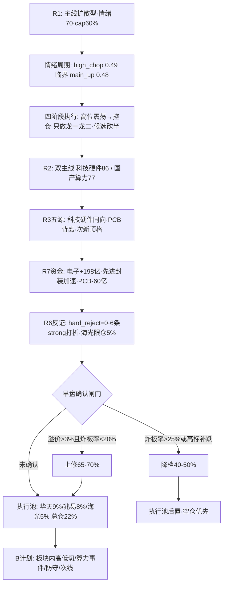

# 20260921 盘前预案 · 主决策 D1

## 一句话结论

0918 那根大阳线把市场从回吐的泥潭里拽了出来——涨停从 47 家干到 78 家、跌停清零、昨日涨停溢价从 +0.39% 拉回 +2.78%、全市场涨跌比从 0.91 翻到 3.68，主线宽度从 6 个板块炸开成 20 个。但情绪周期的高位震荡(conf 0.49)与主升(conf 0.48)只差 0.01，连板高度还停在 4 板，三板以上当日 -2.79% 的高位分歧已经露头。所以今天的定性是：**修复反弹的延续日，不是加速主升日**。只做两条主线的龙一龙二——华天科技 9%、兆易创新 8%、海光信息 5%(事件限仓)，总仓上限 60%；早盘溢价站上 +3% 且炸板率压回 20% 以内才允许上修到 65-70%；炸板率一旦破 25% 或高标补跌，立刻降档到 40-50%。R6 今日零 hard_reject，但 PCB、次新簇、粮食概念三块禁入，反证的作用是压仓，不是排除主线。

## 先认市场，再认个股

今天必须想清楚的第一件事，是市场在为什么付钱。0918 的普涨是"美联储加息落地后的利空出尽 + 半导体链资金大回补"双引擎：北向连续第五天净流入(0918 单日 +33.39 亿，五天最强)，机构专用席位从 0917 的净卖 22.3 亿翻成净买 13.19 亿，电子行业 +198.5 亿、半导体行业 +182.2 亿领跑全市场，国产芯片概念 +229.9 亿排名第 4。钱是真的进来了，而且方向极其一致——科技硬件链。R3 的五源(热榜、人气、资金、消息、情绪)全部同向指向存储/先进封装/CPO，这是场景 E 之下能拿到的最强量化共振；但必须诚实标注，R3 的 KOL 群全灭、WeFlow 永久下线，共振主题数组是空的，这个"五源共振"严格口径只有 0.67 而不是 R2 写的 1.0——所以今天对这条主线的信心要打个折，仓位按 60% 上限以内执行，不打满。

第二件事，段位。情绪周期四阶段判定高位震荡，R2 却把两条主线都标成"主升中期 conf 0.55"。以高位震荡为执行基准：落袋为安、控仓、只做龙头分歧低吸和低位补涨，不搏穿越。高位震荡期最怕的不是踏空，是接力断层——0918 芯片概念 18 家涨停但板块内最高连板只有科森科技 2 板，高度不足是硬伤。修复日涨停潮次日(错题本 20260917_001 的同款场景)必须用早盘硬数据确认：溢价 >+3% 且炸板率 <20% 才承认主升，否则按震荡做。

第三件事，谁有地位。科技硬件链内部正在做高低切——PCB 概念热榜第 5 还在前排，但主力净出 60.19 亿、印制电路板行业净出 41.2 亿，这是 0915/0917 两度上演的退潮前兆(昨日华正 -9.45% 的大面还挂在教训里)，资金明确切向先进封装与存储。这个内部切分不是猜测，是 R7 资金流和 R3 五源给出来的方向。所以今天的地位排序很清楚：先进封装/封测的华天是接棒核心，存储容量锚是兆易，事件驱动是海光。

第四件事，计划外不出手。今天计划内只有三笔：华天、兆易、海光。其余 28 只全部进观察池，触发跷跷板条件才启动 B 计划，绝无盘中临时起意。

## 四象限叉乘

把 R3 情绪浓度(69，中性偏暖)和 R7 板块资金双轴一叉，今天的机会与陷阱分得明明白白。**高情绪×高资金**象限只有科技硬件链——五源同向但共振口径虚高、5 日资金高位反复(0917 曾单日净出 81.91 亿)、板块高度不足，所以这是"过热象限的相对值"，只做龙一龙二竞价确认，不追科森这种高度票。**高情绪×低资金**象限是今天的雷区：PCB(热榜在榜但净出 60 亿)、次新簇(注册制次新霸榜第一但东财热股净出 58.58 亿，C沈鼓首日 +177% 的情绪顶格)、粮食(热榜 3→16 冷却，金健米业的人气残留是出货窗口不是买点)——三块全部禁入执行池。**低情绪×高资金**是北向和宽基承接，那是情绪背景不是进攻主线，北向若今天转向流出，普涨根基动摇，直接降档。**低情绪×低资金**是商业航天、机器人、光伏、油气——事件是真的(R4 全 high/medium)，但资金没认，只配观察，资金转正再上修，不抢先手。这就是今天四象限的全部地图：进攻只在一个象限，防守雷区有三个，其余全是等待区。

## 执行池(3 只，合计 22%)

### 一、华天科技 002185.SZ · 先进封装/封测 · 9%

**买入理由。**这是全市场昨天资金最硬的一张票：10:02 早封、封单 7.17 亿、龙虎榜净买 8.18 亿全市场第一、机构专用席位净买 10.04 亿真金白银进场，主力 5 日净入 +4.9 亿。它同时踩中四个共振：R2 主线龙一(86 分主线内涨停家数 top1)、R3 五源同向的人气双榜第 2、R4 E002 长鑫第五代量产对先进封装的硬催化、R7 的 PCB 退潮资金直接承接者——先进封装 5 日 +168.89 亿还在加速。首板启动日 + 龙虎榜机构合力 + 封测板块效应 7 家涨停，这是主线第一天的标准长相。R6 昨日"高开陷阱只观察不追"的反证已经被 0918 实际走势证伪(错题本 20260916_002 的修复日资金维反证降权规则)，今天 R6 明确不再重复过度防御。

**风险点。**首板次日是兑现窗口，高开高走与高开低走五五开；板块内高度只有 2 板，若高标无承接，科技硬件从普涨转分化，华天作为容量票也会被拖下水；E001 宏观负面(美债破 5%、10 月加息概率 56.5%)把半导体列进行业级承压范围，这是压制项不是排除项。

**止损条件。**17.00 硬止损(相对昨收 -5.7%，在 -5~-10% 铁律区间内)；收盘跌破 MA10 且炸板率破 25% 无条件走；板块资金转净出减半。

**可验证假设。**竞价开在 17.76-18.57(-1.5%~+3%)且承接不放巨量 → 按预案低吸/半路；开在 18.57-19.11(+3%~+6%)缩量承接 → 半路/打板；高开 >6% 或高开低走 → 兑现不追，等分时分歧。涨停价基准：若竞价一字(19.83)，按"一字放弃/等回封"处理，不硬顶。

### 二、兆易创新 603986.SH · 存储NOR/MCU · 8%

**买入理由。**科技硬件链的存储容量中军，流通 2604 亿，H1 净利 +1091%、41 篇研报密集覆盖，是存储涨价周期里机构共识度最高的主板锚。R4 E002 把兆易列为四选(NOR 龙头直接受益长鑫量产)，R2 龙二、核心判定(真实 20 日数据)是 core/resonance，盈亏比 2.76 通过。它今天的作用不是冲锋，是容量承接——板块高开时它跟涨，板块分歧时它是低吸位。

**风险点。**ma5(370.2)仍在 ma20(383.9)下方，技术面还没完全修复；两融 172 亿高位但 15 日 -3.7% 温和去杠杆；容量票弹性弱，追高性价比低。

**止损条件。**355.55 硬止损(相对昨收 -8.4%)；收盘跌破 MA20 且存储资金转弱减半。

**可验证假设。**板块高开不追，回踩 5 日线 370-382 缩量即低吸；若开在 395.9(+2%)以上，放弃追高，等分时回踩；收盘站不回 388.18 以下不加仓。

### 三、海光信息 688041.SH · 国产算力CPU+DCU · 5%

**买入理由。**9/22 深圳发布会的明确时间锚——1000 系列 CPU + 机器人芯片新品类，国产算力从数据中心向物理世界延伸，R4 E003 high、R2 国产算力龙一、中报预增 41.5-52.32%。今天是发布会前最后一个交易日，事件发酵期的标准低吸窗口。

**风险点。**估值是全池最高风险档(pe_ttm 178.6、PEG≈3.6，R5 V2 strong 红旗)，E001 把 AI 算力列进行业级 bearish_scope；30 日 -16.9% 深度回调后 ma5 仍在 ma20 下方，技术面未确认；发布会是双向兑现窗口，超预期有加速、不及预期当日兑现。R6 M3_01 明确：事件前低吸可，限仓 ≤5-6%，0922 高开不追。

**止损条件。**220.77 硬止损(R5 支撑、R6 指定，相对昨收 -8.5%，20cm 票止损距按 1.2x 系数放宽合规)。

**可验证假设。**0921 在 231-241 低吸建仓(5%)；0922 高开不追(先手兑现风险)，缩量分歧可再接；发布会不及预期当日兑现离场，绝不恋战讲故事。

### 竞价预期速查表(每票三档硬区间，09:27 机械对照)

| 票 | 低于预期 | 符合预期 | 超预期 | 高开过度 |
|---|---|---|---|---|
| 华天(昨收18.03) | <-1.5% 放弃/弱转强 | -1.5%~+3% 按17.9-18.5承接 | +3%~+6% 缩量承接半路/打板 | >+6% 不追等回踩 |
| 兆易(昨收388.18) | <-2% 回踩370-375低吸 | -2%~+2% 按预案回踩低吸 | +2%~+5% 不追等回踩 | >+5% 放弃当日 |
| 海光(昨收241.38·20cm) | <-2% 231-236低吸 | -2%~+3% 按预案低吸 | +3%~+7% 不追只做低吸 | >+7% 放弃,0922再定 |

## 观察池(28 只)

科技硬件链的候补和分支是观察池的主体：长电科技(封测老二，放量过 74 再进)、佰维存储(R6 标 V1 周期顶低 PE，仅板块加速时参与，高开>5%不追)、中际旭创(CPO 超级中军，低吸为主，放量破 947.6 确认)、长鑫科技(存储原厂，人气 surge 74→25，20cm 无独立资金确认)、普冉股份、太极实业(surge 28→8)、通富微电、亨通光电、新易盛、光迅科技、永鼎股份——这些都是主线内部的分支承接位，龙一龙二买不进或分歧时才有它们的戏。科森科技是板块最高 2 板高度票，R6 特别提示次新退潮对它的传导风险，观察不追。国产算力这边，浪潮信息是龙二但 R6 明说"技术未确认观察"——0904 跌停日机构逆势接 1.66 亿、融资盘 15 日 +12% 是真信号，但 ma5<ma20 空头排列未修复，等放量站回 ma20 再说。次新/高位这边国芳集团是 8/16 天的总龙，dragon_switch 判它还活着(alive)，一致加速是卖出区，观察不追。商业航天四只(中国卫星/天银机电/中科星图/中国卫通)等资金转正，机器人两只(三花智控/拓普集团)等涨停潮回流，油气三只(中国海油/招商轮船/中远海能)只做油价续冲高时的事件低吸，黄金(山东黄金)和长江电力、工商银行是科技走弱时的防守跷跷板备选，金健米业单独挂出来防止误买——人气残留是出货窗口。

## 反证采纳与不交易条件

R6 今天零 hard_reject(霸榜出货双条件都不成立：distribution_alert 空 + 四只候选近 5 日主力全为正)，这是程序正义的结果，不是放水。六条 strong_suggest 全部采纳：科技硬件链共振口径虚高→信心打折不打满；E001 宏观负面→宏观压制下的进攻，单票限仓；高位震荡 vs mid_up 冲突→按高位震荡执行；海光 V2 红旗→限仓 5%；昨日反证被证伪→不重复过度防御；PCB/次新/粮食禁入执行池。六条 soft 全部记录在案：佰维周期顶低 PE、软通与高新发展拦截确认、次新簇情绪顶格、油气与黄金跨资产背离。

不交易条件六条全部 inactive——R1 没挂(conf 0.63)、R6 没溢出(hard_reject=0)、R7 没失效(staleness=ok)、severity=3 但底层 tushare 直连全量 OK 所以不算数据失效(用 dry_run 覆盖)、情绪没到极端贪婪、用户没休假。但今天有一条隐含红线写进预案：**若 0921 早盘科技硬件竞价集体低开且北向转流出，普涨修复根基动摇，执行池全部后置，宁可不做**。

## 跷跷板 B 计划

预案只写买什么永远是单向剧本。今天的 B 计划按优先级排了四条：第一，科技硬件内部高低切——华天/兆易竞价不及预期时，资金大概率切向长电(放量过 74)、太极实业、通富微电这些低位承接位，这是 0917 错题本(板块内分支差异 > 板块间差异)的直接应用；第二，国产算力事件线——海光发布会发酵期，若硬件链走弱而算力事件升温，浪潮在放量站回 ma20 后可以跟随；第三，防守跷跷板——科技集体低开 + 炸板率上升时，中国海油(油价破 100 的事件低吸)和长江电力(高股息)是资金的自然去处，但只做低吸不追高；第四，逆势次线——商业航天和机器人的 surge 票竞价超预期且主线不及预期时，中国卫星、三花智控按盘前点名参与。反向提示写死：**B 计划方向若同步走弱，全市场降档，执行池全部后置或空仓**——高位震荡的底部逻辑就是钱不会消失只会搬家，但搬家的方向全部错时，说明不是搬家是撤退。

## 数据源审计

| 源 | 状态 | 抓取时间 | 记录数 | 备注 |
|---|---|---|---|---|
| R1 风格 | 🟡 ok·degraded | 07:48 | 22板块+20ETF+全市场 | KOL 5群全灭·纯量化 |
| R2 主线 | 🟡 ok·partial | 08:29 | 2主线+9龙头 | 场景E代偿·factor缺 |
| R3 情绪 | 🔴 degraded | 08:16 | 5 obs | L1-only·共振主题空 |
| R4 消息 | 🔴 degraded | 07:57 | 8事件/2193+800条 | MCP down·直连补锚 |
| R5 画像 | 🔴 degraded | 08:55 | 9票六维 | chart_vision降级 |
| R6 反证 | 🟡 ok·degraded | 09:05 | 10条 | hard_reject=0 |
| R7 资金 | 🟡 ok·degraded | 07:57 | 北向/概念/龙虎榜 | vibe down·单源 |
| 热榜/情绪/人气 | 🟢 ok | 06:56-08:13 | 热榜20/人气50 | 热榜场景C |
| tushare直连 | 🟢 ok | 09:25 | 20日/票 | 核心判定真实数据 |

主源无完全失效，但整体 degraded=true(MCP 网关 down + KOL/WeFlow 永久缺失)，因此 mode=dry_run、autonomous_trading_enabled=false，用户确认后才可 flip live。

## 不确定性 / 自我批判

第一，今日最大不确定性是"修复反弹的持续性"——0918 是普涨修复，不是主线加速，涨停 78 家但高度只有 4 板，修复日的涨停潮次日历史上退坡概率不低(错题本 20260917_001)，预案已用早盘确认闸门对冲，但确认成本是可能错过低开后的快速修复；第二，科技硬件链的"五源共振"含金量打折——R3 共振主题是空的，严格口径 0.67，如果今天题材端无承接，高位震荡可能转弱，这是 R6 M1_01 的完整立场，我选择"参与但打折"而非"回避"，依据是昨日 R6 过度防御被证伪的教训；第三，海光发布会是双刃剑，0921 低吸本质是赌发布超预期，若不及预期当日兑现，亏损上限被 5% 仓位和 220.77 止损锁死，这是事件票的合理代价；第四，油价破百与美债破 5% 的外部压制随时可能发酵，若早盘高估值成长集体走弱，科技硬件高度票承压，预案的降档线就是为此准备的。

## 决策流程图

## 与其他 R/D/E 的关系

- 依赖: R1(风格/仓位) · R2(主线/龙头) · R3(情绪/共振) · R4(催化) · R5(六维画像) · R6(反证·唯一硬否决权) · R7(资金确认) · emotion_cycle · hotlist_signals · attention_signals
- 被消费: P1(auction_amendment_v1·竞价对照本预案 auction_expectation) · execute(盘中执行) · P2(midday_amendment_v1·午盘修订) · E1(daily_review_v1·复盘对照) · E2(weekly_evolution_v1·周度进化)
- 产出文件: `data/runtime/watchlist_plan_20260921.json` + `data/plans/20260921/watchlist_plan.json`(pydantic 校验通过) + 本 md

## Sub-Agent 元数据

- skill: main_decision_v1 (LLM fresh-context 主路径·手动组装 R1-R7, 因 research_summary.json 未落盘)
- artifact: data/runtime/watchlist_plan_20260921.json
- 生成耗时: ~15 分钟(含真实 tushare 数据跑核心判定/盈亏比/板型/总龙/禁止清单五道硬闸门)
- model: deepseek-v4-flash-ga-260731
