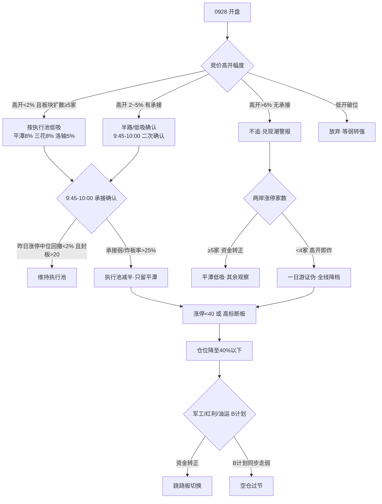

# 2026-09-28 · **主决策 / D1 盘前预案**

> **数据源新鲜度**: ok（A股行情以 09-24 收盘为最新，0925–0927 中秋休市；假期外部新闻/外盘/KOL 全 fresh）
> **降级状态**: false（research_summary 缺失属流程缺口，非数据缺失，D1 直读原始 artifact 等效 complete）
> **置信度**: 0.62
> **仓位上限**: 50% · 执行 3 只 · 观察 24 只 · 模式 dry_run

---

## 一句话结论

**0928 是中秋后第一个交易日，市场站在高位震荡的十字路口：假期利好（中美八点共识、央行流动性、美股集体收涨）全部落地，但已被群聊提前定价成"必须涨上 4000 点"；而 0924 收盘的盘面是 9 月最撕裂的一天——涨停 52 家、炸板率 16.13% 回健康区、高标接力暴赚，同时广度 0.26 创九月最差、8 大宽基全线大跌、4306 只下跌。今天的剧本只有两幕：高开修复，或高开兑现。预案按兑现风险定价——只做两条主线（两岸统一、人形机器人）龙一/龙二的竞价确认低吸，总仓不超过 50%，高标不追、杂毛不碰，若高开低走或高标断板，仓位压到 40% 以下，空仓过节也是选项。**

---

## 详细分析

### 一、段位判断：高位震荡，不是主升，更不是冰点

情绪周期预计算给出 high_chop（高位震荡，conf 0.41），五个维度的证据互相印证：涨停溢价 +0.55% 刚从负值回正、连板天梯回升到 5 板、炸板率 16.13% 处于健康区——这是"接力修复"的一面；但全市场涨跌比 0.26 是 9 月最差、中位数 -1.3%、1030 只跌超 3%、8 大宽基全线大跌——这是"普跌分化"的另一面。两个面同时为真，就是教科书式的**高标抱团 + 普跌撕裂**：资金极度收缩到少数高标，板块指数全跌而内部涨停股孤军。R1 的风格结论（主线扩散型·高标抱团·普跌分化，情绪浓度 58）与 R3 的情绪浓度 59 完全同口径，情绪真实强度约 56–59，中性偏暖，与高位震荡匹配。0924 涨停 52 家未达涨停潮阈值（≥80），错题本里的"涨停潮次日退坡三件套"不直接触发，但"竞价高溢价默认按出货窗口处理、需 9:45–10:00 承接确认"的教训（错题本 0922_002）今天必须照搬——高开是给持仓盘兑现的机会，不是给追高盘的机会。

### 二、四象限叉乘：钱在哪个格子，就只在哪个格子做事

把 R3 情绪浓度与 R7 板块资金交叉成四象限，今天的资金地图一目了然：

- **高情绪 × 高资金 = 人形机器人/执行器**：这是 0928 唯一有真金白银的四源共识（热榜 +4、双群研报式强推、R4 高盛/德银/特斯拉三机构数据锚、R7 执行器 +10.41 亿#2 且 5 日累计 +8.53 亿持续流入）。但它落在**过热象限**：洛轴是次新小盘（float 24.85 亿）+ 换手 36.9% 极端，三花周 K 空头未突破，主线高度仅 2 板、资金 0924 才转正单日。结论：只做龙一/龙二，竞价确认，小仓。
- **高情绪 × 低资金 = 两岸统一/福建自贸区**：热榜海峡两岸#1 + 福建自贸区#2 双新进、平潭 rank90→1、LHB 三路硬资金（游资 10.27 亿 + 机构 6.99 亿 + 净买 4.75 亿）——三证极强，但这是**情绪陷阱象限**：13 家涨停大部分 14:23–14:54 尾盘集体抢筹（先手多）、板块指数仅微涨（热度 > 价格）、平潭散户 3.5 倍涌入、估值全池最弱。结论：龙一轻仓参与，只做竞价自然走强确认，高开 >6% 无承接即放弃。
- **低情绪 × 高资金 = 军工/大飞机 + 存储/光互连**：大飞机 +10.47 亿全市场资金第一，但 R4 无直接催化、R3 无共振——叙事单薄的分裂区，全部放 watch，竞价资金转正才碰。
- **低情绪 × 低资金 = AI 应用/传媒高标 + 创新药**：OpenAI 暂停最强模型训练（E005 行业级利空）叠加 AI 应用 -35 亿资金流出，传媒文字辈是失血区的孤岛；创新药哈药跌停出货。这两个方向全部拒绝参与。

执行池只从"高×高"和"高×低"两个象限里取，并且每一只都过了 R6 的强约束——这就是今天的选股纪律。

### 三、两条主线：一老一新，一真金一事件

R2 把主线砍到两条（0925 是三条 12 候选，今天收敛为两条 10 候选，R6 一致性检查通过）。**人形机器人/执行器/碳纤维**（score 83，主升中期·一浪末二浪初）是唯一的四源硬共振，产业催化密集到三个机构同时上调出货预测（高盛 2030 年 89 万台、德银 2026 年 5 万台、特斯拉 Optimus 产量 10 倍），R7 执行器 5 日累计 +8.53 亿、减速器 +6.38 亿——资金是持续的，不是单日脉冲。**两岸统一/福建自贸区**（score 86，启动/形成期 day1）是事件驱动的新题材，中美八点共识是硬政策锚，但 KOL 未点名、板块指数微涨、尾盘抢筹——它的三证强在资金与热度，弱在价格与情绪文本，所以它是"高开兑现风险最大的主线"。

### 四、R6 反证：零硬否决，十条强约束全部采纳

R6 今日 hard_reject = 0（L4 霸榜出货未硬命中：海峡两岸/平潭均为 0924 新进，非连续霸榜，程序正义通过）。但 strong_suggest 有 10 条，D1 全部采纳，没有一条覆盖：总仓 ≤50% 硬闸门、候选砍半（两岸只留平潭/海峡创新，机器人只留洛轴/三花）、平潭 ≤8%/海峡创新 ≤5%/洛轴 ≤5% 的仓位硬约束、福建水泥/昆船 bull_trap（涨停净卖出 + 疑似对倒）严禁升池、传媒文字辈严禁参与、玻璃基板/存储/油运跨资产背离维持次级观察。R6 特别点出：0925 已对福建线发过 strong_suggest（热榜#1 vs 板块收跌 + 尾盘抢筹 + 主力净流出），今天结构完全重复且叠加了"假期利好已被定价"与"节前最后 3 个交易日"——所以两岸统一不是不能做，而是**只能做龙一，只能竞价确认，只能轻仓**。

### 五、仓位推导：50% 是上限，不是目标

推导链：R1 风格给 50%（高位震荡取 band 下沿）→ 情绪 58 ∈ (40,60) 跟随 R1 → 北向持续净流入但边际放缓（23.25 亿，5 日均 27.56 亿）不加不减 → 主线 2 条乘数 1.0 → R7 跷跷板 5 日窗口无大金融 vs 科技强对冲命中，不减仓 → 终值 **50%**。R1 同时给了两个条件分支：早盘高标延续 + 广度修复（涨跌比 >0.5）可上修 55%；高开低走/高标断板/天地板/涨停回落至 40 以下，降档震荡分化偏退潮，仓位压到 40% 以下。今天实际计划建仓仅 21%（平潭 8% + 三花 8% + 洛轴 5%），留足加仓与防守空间——节前最后三个交易日，留子弹比满仓更符合持币过节的博弈结构。

### 六、决策树（预案主逻辑）

---

## 执行池（3 只 · 合计 21%）

以账户总资金 100 万为例：平潭发展 8 万、三花智控 8 万、洛轴股份 5 万；按比例缩放到实际账户即可。三只全部要求"竞价确认 + 低吸为主"，高开不追，破位即走。

### 1. 平潭发展 000592.SZ（两岸统一·龙一）— 8%

- **大资金意图**: 游资（开源西安西大街）+10.27 亿、机构专用 +6.99 亿、5 日龙虎榜净买 4.75 亿——三路资金同一天扑进一只首板票，是"事件驱动 + 人气确认"的标准打法：先手资金抢的是中美八点共识兑现的第一口肉，对手盘是 0924 尾盘没抢到、0928 高开追进来的散户（股东户数 34 万就是对手盘画像）。
- **为什么走强**: 位置——0924 首板刚启动（h=1）、日 K/60 分多头排列、涨停逼近 20 日高点 8.87；催化——中美八点共识硬政策锚 + 热榜海峡两岸#1 福建自贸区#2 双新进；筹码——LHB 三路净买 + 封单 3.57 亿，但散户 3.5 倍涌入是隐患。
- **逻辑够不够硬**: 三源独立共振（热榜 + 资金 + 事件）且政策锚是真的，硬；但证伪路径清晰——高开 >6% 无承接 = 先手兑现，板块涨停 <4 家 = 一日游，两条件任一触发立即认错。

**买入理由**：其一，这是两岸统一板块的人气与资金双核心——0924 首板 +10.03% 封住、dc 人气从 90 名跳到第 1（surge +89）、cross_platform 多平台共振；其二，LHB 三路硬资金是今天全市场最扎实的：开源证券西安西大街游资 +10.27 亿、机构专用 +6.99 亿、5 日龙虎榜净买 4.75 亿，封单 3.57 亿，这不是单日脉冲能造出来的量级。中美八点共识（E001 high）是直接的政策锚，福建链 13 家涨停潮为板块效应背书。

**风险点**：其一，14:23 尾盘封板意味着先手资金多，0928 高开就是给先手兑现的机会，且假期利好已被 KOL 提前定价；其二，基本面与题材完全背离——H1 巨亏（净利 -560%）、PB 9.95，股东户数三个月从 9.8 万暴涨到 34 万（散户拥挤 3.5 倍），这是 R6 强约束的头号对象（F1 + S3 双红旗）。R6 的 0925 警示（福建线热榜 #1 vs 资金/价格背离）今天结构重复，必须当回事。

**止损条件**：硬止损 8.50（相对买入 8.90–9.30 为 -5.6%~-8.6%，落在纪律 -5~-10% 带内）；收盘跌破昨收 8.78 视为逻辑弱化，次日不强转即出；两岸板块涨停 <4 家或高开即炸 = 一日游证伪，全线撤退。

**可验证假设**：竞价高开 +3~5% 且板块扩散 ≥5 家、封单承接 → 走修复剧本，2 板 9.66 封住可持股冲 3 板 10.63；若竞价高开 >6% 无承接或低开破位 → 兑现剧本确认，放弃不接。24–72 小时内验证：平潭是否 2 连板、福建链涨停家数是否保持 ≥4。

**竞价三档对照（昨收 8.78）**：

| 竞价区间 | 判定 | 动作 |
|---|---|---|
| <8.65（低开 >-1.5%） | 不及预期 | 放弃/撤单·除非低开快速翻红弱转强 |
| 8.65–8.95（-1.5%~+2%） | 符合预期 | 按 buy_zone 8.90–9.30 承接·需板块扩散 ≥5 家 |
| 8.95–9.31（+2%~+6%） | 超预期 | 竞价强则半路/低吸 9.05–9.35·需封单承接 |
| >9.31（高开 >6%） | 过度高开 | 不追·先手兑现风险·等回踩或放弃 |

### 2. 三花智控 002050.SZ（人形机器人·容量中军）— 8%

- **大资金意图**: 机构研报 4 买入 1 增持、两融 52 亿稳定——中军是机构配置逻辑，赌的是特斯拉 Optimus 量产执行器放量（Tier 1 直接受益，R4 sector_linkage 0.92 全池最高），不是短线博弈，所以它 0924 不涨停也有 18.68 亿成交；对手盘是 0928 竞价追高的散户（股东户数一年 44.5 万→62.8 万散户化）。
- **为什么走强**: 位置——周 K 空头未突破 37.25，是"待突破"而非"已走强"，日 K 区间震荡量能低；催化——E002 执行器 Tier1 逻辑 + 东吴"执行器加速量产"；筹码——未涨停 = 无溢价兑现盘，低吸性价比最高，但需竞价资金转正点火。今天走强的条件 = 执行器资金延续 + 放量突破 37.25。
- **逻辑够不够硬**: 产业逻辑硬（特斯拉产量 10 倍 + 执行器放量是硬时间锚），但个股层面 H1 净利 -3.12%（R2 误载 +79% 已修正）不支撑高估值，纯靠题材 + 资金推动，证伪路径 = 执行器板块资金转出或收盘跌破 36.08 昨收。

**买入理由**：其一，这是执行器板块的容量中军——float 1331 亿，特斯拉 Optimus 执行器 Tier 1，R4 事件映射 sector_linkage 0.92 全池最高，东吴明确"机器人执行器加速量产"；其二，0924 未涨停（+0.25%）意味着追高溢价小，是低吸性价比最高的结构，且 R7 执行器 +10.41 亿#2、5 日累计 +8.53 亿资金持续，机构研报 4 买入 1 增持背书。它解决的是"板块有资金但龙头买不进"的问题——中军是量能充沛时承接资金的地方。

**风险点**：其一，周 K 空头排列、日 K 区间震荡未突破 37.25，趋势未确认前只是"预期票"；其二，净利实际 -3.12%（R2 误载 +79% 为长电数据，R5 已修正，D1 不沿用错误表述），成长性弱于题材热度；其三，执行器资金 0924 才转正单日，若 0928 转出则主线逻辑动摇。

**止损条件**：硬止损 33.55（相对买入 35.40–36.40 为 -6.3%~-7.5%）；收盘跌破昨收 36.08 或执行器板块资金转出即降档观察；突破 37.25 且资金延续才允许加仓至 12%。

**可验证假设**：竞价机器人执行器板块净流入延续 + 三花主力净流入转正 → 低吸建仓；若板块资金转出或三花竞价低开破位 → 放弃。24–72 小时验证：三花是否放量突破 37.25、执行器板块是否连续第二日净流入。

**竞价三档对照（昨收 36.08）**：

| 竞价区间 | 判定 | 动作 |
|---|---|---|
| <35.54（低开 >-1.5%） | 不及预期 | 不接·等板块资金转正信号 |
| 35.54–36.80（-1.5%~+2%） | 符合预期 | 竞价资金转正按 buy_zone 35.40–36.40 低吸 |
| 36.80–37.88（+2%~+5%） | 超预期 | 未涨停中军高开无溢价·不追·等回踩 36.4 以下 |
| >37.88（高开 >5%） | 过度高开 | 放弃 |

### 3. 洛轴股份 301699.SZ（人形机器人·20cm 龙一）— 5%

- **大资金意图**: LHB 净买 1.01 亿 + 开源西安西大街同席位出现在 16 只票（含洛轴/平潭）——游资集群扫货机器人轴承卡位，赌的是"轴承方向已暴涨"的辨识度延续（R3 双群研报式强推 + dc#23 人气）；对手盘是 0924 打板没吃到的资金 + 次新解套盘。
- **为什么走强**: 位置——次新 20cm 首板 9:42 早封，是板块内最先表态的高度票，60/15 分多头排列、日 K 放量突破平台；催化——高盛/德银/特斯拉三机构数据锚假期发酵（E002 high）；筹码——换手 36.9% 极端、float 24.85 亿、封单 1.08 亿，弹性大但拥挤。
- **逻辑够不够硬**: 四源共识（热榜 + R3 + R4 + R7）是今天唯一硬共振，硬；但个股层面 float<50 亿 + 次新无历史分位 + 换手极端 = 庄股风险区（0925 曾被 R6 标 F11 红旗），证伪路径 = 执行器资金转出或高开 >8% 无承接，二者任一触发快切。

**买入理由**：其一，机器人轴承方向是 R3 双群反复点名的"已暴涨"卡位，9:42 早封首板 +19.99%、封单 1.08 亿，是板块内最先表态的 20cm 弹性核心，人气 dc#23；其二，R4 E002 高盛/德银/特斯拉三机构数据锚 + R7 执行器资金正向，题材与资金共振，作为 20cm 弹性票它承担板块的高度预期。

**风险点**：其一，float 仅 24.85 亿（<50 亿庄股风险区）+ 次新股上市 12 日 + 换手 36.9% 极端——V2 估值透支 + F6 高杠杆双红旗，0925 曾被 R6 标过庄股红旗（温州帮/T 王特征）；其二，20cm 退潮环境隔日 -20% 风险，高开兑现杀伤力是 10cm 的两倍。所以 R6 M3_03 的仓位硬约束是 ≤5%，只做竞价资金转正的自然走强低吸，严禁追高开 >8%。

**止损条件**：硬止损 33.20（相对买入 34.60–36.50 为 -6.5%~-9.5%，20cm 按 1.2 倍系数放宽）；盘中跌破 34.00 即弱、快切不扛单；执行器板块资金转出立即降档。

**可验证假设**：竞价执行器板块资金延续 + 洛轴自然走强（高开 ≤5% 且量比/封单确认）→ 5% 小仓试错；若高开 >8% 或低开破位 → 放弃。24–72 小时验证：洛轴能否 20cm 二连板、换手是否从 36.9% 极端收敛到 20% 附近（换手极端是出货温床）。

**竞价三档对照（昨收 35.54，20cm 区间放宽 1.2 倍）**：

| 竞价区间 | 判定 | 动作 |
|---|---|---|
| <35.00（低开 >-1.5%） | 不及预期 | 放弃·不接飞刀 |
| 35.00–36.25（-1.5%~+2%） | 符合预期 | 竞价资金转正按 buy_zone 34.60–36.50 低吸 |
| 36.25–37.32（+2%~+5%） | 超预期 | 自然走强可半路 ≤36.60·量比/封单确认 |
| >38.38（高开 >8%） | 严禁追 | 放弃·等回踩或放弃 |

---

## 观察池（24 只）

**两岸链（含降级）**：海峡创新（龙二，20cm 尾盘回封 + 全池最弱估值 → 降级最高观察，竞价板块扩散 ≥5 家且自然走强才考虑升档）；福建水泥（2 板高度但 bull_trap 涨停净卖出·严禁升池）；厦门港务、厦工股份、漳州发展、闽东电力（福建链补涨观察）。

**机器人链**：襄阳轴承（轴承早封首板·弱转强才进）；昆船智能（军工机器人 20cm·bull_trap 疑似对倒·严禁升池）；均胜电子（特斯拉链容量·炸板未封·补涨属性）。

**资金已撤·竞价转正才碰（次级线）**：文一科技、沃格光电、长电科技（玻璃基板/FOPLP——假期催化 vs 0924 资金全线撤离的最大分歧主题）；云南锗业、佰维存储、电科思仪（SiGe/锗/存储——产业逻辑硬但资金背离，电科思仪 5 日净买 1.74 亿但已 +51% 高位）；中际旭创（光模块龙头·CPO -149.92 亿背离）。

**低情绪×高资金（跷跷板候选）**：雷科防务、大金重工（军工/大飞机——R7 资金第一方向但叙事单薄，竞价资金转正才碰）。

**事件驱动单源**：招商轮船（油运 BDTI+100%·A 股无资金确认）；华东医药（创新药Ⅲ期达标·但创新药链高位出货，观察不碰）；三六零（AI 安全·OpenAI 事件对冲）；歌尔股份（AI 眼镜 Muse 热度）；麦格米特（AI 电源超容·L2 研报级但无热榜无资金）；内蒙新华（传媒 3 板·监管函教训·严禁升池）。

**已拒绝（不参与）**：新华文轩（传媒文字辈 5 板·玄学题材·断板=全局减仓信号）；新华传媒（4 板一字·AI 应用行业级利空）；康强电子（LHB 涨停净卖出 -1.68 亿 + 机构净卖 -3.15 亿 + 疑似对倒）；哈药股份（创新药高位出货·跌停）。

---

## 一字板预判（用户快速通道 · 只顶首板/二板一字 · 三板+跳过）

- **平潭发展**（二板）：若竞价封单 >20 万手且福建链扩散 ≥5 家，可顶二板一字；9:20 前大单撤单可撤。注意 0924 尾盘抢筹先手多，一字开板即兑现，顶单只吃首封。
- **福建水泥**（三板）：三板+系统跳过，bull_trap 严禁。
- **海峡创新**（20cm）：20cm 无一字概念，自然走强才考虑。

---

## 跷跷板 / B 计划（预案票不及预期时资金的去向）

**触发条件**：执行池 ≥2 票竞价不及预期（高开低于预期位或低开破位）；或两岸/机器人板块资金净流出无承接（执行器转出或两岸涨停 <4 家）；或高标断板（新华文轩 5 板断板/天地板）与炸板率 >25%。

**方向一·防守/高股息**：R7 红利股 +4.35 亿#10 净流入，若科技主线竞价集体低开 + 指数走弱，资金会回到高股息（工商银行、长江电力）——预案内点名，触发才做，低吸不追高。

**方向二·军工/大飞机**：大飞机 +10.47 亿是 0924 全市场资金第一（空间站 +8.14 亿、卫星导航 +5.92 亿、卫星互联网 +4.48 亿，前 10 占 5 席），热榜中船系#6 新进、商业航天 +11——若两岸兑现潮，资金最可能切向军工，雷科防务/大金重工竞价资金转正才碰。

**方向三·油运**：BDTI 年内 +100% 破 5250 点 + VLCC 二手船价倒挂 + 布伦特破 99 美元，招商轮船是唯一映射标的，但 A 股 0924 无资金无涨停，仅竞价超预期才碰。

**方向四·存储/光互连（资金转正才做）**：SiGe 售罄 + 锗价新高 + Anthropic 算力加码，电科思仪/云南锗业/中际旭创，盘中电子行业资金转正才重估。

**反向提示**：若 B 计划方向也同步走弱（军工资金转出 + 防守票也跌）→ 全市场降档，执行池全部后置，空仓过节——不临时起意（铁律 8）。

---

## 不交易条件（任一命中即不开仓）

| 条件 | 当前状态 |
|---|---|
| R1 风格 confidence < 0.4 | 未触发（0.62） |
| R6 hard_reject 命中候选池 >30% | 未触发（0 条） |
| R7 资金面 stale | 未触发（staleness=ok） |
| fetch_global_severity ≥3 | 未触发（2） |
| 情绪贪婪/狂热且无主线 | 未触发（2 条主线·情绪 58） |
| 用户标记 holiday | 未触发 |

---

## R6 反证采纳

- **hard_reject**：0 条（L4 空，程序正义通过）
- **strong_suggest 采纳**：11 条全部采纳、零覆盖——总仓 ≤50%、候选砍半、平潭 ≤8%/洛轴 ≤5%/海峡创新降级、福建水泥/昆船严禁升池、传媒文字辈严禁参与
- **soft_note**：玻璃基板/军工/存储/油运跨资产背离→次级观察；模式四历史库 degraded；昨日 R6 兑现率无法验证（E1 r6_fulfillment 空）

---

## 数据源审计

| 源 | 日期 | 状态 | 备注 |
|---|---|:--:|---|
| R1 风格 | 09-28 07:17 | 🟢 | conf 0.62 · A 股行情 0924 口径（假期滞后非缺失） |
| R2 主线 | 09-28 08:00 | 🟢 | 2 主线 10 候选 · 因子层 degraded |
| R3 情绪 | 09-28 07:39 | 🟢 | 情绪浓度 59 · WeFlow 永久下线（场景 C baseline） |
| R4 消息 | 09-28 07:20 | 🟢 | 8 事件 · hithink_business 不可用 |
| R5 画像 | 09-28 08:21 | 🟢 | 10 票六维画像 · 三花净利误载已修正 |
| R6 反证 | 09-28 08:34 | 🟢 | hard 0 / strong 10 / soft 9 |
| R7 资金 | 09-28 07:23 | 🟢 | staleness ok · seesaw 5 日窗口 partial |
| tushare daily | 09-24 | 🟢 | 5557 条 · T-1 收盘价 · 前复权 |
| research_summary | — | 🔴 | orchestrator 未生成 · D1 直读原始 artifact |

---

## 不确定性 / 反证

今天的判断建立在"高开兑现 vs 高开修复"的二分上，最大的不确定性是 0928 竞价到底走哪一幕。如果高开修复（涨跌比 >0.5 + 高标延续），50% 上限可以上修到 55%，执行池按计划低吸；如果高开低走（预期差反噬），R6 的降档闸门立即生效——涨停 <40、高标断板、炸板率回升破 25% 任一触发，仓位压到 40% 以下，两岸线一日游证伪即全线撤退。另一个自我批判点：两岸统一作为 day1 新题材，R6 连续两日警示"热榜 #1 不等于价格确认"，本次仍保留平潭 8% 参与——这是主线第一天参与原则（错题本 001/002 固化：情绪回暖日 R6 反证只压仓位、不构成不参与依据）与 R6 警示之间的平衡，代价是仓位上限被硬压在 8%，一旦证伪立即认错，不讲故事。节前最后三个交易日，赚钱靠的是纪律而不是格局。

---

## 与其他 R/D/E 的关系

- **依赖**：R1（风格/仓位）· R2（主线/龙头）· R3（情绪共振）· R4（催化事件）· R5（六维画像）· R6（反证）· R7（资金面）· emotion_cycle · mainline_lifecycle · hotlist_signals
- **被消费**：P1（竞价校准·按三档对照）· P2（午盘修订·降档闸门）· execute（按 entry/exit 规则）· E1（复盘·observation_tracking T+1/T+5 回填）

---

## Sub-Agent 元数据

- skill: main_decision_v1
- artifact: data/runtime/watchlist_plan_20260928.json
- 生成耗时: ~3 分钟（08:36–08:38）
- model: deepseek-v4-flash-ga-260731
